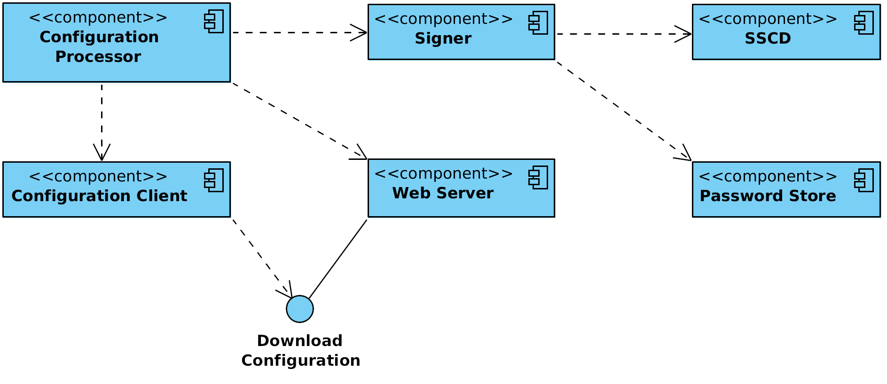
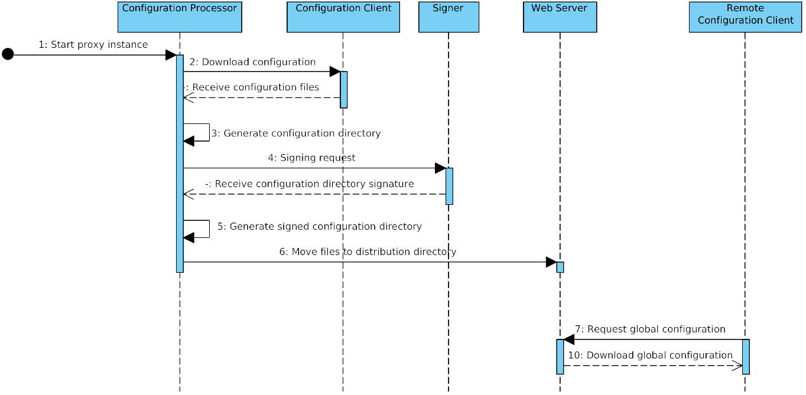
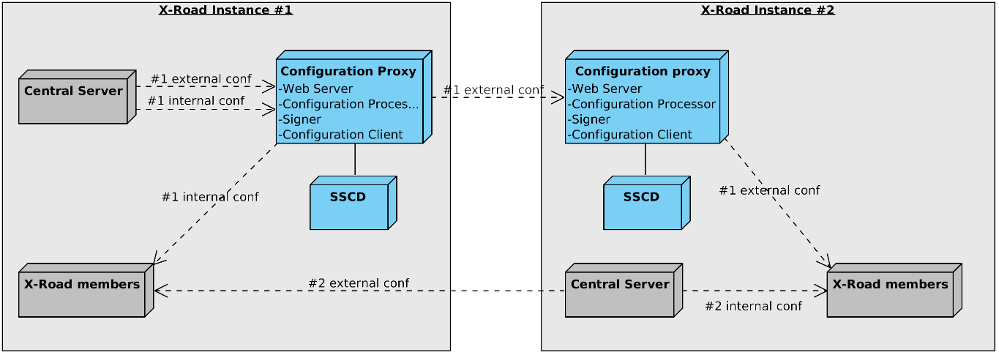

# X-Road: Configuration Proxy Architecture
**Technical Specification**

Version: 1.7  
01.06.2023
<!-- 1 pages -->
 Doc. ID: ARC-CP

## Version history

 Date      | Version | Description                                                                                          | Author
 --------- |---------|------------------------------------------------------------------------------------------------------| --------------------
 05.06.2015 | 0.1     | Initial version                                                                                      | Ilja Kromonov
 03.07.2015 | 0.2     | Added deployment diagram                                                                             | Ilja Kromonov
 08.07.2015 | 0.3     | Added configuration distribution workflow description; updated deployment diagram                    | Ilja Kromonov
 09.09.2015 | 0.4     | Updated diagrams, editorial changes, technology matrix                                               | Ilja Kromonov
 16.09.2015 | 1.0     | Editorial changes made                                                                               | Imbi Nõgisto
 24.09.2015 | 1.1     | Reference added                                                                                      | Kristo Heero
 21.10.2015 | 1.2     | SSCD and passwordstore related information added                                                     | Ilja Kromonov
 24.02.2017 | 1.3     | Converted to Github flavoured Markdown, added license text, adjusted tables for better output in PDF | Toomas Mölder
 19.01.2018 | 1.4     | Matrix of technologies moved to ARC-TEC-file and chapters reordered                                  | Antti Luoma 
 02.03.2018 | 1.5     | Moved terms and abbreviations to terms document                                                      | Tatu Repo
 25.08.2021 | 1.6     | Update X-Road references from version 6 to 7                                                         | Caro Hautamäki
 01.06.2023 | 1.7     | Update references                                                                                    | Petteri Kivimäki

## Table of Contents

<!-- toc -->

- [License](#license)
- [1 Introduction](#1-introduction)
  * [1.1 Overview](#11-overview)
  * [1.2 Terms and Abbreviations](#12-terms-and-abbreviations)
  * [1.3 References](#13-references)
- [2 Component View](#2-component-view)
  * [2.1 Web Server](#21-web-server)
  * [2.2 Configuration Processor](#22-configuration-processor)
  * [2.3 Signer](#23-signer)
  * [2.4 Configuration Client](#24-configuration-client)
  * [2.5 Password Store](#25-password-store)
  * [2.6 SSCD](#26-sscd)
- [3 Interfaces](#3-interfaces)
  * [3.1 Downloading Configuration](#31-downloading-configuration)
- [4 Configuration Distribution Workflow](#4-configuration-distribution-workflow)
- [5 Deployment View](#5-deployment-view)

<!-- tocstop -->

## License

This document is licensed under the Creative Commons Attribution-ShareAlike 3.0 Unported License. To view a copy of this license, visit http://creativecommons.org/licenses/by-sa/3.0/

## 1 Introduction

This document describes the architecture of the X-Road configuration proxy. For more information about X-Road and the role of the configuration proxy see \[[ARC-G](#Ref_ARC-G)\].

This document presents an overview of the components of the configuration proxy and the interfaces between these components. It is aimed at technical readers who want to acquire an overview of inner workings of the configuration proxy.

### 1.1 Overview

The configuration proxy acts as an intermediary between X-Road servers in the matters of global configuration exchange.

The goal of the configuration proxy is to download an X-Road global configuration from a provided configuration source and further distribute it in a secure way. Optionally, the downloaded global configuration may be modified to suit the requirements of the configuration proxy owner.

The configuration proxy can be configured to mediate several global configurations (from multiple configuration sources).

### 1.2 Terms and Abbreviations

See X-Road terms and abbreviations documentation \[[TA-TERMS](#Ref_TERMS)\].

### 1.3 References

1. \[ARC-G\] X-Road Architecture. Document ID: [ARC-G](arc-g_x-road_arhitecture.md).

2. \[PR-GCONF\] X-Road: Protocol for Downloading Configuration. Document ID: [PR-GCONF](../Protocols/pr-gconf_x-road_protocol_for_downloading_configuration.md).

3. \[PKCS11\] Cryptographic Token Interface Standard. RSA Laboratories, PKCS\#11.

4. \[UG-CP\] X-Road v7 Configuration Proxy Manual. Document ID: [UG-CP](../Manuals/ug-cp_x-road_v6_configuration_proxy_manual.md).

5. \[ARC-TEC\] X-Road technologies. Document ID: [ARC-TEC](arc-tec_x-road_technologies.md).

6. \[TA-TERMS\] X-Road Terms and Abbreviations. Document ID: [TA-TERMS](../terms_x-road_docs.md).

## 2 Component View

[Figure 1](#Ref_Configuration_proxy_component_diagram) shows the main components and interfaces of the X-Road configuration proxy. The components and the interfaces are described in detail in the following sections.

Figure 1. Configuration proxy component diagram

Technologies used in the configuration proxy can be found here: \[[ARC-TEC](#Ref_ARC-TEC)\]

### 2.1 Web Server

The global configuration files the configuration proxy generates need to be made available to configuration clients. The HTTP-based protocol used for downloading configuration is described in \[[PR-GCONF](#Ref_PR-GCONF)\]. Technically, the configuration consists of a set of files that are shared out using standard web server (nginx\[[1](#Ref_1)\] web server is used). The configuration processor component prepares and signs the configuration files and then copies them to the web server's output directory where they are distributed via standard means. See [Section 3.1](#31-downloading-configuration) for details on configuration distribution.

\[1\] See [*http://nginx.org/*](http://nginx.org/) for details.

### 2.2 Configuration Processor

A configuration processor is responsible for initiating the download of global configuration files for the configured X-Road instance and preparing them for distribution to configuration clients.

A cron job configured on the server periodically (every minute) starts the configuration processor, which sequentially performs it's functions for all configured configuration proxy instances.

### 2.3 Signer

The signer component is responsible for managing the keys and certificates used for signing the global configuration. Signer is called from the configuration processor to create the signature for the configuration.

### 2.4 Configuration Client

The configuration client is responsible for downloading remote global configuration files. The source location of the global configuration is taken from the anchor file that the configuration processor provides when invoking the configuration client.

### 2.5 Password Store

Stores security token passwords in a shared memory segment of the operating system that can be accessed by the signer. Allows security token logins to persist, until the configuration proxy is restarted, without compromising the passwords.

### 2.6 SSCD

The SSCD (Secure Signature Creation Device) is an optional hardware component that provides secure cryptographic signature creation capability to the signer.

The SSCD needs to be a PKCS \#11 (see \[[PKCS11](#Ref_PKCS11)\]) compliant hardware device that can be optionally used by the configuration proxy for signing the generated global configuration files it generates. The use of the interface requires that a PKCS \#11 compliant device driver is installed and configured in the configuration proxy system.

## 3 Interfaces

### 3.1 Downloading Configuration

Configuration clients download the generated global configuration files from the configuration proxy (protocol used for downloading configuration is described in \[[PR-GCONF](#Ref_PR-GCONF)\]). The configuration proxy uses this interface to download global configuration files from a remote configuration source.

The configuration download interface is a synchronous interface that is provided by the configuration proxy. It is used by configuration clients such as security servers and other configuration proxies.

The interface is described in more detail in \[[ARC-G](#Ref_ARC-G)\].

Should the configuration proxy fail to download the global configuration files from a remote configuration source, no updated configuration directory will be generated for that source's configuration proxy instance. The old configuration directory will remain valid until it's validity period expires.

## 4 Configuration Distribution Workflow

X-Road configuration proxy periodically downloads the global configuration from configured sources. Each global configuration consists of a number of XML files (see \[[PR-GCONF](#Ref_PR-GCONF)\] for detailed information about configuration structure). The configuration proxy then redistributes the downloaded configuration files to other configuration clients.

Configuration files are distributed in accordance with the protocol for downloading configuration (see [Section 3.1](#31-downloading-configuration)). MIME messages are generated to represent configuration directories of the global configurations being distributed.

The configuration proxy can distribute files from as many configuration sources as necessary. For each configuration source a configuration proxy instance is configured.

The following process is performed for each configuration proxy instance.

1.  A cron job sends a request to start the configuration processor for the given configuration proxy instance.

2.  Configuration processor component calls the configuration client to download the global configuration files from the configured source.

3.  Configuration processor component generates configuration directory referencing the downloaded files.

4.  Configuration processor component sends a signing request (containing hash of the directory) to the signer component. Signer signs the hash and responds with the signature.

5.  Configuration processor component updates the configuration directory to contain the received signature.

6.  Configuration processor component moves the configuration files to the distribution directory of the web server.

7.  Security servers make HTTP requests and download the configuration.

This process is illustrated in the sequence diagram in [figure 2](#Ref_Configuration_creation_sequence_diagram).

Figure 2. Configuration creation sequence diagram

## 5 Deployment View

The configuration proxy is deployed on a separate server on the configuration provider's side and, optionally, on the configuration client's side as well.

[Figure 3](#Ref_Configuration_proxy_deployment_example) shows a possible deployment scenario for the configuration proxy. In the presented scenario the instance \#1 central server is distributing it's internal and external configuration through a configuration proxy to instance \#1 members and an instance \#2 configuration proxy, respectively. The instance \#2 central server distributes it's internal configuration directly to instance \#2 members and it's external configuration directly to instance \#1 members.

Figure 3. Configuration proxy deployment example

Optionally, an SSCD can be connected with the configuration proxy if global configuration signatures are to be provided by a cryptographic hardware device.

For detailed information on installing and configuring the configuration proxy refer to the configuration proxy manual \[[UG-CP](#Ref_UG-CP)\].
