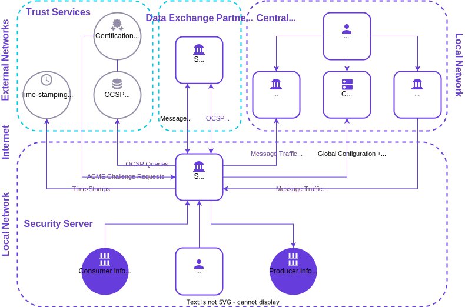

# X-Road Security Architecture

**Technical Specification**

Version: 0.8  
01.06.2023

Doc. ID: ARC-SEC

---

## Version history

 Date       | Version | Description                                    | Author
 ---------- |---------|------------------------------------------------| --------------------
 20.06.2019 | 0.1     | Initial version                                | Niall O’Donoghue
 27.06.2019 | 0.2     | Converted to Github flavoured Markdown         | Petteri Kivimäki
 29.06.2019 | 0.3     | Editorial changes, updated chapters 5-7, 14-18 | Petteri Kivimäki
 28.02.2021 | 0.4     | Update X-Road security architecture diagram    | Petteri Kivimäki
 25.08.2021 | 0.5     | Update X-Road references from version 6 to 7   | Caro Hautamäki
 07.09.2021 | 0.6     | Update with the new message log features       | Ilkka Seppälä
 23.09.2022 | 0.7     | Added new Registration Web Service             | Eneli Reimets
 01.06.2023 | 0.8     | Update references                              | Petteri Kivimäki

## Table of Contents

<!-- toc -->

- [X-Road Security Architecture](#x-road-security-architecture)
  - [Version history](#version-history)
  - [Table of Contents](#table-of-contents)
  - [License](#license)
  - [1 Introduction](#1-introduction)
    - [1.1 Terms and Abbreviations](#11-terms-and-abbreviations)
    - [1.2 References](#12-references)
  - [2 Environment Assumptions](#2-environment-assumptions)
  - [3 Confidentiality](#3-confidentiality)
  - [4 Integrity](#4-integrity)
  - [5 Availability](#5-availability)
  - [6 Authentication](#6-authentication)
  - [7 Access Control](#7-access-control)
    - [7.1 Messaging Access Control](#71-messaging-access-control)
    - [7.2 Web UI Access Control](#72-web-ui-access-control)
  - [8 Input Validation](#8-input-validation)
    - [8.1 Web UI Input Validation](#81-web-ui-input-validation)
    - [8.2 Messaging Validation](#82-messaging-validation)
  - [9 Logging](#9-logging)
  - [10 Time-Stamping](#10-time-stamping)
  - [11 Updatability](#11-updatability)
  - [12 Trust Federation](#12-trust-federation)
  - [13 Standardised Protocols](#13-standardised-protocols)
  - [14 Central Server](#14-central-server)
  - [15 Security Server](#15-security-server)
  - [16 Certificates and Keys Management](#16-certificates-and-keys-management)
  - [17 Monitoring](#17-monitoring)
    - [17.1 Environmental Monitoring](#171-environmental-monitoring)
    - [17.2 Operational Monitoring](#172-operational-monitoring)
    - [17.3 Controlling Access to Monitoring](#173-controlling-access-to-monitoring)
  - [18 Privacy](#18-privacy)
    - [18.1 Purpose Limitation](#181-purpose-limitation)
    - [18.2 Data Minimisation](#182-data-minimisation)
  - [19 Regulatory Compliance](#19-regulatory-compliance)
    - [19.1 Common Regulations](#191-common-regulations)
    - [19.2 Environment and Country-Specific Regulations](#192-environment-and-country-specific-regulations)

<!-- tocstop -->

## License

This document is licensed under the Creative Commons Attribution-ShareAlike 3.0 Unported License. To view a copy of this license, visit http://creativecommons.org/licenses/by-sa/3.0/

## 1 Introduction

X-Road is an open source data exchange layer solution that enables organizations to exchange information over the Internet. X-Road is a centrally managed distributed data exchange layer between information systems that provides a standardized and secure way to produce and consume services. For a more in-depth introduction to X-Road, refer to the X-Road Architecture \[[ARC-G](../Architecture/arc-g_x-road_arhitecture.md)\].

This document describes the X-Road security architecture and how it fulfills security and privacy principles and best practices. Technical descriptions and guides for X-Road components and protocols are found in separate documents. 

Figure 1 X-Road Security Architecture depicts the X-Road environment and its actors and the data exchanges between them. 

Figure 1. X-Road security architecture.

The identity of each organization (X-Road Service Provider or Service Consumer) and technical entry point (Security Server) is verified using certificates that are issued by a trusted Certification Authority (CA) when an organization joins an X-Road ecosystem. The identities are maintained centrally, but all the data is exchanged directly between a consumer and provider. Message routing is based on organization and service level identifiers that are mapped to physical network locations of the services by X-Road. All the evidence regarding data exchange is stored locally by the data exchange parties, and no third parties have access to the data. Time-stamping and digital signature together guarantee non-repudiation of the data sent via X-Road.

### 1.1 Terms and Abbreviations

See X-Road terms and abbreviations documentation \[[TA-TERMS](#Ref_TERMS)\].

### 1.2 References

1. \[ARC-G\] X-Road Architecture. Document ID: [ARC-G](arc-g_x-road_arhitecture.md).
2. \[TA-TERMS\] X-Road Terms and Abbreviations. Document ID: [TA-TERMS](../terms_x-road_docs.md).
3. \[PKCS10\] Certification Request Syntax Standard. RSA Laboratories, PKCS \#10.
4. \[UG-SS\] X-Road 7. Security Server User Guide. Document ID: [UG-SS](../Manuals/ug-ss_x-road_6_security_server_user_guide.md)
5. \[UG-CS\] X-Road 7. Central Server User Guide. Document ID: [UG-CS](../Manuals/ug-cs_x-road_6_central_server_user_guide.md)
6. \[EIDAS\] EU Regulation No 910/2014 – Regulation (EU) No 910/2014 of the European Parliament and of the Council of 23 July 2014 on electronic identification and trust services for electronic transactions in the internal market and repealing Directive 1999/93/EC
7. \[BATCH-TS\] Freudenthal, Margus. Using Batch Hashing for Signing and Time-Stamping. Cybernetica Research Reports, T-4-20, 2013.
8. \[UC-FED\] X-Road 7. Use Case Model for Federation. Document ID: [UC-FED](../UseCases/uc-fed_x-road_use_case_model_for_federation_1.1_Y-883-7.md)
9. \[ARC-CS\] X-Road: Central Server Architecture. Document ID: [ARC-CS](arc-cs_x-road_central_server_architecture.md). 
10. \[ARC-SS\] X-Road: Security Server Architecture. Document ID: [ARC-SS](arc-ss_x-road_security_server_architecture.md)
12. \[ARC-ENVMON\] X-Road: Environmental Monitoring Architecture. Document ID: [ARC-ENVMON](../EnvironmentalMonitoring/Monitoring-architecture.md).
13. \[ARC-OPMOND\] X-Road: Operational Monitoring Daemon Architecture. Document ID: [ARC-OPMOND](../OperationalMonitoring/Architecture/arc-opmond_x-road_operational_monitoring_daemon_architecture_Y-1096-1.md).
14. \[GDPR\] EU Regulation No 679/2016 – Regulation (EU) 2016/679 of the European Parliament and of the Council of 27 April 2016 on the protection of natural persons with regard to the processing of personal data and on the free movement of such data, and repealing Directive 95/46/EC

## 2 Environment Assumptions

X-Road facilitates a data bridge infrastructure between a variety of organisational actors, such as government registers, financial institutions, and telecommunications service providers. X-Road is therefore a critical information infrastructure (CII) system essential for the operation and sustainability of data exchange between such X-Road member organisations. Disruption of CII may be caused by a variety of human-induced actions or technical failures. 

X-Road security is therefore designed with CII-equivalence resilience in mind. Organisations must register with and be affiliated to X-Road, and acquire identity and signing certificates and keys, before they can perform data exchange. 

## 3 Confidentiality

For compliance with the security principle of confidentiality, the objective is to limit visibility of X-Road assets (organisational data) to the actors (registered X-Road organisational members) that are authenticated and authorised to see the data. With assurance of confidentiality, the threat being mitigated is the unintended revealing of X-Road assets to unauthorised third parties. 
    
X-Road messages transmitted over the public Internet are secured using digital signatures and encryption. The motivation for bidirectional HTTP over Transport Layer Security (TLS) is to enforce anti-eavesdropping and anti-tampering protections to ensure the integrity and privacy of the messages exchanged between X-Road actors. X-Road-internal TLS certificates are used for setting up the TLS connection between the Security Server and information systems that provide and consume services. 

## 4 Integrity

For compliance with the security principle of integrity, the objective is to ensure that X-Road assets are not modified and do not become corrupted. With assurance of integrity, the threat being mitigated is unauthorised access to and unauthorised actions upon X-Road assets. 

X-Road incorporates a public key infrastructure (PKI) whereby a certification authority (CA) issues authentication certificates to Security Servers and signing certificates to X-Road member organisations. The CA processes certificate signing requests conforming to \[[PKCS10](#Ref_PKCS10)\].

All X-Road messages are signed by the signing key of the organisations that send the messages and all messages are logged. Message logging is enabled by default. This means that both message headers and message bodies are logged. Logging of message bodies may be disabled on Security Server level or for selected subsystems. By default, the logs are stored as plaintext on the Security Server, but encryption can be enabled by the Security Server administrator. It's also possible to install a Security Server with the message log add-on fully disabled.

## 5 Availability

For compliance with the security principle of availability, the objective is to ensure that X-Road assets are readily available to authorised X-Road actors that require them. With assurance of availability, the threat being mitigated is the denial to authorised actors of X-Road services.

Availability is a cornerstone of critical infrastructure. X-Road is designed so that no component is a system-wide bottleneck or point of failure. Security Servers remain operational even if Central Server, OCSP service and/or time-stamping service would fail. The grace period depends on the failing component and configuration of the X-Road instance.

X-Road Security Servers incorporate denial-of-service mitigation functionality. X-Road Linux services will automatically restart after a local system crash. 

To fortify the availability of the entire X-Road system, the service consumer’s/user's and service provider's Security Servers may be set up in a redundant configuration as follows:

  * One service user can use multiple Security Servers in parallel to perform requests.
  * If a service provider connects multiple Security Servers to the network to provide the same services, the requests are load-balanced amongst the Security Servers.
  * If one of the service provider's Security Servers goes offline, the requests are automatically redirected to other available Security Servers.

## 6 Authentication

For compliance with the security principle of authentication, the objective is to ensure that the provenance (identity) of the X-Road asset or X-Road actor is known and verified. This is accomplished in a standardised manner using authentication keys and certificates. With assurance of integrity, the threat being mitigated is unauthorised access to X-Road infrastructure and assets therein.

X-Road enforces organisation-level authentication (and authorization) mechanisms and for X-Road Administrator web application frontend-to-backend connections and direct calls to the backend for configuration and maintenance automation purposes.

An X-Road organisation’s client information system Security Server acts as the entry point to all the X-Road services. The client information system is responsible for implementing an end user authentication and access control mechanism that complies with the requirements of the particular X-Road instance. The identity of the end user may be made available to the service provider by including it in the service request. 

In case a Security Server becomes compromised, it can be blocked from the X-Road instance by revoking its authentication certificate or removing it from the Central Server's configuration. Similarly, a selected member organisation or subsystem can be blocked out centrally without affecting other Security Servers, members or subsystems.

For details on X-Road Administrator web application user management-related authentication, refer to \[[UG-SS](#Ref_UG-SS)\] section 2.

For details on configuring a Security Server’s authentication key and certificate, refer to \[[UG-SS](#Ref_UG-SS)\] section 3.2.

For details on registering a Security Server’s authentication key and certificate in the Central Server, refer to \[[UG-CS](#Ref_UG-SS)\] section 8.3.

## 7 Access Control
 
For compliance with the security principle of least privilege, the objective is to ensure that X-Road actors, processes and controls must be able to access only the X-Road information and resources that are limited to and necessary for the legitimate and intended purpose.

### 7.1 Messaging Access Control

X-Road core handles access control on the organisation level during data exchange between registered X-Road members. A service provider is responsible for managing access rights to its services. Publishing services via X-Road does not automatically provide other members access to the services. 

### 7.2 Web UI Access Control

When the end user is successfully authenticated, least privilege-based access control is enforced for access to system resources whereby the frontend receives information about current user's roles and permissions using /api/user resource. The backend defines authorisation rules based on permissions.

Details on Security Server user roles and associated access controls are described in section 15 Security Server Roles.

In X-Road, access control starts by denying all access by default. Access will not be allowed to all roles if a new resource is added and authorisation is somehow configured incorrectly.

## 8 Input Validation

For compliance with the principle of sanitised input, it is security best practice to validate all inputs at the server. X-Road has two validation aspects; a) web UI input validation and b) messaging validation.

### 8.1 Web UI Input Validation

User input parsing is enforced in the Central Server UI and the Security Server UI, whereby there is removal of leading and trailing whitespaces, verification that that all mandatory fields are filled, and verification that the user input does not exceed 255 characters.

If one or more mandatory fields are not filled, it results in a “Missing parameter: 'X'" error message. If  user input exceeds 255 characters, it results in a “Parameter 'X' input exceeds 255 characters” error message.

### 8.2 Messaging Validation 

When input contains XML, it must be validated against its schema before using it. XML injection attacks are mitigated by ensuring that XML input follows the rules specified in the schema. Down-stream errors that might be caused from invalid XML input are mitigated by validating the XML at the earliest point where it crosses a trust boundary.

## 9 Logging

For compliance with the security principle of non-repudiation, all messages processed by X-Road are usable as digital evidence. The technical solution complies with requirements for digital seals according to regulation for electronic identification and trust services for electronic transactions \[[EIDAS](#Ref_EIDAS)\]. EIDAS defines two levels for digital seals: 1) advanced and 2) qualified. Qualified digital seals require that a hardware security module (HSM) device must be used for storing private keys and the CA issuing the certificates must be present in the EU’s list of trusted trust service providers. X-Road supports HSMs and X-Road operators can choose the CAs that are used in their environments. If these requirements are not met, then the digital seals created by X-Road are advanced instead of qualified.

X-Road incorporates the following logs:

  * **Audit log** – log where user-configured changes to the system state or configuration (via the user interface) are logged, regardless of whether the outcome was a success or failure.
  * **Message log** – provides the means to prove the reception of a regular request or response message to a third party. Messages exchanged between Security Servers are signed and encrypted. For every regular request and response, the Security Server produces a complete signed and timestamped document. Messages are logged and provided with a batch signature. The purpose of the message log is to provide the means to prove to a third party the reception of a request/response message. The Security Server messagelog saves each request and response message sent through the Security Server to the messagelog database. There is one log record inserted per transaction. Periodically (by default every six hours), the log archiver reads all non-archived records from the database, writes them to disk, and updates the records in the database, marking them as archived. By default, all the message archives on the disk are grouped together, but it's possible to group them by member or subsystem by adjusting the settings.  Every twelve hours, the log cleaner executes a bulk delete removal of all archived records that are older than a configurable age; the default is thirty days. Message archiving interval lengths are configurable via configuration settings. The stored messages can be encrypted at rest; the configuration settings allow switching on encryption for messagelog and message archives separately. The Security Server administrator is responsible for transferring the archived log files into long term storage. Such storage components are organisation-specific.
  * **System service log** – log which is made from a running system service of a Security Server, for example from xroad-confclient, -proxy, signer services.

If a message log audit is required, message logs for some time period may be queried; this creates a zip file that contains the logs in a tamper-resistant format (signed hash of the log tree). 

## 10 Time-Stamping

Also related to the security principle of non-repudiation (and integrity), a time-stamping authority enforces use of a time-stamping protocol by Security Servers to ensure long-term proof value of exchanged messages. The issued time stamps certify the existence of the messages at a certain point of time and the Security Servers log all of the messages and their signatures. These logs are periodically time-stamped to create long-term proof.

X-Road uses batch time-stamping (refer to \[[BATCH-TS](#Ref_BATCH-TS)\]). This reduces the load of the time-stamping service. The load does not depend on the number of messages exchanged over the X-Road, rather it depends on the number of Security Servers in the system.

X-Road supports creating time-stamps synchronously for each message too. Using synchronous time-stamping may be a security policy requirement to guarantee the time-stamp at the time of logging the message. However, batch time-stamping is the default for performance and availability reasons.

The time-stamping feature is directly related to message logging. If the message log add-on is disabled, no time-stamping will occur. However, disabling only message body logging does not affect time-stamping.

## 11 Updatability

X-Road is designed to enable reliable installation of software updates including security updates. X-Road software packages are signed so that their origins are traceable. 

## 12 Trust Federation

The trust federation of X-Road instances allows for the members of one X-Road instance to use the services provided by members of the other instance, thus making the X-Road systems interoperable.

To make the federating systems aware of each other, the external configuration anchor of the federation partner must be uploaded as a trusted anchor to the Central Servers of the federating X-Road instances.

The trusted anchors are distributed to the Security Servers as a part of the internal configuration. The Security Servers use the trusted anchors to download external configuration from the federation partners. The external configuration contains the information that the Security Servers of the partner instances need to communicate with each other.

To end a federation relationship with an X-Road instance, the trusted anchor of that instance must be deleted from the Central Server.

For further information on X-Road Trust Federation, refer to \[[UC-FED](#Ref_UC-FED)\].

## 13 Standardised Protocols

For compliance with security principle of economy of mechanism, X-Road member organizations are not required to implement security-dependent methods for data exchange; they are able to connect to any number of service providers via the following standardized protocols that ensure security-supportive functional consistency. For details of X-Road protocols, refer to the Technical Architecture \[[ARC-G](#Ref_ARC-G)\]. Summaries of the protocols are as follows:

  * Message Protocol is used by service client and service provider information systems for communicating with the X-Road Security Server.
  * Message Transport Protocol is used by Security Server to exchange service requests and service responses. The protocol is based on HTTPS and uses mutual certificate-based TLS authentication.
  * Configuration Download Protocol is a synchronous protocol that is offered by the Central Server. Configuration clients download the generated global configuration files from the Central Server. It is used by configuration clients such as Security Servers and configuration proxies.
  * Service Metadata Protocol may be used by the service client information systems to gather information about the X-Road instance and may be used to find X-Road members.
  * Download Signed Document Protocol may be used by the information systems to download signed containers from the Security Server's message log. In addition, the service provides a convenience method for downloading global configuration that may be used to verify the signed containers.
  * Management Services Protocol is used by Security Servers to perform management tasks such as registering a Security Server client or deleting an authentication certificate. The Management Services Protocol is implemented by two web services: Member Management Web Service and Registration Web Service. The Member Management Web Service is implemented as a standard X-Road service that is offered by the organization managing the X-Road instance. The Member Management Web Service is accessed by Security Servers through the management Security Server. Instead, the Registration Web Service is implemented as a separate web service that is accessed directly by Security Servers. Both web services translate the incoming SOAP requests to REST calls for the Central Server management REST API. 
  * Online Certificate Status Protocol (OCSP) is used by the Security Servers to query the validity information about the signing and authentication certificates. OCSP protocol is a synchronous protocol that is offered by the OCSP responder belonging to a certification authority. In X-Road, each Security Server is responsible for downloading and caching the validity information about its certificates. The OCSP responses are sent to the other Security Servers as part of the message transport protocol to ensure that the Security Servers do not need to discover the OCSP service used by the other party. 
  * Time-Stamping Protocol is used by Security Servers to ensure long-term proof value of  exchanged messages. The Security Servers log all messages and their signatures. These logs are periodically time-stamped to create long-term proof. Time-stamping is used in an asynchronous manner, so temporary unavailability of the time-stamping service does not directly affect the X-Road message exchange.

## 14 Central Server

The Central Server manages the database of X-Road members and Security Servers. In addition, the Central Server contains the security policy of the X-Road instance. The security policy consists of the following: 

  * list of trusted certification authorities,
  * list of trusted time-stamping authorities,
  * tuneable parameters such as maximum allowed lifetime of an OCSP response.
   
Both the member database and the security policy are made available to the Security Servers via the HTTP protocol. This distributed set of data forms the global configuration. The integrity of the global configuration is guaranteed using digital signatures - the Central Server signs the global configuration, and the signature is verified by the Security Servers.

The set of information that is needed to access the configuration source and to verify the downloaded global configuration is distributed to the Security Servers using the configuration anchor. The configuration anchor is an XML file, and it is uploaded to the Seuciry Server by the Security Server administrator during the initialization process. The X-Road operator is responsible for providing the configuration anchor to the new member organisations.

For Central Server components, refer to \[[ARC-CS](#Ref_ARC-CS)\] section 2.

For Central Server roles, refer to \[[UG-CS](#Ref_UG-CS)\] section 2.

## 15 Security Server

The main function of a Security Server is to mediate requests in a way that preserves their evidential value. The Security Server is connected to the public Internet from one side and to the information system within the organization's internal network from the other side (refer to Figure 1 X-Road Security Architecture). The Security Server is equipped with the functionality required to secure the message exchange between a client and a service provider.

A Security Server instance is an independent and separately identifiable entity. A Security Server identity consist of a server identifier (member id + server code). For each server identifier there may be multiple authentication certificates present locally, each of which must be unique. However, only one authentication certificate must be active and registered on the Central Server at a time. In addition, each Security Server has an address (DNS name or IP address) which is not required to be unique. The global configuration binds together the authentication certificate(s), server identifier and address. The authentication certificate may contain information about the service identifier; however this is optional. Also, the server address and the common name or alternate subject names in the authentication certificate may be different.

Messages transmitted over the public Internet are secured using digital signatures and TLS (HTTPS) encryption. On every connection, the Security Server verifies that the authentication certificate of the other Security Server:

  * is issued by an approved certification authority
  * matches the authentication certificate registered to the Security Server on the global configuration
  * has a valid OCSP response available.
  
If any of the above verifications fail, the message is not processed further and an error message is returned.

The service provider's Security Server applies access control to incoming messages, thus ensuring that only those X-Road members (consumer information systems) that have been explicitly allowed access can access a service. Managing access rights of a service is the responsibility of the administrator of the service provider's Security Server.

For Security Server components, refer to \[[ARC-SS](#Ref_ARC-SS)\] section 2.

For Security Server roles, refer to \[[UG-SS](#Ref_UG-SS)\] section 2.

## 16 Certificates and Keys Management

Only certificates issued by approved certification authorities can be used in X-Road. Approved certification authorities are defined on the Central Server and the configuration is environment specific. It is possible to have multiple approved certification authorities within an X-Road instance. 

Security Server authentication key and certificate are stored on a software token. Central Server and Security Server signing keys and certificates can be stored on a software token or an HSM device.

The signer component is responsible for managing signing keys and certificates. The signer is called by other components when creating or verifying signatures. The user interface also calls the signer when generating authentication and signing keys or certificate requests.

By default, X-Road utilises 2048 bit RSA keys as authentication and signing keys/certificates. The key length may be configured using the Security Server system parameters. Longer keys may be utilised in X-Road without compatibility issues; 2k, 3k and 4k keys may be simultaneously utilised.

## 17 Monitoring

X-Road monitoring is conceptually split into environmental and operational monitoring. 

### 17.1 Environmental Monitoring
   
Environmental monitoring provides details of the Security Servers such as operating system, memory, disk space, CPU load, running processes, installed packages, X-Road version information etc.

It is possible to limit the environmental monitoring data set that is returned to the central monitoring client. The limited data set includes certificate, operating system and X-Road version information.

For more in-depth technical details of the environmental monitoring architecture, refer to \[[ARC-ENVMON](#Ref_ARC-ENVMON)\].

### 17.2 Operational Monitoring

Operational monitoring collects data about request exchange between Security Servers. The data includes, but is not limited to:

  * ID-s of the client and the service
  * various attributes of the message read from the message header
  * request and response timestamps
  * message size and processing time

For more in-depth technical details of the operation monitoring architecture, refer to \[[ARC-OPMOND](#Ref_ARC-OPMOND)\].

### 17.3 Controlling Access to Monitoring 

Both environmental and operational monitoring queries are allowed from

  * a client that is the owner of the Security Server
  * a central monitoring client (if any have been configured)
  
In addition, a regular client is allowed to query its own operational monitoring records - records that are associated with the client sending the query.

The central monitoring client is configured via Central Server administrator user interface. Attempts to query monitoring data from other clients results in an AccessDenied system response.

## 18 Privacy

Security best practice supports and facilitates privacy best practice. Privacy involves Personally Identifiable Information (PII) which is any data (including IP addresses) that allow the identification of a person, any data that the person has disclosed to an X-Road operator, or the person’s or other person’s data that are in their possession, including Personal data. 

X-Road is obligated to comply with the General Protection Data Regulation (GDPR) that stipulates how personal data must be processed in any operation performed on personal data, including collection, recording, organization, storage, alteration, disclosure, granting access to personal data, consultation and retrieval, use of personal data, communication, cross-usage, combination, closure, erasure, destruction, or several of the aforementioned operations, regardless of the manner in which the operations are carried out or the means used.

When GDPR (or any other rule/regulation) must be applied, an X-Road member organisation is responsible for maintaining and operating its Security Server(s) in a manner that is compliant with the rule/regulation. 

### 18.1 Purpose Limitation

X-Road data is communicated, processed and stored only for the specified, explicit and legitimate intended purposes and not in any manner that is incompatible with X-Road data purposes and X-Road security policy.

X-Road data purposes and X-Road security policy are member organisation and X-Road instance specific, and they may be influenced by local interpretations of both national and international legislation.

### 18.2 Data Minimisation

X-Road data is limited to what is adequate, relevant and necessary in relation to the purposes for which data are processed.

## 19 Regulatory Compliance

X-Road is obligated to comply with security requirements stipulated by the following regulatory bodies:

### 19.1 Common Regulations

Common European Union (EU) regulations:

  * EIDAS – Regulation (EU) No 910/2014 of the European Parliament and of the Council of 23 July 2014 on electronic identification and trust services for electronic transactions in the internal market. Refer to \[[EIDAS](#Ref_EIDAS)\]. 
  * GDPR – General Data Protection Regulation (EU) 2016/679 of the European Parliament and of the Council of 27 April 2016 on the protection of natural persons with regard to the processing of personal data and on the free movement of such data. Refer to \[[GDPR](#Ref_GDPR)\].

### 19.2 Environment and Country-Specific Regulations

Environment and country-specific regulations:

  * VAHTI – Information security standard that is developed for the Finnish public sector. VAHTI is compulsory for Finnish state and local government organisations who handle databases/registers.
  * ISKE - Information security standard that is developed for the Estonian public sector. ISKE is compulsory for Estonian state and local government organisations who handle databases/registers.
