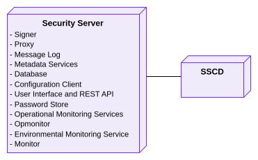

# X-Road: Security Server Architecture <!-- omit in toc -->

**Technical Specification** <!-- omit in toc -->

Version: 1.16
01.06.2023
<!-- 15 pages -->
Doc. ID: ARC-SS

---

## Version history <!-- omit in toc -->

| Date       | Version | Description                                                                                          | Author             |
|------------|---------|------------------------------------------------------------------------------------------------------|--------------------|
| 09.07.2015 | 0.1     | Initial version                                                                                      | Ilja Kromonov      |
| 08.09.2015 | 0.2     | Rearranged references, made some editorial changes                                                   | Margus Freudenthal |
| 09.09.2015 | 0.3     | Editorial changes, simplified deployment, technology matrix                                          | Margus Freudenthal |
| 15.09.2015 | 0.4     | Audit log                                                                                            | Kristo Heero       |
| 15.09.2015 | 0.5     | Message log updated                                                                                  | Kristo Heero       |
| 16.09.2015 | 0.6     | Incorporated feedback from Vitali                                                                    | Margus Freudenthal |
| 17.09.2015 | 1.0     | Editorial changes made                                                                               | Imbi Nõgisto       |
| 21.10.2015 | 1.1     | SSCD and password store related information added                                                    | Ilja Kromonov      |
| 16.12.2015 | 1.2     | Incorporated environmental monitoring                                                                | Ilkka Seppälä      |
| 19.12.2016 | 1.3     | Added operational monitoring                                                                         | Kristo Heero       |
| 20.02.2017 | 1.4     | Converted to Github flavoured Markdown, added license text, adjusted tables for better output in PDF | Toomas Mölder      |
| 19.01.2018 | 1.5     | Matrix of technologies moved to ARC-TEC-file and chapters reordered                                  | Antti Luoma        |
| 02.03.2018 | 1.6     | Moved terms and abbreviations to terms document, added terms reference and document links            | Tatu Repo          |
| 17.04.2019 | 1.7     | Added X-Road Message Protocol for REST                                                               | Petteri Kivimäki   |
| 31.10.2019 | 1.8     | Added chapter 3 [process view](#3-process-view)                                                      | Ilkka Seppälä      |
| 21.08.2020 | 1.9     | Update for RHEL 8                                                                                    | Jarkko Hyöty       |
| 10.09.2020 | 1.10    | Updates for API based UI                                                                             | Janne Mattila      |
| 07.09.2021 | 1.11    | Update for encryption features                                                                       | Ilkka Seppälä      |
| 24.11.2021 | 1.12    | Fixed broken links and duplicate heading                                                             | Raido Kaju         |
| 03.05.2022 | 1.13    | Update `xroad-addon-messagelog` process section                                                      | Petteri Kivimäki   |
| 01.06.2023 | 1.14    | Update references                                                                                    | Petteri Kivimäki   |
| 20.06.2023 | 1.15    | Fixed Security Server Admin API OpenAPI specification link                                           | Madis Loitmaa      |
| 03.10.2023 | 1.16    | Remove Akka references                                                                               | Ričardas Bučiūnas  |

## Table of Contents <!-- omit in toc -->

<!-- toc -->

- [License](#license)
- [1 Introduction](#1-introduction)
  - [1.1 Overview](#11-overview)
  - [1.2 Terms and Abbreviations](#12-terms-and-abbreviations)
  - [1.3 References](#13-references)
- [2 Component View](#2-component-view)
  - [2.1 Proxy](#21-proxy)
  - [2.2 Message Log](#22-message-log)
  - [2.3 Metadata Services](#23-metadata-services)
  - [2.4 Operational Monitoring Services](#24-operational-monitoring-services)
  - [2.5 Opmonitor](#25-opmonitor)
  - [2.6 Signer](#26-signer)
  - [2.7 Database](#27-database)
  - [2.8 User Interface Frontend](#28-user-interface-frontend)
  - [2.9 Management REST API](#29-management-rest-api)
  - [2.10 Configuration Client](#210-configuration-client)
  - [2.11 Password Store](#211-password-store)
  - [2.12 SSCD](#212-sscd)
  - [2.13 Environmental Monitoring Service](#213-environmental-monitoring-service)
  - [2.14 Monitor](#214-monitor)
- [3 Process View](#3-process-view)
  - [3.1 xroad-proxy-ui-api](#31-xroad-proxy-ui-api)
    - [3.1.1 Role and responsibilities](#311-role-and-responsibilities)
    - [3.1.2 Encapsulated data](#312-encapsulated-data)
    - [3.1.3 Messaging](#313-messaging)
    - [3.1.4 Input/output ports](#314-inputoutput-ports)
    - [3.1.5 Persistent data](#315-persistent-data)
  - [3.2 xroad-signer](#32-xroad-signer)
    - [3.2.1 Role and responsibilities](#321-role-and-responsibilities)
    - [3.2.2 Encapsulated data](#322-encapsulated-data)
    - [3.2.3 Messaging](#323-messaging)
    - [3.2.4 Input/output ports](#324-inputoutput-ports)
    - [3.2.5 Persistent data](#325-persistent-data)
  - [3.3 xroad-confclient](#33-xroad-confclient)
    - [3.3.1 Role and responsibilities](#331-role-and-responsibilities)
    - [3.3.2 Encapsulated data](#332-encapsulated-data)
    - [3.3.3 Messaging](#333-messaging)
    - [3.3.4 Input/output ports](#334-inputoutput-ports)
    - [3.3.5 Persistent data](#335-persistent-data)
  - [3.4 xroad-proxy](#34-xroad-proxy)
    - [3.4.1 Role and responsibilities](#341-role-and-responsibilities)
    - [3.4.2 Encapsulated data](#342-encapsulated-data)
    - [3.4.3 Messaging](#343-messaging)
    - [3.4.4 Input/output ports](#344-inputoutput-ports)
    - [3.4.5 Persistent data](#345-persistent-data)
  - [3.5 postgresql](#35-postgresql)
    - [3.5.1 Role and responsibilities](#351-role-and-responsibilities)
    - [3.5.2 Encapsulated data](#352-encapsulated-data)
    - [3.5.3 Messaging](#353-messaging)
    - [3.5.4 Input/output ports](#354-inputoutput-ports)
    - [3.5.5 Persistent data](#355-persistent-data)
  - [3.6 xroad-monitor](#36-xroad-monitor)
    - [3.6.1 Role and responsibilities](#361-role-and-responsibilities)
    - [3.6.2 Encapsulated data](#362-encapsulated-data)
    - [3.6.3 Messaging](#363-messaging)
    - [3.6.4 Input/output ports](#364-inputoutput-ports)
    - [3.6.5 Persistent data](#365-persistent-data)
  - [3.7 xroad-opmonitor](#37-xroad-opmonitor)
    - [3.7.1 Role and responsibilities](#371-role-and-responsibilities)
    - [3.7.2 Encapsulated data](#372-encapsulated-data)
    - [3.7.3 Messaging](#373-messaging)
    - [3.7.4 Input/output ports](#374-inputoutput-ports)
    - [3.7.5 Persistent data](#375-persistent-data)
  - [3.8 xroad-addon-messagelog](#38-xroad-addon-messagelog)
    - [3.7.1 Role and responsibilities](#371-role-and-responsibilities-1)
    - [3.7.2 Encapsulated data](#372-encapsulated-data-1)
    - [3.7.3 Persistent data](#373-persistent-data)
- [4 Interfaces](#4-interfaces)
  - [4.1 Management Services](#41-management-services)
  - [4.2 Download Configuration](#42-download-configuration)
  - [4.3 Message Protocol](#43-message-protocol)
  - [4.4 Message Transport Protocol](#44-message-transport-protocol)
  - [4.5 Service Metadata Protocol](#45-service-metadata-protocol)
  - [4.6 Downloading Signed Documents](#46-downloading-signed-documents)
  - [4.7 TSP](#47-tsp)
  - [4.8 OCSP](#48-ocsp)
  - [4.9 Operational Monitoring Protocol](#49-operational-monitoring-protocol)
  - [4.10 Store Operational Monitoring Data](#410-store-operational-monitoring-data)
  - [4.11 Operational Monitoring Query](#411-operational-monitoring-query)
  - [4.12 Environmental Monitoring Protocol](#412-environmental-monitoring-protocol)
  - [4.13 Environmental Monitoring JMX](#413-environmental-monitoring-jmx)
- [5 Deployment View](#5-deployment-view)
  - [5.1 Simple Deployment](#51-simple-deployment)
  - [5.2 Redundant Deployment](#52-redundant-deployment)

<!-- tocstop -->

## License

This document is licensed under the Creative Commons Attribution-ShareAlike 3.0 Unported License. To view a copy of this license, visit http://creativecommons.org/licenses/by-sa/3.0/

## 1 Introduction

This document describes the architecture of the X-Road security server. For more information about X-Road and the role of the security server see \[[ARC-G](#Ref_ARC-G)\].

This document presents an overview of the components of the security server and the interfaces between these components. It is aimed at technical readers who want to acquire an overview of inner workings of the security server.

Only the technical specification of the security server components is provided, for specific examples of interoperability between these components see \[[UC-MESS](#Ref_UC-MESS)\].

### 1.1 Overview

The main function of a security server is to mediate requests between a service client and a service provider. Both the client and the provider communicate with the security server that is connected to their information system and the secure message exchange between the two parties is then handled by the security servers.

-   Messages transmitted over the public Internet are secured using digital signatures and encryption.

-   The service provider's security server applies access control to incoming messages, thus ensuring that only those users that have signed an appropriate agreement with the service provider can access the data.

The security server also depends on a central server, which provides the global configuration.

### 1.2 Terms and Abbreviations

See X-Road terms and abbreviations documentation \[[TA-TERMS](#Ref_TERMS)\].

### 1.3 References

1. \[ARC-G\] X-Road Architecture. Document ID: [ARC-G](arc-g_x-road_arhitecture.md).

2. \[ARC-OPMOND\] X-Road: Operational Monitoring Daemon Architecture. Document ID: [ARC-OPMOND](../OperationalMonitoring/Architecture/arc-opmond_x-road_operational_monitoring_daemon_architecture_Y-1096-1.md).

3. \[BATCH-TS\] Freudenthal, Margus. Using Batch Hashing for Signing and Time-Stamping. Cybernetica Research Reports, T-4-20, 2013.

4. \[DM-SS\] X-Road: Security Server Configuration. Document ID: [DM-SS](../DataModels/dm-ss_x-road_security_server_configuration_data_model.md).

5. \[SPEC-AL\] X-Road: Audit log events. Document ID: [SPEC-AL](https://github.com/nordic-institute/X-Road/blob/master/doc/Architecture/spec-al_x-road_audit_log_events.md).

6. \[OCSP\] X.509 Internet Public Key Infrastructure Online Certificate Status Protocol - OCSP. Internet Engineering Task Force, RFC 6960, 2013.

7. \[PKCS11\] Cryptographic Token Interface Standard. RSA Laboratories, PKCS\#11.

8. \[PR-GCONF\] X-Road: Protocol for Downloading Configuration. Document ID: [PR-GCONF](../Protocols/pr-gconf_x-road_protocol_for_downloading_configuration.md).

9. \[PR-MSERV\] X-Road: Management Services Protocol. Document ID: [PR-MSERV](../Protocols/pr-mserv_x-road_protocol_for_management_services.md).

10. \[PR-MESS\] X-Road: Profile of Messages. Document ID: [PR-MESS](../Protocols/pr-mess_x-road_message_protocol.md).

11. \[PR-MESSTRANSP\] X-Road: Message Transport Protocol. Document ID: [PR-MESSTRANSP](../Protocols/pr-messtransp_x-road_message_transport_protocol.md).

12. \[PR-META\] X-Road: Service Metadata Protocol. Document ID: [PR-META](../Protocols/pr-meta_x-road_service_metadata_protocol.md).

13. \[PR-OPMON\] X-Road: Operational Monitoring Protocol. Document ID: [PR-OPMON](../OperationalMonitoring/Protocols/pr-opmon_x-road_operational_monitoring_protocol_Y-1096-2.md).

14. \[TSP\] Internet X.509 Public Key Infrastructure Time-Stamp Protocol (TSP). Intenet Engineering Task Force, RFC 3161, 2001.

15. \[UG-SIGDOC\] X-Road: Signed Document Download and Verification Manual. Document ID: [UG-SIGDOC](../Manuals/ug-sigdoc_x-road_signed_document_download_and_verification_manual.md).

16. \[UC-MESS\] X-Road: Member Communication Use Case Model. Document ID: [UC-MESS](../UseCases/uc-mess_x-road_member_communication_use_case_model.md).

17. \[ARC-ENVMON\] X-Road: Monitoring Architecture. Document ID: [ARC-ENVMON](../EnvironmentalMonitoring/Monitoring-architecture.md).

18. \[ARC-TEC\] X-Road technologies. Document ID: [ARC-TEC](arc-tec_x-road_technologies.md).

19. \[TA-TERMS\] X-Road Terms and Abbreviations. Document ID: [TA-TERMS](../terms_x-road_docs.md).

20. \[PR-REST\] X-Road Message Protocol for REST. Document ID: [PR-REST](../Protocols/pr-rest_x-road_message_protocol_for_rest.md).
    
21. \[IG-SS\] Security Server Installation Guide for Ubuntu. Document ID: [IG-SS](../Manuals/ug-ss_x-road_6_security_server_user_guide.md).

22. \[IG-SS-RHEL\] Security Server Installation Guide for Red Hat Enterprise Linux (RHEL). Document ID: [IG-SS-RHEL](../Manuals/ig-ss_x-road_v6_security_server_installation_guide_for_rhel.md).

23. \[IG-XLB\] X-Road: External Load Balancer Installation Guide. Document ID: [IG-XLB](../Manuals/LoadBalancing/ig-xlb_x-road_external_load_balancer_installation_guide.md).

24. \[UG-OPMONSYSPAR\] X-Road: Operational Monitoring System Parameters. Document ID: [UG-OPMONSYSPAR](../OperationalMonitoring/Manuals/ug-opmonsyspar_x-road_operational_monitoring_system_parameters_Y-1099-1.md).

25. \[OPENAPI\] OpenAPI Specification 3.0.0. 26th July 2017.

26. \[REST_UI-API\] X-Road Security Server Admin API OpenAPI Specification, <https://github.com/nordic-institute/X-Road/blob/develop/src/security-server/openapi-model/src/main/resources/META-INF/openapi-definition.yaml>.

## 2 Component View

[Figure 1](#Ref_Security_server_component_diagram) shows the main components and interfaces of the X-Road security server. The components and the interfaces are described in detail in the following sections.

Figure 1. Security server component diagram

Technologies used in the security server can be found here: \[[ARC-TEC](#Ref_ARC-TEC)\]

### 2.1 Proxy

The proxy is responsible for mediating messages between service clients and service providers. The messages are transmitted over the public Internet and the proxy ensures that the communication is secured using digital signatures and encryption.

The component is a standalone Java daemon application.

### 2.2 Message Log

Records all regular messages passing through the security server into the database. The messages are stored together with their signatures and signatures are timestamped. The purpose of the message log is to provide means to prove the reception of a request/response message to a third party.

Archives periodically log records from database as signed documents on the disk and purges archived log records from database. By default, all the signed documents on the disk are grouped together, but grouping them by member or subsystem is also supported.

Both the records in the messagelog database and the message archives can be optionally encrypted (opt-in).

Provides a service that allows the retrieval of signed documents (from database) containing the stored information.

The component is a proxy addon.

### 2.3 Metadata Services

Provides methods that can be used by X-Road participants to discover what services are available from the security server.

The component is a proxy addon.

### 2.4 Operational Monitoring Services

Provides methods that can be used by X-Road participants to get operational monitoring information of the security server.
It requests the data from the local opmonitor service via an SOAP XML request and mediates the SOAP XML response to the caller.

The component is a proxy addon.

### 2.5 Opmonitor

Opmonitor component collects operational monitoring information such as which services have been called, how many times, what was the size of the response, etc. 
The monitoring data is published via SOAP XML and (optional) JMX interfaces.

The component is a separate daemon process.

### 2.6 Signer

The signer component is responsible for managing keys and certificates used for signing messages. The signer is called from the proxy component when signing messages or verifying their validity. The user interface also calls the signer when generating authentication and signing keys or certificate requests.

The component is a standalone Java daemon application.

### 2.7 Database

The security server configuration is held in a PostgreSQL\[[1](#Ref_1)\] database. For a detailed description of the security server configuration refer to \[[DM-SS](#Ref_DM-SS)\]. The configuration can be modified through the security server user interface.

\[1\] See <http://www.postgresql.org/> for details.

### 2.8 User Interface Frontend

The security server user interface allows a user to manage the security server configuration. 

The user interface is a single page web application that makes requests to the management REST API to read and modify configuration.

The user interface fetches it's resources (images, stylesheets, javascript files) from the web application which
hosts the management REST API.

### 2.9 Management REST API

The management REST API offers endpoints that can be used to read and modify the security server configuration.
These endpoints are used by the user interface frontend, and can be used by standalone API clients.
The management REST API is packaged in an executable Spring Boot\[[2](#Ref_2)\] *jar* archive.
This Spring Boot application starts an embedded Tomcat\[[3](#Ref_3)\] servlet engine, which also serves the resources for the user interface frontend.
Embedded Tomcat listens on a fixed port that is configured in internal configuration files.

Management REST API endpoints are documented using an OpenAPI 3 definition: \[[REST_UI-API](#Ref_REST_UI-API)\].
For more information on OpenAPI 3, see \[[OPENAPI](#Ref_OPENAPI)\].

Certain API operations attempt to modify the X-Road global configuration and require management requests to be sent to the X-Road central server. These requests need to be approved by the central server administrator before they are reflected in the global configuration.

User action events that change the system state or configuration are logged into the audit log. The actions are logged regardless of whether the outcome was a success or a failure. The complete list of the audit log events is described in \[[SPEC-AL](#Ref_SPEC-AL)\].

\[2\] See <https://spring.io/projects/spring-boot> for details.

\[3\] See <http://tomcat.apache.org/> for details.

### 2.10 Configuration Client

The configuration client is responsible for downloading remote global configuration files. The source location of the global configuration is taken from the anchor file that was uploaded from the security server user interface.

The component is a standalone Java daemon application.

### 2.11 Password Store

Stores security token passwords in a shared memory segment of the operating system that can be accessed by the security server interface and signer. Allows security token logins to persist, until the security server is restarted, without compromising the passwords.

### 2.12 SSCD

The SSCD (Secure Signature Creation Device) is an optional hardware component that provides secure cryptographic signature creation capability to the signer.

The SSCD needs to be a PKCS \#11 (see \[[PKCS11](#Ref_PKCS11)\]) compliant hardware device that can be optionally used by the security server for signing messages that it exchanges. The use of the interface requires that a PKCS \#11 compliant device driver is installed and configured in the security server system.

### 2.13 Environmental Monitoring Service

Provides methods that can be used by X-Road participants to get environmental data of the security server. It requests the data from the local monitoring service via gRPC interface and translates it to a SOAP XML response.

The component is a proxy addon.

### 2.14 Monitor

Monitor component collects environmental monitoring information such as running processes, available disk space, installed packages etc. The monitoring data is published via gRPC and (optional) JMX interfaces.

The component is a separate daemon process.

## 3 Process View

Figure 2. Security server process diagram

### 3.1 xroad-proxy-ui-api

#### 3.1.1 Role and responsibilities

Xroad-proxy-ui-api provides the Security Server user interface. It also provides the REST API that can be used for management operations.

#### 3.1.2 Encapsulated data

Xroad-proxy-ui-api reads and writes some data from filesystem. This includes configuration anchor, configuration backups, and internal TLS certificate.

Xroad-proxy-ui-api reads and modifies Security Server configuration using postgresql database serverconf. 
The database model is specified in \[[DM-SS](#Ref_DM-SS)\].

Xroad-proxy-ui-api reads global configuration from filesystem.

Data related to token keys, certificates and CSRs is accessed through xroad-signer.

#### 3.1.3 Messaging

Xroad-proxy-ui-api accepts https traffic to interface A in \[[Figure 2](#Ref_Security_Server_process_diagram)\].
Interface A handles both requests to serve content for the UI and requests for REST API calls.
Interface A is directly exposed to outside world.

Xroad-proxy-ui-api communicates with Central Server's management services interface M (see \[[PR-MSERV](#Ref_PR-MSERV)\]).

Global configuration is downloaded from Central Server (or Configuration Proxy in some cases) utilizing xroad-confclient and stored on disk.

Xroad-proxy-ui-api communicates with xroad-confclient in three different scenarios:
- When configuration anchor is uploaded to Security Server, it launches fetching of global conf using admin port interface C of xroad-confclient.
- To get the status of global configuration fetching for diagnostics, it accesses xroad-confclient admin port interface C.
- Xroad-proxy-ui-api also reads the global configuration files on disk directly.

Xroad-proxy-ui-api communicates with xroad-signer interface S to manage token, key, and certificate information.
Currently the signer protocol is strictly internal and there is no documentation about it.

Finally Xroad-proxy-ui-api reads/writes data to postgresql interface D.

#### 3.1.4 Input/output ports

Xroad-proxy-ui-api has a listening port for incoming https traffic. The Security Server ports are described in \[[IG-SS](#Ref_IG-SS)\] and \[[IG-SS-RHEL](#Ref_IG-SS-RHEL)\].

Xroad-proxy-ui-api accesses xroad-confclient's admin port to command it to download global configuration. The output port is internal and specified in xroad-confclient's source code.

Xroad-proxy-ui-api accesses xroad-signer's admin and signer protocol ports. Both ports are internal and must be looked up in the xroad-signer's source code.

Xroad-proxy-ui-api accesses postgresql using the port specified in /etc/xroad/db.properties.

#### 3.1.5 Persistent data

Xroad-proxy-ui-api reads and writes some data from filesystem. This includes configuration anchor, configuration backups, and internal TLS certificate.

Xroad-proxy-ui-api reads and modifies Security Server configuration using postgresql database serverconf. 
The database model is specified in \[[DM-SS](#Ref_DM-SS)\].

Xroad-proxy-ui-api reads global configuration from filesystem.

Data related to token keys, certificates and CSRs is accessed through xroad-signer.

### 3.2 xroad-signer

#### 3.2.1 Role and responsibilities

Xroad-signer is responsible for managing tokens, keys and certificates.

#### 3.2.2 Encapsulated data

Xroad-signer encapsulates keystore, where the Security Server's secret keys are stored.

Xroad-signer encapsulates keyconf, which tracks the configuration related to tokens, keys and certificates.

#### 3.2.3 Messaging

Xroad-signer fetches information from certificate authority's OCSP responder.

Xroad-signer offers interface S in \[[Figure 2](#Ref_Security_Server_process_diagram)\] for signing requests. It is used by xroad-proxy-ui-api and xroad-proxy. Additionally xroad-proxy is accessing directly the keyconf.xml encapsulated by xroad-signer.

Xroad-signer offers interface B which is admin interface for commanding xroad-signer. It is used by xroad-proxy-ui-api and xroad-proxy.

#### 3.2.4 Input/output ports

Xroad-signer has two input ports for interfaces B and S. The ports are internal and not documented elsewhere than the source code.

Xroad-signer has output port for accessing OCSP responder. The port number is configured in Central Server and xroad-signer reads it from the global configuration.

#### 3.2.5 Persistent data

Xroad-signer persists the configuration in /etc/xroad/signer/keyconf.xml.

Xroad-signer persists the secret keys in keystore that can be a file in the disk or then it can be stored inside a hardware security module (HSM).

### 3.3 xroad-confclient

#### 3.3.1 Role and responsibilities

Xroad-confclient is responsible for fetching global configuration from a configuration source. Configuration source can be Central Server or Configuration Proxy.

#### 3.3.2 Encapsulated data

Xroad-confclient downloads the global configuration and stores it to local disk. Other processes xroad-proxy, xroad-proxy-ui-api and xroad-signer access the files on the disk directly.

#### 3.3.3 Messaging

Xroad-confclient downloads global configuration from a configuration source, namely Central Server or Configuration Proxy, through interface G in \[[Figure 2](#Ref_Security_Server_process_diagram)\]. The protocol used in downloading configuration is specified in \[[PR-GCONF](#Ref_PR-GCONF)\].

Xroad-confclient offers admin interface C for commands and queries. This is used by xroad-proxy-ui-api to fetch diagnostics information.

#### 3.3.4 Input/output ports

Xroad-confclient has single input port for admin commands and queries. The port number is for internal use and specified in the source code only.

#### 3.3.5 Persistent data

Xroad-confclient downloads and persists global configuration on disk.

### 3.4 xroad-proxy

#### 3.4.1 Role and responsibilities

Xroad-proxy is the most significant process on the Security Server. It is responsible for transmitting messages.

Also, xroad-proxy process handles message logging and timestamping. Instead, message log archiving and cleaning of the message logs is handled by the xroad-addon-messagelog process.

#### 3.4.2 Encapsulated data

Xroad-proxy configuration is stored in postgresql database.

#### 3.4.3 Messaging

Xroad-proxy accepts messages from local trusted network through interface C in \[[Figure 2](#Ref_Security_Server_process_diagram)\].

Xroad-proxy accepts messages from untrusted network through interface S. Related to this interface there is another interface O that allows downloading of OCSP responses from Security Server.

Additionally xroad-proxy offers interface P for admin commands and queries. It is used by xroad-proxy-ui-api diagnostics to query timestamping status and can be used to set Security Server in maintenance mode during cluster rolling upgrade.

#### 3.4.4 Input/output ports

Xroad-proxy has input ports for message exchange from internal and external network (C and S) and one input port meant for uploading OCSP responses (O). The Security Server ports are described in \[[IG-SS](#Ref_IG-SS)\] and \[[IG-SS-RHEL](#Ref_IG-SS-RHEL)\].

Additionally there is an input port for admin queries and commands (P). The port number is specified in \[[IG-XLB](#Ref_IG-XLB)\].

#### 3.4.5 Persistent data

Xroad-proxy uses postgresql for persistent data storage. The database model is specified in \[[DM-SS](#Ref_DM-SS)\].

### 3.5 postgresql

#### 3.5.1 Role and responsibilities

Postgresql is the primary persistent data storage used by Security Server.

#### 3.5.2 Encapsulated data

Postgresql stores databases, tables, and triggers.

#### 3.5.3 Messaging

Postgresql is used by xroad-proxy-ui-api, xroad-proxy and xroad-opmonitor for persistent data storage.

#### 3.5.4 Input/output ports

Postgresql has single input port for querying and storing data. The Security Server installation uses the default port of PostgreSQL, but it is possible to customize.

#### 3.5.5 Persistent data

Postgresql persists databases, tables, and triggers based on the needs of its clients.

### 3.6 xroad-monitor

#### 3.6.1 Role and responsibilities

Xroad-monitor is responsible for environmental monitoring of Security Server. It gathers statistics about different things like running processes, memory usage, certificate statuses etc. using its sensors.

#### 3.6.2 Encapsulated data

The sensor data is stored in memory of the xroad-monitor process.

#### 3.6.3 Messaging

Xroad-monitor's sensor data is queried by xroad-proxy using interface Q in \[[Figure 2](#Ref_Security_Server_process_diagram)\].

Sensor data is also accessible via JMX protocol through interface J.

#### 3.6.4 Input/output ports

The input port for querying sensor data is internal and can be found from the source code.

The input port for accessing sensor data through JMX protocol is closed by default and must be opened separately by editing /etc/xroad/services/monitor.conf.

#### 3.6.5 Persistent data

Xroad-monitor doesn't persist the sensor data, but rather stores it in the process memory only.

### 3.7 xroad-opmonitor

#### 3.7.1 Role and responsibilities

Xroad-opmonitor is responsible for operational monitoring of Security Server. Operational monitoring means gathering statistics about service calls, successes and failures etc.

#### 3.7.2 Encapsulated data

Xroad-opmonitor stores the operational data in postgresql database. There is also a buffer for this data in xroad-proxy process.

#### 3.7.3 Messaging

Xroad-opmonitor communicates with xroad-proxy through operational monitoring query and store interfaces Q and S respectively in \[[Figure 2](#Ref_Security_Server_process_diagram)\]. The protocols are described in \[[PR-OPMON](#Ref_PR-OPMON)\].

Operational monitoring data is also made available via JMX protocol through interface J.

#### 3.7.4 Input/output ports

The input ports for query, store, and JMX access of operational monitoring data are specified in \[[UG-OPMONSYSPAR](#Ref_UG-OPMONSYSPAR)\].

#### 3.7.5 Persistent data

Xroad-opmonitor persists data to postgresql database.

### 3.8 xroad-addon-messagelog

#### 3.7.1 Role and responsibilities

Xroad-addon-messagelog handles message log archiving and cleaning of the message logs from the messagelog database. Instead, message logging and timestamping is handled by the xroad-proxy process.

#### 3.7.2 Encapsulated data

Xroad-addon-messagelog operates on the shared data in the postgresql messagelog database.

#### 3.7.3 Persistent data

Xroad-addon-messagelog persists data on the disk and to postgresql messagelog database.

## 4 Interfaces

### 4.1 Management Services

The management services are called by security servers to perform management tasks such as registering a security server client or deleting an authentication certificate.

The management service interface is a synchronous RPC-style interface that is required by the security server. The service is provided by central servers.

The interface is described in more detail in \[[ARC-G](#Ref_ARC-G)\], \[[PR-MSERV](#Ref_PR-MSERV)\].

### 4.2 Download Configuration

The security server downloads the generated global configuration files from a configuration source.

The configuration download interface is a synchronous interface that is required by the security server. It is provided by a configuration source such as a central server or a configuration proxy.

The interface is described in more detail in \[[ARC-G](#Ref_ARC-G)\], \[[PR-GCONF](#Ref_PR-GCONF)\].

### 4.3 Message Protocol

The X-Road Message Protocol is used by service client and service provider information systems for communicating with the X-Road security server.

X-Road supports two message protocols: message protocol for SOAP and message protocol for REST. Both protocols are synchronous, and they're initiated by the client IS or by the service provider's security server.

The interface is described in more detail in \[[ARC-G](#Ref_ARC-G)\], \[[PR-MESS](#Ref_PR-MESS)\], \[[PR-REST](#Ref_PR-REST)\].

### 4.4 Message Transport Protocol

The X-Road Message Transport Protocol is used by security server to exchange service requests and service responses.

The protocol is synchronous RPC style protocol that is initiated by the security server of the service client.

The interface is described in more detail in \[[ARC-G](#Ref_ARC-G)\], \[[PR-MESSTRANSP](#Ref_PR-MESSTRANSP)\].

### 4.5 Service Metadata Protocol

The X-Road Service Metadata Protocol can be used by the service client information systems to gather information about the X-Road instance. In particular, the protocol can be used to find X-Road members, services offered by these members and the WSDL service descriptions.

The protocol is synchronous RPC style protocol that is initiated by the service client IS.

The interface is described in more detail in \[[ARC-G](#Ref_ARC-G)\], \[[PR-META](#Ref_PR-META)\].

### 4.6 Downloading Signed Documents

The service for downloading signed documents can be used by the information systems to download signed containers from the security server's message log. The containers can be transferred to third parties and verified offline. In addition, the service provides a convenience method for downloading global configuration that can be used to verify the signed containers.

The protocol is a synchronous RPC-style protocol that is initiated by the IS.

The interface is described in more detail in \[[ARC-G](#Ref_ARC-G)\].

### 4.7 TSP

The Time-Stamp Protocol (see \[[TSP](#Ref_TSP)\]) is used by security servers to ensure long-term proof value of the exchanged messages. The security servers log all the messages and their signatures. These logs are periodically time-stamped to create long-term proof.

The Time-Stamp Protocol is a synchronous protocol provided by the timestamp authority.

The interface is described in more detail in \[[ARC-G](#Ref_ARC-G)\].

### 4.8 OCSP

The OCSP protocol (see \[[OCSP](#Ref_OCSP)\]) is used by the security servers to query the validity information about the signing and authentication certificates.

The OCSP protocol is synchronous protocol provided by the OCSP responder belonging to a certification authority.

The interface is described in more detail in \[[ARC-G](#Ref_ARC-G)\].

### 4.9 Operational Monitoring Protocol

The X-Road Operational Monitoring Protocol can be used by the external monitoring systems to gather operational information of the security server. The protocol is synchronous RPC style protocol that is initiated by the external monitoring system.

The protocol is described in more detail in \[[PR-OPMON](#Ref_PR-OPMON)\].

### 4.10 Store Operational Monitoring Data

The security server uses this protocol to store operational monitoring data into the operational monitoring daemon. The protocol is synchronous RPC style protocol that is initiated by the external monitoring system.

The interface is described in more detail in \[[ARC-OPMOND](#Ref_ARC-OPMOND)\].

### 4.11 Operational Monitoring Query

The security server uses this protocol to mediate operational monitoring requests to the operational monitoring daemon. The protocol is synchronous RPC style protocol that is initiated by the external monitoring system.

The interface is described in more detail in \[[ARC-OPMOND](#Ref_ARC-OPMOND)\].

### 4.12 Environmental Monitoring Protocol

The Environmental Monitoring Protocol can be used by the external monitoring systems to gather environmental monitoring information about the security server.

### 4.13 Environmental Monitoring JMX

Monitor JMX interface publishes local security server environmental monitoring data gathered by environmental monitoring service.

## 5 Deployment View

### 5.1 Simple Deployment

In scenarios where availability is not a critical concern (such as testing environments) a single security server can be used. The authentication and signing keys are stored on a HSM device. [Figure 2](#Ref_Simple_security_server_deployment) shows the corresponding deployment diagram.

Figure 3. Simple security server deployment

Optionally, an SSCD can be connected with the security server if message signatures are to be provided by a cryptographic hardware device.

### 5.2 Redundant Deployment

The availability of the entire system can be increased with the use of redundancy. The information system can be connected to multiple security servers through a load balancer to evenly distribute the load. If multiple security servers provide the service requested by the service client, then the service client's security server will choose the first available service provider's security server when forwarding the request. Thus, redundancy is inherent to the X-Road message transport protocol, provided that there are multiple security servers configured to offer the same service.
