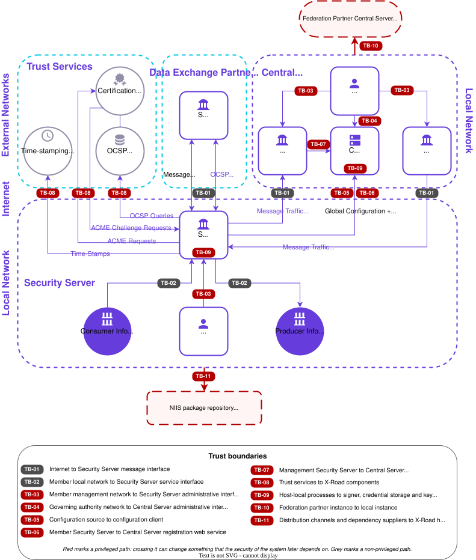

# X-Road Threat Model

**Technical Specification**

Version: 1.2
18.08.2026

Doc. ID: ARC-TM

---

## Version history

 Date       | Version | Description                                      | Author
 ---------- |---------|--------------------------------------------------| --------------------
 12.08.2026 | 1.0     | Initial version                                  | Petteri Kivimäki
 17.08.2026 | 1.1     | Clarify TM-07 file system permission ownership   | Petteri Kivimäki
 18.08.2026 | 1.2     | Add references to the Sidecar security guides     | Petteri Kivimäki

## Table of Contents

<!-- toc -->

- [X-Road Threat Model](#x-road-threat-model)
  - [Version history](#version-history)
  - [Table of Contents](#table-of-contents)
  - [License](#license)
  - [1 Introduction](#1-introduction)
    - [1.1 Terms and Abbreviations](#11-terms-and-abbreviations)
    - [1.2 References](#12-references)
    - [1.3 Prioritisation Method](#13-prioritisation-method)
  - [2 System Overview and Data Flows](#2-system-overview-and-data-flows)
  - [3 Trust Boundaries and Entry Points](#3-trust-boundaries-and-entry-points)
    - [3.1 Trust Boundary Register](#31-trust-boundary-register)
    - [3.2 Entry Point Register](#32-entry-point-register)
  - [4 Assets](#4-assets)
  - [5 Threat Scenarios](#5-threat-scenarios)
  - [6 Controls and Verification](#6-controls-and-verification)
    - [6.1 Control and Verification Mapping](#61-control-and-verification-mapping)
    - [6.2 Verification Evidence in CI](#62-verification-evidence-in-ci)
  - [7 Threat Model Maintenance](#7-threat-model-maintenance)
    - [7.1 Refresh Triggers](#71-refresh-triggers)
    - [7.2 Review Cadence](#72-review-cadence)
  - [8 Mapping to ENISA Secure by Design Playbook 01](#8-mapping-to-enisa-secure-by-design-playbook-01)

<!-- tocstop -->

## License

This document is licensed under the Creative Commons Attribution-ShareAlike 3.0 Unported License. To view a copy of this license, visit http://creativecommons.org/licenses/by-sa/3.0/

## 1 Introduction

This document is the threat model of the X-Road core software. It makes the trust assumptions of the X-Road architecture explicit, enumerates the trust boundaries and entry points, identifies the assets that need protection, prioritises the threat scenarios that cross those boundaries, and maps each scenario to the controls that mitigate it and to the automated tests that verify those controls.

The document complements the existing architecture documentation rather than replacing any part of it:

* X-Road Architecture \[[ARC-G](#Ref_ARC-G)\] describes the **structure** of the system — its components, protocols and interfaces.
* X-Road Security Architecture \[[ARC-SEC](#Ref_ARC-SEC)\] describes the **security properties** of the system — how it fulfils confidentiality, integrity, availability, authentication, access control and privacy principles.
* This document describes the **adversary view** — where trust changes, what an attacker would target, and how each control is verified.

Control descriptions and protocol details are not repeated here. They are cited from the documents that own them, so that this document does not become a second, diverging source of truth. There is one deliberate exception: the entry point register in section 3.2 names the ports at which each interface listens, because a register of the attack surface is of little use without them. Even there the listing is a summary of the externally reachable interfaces, and the installation guides remain authoritative for the complete set, including the loopback-only ports.

**Scope.** This threat model covers the software components maintained by NIIS as part of the X-Road core software (Security Server, Central Server, Configuration Proxy). Modules installed as part of a core component, such as the message log, operational monitoring and environmental monitoring add-ons of the Security Server, are covered as part of that component and are not listed separately.

**Out of scope.** Member information systems, deployment-specific configuration and infrastructure, and third-party extensions or integrations maintained by other organisations. Threats whose mitigation is the responsibility of the X-Road operator or of a member organisation are noted where relevant, but their controls are documented in the hardening guide \[[UG-SEC](#Ref_UG-SEC)\] and the installation guides. Where a Security Server is deployed as a container rather than from native packages, the platform beneath it — the Docker host and daemon, and the Kubernetes cluster — is likewise out of scope here, and its controls are documented in \[[UG-SS-SEC-SIDECAR](#Ref_UG-SS-SEC-SIDECAR)\] and \[[UG-K-SS-SEC-SIDECAR](#Ref_UG-K-SS-SEC-SIDECAR)\]; the controls in \[[UG-SEC](#Ref_UG-SEC)\] apply to such a deployment as well, since they are properties of the X-Road software rather than of the platform hosting it.

The document is maintained in accordance with the ENISA Secure by Design and Default Playbook on trust boundaries and threat modelling \[[ENISA-SBD](#Ref_ENISA-SBD)\]. Section 8 maps the playbook's minimum evidence requirements to the sections of this document.
### 1.1 Terms and Abbreviations

See X-Road terms and abbreviations documentation \[[TA-TERMS](#Ref_TERMS)\].

### 1.2 References

1. \[ARC-G\] X-Road Architecture. Document ID: [ARC-G](arc-g_x-road_arhitecture.md).
2. \[ARC-SEC\] X-Road Security Architecture. Document ID: [ARC-SEC](arc-sec_x_road_security_architecture.md).
3. \[ARC-SS\] X-Road: Security Server Architecture. Document ID: [ARC-SS](arc-ss_x-road_security_server_architecture.md).
4. \[ARC-CS\] X-Road: Central Server Architecture. Document ID: [ARC-CS](arc-cs_x-road_central_server_architecture.md).
5. \[ARC-CP\] X-Road: Configuration Proxy Architecture. Document ID: [ARC-CP](arc-cp_x-road_configuration_proxy_architecture.md).
6. \[TA-TERMS\] X-Road Terms and Abbreviations. Document ID: [TA-TERMS](../terms_x-road_docs.md).
7. \[UG-SEC\] X-Road: Security hardening guidelines. Document ID: [UG-SEC](../Manuals/ug-sec_x_road_security_hardening.md).
8. \[UG-SYSPAR\] X-Road: System Parameters User Guide. Document ID: [UG-SYSPAR](../Manuals/ug-syspar_x-road_v6_system_parameters.md).
9. \[IG-SS\] X-Road 7. Security Server Installation Guide. Document ID: [IG-SS](../Manuals/ig-ss_x-road_v6_security_server_installation_guide.md).
10. \[IG-CS\] X-Road 7. Central Server Installation Guide. Document ID: [IG-CS](../Manuals/ig-cs_x-road_6_central_server_installation_guide.md).
11. \[SPEC-AL\] X-Road: Audit Log Events. Document ID: [SPEC-AL](spec-al_x-road_audit_log_events.md).
12. \[PR-MESSTRANSP\] X-Road: Message Transport Protocol. Document ID: [PR-MESSTRANSP](../Protocols/pr-messtransp_x-road_message_transport_protocol.md).
13. \[PR-GCONF\] X-Road: Protocol for Downloading Configuration. Document ID: [PR-GCONF](../Protocols/pr-gconf_x-road_protocol_for_downloading_configuration.md).
14. \[PR-MSERV\] X-Road: Protocol for Management Services. Document ID: [PR-MSERV](../Protocols/pr-mserv_x-road_protocol_for_management_services.md).
15. \[UC-FED\] X-Road: Use Case Model for Federation. Document ID: [UC-FED](../UseCases/uc-fed_x-road_use_case_model_for_federation_1.1_Y-883-7.md).
16. \[SECURITY\] X-Road Security and Vulnerability Disclosure Policy. [SECURITY.md](../../SECURITY.md).
17. \[ENISA-SBD\] ENISA Secure by Design and Default Playbooks, playbook 01 *Trust boundaries and threat modelling*, <https://github.com/enisaeu/enisa-sbd-playbook>. Based on the ENISA Secure by Design and Default Playbook: A Practical Guide to Secure by Design and Default Principles for SMEs, <https://www.enisa.europa.eu/sites/default/files/2026-07/ENISA_Secure_By_Design_and_Default_Playbook_v1.pdf>.
18. \[UG-SS\] X-Road 7. Security Server User Guide. Document ID: [UG-SS](../Manuals/ug-ss_x-road_6_security_server_user_guide.md).
19. \[UG-AUTOLOGIN\] X-Road: Autologin User Guide. Document ID: [UG-AUTOLOGIN](../Manuals/Utils/ug-autologin_x-road_v6_autologin_user_guide.md).
20. \[UG-CS\] X-Road 7. Central Server User Guide. Document ID: [UG-CS](../Manuals/ug-cs_x-road_6_central_server_user_guide.md).
21. \[RESILIENCE\] NIIS. Resisting Failure, 20.11.2020, <https://www.niis.org/blog/2020/11/20/resisting-failure>.
22. \[PR-META\] X-Road: Service Metadata Protocol. Document ID: [PR-META](../Protocols/pr-meta_x-road_service_metadata_protocol.md).
23. \[IG-CSHA\] X-Road: Central Server High Availability Installation Guide. Document ID: [IG-CSHA](../Manuals/ig-csha_x-road_6_ha_installation_guide.md).
24. \[IG-XLB\] X-Road: External Load Balancer Installation Guide. Document ID: [IG-XLB](../Manuals/LoadBalancing/ig-xlb_x-road_external_load_balancer_installation_guide.md).
25. \[DEPVER\] X-Road: Gradle Dependency Verification. [DEPVER](../../development/docs/gradle-dependency-verification.md).
26. \[UG-SS-SIDECAR\] X-Road: Security Server Sidecar User Guide. Document ID: [UG-SS-SIDECAR](../Sidecar/security_server_sidecar_user_guide.md).
27. \[UG-SS-SEC-SIDECAR\] X-Road: Security Server Sidecar Security Guide. Document ID: [UG-SS-SEC-SIDECAR](../Sidecar/security_server_sidecar_security_guide.md).
28. \[UG-K-SS-SEC-SIDECAR\] X-Road: Kubernetes Security Server Sidecar Security User Guide. Document ID: [UG-K-SS-SEC-SIDECAR](../Sidecar/kubernetes_security_guide.md).

### 1.3 Prioritisation Method

Each threat scenario is rated for impact and likelihood on a three-level scale, and the two ratings are combined into a single H/M/L priority.

**Impact** — the worst credible outcome for the X-Road ecosystem if the scenario succeeds.

* **H** — ecosystem-wide consequences: compromise of the security policy or the member registry, disclosure of a private key, loss of the evidential value of exchanged messages, or unauthorised access to another member's data.
* **M** — consequences limited to a single member or a single Security Server: loss of availability, disclosure limited to one deployment, or degradation of evidential value.
* **L** — local and recoverable consequences with no data or trust impact.

**Likelihood** — the combination of exposure, the attacker capability required and the exploitability of the scenario, deliberately collapsed onto a single axis.

* **H** — reachable from the public Internet without X-Road credentials, with no prior compromise required.
* **M** — requires a registered X-Road member identity, or access to a member's local or management network.
* **L** — requires prior compromise of a host or a private key, or the compromise of a supplier or trust service.

**Priority** — the combination of the two ratings.

 Impact \ Likelihood | H | M | L
 ------------------- | - | - | -
 **H**               | H | H | H
 **M**               | H | M | M
 **L**               | M | L | L

Two properties of this matrix are deliberate and are relevant when reading section 5.

* **High impact yields high priority even at low likelihood.** X-Road is a critical information infrastructure system and is designed with CII-equivalence resilience in mind (see \[[ARC-SEC](#Ref_ARC-SEC)\] section 2). Scenarios that would compromise a private key or the evidential value of exchanged messages are therefore treated as high priority even though they require prior compromise of a host.
* **The rating is inherent, not residual.** It expresses the priority of the scenario itself, independently of the controls listed in section 6. It is what determines how much verification the corresponding boundary is expected to carry; it is not a statement about how much risk remains after mitigation.

## 2 System Overview and Data Flows

Figure 1 depicts the X-Road environment, its actors, the data exchanges between them and the trust boundaries that those exchanges cross. It is derived from the X-Road security architecture diagram \[[ARC-SEC](#Ref_ARC-SEC)\] Figure 1, with the trust boundaries of section 3.1 marked on it and two elements added that the security architecture diagram does not show: the configuration source of a federation partner (TB-10) and the distribution channel through which the software reaches the host (TB-11). A boundary is marked at every point where it is crossed, so the same identifier appears more than once where a boundary governs several flows. Boundaries carrying privileged paths — authentication, key management, software updates or administrative actions — are marked in red, and the remaining boundaries in grey.

Figure 1. X-Road trust boundaries.

Each boundary is described in section 3.1 and the entry points reachable across them in section 3.2.

The components that make up the system are described in \[[ARC-G](#Ref_ARC-G)\] section 2, and the fifteen protocols and interfaces that connect them in \[[ARC-G](#Ref_ARC-G)\] section 3. The deployment view, which shows which organisation hosts which component, is in \[[ARC-G](#Ref_ARC-G)\] section 4. Component-level decompositions are in \[[ARC-SS](#Ref_ARC-SS)\], \[[ARC-CS](#Ref_ARC-CS)\] and \[[ARC-CP](#Ref_ARC-CP)\].

## 3 Trust Boundaries and Entry Points

Trust boundaries are recorded in two registers: section 3.1 lists the boundaries themselves and section 3.2 the network entry points at which traffic reaches a component. Both registers distinguish privileged from non-privileged boundaries, and that distinction is explained first.

The *Privileged* column answers one question about the traffic that crosses a boundary: **can it change how the system behaves afterwards, or does it only use the system as it is already configured?**

A boundary is **privileged** when crossing it can change something that the security of the system later depends on:

  * the configuration of a component — TB-03 and TB-04, the two administrative interfaces;
  * key material — TB-08, where ACME issues and installs certificates, and TB-09, where the signer holds the private keys;
  * the registry and trust data that other parties rely on — TB-05 distributes the security policy, TB-06 registers authentication certificates, TB-07 writes to the member registry, and TB-10 adds a federation partner as a trust root;
  * the code that runs — TB-11, the software distribution channel.

A boundary is **not privileged** when crossing it only uses the system under the rules already in force. TB-01 carries messages between Security Servers, and TB-02 carries them between an information system and its own Security Server. Both move business data, and neither changes a configuration setting, a key, a registry entry or an installed component.

A boundary is marked privileged if even one flow across it meets the test, even when most of its traffic does not. TB-08 is marked on account of ACME certificate issuance alone; its OCSP and time-stamping traffic changes nothing.

### 3.1 Trust Boundary Register

A trust boundary is a point at which data, an identity or an execution context crosses from a less trusted domain into a more trusted one, or the reverse. The identifiers correspond to the markers on Figure 1.

 ID    | Boundary | Lower-trust side | Higher-trust side | Crossing mechanism | Privileged | Reference
 ----- | -------- | ---------------- | ----------------- | ------------------ | ---------- | ---------
 TB-01 | Internet to Security Server message interface | Public Internet; other members' Security Servers | Security Server proxy | X-Road Message Transport Protocol over HTTPS with mutual certificate-based TLS; OCSP response relay | No | \[[ARC-SEC](#Ref_ARC-SEC)\] 15, \[[ARC-G](#Ref_ARC-G)\] 3.3, \[[PR-MESSTRANSP](#Ref_PR-MESSTRANSP)\]
 TB-02 | Member local network to Security Server service interface | Member information system | Security Server client proxy and server proxy | X-Road Message Protocol over HTTP or HTTPS; optional TLS client certificate on the internal leg | No | \[[ARC-G](#Ref_ARC-G)\] 3.1, \[[ARC-SS](#Ref_ARC-SS)\] 4.3
 TB-03 | Member management network to Security Server administrative interface | Security Server administrator; management REST API client | Security Server administration service | Admin UI and management REST API over HTTPS; session or API-key authentication with role-based authorisation, and per-IP rate limiting | Yes | \[[ARC-SEC](#Ref_ARC-SEC)\] 7.2, \[[ARC-G](#Ref_ARC-G)\] 3.9, \[[ARC-SS](#Ref_ARC-SS)\] 2.9
 TB-04 | Governing authority network to Central Server administrative interface | Central Server administrator; management REST API client | Central Server administration service | Admin UI and Administration Service REST API over HTTPS; session or API-key authentication with role-based authorisation, and per-IP rate limiting | Yes | \[[ARC-G](#Ref_ARC-G)\] 3.10, \[[ARC-CS](#Ref_ARC-CS)\] 3.3
 TB-05 | Configuration source to configuration client | Central Server or Configuration Proxy as a network peer | Security Server and Configuration Proxy | Configuration Download Protocol; the downloaded configuration is verified against the configuration anchor | Yes | \[[ARC-SEC](#Ref_ARC-SEC)\] 14, \[[ARC-G](#Ref_ARC-G)\] 3.2, \[[PR-GCONF](#Ref_PR-GCONF)\]
 TB-06 | Member Security Server to Central Server registration web service | Member Security Server on the public Internet | Central Server Security Server registry | The `authCertReg` request is an HTTPS POST made directly to the registration web service, outside the X-Road message exchange. The request carries proof of possession of the authentication key and a signature by the Security Server owner; the registration service validates both certificates, their issuing certification authority and their OCSP status | Yes | \[[ARC-SEC](#Ref_ARC-SEC)\] 13, \[[ARC-G](#Ref_ARC-G)\] 3.6, \[[ARC-CS](#Ref_ARC-CS)\] 3.1.2, \[[PR-MSERV](#Ref_PR-MSERV)\] 1, 2.3
 TB-07 | Management Security Server to Central Server member management web service | Management Security Server | Central Server member and Security Server registry | Every management service other than `authCertReg` is a standard X-Road service, so a member's request first crosses TB-01 to the management Security Server, which authenticates the sender and terminates the X-Road message exchange. The management Security Server then forwards the request to the member management web service over the governing authority's internal network. The caller's X-Road identity is not re-authenticated at this hop; the Central Server delegates that to the management Security Server and restricts the network path to it. The registry itself is not reached directly, however: the member management web service translates the request into a call to the Central Server administration REST API and authenticates that call with an API key holding the `XROAD_MANAGEMENT_SERVICE` role, so the write is authorised by a role-scoped key rather than by network position alone. The endpoint is also rate-limited. Most request types additionally carry a signature by the affected member that is verified, but `clientDeletion` and `authCertDeletion` carry none | Yes | \[[ARC-SEC](#Ref_ARC-SEC)\] 13, \[[ARC-G](#Ref_ARC-G)\] 3.6, \[[ARC-CS](#Ref_ARC-CS)\] 3.1.1, \[[PR-MSERV](#Ref_PR-MSERV)\] 1, 2
 TB-08 | Trust services to X-Road components | Certification authority, OCSP responder, time-stamping authority, ACME server | Security Server certificate store, certificate validation and time-stamp creation | Two kinds of flow cross here and they differ in privilege. Certificate issuance and renewal over ACME is key management: the Security Server orders authentication and signing certificates and installs the result, and it exposes an inbound challenge endpoint to the ACME server. OCSP status queries and time-stamping requests are verification flows: the Security Server sends a request and validates the signed response against the approved trust services in the global configuration, and neither changes any configuration. The boundary is marked privileged on account of the ACME certificate lifecycle alone | Yes | \[[ARC-SEC](#Ref_ARC-SEC)\] 10, 16, \[[ARC-G](#Ref_ARC-G)\] 3.7, 3.8
 TB-09 | Host-local processes to signer, credential storage and key material on disk | Other X-Road processes and host operating system accounts; secondary cluster nodes | The signer holds different keys on each component: on the Security Server the authentication keys, on a software token only, and the member signing keys, on a software token or on an SSCD or HSM; on the Central Server and the Configuration Proxy the global configuration signing keys, on a software token or on an SSCD or HSM. On all three, the security token PIN codes while a token is logged in: the password store keeps them in a shared-memory segment readable by the signer and the administration service, not on disk, and they are lost when the server restarts \[[ARC-SS](#Ref_ARC-SS)\] 2.11. Also on all three, the TLS key material held in the server configuration directory; the OpenPGP key material on the Security Server and the Central Server only, and the message log encryption key material on the Security Server only | gRPC over the loopback interface with mutual TLS; PKCS#11 to the SSCD or HSM; write operations are refused on secondary nodes | Yes | \[[ARC-SEC](#Ref_ARC-SEC)\] 16, \[[ARC-SS](#Ref_ARC-SS)\] 2.6, 2.11, 2.12, \[[ARC-CS](#Ref_ARC-CS)\] 2.4, 2.7, 2.8, \[[ARC-CP](#Ref_ARC-CP)\] 2.3, 2.5, 2.6, \[[UG-SYSPAR](#Ref_UG-SYSPAR)\]
 TB-10 | Federation partner instance to local instance | Federation partner's configuration source | Local Central Server and Security Server trust decisions | Federation is disabled by default and requires two independent opt-ins: the Central Server administrator uploads the partner's external configuration anchor, and each Security Server must name the partner instance in `allowed-federations`, which defaults to `none` and so fetches no federated configuration at all. Where enabled, the external configuration is verified against that anchor and filtered by instance \[[UG-SYSPAR](#Ref_UG-SYSPAR)\] | Yes | \[[ARC-SEC](#Ref_ARC-SEC)\] 12, \[[UC-FED](#Ref_UC-FED)\]
 TB-11 | Distribution channels and dependency suppliers to X-Road host | NIIS package repository, container registry and third-party dependency suppliers | Installed X-Road software on the host | `rpm` packages are signed individually with the NIIS release signing key before publication and their signature is verified by the package manager on installation. `deb` packages carry no per-package signature; their integrity rests on the repository index, which is signed with the same key and records the checksum of every package. Container images are pulled over HTTPS from Docker Hub and carry no signature or attestation. Third-party build dependencies are pinned by Gradle dependency verification metadata | Yes | \[[ARC-SEC](#Ref_ARC-SEC)\] 11, \[[IG-SS](#Ref_IG-SS)\] 2.2, \[[IG-CS](#Ref_IG-CS)\] 2.2, \[[UG-SS-SIDECAR](#Ref_UG-SS-SIDECAR)\]

### 3.2 Entry Point Register

The table below lists the interfaces through which data enters an X-Road component. It is a summary for threat-modelling purposes; the authoritative and complete port listings, including the loopback-only ports, are in \[[IG-SS](#Ref_IG-SS)\] section 2.2 and \[[IG-CS](#Ref_IG-CS)\] section 2.2.

The register lists network entry points, that is the interfaces at which traffic first reaches a component. Services that are reached *through* an entry point rather than alongside it — regular member services, metadata services, environmental and operational monitoring queries, and the management services — are not listed separately: they share the transport and authentication of the entry point they arrive on and differ only in authorisation, which is covered in sections 5 and 6.

 ID    | Component | Interface | Transport | Exposure | Authentication | Default state | Boundary
 ----- | --------- | --------- | --------- | -------- | -------------- | ------------- | --------
 EP-01 | Security Server | Message Transport Protocol (server proxy) | HTTPS, TCP 5500 | Internet | Mutual TLS with an authentication certificate registered in the global configuration | Enabled | TB-01
 EP-02 | Security Server | OCSP response relay | HTTP, TCP 5577 | Internet | None at transport level; responses are CA-signed and validated on use | Enabled | TB-01
 EP-03 | Security Server | ACME challenge endpoint | HTTP, TCP 80 | Internet | None; challenge tokens are validated before use | Enabled only when ACME is configured | TB-08
 EP-04 | Security Server | Message Protocol access points for information systems | HTTP TCP 8080, HTTPS TCP 8443 | Member local network | None on the plaintext access point; TLS client certificate on the TLS access point | Enabled; must not be exposed to the external network without strong authentication | TB-02
 EP-05 | Security Server | Admin UI and management REST API | HTTPS, TCP 4000 | Member management network | Session credentials or API key; role-based authorisation, deny by default; per-IP rate limiting | Enabled, rate-limited; must not be accessible from the Internet | TB-03
 EP-06 | Security Server | Health check interface | HTTP, administrator-defined port | Member local network | None | Disabled | TB-02
 EP-07 | Central Server | Global configuration distribution | HTTP TCP 80, HTTPS TCP 443 | Internet | None at transport level; integrity rests on the Central Server signature verified against the configuration anchor | Enabled | TB-05
 EP-08 | Central Server | Registration web service (`authCertReg`) | HTTPS POST, TCP 4001 | Internet | No transport-level authentication; the request must carry proof of possession of the authentication key and a valid signature by the Security Server owner, both validated together with their OCSP status. The service authenticates onward to the administration REST API with an API key holding the `XROAD_MANAGEMENT_SERVICE` role. Rate-limited | Enabled | TB-06
 EP-09 | Central Server | Member management web service | SOAP over HTTPS, TCP 4002 | Governing authority internal network | TLS; the caller's X-Road identity is not re-authenticated here, having been established at the management Security Server, and the network path is restricted to it. The service authenticates onward to the administration REST API with an API key holding the `XROAD_MANAGEMENT_SERVICE` role. Rate-limited | Enabled; reachable only from the management Security Server | TB-07
 EP-10 | Central Server | Admin UI and Administration Service REST API | HTTPS, TCP 4000 | Governing authority internal network | Session credentials or API key; role-based authorisation, deny by default; per-IP rate limiting | Enabled, rate-limited | TB-04
 EP-11 | Configuration Proxy | Global configuration distribution | HTTP or HTTPS | Internet | None at transport level; integrity rests on the original Central Server signature | Enabled when the component is deployed | TB-05
 EP-12 | All components | Signer gRPC interface | gRPC, loopback TCP 5560 | Host-local | Mutual TLS, enabled by default (`grpc-internal-tls-enabled`) | Enabled | TB-09

## 4 Assets

The table lists what an attacker would target: key material and the certificates that go with it, administrator credentials and API keys, the configuration that governs trust decisions, the messages exchanged and the logs that record them, the authoritative registry, and the artefacts through which the software is distributed. Confidentiality, integrity and availability are properties rather than assets in their own right; the *Security objective* column states which of them have to hold for each entry, and *Impact if compromised* rates the worst credible outcome on the scale in section 1.3.

 ID    | Asset | Location | Security objective | Impact if compromised
 ----- | ----- | -------- | ------------------ | ---------------------
 AS-01 | Security Server authentication keys and certificates | Software token on the Security Server. Unlike signing keys, authentication keys are not supported on an SSCD or HSM \[[ARC-SEC](#Ref_ARC-SEC)\] 16 | Confidentiality, integrity | H
 AS-02 | Member signing keys and certificates | Software token, SSCD or HSM on the Security Server | Confidentiality, integrity | H
 AS-03 | Global configuration signing keys | Software token, SSCD or HSM on the Central Server and, where deployed, on the Configuration Proxy \[[ARC-CP](#Ref_ARC-CP)\] 2.3 | Confidentiality, integrity | H
 AS-04 | Security Server internal TLS key and certificate | Security Server, `/etc/xroad/ssl`. Used on the information system access point (TCP 8443) as both client and server certificate, depending on whether the Security Server is consuming or providing \[[UG-SS](#Ref_UG-SS)\] 10.4 | Confidentiality, integrity | H
 AS-05 | Global configuration distribution TLS keys and certificates | Central Server (`global-conf.crt` and `global-conf.key`, served by nginx on TCP 443) and Configuration Proxy (`confproxy.crt`, `confproxy.key`). Self-signed at installation and replaceable with a CA-issued certificate \[[IG-CS](#Ref_IG-CS)\] 2.7.1, \[[UG-SEC](#Ref_UG-SEC)\] 4.1.1, 4.1.2 | Confidentiality, integrity | M
 AS-06 | Central Server registration and management service TLS key and certificate | Central Server. A single key pair shared by the registration web service (TCP 4001) and the member management web service (TCP 4002); it secures both the Security Server to registration web service path and the management Security Server to member management web service path \[[UG-CS](#Ref_UG-CS)\] 4.4.1 | Confidentiality, integrity | H
 AS-07 | Admin UI and management REST API TLS keys and certificates | Security Server and Central Server, TCP 4000. A self-signed key pair generated at installation and replaceable by the administrator \[[UG-SS](#Ref_UG-SS)\], \[[UG-CS](#Ref_UG-CS)\] 4.4 | Confidentiality, integrity | M
 AS-08 | ACME account key pair | Security Server, `/etc/xroad/ssl/acme.p12`. Authenticates the Security Server to the ACME server when authentication and signing certificates are ordered or renewed automatically \[[ARC-SEC](#Ref_ARC-SEC)\] 16, \[[UG-SYSPAR](#Ref_UG-SYSPAR)\] | Confidentiality, integrity | H
 AS-09 | Internal OpenPGP key | OpenPGP keyring of the Security Server and Central Server, `/etc/xroad/gpghome` by default. It is used in three ways. **Backup signing**, always on: the private key signs each backup, and the public key verifies that signature on restore. **Backup encryption**, off by default: when enabled, the public key encrypts the backup and the private key decrypts it on restore. **Message log archive protection** on the Security Server, off by default: when archive encryption is enabled, the private key signs each archive and the public key encrypts it, unless a per-member key from AS-11 applies to that archive. \[[UG-SS](#Ref_UG-SS)\] 11.1.7, 13.4; \[[UG-CS](#Ref_UG-CS)\] 12.6; \[[UG-SYSPAR](#Ref_UG-SYSPAR)\] | Confidentiality, integrity | H
 AS-10 | Additional backup encryption recipient keys | Public keys imported into the same keyring, with their identifiers listed in `backup-encryption-keyids`. When backup encryption is enabled the backup is encrypted to the server's own key and, in addition, to each of these recipients, so the holder of any corresponding private key can decrypt it. Setting at least one additional recipient is recommended, because a backup cannot otherwise be recovered if the server's own private key is lost. The list is security-relevant in both directions: an unauthorised recipient added to it makes every later backup readable by its holder, and a backup contains the contents of `/etc/xroad` — including soft token private keys and the internal TLS key material — together with a database dump \[[UG-CS](#Ref_UG-CS)\] 12.6, \[[UG-SYSPAR](#Ref_UG-SYSPAR)\] | Integrity of the recipient list; availability of recovery | H
 AS-11 | Message log encryption keys | The database encryption key protecting message bodies at rest when `messagelog-encryption-enabled` is set, and the per-member archive encryption keys mapped by `archive-encryption-keys-config` when archive encryption and grouping are enabled \[[UG-SYSPAR](#Ref_UG-SYSPAR)\], \[[UG-SS](#Ref_UG-SS)\] 11.1.3, 11.1.7 | Confidentiality | H
 AS-12 | Configuration anchor | Security Server and Configuration Proxy configuration | Integrity, availability | H
 AS-13 | Global configuration, the signed distributed artefact | Generated periodically by the Central Server from the authoritative record in AS-18, signed by the signer, published by the internal and external configuration sources, and downloaded and cached by every configuration client. It consists of the private and shared parameter files plus any add-on parts, and carries both the member and Security Server data and the security policy — approved certification authorities and time-stamping authorities and tunable parameters such as the maximum OCSP response lifetime \[[ARC-CS](#Ref_ARC-CS)\] 4, \[[ARC-SEC](#Ref_ARC-SEC)\] 14, \[[PR-GCONF](#Ref_PR-GCONF)\] | Integrity, availability | H
 AS-14 | Administrator credentials and API keys | Administrator accounts are host operating system accounts and may be held in an external directory over PAM, for example LDAP through SSSD \[[UG-SS](#Ref_UG-SS)\] 2.3. Only a hash of each API key is stored; the key itself is returned once at creation and never persisted. Token PIN codes are not persisted by default: the password store holds them in a shared-memory segment that is cleared when the server restarts, so a token has to be logged in again by hand. Persisting them is optional and is the administrator's decision — the autologin add-on either reads the PIN from `/etc/xroad/autologin` in plaintext or obtains it at start-up from a source of the administrator's choosing through a custom fetch script \[[UG-AUTOLOGIN](#Ref_UG-AUTOLOGIN)\] 2.1 | Confidentiality, integrity | H
 AS-15 | Exchanged messages, which may contain personal data | In transit between information systems and Security Servers. The same content is at rest in AS-16, because message bodies are logged by default | Confidentiality, integrity | H
 AS-16 | Message log records and archives | Security Server message log database and archive storage. By default the records contain the exchanged messages themselves, headers and bodies, so this asset normally holds AS-15 at rest; body logging can be disabled per Security Server or per subsystem, and the message log add-on can be omitted entirely \[[ARC-SEC](#Ref_ARC-SEC)\] 4 | Integrity, confidentiality, availability | H
 AS-17 | Audit log | Central Server and Security Server audit log | Integrity, availability | M
 AS-18 | Member and Security Server registry, the authoritative record | The Central Server database. It is the source of record from which AS-13 is generated, and the only place the data is written: by the administration service across TB-04 and by management requests across TB-06 and TB-07. AS-13 is the signed, read-only projection of it that the rest of the ecosystem sees \[[ARC-CS](#Ref_ARC-CS)\] 2.5, 4 | Integrity, availability | H
 AS-19 | X-Road distribution artefacts — native packages and container images — and third-party dependencies | NIIS package repository; Docker Hub; installed hosts | Integrity | H

## 5 Threat Scenarios

The scenarios below are the prioritised top threats for the X-Road core software, rated using the method in section 1.3. The owner of every scenario is NIIS, as the open-source software steward of the X-Road core software. Controls and their verification are in section 6.

 ID    | Threat scenario | Boundary | Assets | Impact | Likelihood | Priority | Owner
 ----- | --------------- | -------- | ------ | ------ | ---------- | -------- | -----
 TM-01 | An attacker reaches Security Server or Central Server administrative functions without authentication, with an insufficient role, or by escalating the privileges attached to an API key | TB-03, TB-04 | AS-01 to AS-11, AS-14, AS-17, AS-18 | H | M | **H** | NIIS
 TM-02 | An unauthorised party exchanges messages because a certificate check that should have stopped it does not. At the message interface this is a rogue or modified Security Server whose authentication certificate is not registered in the global configuration for that server, is not bound to the member it claims to be, was issued by a certification authority that the instance has not approved, or is revoked, expired or of unknown status. At the internal access point it is an information system connecting with a certificate the Security Server does not recognise | TB-01, TB-02, TB-08 | AS-01, AS-02, AS-15 | H | M | **H** | NIIS
 TM-03 | A configuration client accepts tampered, forged, stale or downgraded global configuration. Includes the federation variant, in which a malicious or compromised federation partner's configuration source injects content into the local instance | TB-05, TB-10 | AS-12, AS-13 | H | M | **H** | NIIS
 TM-04 | A registered member consumes a service for which it has not been granted access rights, or reaches a service through an identifier that bypasses the access-rights check | TB-01, TB-02 | AS-15 | H | M | **H** | NIIS
 TM-05 | A member forges a management request and registers, deletes, renames, disables or changes the owner of another member's Security Server, client or authentication certificate | TB-01, TB-06, TB-07 | AS-18 | H | M | **H** | NIIS
 TM-06 | Message integrity or non-repudiation is bypassed — an unsigned, re-signed or only partially covered message is accepted in transit, a time-stamp is forged, or message log records and archives are tampered with so that their evidential value is lost | TB-01 | AS-09, AS-11, AS-15, AS-16 | H | L–M | **H** | NIIS
 TM-07 | Key material is exposed or used without authorisation: a signing or authentication private key across the signer boundary — through the internal gRPC interface, through token PIN handling, or from a secondary cluster node — or the TLS, OpenPGP and message log encryption key material held on the host file system | TB-09 | AS-01 to AS-11 | H | L | **H** | NIIS
 TM-08 | A component is compromised through the content it is required to parse rather than through its authentication. X-Road parses attacker-influenced XML at every message boundary and accepts operator-supplied files at its administrative interfaces — WSDL and OpenAPI service descriptions, trusted anchors, backup archives — so a malformed or hostile document can lead to file disclosure through XML external entities, outbound requests to an attacker-chosen address, writes outside the intended directory, or resource exhaustion | TB-01, TB-02, TB-03, TB-04 | AS-14, AS-15 | M | M | **M** | NIIS
 TM-09 | A compromised distribution artefact — a native package or a container image — or a compromised third-party dependency reaches an installation through a distribution channel or through the build | TB-11 | AS-19, and by extension all other assets | H | L | **M** | NIIS
 TM-10 | A shared dependency of the whole instance is made unavailable for longer than its grace period — the Central Server, an OCSP responder or a time-stamping authority — so that message exchange stops across the ecosystem rather than at a single member, or the outage is used to push a component into accepting data it should have refused. The per-member variant is a denial-of-service attack against one Security Server's Internet-facing interfaces | TB-01, TB-05, TB-08 | AS-12, AS-13, AS-16 | H | L–M | **H** | NIIS

## 6 Controls and Verification

### 6.1 Control and Verification Mapping

For each threat scenario, the table below records the required controls, where they are enforced, the configuration state in which X-Road ships, the specification that describes the control, and the automated tests that verify it. Each test and workflow is linked to its location on the `develop` branch, with the full repository path kept as the link text so that it can still be found on any other branch or tag.

 Threat | Control | Where enforced | Secure default                                                                                                                                                                                                                                                                                                                                                                                                                                                                                                                                                                                                                             | Specification | Automated verification
 ------ | ------- | -------------- |--------------------------------------------------------------------------------------------------------------------------------------------------------------------------------------------------------------------------------------------------------------------------------------------------------------------------------------------------------------------------------------------------------------------------------------------------------------------------------------------------------------------------------------------------------------------------------------------------------------------------------------------| ------------- | ----------------------
 TM-01 | Authentication required on every administrative operation; role-based authorisation; an API key cannot be granted a role its creator does not hold; per-IP rate limiting across the management REST API; CSRF protection; account lockout and password policy; host header injection mitigation; every change to the system state or configuration is audit-logged regardless of outcome | Security Server and Central Server administration services, Spring Security filter chain and method-level authorisation | Deny by default: a new resource is not accessible to any role unless authorisation is configured explicitly. Rate limiting enabled on both servers by default at 20 requests per second and 600 per minute per requesting IP, and audit logging enabled. Administrative interfaces bound to the internal network                                                                                                                                                                                                                                                                                                                           | \[[ARC-SEC](#Ref_ARC-SEC)\] 7.2, 9, 15; \[[SPEC-AL](#Ref_SPEC-AL)\]; \[[UG-SEC](#Ref_UG-SEC)\] 2.1.1, 2.1.2, 2.1.3, 2.2.1, 2.5 | [`src/security-server/api-test/src/intTest/java/org/niis/xroad/ss/test/api/platform/ApiSecurityTest.java`](https://github.com/nordic-institute/X-Road/blob/develop/src/security-server/api-test/src/intTest/java/org/niis/xroad/ss/test/api/platform/ApiSecurityTest.java) [`src/central-server/admin-service/api-test/src/intTest/java/org/niis/xroad/cs/test/api/security/ApiSecurityTest.java`](https://github.com/nordic-institute/X-Road/blob/develop/src/central-server/admin-service/api-test/src/intTest/java/org/niis/xroad/cs/test/api/security/ApiSecurityTest.java) [`src/security-server/admin-service/application/src/test/java/org/niis/xroad/securityserver/restapi/openapi/TokenCertificatesApiControllerIntegrationTest.java`](https://github.com/nordic-institute/X-Road/blob/develop/src/security-server/admin-service/application/src/test/java/org/niis/xroad/securityserver/restapi/openapi/TokenCertificatesApiControllerIntegrationTest.java) [`src/security-server/admin-service/application/src/test/java/org/niis/xroad/securityserver/restapi/openapi/CertificateAuthoritiesApiControllerTest.java`](https://github.com/nordic-institute/X-Road/blob/develop/src/security-server/admin-service/application/src/test/java/org/niis/xroad/securityserver/restapi/openapi/CertificateAuthoritiesApiControllerTest.java) [`src/security-server/admin-service/application/src/test/java/org/niis/xroad/securityserver/restapi/openapi/SystemApiControllerTest.java`](https://github.com/nordic-institute/X-Road/blob/develop/src/security-server/admin-service/application/src/test/java/org/niis/xroad/securityserver/restapi/openapi/SystemApiControllerTest.java) [`src/common/common-admin-api/src/test/java/org/niis/xroad/restapi/controller/ApiKeysControllerTest.java`](https://github.com/nordic-institute/X-Road/blob/develop/src/common/common-admin-api/src/test/java/org/niis/xroad/restapi/controller/ApiKeysControllerTest.java) [`src/security-server/api-test/src/intTest/java/org/niis/xroad/ss/test/api/keys/ApiKeysTest.java`](https://github.com/nordic-institute/X-Road/blob/develop/src/security-server/api-test/src/intTest/java/org/niis/xroad/ss/test/api/keys/ApiKeysTest.java) [`src/security-server/admin-service/application/src/test/java/org/niis/xroad/securityserver/restapi/auth/CsrfWebMvcTest.java`](https://github.com/nordic-institute/X-Road/blob/develop/src/security-server/admin-service/application/src/test/java/org/niis/xroad/securityserver/restapi/auth/CsrfWebMvcTest.java) [`src/security-server/admin-service/application/src/test/java/org/niis/xroad/securityserver/restapi/ApplicationIpRateLimitTest.java`](https://github.com/nordic-institute/X-Road/blob/develop/src/security-server/admin-service/application/src/test/java/org/niis/xroad/securityserver/restapi/ApplicationIpRateLimitTest.java) [`src/central-server/admin-service/application/src/test/java/org/niis/xroad/cs/admin/application/ApplicationIpRateLimitTest.java`](https://github.com/nordic-institute/X-Road/blob/develop/src/central-server/admin-service/application/src/test/java/org/niis/xroad/cs/admin/application/ApplicationIpRateLimitTest.java) [`src/common/common-admin-api/src/test/java/org/niis/xroad/restapi/config/audit/AuditLoggingTest.java`](https://github.com/nordic-institute/X-Road/blob/develop/src/common/common-admin-api/src/test/java/org/niis/xroad/restapi/config/audit/AuditLoggingTest.java)
 TM-02 | Mutual certificate-based TLS on the message transport; the peer's authentication certificate must be issued by an approved certification authority, must match the certificate registered for that Security Server in the global configuration, and must have a good OCSP status. Certificate status is established from OCSP responses, and a response is itself rejected if the responder is not authorised, the signature does not verify, the identity does not match, or it is not yet valid or has expired; a revoked or unknown status fails the validation. Responses are cached and relayed with the message, so neither party has to reach the other party's responder, and their maximum lifetime is set centrally in the global configuration. A Security Server whose authentication key has no good OCSP status does not report itself ready. Also optional TLS client certificate validation on the internal access point, and a minimum supported client Security Server version | Security Server client proxy and server proxy | Mutual TLS is mandatory on the message transport and cannot be disabled, and fails closed: a connection whose certificate fails any of the checks, or whose status cannot be established as good, is rejected before the message is processed                                                                                                                                                                                                                                                                                                                                                                                              | \[[ARC-SEC](#Ref_ARC-SEC)\] 6, 14, 15, 16; \[[ARC-G](#Ref_ARC-G)\] 3.7; \[[PR-MESSTRANSP](#Ref_PR-MESSTRANSP)\]; \[[UG-SEC](#Ref_UG-SEC)\] 3.1.1 | In [`src/service/proxy/proxy-core/src/test/java/org/niis/xroad/proxy/core/testsuite/testcases/`](https://github.com/nordic-institute/X-Road/tree/develop/src/service/proxy/proxy-core/src/test/java/org/niis/xroad/proxy/core/testsuite/testcases/): [`SslAuthCertNotMatchesOrg`](https://github.com/nordic-institute/X-Road/blob/develop/src/service/proxy/proxy-core/src/test/java/org/niis/xroad/proxy/core/testsuite/testcases/SslAuthCertNotMatchesOrg.java), [`SslClientCertVerificationError`](https://github.com/nordic-institute/X-Road/blob/develop/src/service/proxy/proxy-core/src/test/java/org/niis/xroad/proxy/core/testsuite/testcases/SslClientCertVerificationError.java), [`SslClientAuthWrongISCert`](https://github.com/nordic-institute/X-Road/blob/develop/src/service/proxy/proxy-core/src/test/java/org/niis/xroad/proxy/core/testsuite/testcases/SslClientAuthWrongISCert.java), [`SslClientAuthNoISCert`](https://github.com/nordic-institute/X-Road/blob/develop/src/service/proxy/proxy-core/src/test/java/org/niis/xroad/proxy/core/testsuite/testcases/SslClientAuthNoISCert.java), [`SslClientAuthExpiredISCert`](https://github.com/nordic-institute/X-Road/blob/develop/src/service/proxy/proxy-core/src/test/java/org/niis/xroad/proxy/core/testsuite/testcases/SslClientAuthExpiredISCert.java), [`SslToServiceWrongISCert`](https://github.com/nordic-institute/X-Road/blob/develop/src/service/proxy/proxy-core/src/test/java/org/niis/xroad/proxy/core/testsuite/testcases/SslToServiceWrongISCert.java), [`SslToServiceNoISCerts`](https://github.com/nordic-institute/X-Road/blob/develop/src/service/proxy/proxy-core/src/test/java/org/niis/xroad/proxy/core/testsuite/testcases/SslToServiceNoISCerts.java), [`SslAuthTrustManagerError`](https://github.com/nordic-institute/X-Road/blob/develop/src/service/proxy/proxy-core/src/test/java/org/niis/xroad/proxy/core/testsuite/testcases/SslAuthTrustManagerError.java) [`src/lib/globalconf-impl/src/test/java/org/niis/xroad/globalconf/impl/ocsp/OcspVerifierTest.java`](https://github.com/nordic-institute/X-Road/blob/develop/src/lib/globalconf-impl/src/test/java/org/niis/xroad/globalconf/impl/ocsp/OcspVerifierTest.java) [`src/lib/globalconf-impl/src/test/java/org/niis/xroad/globalconf/impl/cert/CertChainTest.java`](https://github.com/nordic-institute/X-Road/blob/develop/src/lib/globalconf-impl/src/test/java/org/niis/xroad/globalconf/impl/cert/CertChainTest.java)
 TM-03 | The Central Server signs the global configuration; every configuration client verifies the signature against the configuration anchor before use; the signing certificate must match the anchor and must not be expired; configuration parts originating from a foreign instance are rejected; the configuration has a validity period after which a Security Server stops processing requests; federation requires both an external anchor uploaded explicitly by the Central Server administrator and the partner instance to be named in the Security Server's `allowed-federations` parameter, and a configuration source filter is applied to what is fetched | Configuration client on the Security Server and the Configuration Proxy; Central Server configuration generation | Signature verification is mandatory and cannot be disabled. Expired configuration is not used. Federation is off by default: no partner is trusted until its anchor is uploaded on the Central Server, and no Security Server fetches federated configuration until the partner instance is added to `allowed-federations`, whose default value `none` disables federation entirely                                                                                                                                                                                                                                                        | \[[ARC-SEC](#Ref_ARC-SEC)\] 12, 14; \[[ARC-G](#Ref_ARC-G)\] 3.2; \[[PR-GCONF](#Ref_PR-GCONF)\]; \[[UC-FED](#Ref_UC-FED)\] | In [`src/service/configuration-client/configuration-client-common/src/test/java/org/niis/xroad/confclient/common/service/`](https://github.com/nordic-institute/X-Road/tree/develop/src/service/configuration-client/configuration-client-common/src/test/java/org/niis/xroad/confclient/common/service/): [`ConfigurationParserTest`](https://github.com/nordic-institute/X-Road/blob/develop/src/service/configuration-client/configuration-client-common/src/test/java/org/niis/xroad/confclient/common/service/ConfigurationParserTest.java), [`VerifyGlobalConfTest`](https://github.com/nordic-institute/X-Road/blob/develop/src/service/configuration-client/configuration-client-common/src/test/java/org/niis/xroad/confclient/common/service/VerifyGlobalConfTest.java), [`GlobalConfSignTest`](https://github.com/nordic-institute/X-Road/blob/develop/src/service/configuration-client/configuration-client-common/src/test/java/org/niis/xroad/confclient/common/service/GlobalConfSignTest.java), [`FederationConfigurationSourceFilterTest`](https://github.com/nordic-institute/X-Road/blob/develop/src/service/configuration-client/configuration-client-common/src/test/java/org/niis/xroad/confclient/common/service/FederationConfigurationSourceFilterTest.java) [`src/lib/globalconf-impl/src/test/java/org/niis/xroad/globalconf/impl/FSGlobalConfValidatorTest.java`](https://github.com/nordic-institute/X-Road/blob/develop/src/lib/globalconf-impl/src/test/java/org/niis/xroad/globalconf/impl/FSGlobalConfValidatorTest.java) [`src/central-server/admin-service/api-test/src/intTest/java/org/niis/xroad/cs/test/api/globalconf/TrustedAnchorsApiTest.java`](https://github.com/nordic-institute/X-Road/blob/develop/src/central-server/admin-service/api-test/src/intTest/java/org/niis/xroad/cs/test/api/globalconf/TrustedAnchorsApiTest.java)
 TM-04 | The service provider's Security Server applies access control to every incoming message at subsystem and service granularity; publishing a service grants no access by itself; service and client identifiers are normalised and rejected if they are percent-encoded, non-normalised or contain control characters. The same access control governs the services reached through the message interface: environmental and operational monitoring queries are answered only for the Security Server owner and a configured central monitoring client, and any other client receives AccessDenied \[[ARC-SEC](#Ref_ARC-SEC)\] 17.3. Metadata queries follow the same model with one deliberate exception — `allowedMethods` returns only the services the caller may invoke, while `listMethods` discloses a provider's full service list to any X-Road member, by design, so that services can be discovered \[[PR-META](#Ref_PR-META)\] | Security Server server proxy; identifier validation in the administration service | Deny by default: a newly published service is accessible to no one until access rights are granted explicitly                                                                                                                                                                                                                                                                                                                                                                                                                                                                                                                              | \[[ARC-SEC](#Ref_ARC-SEC)\] 7.1, 7.3, 15; \[[UG-SEC](#Ref_UG-SEC)\] 3.1.1 | [`src/service/proxy/proxy-core/src/test/java/org/niis/xroad/proxy/core/testsuite/testcases/NotAllowed.java`](https://github.com/nordic-institute/X-Road/blob/develop/src/service/proxy/proxy-core/src/test/java/org/niis/xroad/proxy/core/testsuite/testcases/NotAllowed.java) [`src/service/proxy/proxy-core/src/test/java/org/niis/xroad/proxy/core/RestProxyTest.java`](https://github.com/nordic-institute/X-Road/blob/develop/src/service/proxy/proxy-core/src/test/java/org/niis/xroad/proxy/core/RestProxyTest.java) [`src/security-server/admin-service/application/src/test/java/org/niis/xroad/securityserver/restapi/openapi/IdentifierValidationRestTemplateTest.java`](https://github.com/nordic-institute/X-Road/blob/develop/src/security-server/admin-service/application/src/test/java/org/niis/xroad/securityserver/restapi/openapi/IdentifierValidationRestTemplateTest.java)
 TM-05 | The two management paths are authenticated differently. `authCertReg` reaches the registration web service directly from the Internet and must carry proof of possession of the authentication key and a signature by the Security Server owner; the service validates both certificates, their issuing certification authority and their OCSP status, and rejects the request if any check fails. Every other management service is a standard X-Road service, so it inherits the mutual TLS authentication and message signature of the message transport at TB-01 and is then relayed by the management Security Server across TB-07, where the Central Server accepts it on the strength of that earlier authentication and of the network restriction on the port. Neither web service writes to the registry directly: both translate the request into a call to the Central Server administration REST API and authenticate it with an API key holding the `XROAD_MANAGEMENT_SERVICE` role, and both endpoints are rate-limited; most request types additionally carry a signature by the affected member, while `clientDeletion` and `authCertDeletion` rely on that transport-level authentication alone. Every management operation verifies that the request sender is the owner of the Security Server concerned. Request bodies are size-capped, and non-allowed HTTP methods and unknown paths are refused without disclosing whether they exist | Central Server registration web service (TB-06); management Security Server and Central Server member management web service (TB-01 and TB-07) | The registration web service is the only management endpoint reachable from the Internet, and it rejects any request whose signatures do not verify. The member management web service is reachable only from the management Security Server. Both web services reach the registry only through the administration REST API, authenticated with a role-scoped API key that is provisioned at installation, and both are rate-limited to 10 requests per minute by default                                                                                                                                                                  | \[[ARC-SEC](#Ref_ARC-SEC)\] 13, 14; \[[ARC-G](#Ref_ARC-G)\] 3.6; \[[ARC-CS](#Ref_ARC-CS)\] 3.1; \[[PR-MSERV](#Ref_PR-MSERV)\] 1, 2 | [`src/central-server/registration-service/src/test/java/org/niis/xroad/cs/registrationservice/controller/RegistrationRequestControllerTest.java`](https://github.com/nordic-institute/X-Road/blob/develop/src/central-server/registration-service/src/test/java/org/niis/xroad/cs/registrationservice/controller/RegistrationRequestControllerTest.java) In [`src/central-server/management-service/int-test/src/intTest/java/org/niis/xroad/cs/test/`](https://github.com/nordic-institute/X-Road/tree/develop/src/central-server/management-service/int-test/src/intTest/java/org/niis/xroad/cs/test/): [`ClientRegistrationIntTest`](https://github.com/nordic-institute/X-Road/blob/develop/src/central-server/management-service/int-test/src/intTest/java/org/niis/xroad/cs/test/ClientRegistrationIntTest.java), [`ClientDeletionIntTest`](https://github.com/nordic-institute/X-Road/blob/develop/src/central-server/management-service/int-test/src/intTest/java/org/niis/xroad/cs/test/ClientDeletionIntTest.java), [`AuthCertDeletionIntTest`](https://github.com/nordic-institute/X-Road/blob/develop/src/central-server/management-service/int-test/src/intTest/java/org/niis/xroad/cs/test/AuthCertDeletionIntTest.java), [`OwnerChangeIntTest`](https://github.com/nordic-institute/X-Road/blob/develop/src/central-server/management-service/int-test/src/intTest/java/org/niis/xroad/cs/test/OwnerChangeIntTest.java), [`EndpointSecurityIntTest`](https://github.com/nordic-institute/X-Road/blob/develop/src/central-server/management-service/int-test/src/intTest/java/org/niis/xroad/cs/test/EndpointSecurityIntTest.java)
 TM-06 | Every message is signed with the sender's signing key and the signature is verified before the message is processed; the signature must cover every message part and every referenced attachment hash; batch time-stamping creates long-term proof and the time-stamp signer must be an approved time-stamping authority; message log records are hash-chained and archives are verifiable; message log and archives can be encrypted at rest | Security Server client proxy and server proxy; message log add-on; ASiC container and archive verification tools | Message logging and time-stamping are enabled by default. A message with a missing, malformed or non-covering signature is rejected. The Security Server stops forwarding messages if time-stamping has been failing for longer than the configured period                                                                                                                                                                                                                                                                                                                                                                                 | \[[ARC-SEC](#Ref_ARC-SEC)\] 4, 9, 10 | In [`src/lib/globalconf-impl/src/test/java/org/niis/xroad/globalconf/impl/signature/`](https://github.com/nordic-institute/X-Road/tree/develop/src/lib/globalconf-impl/src/test/java/org/niis/xroad/globalconf/impl/signature/): [`SignatureVerifierTest`](https://github.com/nordic-institute/X-Road/blob/develop/src/lib/globalconf-impl/src/test/java/org/niis/xroad/globalconf/impl/signature/SignatureVerifierTest.java), [`TimestampVerifierTest`](https://github.com/nordic-institute/X-Road/blob/develop/src/lib/globalconf-impl/src/test/java/org/niis/xroad/globalconf/impl/signature/TimestampVerifierTest.java) In [`src/service/proxy/proxy-core/src/test/java/org/niis/xroad/proxy/core/testsuite/testcases/`](https://github.com/nordic-institute/X-Road/tree/develop/src/service/proxy/proxy-core/src/test/java/org/niis/xroad/proxy/core/testsuite/testcases/): [`UnsignedMessageFromClientProxy`](https://github.com/nordic-institute/X-Road/blob/develop/src/service/proxy/proxy-core/src/test/java/org/niis/xroad/proxy/core/testsuite/testcases/UnsignedMessageFromClientProxy.java), [`UnsignedMessageFromServerProxy`](https://github.com/nordic-institute/X-Road/blob/develop/src/service/proxy/proxy-core/src/test/java/org/niis/xroad/proxy/core/testsuite/testcases/UnsignedMessageFromServerProxy.java), [`NoSignatureToServerProxy`](https://github.com/nordic-institute/X-Road/blob/develop/src/service/proxy/proxy-core/src/test/java/org/niis/xroad/proxy/core/testsuite/testcases/NoSignatureToServerProxy.java) [`src/tool/asic-verifier-cli/src/test/java/org/niis/xroad/asic/verifier/cli/AsicContainerVerifierTest.java`](https://github.com/nordic-institute/X-Road/blob/develop/src/tool/asic-verifier-cli/src/test/java/org/niis/xroad/asic/verifier/cli/AsicContainerVerifierTest.java) [`src/tool/messagelog-archive-verifier/src/test/java/org/niis/xroad/cli/ArchiveHashChainVerifierTest.java`](https://github.com/nordic-institute/X-Road/blob/develop/src/tool/messagelog-archive-verifier/src/test/java/org/niis/xroad/cli/ArchiveHashChainVerifierTest.java)
 TM-07 | The signer holds the private keys and never returns them to callers: the authentication and member signing keys on the Security Server, and the global configuration signing keys on the Central Server and the Configuration Proxy. Signing keys may additionally be held on an SSCD or HSM, while Security Server authentication keys are supported on a software token only; the internal gRPC channel between components uses mutual TLS; a token PIN complexity policy is available, requiring at least ten characters from at least three character classes; secondary nodes of a clustered Security Server may not initialise tokens, generate or delete keys, or change a token PIN. The TLS, OpenPGP and message log encryption key material does not sit behind the signer: it is held in the server configuration directory, whose protection rests on file system permissions. Those permissions are not left to the administrator to set: the packages create these directories owned by the `xroad` service account and with restrictive modes, so the protection does not depend on the deployment having been hardened by hand. What remains the operator's responsibility is host hardening, the protection of the files an administrator creates outside the packages — an autologin PIN file, administrator-supplied TLS key material, a message log keystore, an archive encryption key configuration — and the protection of any copy that leaves the host, such as a backup or an exported message log archive \[[UG-SEC](#Ref_UG-SEC)\]. Where the component runs as a container, host hardening means hardening the container platform instead \[[UG-SS-SEC-SIDECAR](#Ref_UG-SS-SEC-SIDECAR)\], \[[UG-K-SS-SEC-SIDECAR](#Ref_UG-K-SS-SEC-SIDECAR)\] | Signer, password store and server configuration directory on the Security Server, Central Server and Configuration Proxy; internal gRPC transport; package installation scripts | `grpc-internal-tls-enabled` defaults to `true`; the signer interface is bound to the loopback interface; write key operations are refused on secondary nodes. The server configuration directory and its key material subdirectories are owned by the `xroad` service account and not world-readable, the signer key directory with mode 0750. `enforce-token-pin-policy` is an exception to the deny-by-default pattern: it defaults to `false`, so a soft token PIN of any strength is accepted unless the administrator enables the policy or installs a country-specific meta-package that sets it \[[UG-SYSPAR](#Ref_UG-SYSPAR)\] 3.4 | \[[ARC-SEC](#Ref_ARC-SEC)\] 16; \[[ARC-SS](#Ref_ARC-SS)\] 2.6, 2.11, 2.12; \[[UG-SYSPAR](#Ref_UG-SYSPAR)\] | [`src/service/signer/signer-int-test/src/intTest/java/org/niis/xroad/signer/test/SignerSecondaryNodeIntTest.java`](https://github.com/nordic-institute/X-Road/blob/develop/src/service/signer/signer-int-test/src/intTest/java/org/niis/xroad/signer/test/SignerSecondaryNodeIntTest.java) [`src/common/common-core/src/test/java/ee/ria/xroad/common/util/TokenPinPolicyTest.java`](https://github.com/nordic-institute/X-Road/blob/develop/src/common/common-core/src/test/java/ee/ria/xroad/common/util/TokenPinPolicyTest.java)
 TM-08 | XML input is validated against its schema at the earliest point where it crosses a trust boundary, so that a peer cannot reach a downstream parser with a document the schema would reject; document type declarations and external entity resolution are disabled in the XML parsers; uploaded WSDL descriptions and trusted anchors are parsed with the same restrictions and rejected if they are not well-formed configuration files; file names and archive entries are normalised and rejected if they resolve outside the intended directory; request bodies are size-capped; internal error details are replaced with client-facing messages | Common XML utilities; administration services on both servers; proxy protocol parsers; backup handling | External entity resolution is disabled by default and is not configurable. Input validation cannot be switched off                                                                                                                                                                                                                                                                                                                                                                                                                                                                                                                         | \[[ARC-SEC](#Ref_ARC-SEC)\] 8.1, 8.2 | [`src/common/common-core/src/test/java/ee/ria/xroad/common/util/XmlUtilsTest.java`](https://github.com/nordic-institute/X-Road/blob/develop/src/common/common-core/src/test/java/ee/ria/xroad/common/util/XmlUtilsTest.java) [`src/common/common-core/src/test/java/ee/ria/xroad/common/util/SchemaValidatorTest.java`](https://github.com/nordic-institute/X-Road/blob/develop/src/common/common-core/src/test/java/ee/ria/xroad/common/util/SchemaValidatorTest.java) [`src/security-server/admin-service/application/src/test/java/org/niis/xroad/securityserver/restapi/wsdl/WsdlParserTest.java`](https://github.com/nordic-institute/X-Road/blob/develop/src/security-server/admin-service/application/src/test/java/org/niis/xroad/securityserver/restapi/wsdl/WsdlParserTest.java) [`src/security-server/admin-service/application/src/test/java/org/niis/xroad/securityserver/restapi/acme/AcmeChallengeTokenValidationTest.java`](https://github.com/nordic-institute/X-Road/blob/develop/src/security-server/admin-service/application/src/test/java/org/niis/xroad/securityserver/restapi/acme/AcmeChallengeTokenValidationTest.java) [`src/central-server/admin-service/core/src/test/java/org/niis/xroad/cs/admin/core/service/BackupValidatorTest.java`](https://github.com/nordic-institute/X-Road/blob/develop/src/central-server/admin-service/core/src/test/java/org/niis/xroad/cs/admin/core/service/BackupValidatorTest.java) [`src/common/common-core/src/test/java/ee/ria/xroad/common/util/BackupMetadataHandlerTest.java`](https://github.com/nordic-institute/X-Road/blob/develop/src/common/common-core/src/test/java/ee/ria/xroad/common/util/BackupMetadataHandlerTest.java) [`src/central-server/admin-service/api-test/src/intTest/java/org/niis/xroad/cs/test/api/globalconf/TrustedAnchorsApiTest.java`](https://github.com/nordic-institute/X-Road/blob/develop/src/central-server/admin-service/api-test/src/intTest/java/org/niis/xroad/cs/test/api/globalconf/TrustedAnchorsApiTest.java) [`src/central-server/management-service/int-test/src/intTest/java/org/niis/xroad/cs/test/EndpointSecurityIntTest.java`](https://github.com/nordic-institute/X-Road/blob/develop/src/central-server/management-service/int-test/src/intTest/java/org/niis/xroad/cs/test/EndpointSecurityIntTest.java)
 TM-09 | `rpm` packages are signed individually with the NIIS release signing key before they are published, and the RHEL installation guide instructs the administrator to import that key so that the package manager verifies the signature of every package it installs. `deb` packages carry no per-package signature: they are published over HTTPS to the NIIS package repository, whose index is signed with the same key and records the checksum of every package, and the Ubuntu installation guide binds the repository to that key with `signed-by` so that the index — and through it the package checksums — is authenticated rather than taken on trust. The key fingerprint is published in the installation guides as reference data. Container images are pulled over HTTPS from Docker Hub. Build dependencies are pinned by Gradle dependency verification metadata committed to this repository; dependency updates are automated and reviewed; and scheduled dependency vulnerability scanning, composition scanning and static analysis run against the code base | NIIS distribution infrastructure; operating system package manager and container runtime on the host; build configuration; continuous integration | The RHEL installation guide imports the release signing key so that package signature verification applies; the Ubuntu installation guide binds the repository to that key rather than configuring it as an unauthenticated source. Dependency verification metadata is committed to the repository and enforced at build time                                                                                                                                                                                                                                                                                                             | \[[ARC-SEC](#Ref_ARC-SEC)\] 11; \[[IG-SS](#Ref_IG-SS)\] 2.2; \[[IG-CS](#Ref_IG-CS)\] 2.2; \[[UG-SS-SIDECAR](#Ref_UG-SS-SIDECAR)\]; \[[DEPVER](#Ref_DEPVER)\] | [`.github/workflows/dependency-audit.yaml`](https://github.com/nordic-institute/X-Road/blob/develop/.github/workflows/dependency-audit.yaml) [`.github/workflows/compliance.yaml`](https://github.com/nordic-institute/X-Road/blob/develop/.github/workflows/compliance.yaml) [`.github/workflows/dependabot-gradle-metadata.yml`](https://github.com/nordic-institute/X-Road/blob/develop/.github/workflows/dependabot-gradle-metadata.yml) [`.github/workflows/_build-and-package.yml`](https://github.com/nordic-institute/X-Road/blob/develop/.github/workflows/_build-and-package.yml)
 TM-10 | No component is a system-wide bottleneck or single point of failure, and a Security Server keeps operating on cached data while that data remains valid. The global configuration has a validity period and is cached locally, so the Central Server may be unavailable for the difference between the refresh interval and that validity period. OCSP responses are cached and are relayed with the message, so neither party has to reach the other party's responder, and the maximum response lifetime is set centrally. Batch time-stamping is asynchronous, which decouples message exchange from time-stamping authority availability; several approved authorities may be configured; and the Security Server stops forwarding only once `acceptable-timestamp-failure-period` has elapsed. Deployment-side redundancy is available at every tier: Central Server high availability clustering, the Configuration Proxy as an additional configuration source, multiple Security Servers per member with load balancing and automatic redirection, and an external load balancer. Security Servers include denial-of-service mitigation and their services restart automatically after a crash | Configuration client, certificate validation and message log on the Security Server; deployment topology chosen by the operator | Caching and grace periods are always on and are not optional, and they expire closed rather than open: a Security Server serves while its cached configuration and OCSP responses remain valid, and once they expire it stops rather than proceeding without them. An outage therefore costs availability, never a trust decision                                                                                                                                                                                                                                                                                                          | \[[ARC-SEC](#Ref_ARC-SEC)\] 5, 10, 14; \[[ARC-G](#Ref_ARC-G)\] 2.6, 3.2, 3.7, 3.8; \[[RESILIENCE](#Ref_RESILIENCE)\]; \[[IG-CSHA](#Ref_IG-CSHA)\]; \[[IG-XLB](#Ref_IG-XLB)\]; \[[UG-SYSPAR](#Ref_UG-SYSPAR)\] | [`src/service/proxy/proxy-core/src/test/java/org/niis/xroad/proxy/core/addon/messagelog/MessageLogTest.java`](https://github.com/nordic-institute/X-Road/blob/develop/src/service/proxy/proxy-core/src/test/java/org/niis/xroad/proxy/core/addon/messagelog/MessageLogTest.java) [`src/service/proxy/proxy-core/src/test/java/org/niis/xroad/proxy/core/healthcheck/readiness/GlobalConfReadinessCheckTest.java`](https://github.com/nordic-institute/X-Road/blob/develop/src/service/proxy/proxy-core/src/test/java/org/niis/xroad/proxy/core/healthcheck/readiness/GlobalConfReadinessCheckTest.java) [`src/service/proxy/proxy-core/src/test/java/org/niis/xroad/proxy/core/healthcheck/readiness/AuthKeyOcspReadinessCheckTest.java`](https://github.com/nordic-institute/X-Road/blob/develop/src/service/proxy/proxy-core/src/test/java/org/niis/xroad/proxy/core/healthcheck/readiness/AuthKeyOcspReadinessCheckTest.java) [`src/lib/globalconf-impl/src/test/java/org/niis/xroad/globalconf/impl/FSGlobalConfValidatorTest.java`](https://github.com/nordic-institute/X-Road/blob/develop/src/lib/globalconf-impl/src/test/java/org/niis/xroad/globalconf/impl/FSGlobalConfValidatorTest.java)

### 6.2 Verification Evidence in CI

The tests listed in section 6.1 are executed by the X-Road continuous integration pipeline on every push and pull request. Test results are published as workflow reports and uploaded as build artefacts, and constitute the verification evidence for this threat model.

 Workflow | Contents
 -------- | --------
 [`.github/workflows/build.yaml`](https://github.com/nordic-institute/X-Road/blob/develop/.github/workflows/build.yaml) | Orchestrates the build and test workflows below and produces the build summary
 [`.github/workflows/_build-and-package.yml`](https://github.com/nordic-institute/X-Road/blob/develop/.github/workflows/_build-and-package.yml) | Builds all components and runs the unit and in-process integration tests, including the proxy test suite, signature, OCSP, certificate chain, input validation and administration service authorisation tests; runs static analysis; publishes the JUnit results as the "Unit and integration tests" report
 [`.github/workflows/_test-security-server.yml`](https://github.com/nordic-institute/X-Road/blob/develop/.github/workflows/_test-security-server.yml) | Runs the Security Server administration API system tests, including the endpoint authentication sweep and the API key privilege tests
 [`.github/workflows/_test-central-server.yml`](https://github.com/nordic-institute/X-Road/blob/develop/.github/workflows/_test-central-server.yml) | Runs the Central Server administration API system tests, including the endpoint authentication sweep and the trusted anchor upload tests
 [`.github/workflows/_test-services.yml`](https://github.com/nordic-institute/X-Road/blob/develop/.github/workflows/_test-services.yml) | Runs the signer, configuration proxy, operational monitoring and Central Server management service integration tests
 [`.github/workflows/_test-e2e.yml`](https://github.com/nordic-institute/X-Road/blob/develop/.github/workflows/_test-e2e.yml), [`.github/workflows/_provision-lxd.yml`](https://github.com/nordic-institute/X-Road/blob/develop/.github/workflows/_provision-lxd.yml) | Run the end-to-end suite against containerised and installed deployments
 [`.github/workflows/dependency-audit.yaml`](https://github.com/nordic-institute/X-Road/blob/develop/.github/workflows/dependency-audit.yaml) | Scheduled dependency vulnerability scanning of the backend and frontend dependency trees
 [`.github/workflows/compliance.yaml`](https://github.com/nordic-institute/X-Road/blob/develop/.github/workflows/compliance.yaml) | Scheduled licence and composition scan of the dependency tree

## 7 Threat Model Maintenance

### 7.1 Refresh Triggers

This threat model is reviewed and updated when any of the following occurs. The same list is referenced from the pull request checklist in `CONTRIBUTING.md`.

* A protocol or interface is added to, removed from or materially changed in \[[ARC-G](#Ref_ARC-G)\] section 3.
* The authentication or authorisation model of any component changes, including the addition of a role, a permission or an authentication mechanism.
* A network port is opened, closed or changes exposure in \[[IG-SS](#Ref_IG-SS)\] or \[[IG-CS](#Ref_IG-CS)\] section 2.2.
* A new category of sensitive data is processed, logged or stored, or the retention or protection of an existing category changes.
* A major dependency changes, or a trust service type or its validation logic changes.
* The packaging, distribution or update channel changes.
* The architecture changes materially — a component is added or removed, or a deployment topology is introduced.

### 7.2 Review Cadence

The threat model is reviewed before each `MAJOR.MINOR` release of X-Road, in line with the version support policy in \[[SECURITY](#Ref_SECURITY)\], and additionally whenever a refresh trigger in section 7.1 fires.

Each review records a row in the version history, including when the outcome is that no change was needed. A review consists of confirming that:

* the boundary and entry point registers in section 3 still match \[[ARC-G](#Ref_ARC-G)\] and the installation guides;
* the threat scenarios in section 5 are still the top scenarios, and their ratings still hold;
* the controls in section 6.1 are still enforced where the table says they are, and the shipped defaults are unchanged;
* every test path cited in section 6.1 still exists and still asserts what the row claims; and
* any control whose verification is thin or whose enforcement lies outside this repository has been re-assessed.

## 8 Mapping to ENISA Secure by Design Playbook 01

The table below maps the minimum evidence required by the ENISA Secure by Design and Default playbook on trust boundaries and threat modelling \[[ENISA-SBD](#Ref_ENISA-SBD)\] to the sections of this document.

 Minimum evidence | Location
 ---------------- | --------
 One architecture or data-flow diagram with trust boundaries and entry points, stored in the repository | Figure 1 in section 2, draw.io source at `img/arc-tm_x-road_threat_model_diagram.drawio`; boundaries enumerated in section 3.1 and entry points in section 3.2
 Top threats list with high, medium or low priority and owners | Section 5, using the method documented in section 1.3
 Control and default mapping for each top threat: what control, where enforced, how verified | Section 6.1
 Verification evidence: CI outputs or test results for key negative tests | Section 6.1, verification column; CI workflows listed in section 6.2
 Refresh triggers | Section 7.1, referenced from the pull request checklist in `CONTRIBUTING.md`
