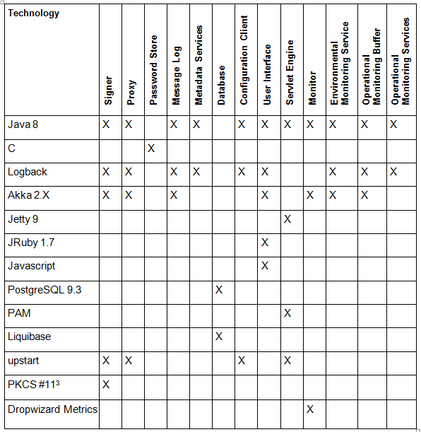

# X-Road technologies

**Technical Specification**

Version: 0.1
21.12.2017
Doc. ID: ARC

---

## Version history

 Date       | Version | Description                                                 | Author
 ---------- | ------- | ----------------------------------------------------------- | --------------------
 09.07.2015 | 0.1     | Initial version                                             | Antti Luoma
 

## Table of Contents

<!-- toc -->

- [License](#license)
- [1 X-Road technologies](#1-xroad-tech-overview)
- [2 Central server technologies](#2-cs-tech)
- [3 Configuration proxy technologies](#3-cp-tech)
- [4 Security server technologies](#4-ss-tech)

<!-- tocstop -->

[Technology Matrix General architecture](#2-xroad-tech-overview)

## 2 X-Road technologies Matrix

[Table 1](#Ref_Technology_matrix_of_the_X_Road) presents the list of technologies used in the X-Road and mapping between the technologies and X-Road components.

Table 1. Technology matrix of the X-Road

 **Technology**     | **Security server** | **Central server** | **Configuration proxy** | **Operational Monitoring Daemon**
----------------------- | ------------------- | ------------------ | ------------------- | -------------------
 Java 8             | X                   | X                  | X                       | X
 C                  | X                   | X                  |                         |
 Logback            | X                   | X                  | X                       | X
 Akka 2.X           | X                   | X                  |                         | X
 Jetty 9            | X                   | X                  |                         |
 JRuby 1.7          | X                   | X                  |                         |
 Ubuntu 14.04       | X                   | X                  | X                       | X
 PostgreSQL 9.3     | X                   | X                  |                         | X
 PostgreSQL 9.4     |                     | X\[[1](#Ref_1)\]               |                         |
 nginx              | X                   | X                  | X                       |
 PAM                | X                   | X                  |                         |
 Liquibase          | X                   |                    |                         | X
 upstart            | X                   | X                  | X                       | X
 PKCS \#11\[[2](#Ref_2)\]       | X                   | X                  | X                       |
 Dropwizard Metrics | X                   |                    |                         | X

\[1\] PostgreSQL 9.4 is used in High-Availability installation of X-Road central server.

\[2\] The use of hardware cryptographic devices requires that a PKCS \#11 driver is installed and configured in the system.

## 5 Central server technologies

[Table 1](#Ref_Technology_matrix_of_the_central_server) presents the list of technologies used in the security server and the mapping between technologies and central server components.

Table 1. Technology matrix of the central server

 **Technology** | **Signer** | **Web Server** | **Password Store** | **Management Services** | **Database** | **User Interface** | **Servlet Engine**
----------------|------------|----------------|--------------------|-------------------------|--------------|--------------------|--------------------
 Java 8         | X          |                |                    | X                       |              | X                  | X
 C              |            |                | X                  |                         |              |                    |
 Logback        | X          |                |                    | X                       |              | X                  |
 Akka 2.X       | X          |                |                    | X                       |              | X                  |
 Jetty 9        |            |                |                    |                         |              |                    | X
 JRuby 1.7      |            |                |                    |                         |              | X                  |
 Javascript     |            |                |                    |                         |              | X                  |
 PostgreSQL 9.3 |            |                |                    |                         | X            |                    |
 PostgreSQL 9.4 |            |                |                    |                         | X\[[5](#Ref_5)\]         |                    |                  
 nginx          |            | X              |                    |                         |              |                    |
 PAM            |            |                |                    |                         |              |                    | X
 Liquibase      |            |                |                    |                         | X            |                    |
 upstart        | X          | X              |                    |                         |              |                    | X
 PKCS \#11\[[6](#Ref_6)\]   | X          |                |                    |                         |              |                    |                  

\[5\] PostgreSQL 9.4 is used in High-Availability setup of the central server.

\[6\] The use of cryptographic hardware devices requires that a PKCS \#11 compliant device driver is installed and configured in the system.

## 5 Configuration proxy technologies

[Table 1](#Ref_Technology_matrix_of_the_configuration) presents the list of technologies used in the configuration proxy and the mapping between technologies and configuration proxy components.

Table 1. Technology matrix of the configuration proxy

 **Technology**   | **Web Server**   | **Configuration Processor**   | **Signer**   | **Configuration Client**
----------------- | ---------------- | ----------------------------- | ------------ | ------------------------
 Java 8           |                  | X                             | X            | X
 Logback          |                  | X                             | X            | X
 Akka 2.X         |                  | X                             | X            |
 nginx            | X                |                               |              |
 upstart          | X                | X                             | X            | X
 PKCS \#11\[[2](#Ref_2)\]   |                |                             | X          |

\[2\] The use of hardware cryptographic devices requires that a PKCS \#11 driver is installed and configured in the system.

## 4 Security server technologies

[Table 1](#Ref_Technology_matrix_of_the_security_server) presents the list of technologies used in the security server and the mapping between technologies and security server components.

Table 1. Technology matrix of the security server

<!--  -->
 **Technology**     | **Signer**   | **Proxy**   | **Password Store**   | **Message Log**   | **Metadata Services**   | **Database**   | **Configuration Client**   | **User Interface**   | **Servlet Engine**   | **Monitor**   | **Environmental Monitoring Service**   | **Operational Monitoring Buffer**   | **Operational Monitoring Services**
------------------- | --- | --- | --- | --- | --- | --- | --- | --- | --- | --- | --- | --- | ---
 Java 8             | X   | X   |     | X   | X   |     | X   | X   | X   | X   | X   | X   | X
 C                  |     |     | X   |     |     |     |     |     |     |     |     |     |
 Logback            | X   | X   |     | X   | X   |     | X   | X   |     |     | X   | X   | X
 Akka 2.X           | X   | X   |     | X   |     |     |     | X   |     | X   | X   | X   |
 Jetty 9            |     |     |     |     |     |     |     |     | X   |     |     |     |
 JRuby 1.7          |     |     |     |     |     |     |     | X   |     |     |     |     |
 Javascript         |     |     |     |     |     |     |     | X   |     |     |     |     |
 PostgreSQL 9.3     |     |     |     |     |     | X   |     |     |     |     |     |     |
 PAM                |     |     |     |     |     |     |     |     | X   |     |     |     |
 Liquibase          |     |     |     |     |     | X   |     |     |     |     |     |     |
 upstart            | X   | X   |     |     |     |     | X   |     | X   |     |     |     |
 PKCS \#11\[[3](#Ref_3)\]       | X   |     |     |     |     |     |     |     |     |     |     |     |
 Dropwizard Metrics |     |     |     |     |     |     |     |     |     | X   |     |     |

\[3\] The use of cryptographic hardware devices requires that a PKCS \#11 compliant device driver is installed and configured in the system.

