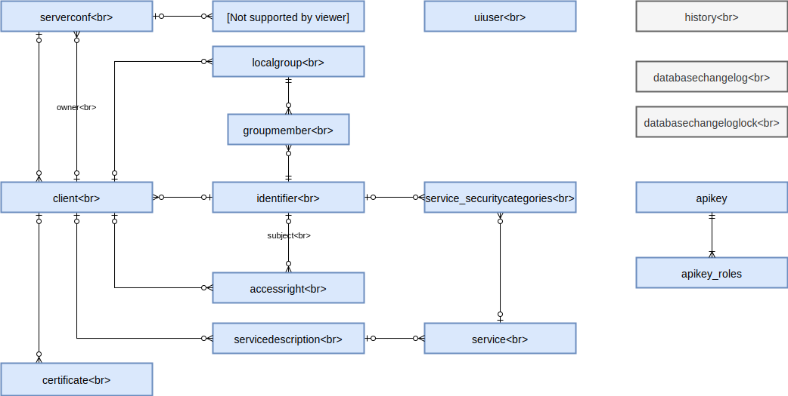

# X-Road: Security Server Configuration Data Model

Version: 1.8
Doc. ID: DM-SS

## Version history

| Date       | Version | Description                                                         | Author                          |
|------------|---------|---------------------------------------------------------------------|---------------------------------|
| 11.06.2015 | 0.1     | Initial version                                                     | Mait Märdin, Margus Freudenthal |
| 21.08.2015 | 0.4     | Added sections related to saving database history                   | Mait Märdin                     |
| 31.08.2015 | 0.5     | Removed backend URL that was removed from code                      | Margus Freudenthal              |
| 20.09.2015 | 1.0     | Editorial changes made                                              | Imbi Nõgisto                    |
| 19.10.2015 | 1.1     | Indexes added                                                       | Martin Lind                     |
| 11.12.2015 | 1.2     | Small fixes                                                         | Siim Annuk                      |
| 28.01.2019 | 1.3     | Wsdl changes to servicedescription. Document converted to Markdown. | Ilkka Seppälä                   |
| 26.03.2019 | 1.4     | Added tables for API keys                                           | Janne Mattila                   |
| 04.07.2019 | 1.5     | REST access rights                                                  | Jarkko Hyöty                    |
| 16.09.2019 | 1.6     | Remove Ubuntu 14.04 support                                         | Jarkko Hyöty                    |
| 26.09.2022 | 1.7     | Remove Ubuntu 18.04 support                                         | Andres Rosenthal                |
| 10.05.2023 | 1.8     | Security Categories removed.                                        | Justas Samuolis                 |

## Table of Contents
<!-- vim-markdown-toc GFM -->

* [License](#license)
* [1 General](#1-general)
  * [1.1 Preamble](#11-preamble)
  * [1.2 Database Version](#12-database-version)
  * [1.3 Creating, Backing Up and Restoring the Database](#13-creating-backing-up-and-restoring-the-database)
  * [1.4 Saving Database History](#14-saving-database-history)
  * [1.5 Entity-Relationship Diagram](#15-entity-relationship-diagram)
  * [1.6 List of Stored Procedures](#16-list-of-stored-procedures)
  * [1.7 List of Triggers](#17-list-of-triggers)
* [2 Description of Entities](#2-description-of-entities)
  * [2.1 ACCESSRIGHT](#21-accessright)
    * [2.1.1 Indexes](#211-indexes)
    * [2.1.2 Attributes](#212-attributes)
  * [2.2 APIKEY](#22-apikey)
    * [2.2.1 Attributes](#221-attributes)
  * [2.3 APIKEY_ROLES](#23-apikey_roles)
    * [2.3.1 Indexes](#231-indexes)
    * [2.3.2 Attributes](#232-attributes)
  * [2.4 CERTIFICATE](#24-certificate)
    * [2.4.1 Attributes](#241-attributes)
  * [2.5 CLIENT](#25-client)
    * [2.5.1 Indexes](#251-indexes)
    * [2.5.2 Attributes](#252-attributes)
  * [2.6 DATABASECHANGELOG](#26-databasechangelog)
    * [2.6.1 Attributes](#261-attributes)
  * [2.7 DATABASECHANGELOGLOCK](#27-databasechangeloglock)
    * [2.7.1 Attributes](#271-attributes)
  * [2.8 GROUPMEMBER](#28-groupmember)
    * [2.8.1 Indexes](#281-indexes)
    * [2.8.2 Attributes](#282-attributes)
  * [2.9 HISTORY](#29-history)
    * [2.9.1 Attributes](#291-attributes)
  * [2.10 IDENTIFIER](#210-identifier)
    * [2.10.1 Attributes](#2101-attributes)
  * [2.11 LOCALGROUP](#211-localgroup)
    * [2.11.1 Indexes](#2111-indexes)
    * [2.11.2 Attributes](#2112-attributes)
  * [2.12 SERVERCONF](#212-serverconf)
    * [2.12.1 Indexes](#2121-indexes)
    * [2.12.2 Attributes](#2122-attributes)
  * [2.13 SERVICE](#213-service)
    * [2.13.1 Indexes](#2131-indexes)
    * [2.13.2 Attributes](#2132-attributes)
  * [2.14 TSP](#215-tsp)
    * [2.14.1 Indexes](#2151-indexes)
    * [2.14.2 Attributes](#2152-attributes)
  * [2.15 UIUSER](#216-uiuser)
    * [2.15.1 Attributes](#2161-attributes)
  * [2.16 SERVICEDESCRIPTION](#217-servicedescription)
    * [2.16.1 Indexes](#2171-indexes)
    * [2.16.2 Attributes](#2172-attributes)
  * [2.17 ENDPOINT](#218-endpoint)
    * [2.17.1 Indexes](#2181-indexes)
    * [2.17.2 Attributes](#2182-attributes)

<!-- vim-markdown-toc -->

## License

This work is licensed under the Creative Commons Attribution-ShareAlike 3.0 Unported Li-cense. To view a copy of this license, visit http://creativecommons.org/licenses/by-sa/3.0/.

## 1 General

### 1.1 Preamble

This document describes database model of X-Road security server. 

### 1.2 Database Version

This database assumes PostgreSQL version 9.2 or later.

### 1.3 Creating, Backing Up and Restoring the Database

This database is integrated into X-Road security server application. The database management functions are embedded into the application user interface.
The database, the database user and the data model is created by the application's installer. The database updates are packaged as application updates and are applied when the application is upgraded. From the technical point of view, the database structure is created and updated using [Liquibase](http://www.liquibase.org/) tool. The migration scripts can be found both in application source and in file system of the installed application.
Database backup functionality is built into the application. The backup operation can be invoked from the web-based user interface or from the command line. The backup contains dump of all the database structure and contents. When restoring the application, first the software is installed and then the configuration database is restored together with all the other necessary files. This produces a working security server. 
Note: backing up of security server does not include message log that is managed using different tools.

### 1.4 Saving Database History

This section describes a general mechanism for storing history of the database tables. All the history-aware tables have associated trigger update_history that records all the modifications to data. All the tables of security server database are history-aware, except for

  * history
  * databasechangelog
  * databasechangeloglock

When a row is created, updated or deleted in one of the history-aware tables, the trigger update_history is activated and invokes the stored procedure add_history_rows. For each changed column, add_history_rows inserts a row into the history table. The details of the stored procedures are described in section 1.6.

### 1.5 Entity-Relationship Diagram

### 1.6 List of Stored Procedures

1. add_history_rows: Detects the changes made as a result of the operation it is invoked on, and calls the insert_history_row stored procedure to insert a row to the history table, for each changed field. For insertions and deletions, a history record is inserted for each field of the original table.
2. insert_history_row: Inserts a single row with values corresponding to a changed field in one of the database tables. Invoked by the add_history_rows stored procedure.

### 1.7 List of Triggers

1. update_history: Invokes the add_history_rows stored procedure upon insertions, updates and deletions of records. Created for each history-aware table.

## 2 Description of Entities

### 2.1 ACCESSRIGHT

Access right of a security server client or a group of clients to use a particular service. An access right record is created when an access right for a service is granted. The record is deleted when the service is removed from the system configuration or the access right is forfeited. The record is never modified.

#### 2.1.1 Indexes

| Name        | Columns           |
|:----------- |:-----------------:|
| ACCESSRIGHT_CLIENT_ID_fkey | client_id |
| AUTHORIZEDSUBJECT_SUBJECTID_fkey | subjectid |

#### 2.1.2 Attributes

| Name        | Type           | Modifiers        | Description          |
|:----------- |:--------------:|:----------------:|:--------------------|
| id [PK]     | bigint         | NOT NULL         | Primary key          |
| client_id [FK] | bigint         |         | The security server client who provides the service. References id attribute of CLIENT entity.          |
| subjectid [FK]     | bigint         | NOT NULL         | Identifier of a subject that is authorized to access the service. Can be either a member, a subsystem, global group or local group. References id attribute of IDENTIFIER entity.          |
| rightsgiven     | timestamp without time zone         | NOT NULL         | The time when the access right was granted.           |
| endpoint_id [FK]     | bigint         |         | The authorized endpoint. References id attribute of ENDPOINT entity. |

### 2.2 APIKEY

API key which grants access to REST API operations.

#### 2.2.1 Attributes

| Name        | Type           | Modifiers        | Description          |
|:----------- |:--------------:|:----------------:|:--------------------:|
| id [PK]     | bigint         | NOT NULL         | Primary key          |
| encodedkey | character varying(255) | NOT NULL | Encoded API key |

### 2.3 APIKEY_ROLES

Roles linked to one API key.

#### 2.3.1 Indexes

| Name        | Columns           |
|:----------- |:-----------------:|
| unique_apikey_role | apikey_id, role |

#### 2.3.2 Attributes

| Name        | Type           | Modifiers        | Description          |
|:----------- |:--------------:|:----------------:|:--------------------:|
| id [PK]     | bigint         | NOT NULL         | Primary key          |
| apikey_id [FK]     | bigint         | NOT NULL         | Links one role to an API key          |
| role | character varying(255) | NOT NULL | Role name. Check constraint `valid_role` limits value to valid ones. |

### 2.4 CERTIFICATE

Trusted authentication certificate associated with an information system belonging to a particular security server client. A certificate record is created when a certificate is uploaded for a security server client. The record is deleted when the certificate is deleted from the system configuration. The record is never modified.

#### 2.4.1 Attributes

| Name        | Type           | Modifiers        | Description           |
|:----------- |:-----------------:|:----------- |:-----------------|
| id [PK] | bigint | NOT NULL | Primary key |
| data | oid |  | X.509 public key certificate in binary DER form. |
| client_id [FK] | bigint | | The security server client whose information system server uses this authentication certificate. References id attribute of CLIENT entity. |

### 2.5 CLIENT

Member or subsystem that is using this security server. The security server owner is also registered as a client.
For owner, the record is created when the administrator initializes the security server. For security server users, the record is created when the administrator adds new client in the user interface.
The client record is deleted when the administrator removes the client in the user interface. The client record corresponding to the owner cannot be deleted.
The client record is modified when administrator changes parameters in the user interface or when automatic status update occurs (see below).
The field clientstatus shows the progress of registering in central server the connection between this security server client and this security server. Only in “registered” state can the security server exchange messages on behalf of this client.

* _saved_ -- initial state. Client enters it immediately after creation. From this state the administrator can send registration request to the central server.
* _registration in progress_ -- the administrator has successfully sent registration request to the central server. In this state the security server is waiting for approval of the client registration request. When the security server receives a global configuration that contains connection between the security server and the client, it enters the “registered” state.
* _registered_ -- the registration request sent to the central server is approved and the connection between the client and the security server is registered in the global configuration. In this state the security server can exchange messages on behalf of the client.
* _deletion in progress_ -- the security server has successfully sent client deletion request to the central server. From this state, the only possible action is to delete the client from security server configuration.
* _global error_ -- the client was in state “registered”, but the connection between the client and the security server has been deleted from the global configuration. From this state the administrator can either wait for updated global configuration (in case the deletion was caused by an error), contact the systems administrator of the central server or delete the client.

#### 2.5.1 Indexes

| Name        | Columns           |
|:----------- |:-----------------:|
| CLIENT_CONF_ID_fkey | conf_id   |
| CLIENT_IDENTIFIER_fkey | identifier |

#### 2.5.2 Attributes

| Name        | Type           | Modifiers        | Description           |
|:----------- |:-----------------:|:----------- |:-----------------|
| id [PK] | bigint | NOT NULL | Primary key |
| conf_id [FK] | bigint |  | Identifies the serverconf. References id attribute of SERVERCONF entity. |
| identifier [FK] | bigint |  | Identifies the security server client. References id attribute of IDENTIFIER entity. |
| clientstatus | character varying(255) |  | Current status of the client. Possible values are “saved”, “registration in progress”, “registered”, “deletion in progress”, “global error” |
| isauthentication | character varying(255) |  | Type of HTTPS authentication that is used with the client's information systems. Possible values are the following <ul><li>“NOSSL” -- the client can connect with HTTP or HTTPS protocol. For HTTPS connection, no authentication is used.</li><li>“SSLNOAUTH” -- the client can only connect with HTTPS protocol. No certificate-based authentication is used.</li><li>“SSLAUTH” -- the client can only connect with HTTPS protocol. The client must authenticate the connection with certificate.</li></ul>|

### 2.6 DATABASECHANGELOG

Liquibase migration of the database. A record is created when the administrator updates the software package containing this database and the database structure needs to be modified. The record is never modified or deleted. This table has a technical nature and is not managed by X-Road application software.

#### 2.6.1 Attributes

| Name        | Type           | Modifiers        | Description           |
|:----------- |:--------------:|:---------------- |:----------------------|
| id [PK] | character varying(255) | NOT NULL | The identifier of the migration. |
| author | character varying(255) | NOT NULL | The author of the migration. |
| filename | character varying(255) | NOT NULL | The filename containing the migration script. |
| dateexecuted | timestamp with time zone | NOT NULL | The time when the migration was executed. Used with orderexecuted to determine rollback order. |
| orderexecuted | integer | NOT NULL | The order number in which the migration was executed. Used in addition to dateexecuted to ensure order is correct even when the databases datetime supports poor resolution. |
| exectype | character varying(10) | NOT NULL | The type of the execution that was performed. Possible values are EXECUTED, FAILED, SKIPPED, RERAN, and MARK_RAN. |
| md5sum | character varying(35) |  | The MD5 hash of the migration script when it was executed. Used on each run to ensure there have been no unexpected changes to the migration script. |
| description | character varying(255) |  | Short auto-generated human readable description of the migration. |
| comments | character varying(255) |  | The comments of the migration. |
| tag | character varying(255) |  | The tag of the migration. |
| liquibase | character varying(20) |  | The version of the Liquibase that performed the migration. |
| contexts | character varying(255) |  | Contexts of the migration. |
| labels | character varying(255) |  | Labels of the migration. |
| deployment_id | character varying(10) |  | Deployment id of the migration. |

### 2.7 DATABASECHANGELOGLOCK

Lock used by Liquibase to allow only one migration of the database to run at a time. This table has a technical nature and is not managed by X-Road application software.

#### 2.7.1 Attributes

| Name        | Type           | Modifiers        | Description           |
|:----------- |:-----------------:|:----------- |:-----------------|
| id [PK] | integer | NOT NULL | Primary key. Id of the lock. Currently there is only one lock. |
| locked | boolean | NOT NULL | Set to "1" if the Liquibase is running against this database. Otherwise set to "0". |
| lockgranted | timestamp with time zone |  | Date and time when the lock was granted. |
| lockedby | character varying(255) |  | Human-readable description of who the lock was granted to. |

### 2.8 GROUPMEMBER

Member of a local group. A group membership record is created when the administrator adds a new subsystem to a local group. The record is deleted when the administrator removes the subsystem from the local group. The record is never modified. 

#### 2.8.1 Indexes

| Name        | Columns           |
|:----------- |:-----------------:|
| GROUPMEMBER_GROUPMEMBERID_fkey | groupmemberid |
| GROUPMEMBER_LOCALGROUP_ID_fkey | localgroup_id |

#### 2.8.2 Attributes

| Name        | Type           | Modifiers        | Description    |
|:----------- |:-----------------:|:----------- |:-----------------|
| id [PK] | bigint | NOT NULL | Primary key. |
| groupmemberid [FK] | bigint | NOT NULL | Identifier of the member or the subsystem who is a member of the local group. References id attribute of IDENTIFIER entity. |
| added | timestamp with time zone | NOT NULL | The time when the group member  was added. |
| localgroup_id [FK] | bigint |  | The local group. References id attribute of LOCALGROUP entity. |

### 2.9 HISTORY

Operations (insertions, updates and deletions of records) on the tables of this database, for the purpose of auditing. Each record corresponds to the change of a single field. The record is created in the manner described in section 1.4. The record is never modified or deleted.

#### 2.9.1 Attributes

| Name        | Type           | Modifiers        | Description           |
|:----------- |:-----------------:|:----------- |:-----------------|
| id [PK] | bigint | NOT NULL | Primary key. |
| operation  | character varying(255) | NOT NULL | Name of the database operation (possible values are INSERT, UPDATE, DELETE). |
| table_name   | character varying(255) | NOT NULL | Name of the table the operation was made on. |
| record_id  | bigint | NOT NULL | ID of the record that was inserted, updated or deleted, in the original table.  |
| field_name   | character varying(255) | NOT NULL | Name of the column that was inserted, updated or deleted.  |
| old_value   | text |  | Previous value of the column if applicable (NULL for INSERT operations).   |
| new_value  | text |  | New value of the column if applicable (NULL for DELETE operations).  |
| user_name   | character varying(255) | NOT NULL | Name of either the logged in user of the UI or the database user behind the connection, that initiated the operation. |
| timestamp  | timestamp without time zone | NOT NULL | Date and time of the operation.  |

### 2.10 IDENTIFIER

Identifier that can be used to identify various objects on X-Road. An identifier record is only created together with records of other entities and only one record of each identifier is ever created. For example, if a security server client record is created and its identifier is not found among identifier records, new one is created. The record is never modified or deleted.

#### 2.10.1 Attributes

| Name           |          Type          | Modifiers | Description                                                                                                                                                                                                                                                                                                         |
|:---------------|:----------------------:|:----------|:--------------------------------------------------------------------------------------------------------------------------------------------------------------------------------------------------------------------------------------------------------------------------------------------------------------------|
| id [PK]        |         bigint         | NOT NULL  | Primary key.                                                                                                                                                                                                                                                                                                        |
| discriminator  | character varying(255) | NOT NULL  | Technical attribute, specifying the Java class to which the identifier is mapped. Possible values are C (ClientId), S (ServiceId), CS (CentralServiceId), GG (GlobalGroupId), LG (LocalGroupId), SS (SecurityServerId). The corresponding Java classes are located in the `ee.ria.xroad.common.identifier` package. |
| type           | character varying(255) |           | Specifies the type of the object that the identifier identifies. Possible values, defined in enum `ee.ria.xroad.common.identifier.XroadObjectType`, are MEMBER, SUBSYSTEM, SERVICE, CENTRALSERVICE, GLOBALGROUP, LOCALGROUP, SERVER.                                                                                |
| xroadinstance  | character varying(255) |           | X-Road instance identifier. Present in identifiers of all types, except LOCALGROUP.                                                                                                                                                                                                                                 |
| memberclass    | character varying(255) |           | Member class. Present in identifiers of MEMBER, SUBSYSTEM, SERVER and SERVICE type.                                                                                                                                                                                                                                 |
| membercode     | character varying(255) |           | Member code. Present in identifiers of MEMBER, SUBSYSTEM, SERVER and SERVICE type.                                                                                                                                                                                                                                  |
| subsystemcode  | character varying(255) |           | Subsystem code. Present in identifiers of SUBSYSTEM and SERVICE type.                                                                                                                                                                                                                                               |
| serviceversion | character varying(255) |           | Service version. Present in identifiers of SERVICE type.                                                                                                                                                                                                                                                            |
| servicecode    | character varying(255) |           | Service code. Present in identifiers of SERVICE type.                                                                                                                                                                                                                                                               |
| groupcode      | character varying(255) |           | Group code. Present in identifiers of GLOBALGROUP and LOCALGROUP type.                                                                                                                                                                                                                                              |
| servercode     | character varying(255) |           | Security server code. Present in identifiers of SERVER type.                                                                                                                                                                                                                                                        |

### 2.11 LOCALGROUP

Group of members and/or subsystems. The group is local to a security server client and is used in access rights management. Local groups are connected to a security server client and can only be used for services belonging to that client. A local group record is created when the administrator adds a new local group to a security server client. The record is modified when the administrator changes the description of the group. The record is deleted when the administrator deletes the group or the security server client for whom the group is defined.

#### 2.11.1 Indexes

| Name        | Columns           |
|:----------- |:-----------------:|
| LOCALGROUP_CLIENT_ID_fkey | client_id |

#### 2.11.2 Attributes

| Name        | Type           | Modifiers        | Description           |
|:----------- |:-----------------:|:----------- |:-----------------|
| id [PK] | bigint | NOT NULL | Primary key |
| groupcode] | character varying(255) | NOT NULL | The code of the group. |
| description | character varying(255) | NOT NULL | The description of the group. |
| updated | timestamp with time zone | NOT NULL | The time when the description of the group was last updated. |
| client_id [FK] | bigint |  | The security server client for whom the local group is defined. References id attribute of CLIENT entity. |

### 2.12 SERVERCONF

The top-level configuration of the security server, specifying the owner and the code of this security server. This table contains only one record that is created when the security server is initialized. The record is never modified or deleted.

#### 2.12.1 Indexes

| Name        | Columns           |
|:----------- |:-----------------:|
| SERVERCONF_OWNER_fkey | owner |

#### 2.12.2 Attributes

| Name        | Type           | Modifiers        | Description           |
|:----------- |:-----------------:|:----------- |:-----------------|
| id [PK] | bigint | NOT NULL | Primary key. |
| servercode  | character varying(255) |  | The code of this security server.  |
| owner [FK]  | bigint |  | The security server client who is the owner of this security server. References id attribute of CLIENT entity. |

### 2.13 SERVICE

Service provided by a security server client. A service record is created when the administrator adds or refreshes a WSDL of a security server client, and a new service description is found in the WSDL. The record is modified if the administrator edits the service parameters in the user interface. The record is deleted when the administrator deletes the WSDL containing the service description or when the administrator deletes the security server client owning the WSDL.

#### 2.13.1 Indexes

| Name        | Columns           |
|:----------- |:-----------------:|
| SERVICE_WSDL_ID_fkey | wsdl_id |

#### 2.13.2 Attributes

| Name        | Type           | Modifiers        | Description           |
|:----------- |:-----------------:|:----------- |:-----------------|
| id [PK] | bigint | NOT NULL | Primary key. |
| servicecode | character varying(255) | NOT NULL | The code of the service. |
| serviceversion | character varying(255) |  | The version of the service.|
| title | character varying(255) |  | The title of the service. |
| url | character varying(255) |  | The URL of the service. |
| sslauthentication | boolean |  | A flag indicating whether the certificate of the service provider should be verified for SSL/TLS connections. NULL value is interpreted as true. Trusted service provider certificates are stored as CERTIFICATE entities. |
| timeout | integer |  | The maximum time in seconds that the service provider can  take to respond to a query. |
| servicedescription_id [FK] | bigint |  | The servicedescription of which this service is part of. References id attribute of SERVICEDESCRIPTION entity. |

### 2.14 TSP

Timestamping service provider (TSP) that is used by the security server to time-stamp messages stored in the message log. Only connection parameters to the TSP are included. The data needed for verifying time stamps is read from the global configuration. A TSP record is created when the administrator adds a new TSP in the user interface. The record is deleted when the administrator deletes the TSP in the user interface. The record is never modified. 

#### 2.14.1 Indexes

| Name        | Columns           |
|:----------- |:-----------------:|
| TSP_CONF_ID_fkey | conf_id      |

#### 2.14.2 Attributes

| Name        | Type           | Modifiers   | Description      |
|:----------- |:--------------:|:----------- |:-----------------|
| id [PK]     | bigint         | NOT NULL    | Primary key.     |
| conf_id [FK] | bigint |  | Identifies the serverconf. References the id in SERVERCONF table. |
| name  | character varying(255) |  | The name of the TSP. Used for displaying in the user interface. |
| url  | character varying(255) | NOT NULL | The URL of the TSP. The security server will send time-stamping request using HTTP POST method.  |

### 2.15 UIUSER

Preferences of the user interface user. A record is created when the user changes the user interface language for the first time. The record is modified on later changes to the language. The record is never deleted.

#### 2.15.1 Attributes

| Name        | Type           | Modifiers   | Description      |
|:----------- |:--------------:|:----------- |:-----------------|
| id [PK]     | bigint         | NOT NULL    | Primary key.     |
| username | character varying(255) | NOT NULL | Name of the user who has customized their user interface language. |
| locale | character varying(255) |  | The preferred language code. Valid values are 'en' for English, and 'et' for Estonian. |

### 2.16 SERVICEDESCRIPTION

Pointer to a SERVICEDESCRIPTION containing the descriptions of services provided by a security server client. A SERVICEDESCRIPTION record is created when the administrator adds a new service description to a security server client in the user interface. The record is modified when the administrator refreshes, enables or disables the service description. The record is deleted when the administrator deletes the service description or the security server client owning the service description.

#### 2.16.1 Indexes

| Name        | Columns           |
|:----------- |:-----------------:|
| WSDL_CLIENT_ID_fkey | client_id |

#### 2.16.2 Attributes

| Name        | Type           | Modifiers        | Description     |
|:----------- |:-----------------:|:----------- |:------------------|
| id [PK] | bigint | NOT NULL | Primary key. |
| client_id [FK] | bigint |   | The security server client providing the services described in this SERVICEDESCRIPTION. References id attribute of CLIENT entity. |
| url | character varying(255) | NOT NULL | The URL of the SERVICEDESCRIPTION. The URL points to the information system of the security server client. |
| disabled | boolean | NOT NULL | A flag indicating whether the SERVICEDESCRIPTION and all its services are disabled. |
| disablednotice | character varying(255) |   | The error message returned in response to a call to a service belonging to a disabled SERVICEDESCRIPTION. |
| refresheddate | timestamp with time zone |   | The time when the SERVICEDESCRIPTION was last refreshed. |
| type | character varying(255) | NOT NULL | The type of the service description. At the time of writing 'WSDL' and 'OPENAPI3' types are supported. |

### 2.17 ENDPOINT

#### 2.17.1 Indexes

| Name        | Columns           |
|:----------- |:-----------------:|
| pk_endpoint | id                |
| ix_endpoint (unique)| client_id, servicecode, method, path |

#### 2.17.2 Attributes

| Name           | Type           | Modifiers   | Description     |
|:-------------- |:--------------:|:----------- |:----------------|
| id [PK]        | bigint         | NOT NULL    | Primary key.    |
| client_id [FK] | bigint         |         | The security server client who provides the service. References id attribute of CLIENT entity.          |
| servicecode    | character varying(255)  | NOT NULL | The service code part of the service identifier. |
| method         | character varying(255)  | NOT NULL | The allowed HTTP method (REST services) |
| path           | character varying(2048) | NOT NULL | Allowed URL path (REST services) |
| generated      | boolean        | NOT NULL | Is the endpoint automatically generated (true) or manually added (false) |
