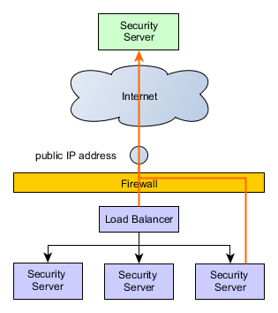

# X-Road: External Load Balancer Installation Guide

Version: 1.0  
Doc. ID: IG-XLB


| Date       | Version     | Description                                             | Author                      |
|------------|-------------|---------------------------------------------------------|-----------------------------|
| 9.3.2017   | 1.0         | Initial version                                         | Jarkko Hyöty, Olli Lindgren |


## Table of Contents

<!-- toc -->

- [License](#license)
- [1. Introduction](#1-introduction)
  * [1.1 Target Audience](#11-target-audience)
  * [1.2 References](#12-references)
- [2. Overview](#2-overview)
  * [2.1 Goals and assumptions](#21-goals-and-assumptions)
  * [2.2 Communication with external servers and services: The cluster from the point of view of a client or service](#22-communication-with-external-servers-and-services-the-cluster-from-the-point-of-view-of-a-client-or-service)
  * [2.3 State replication from the master to the slaves](#23-state-replication-from-the-master-to-the-slaves)
    + [2.3.1 `serverconf` database replication](#231-serverconf-database-replication)
    + [2.3.2 `messagelog` database replication](#232-messagelog-database-replication)
    + [2.3.3 Key configuration and software token replication from `/etc/xroad/signer/*`](#233-key-configuration-and-software-token-replication-from-etcxroadsigner)
    + [2.3.4 Other server configuration parameters from `/etc/xroad/*`](#234-other-server-configuration-parameters-from-etcxroad)
    + [2.3.5 OCSP response replication from `/var/cache/xroad/`](#235-ocsp-response-replication-from-varcachexroad)
- [3. X-Road Installation and configuration](#3-x-road-installation-and-configuration)
  * [3.1 Prerequisites](#31-prerequisites)
  * [3.2 Master installation](#32-master-installation)
  * [3.3 Slave installation](#33-slave-installation)
  * [3.4 Health check service configuration](#34-health-check-service-configuration)
    + [3.4.1 Known check result inconsistencies vs. actual state](#341-known-check-result-inconsistencies-vs-actual-state)
    + [3.4.2 Health check examples](#342-health-check-examples)
- [4. Database replication setup](#4-database-replication-setup)
  * [4.1 Setting up TLS certificates for database authentication](#41-setting-up-tls-certificates-for-database-authentication)
  * [4.2 Creating a separate PostgreSQL instance for the `serverconf` database](#42-creating-a-separate-postgresql-instance-for-the-serverconf-database)
    + [4.2.1 on RHEL](#421-on-rhel)
    + [4.2.2 on Ubuntu](#422-on-ubuntu)
  * [4.3 Configuring the master instance for replication](#43-configuring-the-master-instance-for-replication)
  * [4.5 Configuring the slave instance for replication](#45-configuring-the-slave-instance-for-replication)
- [5. Configuring data replication with rsync over SSH](#5-configuring-data-replication-with-rsync-over-ssh)
  * [5.1 Set up SSH between slaves and the master](#51-set-up-ssh-between-slaves-and-the-master)
  * [5.2 Set up periodic configuration synchronization](#52-set-up-periodic-configuration-synchronization)
    + [5.2.1 RHEL: Use `systemd` for configuration synchronization](#521-rhel-use-systemd-for-configuration-synchronization)
    + [5.2.2 Ubuntu: Use upstart and cron for configuration synchronization](#522-ubuntu-use-upstart-and-cron-for-configuration-synchronization)
    + [5.3 Set up log rotation for the sync log](#53-set-up-log-rotation-for-the-sync-log)

<!-- tocstop -->

## License

This document is licensed under the Creative Commons Attribution-ShareAlike 3.0 Unported License. To view a copy of this
license, visit http://creativecommons.org/licenses/by-sa/3.0/.

## 1. Introduction

### 1.1 Target Audience

The intended audience of this installation guide are the X-Road security server administrators responsible for installing
and configuring X-Road security servers to use external load balancing. The document is intended for readers with a good
knowledge of Linux server management, computer networks, database administration, clustered environments and the X-Road
functioning principles.

### 1.2 References

| Document Id    |  Document                                                                                |
|:--------------:|:-----------------------------------------------------------------------------------------|
| \[SS-CLUSTER\] | [Readme: Security server cluster setup with Ansible](../../../ansible/ss_cluster/README.md) |
| \[IG-SS\] | [X-Road: Security Server Installation Guide](../ig-ss_x-road_v6_security_server_installation_guide.md) |


## 2. Overview 

This document describes the external load balancing support features implemented by X-Road and the steps necessary to
configure security servers to run as a cluster where each node has an identical configuration, including their keys and
certificates. X-Road security server configuration changes are handled by a single master server and one or more slave
servers.

### 2.1 Goals and assumptions

The primary goal of the load balancing support is, as the name suggests, load balancing, not fault tolerance.
A clustered environment increases fault tolerance but some X-Road messages can still be lost if a security server node fails.

The implementation does not include a load balancer component. It should be possible to use any external load balancer
component that supports HTTP-based health checks for the nodes and load balancing at the TCP level (eg. haproxy, nginx,
AWS ELB or Classic Load Balancing, or a hardware appliance). A health check service is provided for monitoring a node's
status, this is described in more detail in section [3.4 Health check service configuration](#34-health-check-service-configuration)

The load balancing support is implemented with a few assumptions about the environment that users should be aware of.
Carefully consider these assumptions before deciding if the supported features are suitable for your needs.

<a name="basic_assumptions"></a>
__Basic Assumptions about the load balanced environment:__
* Adding or removing nodes to or from the cluster is infrequent. New nodes need to be added manually and this takes some
  time.
* Configuration changes are relatively infrequent and some downtime in ability to change configuration can be tolerated.
  (The cluster uses a master-slave model and the configuration master is not replicated.)
  
__Consequences of the selected implementation model:__  
* Changes to the `serverconf` database, authorization and signing keys are applied via the configuration master, which is
  a member of the cluster. The replication is one-way from master to slaves and the slaves should treat the configuration
  as read-only.
* The cluster nodes can continue operation if the master fails but the configuration can not be changed until:
  - the master becomes back online, or
  - some other node is manually promoted to be the master.
* If a node fails, the messages being processed by that node are lost.
  - It is the responsibility of the load balancer component to detect the failure and route further messages to other nodes.
    Because there potentially is some delay before the failure is noticed, some messages might be lost due to the delay.
  - Recovering lost messages is not supported by the load balancing support.
* Configuration updates are asynchronous and the cluster state is eventually consistent.
* If the master node fails or communication is interrupted during a configuration update, each slave should have a valid
  configuration, but the cluster state can be inconsistent (some members might have the old configuration while some might
  have received all the changes).
  
### 2.2 Communication with external servers and services: The cluster from the point of view of a client or service

When external security servers communicate with the cluster, they see only the public IP address of the cluster which is
registered to the global configuration as the security server address. From the caller point of view, this case is analogous
to making a request to a single security server.


When a security server makes a request to an external server (security server, OCSP, TSA or a central server), the
external server sees only the public IP address. Note that depending on the configuration, the public IP address
might be different from the one used in the previous scenario. It should also be noted that the security servers will
independently make requests to OCSP and TSA services as well as the and central server to fetch the global configuration
as needed.



### 2.3 State replication from the master to the slaves


                                                                                                
#### 2.3.1 `serverconf` database replication
| Data            | Replication          | Replication method                                 |
| ------------------- | -------------------- | -------------------------------------------------- |
| serverconf database | **replication required** | PostgreSQL streaming replication (Hot standby) |

The serverconf database replication is done using streaming replication with hot standby. Note that PostgreSQL replication
is all-or-nothing, it is not possible exclude databases from the replication. This is why the replicated serverconf and
non-replicated messagelog databases need to be separated to different instances.


#### 2.3.2 `messagelog` database replication
| Data               | Replication          | Replication method                                 |
| ------------------- | -------------------- | -------------------------------------------------- |
| messagelog database | **not replicated** |                                                      |

The messagelog database is not replicated. Each node has its own separate messagelog database. **However**, in order to
support PostgreSQL streaming replication (hot standby mode) for the serverconf data, the serverconf and messagelog
databases must be separated. This requires modifications to the installation (a separate PostgreSQL instance is needed
for the messagelog database) and has some implications on the security server resource requirements as since a separate
instance uses some memory.

#### 2.3.3 Key configuration and software token replication from `/etc/xroad/signer/*`
| Data                           | Replication          | Replication method                                 |
| ------------------------------- | -------------------- | -------------------------------------------------- |
| keyconf and the software token  | **replicated**       |  `rsync+ssh`  (scheduled)                          |

Previously, any external modification to `/etc/xroad/signer/keyconf.xml` was overwritten by the X-Road signer process if
it was running. Therefore, replicating the signer configuration without service disruptions would have required taking the
cluster members offline one-by-one. The load balancing support adds the possibility for external modifications to the
keyconf.xml to be applied on slave nodes without service disruptions. The actual state replication is done with a scheduled
rsync over ssh. This might take a few minutes so a slight delay in propagating the changes must be tolerated by the
clustered environment. A small delay should usually cause no problems as new keys and certificates are unlikely to be used
immediately for X-Road messaging. Changes to the configuration are also usually relatively infrequent. These were one of
the [basic assumptions](#basic_assumptions) about the environment. Users should make sure this holds true for them.

The slave nodes use the `keyconf.xml` in read-only mode, no changes are persisted to disk. Slaves reload the configuration
from disk periodically and apply the changes to their running in-memory configuration.


#### 2.3.4 Other server configuration parameters from `/etc/xroad/*`
| Data                                 | Replication          | Replication method                                 |
| ------------------------------------- | -------------------- | -------------------------------------------------- |
| other server configuration parameters | **replicated**       |  `rsync+ssh`  (scheduled)                          |

The following configurations are excluded from replication:
* `db.properties` (node-specific)
* `postgresql/*` (node-specific keys and certs)
* `globalconf/` (syncing globalconf could conflict with `confclient`)
* `conf.d/node.ini` (specifies node type: master or slave)

#### 2.3.5 OCSP response replication from `/var/cache/xroad/`
| State                                 | Replication          | Replication method                                 |
| ------------------------------------- | -------------------- | -------------------------------------------------- |
| other server configuration parameters | **not replicated**   |                   |

The OCSP responses are currently not replicated. Replicating them could make the cluster more fault tolerant but the
replication cannot simultaneously create a single point of failure. A distributed cache could be used for the responses.


## 3. X-Road Installation and configuration

You can set up the cluster manually, or use the provided Ansible playbook \[[SS-CLUSTER](#12-references)\] if it suits
your purposes.

### 3.1 Prerequisites

In order to properly set up the data replication, the slave nodes must be able to connect to:
* the master server using SSH (tcp port 22), and
* the master `serverconf` database (e.g. tcp port 5433).


### 3.2 Master installation

1. Install the X-Road security server packages using the normal installation procedure or use an existing standalone node.
2. Stop the xroad services.
3. Create a separate PostgreSQL instance for the `serverconf` database (see section
   [4. Database replication setup](#4-database-replication-setup) for details).
   * Change `/etc/db.properties` to point to the separate database instance
4. If you are using an already configured server as the master, you can copy over the `serverconf` database data. Otherwise,
   proceed to configure the master server: install the configuration anchor, set up basic information, create authentication
   and signing keys and so on. See the security server installation guide \[[IG-SS](#12-references)\] for help with the basic
   setup.
5. Set up and configure the data replication, see section
   [5. Configuring data replication with rsync over SSH](#5-configuring-data-replication-with-rsync-over-ssh)
   * Additionally, `rssh` shell can be used to to restrict slave access further, but note that it is not available on RHEL.

7. Configure the node type as `master` in `/etc/xroad/node.ini`:
      ```bash
      [Node]
      type=master
      ```
8. Start the X-Road services.


### 3.3 Slave installation
1. Install security server packages using the normal installation procedure. `nginx` or `xroad-jetty` packages  are not
   required for slave nodes, but the admin graphical user interface (which requires these packages) can be handy for
   diagnostics. It should be noted that changing a slave's configuration via the admin gui is not possible.
2. Stop the xroad services.
3. Create a separate PostgreSQL instance for the serverconf database (see section 
   [4. Database replication setup](#4-database-replication-setup) for details)
  * Change `/etc/db.properties` to point to the separate database instance and change password to match the one defined in the master database.
4. Set up SSH between the master and the slave (the slave must be able to access `/etc/xroad` via ssh)
   * Create an SSH keypair for `xroad` user and copy the public key to authorized keys of the master node
   (`/home/xroad-slave/.ssh/authorized_keys`)
5. Set up state synchronization using rsync+ssh. See section
   [5. Configuring data replication with rsync over SSH](#5-configuring-data-replication-with-rsync-over-ssh)
   * Make the inital synchronization between the master and the slave.
   ```bash
   rsync -e ssh -avz --delete --exclude db.properties --exclude "/postgresql" --exclude "/conf.d/node.ini" xroad-slave@<master>:/etc/xroad/ /etc/xroad/
   ```
   Where `<master>` is the master server.
6. Configure the node type as `slave` in `/etc/xroad/node.ini`:

      ```bash
      [Node]
      type=slave
      ```
7. Start the X-Road services.


### 3.4 Health check service configuration
The load balance support includes a health check service that can be used to ping the security server using HTTP to see if
it is healthy and likely to be able to send and receive messages. The service is disabled by default but can be enabled
via configuration options.

| Proxy service configuration option | Default value | Description |
|---|---|---|
| health-check-interface | `0.0.0.0` (all network interfaces) | The network interface this service listens to. This should be an address the load balancer component can use to check the server status |
| health-check-port | `0` (disabled) | The tcp port the service listens to for HTTP requests. The default value `0` disables the service. |

Below is a configuration that can be added to  `/etc/xroad/conf.d/local.ini` on the master that would enable the health check
service on all the nodes once the configuration has been replicated. Changes to the settings require restarting the
`xroad-proxy` service to take effect. This example enables listening to all available network interfaces (`0.0.0.0`) on
port 5588.

```
[Proxy]
health-check-interface=0.0.0.0
health-check-port=5588
```

The service can be accessed using plain HTTP. It will return `HTTP 200 OK` if the proxy should be able to process messages
and `HTTP 500 Internal Server Error` otherwise. A short message about the failure reason, if available, is added to the
body of the response. The service runs as a part of the `xroad-proxy` service.

In addition to implicitly verifying that the `xroad-proxy` service is running, the  health checks verify that:
* The server authentication key is accessible and that the OCSP response for the certificate is `good`. This requires a
running `xroad-signer` service in good condition.
* The `serverconf` database is accessible.

Each of these status checks has a separate timeout of 5 seconds. If the status check fails to produce a response in this
time, it will be considered a health check failure and will cause a `HTTP 500` response.

In addition, each status check result will be cached for a short while to avoid excess resource usage. A successful status
check result will be cached for 2 seconds before a new verification is triggered. This is to make sure the OK results are
as fresh as possible while avoiding per-request verification. In contrast, verification failures will be cached for 30
seconds before a new verification is triggered. This should allow for the security server to get up and running after a
failure or possible reboot before the status is queried again.


#### 3.4.1 Known check result inconsistencies vs. actual state
There is a known but rarely and not naturally occurring issue where the health check will report and OK condition for a
limited time but sending some messages might not be possible. This happens when an admin user logs out of the keys.

The health check will detect if the tokens (the key containers) have not been signed into after `xroad-signer` startup.
It will however, not detect immediately when the tokens are manually logged out of. The keys are cached by the `xroad-proxy`
process for a short while. As long as the authentication key is still cached, the health check will return OK. The necessary
signing context values for sending a message might no longer be cached though. This means messages might fail to be sent
even if the health check returns OK. As the authentication key expires from the cache (after a maximum of 5 minutes), the
health check will start returning failures. This is a feature of caching and not a bug per se. In addition, logging out
of a security server's keys should not occur by accident so it should not be a surprise that the node cannot send messages
after not having access to it's keys.


#### 3.4.2 Health check examples

Before testing with an actual load balancer, you can test the health check service with `curl`, for example.

Health check service response when everything is up and running and messages should go through.
```
$ curl -i localhost:5588
   HTTP/1.1 200 OK
   Content-Length: 0
   Server: Jetty(8.y.z-SNAPSHOT)
```

Health check service response when the service `xroad-signer` is not running.
```
$ curl -i localhost:5588
HTTP/1.1 500 Server Error
Transfer-Encoding: chunked
Server: Jetty(8.y.z-SNAPSHOT)

Fetching health check response timed out for: Authentication key OCSP status
```


## 4. Database replication setup

For technical details on the PostgreSQL replication, refer to the [official documentation](https://www.postgresql.org/docs/9.2/static/high-availability.html).
Note that the versions of PostgreSQL distributed with RHEL and Ubuntu are different. At the time of writing, RHEL 7
distributes PostgreSQL version 9.2 and Ubuntu 14.04 distributes version 9.3; the replication configuration is the same
for both versions.


### 4.1 Setting up TLS certificates for database authentication
This section describes how to create and set up certificate authentication between the slave and master database instances.

For further details on the certificate authentication, see the
[PostgreSQL documentation](https://www.postgresql.org/docs/9.2/static/auth-methods.html#AUTH-CERT).


1. Generate the Certificate Authority key and a self-signed certificate for the root-of-trust:

   ```
   openssl req -new -x509 -days 7300 -nodes -sha256 -out master.crt -keyout master.key -subj '/O=cluster/CN=master'
   ```
   The subject name does not really matter here. Remember to keep the `master.key` file in a safe place.

2. Generate keys and certificates signed by the CA for each postgresql instance, including the master. Do not use the CA
   certificate and key as the database certificate and key.

   ```
   openssl req -new -nodes -days 7300 -keyout server.key -out server.csr -subj "/O=cluster/CN=<nodename>"
   ```

   **Note:** The `<nodename>` must match a replication user name; otherwise the subject name does not matter

   ```
   openssl x509 -req -in server.csr -CAcreateserial -CA master.crt -CAkey master.key -days 7300 -out server.crt
   ```

3. Copy the certificates to `/etc/xroad/postgresql` on each cluster instance:

   ```bash
   sudo mkdir -p -m 0755 /etc/xroad/postgresql
   sudo chmod o+x /etc/xroad
   ```
   Copy the certificates, then copy one server key per instance so that each instance has a unique key:

   ```bash
   sudo chown postgres /etc/xroad/postgresql/server.key
   sudo chmod 400 /etc/xroad/postgresql/server.key
   ```

> Alternatively, an existing internal CA can be used for managing the certificates. A sub-CA should be created as the
> database cluster root-of-trust and use that for issuing the slave and master certificates.


### 4.2 Creating a separate PostgreSQL instance for the `serverconf` database

#### 4.2.1 on RHEL

Create a new `systemctl` service unit for the new database. As root, execute the following scripts:

```
cat <<EOF >/etc/systemd/system/postgresql-serverconf.service
.include /lib/systemd/system/postgresql.service
[Service]
Environment=PGPORT=5433
Environment=PGDATA=/var/lib/pgsql/serverconf
EOF
```
Create the database and configure SELinux:

```
PGSETUP_INITDB_OPTIONS="--auth-local=peer --auth-host=md5" postgresql-setup initdb postgresql-serverconf
semanage port -a -t postgresql_port_t -p tcp 5433
systemctl enable postgresql-serverconf
```

#### 4.2.2 on Ubuntu

```bash
sudo -u postgres pg_createcluster -p 5433 9.3 serverconf
```
In the above command, `9.3` is the postgresql version. Use `pg_lsclusters` to find out what version(s) are available.
 

**PostgreSQL configuration location:**
> On RHEL, PostgreSQL config files are located in the `PGDATA` directory `/var/lib/pgql/serverconf`.
> Ubuntu keeps the config in `/etc/postgresql/<version>/<cluster name>`, e.g. `/etc/postgresql/9.3/serverconf`


### 4.3 Configuring the master instance for replication

Edit `postgresql.conf` and set the following options:

```
ssl = on
ssl_ca_file   = '/etc/xroad/postgresql/master.crt'
ssl_cert_file = '/etc/xroad/postgresql/server.crt'
ssl_key_file  = '/etc/xroad/postgresql/server.key'       

listen_addresses = *    # (default is localhost. Alternatively: localhost, <IP of the interface the slaves connect to>")
wal_level = hot_standby
max_wal_senders   = 3   # should be ~ number of slaves plus some small number. Here, we assume there two slaves.
wal_keep_segments = 8   # keep some wal segments so that slaves that are offline can catch up.
```

Edit `pg_hba.conf` and enable connections to the replication pseudo database using client certificates. See chapter 
[4.1](#41-setting-up-tls-certificates-for-database-authentication) for the authentication setup.

```
hostssl     replication     +slavenode  samenet     cert
```
**Note:** The CN field in the certificate subject must match a replication user name in postgresql. See the [PostgreSQL
 documentation](https://www.postgresql.org/docs/9.3/static/auth-pg-hba-conf.html) for more details.

The `samenet` above assumes that the slaves will be in the same subnet as the master.

Start the master instance:

```bash
systemctl start postgresql-serverconf | /etc/init.d/postgresql start
```

Create the replication user(s) with password authentication disabled:
```bash
sudo -u postgres psql -p 5433 -c "CREATE ROLE slavenode NOLOGIN";
sudo -u postgres psql -p 5433 -c "CREATE USER <nodename> REPLICATION PASSWORD NULL IN ROLE slavenode";
```

Create a user named `serverconf` for local `serverconf` database access:

```bash
sudo -u postgres psql -p 5433 -c "CREATE USER serverconf PASSWORD '<password>'";
```

Copy the `serverconf` database from the default instance to the new instance:

```bash
sudo -u postgres pg_dump -C serverconf | sudo -u postgres psql -p 5433 -f -
```

### 4.5 Configuring the slave instance for replication

Prerequisites:
* A separate postgresql instance has been created.
* TLS keys and certificates have been configured in `/etc/xroad/postgresql` as described in section 
[4.1 Setting up TLS certificates for database authentication](#41-setting-up-tls-certificates-for-database-authentication)


Go to the postgresql data directory:
 * RHEL: `/var/lib/pgsql/serverconf`
 * Ubuntu: `/var/lib/postgresql/9.3/serverconf`
 
Clear the data directory:

 ```bash
 rm -rf *
 ```
 
Do a base backup with `pg_basebackup`:
```bash
sudo -u postgres PGSSLMODE=verify-ca PGSSLROOTCERT=/etc/xroad/postgresql/master.crt PGSSLCERT=/etc/xroad/postgresql/server.crt PGSSLKEY=/etc/xroad/postgresql/server.key pg_basebackup -h <master> -p 5433 -U <nodename> -D .
```
Add the following `recovery.conf` to the data directory:

```
standby_mode = 'on'
primary_conninfo = 'host=<master> port=5433 user=<nodename> sslmode=verify-ca sslcert=/etc/xroad/postgresql/server.crt sslkey=/etc/xroad/postgresql/server.key sslrootcert=/etc/xroad/postgresql/master.crt'
trigger_file = '/var/lib/xroad/postgresql.trigger'
```
Set owner of the `recovery.conf` to `postgres:postgres`, mode `0600`

Modify `postgresql.conf`:

```
ssl = on
ssl_ca_file   = '/etc/xroad/postgresql/master.crt'
ssl_cert_file = '/etc/xroad/postgresql/server.crt'
ssl_key_file  = '/etc/xroad/postgresql/server.key'
 
listen_addresses = localhost
 
# no need to send WAL logs
# wal_level = minimal
# max_wal_senders = 0
# wal_keep_segments = 0
 
hot_standby = on
hot_standby_feedback = on
```
Notice that on RHEL, during `pg_basebackup` the `postgresql.conf` was copied from the master node so the WAL sender
parameters should be disabled. Also check that `listen_addresses` is localhost-only.
 
Start the database instance

**RHEL:**
```bash
systemctl start postgresql-serverconf
```
**Ubuntu:**
```bash
/etc/init.d/postgresql start
```
Note that on Ubuntu, the command starts all configured database instances.
 
## 5. Configuring data replication with rsync over SSH

### 5.1 Set up SSH between slaves and the master
On the master, set up a system user that can read `/etc/xroad`. A system user has their password disabled and can not log
in normally.

**Ubuntu:**

```bash
adduser --system --ingroup xroad xroad-slave
```
**RHEL:**

``bash
useradd -r -m -g xroad xroad-slave
``


Create an `.ssh` folder and the authorized keys file:
```bash
sudo mkdir -m 755 -p /home/xroad-slave/.ssh && sudo touch /home/xroad-slave/authorized_keys
 ```
**Warning:**  The owner of the file should be `root` and `xroad-slave` should not have write permission to the file.

On the slave nodes, create an ssh key (`ssh-keygen`) without a passphrase for the `xroad` user and add the public keys in
the `/home/xroad-slave/.ssh/authorized_keys` of the master node. To finish, from slave nodes, connect to the master host
using `ssh` and accept the host key.

### 5.2 Set up periodic configuration synchronization

The following configuration will synchronize the configuration in `/etc/xroad` periodically (once per minute) and before
the services are started. That means that during boot, if the master server is available, the configuration will be
synchronized before the `xroad-proxy` service is started. If the master node is down, there will be a small delay before
the services are started.

> Note that only modifications to the signer keyconf will be applied when the system is running. Other configuration changes
> require restarting the services, which is not automatic.

#### 5.2.1 RHEL: Use `systemd` for configuration synchronization

Add `xroad-sync` as a `systemd` service.

Create a new file `/etc/systemd/system/xroad-sync.service`:
```
[Unit]
Description=X-Road Sync Task
After=network.target
Before=xroad-proxy.service
Before=xroad-signer.service
Before=xroad-confclient.service
Before=xroad-jetty.service
[Service]
User=xroad
Group=xroad
Type=oneshot
Environment=XROAD_USER={{ xroad_slave_ssh_user }}
Environment=MASTER={{ master_host }}
ExecStart=/usr/bin/rsync -e "ssh -o ConnectTimeout=5 " -aqz --timeout=10 --delete-delay --exclude db.properties --exclude "/conf.d/node.ini" --exclude "*.tmp" --exclude "/postgresql" --exclude "/nginx" --exclude "/globalconf" --delay-updates --log-file=/var/log/xroad/slave-sync.log ${XROAD_USER}@${MASTER}:/etc/xroad/ /etc/xroad/
[Install]
WantedBy=multi-user.target
WantedBy=xroad-proxy.service
```

Add a timer for periodic updates.

Create a new file `/etc/systemd/xroad-sync.timer`:

```
[Unit]
Description=Sync X-Road configuration
[Timer]
OnBootSec=60
OnUnitActiveSec=60
[Install]
WantedBy=timers.target
```

Configure SELinux to allow `rsync` to be run as a `systemd` service

```
setsebool -P rsync_client 1
setsebool -P rsync_full_access 1
```
Enable the services:
```
systemctl enable xroad-sync.timer xroad-sync.service
systemctl start xroad-sync.timer
```

#### 5.2.2 Ubuntu: Use upstart and cron for configuration synchronization

Create the main upstart task for syncing.

Create a new file: `/etc/init/xroad-sync.conf`:
```
# xroad-sync
env XROAD_USER={{ xroad_slave_ssh_user }}
env MASTER={{ master_host }}
task
script
  su -s /bin/sh -c 'exec "$0" "$@"' xroad -- rsync -e "ssh -o ConnectTimeout=5 " -aqz --timeout=10 --delete-delay --exclude db.properties --exclude "/conf.d/node.ini" --exclude "*.tmp" --exclude "/postgresql" --exclude "/nginx" --exclude "/globalconf" --delay-updates --log-file=/var/log/xroad/slave-sync.log ${XROAD_USER}@${MASTER}:/etc/xroad/ /etc/xroad/
end script
```

Create a helper task that ensures that the sync task is executed before the services are started.

Create a new file `/etc/init/xroad-sync-wait`:
```
# wait for xroad-sync to complete before starting services
start on starting xroad-proxy or starting xroad-jetty or starting xroad-signer or starting xroad-confclient
stop on stopped xroad-sync
instance $JOB
normal exit 2
task
script
  echo "$JOB"
  start xroad-sync || :
  sleep 360
end script
```

Add a cron job to periodically start the sync task as upstart does not have a timer facility.

Create a new file `/etc/cron.d/xroad-state-sync`:
```
* * * * * root /sbin/initctl --quiet start xroad-sync
```

**A note about the `rsync` options:**
>
>* `--delay-updates` and `--delete-delay` make the sync more atomic by delaying modifications until data has been
> downloaded. It is not fully atomic, however, since the files will be moved into place one by one. If the synchronization
> is disrupted, no modifications will be made.
> * low connect timeout (5 seconds) and receive timeout (10 seconds) ensure that the synchronization won't hang if e.g.
> a network connection fails.


#### 5.3 Set up log rotation for the sync log

The following configuration example rotates logs daily and keeps logs for 7 days which should be enough for troubleshooting.

Create a new file `/etc/logrotate.d/xroad-slave-sync`:

```
/var/log/xroad/slave-sync.log {
        daily
        rotate 7
        missingok
        compress
        su xroad xroad
        nocreate
}
```

