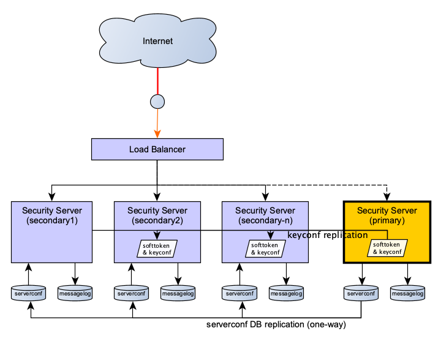

# X-Road: External Load Balancer Installation Guide

Version: 1.17 
Doc. ID: IG-XLB


| Date       | Version | Description                                                                                                              | Author                       |
|------------|---------|--------------------------------------------------------------------------------------------------------------------------|------------------------------|
| 22.3.2017  | 1.0     | Initial version                                                                                                          | Jarkko Hyöty, Olli Lindgren  |
| 27.4.2017  | 1.1     | Added slave node user group instructions                                                                                 | Tatu Repo                    |
| 15.6.2017  | 1.2     | Added health check interface maintenance mode                                                                            | Tatu Repo                    |
| 21.6.2017  | 1.3     | Added chapter 7 on [upgrading the security server cluster](#7-upgrading-a-clustered-x-road-security-server-installation) | Olli Lindgren                |
| 02.03.2018 | 1.4     | Added uniform terms and conditions reference                                                                             | Tatu Repo                    |
| 15.11.2018 | 1.5     | Updates for Ubuntu 18.04 support                                                                                         | Jarkko Hyöty                 |
| 20.12.2018 | 1.6     | Update upgrade instructions                                                                                              | Jarkko Hyöty                 |
| 11.09.2019 | 1.7     | Remove Ubuntu 14.04 support                                                                                              | Jarkko Hyöty                 |
| 08.10.2020 | 1.8     | Added notes about API keys and caching                                                                                   | Janne Mattila                |
| 19.10.2020 | 1.9     | Remove xroad-jetty and nginx mentions and add xroad-proxy-ui-api                                                         | Caro Hautamäki               |
| 19.10.2020 | 1.10    | Added information about management REST API permissions                                                                  | Petteri Kivimäki             |
| 23.12.2020 | 1.11    | Updates for Ubuntu 20.04 support                                                                                         | Jarkko Hyöty                 |
| 02.07.2021 | 1.12    | Updates for state sync                                                                                                   | Jarkko Hyöty                 |
| 25.08.2021 | 1.13    | Update X-Road references from version 6 to 7                                                                             | Caro Hautamäki               |
| 17.09.2021 | 1.14    | Add note about the proxy health check now also checking global conf validity                                             | Caro Hautamäki               |
| 17.06.2022 | 1.15    | Replace the word "replica" with "secondary"                                                                              | Petteri Kivimäki             |
| 26.09.2022 | 1.16    | Remove Ubuntu 18.04 support                                                                                              | Andres Rosenthal             |
| 01.03.2023 | 1.17    | Updates for user groups in secondary nodes                                                                               | Petteri Kivimäki             |
## Table of Contents

<!-- toc -->
<!-- vim-markdown-toc GFM -->

* [License](#license)
* [1. Introduction](#1-introduction)
  * [1.1 Target Audience](#11-target-audience)
  * [1.2 Terms and abbreviations](#12-terms-and-abbreviations)
  * [1.3 References](#13-references)
* [2. Overview](#2-overview)
  * [2.1 Goals and assumptions](#21-goals-and-assumptions)
    * [2.1.1 Basic assumptions about the load balanced environment](#211-basic-assumptions-about-the-load-balanced-environment)
    * [2.1.2 Consequences of the selected implementation model](#212-consequences-of-the-selected-implementation-model)
  * [2.2 Communication with external servers and services: The cluster from the point of view of a client or service](#22-communication-with-external-servers-and-services-the-cluster-from-the-point-of-view-of-a-client-or-service)
  * [2.3 State replication from the primary to the secondaries](#23-state-replication-from-the-primary-to-the-secondaries)
    * [2.3.1 Replicated state](#231-replicated-state)
      * [2.3.1.1 `serverconf` database replication](#2311-serverconf-database-replication)
      * [2.3.1.2 Key configuration and software token replication from `/etc/xroad/signer/*`](#2312-key-configuration-and-software-token-replication-from-etcxroadsigner)
      * [2.3.1.3 Other server configuration parameters from `/etc/xroad/*`](#2313-other-server-configuration-parameters-from-etcxroad)
    * [2.3.2 Non-replicated state](#232-non-replicated-state)
      * [2.3.2.1 `messagelog` database](#2321-messagelog-database)
      * [2.3.2.2 OCSP responses from `/var/cache/xroad/`](#2322-ocsp-responses-from-varcachexroad)
* [3. X-Road Installation and configuration](#3-x-road-installation-and-configuration)
  * [3.1 Prerequisites](#31-prerequisites)
  * [3.2 primary installation](#32-primary-installation)
  * [3.3 Secondary installation](#33-secondary-installation)
  * [3.4 Health check service configuration](#34-health-check-service-configuration)
    * [3.4.1 Known check result inconsistencies vs. actual state](#341-known-check-result-inconsistencies-vs-actual-state)
    * [3.4.2 Health check examples](#342-health-check-examples)
* [4. Database replication setup](#4-database-replication-setup)
  * [4.1 Setting up TLS certificates for database authentication](#41-setting-up-tls-certificates-for-database-authentication)
  * [4.2 Creating a separate PostgreSQL instance for the `serverconf` database](#42-creating-a-separate-postgresql-instance-for-the-serverconf-database)
    * [4.2.1 on RHEL](#421-on-rhel)
    * [4.2.2 on Ubuntu](#422-on-ubuntu)
  * [4.3 Configuring the primary instance for replication](#43-configuring-the-primary-instance-for-replication)
  * [4.4 Configuring the secondary instance for replication](#44-configuring-the-secondary-instance-for-replication)
* [5. Configuring data replication with rsync over SSH](#5-configuring-data-replication-with-rsync-over-ssh)
  * [5.1 Set up SSH between secondaries and the primary](#51-set-up-ssh-between-secondaries-and-the-primary)
  * [5.2 Set up periodic configuration synchronization on the secondary nodes](#52-set-up-periodic-configuration-synchronization-on-the-secondary-nodes)
    * [5.2.1 Use systemd for configuration synchronization](#521-use-systemd-for-configuration-synchronization)
  * [5.3 Set up log rotation for the sync log on the secondary nodes](#53-set-up-log-rotation-for-the-sync-log-on-the-secondary-nodes)
* [6. Verifying the setup](#6-verifying-the-setup)
  * [6.1 Verifying rsync+ssh replication](#61-verifying-rsyncssh-replication)
  * [6.2 Verifying database replication](#62-verifying-database-replication)
  * [6.3 Verifying replication from the admin user interface](#63-verifying-replication-from-the-admin-user-interface)
* [7. Upgrading a clustered X-Road security server installation](#7-upgrading-a-clustered-x-road-security-server-installation)
  * [7.1 Offline upgrade](#71-offline-upgrade)
  * [7.2 Online rolling upgrade](#72-online-rolling-upgrade)
    * [7.2.1 Pausing the database and configuration synchronization](#721-pausing-the-database-and-configuration-synchronization)
    * [7.2.2 Upgrading the primary](#722-upgrading-the-primary)
    * [7.2.3 Upgrade a single secondary node](#723-upgrade-a-single-secondary-node)

<!-- vim-markdown-toc -->
<!-- tocstop -->

## License

This document is licensed under the Creative Commons Attribution-ShareAlike 3.0 Unported License. To view a copy of this
license, visit http://creativecommons.org/licenses/by-sa/3.0/.

## 1. Introduction

### 1.1 Target Audience

The intended audience of this installation guide are the X-Road security server administrators responsible for installing
and configuring X-Road security servers to use external load balancing. The document is intended for readers with a good
knowledge of Linux server management, computer networks, database administration, clustered environments and the X-Road
functioning principles.

### 1.2 Terms and abbreviations

See X-Road terms and abbreviations documentation \[[TA-TERMS](#Ref_TERMS)\].

### 1.3 References

| Document Id    |  Document                                                                                |
|:--------------:|:-----------------------------------------------------------------------------------------|
| \[SS-CLUSTER\] | [Readme: Security server cluster setup with Ansible](../../../ansible/ss_cluster/README.md) |
| \[IG-SS\] | [X-Road: Security Server Installation Guide](../ig-ss_x-road_v6_security_server_installation_guide.md) |
| \[UG-SS\] | [X-Road 7 Security Server User Guide](../ug-ss_x-road_6_security_server_user_guide.md) |
| <a name="Ref_TERMS"></a>\[TA-TERMS\] | [X-Road Terms and Abbreviations](../../terms_x-road_docs.md)

## 2. Overview

This document describes the external load balancing support features implemented by X-Road and the steps necessary to
configure security servers to run as a cluster where each node has an identical configuration, including their keys and
certificates. X-Road security server configuration changes are handled by a single primary server and one or more secondary
servers.

Chapter [3. X-Road Installation and configuration](#3-x-road-installation-and-configuration) describes the installation
on a high level and as a whole. The later chapters cover the details of the different parts of the installation and configuration.
The last chapter briefly describes how the configuration can be verified.

### 2.1 Goals and assumptions

The primary goal of the load balancing support is, as the name suggests, load balancing, not fault tolerance.
A clustered environment increases fault tolerance but some X-Road messages can still be lost if a security server node fails.

The implementation does not include a load balancer component. It should be possible to use any external load balancer
component that supports HTTP-based health checks for the nodes and load balancing at the TCP level (eg. haproxy, nginx,
AWS ALB or Classic Load Balancer, or a hardware appliance). A health check service is provided for monitoring a node's
status, this is described in more detail in section [3.4 Health check service configuration](#34-health-check-service-configuration)

The load balancing support is implemented with a few assumptions about the environment that users should be aware of.
Carefully consider these assumptions before deciding if the supported features are suitable for your needs.

#### 2.1.1 Basic assumptions about the load balanced environment
* Adding or removing nodes to or from the cluster is infrequent. New nodes need to be added manually and this takes some
  time.
* Changes to the configuration files are relatively infrequent and some downtime in ability to propagate the changes can
  be tolerated.
* The cluster uses a primary-secondary model and the configuration primary is not replicated.

#### 2.1.2 Consequences of the selected implementation model
* Changes to the `serverconf` database, authorization and signing keys are applied via the configuration primary, which is
  a member of the cluster. The replication is one-way from primary to secondaries and the secondaries should treat the configuration
  as read-only.
* The cluster nodes can continue operation if the primary fails but the configuration can not be changed until:
  - the primary comes back online, or
  - some other node is manually promoted to be the primary.
* If a node fails, the messages being processed by that node are lost.
  - It is the responsibility of the load balancer component to detect the failure and route further messages to other nodes.
    Because there potentially is some delay before the failure is noticed, some messages might be lost due to the delay.
  - Recovering lost messages is not supported.
* Configuration updates are asynchronous and the cluster state is eventually consistent.
* If the primary node fails or communication is interrupted during a configuration update, each secondary should have a valid
  configuration, but the cluster state can be inconsistent (some members might have the old configuration while some might
  have received all the changes).

### 2.2 Communication with external servers and services: The cluster from the point of view of a client or service

When external security servers communicate with the cluster, they see only the public IP address of the cluster which is
registered to the global configuration as the security server address. From the caller point of view, this case is analogous
to making a request to a single security server.


When a security server makes a request to an external server (security server, OCSP, TSA or a central server), the
external server sees only the public IP address. Note that depending on the configuration, the public IP address
might be different from the one used in the previous scenario. It should also be noted that the security servers will
independently make requests to OCSP and TSA services as well as to the central server to fetch the global configuration
as needed.


### 2.3 State replication from the primary to the secondaries



#### 2.3.1 Replicated state

##### 2.3.1.1 `serverconf` database replication
| Data            | Replication          | Replication method                                 |
| ------------------- | -------------------- | -------------------------------------------------- |
| serverconf database | **replication required** | PostgreSQL streaming replication (Hot standby) |

The serverconf database replication is done using streaming replication with hot standby. Note that PostgreSQL replication
is all-or-nothing: it is not possible to exclude databases from the replication. This is why the replicated serverconf and
non-replicated messagelog databases need to be separated to different instances.

##### 2.3.1.2 Key configuration and software token replication from `/etc/xroad/signer/*`
| Data                            | Replication          | Replication method                                 |
| ------------------------------- | -------------------- | -------------------------------------------------- |
| keyconf and the software token  | **replicated**       |  `rsync+ssh`  (scheduled)                          |

Previously, any external modification to `/etc/xroad/signer/keyconf.xml` was overwritten by the X-Road signer process if
it was running. Therefore, replicating the signer configuration without service disruptions would have required taking the
cluster members offline one-by-one. The load balancing support adds the possibility for external modifications to the
keyconf.xml to be applied on secondary nodes without service disruptions. The actual state replication is done with a scheduled
rsync over ssh. This might take a few minutes so a slight delay in propagating the changes must be tolerated by the
clustered environment. A small delay should usually cause no problems as new keys and certificates are unlikely to be used
immediately for X-Road messaging. Changes to the configuration are also usually relatively infrequent. These were one of
the [basic assumptions](#211-basic-assumptions-about-the-load-balanced-environment) about the environment. 
Users should make sure this holds true for them.

The secondary nodes use the `keyconf.xml` in read-only mode: no changes made from the admin UI are persisted to disk. secondaries
reload the configuration from disk periodically and apply the changes to their running in-memory configuration.


##### 2.3.1.3 Other server configuration parameters from `/etc/xroad/*`
| Data                                  | Replication          | Replication method                                 |
| ------------------------------------- | -------------------- | -------------------------------------------------- |
| other server configuration parameters | **replicated**       |  `rsync+ssh`  (scheduled)                          |

The following configurations are excluded from replication:
* `db.properties` (node-specific)
* `postgresql/*` (node-specific keys and certs)
* `globalconf/` (syncing globalconf could conflict with `confclient`)
* `conf.d/node.ini` (specifies node type: primary or secondary)


#### 2.3.2 Non-replicated state

##### 2.3.2.1 `messagelog` database

The messagelog database is not replicated. Each node has its own separate messagelog database. **However**, in order to
support PostgreSQL streaming replication (hot standby mode) for the serverconf data, the serverconf and messagelog
databases must be separated. This requires modifications to the installation (a separate PostgreSQL instance is needed
for the messagelog database) and has some implications on the security server resource requirements as a separate
instance uses some memory.

##### 2.3.2.2 OCSP responses from `/var/cache/xroad/`

The OCSP responses are currently not replicated. Replicating them could make the cluster more fault tolerant but the
replication cannot simultaneously create a single point of failure. A distributed cache could be used for the responses.


## 3. X-Road Installation and configuration

This chapter details the complete installation on a high level, with links to other chapters that go into the details.

You can set up the cluster manually, or use the provided Ansible playbook \[[SS-CLUSTER](#13-references)\] if it suits
your purposes.

### 3.1 Prerequisites

In order to properly set up the data replication, the secondary nodes must be able to connect to:
* the primary server using SSH (tcp port 22), and
* the primary `serverconf` database (e.g. tcp port 5433).


### 3.2 primary installation

1. Install the X-Road security server packages using the normal installation procedure or use an existing standalone node.
2. Stop the xroad services.
3. Create a separate PostgreSQL instance for the `serverconf` database (see section
   [4. Database replication setup](#4-database-replication-setup) for details).
4. Change `/etc/xroad/db.properties` to point to the separate database instance:
   * `serverconf.hibernate.connection.url` : Change the url port number from `5432` to `5433` (or the port you specified)
5. If you are using an already configured server as the primary, the existing configuration was replicated to the secondaries
   in step 3. Otherwise, proceed to configure the primary server: install the configuration anchor, set up basic information,
   create authentication and signing keys and so on. See the security server installation guide \[[IG-SS](#13-references)\]
   for help with the basic setup.
6. Set up the configuration file replication, see section
   [5. Configuring data replication with rsync over SSH](#5-configuring-data-replication-with-rsync-over-ssh)
   * Additionally, `rssh` shell can be used to restrict secondary access further, but note that it is not available on RHEL.

7. Configure the node type as `master` in `/etc/xroad/conf.d/node.ini`:
      ```ini
      [node]
      type=master
      ```
      Change the owner and group of the file to `xroad:xroad` if it is not already.
8. Disable support for client-side pooled connections (HTTP connection persistence) in `/etc/xroad/conf.d/local.ini`
    * Because the load balancing works at TCP level, disabling persistent HTTP connections is recommended so that the load balancer can evenly distribute the traffic.
      ```ini
      [proxy]
      server-support-clients-pooled-connections=false
      ```
9. Start the X-Road services.


### 3.3 Secondary installation
1. Install security server packages using the normal installation procedure. Alternatively you can also install only the packages
   required for secondary nodes. `xroad-proxy-ui-api` package can be omitted, but the admin graphical user interface
   (which is provided by this package) can be handy for diagnostics. It should be noted that changing a secondary's
   configuration via the admin gui is not possible (except entering token PIN).
2. Stop the `xroad` services.
3. Create a separate PostgreSQL instance for the serverconf database (see section
   [4. Database replication setup](#4-database-replication-setup) for details)
4. Change `/etc/xroad/db.properties` to point to the separate database instance and change password to match the one
   defined in the primary database (the password is part of the data that is replicated to the secondaries).
    * `serverconf.hibernate.connection.url` : Change the url port number from `5432` to `5433` (or the port you specified)
    * `serverconf.hibernate.connection.password`: Change to match the primary db's password (in plaintext).
5. Set up SSH between the primary and the secondary (the secondary must be able to access `/etc/xroad` via ssh)
   * Create an SSH keypair for `xroad` user and copy the public key to authorized keys of the primary node
   (`/home/xroad-slave/.ssh/authorized_keys`)
6. Set up state synchronization using rsync+ssh. See section
   [5. Configuring data replication with rsync over SSH](#5-configuring-data-replication-with-rsync-over-ssh)
   * Make the initial synchronization between the primary and the secondary.
   ```bash
   rsync -e ssh -avz --delete --exclude db.properties --exclude "/postgresql" --exclude "/conf.d/node.ini" --exclude "/gpghome" xroad-slave@<primary>:/etc/xroad/ /etc/xroad/
   ```
   Where `<primary>` is the primary server's DNS or IP address.
7. Configure the node type as `slave` in `/etc/xroad/conf.d/node.ini`.

      ```bash
      [node]
      type=slave
      ```
      Change the owner and group of the file to `xroad:xroad` if it is not already.
8. Start the X-Road services.
9. If you wish to use the secondary security server's admin user interface, you need to implement additional user group restrictions. As noted in step 1, changes to the secondary node security server configuration must not be made through its admin user interface, as any such changes would be overwritten by the replication. To disable UI editing privileges for all users, remove the following user groups from the secondary security server:

   * `xroad-registration-officer`
   * `xroad-service-administrator`
   * `xroad-system-administrator`
   
   Note: `xroad-security-officer` should remain, otherwise you will not be able to enter token PIN codes.

   After removing these groups, the super user created during the security server installation is a member of two UI privilege groups: `xroad-securityserver-observer` and `xroad-security-officer`. These groups allow read-only access to the admin user interface and provide a safe way to use the UI for checking the configuration status of the secondary security server. In addition, the groups allow the user to enter the token PIN code. Since admin UI users are UNIX users that are members of specific privilege groups, more users can be added to the groups as necessary. Security server installation scripts detect the node type of existing installations and modify user group creation accordingly. Instead, version upgrades do not overwrite or modify this configuration during security server updates.

   For more information on user groups and their effect on admin user interface privileges in the security server, see the  Security Server User Guide \[[UG-SS](#13-references)\].

   Also, the secondary security server's management REST API can be used to read the secondary's configuration. However, modifying the secondary's configuration using the management REST API is blocked. API keys are replicated from the primary to the secondaries, and the keys that are associated with the `xroad-securityserver-observer` role have read-only access to the secondary. In addition, the keys that are associated with the `xroad-securityserver-observer` and `xroad-security-officer` roles, are able to enter token PIN codes. The keys that are not associated with the `xroad-securityserver-observer` role, don't have any access to the secondary. See next item for more details.

   For more information on the management REST API, see the  Security Server User Guide \[[UG-SS](#13-references)\].

10. Note about API keys and caching.
   If API keys have been created for primary node, those keys are replicated to secondaries, like everything else from `serverconf` database is.
   The keys that are associated with the `xroad-securityserver-observer` role have read-only access to the secondary.
   Instead, the keys that are not associated with the `xroad-securityserver-observer` role, don't have any access to the secondary and API calls will fail.
   To avoid this, secondary REST API should only be accessed using keys associated with the `xroad-securityserver-observer` role, and only for operations that read configuration, not updates. <p>
   Furthermore, API keys are accessed through a cache that assumes that all updates to keys (e.g. revoking keys, or changing permissions) are done using the same node.
   If API keys are changed on primary, the changes are not reflected on the secondary caches until the next time `xroad-proxy-ui-api` process is restarted.
   To address this issue, you should restart secondary nodes' `xroad-proxy-ui-api` processes after API keys are modified (and database has been replicated to secondaries), to ensure correct operation.<p>
   Improvements to API key handling in clustered setups will be included in later releases.
11. It is possible to use the autologin-package with secondary nodes to enable automatic PIN-code insertion, however the autologin-package default implementation stores PIN-codes in plain text and should not be used in production environments. Instructions on how to configure the autologin-package to use a more secure custom PIN-code storing implementation can be found in [autologin documentation](../Utils/ug-autologin_x-road_v6_autologin_user_guide.md)

The configuration is now complete. If you do not want to set up the health check service, continue to [chapter 6](#6-verifying-the-setup)
 to verify the setup.

### 3.4 Health check service configuration
The load balancing support includes a health check service that can be used to ping the security server using HTTP to see if
it is healthy and likely to be able to send and receive messages. The service is disabled by default but can be enabled
via configuration options.

| Proxy service configuration option | Default value | Description |
|---|---|---|
| health-check-interface | `0.0.0.0` (all network interfaces) | The network interface this service listens to. This should be an address the load balancer component can use to check the server status |
| health-check-port | `0` (disabled) | The tcp port the service listens to for HTTP requests. The default value `0` disables the service. |

Below is a configuration that can be added to  `/etc/xroad/conf.d/local.ini` on the primary that would enable the health check
service on all the nodes once the configuration has been replicated. Changes to the settings require restarting the
`xroad-proxy` service to take effect. This example enables listening to all available network interfaces (`0.0.0.0`) on
port 5588.

```ini
[proxy]
health-check-interface=0.0.0.0
health-check-port=5588
```

The service can be accessed using plain HTTP. It will return `HTTP 200 OK` if the proxy should be able to process messages
and `HTTP 500 Internal Server Error` otherwise. A short message about the failure reason, if available, is added to the
body of the response. The service runs as a part of the `xroad-proxy` service.

In addition to implicitly verifying that the `xroad-proxy` service is running, the  health checks verify that:
* The server authentication key is accessible and that the OCSP response for the certificate is `good`. This requires a
running `xroad-signer` service in good condition.
* The `serverconf` database is accessible.
* The `global configuration` is valid and not expired.

Each of these status checks has a separate timeout of 5 seconds. If the status check fails to produce a response in this
time, it will be considered a health check failure and will cause a `HTTP 500` response.

In addition, each status check result will be cached for a short while to avoid excess resource usage. A successful status
check result will be cached for 2 seconds before a new verification is triggered. This is to make sure the OK results are
as fresh as possible while avoiding per-request verification. In contrast, verification failures will be cached for 30
seconds before a new verification is triggered. This should allow for the security server to get up and running after a
failure or possible reboot before the status is queried again.

Security server's health check interface can also be manually switched to a maintenance mode in order to inform the load
balancing solution that the security server will be undergoing maintenance and should be removed from active use.

When in maintenance mode the health check interface will only respond with `HTTP 503 Service unavailable` and the message
`Health check interface is in maintenance mode` and no actual health check diagnostics will be run. Maintenance mode is disabled
by default and will automatically reset to its default when the proxy service is restarted.

Maintenance mode can be enabled or disabled by sending `HTTP GET`-request from the target security server to its proxy admin port `5566`.
The intended new state can be defined using the `targetState` HTTP-parameter:

|Command|URI|
|---|---|
|Enable maintenance mode|`http://localhost:5566/maintenance?targetState=true`|
|Disable maintenance mode|`http://localhost:5566/maintenance?targetState=false`|

Proxy admin port will respond with `200 OK` and a message detailing the actualized maintenance mode state change,
e.g. `Maintenance mode set: false => true`. In case the maintenance mode state could not be changed, the returned
message will detail the reason.

#### 3.4.1 Known check result inconsistencies vs. actual state
There is a known but rarely and not naturally occurring issue where the health check will report an OK condition for a
limited time but sending some messages might not be possible. This happens when an admin user logs out of the keys.

The health check will detect if the tokens (the key containers) have not been signed into after `xroad-signer` startup.
It will however, not detect immediately when the tokens are manually logged out of. The keys are cached by the `xroad-proxy`
process for a short while. As long as the authentication key is still cached, the health check will return OK, even though
the necessary signing context values for sending a message might no longer be cached. This means messages might fail to be sent
even if the health check returns OK. As the authentication key expires from the cache (after a maximum of 5 minutes), the
health check will start returning failures. This is a feature of caching and not a bug per se. In addition, logging out
of a security server's keys should not occur by accident so it should not be a surprise that the node cannot send messages
after not having access to it's keys.


#### 3.4.2 Health check examples

Before testing with an actual load balancer, you can test the health check service with `curl`, for example.

Below is an example response from the Health check service when everything is up and running and messages should go through
this node:
```bash
$ curl -i localhost:5588
   HTTP/1.1 200 OK
   Content-Length: 0
```

And a health check service response on the same node when the service `xroad-signer` is not running:
```bash
$ curl -i localhost:5588
HTTP/1.1 500 Server Error
Transfer-Encoding: chunked

Fetching health check response timed out for: Authentication key OCSP status
```


Continue to [chapter 6](#6-verifying-the-setup) to verify the setup.

## 4. Database replication setup

For technical details on the PostgreSQL replication, refer to the [official documentation](https://www.postgresql.org/docs/10/high-availability.html).
Note that the versions of PostgreSQL distributed with RHEL and Ubuntu are different. At the time of writing, RHEL 7
distributes PostgreSQL version 9.2, and RHEL 8 version 10; the replication configuration is the same
for these versions. On Ubuntu 20.04 using PostgreSQL version 12 and on 22.04 using version 14, the configuration has some differences.

### 4.1 Setting up TLS certificates for database authentication

This section describes how to create and set up certificate authentication between the secondary and primary database instances.

For further details on the certificate authentication, see the
[PostgreSQL documentation](https://www.postgresql.org/docs/10/auth-methods.html#AUTH-CERT).

1. Generate the Certificate Authority key and a self-signed certificate for the root-of-trust:

   ```bash
   openssl req -new -x509 -days 7300 -nodes -sha256 -out ca.crt -keyout ca.key -subj '/O=cluster/CN=CA'
   ```
   The subject name does not really matter here. Remember to keep the `ca.key` file in a safe place.

   Alternatively, an existing internal CA can be used for managing the certificates. A sub-CA should be created as the database cluster
   root-of-trust and used for issuing the secondary and primary certificates.

2. Generate keys and certificates signed by the CA for each postgresql instance, including the primary. Do not use the CA
   certificate and key as the database certificate and key.

   Generate a key and the Certificate Signing Request for it:
   ```bash
   openssl req -new -nodes -days 7300 -keyout server.key -out server.csr -subj "/O=cluster/CN=<nodename>"
   ```

   **Note:** The `<nodename>` (the subject common name) will be used for identifying the cluster nodes. For secondary nodes,
   it needs to match the replication user name that is added to the primary database and the username that the secondary node
   database uses to connect to the primary. For example, in a system with one primary and two secondaries, the names of the nodes
   could be `primary`, `replica1` and `replica2`. Other parts of the subject name do not matter and can be named as is
   convenient.

   For more information on adding the replication user name to the primary database, see chapter [4.3 Configuring the primary instance for replication](#43-configuring-the-primary-instance-for-replication).

   Configuring the username on the secondary nodes is detailed in chapter [4.4 Configuring the secondary instance for replication](#44-configuring-the-secondary-instance-for-replication)).

   Sign the CSR with the CA, creating a certificate:

   ```bash
   openssl x509 -req -in server.csr -CAcreateserial -CA ca.crt -CAkey ca.key -days 7300 -out server.crt
   ```
   Repeat the above steps for each node.

3. Copy the certificates and keys to the nodes:

   First, prepare a directory for them:

   ```bash
   sudo mkdir -p -m 0755 /etc/xroad/postgresql
   sudo chmod o+x /etc/xroad
   ```
   Then, copy the certificates (ca.crt, and the instance's server.crt and server.key) to `/etc/xroad/postgresql` on each
   cluster instance.

   Finally, set the owner and access rights for the key and certificates:

   ```bash
   sudo chown postgres /etc/xroad/postgresql/*
   sudo chmod 400 /etc/xroad/postgresql/*
   ```

### 4.2 Creating a separate PostgreSQL instance for the `serverconf` database

#### 4.2.1 on RHEL

Create a new `systemctl` service unit for the new database. As root, execute the following command:

```bash
cat <<EOF >/etc/systemd/system/postgresql-serverconf.service
.include /lib/systemd/system/postgresql.service
[Service]
Environment=PGPORT=5433
Environment=PGDATA=/var/lib/pgsql/serverconf
EOF
```
Create the database and configure SELinux:

```bash
PGSETUP_INITDB_OPTIONS="--auth-local=peer --auth-host=md5" postgresql-setup initdb postgresql-serverconf
semanage port -a -t postgresql_port_t -p tcp 5433
systemctl enable postgresql-serverconf
```

#### 4.2.2 on Ubuntu

```bash
sudo -u postgres pg_createcluster -p 5433 10 serverconf
```
In the above command, `10` is the postgresql major version. Use `pg_lsclusters` to find out what version(s) are available.

### 4.3 Configuring the primary instance for replication

Edit `postgresql.conf` and set the following options:
>On RHEL, PostgreSQL config files are located in the `PGDATA` directory `/var/lib/pgql/serverconf`.  
>Ubuntu keeps the config in `/etc/postgresql/<version>/<cluster name>`, e.g. `/etc/postgresql/10/serverconf`)

```properties
ssl = on
ssl_ca_file   = '/etc/xroad/postgresql/ca.crt'
ssl_cert_file = '/etc/xroad/postgresql/server.crt'
ssl_key_file  = '/etc/xroad/postgresql/server.key'

listen_addresses  = '*'  # (default is localhost. Alternatively: localhost, <IP of the interface the secondaries connect to>")

# PostgreSQL 9.2 (RHEL 7)
wal_level = hot_standby

# PostgreSQL 10 & 12 (RHEL 8, Ubuntu 20.04)
wal_level = replica

max_wal_senders   = 3   # should be ~ number of secondaries plus some small number. Here, we assume there are two secondaries.
wal_keep_segments = 8   # keep some wal segments so that secondaries that are offline can catch up.

# PostgreSQL >=14 (Ubuntu 22.04)
wal_level = replica

max_wal_senders = 3   # should be ~ number of secondaries plus some small number. Here, we assume there are two secondaries.
wal_keep_size   = 8   # keep some wal size so that secondaries that are offline can catch up.
```

For more information about the streaming replication configuration options,
see the [PostgreSQL documentation](https://www.postgresql.org/docs/10/runtime-config-replication.html).

Edit `pg_hba.conf` and enable connections to the replication pseudo database using client certificates. See chapter
[4.1](#41-setting-up-tls-certificates-for-database-authentication) for the authentication setup.

```
hostssl     replication     +slavenode  samenet     cert
```
**Note:** The CN field in the certificate subject must match a replication user name in postgresql. 
See the [PostgreSQL documentation](https://www.postgresql.org/docs/10/auth-pg-hba-conf.html) for more details.

The `samenet` above assumes that the secondaries will be in the same subnet as the primary.

Start the primary instance:

**Ubuntu 20.04:**

```bash
systemctl start postgresql@12-serverconf
```

**Ubuntu 22.04:**

```bash
systemctl start postgresql@14-serverconf
```

**RHEL:**

```bash
systemctl start postgresql-serverconf
```

Create the replication user(s) with password authentication disabled:
```bash
sudo -u postgres psql -p 5433 -c "CREATE ROLE slavenode NOLOGIN";
sudo -u postgres psql -p 5433 -c "CREATE USER "<nodename>" REPLICATION PASSWORD NULL IN ROLE slavenode";
```

Create a user named `serverconf` for local `serverconf` database access:

```bash
sudo -u postgres psql -p 5433 -c "CREATE USER serverconf PASSWORD '<password>'";
```

Copy the `serverconf` database from the default instance to the new instance:

```bash
sudo -u postgres pg_dump -C serverconf | sudo -u postgres psql -p 5433 -f -
```

To avoid confusion, the *old* `serverconf` database on the primary should be renamed, or even deleted.
```bash
sudo -u postgres psql -p 5432 -c "ALTER DATABASE serverconf RENAME TO serverconf_old";
```

### 4.4 Configuring the secondary instance for replication

Prerequisites:
* A separate postgresql instance has been created.
* TLS keys and certificates have been configured in `/etc/xroad/postgresql` as described in section
[4.1 Setting up TLS certificates for database authentication](#41-setting-up-tls-certificates-for-database-authentication)

Go to the postgresql data directory:
 * RHEL: `/var/lib/pgsql/serverconf`
 * Ubuntu: `/var/lib/postgresql/<postgresql major version>/serverconf`

Clear the data directory:

```bash
 rm -rf *
```

Then, do a base backup with `pg_basebackup`:
```bash
sudo -u postgres PGSSLMODE=verify-ca PGSSLROOTCERT=/etc/xroad/postgresql/ca.crt PGSSLCERT=/etc/xroad/postgresql/server.crt PGSSLKEY=/etc/xroad/postgresql/server.key pg_basebackup -h <primary> -p 5433 -U <nodename> -D .
```
Where `<primary>` is the DNS or IP address of the primary node and `<nodename>` is the node name (the replication user name added to the primary database).

**Note:** This warning by `pg_basebackup` can be ignored:
```
NOTICE: WAL archiving is not enabled; you must ensure that all required WAL segments are copied through other means to complete the backup
```

On *RHEL 7/8 (PostgreSQL <12)*, add the following `recovery.conf` to the data directory. Set the owner of the file to `postgres:postgres`, mode `0600`.
```properties
standby_mode = 'on'
primary_conninfo = 'host=<primary> port=5433 user=<nodename> sslmode=verify-ca sslcert=/etc/xroad/postgresql/server.crt sslkey=/etc/xroad/postgresql/server.key sslrootcert=/etc/xroad/postgresql/ca.crt'
trigger_file = '/var/lib/xroad/postgresql.trigger'
```
Where, as above, `<primary>` is the DNS or IP address of the primary node and `<nodename>` is the node name (the replication user name added to the primary database).

On *Ubuntu 20.04 & 22.04 (PostgreSQL >=12)*, create an empty `standby.signal` file in the data directory. Set the owner of the file to `postgres:postgres`, mode `0600`.

Next, modify `postgresql.conf`:
>On RHEL, PostgreSQL config files are located in the `PGDATA` directory `/var/lib/pgql/serverconf`.  
>Ubuntu keeps the config in `/etc/postgresql/<version>/<cluster name>`, e.g. `/etc/postgresql/12/serverconf`)
```properties
ssl = on
ssl_ca_file   = '/etc/xroad/postgresql/ca.crt'
ssl_cert_file = '/etc/xroad/postgresql/server.crt'
ssl_key_file  = '/etc/xroad/postgresql/server.key'

listen_addresses = localhost

# no need to send WAL logs
# wal_level = minimal
# max_wal_senders = 0
# wal_keep_segments = 0

hot_standby = on
hot_standby_feedback = on
```

*On Ubuntu 20.04 & 22.04 (PostgreSQL >=12) only*, add the primary_conninfo to postgresql.conf:
```properties
primary_conninfo = 'host=<primary> port=5433 user=<nodename> sslmode=verify-ca sslcert=/etc/xroad/postgresql/server.crt sslkey=/etc/xroad/postgresql/server.key sslrootcert=/etc/xroad/postgresql/ca.crt'
```
Where, as above, `<primary>` is the DNS or IP address of the primary node and `<nodename>` is the node name (the replication user name added to the primary database).

Notice that on RHEL, during `pg_basebackup` the `postgresql.conf` was copied from the primary node so the WAL sender
parameters should be disabled. Also check that `listen_addresses` is localhost-only.

Finally, start the database instance

**RHEL:**
```bash
systemctl start postgresql-serverconf
```

**Ubuntu 20.04:**
```bash
systemctl start postgresql@12-serverconf
```

**Ubuntu 22.04:**
```bash
systemctl start postgresql@14-serverconf
```

## 5. Configuring data replication with rsync over SSH

### 5.1 Set up SSH between secondaries and the primary

On the primary, set up a system user that can read `/etc/xroad`. A system user has their password disabled and can not log
in normally.

**Ubuntu:**

```bash
adduser --system --shell /bin/bash --ingroup xroad xroad-slave
```
**RHEL:**

```bash
useradd -r -m -g xroad xroad-slave
```

Create an `.ssh` folder and the authorized keys file:
```bash
sudo mkdir -m 755 -p /home/xroad-slave/.ssh && sudo touch /home/xroad-slave/.ssh/authorized_keys
```
**Warning:**  The owner of the file should be `root` and `xroad-slave` should not have write permission to the file.

On the secondary nodes, create an ssh key (`ssh-keygen`) without a passphrase for the `xroad` user and add the public keys in
the `/home/xroad-slave/.ssh/authorized_keys` of the primary node. To finish, from secondary nodes, connect to the primary host
using `ssh` and accept the host key.

### 5.2 Set up periodic configuration synchronization on the secondary nodes

The following configuration, which will be set up on the secondary nodes will synchronize the configuration in `/etc/xroad`
periodically (once per minute) and before the services are started. That means that during boot, if the primary server is
available, the configuration will be synchronized before the `xroad-proxy` service is started. If the primary node is down,
there will be a small delay before the services are started.

Note that only modifications to the signer keyconf will be applied when the system is running. Changes to any other
configuration files,  like `local.ini`, require restarting the services, which is not automatic.

#### 5.2.1 Use systemd for configuration synchronization

First, add `xroad-sync` as a `systemd` service.

Create a new file `/etc/systemd/system/xroad-sync.service`:

```
[Unit]
Description=X-Road Sync Task
After=network.target
Before=xroad-proxy.service
Before=xroad-signer.service
Before=xroad-confclient.service
Before=xroad-proxy-ui-api.service
[Service]
User=xroad
Group=xroad
Type=oneshot
Environment=XROAD_USER=xroad-slave
Environment=MASTER=<primary_host>

ExecStartPre=/usr/bin/test ! -f /var/tmp/xroad/sync-disabled

ExecStart=/usr/bin/rsync -e "ssh -o ConnectTimeout=5 " -aqz --timeout=10 --delete-delay --exclude db.properties --exclude "/conf.d/node.ini" --exclude "*.tmp" --exclude "/postgresql" --exclude "/globalconf" --exclude "/gpghome" --delay-updates --log-file=/var/log/xroad/slave-sync.log ${XROAD_USER}@${MASTER}:/etc/xroad/ /etc/xroad/
[Install]
WantedBy=multi-user.target
WantedBy=xroad-proxy.service
```
Where `<primary_host>` is the DNS name or IP address of the primary node.

The service will log `rsync` events to `/var/log/xroad/slave-sync.log`.

Then, add a timer for periodic updates.

Create a new file `/etc/systemd/system/xroad-sync.timer`:

```
[Unit]
Description=Sync X-Road configuration
[Timer]
OnBootSec=60
OnUnitActiveSec=60
[Install]
WantedBy=timers.target
```

RHEL only: Configure SELinux to allow `rsync` to be run as a `systemd` service

```bash
setsebool -P rsync_client 1
setsebool -P rsync_full_access 1
```

Finally, enable the services:
```bash
systemctl enable xroad-sync.timer xroad-sync.service
systemctl start xroad-sync.timer
```

>**About the `rsync` options**
>
>* `--delay-updates` and `--delete-delay` make the sync more atomic by delaying modifications until data has been
>  downloaded. It is not fully atomic, however, since the files will be moved into place one by one. If the synchronization
>  is disrupted, no modifications will be made.
>* low connect timeout (5 seconds) and receive timeout (10 seconds) ensure that the synchronization won't hang if e.g.
>  a network connection fails.


### 5.3 Set up log rotation for the sync log on the secondary nodes

The configuration synchronization will log events to `/var/log/xroad/slave-sync.log` on the secondary nodes. The following
configuration example rotates those logs daily and keeps them for 7 days which should be enough for troubleshooting.

Create a new file `/etc/logrotate.d/xroad-slave-sync` on the secondary nodes:

```
/var/log/xroad/slave-sync.log {
        daily
        rotate 7
        missingok
        compress
        su xroad xroad
        nocreate
}
```

## 6. Verifying the setup

This chapter briefly describes how to check that the replication works. Message delivery is difficult to test without a
connection to an X-Road instance test environment.

### 6.1 Verifying rsync+ssh replication

To test the configuration file replication, a new file can be added to `/etc/xroad/` or `/etc/xroad/signer/` on the
primary node and verify it has been replicated to the secondary nodes in a few minutes. Make sure the file is owned by
the group `xroad`.

Alternatively, check the sync log `/var/log/xroad/slave-sync.log` on the secondary nodes and verify it lists successful
transfers. A transfer of an added test file called `sync.testfile` to `/etc/xroad/signer/` might look like this:

```
2017/03/10 11:42:01 [10505] receiving file list
2017/03/10 11:42:01 [10507] .d..t...... signer/
2017/03/10 11:42:01 [10507] >f..t...... signer/keyconf.xml
2017/03/10 11:42:01 [10507] >f+++++++++ signer/sync.testfile
2017/03/10 11:42:01 [10505] sent 264 bytes  received 1,886 bytes  total size 65,346
```

### 6.2 Verifying database replication

To see if the database replication is working, connect to the new `serverconf` instance on the primary node and verify
that the secondary nodes are listed.
```bash
sudo -u postgres psql -p 5433 -c "select * from pg_stat_replication;"
```
A successful replication with two secondary nodes could look like this:

| pid  | usesysid | usename  | application_name |  client_addr   | client_hostname | client_port |         backend_start         |   state   | sent_location | write_location | flush_location | replay_location | sync_priority | sync_state |
|------|----------|----------|------------------|----------------|-----------------|-------------|-------------------------------|-----------|---------------|----------------|----------------|-----------------|---------------|------------|
| 1890 |    16719 | hdev-ss3 | walreceiver      | 172.31.128.151 |                 |       45275 | 2017-03-10 06:30:50.470084+02 | streaming | 0/4058A40     | 0/4058A40      | 0/4058A40      | 0/4058A40       |             0 | async      |
| 1891 |    16718 | hdev-ss2 | walreceiver      | 172.31.128.82  |                 |       50174 | 2017-03-10 06:30:50.918481+02 | streaming | 0/4058A40     | 0/4058A40      | 0/4058A40      | 0/4058A40       |             0 | async      |

For more information on the `pg_stat_replication` view, see the [PostgreSQL documentation](https://www.postgresql.org/docs/10/monitoring-stats.html#PG-STAT-REPLICATION-VIEW).

### 6.3 Verifying replication from the admin user interface

Verifying the cluster setup via the admin interface requires the cluster to be part of an existing X-Road instance like
`FI-DEV` or `FI-TEST` or using a custom, configured X-Road environment with at least a central server and the security
server cluster behind a load balancer.

To test the configuration file replication from the admin user interface, a key can be created in the admin interface of the
primary node. In addition, a certificate signing request can be created for the key in the UI, downloaded, signed by an
external CA and then uploaded back to the admin UI. For help on these tasks, see the  Security Server User Guide
\[[UG-SS](#13-references)\].

The keys and certificate changes should be propagated to the secondary nodes in a few minutes.

The `serverconf` database replication can also be tested on the admin UI once the basic configuration, as mentioned in
[3. X-Road Installation and configuration](#3-x-road-installation-and-configuration) is done. A new subsystem can be added
to the primary node. A registration request can be sent to the central server, but it is not required. The added subsystem
should appear on the secondary nodes immediately.

## 7. Upgrading a clustered X-Road security server installation

This chapter briefly discusses ways of upgrading the X-Road software in a clustered environment. The offline option will
disrupt message delivery while the online option should allow upgrades with minimal disruption.

### 7.1 Offline upgrade
If the X-Road security server cluster can be shut down for an offline upgrade, the procedure remains fairly simple:
1. Stop the X-Road services (`xroad-proxy`, `xroad-signer`, `xroad-confclient`, `xroad-proxy-ui-api` and `xroad-monitor`) on all
   the nodes. You can read more about the services in the Security Server User Guide
\[[UG-SS](#13-references)\] chapter on [System services](../ug-ss_x-road_6_security_server_user_guide.md#161-system-services).
2. Upgrade the packages on the primary node to the new software version.
3. Let any database and configuration changes propagate to the cluster members.
4. Upgrade the packages on the secondary nodes.
5. Start the X-Road services.


### 7.2 Online rolling upgrade
It is possible to upgrade the software in a cluster to a new version with minimal service disruption.

The steps are in more detail below, but in short, the procedure is:

1. Pause the database and configuration synchronization on the secondary nodes. Pausing the synchronization ensures that
   potentially incompatible changes are not propagated to secondaries before they are upgraded.
2. Set the primary node to maintenance mode or manually disable it from the external load balancer, upgrade the software,
   then resume operation.
3. One by one, set a secondary node to maintenance mode or manually disable it from the external load balancer, re-enable
   synchronization, upgrade it, then resume operation.

#### 7.2.1 Pausing the database and configuration synchronization

1. Pause the database synchronization. Assuming that the `serverconf` database is running in port `5433`, issue the
    following command:

    ```bash
    # PostgreSQL version < 10
    sudo -u postgres psql -p 5433 -c 'select pg_xlog_replay_pause();'
    ```

    ```bash
    # PostgreSQL version >= 10
    sudo -u postgres psql -p 5433 -c 'select pg_wal_replay_pause();'
    ```

2. Disable the configuration synchronization on the secondary nodes:
    ```bash
    sudo -u xroad touch /var/tmp/xroad/sync-disabled
    ```
    **Note:** Check that the synchronization service is configured to honor the `sync-disabled` flag. See the chapter on
    [Setting up periodic configuration synchronization on the secondary nodes](#52-set-up-periodic-configuration-synchronization-on-the-secondary-nodes)
    for more details.

#### 7.2.2 Upgrading the primary

1. <a name="primary-upgrade-step-1">Either</a> use the health check maintenance mode or manually disable the primary node from your external load balancer.
   A disabled node on the load balancer should be handled gracefully so that in-flight requests are allowed to finish while
   new requests are routed to other nodes (*connection draining*).

   You can read more about the health check maintenance mode in the chapter about the
   [health check service configuration](#34-health-check-service-configuration).

   In short, to enable the maintenance mode, on the primary node, call the proxy admin port (default port `5566`) with:
   ```bash
   curl http://localhost:5566/maintenance?targetState=true
   ```
   The admin port should respond with:
   ```
   Maintenance mode set: false => true
   ```

2. <a name="primary-upgrade-step-2">Check</a> that the primary is no longer processing requests and stop the X-Road services
   (`xroad-proxy`, `xroad-signer`, `xroad-confclient`, `xroad-monitor`, `xroad-proxy-ui-api`) on the primary node. You can read
   more about the services in the Security Server User Guide
   \[[UG-SS](#13-references)\] chapter on [System services](../ug-ss_x-road_6_security_server_user_guide.md#161-system-services).

   To ensure that the node is no longer processing requests, you can monitor `/var/log/xroad/proxy.log` to verify that
   no more requests are arriving or check that there are no connections to the port 5500 with:
   ```bash
   watch -n1 ss -tn state established sport = :5500 or dport = :5500
   ```
3. Upgrade the packages on the primary node to the new software version.

4. Start the X-Road services and wait until the primary node is healthy.

5. <a name="primary-upgrade-step-5">a)</a> If the maintenance mode was enabled, the maintenance status from the health check
      port was cleared on startup of the `xroad-proxy` service. The health check should start returning a `200 OK` status
      as soon as security server can process messages.

   b) If the primary node was disabled manually from the external load balancer, verify that the primary node is working
      and enable it from the load balancer. To check if a node is healthy, you can use the health check service:
      ```bash
      curl -i http://localhost:<health-check-port>
      ```
      See [3.4 Health check service configuration](#34-health-check-service-configuration) for more details.

#### 7.2.3 Upgrade a single secondary node

Repeat this process for each secondary node, one by one.

1. Gracefully disable the secondary node from the load balancer, either manually or using the health check maintenance mode.
   See [step 1 from the primary update instructions](#primary-upgrade-step-1) for more details.

2. Stop the X-Road services once the secondary has stopped processing requests. See [step 2 from the primary update instructions](#primary-upgrade-step-2)
   for more details.

3. Enable database synchronization on the secondary:
   ```bash
   #PostgreSQL version < 10
   sudo -u postgres psql -p 5433 -c 'select pg_xlog_replay_resume()'
   ```
   ```bash
   #PostgreSQL version >= 10
   sudo -u postgres psql -p 5433 -c 'select pg_wal_replay_resume()'
   ```
   Note that the above command assumes that the `serverconf` database is running in port `5433`.

   **Note:** Before proceeding, make sure that the database is up to date. The following should return `t`:
   ```bash
   #PostgreSQL < 10
   sudo -u postgres psql -p 5433 -c 'select pg_last_xlog_replay_location() = pg_last_xlog_receive_location()'
   ```
   ```bash
   #PostgreSQL >= 10
   sudo -u postgres psql -p 5433 -c 'select pg_last_wal_replay_lsn() = pg_last_wal_receive_lsn()'
   ```
4. Upgrade the packages on the secondary node to the new software version.

5. Enable the shared configuration synchronization on the secondary node:
   ```bash
   sudo rm /var/tmp/xroad/sync-disabled
   ```
6. Wait for the primary node configuration changes to propagate to the secondary node.

   The configuration synchronization can be forced, if necessary.

   ```bash
   service xroad-sync start
   ```
7. Restart the X-Road services and wait until the secondary node is healthy.

8. After the node is healthy, enable the secondary node in the load balancer if you manually disabled it. If using the
   maintenance mode, it was cleared on `xroad-proxy` service restart. See
   [step 5 from the primary update instructions](#primary-upgrade-step-5) for more details.
