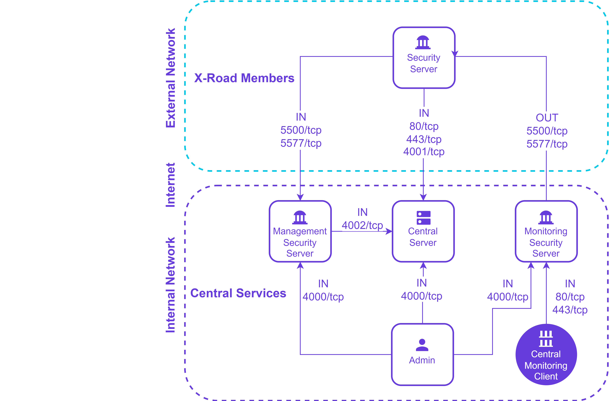
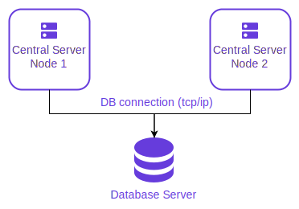

# X-Road: Central Server Installation Guide <!-- omit in toc -->

Version: 2.34  
Doc. ID: IG-CS

---

## Version history <!-- omit in toc -->
| Date       | Version | Description                                                                                                                                                                                   | Author             |
|------------|---------|-----------------------------------------------------------------------------------------------------------------------------------------------------------------------------------------------|--------------------|
| 01.12.2014 | 1.0     | Initial version                                                                                                                                                                               |                    |
| 19.01.2015 | 1.1     | License information added                                                                                                                                                                     |                    |
| 02.02.2015 | 1.2     | References fixed                                                                                                                                                                              |                    |
| 18.03.2015 | 1.3     | Meta-package for Central Server                                                                                                                                                               |                    |
| 02.04.2015 | 1.4     | „sdsb” changed to „xroad”                                                                                                                                                                     |                    |
| 30.06.2015 | 1.5     | Minor corrections done                                                                                                                                                                        |                    |
| 06.07.2015 | 1.6     | New repository address                                                                                                                                                                        |                    |
| 17.09.2015 | 1.7     | Notes about high availability added, references updated                                                                                                                                       |                    |
| 18.09.2015 | 1.8     | Minor corrections done                                                                                                                                                                        |                    |
| 18.09.2015 | 2.0     | Editorial changes made                                                                                                                                                                        |                    |
| 16.12.2015 | 2.1     | Added installation instructions for monitoring                                                                                                                                                |                    |
| 09.12.2016 | 2.2     | Converted to markdown format                                                                                                                                                                  | Ilkka Seppälä      |
| 20.12.2016 | 2.3     | Add chapter about additional configuration to Central Server's user manual                                                                                                                    | Ilkka Seppälä      |
| 20.01.2017 | 2.4     | Added license text and version history                                                                                                                                                        | Sami Kallio        |
| 25.08.2017 | 2.5     | Update installation instructions concerning the support for environmental monitoring                                                                                                          | Ilkka Seppälä      |
| 05.03.2018 | 2.6     | Added terms and abbreviations reference, links to references and actual documents                                                                                                             | Tatu Repo          | 
| 10.04.2018 | 2.7     | Updated chapter "[Installing the Support for Hardware Tokens](#26-installing-the-support-for-hardware-tokens)" with configurable parameters described in the configuration file 'devices.ini' | Cybernetica AS     |
| 14.10.2018 | 2.8     | Update package repository address                                                                                                                                                             | Petteri Kivimäki   |
| 15.11.2018 | 2.9     | Add Ubuntu 18.04 installation instructions                                                                                                                                                    | Jarkko Hyöty       |
| 05.02.2019 | 2.10    | Update ports                                                                                                                                                                                  | Jarkko Hyöty       |
| 04.09.2019 | 2.11    | Update ports                                                                                                                                                                                  | Petteri Kivimäki   |
| 11.09.2019 | 2.12    | Remove Ubuntu 14.04 from supported platforms                                                                                                                                                  | Jarkko Hyöty       |
| 26.11.2019 | 2.13    | Add instructions for using remote database                                                                                                                                                    | Ilkka Seppälä      |
| 29.04.2020 | 2.14    | Add instructions how to use remote database located in Microsoft Azure                                                                                                                        | Ilkka Seppälä      |
| 24.06.2020 | 2.15    | Add repository sign key details in section [2.2 Reference data](#22-reference-data)                                                                                                           | Petteri Kivimäki   |
| 30.07.2020 | 2.16    | Default database password is autogenerated.                                                                                                                                                   | Ilkka Seppälä      |
| 02.09.2020 | 2.17    | Improve database setup instructions.                                                                                                                                                          | Ilkka Seppälä      |
| 23.09.2020 | 2.18    | List database users.                                                                                                                                                                          | Ilkka Seppälä      |
| 29.09.2020 | 2.19    | Add instructions for creating database structure and roles manually.                                                                                                                          | Ilkka Seppälä      |
| 19.01.2021 | 2.20    | Add instructions for using an alternative Java distribution.                                                                                                                                  | Jarkko Hyöty       |
| 04.02.2021 | 2.21    | Minor updates.                                                                                                                                                                                | Ilkka Seppälä      |
| 16.04.2021 | 2.22    | Update remote database installation instructions.                                                                                                                                             | Jarkko Hyöty       |
| 18.05.2021 | 2.23    | Update installation error handling section.                                                                                                                                                   | Ilkka Seppälä      |
| 01.07.2021 | 2.24    | Update 3rd party key server                                                                                                                                                                   | Petteri Kivimäki   |
| 18.08.2021 | 2.25    | Minor updates to Annex D                                                                                                                                                                      | Ilkka Seppälä      |
| 24.08.2021 | 2.26    | Add instructions for running the database migrations manually.                                                                                                                                | Ilkka Seppälä      |
| 25.08.2021 | 2.27    | Update X-Road references from version 6 to 7                                                                                                                                                  | Caro Hautamäki     |
| 23.09.2022 | 2.28    | Added new Registration Web Service                                                                                                                                                            | Eneli Reimets      |
| 26.09.2022 | 2.29    | Remove Ubuntu 18.04 support                                                                                                                                                                   | Andres Rosenthal   |
| 19.04.2023 | 2.30    | Removed unused properties from db.properties                                                                                                                                                  | Mikk-Erik Bachmann |
| 05.05.2023 | 2.31    | Minor updates                                                                                                                                                                                 | Justas Samuolis    |
| 23.05.2023 | 2.32    | Backup Encryption Configuration                                                                                                                                                               | Eneli Reimets      |
| 31.05.2023 | 2.33    | Add Central Server network diagram                                                                                                                                                            | Petteri Kivimäki |
| 28.06.2023 | 2.34    | Update database properties to the new Spring datasource version                                                                                                                               | Raido Kaju       |

## Table of Contents <!-- omit in toc -->

<!-- toc -->
<!-- vim-markdown-toc GFM -->

- [License](#license)
- [1. Introduction](#1-introduction)
  - [1.1 Target Audience](#11-target-audience)
  - [1.2 Terms and abbreviations](#12-terms-and-abbreviations)
  - [1.3 References](#13-references)
- [2. Installation](#2-installation)
  - [2.1 Prerequisites to Installation](#21-prerequisites-to-installation)
  - [2.2 Reference Data](#22-reference-data)
    - [2.2.1 Network Diagram](#221-network-diagram)
  - [2.3 Requirements to the Central Server](#23-requirements-to-the-central-server)
  - [2.4 Preparing OS](#24-preparing-os)
  - [2.5 Setup Package Repository](#25-setup-package-repository)
  - [2.6 Remote Database Setup (optional)](#26-remote-database-setup-optional)
  - [2.7 Package Installation](#27-package-installation)
  - [2.8 Installing the Support for Hardware Tokens](#28-installing-the-support-for-hardware-tokens)
  - [2.9 Installing the Support for Monitoring](#29-installing-the-support-for-monitoring)
  - [2.10 Pre-configuration for Registration Web Service](#210-pre-configuration-for-registration-web-service)
  - [2.11 Pre-configuration for Management Web Service](#211-pre-configuration-for-management-web-service)
  - [2.12 Post-Installation Checks](#212-post-installation-checks)
- [3 Initial Configuration](#3-initial-configuration)
  - [3.1 Reference Data](#31-reference-data)
  - [3.2 Initializing the Central Server](#32-initializing-the-central-server)
  - [3.3 Configuring the Central Server and the Management Services' Security Server](#33-configuring-the-central-server-and-the-management-services-security-server)
  - [3.4 Backup Encryption Configuration](#34-backup-encryption-configuration)
- [4 Additional configuration](#4-additional-configuration)
  - [4.1 Global configuration V1 support](#41-global-configuration-v1-support)
- [5 Installation Error Handling](#5-installation-error-handling)
  - [5.1 Cannot Set LC_ALL to Default Locale](#51-cannot-set-lc_all-to-default-locale)
  - [5.2 PostgreSQL Is Not UTF8 Compatible](#52-postgresql-is-not-utf8-compatible)
  - [5.3 Could Not Create Default Cluster](#53-could-not-create-default-cluster)
  - [5.4 Is Postgres Running on Port 5432?](#54-is-postgres-running-on-port-5432)
  - [5.5 Upgrade supported from version X.Y.Z or newer](#55-upgrade-supported-from-version-xyz-or-newer)
- [Annex A Central Server Default Database Properties](#annex-a-central-server-default-database-properties)
- [Annex B Database Users](#annex-b-database-users)
- [Annex C Deployment Options](#annex-c-deployment-options)
  - [C.1 General](#c1-general)
  - [C.2 Local Database](#c2-local-database)
  - [C.3 Remote Database](#c3-remote-database)
  - [C.4 Remote Database Cluster](#c4-remote-database-cluster)
  - [C.5 Cloud Database Cluster](#c5-cloud-database-cluster)
  - [C.6 Summary](#c6-summary)
- [Annex D Create Database Structure Manually](#annex-d-create-database-structure-manually)
- [Annex E Run Database Migrations Manually](#annex-e-run-database-migrations-manually)

<!-- vim-markdown-toc -->
<!-- tocstop -->

## License

This document is licensed under the Creative Commons Attribution-ShareAlike 3.0 Unported License. To view a copy of this license, visit http://creativecommons.org/licenses/by-sa/3.0/.


## 1. Introduction

### 1.1 Target Audience

The intended audience of this installation guide are the X-Road Central Server administrators responsible for installing and configuring the X-Road Central Server software.
The document is intended for readers with a good knowledge of Linux server management, computer networks, and the X-Road functioning principles.

### 1.2 Terms and abbreviations

See X-Road terms and abbreviations documentation \[[TA-TERMS](#Ref_TERMS)\].

### 1.3 References

1. <a id="Ref_UG-CS" class="anchor"></a>\[UG-CS\] X-Road 7. Central Server User Guide. Document ID: [UG-CS](ug-cs_x-road_6_central_server_user_guide.md) 
2. <a id="Ref_IG-SS" class="anchor"></a>\[IG-SS\] X-Road 7. Security Server Installation Guide. Document ID: [IG-SS](ig-ss_x-road_v6_security_server_installation_guide.md)
3. <a id="Ref_UG-SS" class="anchor"></a>\[UG-SS\] X-Road 7. Security Server User Guide. Document ID: [UG-SS](ug-ss_x-road_6_security_server_user_guide.md)
4. <a id="Ref_IG-CSHA" class="anchor"></a>\[IG-CSHA\] X-Road 7. Central Server High Availability Installation Guide. Document ID: [IG-CSHA](ig-csha_x-road_6_ha_installation_guide.md)
5. <a id="Ref_TERMS" class="anchor"></a>\[TA-TERMS\] X-Road Terms and Abbreviations. Document ID: [TA-TERMS](../terms_x-road_docs.md).
6. <a id="Ref_UG-SYSPAR" class="anchor"></a>\[UG-SYSPAR\] X-Road: System Parameters User Guide. Document ID: [UG-SYSPAR](ug-syspar_x-road_v6_system_parameters.md).

## 2. Installation

### 2.1 Prerequisites to Installation

The Central Server software assumes an existing installation of the Ubuntu 20.04 LTS or 22.04 LTS operating system, on an x86-64bit platform. To provide management services, a Security Server is installed alongside the Central Server.

The Central Server’s software can be installed both on physical and virtualized hardware (of the latter, Xen and Oracle VirtualBox have been tested).

There are many alternatives how the Central Server can be deployed. The options are described in [Annex C Deployment Options](#annex-c-deployment-options).

If the Central Server is a part of a cluster for achieving high availability (deployment option remote database cluster or cloud database cluster), the database cluster must be installed and configured before the Central Server itself can be installed. Please refer to the Central Server High Availability Installation Guide [IG-CSHA](#Ref_IG-CSHA) for details.

### 2.2 Reference Data

Note: The information in empty cells will be determined at the latest during the server’s installation, by the person performing the installation.

Caution: Data necessary for the functioning of the operating system is not included.

| **Ref** |                                                                                                                                                                                                           | **Explanation**                                                                                                                                                                                                                                                                            |
|---------|-----------------------------------------------------------------------------------------------------------------------------------------------------------------------------------------------------------|--------------------------------------------------------------------------------------------------------------------------------------------------------------------------------------------------------------------------------------------------------------------------------------------|
| 1.0     | Ubuntu 20.04, 64-bit, 2 GB RAM, 3 GB free disk space                                                                                                                                                      | Minimum requirements                                                                                                                                                                                                                                                                       |
| 1.1     | https://artifactory.niis.org/xroad-release-deb                                                                                                                                                            | X-Road package repository                                                                                                                                                                                                                                                                  |
| 1.2     | https://artifactory.niis.org/api/gpg/key/public                                                                                                                                                           | The repository key.<br /><br />Hash: `935CC5E7FA5397B171749F80D6E3973B`<br  />Fingerprint: `A01B FE41 B9D8 EAF4 872F  A3F1 FB0D 532C 10F6 EC5B`<br  />3rd party key server: [Ubuntu key server](https://keyserver.ubuntu.com/pks/lookup?search=0xfb0d532c10f6ec5b&fingerprint=on&op=index) |
| 1.3     |                                                                                                                                                                                                           | Account name in the user interface                                                                                                                                                                                                                                                         |
| 1.4     | TCP 4001 service for authentication certificate registration<br>TCP 80 distribution of the global configuration                                                                                           | Ports for inbound connections (from the external network to the Central Server)                                                                                                                                                                                                            |
| 1.4.1   | TCP 4002 management services                                                                                                                                                                              | Port for inbound connections from the management Security Server                                                                                                                                                                                                                           |
| 1.5     | TCP 80, 443 software updates                                                                                                                                                                              | Ports for outbound connections (from the Central Server to the external network)                                                                                                                                                                                                           |
| 1.6     | TCP 80 HTTP between the Central Server and the management services' Security Server<br>TCP 4000 user interface<br>TCP 4002 HTTPS between the Central Server and the management services' Security Server  | Internal network ports, the user interface port, and management service ports for the management services' Security Server                                                                                                                                                                 |
| 1.7     |                                                                                                                                                                                                           | Central Server internal IP address(es) and hostname(s)                                                                                                                                                                                                                                     |
| 1.8     |                                                                                                                                                                                                           | Central Server public IP address, NAT address                                                                                                                                                                                                                                              |
| 1.9     | <by default, the server’s IP addresses and names are added to the certificate’s Distinguished Name (DN) field>                                                                                            | Information about the user interface TLS certificate                                                                                                                                                                                                                                       |
| 1.10    | <by default, the server’s IP addresses and names are added to the certificate’s Distinguished Name (DN) field>                                                                                            | Information about the services TLS certificate                                                                                                                                                                                                                                             |

It is strongly recommended to protect the Central Server from unwanted access using a firewall (hardware or software based). The firewall can be applied to both incoming and outgoing connections depending on the security requirements of the environment where the Central Server is deployed. It is recommended to allow incoming traffic to specific ports only from explicitly defined sources using IP filtering. **Special attention should be paid with the firewall configuration since incorrect configuration may leave the Central Server vulnerable to exploits and attacks.**

#### 2.2.1 Network Diagram

The network diagram below provides an example of a basic Central Server setup.



The table below lists the required connections between different components. Please note that required connections between Security Servers and trust services (OCSP service, time-stamping service) have been omitted from the diagram and the table below. Their configuration is described in [IG-SS](#Ref_IG-SS).

**Connection Type** | **Source**                        | **Target**                    | **Target Ports** | **Protocol** | **Note**                                                                                    |
-----------|-----------------------------------|-------------------------------|------------|-----------|---------------------------------------------------------------------------------------------|
Out | Monitoring Security Server        | X-Road Member Security Server | 5500, 5577 | tcp | Operational and environmental monitoring data collection                                    |
In  | X-Road Member Security Server     | Central Server                | 80         | tcp | Global configuration distribution                                                           |
In  | X-Road Member Security Server     | Central Server                | 4001       | tcp | Authentication certificate registration requests from X-Road Members' Security Servers      |
In  | Management Security Server        | Central Server                | 4002       | tcp | Source in the internal network. Management service requests from Management Security Server |
In  | X-Road Member Security Server     | Management Security Server    | 5500, 5577 | tcp | Management service requests from X-Road Members' Security Servers                           |
In  | Central Monitoring Client         | Monitoring Security Server    | 80, 443    | tcp | Source in the internal network                                                              |
In  | Admin, management REST API client | Central Server                | 4000       | tcp | Source in the internal network                                                              |
In  | Admin                             | Management Security Server    | 4000       | tcp | Source in the internal network                                                              |
In  | Admin                             | Monitoring Security Server    | 4000       | tcp | Source in the internal network                                                              |

### 2.3 Requirements to the Central Server

Minimum recommended hardware parameters:
- the server hardware (motherboard, CPU, network interface cards, storage system) must be supported by Ubuntu in general;
- a 64-bit dual-core Intel, AMD or compatible CPU;
- 2 GB RAM;
- 100 Mbps network interface card.

Requirements for software and settings:
- an installed and configured Ubuntu 20.04 LTS or 22.04 LTS x86-64 operating system;
- the necessary connections are allowed in the firewall (reference data: 1.4; 1.4.1; 1.5; 1.6),
- if the Central Server has a private IP address, a corresponding NAT record must be created in the firewall (reference data: 1.8).

### 2.4 Preparing OS

- Add an X-Road system administrator user (reference data: 1.3) whom all roles in the user interface are granted to. 

  Add the new user with the command: `sudo adduser username`.

  User roles are discussed in detail in the X-Road Security Server User Guide [UG-SS](#Ref_UG-SS). Do not use the user name `xroad`, it is reserved for the X-Road system user.

- Ensure that the packages `locales` and `software-properties-common` are present
  
  `sudo apt install locales software-properties-common`

- Set the operating system locale.

  Add the following line to the file `/etc/environment`: `LC_ALL=en_US.UTF-8`  
  Ensure that the locale is generated: `sudo locale-gen en_US.UTF-8`

### 2.5 Setup Package Repository

Add the X-Road repository’s signing key to the list of trusted keys (**reference data: 1.2**):
```bash
curl https://artifactory.niis.org/api/gpg/key/public | sudo apt-key add -
```

Add X-Road package repository (**reference data: 1.1**)
```bash
sudo apt-add-repository -y "deb https://artifactory.niis.org/xroad-release-deb $(lsb_release -sc)-current main"
```

### 2.6 Remote Database Setup (optional)

*This is an optional step.* 

Optionally, the Central Server can use a remote database server. To avoid installing the default local PostgreSQL server during the installation, first install the `xroad-database-remote` -package.
```bash
sudo apt install xroad-database-remote
```

For the application level backup and restore feature to work correctly, it is important to verify that the local PostgreSQL client has the same or later major version than the remote database server and, if necessary, install a different version of the `postgresql-client` package (see https://www.postgresql.org/download/linux/ubuntu/)
```bash
psql --version
psql (PostgreSQL) 12.14 (Ubuntu 12.14-0ubuntu0.20.04.1)

psql -h <database host> -U <superuser> -tAc 'show server_version'
10.16 (Ubuntu 10.16-0ubuntu0.18.04.1)
```

The installer can create the database and users for you, but you need to create a configuration file containing the database administrator credentials. 

For advanced setup, e.g. if storing the database administrator password on the server is not an option, you can create the database users and structure manually as described in [Annex D Create Database Structure Manually](#annex-d-create-database-structure-manually) and then continue to section 2.7. Otherwise, perform the following steps:

Create the property file:
```bash
sudo touch /etc/xroad.properties
sudo chown root:root /etc/xroad.properties
sudo chmod 600 /etc/xroad.properties
```

Edit `/etc/xroad.properties`. See the example below. Replace parameter values with your own.
```properties
postgres.connection.password = <database superuser password>
postgres.connection.user = <database superuser name, postgres by default>
```

Note. If Microsoft Azure database for PostgreSQL is used, the connection user needs to be in format `username@hostname`.

For additional security, the `postgresql.connection.*` properties can be removed from the `/etc/xroad.properties` file after installation (keep the other properties added by the installer).

Before continuing, test that the connection to the database works, e.g.
```bash
psql -h <database host> -U <superuser> -tAc 'show server_version'
```

### 2.7 Package Installation

Update package repository metadata:
```bash
sudo apt update
```

Issue the following command to install the Central Server packages:
```bash
sudo apt install xroad-centralserver
```

Upon the first installation of the Central Server software, the system asks for the following information.

- Account name for the user who will be granted the rights to perform all activities in the user interface (reference data: 1.3).

- Database server URL. Locally installed database is suggested as default but remote databases can be used as well. In case remote database is used, one should verify that the version of the local PostgreSQL client matches the version of the remote PostgreSQL server.

- Whether the database migrations should be skipped and handled manually instead. Usually automatic migrations should be used, but for legacy database support (like BDR1) it's possible to rely on manual operations instead. How to execute the database migrations manually is described in [Annex E Run Database Migrations Manually](#annex-e-run-database-migrations-manually).

- The Distinguished Name of the owner of the user interface self-signed TLS certificate (subjectDN) and its alternative names (subjectAltName). The certificate is used for securing connections to the user interface (reference data: 1.7; 1.9). The name and IP addresses detected from the operating system are suggested as default values. 

  The certificate owner’s Distinguished Name must be entered in the format: `/CN=server.domain.tld`. 
  All IP addresses and domain names in use must be entered as alternative names in the format: `IP:1.2.3.4,IP:4.3.2.1,DNS:servername,DNS:servername2.domain.tld`

- Identification of the TLS certificate that is used for securing the HTTPS access point used for providing management services (reference data: 1.7; 1.10). The name and IP addresses detected from the operating system are suggested as default values.

  ATTENTION: The Central Server IP address or DNS name that Security Servers will use to connect to the server must be added to the certificate owner’s Distinguished Name (subjectDN) or alternative name forms (subjectAltName) list (reference data: 1.8).

  The certificate owner’s Distinguished Name must be entered in the format: `/CN=server.domain.tld`
  All IP addresses and domain names in use must be entered as alternative names in the format: `IP:1.2.3.4,IP:4.3.2.1,DNS:servername,DNS:servername2.domain.tld`

### 2.8 Installing the Support for Hardware Tokens

To configure support for hardware security tokens (smartcard, USB token, Hardware Security Module), act as follows.

1.  Install the hardware token support module using the following command:

        sudo apt install xroad-addon-hwtokens

2.  Install and configure a PKCS\#11 driver for the hardware token according to the manufacturer's instructions.

3.  Add the path to the PKCS\#11 driver to the file `/etc/xroad/devices.ini` (as described in the example given in the file).

4.  After installing and configuring the driver, the xroad-signer service must be restarted:

        sudo service xroad-signer restart

If you are running a high availability (HA) hardware token setup (such as a cluster with replicated tokens) then you may need to constrain the token identifier format such that the token replicas can be seen as the same token. The token identifier format can be changed in `/etc/xroad/devices.ini` via the `token_id_format` property (default value: `{moduleType}{slotIndex}{serialNumber}{label}`). Removing certain parts of the identifier will allow the HA setup to work correctly when one of the tokens goes down and is replaced by a replica. For example, if the token replicas are reported to be on different slots the `{slotIndex}` part should be removed from the identifier format.

Depending on the hardware token there may be a need for more additional configuration. All possible configurable parameters in the `/etc/xroad/devices.ini` are described in the next table.

| Parameter                               | Type        | Default Value                                  | Explanation                                                                                                                                                                                                                                               |
|-----------------------------------------|-------------|------------------------------------------------|-----------------------------------------------------------------------------------------------------------------------------------------------------------------------------------------------------------------------------------------------------------|
| *enabled*                               | BOOLEAN     | *true*                                         | Indicates whether this device is enabled.                                                                                                                                                                                                                 |
| *library*                               | STRING      |                                                | The path to the pkcs#11 library of the device driver.                                                                                                                                                                                                     |
| *library_cant_create_os_threads*        | BOOLEAN     | *false*                                        | Indicates whether application threads, which are executing calls to the pkcs#11 library, may not use native operating system calls to spawn new threads (in other words, the library’s code may not create its own threads).                              |
| *os_locking_ok*                         | BOOLEAN     | *false*                                        | Indicates whether the pkcs#11 library may use the native operation system threading model for locking.                                                                                                                                                    |
| *sign_verify_pin*                       | BOOLEAN     | *false*                                        | Indicates whether the PIN should be entered per signing operation.                                                                                                                                                                                        |
| *token_id_format*                       | STRING      | *{moduleType}{slotIndex}{serialNumber}{label}* | Specifies the identifier format used to uniquely identify a token. In certain high availability setups may need be constrained to support replicated tokens (eg. by removing the slot index part which may be diffirent for the token replicas).          |
| *sign_mechanism*                        | STRING      | *CKM_RSA_PKCS*                                 | Specifies the signing mechanism. Supported values: *CKM_RSA_PKCS*, *CKM_RSA_PKCS_PSS*.                                                                                                                                                                    |
| *pub_key_attribute_encrypt*             | BOOLEAN     | *true*                                         | Indicates whether public key can be used for encryption.                                                                                                                                                                                                  |
| *pub_key_attribute_verify*              | BOOLEAN     | *true*                                         | Indicates whether public key can be used for verification.                                                                                                                                                                                                |
| *pub_key_attribute_wrap*                | BOOLEAN     |                                                | Indicates whether public key can be used for wrapping other keys.                                                                                                                                                                                         |
| *pub_key_attribute_allowed_mechanisms*  | STRING LIST |                                                | Specifies public key allowed mechanisms. Supported values: *CKM_RSA_PKCS*, *CKM_SHA256_RSA_PKCS*, *CKM_SHA384_RSA_PKCS*, *CKM_SHA512_RSA_PKCS*, and *CKM_RSA_PKCS_PSS*, *CKM_SHA256_RSA_PKCS_PSS*, *CKM_SHA384_RSA_PKCS_PSS*, *CKM_SHA512_RSA_PKCS_PSS*.  |
| *priv_key_attribute_sensitive*          | BOOLEAN     | *true*                                         | Indicates whether private key is sensitive.                                                                                                                                                                                                               |
| *priv_key_attribute_decrypt*            | BOOLEAN     | *true*                                         | Indicates whether private key can be used for encryption.                                                                                                                                                                                                 |
| *priv_key_attribute_sign*               | BOOLEAN     | *true*                                         | Indicates whether private key can be used for signing.                                                                                                                                                                                                    |
| *priv_key_attribute_unwrap*             | BOOLEAN     |                                                | Indicates whether private key can be used for unwrapping wrapped keys.                                                                                                                                                                                    |
| *priv_key_attribute_allowed_mechanisms* | STRING LIST |                                                | Specifies private key allowed mechanisms. Supported values: *CKM_RSA_PKCS*, *CKM_SHA256_RSA_PKCS*, *CKM_SHA384_RSA_PKCS*, *CKM_SHA512_RSA_PKCS*, and *CKM_RSA_PKCS_PSS*, *CKM_SHA256_RSA_PKCS_PSS*, *CKM_SHA384_RSA_PKCS_PSS*, *CKM_SHA512_RSA_PKCS_PSS*. |

**Note 1:** Only parameter *library* is mandatory, all the others are optional.  
**Note 2:** The item separator of the type STRING LIST is ",".

### 2.9 Installing the Support for Monitoring

The optional configuration for monitoring parameters is installed by package xroad-centralserver-monitoring. This package also includes the components that validate the updated xml monitoring configuration. The package is included in the Central Server installation by default.

The central monitoring client may be configured as specified in the [UG-CS](#Ref_UG-CS).

### 2.10 Pre-configuration for Registration Web Service

The registration web service is installed by package `xroad-center-registration-service`. The package is included in the Central Server installation by default.

Configuration parameters for registration web service are specified in the [UG-SYSPAR](#Ref_UG-SYSPAR) section "Registration service parameters".

**Note:** With new registration service, a maximum size limit (MAX_REQUEST_SIZE = 100 KB) is set for the authentication certificate SOAP message.

### 2.11 Pre-configuration for Management Web Service
The management web service is installed by package `xroad-center-management-service`. The package is included in the Central Server installation by default.

Configuration parameters for management web service are specified in the [UG-SYSPAR](#Ref_UG-SYSPAR) section "Management service parameters".

### 2.12 Post-Installation Checks

The installation is successful if the system services are started and the user interface is responding.

-   Ensure from the command line that relevant X-Road services are in the `running` state (example output follows). Notice that it is normal for the xroad-confclient to be in `stopped` state on the Central Server since it operates in one-shot mode.

    - Ubuntu 20.04 or 22.04
        ```bash
        sudo systemctl list-units "xroad*"

        UNIT                                      LOAD   ACTIVE SUB     DESCRIPTION
        xroad-base.service                        loaded active exited  X-Road initialization
        xroad-center-management-service.service   loaded active running X-Road Central Server Management Service
        xroad-center-registration-service.service loaded active running X-Road Central Server Registration Service
        xroad-center.service                      loaded active running X-Road Central Server
        xroad-signer.service                      loaded active running X-Road signer
        ```

-   Ensure that the Central Server user interface at https://SECURITYSERVER:4000/ (**reference data: 1.8; 1.6**) can be opened in a Web browser. To log in, use the account name chosen during the installation (**reference data: 1.3**). While the user interface is still starting up, the Web browser may display the “502 Bad Gateway” error.

## 3 Initial Configuration

### 3.1 Reference Data

Note: The information in empty cells will be entered at the latest during the installation, by the person performing the installation.

Attention: Data necessary for the functioning of the operating system is not included.

| **Ref** |        | **Explanation**                                                          |
|---------|--------|--------------------------------------------------------------------------|
| 2.1     |        | The X-Road instance identifier                                           |
| 2.2     |        | The external DNS name or IP address of the Central Server                |
| 2.3     |        | The softtoken PIN                                                        |
| 2.4     |        | Codes and descriptions of the member classes used in the X-Road instance |


### 3.2 Initializing the Central Server

The Central Server user interface can be accessed at https://CENTRALSERVER:4000/ (reference data: 1.7; 1.6)

1. Set the X-Road instance identifier (reference data: 2.1).
2. Set the Central Server public DNS hostname or public IP address (reference data: 2.2).
3. Set the PIN of the software token (reference data: 2.3). The PIN will be used to protect the keys stored in the software token. The PIN must be stored in a secure place, because it will be no longer possible to use or recover the private keys in the token once the PIN is lost.

### 3.3 Configuring the Central Server and the Management Services' Security Server

Upon the first configuration of the Central Server and the management services' Security Server, the following actions must be carried out.

Actions 7 and 8 must be performed in the management services' Security Server.

1. Generate the internal and external configuration signing keys. Refer to [UG-CS](#Ref_UG-CS) section „Generating a Configuration Signing Key“.
2. Configure the member classes. Refer to [UG-CS](#Ref_UG-CS) section „Managing the Member Classes“. (reference data: 2.4).
3. Configure the management service provider:
add the X-Road member who will be responsible for management services - [UG-CS](#Ref_UG-CS) section „Adding a Member“;
add the subsystem that will provide the management services to the X-Road member - [UG-CS](#Ref_UG-CS) section “Adding a Subsystem to an X-Road Member”;
appoint the subsystem as the management service provider - [UG-CS](#Ref_UG-CS) section “Appointing the Management Service Provider”.
4. Configure the certification services. Refer to [UG-CS](#Ref_UG-CS) section „Managing the Approved Certification Services“.
5. Configure the timestamping services. Refer to [UG-CS](#Ref_UG-CS) section „Managing the Approved Timestamping Services“.
6. Verify that the global configuration generation succeeds (no global error messages should be displayed in the user interface at this point) and download the internal configuration anchor - [UG-CS](#Ref_UG-CS) section “Downloading the Configuration Anchor”. The anchor is needed to set up the management services' Security Server.
7. Install and configure the management services' Security Server as described in [IG-SS](#Ref_IG-SS).
8. Register the management services' Security Server in the Central Server. Refer to [UG-SS](#Ref_UG-SS) section „Security Server Registration“.
9. Complete the registration of the management services' Security Server - [UG-CS](#Ref_UG-CS) section “Registering a Member's Security Server”.
10. Register the management service provider as a client of the management services' Security Server - [UG-CS](#Ref_UG-CS) section “Registering the Management Service Provider as a Security Server Client”.
11. Add the management service provider as a client to the management services' Security Server. Refer to [UG-SS](#Ref_UG-SS) section „Adding a Security Server Client”. (The client should appear in “Registered” state, as the association between the client and the Security Server was already registered in the Central Server in the previous step). If necessary, configure the signing keys and certificates for the client - [UG-SS](#Ref_UG-SS) section „Configuring a Signing Key and Certificate for a Security Server Client”
12. Configure the management services. Refer to [UG-CS](#Ref_UG-CS) section „Configuring the Management Services in The Management Services’ Security Server”.

### 3.4 Backup Encryption Configuration

It is possible to automatically encrypt Central Server configuration backups. Central server uses The GNU Privacy Guard (https://www.gnupg.org)
for backup encryption and verification. Backups are always signed, but backup encryption is initially turned off.
To turn encryption on, please override the default configuration in the file `/etc/xroad/conf.d/local.ini`, in the `[center]` section (add or edit this section).
```bash
[center]

backup-encryption-enabled = true
backup-encryption-keyids = <keyid1>, <keyid2>, ...
```

To turn backup encryption on, please change the `backup-encryption-enabled` property value to `true`.
By default, backups are encrypted using Central Server's backup encryption key. Additional encryption keys can be imported in the `/etc/xroad/gpghome` keyring and key identifiers listed using the `backup-encryption-keyids` parameter. It is recommended to set up at least one additional key, otherwise the backups will be unusable in case Central Server's private key is lost. It is up to Central Server's administrator to check that keys used are sufficiently strong, there are no automatic checks.

Warning. All keys listed in `backup-encryption-keyids` must be present in the gpg keyring or backup fails.

All these keys are used to encrypt backups so that ANY of these keys can decrypt the backups. This is useful both for verifying encrypted backups'
consistency and decrypting backups in case Central Server's backup encryption key gets lost for whatever reason.

To externally verify a backup archive's consistency, Central Server's backup encryption public key has to be exported
and imported into external GPG keyring. Note that this can be done only after Central Server has been initialised - the
Central Server backup encryption key is generated during initialisation.

To export Central Server's backup encryption public key use the following command:
```bash
gpg --homedir /etc/xroad/gpghome --armor --output server-public-key.gpg --export EE
```
where `EE` is the Central Server instance identifier.

The key can then be moved to an external host and imported to GPG keyring with the following command:
```bash
gpg --homedir <your_gpg_homedir_here> --import server-public-key.gpg
```

## 4 Additional configuration

### 4.1 Global configuration V1 support

The support for global configuration version V1 has been removed in X-Road version 6.20. The Central Server produces only V2 global configuration which is expected by Security Servers from version 6.8.x and up.

## 5 Installation Error Handling

### 5.1 Cannot Set LC_ALL to Default Locale

If running the locale command results in the error message

`locale: Cannot set LC_ALL to default locale: No such file or directory`

then the support for the particular language has not been installed. To install it, run the command (example uses the English language):

`sudo apt install language-pack-en`

Then, to update the system’s locale files, run the following commands (this example uses the US locale):

`sudo locale-gen en_US.UTF-8`<br>
`sudo update-locale en_US.UTF-8`

Set the operating system locale. Add following line to /etc/environment file.

`LC_ALL=en_US.UTF-8`

After updating the system’s locale settings, it is recommended to restart the operating system.

### 5.2 PostgreSQL Is Not UTF8 Compatible

If the Central Server installation is aborted, with the error message

`postgreSQL is not UTF8 compatible`

then the PostgreSQL package is installed with the wrong locale. One way to fix it is to remove the data store created upon the PostgreSQL installation and recreate it with the correct encoding. WARNING: All data in the database will be erased!

`sudo pg_dropcluster --stop 12 main`<br>
`LC_ALL="en_US.UTF-8" sudo pg_createcluster --start 12 main`

To complete the interrupted installation, run the command:

`sudo apt -f install`

### 5.3 Could Not Create Default Cluster

If the following error message is displayed during PostgreSQL installation

`Error: The locale requested by the environment is invalid.`<br>
`Error: could not create default cluster. Please create it manually with pg_createcluster 12 main –start`

Use the following command to create the PostgreSQL data cluster:

`LC_ALL="en_US.UTF-8" sudo  pg_createcluster --start 12 main`

The interrupted installation can be finished using

`sudo apt -f install`

### 5.4 Is Postgres Running on Port 5432?

If the following error message appears during installation

`Is postgres running on port 5432 ?`<br>
`Aborting installation! please fix issues and rerun with apt -f install`

Then check if any of the following errors occurred during the installation of PostgreSQL.

- Error installing the data cluster. Refer to section 4.3.
- The PostgreSQL data cluster installed during the installation of the Security Server is not configured to listen on port 5432. To verify and configure the listening port, edit the PostgreSQL configuration file in /etc/postgresql/12/main/postgresql.conf. If you change the listening port, the postgresql service must be restarted.

The interrupted installation can be finished using

`sudo apt -f install`

### 5.5 Upgrade supported from version X.Y.Z or newer

The following error message may come up during the Central Server upgrade.

`Upgrade supported from version X.Y.Z or newer`

Upgrading the packages from the current version to the target version is not supported directly. The fix is to upgrade the Central Server to the target version step by step.

For example, the following Central Server packages are currently installed.

```bash
root@test-cs:~# dpkg -l | grep xroad
ii  xroad-autologin                    7.3.0-1.ubuntu22.04 all          Automatic token pin code entry
ii  xroad-base                         7.3.0-1.ubuntu22.04 amd64        X-Road base components
ii  xroad-center                       7.3.0-1.ubuntu22.04 all          X-Road central server
ii  xroad-center-management-service    7.3.0-1.ubuntu22.04 all          X-Road Central Server Management Service
ii  xroad-center-registration-service  7.3.0-1.ubuntu22.04 all          X-Road Central Server Registration Service
ii  xroad-centralserver                7.3.0-1.ubuntu22.04 all          X-Road central server
ii  xroad-centralserver-monitoring     7.3.0-1.ubuntu22.04 all          Monitoring client configuration for X-Road central
ii  xroad-confclient                   7.3.0-1.ubuntu22.04 amd64        X-Road configuration client components
ii  xroad-database-remote              7.3.0-1.ubuntu22.04 all          Meta-package for X-Road remote database dependencies
rc  xroad-jetty9                       7.3.0-1.ubuntu22.04 all          Jetty9 for X-Road purposes
ii  xroad-nginx                        7.3.0-1.ubuntu22.04 amd64        X-Road nginx component
ii  xroad-signer                       7.3.0-1.ubuntu22.04 amd64        X-Road signer component
```

The following packages are available in the repository.

```bash
root@test-cs:~# apt-cache madison xroad-centralserver
xroad-centralserver | 7.3.0-1.ubuntu20.04 | https://artifactory.niis.org/xroad-release-deb focal-current/main amd64 Packages
xroad-centralserver | 7.1.2-1.ubuntu20.04 | https://artifactory.niis.org/xroad-release-deb focal-current/main amd64 Packages
```

Now trying to upgrade the Central Server packages directly will produce the following error.

```bash
root@test-cs:~# apt upgrade xroad-centralserver
...
Preparing to unpack .../xroad-centralserver_7.3.0-1.ubuntu20.04_all.deb ...
ERROR: Upgrade supported from version 7.1.2 or newer
```

The fix is to upgrade the Central Server in two separate steps. First, upgrade to 7.1.x with the following command.

```bash
apt install xroad-base=7.1.2-1.ubuntu20.04 xroad-center=7.1.2-1.20.04 xroad-centralserver=7.1.2-1.ubuntu20.04 xroad-centralserver-monitoring=7.1.2-1.ubuntu20.04 xroad-confclient=7.1.2-1.ubuntu20.04 xroad-database-local=7.1.2-1.ubuntu20.04 xroad-jetty9=7.1.2-1.ubuntu20.04 xroad-nginx=7.1.2-1.ubuntu20.04 xroad-signer=7.1.2-1.ubuntu20.04
```

An alternative approach to the previous command is to temporarily configure the server to use a repository that contains only the specific version of X-Road software we want to upgrade to. For example, configure the repository as `deb https://artifactory.niis.org/xroad-release-deb focal-7.1.2 main` and then use the `apt update` and `apt upgrade xroad-centralserver` commands.

Finally, we can upgrade to our target version 7.3.x as follows.

```bash
apt upgrade xroad-centralserver
```

## Annex A Central Server Default Database Properties

`/etc/xroad/db.properties`

```properties
spring.datasource.username=centerui
spring.datasource.password=<randomly generated password stored is stored here>
spring.datasource.hikari.data-source-properties.currentSchema=centerui
spring.datasource.url=jdbc:postgresql://127.0.0.1:5432/centerui_production
skip_migrations=false
```

## Annex B Database Users

| User     | Database            | Privileges               | Description                                                                                         |
|----------|---------------------|--------------------------|-----------------------------------------------------------------------------------------------------|
| centerui | centerui_production | CREATE,TEMPORARY,CONNECT | The database user used to create the schema and read/write the database during application runtime. |
| postgres | ALL                 | ALL                      | PostgreSQL database default superuser.                                                              |


## Annex C Deployment Options

### C.1 General

X-Road Central Server can be deployed in multiple ways. The simplest option is to have a single Central Server with local database. This is usually fine for development purposes, but there are multiple reasons to tailor the deployment.

### C.2 Local Database

The simplest deployment option is to use a single Central Server with local database. This is the default choice when setting up a development or testing environment. It's not recommended for production since there is a single point of failure.


### C.3 Remote Database

It is possible to use a remote database with Central Server. This option is sometimes used in development when there's need to externalize the database state.

Central server supports a variety of cloud databases including AWS RDS and Azure Database for PostgreSQL. This deployment option is useful when doing development in cloud environment.


Central server itself can also be clustered. In clustered mode high-availability is built in to the system and the clients (Security Servers and configuration proxies) can continue operation despite a loss of a Central Server node.



### C.4 Remote Database Cluster

When aiming for production it's recommended to use redundant front-end nodes (clustered Central Server) and a remote database cluster. This way there's no single point of failure and the system can recover from both front-end node and database failures.


### C.5 Cloud Database Cluster

When Central Server is deployed in cloud environment and aimed for production use, it's recommended to use a cloud database cluster. To achieve high availability, there should be redundant front-end nodes (clustered Central Server) in separate availability zones.


### C.6 Summary

The following table lists a summary of the Central Server deployment options and indicates whether they are aimed for development or production use.

| Deployment               | Dev  | Prod  |
|--------------------------|------|-------|
| Local database           | x    |       |
| Remote database          | x    |       |
| Remote database cluster  |      | x     |
| Cloud database cluster   |      | x     |

## Annex D Create Database Structure Manually

Login to the database server as the superuser (`postgres` by default).

```bash
psql -h <database host> -U <superuser> -d postgres
```

Run the following commands to create the necessary database structures and roles.
If necessary, customize the database and role names to suit your environment.
By default, the database is named `centerui_production`, database user and schema both are named `centerui`, and the admin user is named with `_admin` suffix (e.g. `centerui_admin`).


```sql
CREATE DATABASE <database> ENCODING 'UTF8';
REVOKE ALL ON DATABASE <database> FROM PUBLIC;
CREATE ROLE <admin_user> LOGIN PASSWORD '<admin_user password>';
GRANT <admin_user> TO <superuser>;
GRANT CREATE,TEMPORARY,CONNECT ON DATABASE <database> TO <admin_user>;
\c <database>
CREATE EXTENSION hstore;
CREATE SCHEMA <database_schema> AUTHORIZATION <admin_user>;
REVOKE ALL ON SCHEMA public FROM PUBLIC;
GRANT USAGE ON SCHEMA public TO <admin_user>;
CREATE ROLE <database_user> LOGIN PASSWORD '<database_user password>';
GRANT <database_user> TO <superuser>;
GRANT TEMPORARY,CONNECT ON DATABASE <database> TO <database_user>;
GRANT USAGE ON SCHEMA public TO <database_user>;
GRANT USAGE ON SCHEMA <database_schema> TO <database_user>;
GRANT SELECT,UPDATE,INSERT,DELETE ON ALL TABLES IN SCHEMA <database_schema> TO <database_user>;
GRANT SELECT,UPDATE ON ALL SEQUENCES IN SCHEMA <database_schema> TO <database_user>;
GRANT EXECUTE ON ALL FUNCTIONS IN SCHEMA <database_schema> TO <database_user>;
```

Create the `/etc/xroad.properties` file
```bash
sudo touch /etc/xroad.properties
sudo chown root:root /etc/xroad.properties
sudo chmod 0600 /etc/xroad.properties
```

Edit `/etc/xroad.properties` and add/update the following properties (if you customized the role names, use your own).
The admin users are used to run database migrations during the install and upgrades.

```properties
centerui.database.admin_user = <admin_user>
centerui.database.admin_password = <admin_user password>
```

Create the `/etc/xroad/db.properties` file
```bash
sudo mkdir /etc/xroad
sudo chown xroad:xroad /etc/xroad
sudo chmod 751 /etc/xroad
sudo touch /etc/xroad/db.properties
sudo chmod 0640 /etc/xroad/db.properties
sudo chown xroad:xroad /etc/xroad/db.properties
```

Edit `/etc/xroad/db.properties` file and add/update the following connection properties (if you customized the database, user, and/or role names, use the customized values).
The default values can be found in [Annex A Central Server Default Database Properties](#annex-a-central-server-default-database-properties).

```properties
spring.datasource.username=<database_user>
spring.datasource.password=<database_user_password>
spring.datasource.hikari.data-source-properties.currentSchema=<database_schema>
spring.datasource.url=jdbc:postgresql://<database_host>:<database_port>/<database>
skip_migrations=<false by default, set to true to skip migrations>
```

## Annex E Run Database Migrations Manually

When installing/upgrading the Central Server, it's possible to skip the automatic database migrations. The installer respects the setting `skip_migrations = true/false` in the file `/etc/xroad/db.properties`. For clean installations the installer asks the setting value (among other settings) using debconf. For upgrade installations the setting `skip_migrations = true` needs to be set before upgrading by editing the aforementioned properties file or by running `dpkg-reconfigure xroad-center` to alter the settings via debconf.

To run the database migrations manually, follow the next steps.

1. Login to the Central Server console and issue the following command as root.

2. Ensure that the Central Server user interface process is stopped.

```bash
systemctl stop xroad-center
```

3. Run the database migrations.

```bash
/usr/share/xroad/db/migrate.sh db:migrate
```

4. Start the services, if they are not yet running.

```bash
systemctl start xroad-center
```

5. Verify that everything is working by performing the steps described in [2.12 Post-Installation Checks](#212-post-installation-checks).
