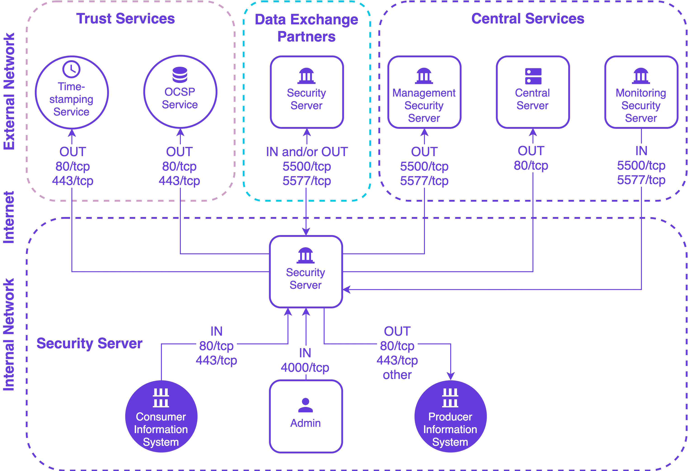

# Security Server Installation Guide for Ubuntu <!-- omit in toc -->

**X-ROAD 7**

Version: 2.45  
Doc. ID: IG-SS

---

## Version history <!-- omit in toc -->

| Date       | Version | Description                                                                                                                                                                                                          | Author           |
|------------|---------|----------------------------------------------------------------------------------------------------------------------------------------------------------------------------------------------------------------------|------------------|
| 01.12.2014 | 1.0     | Initial version                                                                                                                                                                                                      |                  |
| 19.01.2015 | 1.1     | License information added                                                                                                                                                                                            |                  |
| 18.03.2015 | 1.2     | Meta-package for security server added. Legacy securelog module removed                                                                                                                                              |                  |
| 02.04.2015 | 1.3     | “sdsb” change to “xroad”                                                                                                                                                                                             |                  |
| 27.05.2015 | 1.4     | Some typos fixed                                                                                                                                                                                                     |                  |
| 30.06.2015 | 1.5     | Minor corrections done                                                                                                                                                                                               |                  |
| 06.07.2015 | 1.6     | New repository address                                                                                                                                                                                               |                  |
| 18.09.2015 | 1.7     | Reference data in [3.2](#32-reference-data) updated                                                                                                                                                                  |                  |
| 18.09.2015 | 2.0     | Editorial changes made                                                                                                                                                                                               |                  |
| 13.10.2015 | 2.1     | Editorial changes made                                                                                                                                                                                               |                  |
| 10.12.2015 | 2.2     | Updated the installing of the support for hardware tokens ([2.7](#27-installing-the-support-for-hardware-tokens))                                                                                                    |                  |
| 17.12.2015 | 2.3     | Added *xroad-addon-wsdlvalidator* package                                                                                                                                                                            |                  |
| 19.05.2016 | 2.4     | Merged changes from xtee6-doc repo. Updated table [2.2](#22-reference-data) with p 1.12, added chapter [2.8](#28-installing-support-for-monitoring) and updated [3.2](#32-reference-data).                           |                  |
| 30.09.2016 | 2.5     | Added chapter „[Different versions of xroad-\* package after successful upgrade](#45-different-versions-of-xroad--packages-after-successful-upgrade)“.                                                               |                  |
| 07.12.2016 | 2.6     | Added operational data monitoring packages. 2 GB RAM -&gt; 3 GB RAM                                                                                                                                                  |                  |
| 23.02.2017 | 2.7     | Converted to Github flavoured Markdown, added license text, adjusted tables for better output in PDF                                                                                                                 | Toomas Mölder    |
| 13.04.2017 | 2.8     | Added token ID formatting                                                                                                                                                                                            | Cybernetica AS   |
| 25.08.2017 | 2.9     | Update environmental monitoring installation information                                                                                                                                                             | Ilkka Seppälä    |
| 15.09.2017 | 2.10    | Added package with configuration specific to Estonia xroad-securityserver-ee                                                                                                                                         | Cybernetica AS   |
| 05.03.2018 | 2.11    | Added terms and abbreviations reference and document links                                                                                                                                                           | Tatu Repo        |
| 10.04.2018 | 2.12    | Updated chapter "[Installing the Support for Hardware Tokens](#27-installing-the-support-for-hardware-tokens)" with configurable parameters described in the configuration file 'devices.ini'                        | Cybernetica AS   |
| 14.10.2018 | 2.13    | Update package repository address                                                                                                                                                                                    | Petteri Kivimäki |
| 25.10.2018 | 2.14    | Add RHEL7 as supported platform, update section 2.2 Reference data                                                                                                                                                   | Petteri Kivimäki |
| 15.11.2018 | 2.15    | Add Ubuntu 18 installation instructions                                                                                                                                                                              | Jarkko Hyöty     |
| 28.01.2018 | 2.16    | Update port 2080 documentation                                                                                                                                                                                       | Petteri Kivimäki |
| 30.05.2019 | 2.17    | Added package installation instructions on chapter "[2.4 Preparing OS](#24-preparing-os)"                                                                                                                            | Raul Martinez    |
| 11.09.2019 | 2.18    | Remove Ubuntu 14.04 from supported platforms                                                                                                                                                                         | Jarkko Hyöty     |
| 20.09.2019 | 2.19    | Add instructions for using remote databases                                                                                                                                                                          | Ilkka Seppälä    |
| 12.04.2020 | 2.20    | Add note about the default value of the *connector-host* property in the EE-package                                                                                                                                  | Petteri Kivimäki |
| 29.04.2020 | 2.21    | Add instructions how to use remote database located in Microsoft Azure                                                                                                                                               | Ilkka Seppälä    |
| 12.06.2020 | 2.22    | Update reference data regarding JMX listening ports                                                                                                                                                                  | Petteri Kivimäki |
| 24.06.2020 | 2.23    | Add repository sign key details in section [2.2 Reference data](#22-reference-data)                                                                                                                                  | Petteri Kivimäki |
| 24.06.2020 | 2.24    | Remove environmental and operational monitoring daemon JMX listening ports from section [2.2 Reference data](#22-reference-data)                                                                                     | Petteri Kivimäki |
| 09.08.2020 | 2.25    | Update ports information in section [2.2 Reference data](#22-reference-data), add section [2.2.1 Network Diagram](#221-network-diagram)                                                                              | Petteri Kivimäki |
| 17.08.2020 | 2.26    | Update for RHEL 8.                                                                                                                                                                                                   | Jarkko Hyöty     |
| 08.09.2020 | 2.27    | Fix minimum RAM requirement.                                                                                                                                                                                         | Ilkka Seppälä    |
| 16.09.2020 | 2.28    | Describe deployment options and database customization options.                                                                                                                                                      | Ilkka Seppälä    |
| 29.09.2020 | 2.29    | Add instructions for creating database structure and roles manually.                                                                                                                                                 | Ilkka Seppälä    |
| 19.01.2021 | 2.30    | Add instructions for using an alternative Java distribution.                                                                                                                                                         | Jarkko Hyöty     |
| 04.02.2021 | 2.31    | Minor updates.                                                                                                                                                                                                       | Ilkka Seppälä    |
| 13.04.2021 | 2.32    | Update minimum requirements in section [2.2 Reference data](#22-reference-data)                                                                                                                                      | Petteri Kivimäki |
| 16.04.2021 | 2.33    | Update remote database installation instructions                                                                                                                                                                     | Jarkko Hyöty     |
| 18.05.2021 | 2.34    | Update error handling section                                                                                                                                                                                        | Ilkka Seppälä    |
| 02.06.2021 | 2.35    | Add backup encryption information                                                                                                                                                                                    | Andres Allkivi   |
| 01.07.2021 | 2.36    | Update 3rd party key server                                                                                                                                                                                          | Petteri Kivimäki |
| 11.08.2021 | 2.37    | Minor updates                                                                                                                                                                                                        | Petteri Kivimäki |
| 18.08.2021 | 2.38    | Minor updates to Annex D                                                                                                                                                                                             | Ilkka Seppälä    |
| 25.08.2021 | 2.39    | Update X-Road references from version 6 to 7                                                                                                                                                                         | Caro Hautamäki   |
| 26.08.2021 | 2.40    | Add instructions how to disable the messagelog addon before installing, add section [2.7 Disable the Messagelog Addon before Installation (optional)](#27-disable-the-messagelog-addon-before-installation-optional) | Caro Hautamäki   |
| 03.08.2021 | 2.41    | Minor fixes                                                                                                                                                                                                          | Ilkka Seppälä    |
| 06.09.2021 | 2.42    | Update list of running services                                                                                                                                                                                      | Jarkko Hyöty     |
| 26.09.2022 | 2.43    | Remove Ubuntu 18.04 support                                                                                                                                                                                          | Andres Rosenthal |
| 23.05.2023 | 2.44    | Minor backup encryption configuration fixes                                                                                                                                                                          | Eneli Reimets    |
| 01.06.2023 | 2.45    | Update references                                                                                                                                                                                                    | Petteri Kivimäki |

## License

This document is licensed under the Creative Commons Attribution-ShareAlike 3.0 Unported License. To view a copy of this license, visit http://creativecommons.org/licenses/by-sa/3.0/

## Table of Contents <!-- omit in toc -->

<!-- toc -->
<!-- vim-markdown-toc GFM -->

- [License](#license)
- [1 Introduction](#1-introduction)
  - [1.1 Target Audience](#11-target-audience)
  - [1.2 Terms and abbreviations](#12-terms-and-abbreviations)
  - [1.3 References](#13-references)
- [2 Installation](#2-installation)
  - [2.1 Prerequisites to Installation](#21-prerequisites-to-installation)
  - [2.2 Reference Data](#22-reference-data)
    - [2.2.1 Network Diagram](#221-network-diagram)
  - [2.3 Requirements for the Security Server](#23-requirements-for-the-security-server)
  - [2.4 Preparing OS](#24-preparing-os)
  - [2.5 Setup Package Repository](#25-setup-package-repository)
  - [2.6 Remote Database Setup (optional)](#26-remote-database-setup-optional)
  - [2.7 Disable the Messagelog Addon before Installation (optional)](#27-disable-the-messagelog-addon-before-installation-optional)
  - [2.8 Security Server Installation](#28-security-server-installation)
  - [2.9 Post-Installation Checks](#29-post-installation-checks)
  - [2.10 Installing the Support for Hardware Tokens](#210-installing-the-support-for-hardware-tokens)
  - [2.11 Installing the Support for Environmental Monitoring](#211-installing-the-support-for-environmental-monitoring)
- [3 Security Server Initial Configuration](#3-security-server-initial-configuration)
  - [3.1 Prerequisites](#31-prerequisites)
  - [3.2 Reference Data](#32-reference-data)
  - [3.3 Configuration](#33-configuration)
  - [3.4 Configuring configuration backup encryption](#34-configuring-configuration-backup-encryption)
- [4 Installation Error handling](#4-installation-error-handling)
  - [4.1 Cannot Set LC\_ALL to Default Locale](#41-cannot-set-lc_all-to-default-locale)
  - [4.2 PostgreSQL Is Not UTF8 Compatible](#42-postgresql-is-not-utf8-compatible)
  - [4.3 Could Not Create Default Cluster](#43-could-not-create-default-cluster)
  - [4.4 Is Postgres Running On Port 5432?](#44-is-postgres-running-on-port-5432)
  - [4.5 Different versions of xroad-\* packages after successful upgrade](#45-different-versions-of-xroad--packages-after-successful-upgrade)
  - [4.6 ERROR: Upgrade supported from version X.Y.Z or newer](#46-error-upgrade-supported-from-version-xyz-or-newer)
- [Annex A Security Server Default Database Properties](#annex-a-security-server-default-database-properties)
- [Annex B Default Database Users](#annex-b-default-database-users)
- [Annex C Deployment Options](#annex-c-deployment-options)
  - [C.1 General](#c1-general)
  - [C.2 Local Database](#c2-local-database)
  - [C.3 Remote Database](#c3-remote-database)
  - [C.4 High Availability Setup](#c4-high-availability-setup)
  - [C.5 Load Balancing Setup](#c5-load-balancing-setup)
  - [C.6 Summary](#c6-summary)
- [Annex D Create Database Structure Manually](#annex-d-create-database-structure-manually)

<!-- vim-markdown-toc -->
<!-- tocstop -->

## 1 Introduction


### 1.1 Target Audience

The intended audience of this Installation Guide are X-Road Security server system administrators responsible for installing and using X-Road software. The daily operation and maintenance of the security server is covered by its User Guide \[[UG-SS](#Ref_UG-SS)\].

The document is intended for readers with a moderate knowledge of Linux server management, computer networks, and the X-Road working principles.


### 1.2 Terms and abbreviations

See X-Road terms and abbreviations documentation \[[TA-TERMS](#Ref_TERMS)\].


### 1.3 References

1.  <a id="Ref_UG-SS" class="anchor"></a>\[UG-SS\] X-Road 7. Security Server User Guide. Document ID: [UG-SS](ug-ss_x-road_6_security_server_user_guide.md)

2.  <a id="Ref_TERMS" class="anchor"></a>\[TA-TERMS\] X-Road Terms and Abbreviations. Document ID: [TA-TERMS](../terms_x-road_docs.md).

3. <a name="Ref_UG-SYSPAR" class="anchor"></a>\[UG-SYSPAR\] X-Road: System Parameters User Guide. Document ID:
[UG-SYSPAR](ug-syspar_x-road_v6_system_parameters.md).

4. <a name="Ref_IG-XLB" class="anchor"></a>\[IG-XLB\] X-Road: External Load Balancer Installation Guide. Document ID:
[IG-XLB](LoadBalancing/ig-xlb_x-road_external_load_balancer_installation_guide.md).


## 2 Installation


### 2.1 Prerequisites to Installation

There are multiple alternatives how the security server can be deployed. The options are described in [Annex C Deployment Options](#annex-c-deployment-options).

The security server is officially supported on the following platforms:

* Ubuntu Server 20.04 or 22.04 Long-Term Support (LTS) operating system on a x86-64 platform.
* Red Hat Enterprise Linux (RHEL) 7 and 8 (x86-64). See [IG-SS-RHEL](ig-ss_x-road_v6_security_server_installation_guide_for_rhel.md) for more information.

The software can be installed both on physical and virtualized hardware (of the latter, Xen and Oracle VirtualBox have been tested).


### 2.2 Reference Data

*Note*: The information in empty cells should be determined before the server’s installation, by the person performing the installation.

**Caution**: Data necessary for the functioning of the operating system is not included.


 **Ref** |                                                                                                                      | **Explanation**
 ------ |----------------------------------------------------------------------------------------------------------------------| ----------------------------------------------------------
 1.0    | Ubuntu 20.04, Ubuntu 22.04 (x86-64)<br>3 GB RAM, 3 GB free disk space                                                | Minimum requirements without the `monitoring` and `op-monitoring` add-ons. With the add-ons minimum of 4 GB of RAM is required.
 1.1    | https://artifactory.niis.org/xroad-release-deb                                                                       | X-Road package repository
 1.2    | https://artifactory.niis.org/api/gpg/key/public                                                                      | The repository key.<br /><br />Hash: `935CC5E7FA5397B171749F80D6E3973B`<br  />Fingerprint: `A01B FE41 B9D8 EAF4 872F  A3F1 FB0D 532C 10F6 EC5B`<br  />3rd party key server: [Ubuntu key server](https://keyserver.ubuntu.com/pks/lookup?search=0xfb0d532c10f6ec5b&fingerprint=on&op=index)
 1.3    |                                                                                                                      | Account name in the user interface
 1.4    | **Inbound ports from external network**                                                                              | Ports for inbound connections from the external network to the security server
 &nbsp; | TCP 5500                                                                                                             | Message exchange between security servers
 &nbsp; | TCP 5577                                                                                                             | Querying of OCSP responses between security servers
 1.5    | **Outbound ports to external network**                                                                               | Ports for outbound connections from the security server to the external network
 &nbsp; | TCP 5500                                                                                                             | Message exchange between security servers
 &nbsp; | TCP 5577                                                                                                             | Querying of OCSP responses between security servers
 &nbsp; | TCP 4001                                                                                                             | Communication with the central server
 &nbsp; | TCP 80                                                                                                               | Downloading global configuration from the central server
 &nbsp; | TCP 80,443                                                                                                           | Most common OCSP and time-stamping services
 1.6    | **Inbound ports from internal network**                                                                              | Ports for inbound connections from the internal network to the security server
 &nbsp; | TCP 4000                                                                                                             | User interface and management REST API (local network). **Must not be accessible from the internet!**
 &nbsp; | TCP 80, 443                                                                                                          | Information system access points (in the local network). **Must not be accessible from the external network without strong authentication. If open to the external network, IP filtering is strongly recommended.**
 1.7    | **Outbound ports to internal network**                                                                               | Ports for inbound connections from the internal network to the security server
 &nbsp; | TCP 80, 443, *other*                                                                                                 | Producer information system endpoints
 &nbsp; | TCP 2080                                                                                                             | Message exchange between security server and operational data monitoring daemon (by default on localhost)
 1.8  |                                                                                                                      | Security server internal IP address(es) and hostname(s)
 1.9  |                                                                                                                      | Security server public IP address, NAT address
 1.10 | &lt;by default, the server’s IP addresses and names are added to the certificate’s Distinguished Name (DN) field&gt; | Information about the user interface TLS certificate
 1.11 | &lt;by default, the server’s IP addresses and names are added to the certificate’s Distinguished Name (DN) field&gt; | Information about the services TLS certificate

It is strongly recommended to protect the security server from unwanted access using a firewall (hardware or software based). The firewall can be applied to both incoming and outgoing connections depending on the security requirements of the environment where the security server is deployed. It is recommended to allow incoming traffic to specific ports only from explicitly defined sources using IP filtering. **Special attention should be paid with the firewall configuration since incorrect configuration may leave the security server vulnerable to exploits and attacks.**


#### 2.2.1 Network Diagram

The network diagram below provides an example of a basic Security Server setup. Allowing incoming connections from the Monitoring Security Server on ports 5500/tcp and 5577/tcp is necessary for the X-Road Operator to be able to monitor the ecosystem and provide statistics and support for Members.



The table below lists the required connections between different components.

**Connection Type** | **Source** | **Target** | **Target Ports** | **Protocol** | **Note** |
-----------|------------|-----------|-----------|-----------|-----------|
Out | Security Server | Central Server | 80, 4001 | tcp | |
Out | Security Server | Management Security Server | 5500, 5577 | tcp | |
Out | Security Server | OCSP Service | 80 / 443 | tcp | |
Out | Security Server | Timestamping Service | 80 / 443 | tcp | |
Out | Security Server | Data Exchange Partner Security Server (Service Producer) | 5500, 5577 | tcp | |
Out | Security Server | Producer Information System | 80, 443, other | tcp | Target in the internal network |
In  | Monitoring Security Server | Security Server | 5500, 5577 | tcp | |
In  | Data Exchange Partner Security Server (Service Consumer) | Security Server | 5500, 5577 | tcp | |
In | Consumer Information System | Security Server | 80, 443 | tcp | Source in the internal network |
In | Admin | Security Server | 4000 | tcp | Source in the internal network |


### 2.3 Requirements for the Security Server

Minimum recommended hardware parameters:

* the server’s hardware (motherboard, CPU, network interface cards, storage system) must be supported by Ubuntu in general;
* a 64-bit dual-core Intel, AMD or compatible CPU; AES instruction set support is highly recommended;
* 4 GB RAM;
* a 100 Mbps network interface card;
* if necessary, interfaces for the use of hardware tokens.

Requirements to software and settings:

* an installed and configured Ubuntu 20.04 LTS or 22.04 LTS x86-64 operating system;
* if the security server is separated from other networks by a firewall and/or NAT, the necessary connections to and from the security server are allowed (**reference data: 1.4; 1.5; 1.6; 1.7**). The enabling of auxiliary services which are necessary for the functioning and management of the operating system (such as DNS, NTP, and SSH) stay outside the scope of this guide;
* if the security server has a private IP address, a corresponding NAT record must be created in the firewall (**reference data: 1.9**).


### 2.4 Preparing OS

* Add an X-Road system administrator user (**reference data: 1.3**) whom all roles in the user interface are granted to. Add a new user with the command

        sudo adduser <username>

    User roles are discussed in detail in X-Road Security Server User Guide \[[UG-SS](#Ref_UG-SS)\]. Do not use the user name `xroad`, it is reserved for the X-Road system user.

* Set the operating system locale. Add following line to the `/etc/environment` file.

        LC_ALL=en_US.UTF-8

* Ensure that the packages `locales` and `software-properties-common` are present

        sudo apt-get install locales software-properties-common

* Ensure that the locale is available

        sudo locale-gen en_US.UTF-8


### 2.5 Setup Package Repository

Add the X-Road repository’s signing key to the list of trusted keys (**reference data: 1.2**):
```bash
curl https://artifactory.niis.org/api/gpg/key/public | sudo apt-key add -
```

Add X-Road package repository (**reference data: 1.1**)
```bash
sudo apt-add-repository -y "deb https://artifactory.niis.org/xroad-release-deb $(lsb_release -sc)-current main"
```

Update package repository metadata:
```bash
sudo apt update
```

If you are installing the default setup with local PostgreSQL database and want to enable the messagelog addon, continue at section 2.8. If you need to customize database properties and e.g. use a remote database or disable the messagelog addon, read on.

### 2.6 Remote Database Setup (optional)

*This is an optional step.* 

Optionally, the security server can use a remote database server. To avoid installing the default local PostgreSQL server during security server installation, first install the `xroad-database-remote` -package.
```bash
sudo apt install xroad-database-remote
```

For the application level backup and restore feature to work correctly, it is important to verify that the local PostgreSQL client has the same or later major version than the remote database server and, if necessary, install a different version of the `postgresql-client` package (see https://www.postgresql.org/download/linux/ubuntu/)
```bash
psql --version
psql (PostgreSQL) 12.6 (Ubuntu 12.6-0ubuntu0.20.04.1)

psql -h <database host> -U <superuser> -tAc 'show server_version'
10.16 (Ubuntu 10.16-0ubuntu0.18.04.1)
```

The security server installer can create the database and users for you, but you need to create a configuration file containing the database administrator credentials. 

For advanced setup, e.g. when using separate servers for the databases, sharing a database with several security servers, or if storing the database administrator password on the security server is not an option, you can create the database users and structure manually as described in [Annex D Create Database Structure Manually](#annex-d-create-database-structure-manually) and then continue to section 2.7. Otherwise, perform the following steps:

Create the property file:
```bash
sudo touch /etc/xroad.properties
sudo chown root:root /etc/xroad.properties
sudo chmod 600 /etc/xroad.properties
```

Edit `/etc/xroad.properties`. See the example below. Replace parameter values with your own.
```properties
postgres.connection.password = <database superuser password>
postgres.connection.user = <database superuser name, postgres by default>
```
Note. If Microsoft Azure database for PostgreSQL is used, the connection user needs to be in format `username@hostname`.

Before continuing, test that the connection to the database works, e.g.
```bash
psql -h <database host> -U <superuser> -tAc 'show server_version'
```

For additional security, the `postgresql.connection.*` properties can be removed from the `/etc/xroad.properties` file after installation (keep the other properties added by the installer).

### 2.7 Disable the Messagelog Addon before Installation (optional)

It is possible to preconfigure the Security Server installation so that the messagelog addon will be automatically disabled after the installation process is done. This also skips the creation of the messagelog database.

In order to skip messagelog database creation and disable the messagelog addon, run the following command to add a boolean value into the debconf database before installing the Security Server 

```bash
sudo debconf-set-selections <<< 'xroad-addon-messagelog xroad-addon-messagelog/enable-messagelog boolean false'
```

### 2.8 Security Server Installation

Issue the following command to install the security server packages (use package `xroad-securityserver-ee` to include configuration specific to Estonia; use package `xroad-securityserver-fi` to include configuration specific to Finland; use package `xroad-securityserver-is` to include configuration specific to Iceland):

```bash
sudo apt install xroad-securityserver
```

Upon the first installation of the packages, the system asks for the following information.

* Account name for the user who will be granted the rights to perform all activities in the user interface (**reference data: 1.3**).
* Database server URL. Locally installed database is suggested as default but remote databases can be used as well. In case remote database is used, one should verify that the version of the local PostgreSQL client matches the version of the remote PostgreSQL server.
* The Distinguished Name of the owner of the **user interface's and management REST API's** self-signed TLS certificate (*Subject DN*) and its alternative names (*subjectAltName*) (**reference data: 1.8; 1.10**). The certificate is used for securing connections to the user interface and to the management REST API.
  The name and IP addresses detected from the operating system are suggested as default values.

  * The *Subject DN* must be entered in the format:

            /CN=server.domain.tld

  * All IP addresses and domain names in use must be entered as alternative names in the format:

            IP:1.2.3.4,IP:4.3.2.1,DNS:servername,DNS:servername2.domain.tld

* The Distinguished Name of the owner of the TLS certificate that is used for securing the HTTPS access point of information systems (**reference data: 1.8; 1.11**).
    The name and IP addresses detected from the system are suggested as default values.

    * The *Subject DN* must be entered in the format:

            /CN=server.domain.tld

    * All IP addresses and domain names in use must be entered as alternative names in the format:

            IP:1.2.3.4,IP:4.3.2.1,DNS:servername,DNS:servername2.domain.tld

The meta-package `xroad-securityserver` also installs metaservices module `xroad-addon-metaservices`, messagelog module `xroad-addon-messagelog` and WSDL validator module `xroad-addon-wsdlvalidator`. The meta-packages `xroad-securityserver-ee`, `xroad-securityserver-fi`, `xroad-securityserver-is`, and `xroad-securityserver-fo` install operational data monitoring module `xroad-addon-opmonitoring`.

**N.B.** In case configuration specific to Estonia (package `xroad-securityserver-ee`) is installed, connections from client applications are restricted to localhost by default. To enable client application connections from external sources, the value of the `connector-host` property must be overridden in the `/etc/xroad/conf.d/local.ini` configuration file. Changing the system parameter values is explained in the System Parameters User Guide \[[UG-SS](#Ref_UG-SS)\].

### 2.9 Post-Installation Checks

The installation is successful if system services are started and the user interface is responding.

* Ensure from the command line that X-Road services are in the `running` state (example output follows):
  ```bash
  sudo systemctl list-units "xroad-*"

  UNIT                           LOAD   ACTIVE SUB     DESCRIPTION
  xroad-addon-messagelog.service loaded active running X-Road Messagelog Archiver
  xroad-base.service             loaded active exited  X-Road initialization
  xroad-confclient.service       loaded active running X-Road confclient
  xroad-monitor.service          loaded active running X-Road Monitor
  xroad-proxy-ui-api.service     loaded active running X-Road Proxy UI REST API
  xroad-proxy.service            loaded active running X-Road Proxy
  xroad-signer.service           loaded active running X-Road signer
  ```
* Ensure that the security server user interface at https://SECURITYSERVER:4000/ (**reference data: 1.8; 1.6**) can be opened in a Web browser. To log in, use the account name chosen during the installation (**reference data: 1.3**). While the user interface is still starting up, the Web browser may display a connection refused -error.

### 2.10 Installing the Support for Hardware Tokens

To configure support for hardware security tokens (smartcard, USB token, Hardware Security Module), act as follows.

1.  Install the hardware token support module using the following command:

        sudo apt-get install xroad-addon-hwtokens

2.  Install and configure a PKCS\#11 driver for the hardware token according to the manufacturer's instructions.

3.  Add the path to the PKCS\#11 driver to the file `/etc/xroad/devices.ini` (as described in the example given in the file).

4.  After installing and configuring the driver, the `xroad-signer` service must be restarted:

        sudo service xroad-signer restart

If you are running a high availability (HA) hardware token setup (such as a cluster with replicated tokens) then you may need to constrain the token identifier format such that the token replicas can be seen as the same token. The token identifier format can be changed in `/etc/xroad/devices.ini` via the `token_id_format` property (default value: `{moduleType}{slotIndex}{serialNumber}{label}`). Removing certain parts of the identifier will allow the HA setup to work correctly when one of the tokens goes down and is replaced by a replica. For example, if the token replicas are reported to be on different slots the `{slotIndex}` part should be removed from the identifier format.

Depending on the hardware token there may be a need for more additional configuration. All possible configurable parameters in the `/etc/xroad/devices.ini` are described in the next table.

Parameter   | Type    | Default Value | Explanation
----------- | ------- |-------------- | ---------------------------------------
*enabled*     | BOOLEAN | *true* | Indicates whether this device is enabled.
*library*     | STRING  |      | The path to the pkcs#11 library of the device driver.
*library_cant_create_os_threads* | BOOLEAN | *false* | Indicates whether application threads, which are executing calls to the pkcs#11 library, may not use native operating system calls to spawn new threads (in other words, the library’s code may not create its own threads).
*os_locking_ok* | BOOLEAN | *false* | Indicates whether the pkcs#11 library may use the native operation system threading model for locking.
*sign_verify_pin* | BOOLEAN | *false* | Indicates whether the PIN should be entered per signing operation.
*token_id_format* | STRING | *{moduleType}{slotIndex}{serialNumber}{label}* | Specifies the identifier format used to uniquely identify a token. In certain high availability setups may need be constrained to support replicated tokens (eg. by removing the slot index part which may be diffirent for the token replicas).
*sign_mechanism*  | STRING | *CKM_RSA_PKCS* | Specifies the signing mechanism. Supported values: *CKM_RSA_PKCS*, *CKM_RSA_PKCS_PSS*.
*pub_key_attribute_encrypt*  | BOOLEAN | *true* | Indicates whether public key can be used for encryption.
*pub_key_attribute_verify* | BOOLEAN | *true* | Indicates whether public key can be used for verification.
*pub_key_attribute_wrap* | BOOLEAN | | Indicates whether public key can be used for wrapping other keys.
*pub_key_attribute_allowed_mechanisms* | STRING LIST | | Specifies public key allowed mechanisms. Supported values: *CKM_RSA_PKCS*, *CKM_SHA256_RSA_PKCS*, *CKM_SHA384_RSA_PKCS*, *CKM_SHA512_RSA_PKCS*, and *CKM_RSA_PKCS_PSS*, *CKM_SHA256_RSA_PKCS_PSS*, *CKM_SHA384_RSA_PKCS_PSS*, *CKM_SHA512_RSA_PKCS_PSS*.
*priv_key_attribute_sensitive* | BOOLEAN | *true* | Indicates whether private key is sensitive.
*priv_key_attribute_decrypt* | BOOLEAN | *true* | Indicates whether private key can be used for encryption.
*priv_key_attribute_sign* | BOOLEAN | *true* | Indicates whether private key can be used for signing.
*priv_key_attribute_unwrap* | BOOLEAN | | Indicates whether private key can be used for unwrapping wrapped keys.
*priv_key_attribute_allowed_mechanisms* | STRING LIST | | Specifies private key allowed mechanisms. Supported values: *CKM_RSA_PKCS*, *CKM_SHA256_RSA_PKCS*, *CKM_SHA384_RSA_PKCS*, *CKM_SHA512_RSA_PKCS*, and *CKM_RSA_PKCS_PSS*, *CKM_SHA256_RSA_PKCS_PSS*, *CKM_SHA384_RSA_PKCS_PSS*, *CKM_SHA512_RSA_PKCS_PSS*.

**Note 1:** Only parameter *library* is mandatory, all the others are optional.
**Note 2:** The item separator of the type STRING LIST is ",".

### 2.11 Installing the Support for Environmental Monitoring

The support for environmental monitoring functionality on a security server is provided by package xroad-monitor that is installed by default. The package installs and starts the `xroad-monitor` process that will gather and make available the monitoring information.

## 3 Security Server Initial Configuration

During the security server initial configuration, the server’s X-Road membership information and the software token’s PIN are set.


### 3.1 Prerequisites

Configuring the security server assumes that the security server owner is a member of the X-Road.


### 3.2 Reference Data

ATTENTION: Reference items 2.1 - 2.3 in the reference data are provided to the security server owner by the X-Road central’s administrator.

The security server code and the software token’s PIN will be determined during the installation at the latest, by the person performing the installation.

 Ref  |                                                   | Explanation
 ---- | ------------------------------------------------- | --------------------------------------------------
 2.1  | &lt;global configuration anchor file&gt; or &lt;URL&gt; | Global configuration anchor file
 2.2  | E.g.<br>GOV - government<br> COM - commercial     | Member class of the security server's owner
 2.3  | &lt;security server owner register code&gt;       | Member code of the security server's owner
 2.4  | &lt;choose security server identificator name&gt; | Security server's code
 2.5  | &lt;choose PIN for software token&gt;             | Software token’s PIN


### 3.3 Configuration

To perform the initial configuration, open the address

    https://SECURITYSERVER:4000/

in a Web browser (**reference data: 1.8; 1.6**). To log in, use the account name chosen during the installation (**reference data: 1.3).**

Upon first log-in, the system asks for the following information.

* The global configuration anchor file (**reference data: 2.1**).

    **Please verify anchor hash value with the published value.**

If the configuration is successfully downloaded, the system asks for the following information.

* The security server owner’s member class (**reference data: 2.2**).
* The security server owner’s member code (**reference data: 2.3**).

  If the member class and member code are correctly entered, the system displays the security server owner’s name as registered in the X-Road center.

* Security server code (**reference data: 2.4**), which is chosen by the security server administrator and which has to be unique across all the security servers belonging to the same X-Road member.
* Software token’s PIN (**reference data: 2.5**). The PIN will be used to protect the keys stored in the software token. The PIN must be stored in a secure place, because it will be no longer possible to use or recover the private keys in the token once the PIN has been lost.

### 3.4 Configuring configuration backup encryption

It is possible to automatically encrypt security server configuration backups. Security server uses The GNU Privacy Guard (https://www.gnupg.org)
for backup encryption and verification. Backups are always signed, but backup encryption is initially turned off.
To turn encryption on, please override the default configuration in the file `/etc/xroad/conf.d/local.ini`, in the `[proxy]` section (add or edit this section).

    [proxy]
    backup-encryption-enabled = true
    backup-encryption-keyids = <keyid1>, <keyid2>, ...

To turn backup encryption on, please change the `backup-encryption-enabled` property value to `true`.
By default, backups are encrypted using security server's backup encryption key. Additional encryption keys can be imported in the /etc/xroad/gpghome keyring and key identifiers listed using the backup-encryption-keyids parameter. It is recommended to set up at least one additional key, otherwise the backups will be unusable in case security server's private key is lost. It is up to security server's administrator to check that keys used are sufficiently strong, there are no automatic checks.

Warning. All keys listed in backup-encryption-keyids must be present in the gpg keyring or backup fails.

All these keys are used to encrypt backups so that ANY of these keys can decrypt the backups. This is useful both for verifying encrypted backups'
consistency and decrypting backups in case security server's backup encryption key gets lost for whatever reason.

To externally verify a backup archive's consistency, security server's backup encryption public key has to be exported
and imported into external GPG keyring. Note that this can be done only after security server has been initialised - the
security server backup encryption key is generated during initialisation.

To export security server's backup encryption public key use the following command:

    gpg --homedir /etc/xroad/gpghome --armor --output server-public-key.gpg --export AA/GOV/TS1OWNER/TS1

where `AA/GOV/TS1OWNER/TS1` is the security server id.

The key can then be moved to an external host and imported to GPG keyring with the following command:

    gpg --homedir /your_gpg_homedir_here --import server-public-key.gpg


## 4 Installation Error handling


### 4.1 Cannot Set LC\_ALL to Default Locale

If running the locale command results in the error message

    locale: Cannot set LC_ALL to default locale: No such file or directory,

then the support for this particular language has not been installed. To install it, run the command (the example uses the English language):

    sudo apt-get install language-pack-en

Then, to update the system’s locale files, run the following commands (the example uses the US locale):

    sudo locale-gen en_US.UTF-8
    sudo update-locale en_US.UTF-8

Set operating system locale. Add following line to `/etc/environment` file:

    LC_ALL=en_US.UTF-8

After updating the system’s locale settings, it is recommended to restart the operating system.


### 4.2 PostgreSQL Is Not UTF8 Compatible

If the security server installation is aborted with the error message

    postgreSQL is not UTF8 compatible,

then the PostgreSQL package is installed with a wrong locale. One way to resolve it is to remove the data store created upon the PostgreSQL installation and recreate it with the correct encoding.

**WARNING**: All data in the database will be erased!

    sudo pg_dropcluster --stop 10 main
    LC_ALL="en_US.UTF-8" sudo pg_createcluster --start 10 main

To complete the interrupted installation, run the command

    sudo apt-get -f install


### 4.3 Could Not Create Default Cluster

If the following error message is displayed during PostgreSQL installation:

    Error: The locale requested by the environment is invalid.
    Error: could not create default cluster. Please create it manually with pg_createcluster 10 main –start,

use the following command to create the PostgreSQL data cluster:

    LC_ALL="en_US.UTF-8" sudo pg_createcluster --start 10 main

The interrupted installation can be finished using

    sudo apt-get -f install


### 4.4 Is Postgres Running On Port 5432?

If the following error message appears during installation

    Is postgres running on port 5432 ?
    Aborting installation! please fix issues and rerun with apt-get -f install,

check if any of the following errors occurred during the installation of PostgreSQL.

* Error installing the data cluster. Refer to section [“Could not create default cluster”](#43-could-not-create-default-cluster).

* The PostgreSQL data cluster installed during the installation of the security server is not configured to listen on port 5432. To verify and configure the listening port, edit the PostgreSQL configuration file in `/etc/postgresql/10/main/postgresql.conf`. If you change the listening port, the postgresql service must be restarted.

The interrupted installation can be finished using

    sudo apt-get -f install


### 4.5 Different versions of xroad-\* packages after successful upgrade

Sometimes, after using `sudo apt-get upgrade` command, some of the packages are not upgraded. In the following example `xroad-securityserver` package version is still 6.8.3 although other packages are upgraded to 6.8.5:

    # sudo dpkg -l | grep xroad-
    ii xroad-addon-messagelog 6.8.5.20160929134539gitfe60f90
    ii xroad-addon-metaservices 6.8.5.20160929134539gitfe60f90
    ii xroad-addon-wsdlvalidator 6.8.5.20160929134539gitfe60f90
    ii xroad-common 6.8.5.20160929134539gitfe60f90
    ii xroad-jetty9 6.8.5.20160929134539gitfe60f90
    ii xroad-proxy 6.8.5.20160929134539gitfe60f90
    ii xroad-securityserver 6.8.3-3-201605131138

`apt-get upgrade` command doesn’t install new packages - in this particular case new packages `xroad-monitor` and `xroad-addon-proxymonitor` installation is needed for upgrade of `xroad-securityserver` package.

To be sure that packages are installed correctly please use `sudo apt upgrade` or `sudo apt full-upgrade` commands.

### 4.6 ERROR: Upgrade supported from version X.Y.Z or newer

The following error message may come up during the security server upgrade.

`ERROR: Upgrade supported from version X.Y.Z or newer`

Upgrading the packages from the current version to the target version is not supported directly. The fix is to upgrade the security server to the target version step by step.

For example, the following security server packages are currently installed.

```bash
root@test-ss:~# dpkg -l | grep xroad
ii  xroad-addon-messagelog          7.1.2-1.ubuntu20.04 all          X-Road AddOn: messagelog
ii  xroad-addon-metaservices        7.1.2-1.ubuntu20.04 all          X-Road AddOn: metaservices
ii  xroad-addon-proxymonitor        7.1.2-1.ubuntu20.04 all          X-Road AddOn: proxy monitoring metaservice
ii  xroad-addon-wsdlvalidator       7.1.2-1.ubuntu20.04 all          X-Road AddOn: wsdlvalidator
ii  xroad-base                      7.1.2-1.ubuntu20.04 amd64        X-Road base components
ii  xroad-confclient                7.1.2-1.ubuntu20.04 amd64        X-Road configuration client components
ii  xroad-database-local            7.1.2-1.ubuntu20.04 all          Meta-package for X-Road local database dependencies
ii  xroad-monitor                   7.1.2-1.ubuntu20.04 all          X-Road monitoring service
ii  xroad-proxy                     7.1.2-1.ubuntu20.04 all          X-Road security server
ii  xroad-proxy-ui-api              7.1.2-1.ubuntu20.04 all          X-Road proxy UI REST API
ii  xroad-securityserver            7.1.2-1.ubuntu20.04 all          X-Road security server
ii  xroad-signer                    7.1.2-1.ubuntu20.04 amd64        X-Road signer component
```

The following packages are available in the repository.

```bash
root@test-ss:~# apt-cache madison xroad-securityserver
xroad-securityserver | 7.3.0-1.ubuntu20.04 | https://artifactory.niis.org/xroad-release-deb focal-current/main amd64 Packages
xroad-securityserver | 7.1.2-1.ubuntu20.04 | https://artifactory.niis.org/xroad-release-deb focal-current/main amd64 Packages
```

Now trying to upgrade the security server packages directly will produce the following error.

```bash
root@test-ss:~# apt-get upgrade xroad-securityserver
...
Preparing to unpack .../0-xroad-securityserver_7.3.0-1.ubuntu20.04_all.deb ...
ERROR: Upgrade supported from version 7.1.2 or newer.
```

The fix is to upgrade the security server in two separate steps. First, upgrade to 7.1.x with the following command.

```bash
apt install xroad-securityserver=7.1.2-1.ubuntu20.04 xroad-proxy=7.1.2-1.ubuntu20.04 xroad-monitor=7.1.2-1.ubuntu20.04 xroad-addon-metaservices=7.1.2-1.ubuntu20.04 xroad-addon-messagelog=7.1.2-1.ubuntu20.04 xroad-addon-proxymonitor=7.1.2-1.ubuntu20.04 xroad-addon-wsdlvalidator=7.1.2-1.ubuntu20.04 xroad-proxy-ui-api=7.1.2-1.ubuntu20.04 xroad-confclient=7.1.2-1.ubuntu20.04 xroad-signer=7.1.2-1.ubuntu20.04 xroad-database-local=7.1.2-1.ubuntu20.04 xroad-base=7.1.2-1.ubuntu20.04
```

An alternative approach to the previous command is to temporarily configure the server to use a repository that contains only the specific version of X-Road software we want to upgrade to. For example, configure the repository as `deb https://artifactory.niis.org/xroad-release-deb focal-7.1.2 main` and then use the `apt update` and `apt upgrade xroad-centralserver` commands.

Finally, we can upgrade to our target version 7.3.x as follows.

```bash
apt upgrade xroad-securityserver
```


## Annex A Security Server Default Database Properties

`/etc/xroad/db.properties`

```properties
# connection.url format: jdbc:postgresql://<hostname>:<port>/<database name>

serverconf.hibernate.connection.url = jdbc:postgresql://127.0.0.1:5432/serverconf
serverconf.hibernate.connection.username = serverconf
serverconf.hibernate.connection.password = <randomly generated password>
serverconf.hibernate.connection.driver_class = org.postgresql.Driver
serverconf.hibernate.dialect = ee.ria.xroad.common.db.CustomPostgreSQLDialect
serverconf.hibernate.hikari.dataSource.currentSchema = serverconf,public
serverconf.hibernate.jdbc.use_streams_for_binary = true

messagelog.hibernate.connection.url = jdbc:postgresql://127.0.0.1:5432/messagelog
messagelog.hibernate.connection.username = messagelog
messagelog.hibernate.connection.password = <randomly generated password>
messagelog.hibernate.connection.driver_class = org.postgresql.Driver
messagelog.hibernate.dialect = ee.ria.xroad.common.db.CustomPostgreSQLDialect
messagelog.hibernate.hikari.dataSource.currentSchema = messagelog,public
messagelog.hibernate.jdbc.use_streams_for_binary = true

op-monitor.hibernate.connection.url = jdbc:postgresql://127.0.0.1:5432/op-monitor
op-monitor.hibernate.connection.username = opmonitor
op-monitor.hibernate.connection.password = <randomly generated password>
op-monitor.hibernate.connection.driver_class = org.postgresql.Driver
op-monitor.hibernate.hikari.dataSource.currentSchema = opmonitor,public
op-monitor.hibernate.jdbc.use_streams_for_binary = true
```


## Annex B Default Database Users

| User             | Database   | Privileges               | Description                                                                              |
| ---------------- | ---------- | ------------------------ | ---------------------------------------------------------------------------------------- |
| serverconf       | serverconf | TEMPORARY,CONNECT        | The database user used to read/write the serverconf database during application runtime. |
| serverconf_admin | serverconf | CREATE,TEMPORARY,CONNECT | The database user used to create/update the serverconf schema.                           |
| messagelog       | messagelog | TEMPORARY,CONNECT        | The database user used to read/write the messagelog database during application runtime. |
| messagelog_admin | messagelog | CREATE,TEMPORARY,CONNECT | The database user used to create/update the messagelog schema.                           |
| opmonitor        | op-monitor | TEMPORARY,CONNECT        | The database user used to read/write the op-monitor database during application runtime. |
| opmonitor_admin  | op-monitor | CREATE,TEMPORARY,CONNECT | The database user used to create/update the op-monitor schema.                           |
| postgres         | ALL        | ALL                      | PostgreSQL database default superuser.                                                   |


## Annex C Deployment Options


### C.1 General

X-Road security server has multiple deployment options. The simplest choice is to have a single security server with local database. This is usually fine for majority of the cases, but there are multiple reasons to tailor the deployment.


### C.2 Local Database

The simplest deployment option is to use a single security server with local database. For development and testing purposes there is rarely need for anything else, but for production the requirements may be stricter.


### C.3 Remote Database

It is possible to use a remote database with security server. This option is sometimes used in development and testing when there's need to externalize the database state.

Security server supports a variety of cloud databases including AWS RDS and Azure Database for PostgreSQL. This deployment option is useful when doing development in cloud environment, where use of cloud native database is the first choice.


### C.4 High Availability Setup

In production systems it's rarely acceptable to have a single point of failure. Security server supports provider side high availability setup via so called internal load balancing mechanism. The setup works so that the same member / member class / member code / subsystem / service code is configured on multiple security servers and X-Road will then route the request to the server that responds the fastest. Note that this deployment option does not provide performance benefits, just redundancy.


### C.5 Load Balancing Setup

Busy production systems may need scalable performance in addition to high availability. X-Road supports external load balancing mechanism to address both of these problems simultaneously. A load balancer is added in front of a security server cluster to route the requests based on selected algorithm. This deployment option is extensively documented in \[[IG-XLB](#Ref_IG-XLB)\].


### C.6 Summary

The following table lists a summary of the security server deployment options and indicates whether they are aimed for development or production use.

| Deployment               | Dev  | Prod  |
|--------------------------|------|-------|
| Local database           | x    |       |
| Remote database          | x    |       |
| High-availability Setup  |      | x     |
| Load Balancing Setup     |      | x     |

## Annex D Create Database Structure Manually

Depending on installed components, the security server uses one to three databases (catalogs):

* _serverconf_ for storing security server configuration (required)
* _messagelog_ for storing message records (optional, but installed by default)
* _op-monitor_ for operational monitoring data (optional)

These databases can be hosted on one database server (default setup), or you can use several servers. 

Login to the database server(s) as the superuser (`postgres` by default) to run the commands, e.g.
```bash
psql -h <database host>:<port> -U <superuser> -d postgres
```

Run the following commands to create the necessary database structures.
If necessary, customize the database and role names to suit your environment (e.g when the same database server is shared between several security server instances, it is necessary to have separate database names and roles for each server).

**serverconf** (required)

By default, the database, database user, and schema use the same name of `serverconf`, and the admin user is named with `_admin` suffix (e.g. `serverconf_admin`).

```sql
CREATE DATABASE <serverconf_database> ENCODING 'UTF8';
REVOKE ALL ON DATABASE <serverconf_database> FROM PUBLIC;
CREATE ROLE <serverconf_admin_user> LOGIN PASSWORD '<serverconf_admin_user password>';
GRANT <serverconf_admin_user> TO <superuser>;
GRANT CREATE,TEMPORARY,CONNECT ON DATABASE <serverconf_database> TO <serverconf_admin_user>;
\c <serverconf_database>
CREATE EXTENSION hstore;
CREATE SCHEMA <serverconf_schema> AUTHORIZATION <serverconf_admin_user>;
REVOKE ALL ON SCHEMA public FROM PUBLIC;
GRANT USAGE ON SCHEMA public TO <serverconf_admin_user>;
CREATE ROLE <serverconf_database_user> LOGIN PASSWORD '<serverconf_database_user password>';
GRANT <serverconf_database_user> TO <superuser>;
GRANT TEMPORARY,CONNECT ON DATABASE <serverconf_database> TO <serverconf_database_user>;
GRANT USAGE ON SCHEMA public TO <serverconf_database_user>;
GRANT USAGE ON SCHEMA <serverconf_schema> TO <serverconf_database_user>;
GRANT SELECT,UPDATE,INSERT,DELETE ON ALL TABLES IN SCHEMA <serverconf_schema> TO <serverconf_database_user>;
GRANT SELECT,UPDATE ON ALL SEQUENCES IN SCHEMA <serverconf_schema> TO <serverconf_database_user>;
GRANT EXECUTE ON ALL FUNCTIONS IN SCHEMA <serverconf_schema> TO <serverconf_database_user>;
```

**messagelog** (required by xroad-addon-messagelog)

By default, the database, database user, and schema use the same name of `messagelog`, and the admin user is named with `_admin` suffix (e.g. `messagelog_admin`).

```sql
CREATE DATABASE <messagelog_database> ENCODING 'UTF8';
REVOKE ALL ON DATABASE <messagelog_database> FROM PUBLIC;
CREATE ROLE <messagelog_admin_user> LOGIN PASSWORD '<messagelog_admin_user password>';
GRANT <messagelog_admin_user> TO <superuser>;
GRANT CREATE,TEMPORARY,CONNECT ON DATABASE <messagelog_database> TO <messagelog_admin_user>;
\c <messagelog_database>
CREATE SCHEMA <messagelog_schema> AUTHORIZATION <messagelog_admin_user>;
REVOKE ALL ON SCHEMA public FROM PUBLIC;
GRANT USAGE ON SCHEMA public TO <messagelog_admin_user>;
CREATE ROLE <messagelog_database_user> LOGIN PASSWORD '<messagelog_database_user password>';
GRANT <messagelog_database_user> TO <superuser>;
GRANT TEMPORARY,CONNECT ON DATABASE <messagelog_database> TO <messagelog_database_user>;
GRANT USAGE ON SCHEMA public TO <messagelog_database_user>;
GRANT USAGE ON SCHEMA <messagelog_schema> TO <messagelog_database_user>;
GRANT SELECT,UPDATE,INSERT,DELETE ON ALL TABLES IN SCHEMA <messagelog_schema> TO <messagelog_database_user>;
GRANT SELECT,UPDATE ON ALL SEQUENCES IN SCHEMA <messagelog_schema> TO <messagelog_database_user>;
GRANT EXECUTE ON ALL FUNCTIONS IN SCHEMA <messagelog_schema> TO <messagelog_database_user>;
```

**op-monitor** (optional, required by xroad-opmonitor)

If operational monitoring is going to be installed, run additionally the following commands. Again, the database and role names can be customized to suit your environment.
By default, the database is named `op-monitor`, database user and schema both are named `opmonitor`, and the admin user is named with `_admin` suffix (e.g. `opmonitor_admin`).

```sql
CREATE DATABASE <opmonitor_database> ENCODING 'UTF8';
REVOKE ALL ON DATABASE <opmonitor_database> FROM PUBLIC;
CREATE ROLE <opmonitor_admin_user> LOGIN PASSWORD '<opmonitor_admin_user password>';
GRANT <opmonitor_admin_user> TO <superuser>;
GRANT CREATE,TEMPORARY,CONNECT ON DATABASE <opmonitor_database> TO <opmonitor_admin_user>;
\c <opmonitor_database>
CREATE SCHEMA <opmonitor_schema> AUTHORIZATION <opmonitor_admin_user>;
REVOKE ALL ON SCHEMA public FROM PUBLIC;
GRANT USAGE ON SCHEMA public TO <opmonitor_admin_user>;
CREATE ROLE <database_user> LOGIN PASSWORD '<opmonitor_database_user password>';
GRANT <opmonitor_database_user> TO <superuser>;
GRANT TEMPORARY,CONNECT ON DATABASE <opmonitor_database> TO <opmonitor_database_user>;
GRANT USAGE ON SCHEMA public TO <opmonitor_database_user>;
GRANT USAGE ON SCHEMA <opmonitor_schema> TO <opmonitor_database_user>;
GRANT SELECT,UPDATE,INSERT,DELETE ON ALL TABLES IN SCHEMA <opmonitor_schema> TO <opmonitor_database_user>;
GRANT SELECT,UPDATE ON ALL SEQUENCES IN SCHEMA <opmonitor_schema> TO <opmonitor_database_user>;
GRANT EXECUTE ON ALL FUNCTIONS IN SCHEMA <opmonitor_schema> TO <opmonitor_database_user>;
```

Lastly, customize the database connection properties to match the values used when creating the database.

Note. When using Microsoft Azure PostgreSQL, the user names need to be in format `username@hostname` in the properties files.

Create the configuration file `/etc/xroad.properties`.
```bash
sudo touch /etc/xroad.properties
sudo chown root:root /etc/xroad.properties
sudo chmod 600 /etc/xroad.properties
```

Edit `/etc/xroad.properties` and add/update the following properties (if you customized the role names, use your own). The admin users are used to run database migrations during the install and upgrades.
```properties
serverconf.database.admin_user = <serverconf_admin_user>
serverconf.database.admin_password = <serverconf_admin_user password>
messagelog.database.admin_user = <messagelog_admin_user>
messagelog.database.admin_password = <messagelog_admin_user password>
op-monitor.database.admin_user = <opmonitor_admin_user>
op-monitor.database.admin_password = <opmonitor_admin_user password>
```

Create the `/etc/xroad/db.properties` file
```bash
sudo mkdir /etc/xroad
sudo chown xroad:xroad /etc/xroad
sudo chmod 751 /etc/xroad
sudo touch /etc/xroad/db.properties
sudo chmod 0640 /etc/xroad/db.properties
sudo chown xroad:xroad /etc/xroad/db.properties
```

Edit the `/etc/xroad/db.properties` file and add/update the following connection properties (if you customized the database, user, and/or role names, use the customized values).
The database connection url format is `jdbc:postgresql://<database host>:<port>/<database name>`
```properties
serverconf.hibernate.connection.url = jdbc:postgresql://<database host>:<port>/<serverconf_database>
serverconf.hibernate.connection.username = <serverconf_database_user>
serverconf.hibernate.connection.password = <serverconf_database_user password>
serverconf.hibernate.hikari.dataSource.currentSchema = <serverconf_schema>,public

messagelog.hibernate.connection.url = jdbc:postgresql://<database host>:<port>/<messagelog_database>
messagelog.hibernate.connection.username = <messagelog_database_user>
messagelog.hibernate.connection.password = <messagelog_database_user password>
messagelog.hibernate.hikari.dataSource.currentSchema = <messagelog_schema>,public

op-monitor.hibernate.connection.url = jdbc:postgresql://<database host>:<port>/<opmonitor_database>
op-monitor.hibernate.connection.username = <opmonitor_database_user>
op-monitor.hibernate.connection.password = <opmonitor_database_user password>
op-monitor.hibernate.hikari.dataSource.currentSchema = <opmonitor_schema>,public
```
