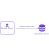

# Security Server Installation Guide for Red Hat Enterprise Linux <!-- omit in toc -->

**X-ROAD 7**

Version: 1.25  
Doc. ID: IG-SS-RHEL

---


## Version history <!-- omit in toc -->

| Date       | Version | Description                                                                                                                                                                                                          | Author            |
|------------|---------|----------------------------------------------------------------------------------------------------------------------------------------------------------------------------------------------------------------------|-------------------|
| 25.10.2018 | 1.0     | Initial version                                                                                                                                                                                                      | Petteri Kivimäki  |
| 16.11.2018 | 1.1     | Update link to Ubuntu installation guide                                                                                                                                                                             | Jarkko Hyöty      |
| 28.01.2018 | 1.2     | Update port 2080 documentation                                                                                                                                                                                       | Petteri Kivimäki  |
| 11.09.2019 | 1.3     | Remove Ubuntu 14.04 from supported platforms                                                                                                                                                                         | Jarkko Hyöty      |
| 12.09.2019 | 1.4     | Add instruction for remote database usage                                                                                                                                                                            | Ilkka Seppälä     |
| 10.10.2019 | 1.5     | Add instructions for binding xroad-proxy to ports 80,443                                                                                                                                                             | Jarkko Hyöty      |
| 30.04.2020 | 1.6     | Add instructions how to use remote database located in Microsoft Azure                                                                                                                                               | Ilkka Seppälä     |
| 12.06.2020 | 1.7     | Update reference data regarding JMX listening ports                                                                                                                                                                  | Petteri Kivimäki  |
| 24.06.2020 | 1.8     | Add repository sign key details in section [2.2 Reference data](#22-reference-data)                                                                                                                                  | Petteri Kivimäki  |
| 24.06.2020 | 1.9     | Remove environmental and operational monitoring daemon JMX listening ports from section [2.2 Reference data](#22-reference-data)                                                                                     | Petteri Kivimäki  |
| 09.08.2020 | 1.10    | Update ports information in section [2.2 Reference data](#22-reference-data), add section [2.2.1 Network Diagram](#221-network-diagram)                                                                              | Petteri Kivimäki  |
| 17.08.2020 | 1.11    | Update for RHEL 8. Document id and name changed.                                                                                                                                                                     | Jarkko Hyöty      |
| 16.09.2020 | 1.12    | Describe deployment options and database customization options.                                                                                                                                                      | Ilkka Seppälä     |
| 29.09.2020 | 1.13    | Add instructions for creating database structure and roles manually.                                                                                                                                                 | Ilkka Seppälä     |
| 16.04.2021 | 1.14    | Update remote database installation instructions                                                                                                                                                                     | Jarkko Hyöty      |
| 18.05.2021 | 1.15    | Add error handling section                                                                                                                                                                                           | Ilkka Seppälä     |
| 01.07.2021 | 1.16    | Update 3rd party key server                                                                                                                                                                                          | Petteri Kivimäki  |
| 11.08.2021 | 1.17    | Add backup encryption information                                                                                                                                                                                    | Petteri Kivimäki  |
| 18.08.2021 | 1.18    | Minor updates to Annex D                                                                                                                                                                                             | Ilkka Seppälä     |
| 25.08.2021 | 1.19    | Update X-Road references from version 6 to 7                                                                                                                                                                         | Caro Hautamäki    |
| 26.08.2021 | 1.20    | Add instructions how to disable the messagelog addon before installing, add section [2.7 Disable the Messagelog Addon before Installation (optional)](#27-disable-the-messagelog-addon-before-installation-optional) | Caro Hautamäki    |
| 03.09.2021 | 1.21    | Minor fixes                                                                                                                                                                                                          | Ilkka Seppälä     |
| 06.09.2021 | 1.22    | Update list of running services                                                                                                                                                                                      | Jarkko Hyöty      |
| 23.05.2023 | 1.23    | Minor backup encryption configuration fixes                                                                                                                                                                          | Eneli Reimets     |
| 09.10.2023 | 1.24    | Java 17 installation instructions for RHEL 7                                                                                                                                                                         | Justas Samuolis   |
| 13.12.2023 | 1.25    | Remove Java 17 manual installation instructions for RHEL 8                                                                                                                                                           | Justas Samuolis   |

## License

This document is licensed under the Creative Commons Attribution-ShareAlike 3.0 Unported License. To view a copy of this license, visit http://creativecommons.org/licenses/by-sa/3.0/


## Table of Contents <!-- omit in toc -->

<!-- toc -->
<!-- vim-markdown-toc GFM -->

- [License](#license)
- [1 Introduction](#1-introduction)
  - [1.1 Target Audience](#11-target-audience)
  - [1.2 Terms and abbreviations](#12-terms-and-abbreviations)
  - [1.3 References](#13-references)
- [2 Installation](#2-installation)
  - [2.1 Prerequisites to Installation](#21-prerequisites-to-installation)
  - [2.2 Reference Data](#22-reference-data)
    - [2.2.1 Network Diagram](#221-network-diagram)
  - [2.3 Requirements for the Security Server](#23-requirements-for-the-security-server)
    - [2.3.1 Installing Java 17](#231-installing-java-17)
      - [2.3.1.1 Installing Java 17 on RHEL 7](#2311-installing-java-17-on-rhel-7)
  - [2.4 Preparing OS](#24-preparing-os)
  - [2.5 Setup Package Repository](#25-setup-package-repository)
  - [2.6 Remote Database Setup (optional)](#26-remote-database-setup-optional)
  - [2.7 Disable the Messagelog Addon before Installation (optional)](#27-disable-the-messagelog-addon-before-installation-optional)
  - [2.8 Security Server Installation](#28-security-server-installation)
    - [2.8.1 Configure Proxy Ports](#281-configure-proxy-ports)
    - [2.8.2 Start Security Server](#282-start-security-server)
  - [2.9 Post-Installation Checks](#29-post-installation-checks)
  - [2.10 Installing the Support for Hardware Tokens](#210-installing-the-support-for-hardware-tokens)
  - [2.11 Installing the Support for Environmental Monitoring](#211-installing-the-support-for-environmental-monitoring)
- [3 Security Server Initial Configuration](#3-security-server-initial-configuration)
  - [3.1 Prerequisites](#31-prerequisites)
  - [3.2 Reference Data](#32-reference-data)
  - [3.3 Configuration](#33-configuration)
  - [3.4 Configuring configuration backup encryption](#34-configuring-configuration-backup-encryption)
- [4 Installation Error handling](#4-installation-error-handling)
  - [4.1 ERROR: Upgrade supported from version X.Y.Z or newer.](#41-error-upgrade-supported-from-version-xyz-or-newer)
- [Annex A Security Server Default Database Properties](#annex-a-security-server-default-database-properties)
- [Annex B Database Users](#annex-b-database-users)
- [Annex C Deployment Options](#annex-c-deployment-options)
  - [C.1 General](#c1-general)
  - [C.2 Local Database](#c2-local-database)
  - [C.3 Remote Database](#c3-remote-database)
  - [C.4 High Availability Setup](#c4-high-availability-setup)
  - [C.5 Load Balancing Setup](#c5-load-balancing-setup)
  - [C.6 Summary](#c6-summary)
- [Annex D Create Database Structure Manually](#annex-d-create-database-structure-manually)

<!-- vim-markdown-toc -->
<!-- tocstop -->


## 1 Introduction


### 1.1 Target Audience

The intended audience of this Installation Guide are X-Road Security server system administrators responsible for installing and using X-Road software. The daily operation and maintenance of the security server is covered by its User Guide \[[UG-SS](#Ref_UG-SS)\].

The document is intended for readers with a moderate knowledge of Linux server management, computer networks, and the X-Road working principles.


### 1.2 Terms and abbreviations

See X-Road terms and abbreviations documentation \[[TA-TERMS](#Ref_TERMS)\].

### 1.3 References

1.  <a id="Ref_UG-SS" class="anchor"></a>\[UG-SS\] X-Road 7. Security Server User Guide. Document ID: [UG-SS](ug-ss_x-road_6_security_server_user_guide.md)

2.  <a id="Ref_TERMS" class="anchor"></a>\[TA-TERMS\] X-Road Terms and Abbreviations. Document ID: [TA-TERMS](../terms_x-road_docs.md).


## 2 Installation


### 2.1 Prerequisites to Installation

There are multiple alternatives how the security server can be deployed. The options are described in [Annex C Deployment Options](#annex-c-deployment-options).

The security server runs on the following platforms:

* Red Hat Enterprise Linux (RHEL) versions 7 and 8 on a x86-64 platform.
* Ubuntu Server 20.04 and 22.04 on a x86-64 platform. See [IG-SS](ig-ss_x-road_v6_security_server_installation_guide.md) for more information.

The software can be installed both on physical and virtualized hardware (of the latter, Xen and Oracle VirtualBox have been tested).


### 2.2 Reference Data

*Note*: The information in empty cells should be determined before the server’s installation, by the person performing the installation.

**Caution**: Data necessary for the functioning of the operating system is not included.


| Ref     |                           | Explanation |
| ------- | --------------------------| ---------------------------------------------------------- |
| 1.0     | RHEL (7.3 or newer; 8.0 or newer), x86-64 CPU, 4 GB RAM, 10 GB free disk space | Minimum requirements
| 1.1     | https://artifactory.niis.org/xroad-release-rpm  | X-Road package repository
| 1.2     | https://artifactory.niis.org/api/gpg/key/public | The repository key.<br /><br />Hash: `935CC5E7FA5397B171749F80D6E3973B`<br  />Fingerprint: `A01B FE41 B9D8 EAF4 872F  A3F1 FB0D 532C 10F6 EC5B`<br  />3rd party key server: [Ubuntu key server](https://keyserver.ubuntu.com/pks/lookup?search=0xfb0d532c10f6ec5b&fingerprint=on&op=index)
| 1.3     |                                         | Account name in the user interface
| 1.4     | **Inbound ports from external network** | Ports for inbound connections from the external network to the security server
|         | TCP 5500                                | Message exchange between security servers
|         | TCP 5577                                | Querying of OCSP responses between security servers
| 1.5     | **Outbound ports to external network**  | Ports for outbound connections from the security server to the external network
|         | TCP 5500                                | Message exchange between security servers
|         | TCP 5577                                | Querying of OCSP responses between security servers
|         | TCP 4001                                | Communication with the central server
|         | TCP 80                                  | Downloading global configuration from the central server
|         | TCP 80,443                              | Most common OCSP and time-stamping services
| 1.6     | **Inbound ports from internal network** | Ports for inbound connections from the internal network to the security server
|         | TCP 4000                                | User interface and management REST API (local network). **Must not be accessible from the internet!**
|         | TCP 8080 (or TCP 80), 8443 (or TCP 443) | Information system access points (in the local network). **Must not be accessible from the external network without strong authentication. If open to the external network, IP filtering is strongly recommended.**
| 1.7     | **Outbound ports to internal network**  | Ports for inbound connections from the internal network to the security server
|         | TCP 80, 443, *other*                    | Producer information system endpoints
|         | TCP 2080                                | Message exchange between security server and operational data monitoring daemon (by default on localhost)
| 1.8     |                                         | Security server internal IP address(es) and hostname(s)
| 1.9     |                                         | Security server public IP address, NAT address

It is strongly recommended to protect the security server from unwanted access using a firewall (hardware or software based). The firewall can be applied to both incoming and outgoing connections depending on the security requirements of the environment where the security server is deployed. It is recommended to allow incoming traffic to specific ports only from explicitly defined sources using IP filtering. **Special attention should be paid with the firewall configuration since incorrect configuration may leave the security server vulnerable to exploits and attacks.**


#### 2.2.1 Network Diagram

The network diagram below provides an example of a basic Security Server setup. Allowing incoming connections from the Monitoring Security Server on ports 5500/tcp and 5577/tcp is necessary for the X-Road Operator to be able to monitor the ecosystem and provide statistics and support for Members.


The table below lists the required connections between different components.

| Connection Type | Source | Target | Target Ports | Protocol | Note |
|-----------|------------|-----------|-----------|-----------|-----------|
| Out | Security Server | Central Server | 80, 4001 | tcp | |
| Out | Security Server | Management Security Server | 5500, 5577 | tcp | |
| Out | Security Server | OCSP Service | 80 / 443 | tcp | |
| Out | Security Server | Timestamping Service | 80 / 443 | tcp | |
| Out | Security Server | Data Exchange Partner Security Server (Service Producer) | 5500, 5577 | tcp | |
| Out | Security Server | Producer Information System | 80, 443, other | tcp | Target in the internal network |
| In  | Monitoring Security Server | Security Server | 5500, 5577 | tcp | |
| In  | Data Exchange Partner Security Server (Service Consumer) | Security Server | 5500, 5577 | tcp | |
| In | Consumer Information System | Security Server | 8080, 8443 | tcp | Source in the internal network |
| In | Admin | Security Server | 4000 | tcp | Source in the internal network |


### 2.3 Requirements for the Security Server

Minimum recommended hardware parameters:

* the server’s hardware (motherboard, CPU, network interface cards, storage system) must be supported by RHEL in general;
* a x86-64 dual-core Intel, AMD or compatible CPU; AES instruction set support is highly recommended;
* 2 CPU;
* 4 GB RAM;
* 10 GB free disk space (OS partition), 20-40 GB free disk space (`/var` partition);
* a 100 Mbps network interface card.

Requirements to software and settings:

* an installed and configured RHEL (v7.3 or newer; 8.0 or newer;) x86-64 operating system;
* Java 17 should be installed;
* if the security server is separated from other networks by a firewall and/or NAT, the necessary connections to and from the security server are allowed (**reference data: 1.4; 1.5; 1.6; 1.7**). The enabling of auxiliary services which are necessary for the functioning and management of the operating system (such as DNS, NTP, and SSH) stay outside the scope of this guide;
* if the security server has a private IP address, a corresponding NAT record must be created in the firewall (**reference data: 1.9**).

#### 2.3.1 Installing Java 17

Java 17 is a prerequisite for running the Security Server and should be installed prior installing/updating Security Server, however it is not included in default repositories for RHEL 7.
Sample installation steps are provided below.

* Check the current java version:

        java -version

If the current Java version is 17, following steps should be skipped. If not, follow the instructions to install Java 17.

##### 2.3.1.1 Installing Java 17 on RHEL 7

Sample installation steps for Eclipse Temurin JDK are provided below, but other JDK distributions can also be used.
Follow these steps to install Temurin JDK 17 on RHEL 7:

* Add the Adoptium repository to your system:

        sudo tee /etc/yum.repos.d/adoptium.repo <<EOF
        [Adoptium]
        name=Adoptium
        baseurl=https://packages.adoptium.net/artifactory/rpm/${DISTRIBUTION_NAME:-$(. /etc/os-release; echo $ID)}/7/\$basearch
        enabled=1
        gpgcheck=1
        gpgkey=https://packages.adoptium.net/artifactory/api/gpg/key/public
        EOF

* Install Java 17 (Eclipse Temurin JDK):
       
        sudo yum install temurin-17-jdk

* Verify the installation:
    
        java -version

The output should contain Java version 17. If it does not, set the default Java version to 17 using *alternatives*:

        sudo alternatives --config java

### 2.4 Preparing OS

* Set the operating system locale. Add following line to the `/etc/environment` file.

        LC_ALL=en_US.UTF-8

* Install `yum-utils`, a collection of utilities that integrate with yum to extend its native features.

        sudo yum install yum-utils


### 2.5 Setup Package Repository

Add X-Road package repository (**reference data: 1.1**) and Extra Packages for Enterprise Linux (EPEL) repository:

  ```bash
  RHEL_MAJOR_VERSION=$(source /etc/os-release;echo ${VERSION_ID%.*})
  sudo yum install https://dl.fedoraproject.org/pub/epel/epel-release-latest-${RHEL_MAJOR_VERSION}.noarch.rpm
  sudo yum-config-manager --add-repo https://artifactory.niis.org/xroad-release-rpm/rhel/${RHEL_MAJOR_VERSION}/current
  ```

The following packages are fetched from EPEL: `crudini`, and `rlwrap`.

Add the X-Road repository’s signing key to the list of trusted keys (**reference data: 1.2**):

  ```bash
  sudo rpm --import https://artifactory.niis.org/api/gpg/key/public
  ```

If you are installing the default setup with local PostgreSQL database and want to enable the messagelog addon, continue at section 2.8. If you need to customize database properties and e.g. use a remote database or disable the messagelog addon, read on.

### 2.6 Remote Database Setup (optional)

*This is an optional step.* 

Optionally, the security server can use a remote database server. To avoid installing the default local PostgreSQL server during security server installation, install the `xroad-database-remote` -package, which will also install the PostgreSQL client and create the `xroad` system user and configuration directories (`/etc/xroad`).
```bash
sudo yum install xroad-database-remote
```

For the application level backup and restore feature to work correctly, it is important to verify that the local PostgreSQL client has the same or later major version than the remote database server and, if necessary, install a different version of the `postgresql` package (see https://www.postgresql.org/download/linux/redhat/)
```bash
psql --version
psql (PostgreSQL) 10.16

psql -h <database host> -U <superuser> -tAc 'show server_version'
10.16 (Ubuntu 10.16-0ubuntu0.18.04.1)
```

The security server installer can create the database and users for you, but you need to create a configuration file containing the database administrator credentials. 

For advanced setup, e.g. when using separate instances for the different databases, sharing a database with several security servers, or if storing the database administrator password on the security server is not an option, you can create the database users and structure manually as described in [Annex D Create Database Structure Manually](#annex-d-create-database-structure-manually) and then continue to section 2.7. Otherwise, perform the following steps:

Create the property file for database credentials:
```bash
sudo touch /etc/xroad.properties
sudo chown root:root /etc/xroad.properties
sudo chmod 600 /etc/xroad.properties
```

Edit `/etc/xroad.properties`. See the example below. Replace parameter values with your own.
```properties
postgres.connection.password = <database superuser password>
postgres.connection.user = <database superuser name, postgres by default>
```
Note. If Microsoft Azure database for PostgreSQL is used, the connection user needs to be in format `username@hostname`.


For additional security, the `postgresql.connection.*` properties can be removed from the `/etc/xroad.properties` file after installation (keep the other properties added by the installer).


Create the `/etc/xroad/db.properties` file
```bash
sudo touch /etc/xroad/db.properties
sudo chmod 0640 /etc/xroad/db.properties
sudo chown xroad:xroad /etc/xroad/db.properties
```

Add the following properties to the `/etc/xroad/db.properties` file (replace parameters with your own):
```properties
serverconf.hibernate.connection.url = jdbc:postgresql://<database host>:<port>/serverconf
messagelog.hibernate.connection.url = jdbc:postgresql://<database host>:<port>/messagelog
```
If installing the optional xroad-opmonitor component, also add the following line
```properties
op-monitor.hibernate.connection.url = jdbc:postgresql://<database host>:<port>/op-monitor
```

Before continuing, test that the connection to the database works, e.g.
```bash
psql -h <database host> -U <superuser> -tAc 'show server_version'
```

### 2.7 Disable the Messagelog Addon before Installation (optional)

It is possible to preconfigure the Security Server installation so that the messagelog addon will be automatically disabled after the installation process is done. This also skips the creation of the messagelog database.

In order to skip messagelog database creation and disable the messagelog addon, run the following command to create a configuration file before installing the Security Server 

```bash
echo "ENABLE_MESSAGELOG=false" | sudo tee /etc/sysconfig/xroad-addon-messagelog
```

### 2.8 Security Server Installation

Issue the following command to install the security server packages (use package `xroad-securityserver-ee` to include configuration specific to Estonia; use package `xroad-securityserver-fi` to include configuration specific to Finland; use package `xroad-securityserver-is` to include configuration specific to Iceland):

  ```bash
  sudo yum install xroad-securityserver
  ```

Add system user (**reference data: 1.3**) whom all roles in the user interface are granted to. Add a new user with the command

  ```bash
  sudo xroad-add-admin-user <username>
  ```

User roles are discussed in detail in X-Road Security Server User Guide \[[UG-SS](#Ref_UG-SS)\].


#### 2.8.1 Configure Proxy Ports

**This is an optional step.** Change `xroad-proxy` to use ports 80 and 443.

By default, `xroad-proxy` listens for consumer information system connections on ports 8080 (HTTP) and 8443 (HTTPS). To use standard HTTP(S) ports 80 and 443, verify that the ports are free, and make the following modifications:

Edit `/etc/xroad/conf.d/local.ini` and add the following properties in the `[proxy]` section:

  ```ini
  [proxy]
  client-http-port=80
  client-https-port=443
  ```

#### 2.8.2 Start Security Server

Once the installation is completed, start the security server

  ```bash
  sudo systemctl start xroad-proxy
  ```


### 2.9 Post-Installation Checks

The installation is successful if system services are started and the user interface is responding.

* Ensure from the command line that X-Road services are in the `running` state (example output follows):

  ```bash
  sudo systemctl list-units "xroad-*"

  UNIT                           LOAD   ACTIVE SUB     DESCRIPTION
  xroad-addon-messagelog.service loaded active running X-Road Messagelog Archiver
  xroad-base.service             loaded active exited  X-Road initialization
  xroad-confclient.service       loaded active running X-Road confclient
  xroad-monitor.service          loaded active running X-Road Monitor
  xroad-proxy-ui-api.service     loaded active running X-Road Proxy UI REST API
  xroad-proxy.service            loaded active running X-Road Proxy
  xroad-signer.service           loaded active running X-Road signer
  ```

* Ensure that the security server user interface at https://SECURITYSERVER:4000/ (**reference data: 1.8; 1.6**) can be opened in a Web browser. To log in, use the account name chosen during the installation (**reference data: 1.3**). While the user interface is still starting up, the Web browser may display a connection refused -error.

### 2.10 Installing the Support for Hardware Tokens

Hardware security tokens (smartcard, USB token, Hardware Security Module) have not been tested on RHEL. Therefore, support is not provided.

### 2.11 Installing the Support for Environmental Monitoring

The support for environmental monitoring functionality on a security server is provided by package xroad-monitor that is installed by default. The package installs and starts the `xroad-monitor` process that will gather and make available the monitoring information.

## 3 Security Server Initial Configuration

During the security server initial configuration, the server’s X-Road membership information and the software token’s PIN are set.


### 3.1 Prerequisites

Configuring the security server assumes that the security server owner is a member of the X-Road.


### 3.2 Reference Data

ATTENTION: Reference items 2.1 - 2.3 in the reference data are provided to the security server owner by the X-Road central’s administrator.

The security server code and the software token’s PIN will be determined during the installation at the latest, by the person performing the installation.

 Ref  |                                                   | Explanation
 ---- | ------------------------------------------------- | --------------------------------------------------
 2.1  | &lt;global configuration anchor file&gt; or &lt;URL&gt; | Global configuration anchor file
 2.2  | E.g.<br>GOV - government<br> COM - commercial     | Member class of the security server's owner
 2.3  | &lt;security server owner register code&gt;       | Member code of the security server's owner
 2.4  | &lt;choose security server identificator name&gt; | Security server's code
 2.5  | &lt;choose PIN for software token&gt;             | Software token’s PIN


### 3.3 Configuration

To perform the initial configuration, open the address

    https://SECURITYSERVER:4000/

in a Web browser (**reference data: 1.8; 1.6**). To log in, use the account name chosen during the installation (**reference data: 1.3).**

Upon first log-in, the system asks for the following information.

* The global configuration anchor file (**reference data: 2.1**).

    **Please verify anchor hash value with the published value.**

If the configuration is successfully downloaded, the system asks for the following information.

* The security server owner’s member class (**reference data: 2.2**).
* The security server owner’s member code (**reference data: 2.3**).

  If the member class and member code are correctly entered, the system displays the security server owner’s name as registered in the X-Road center.

* Security server code (**reference data: 2.4**), which is chosen by the security server administrator and which has to be unique across all the security servers belonging to the same X-Road member.
* Software token’s PIN (**reference data: 2.5**). The PIN will be used to protect the keys stored in the software token. The PIN must be stored in a secure place, because it will be no longer possible to use or recover the private keys in the token once the PIN has been lost.

### 3.4 Configuring configuration backup encryption

It is possible to automatically encrypt security server configuration backups. Security server uses The GNU Privacy Guard (https://www.gnupg.org)
for backup encryption and verification. Backups are always signed, but backup encryption is initially turned off.
To turn encryption on, please override the default configuration in the file `/etc/xroad/conf.d/local.ini`, in the `[proxy]` section (add or edit this section).

    [proxy]
    backup-encryption-enabled = true
    backup-encryption-keyids = <keyid1>, <keyid2>, ...

To turn backup encryption on, please change the `backup-encryption-enabled` property value to `true`.
By default, backups are encrypted using security server's backup encryption key. Additional encryption keys can be imported in the /etc/xroad/gpghome keyring and key identifiers listed using the backup-encryption-keyids parameter. It is recommended to set up at least one additional key, otherwise the backups will be unusable in case security server's private key is lost. It is up to security server's administrator to check that keys used are sufficiently strong, there are no automatic checks.

Warning. All keys listed in backup-encryption-keyids must be present in the gpg keyring or backup fails.

All these keys are used to encrypt backups so that ANY of these keys can decrypt the backups. This is useful both for verifying encrypted backups'
consistency and decrypting backups in case security server's backup encryption key gets lost for whatever reason.

To externally verify a backup archive's consistency, security server's backup encryption public key has to be exported
and imported into external GPG keyring. Note that this can be done only after security server has been initialised - the
security server backup encryption key is generated during initialisation.

To export security server's backup encryption public key use the following command:

    gpg --homedir /etc/xroad/gpghome --armor --output server-public-key.gpg --export AA/GOV/TS1OWNER/TS1

where `AA/GOV/TS1OWNER/TS1` is the security server id.

The key can then be moved to an external host and imported to GPG keyring with the following command:

    gpg --homedir /your_gpg_homedir_here --import server-public-key.gpg

## 4 Installation Error handling

### 4.1 ERROR: Upgrade supported from version X.Y.Z or newer.

The following error message may come up during the security server upgrade.

`ERROR: Upgrade supported from version X.Y.Z or newer.`

Upgrading the packages from the current version to the target version is not supported directly. The fix is to upgrade the security server to the target version step by step.

For example, the following security server packages are currently installed.

```bash
[root@rh1 ~]# yum list installed | grep xroad
xroad-addon-messagelog.x86_64      7.0.0-1.el7 @artifactory.niis.org_xroad-release-rpm_rhel_7_current 
xroad-addon-metaservices.x86_64    7.0.0-1.el7 @artifactory.niis.org_xroad-release-rpm_rhel_7_current 
xroad-addon-proxymonitor.x86_64    7.0.0-1.el7 @artifactory.niis.org_xroad-release-rpm_rhel_7_current 
xroad-addon-wsdlvalidator.x86_64   7.0.0-1.el7 @artifactory.niis.org_xroad-release-rpm_rhel_7_current 
xroad-base.x86_64                  7.0.0-1.el7 @artifactory.niis.org_xroad-release-rpm_rhel_7_current 
xroad-confclient.x86_64            7.0.0-1.el7 @artifactory.niis.org_xroad-release-rpm_rhel_7_current 
xroad-database-local.noarch        7.0.0-1.el7 @artifactory.niis.org_xroad-release-rpm_rhel_7_current 
xroad-monitor.x86_64               7.0.0-1.el7 @artifactory.niis.org_xroad-release-rpm_rhel_7_current 
xroad-proxy.x86_64                 7.0.0-1.el7 @artifactory.niis.org_xroad-release-rpm_rhel_7_current 
xroad-proxy-ui-api.x86_64          7.0.0-1.el7 @artifactory.niis.org_xroad-release-rpm_rhel_7_current 
xroad-securityserver.noarch        7.0.0-1.el7 @artifactory.niis.org_xroad-release-rpm_rhel_7_current 
xroad-signer.x86_64                7.0.0-1.el7 @artifactory.niis.org_xroad-release-rpm_rhel_7_current 
```

The following packages are available in the repository.

```bash
[root@rh1 ~]# yum --showduplicates list xroad-securityserver
Installed Packages
xroad-securityserver.noarch                                                                        7.0.0-1.el7                                                                         @artifactory.niis.org_xroad-release-rpm_rhel_7_current
Available Packages
xroad-securityserver.noarch                                                                        7.1.0-1.el7                                                                         artifactory.niis.org_xroad-release-rpm_rhel_7_current
xroad-securityserver.noarch                                                                        7.3.0-1.el7                                                                         artifactory.niis.org_xroad-release-rpm_rhel_7_current
```

Now trying to upgrade the central server packages directly will produce the following error.

```bash
[root@rh1 ~]# yum upgrade xroad-securityserver
...
ERROR: Upgrade supported from version 7.1.0 or newer.
error: %pre(xroad-securityserver-7.3.0-1.el7.noarch) scriptlet failed, exit status 1
Error in PREIN scriptlet in rpm package xroad-securityserver-7.3.0-1.el7.noarch
```

The fix is to upgrade the security server in two separate steps. First, upgrade to 7.1.x with the following command.

```bash
yum install xroad-securityserver-7.1.0-1.el7 xroad-addon-messagelog-7.1.0-1.el7 xroad-addon-metaservices-7.1.0-1.el7 xroad-addon-proxymonitor-7.1.0-1.el7 xroad-addon-wsdlvalidator-7.1.0-1.el7 xroad-base-7.1.0-1.el7 xroad-confclient-7.1.0-1.el7 xroad-database-local-7.1.0-1.el7 xroad-monitor-7.1.0-1.el7 xroad-proxy-7.1.0-1.el7 xroad-proxy-ui-api-7.1.0-1.el7 xroad-securityserver-7.1.0-1.el7 xroad-signer-7.1.0-1.el7
```

An alternative approach to the previous command is to temporarily configure the server to use a repository that contains only the specific version of X-Road software we want to upgrade to. For example, configure the repository as `https://artifactory.niis.org/xroad-release-rpm/rhel/7/7.1.0` and then use the `yum update xroad-securityserver` command.

Finally, we can upgrade to our target version 7.3.x as follows.

```bash
yum update xroad-securityserver
```

## Annex A Security Server Default Database Properties

`/etc/xroad/db.properties`

```properties
serverconf.hibernate.jdbc.use_streams_for_binary = true
serverconf.hibernate.dialect = ee.ria.xroad.common.db.CustomPostgreSQLDialect
serverconf.hibernate.connection.driver_class = org.postgresql.Driver
serverconf.hibernate.connection.url = jdbc:postgresql://127.0.0.1:5432/serverconf
serverconf.hibernate.hikari.dataSource.currentSchema = serverconf,public
serverconf.hibernate.connection.username = serverconf
serverconf.hibernate.connection.password = <randomly generated password>

messagelog.hibernate.jdbc.use_streams_for_binary = true
messagelog.hibernate.connection.driver_class = org.postgresql.Driver
messagelog.hibernate.connection.url = jdbc:postgresql://127.0.0.1:5432/messagelog
messagelog.hibernate.hikari.dataSource.currentSchema = messagelog,public
messagelog.hibernate.connection.username = messagelog
messagelog.hibernate.connection.password = <randomly generated password>

op-monitor.hibernate.jdbc.use_streams_for_binary = true
op-monitor.hibernate.connection.driver_class = org.postgresql.Driver
op-monitor.hibernate.connection.url = jdbc:postgresql://127.0.0.1:5432/op-monitor
op-monitor.hibernate.hikari.dataSource.currentSchema = opmonitor,public
op-monitor.hibernate.connection.username = opmonitor
op-monitor.hibernate.connection.password = <randomly generated password>
```


## Annex B Database Users

| User             | Database   | Privileges               | Description                                                                              |
| ---------------- | ---------- | ------------------------ | ---------------------------------------------------------------------------------------- |
| serverconf       | serverconf | TEMPORARY,CONNECT        | The database user used to read/write the serverconf database during application runtime. |
| serverconf_admin | serverconf | CREATE,TEMPORARY,CONNECT | The database user used to create/update the serverconf schema.                           |
| messagelog       | messagelog | TEMPORARY,CONNECT        | The database user used to read/write the messagelog database during application runtime. |
| messagelog_admin | messagelog | CREATE,TEMPORARY,CONNECT | The database user used to create/update the messagelog schema.                           |
| opmonitor        | op-monitor | TEMPORARY,CONNECT        | The database user used to read/write the op-monitor database during application runtime. |
| opmonitor_admin  | op-monitor | CREATE,TEMPORARY,CONNECT | The database user used to create/update the op-monitor schema.                           |
| postgres         | ALL        | ALL                      | PostgreSQL database default superuser.                                                   |


## Annex C Deployment Options


### C.1 General

X-Road security server has multiple deployment options. The simplest choice is to have a single security server with local database. This is usually fine for majority of the cases, but there are multiple reasons to tailor the deployment.


### C.2 Local Database

The simplest deployment option is to use a single security server with local database. For development and testing purposes there is rarely need for anything else, but for production the requirements may be stricter.


### C.3 Remote Database

It is possible to use a remote database with security server. This option is sometimes used in development and testing when there's need to externalize the database state.

Security server supports a variety of cloud databases including AWS RDS and Azure Database for PostgreSQL. This deployment option is useful when doing development in cloud environment, where use of cloud native database is the first choice.




### C.4 High Availability Setup

In production systems it's rarely acceptable to have a single point of failure. Security server supports provider side high availability setup via so called internal load balancing mechanism. The setup works so that the same member / member class / member code / subsystem / service code is configured on multiple security servers and X-Road will then route the request to the server that responds the fastest. Note that this deployment option does not provide performance benefits, just redundancy.


### C.5 Load Balancing Setup

Busy production systems may need scalable performance in addition to high availability. X-Road supports external load balancing mechanism to address both of these problems simultaneously. A load balancer is added in front of a security server cluster to route the requests based on selected algorithm. This deployment option is extensively documented in \[[IG-XLB](#Ref_IG-XLB)\].


### C.6 Summary

The following table lists a summary of the security server deployment options and indicates whether they are aimed for development or production use.

| Deployment               | Dev  | Prod  |
|--------------------------|------|-------|
| Local database           | x    |       |
| Remote database          | x    |       |
| High-availability Setup  |      | x     |
| Load Balancing Setup     |      | x     |


## Annex D Create Database Structure Manually

Depending on installed components, the security server uses one to three databases (catalogs):

* _serverconf_ for storing security server configuration (required)
* _messagelog_ for storing message records (optional, but installed by default)
* _op-monitor_ for operational monitoring data (optional)

These databases can be hosted on one database server (default setup), or you can use several servers. 

Login to the database server(s) as the superuser (`postgres` by default) to run the commands, e.g.
```bash
psql -h <database host>:<port> -U <superuser> -d postgres
```

Run the following commands to create the necessary database structures. If necessary, customize the database and role names to suit your environment (e.g when the same database server is shared between several security server instances, it is necessary to have separate database names and roles for each server). By default, the database, database user, and schema use the same name (e.g. serverconf), and the admin user is named with \_admin prefix (e.g. serverconf_admin).

**serverconf** (required)
```sql
CREATE DATABASE serverconf ENCODING 'UTF8';
REVOKE ALL ON DATABASE serverconf FROM PUBLIC;
CREATE ROLE serverconf_admin LOGIN PASSWORD '<serverconf_admin password>';
GRANT serverconf_admin to <superuser>;
GRANT CREATE,TEMPORARY,CONNECT ON DATABASE serverconf TO serverconf_admin;
\c serverconf
CREATE EXTENSION hstore;
CREATE SCHEMA serverconf AUTHORIZATION serverconf_admin;
REVOKE ALL ON SCHEMA public FROM PUBLIC;
GRANT USAGE ON SCHEMA public to serverconf_admin;
CREATE ROLE serverconf LOGIN PASSWORD '<serverconf password>';
GRANT serverconf to <superuser>;
GRANT TEMPORARY,CONNECT ON DATABASE serverconf TO serverconf;
GRANT USAGE ON SCHEMA public to serverconf;
```

**messagelog** (required by xroad-addon-messagelog)
```sql
CREATE DATABASE messagelog ENCODING 'UTF8';
REVOKE ALL ON DATABASE messagelog FROM PUBLIC;
CREATE ROLE messagelog_admin LOGIN PASSWORD '<messagelog_admin password>';
GRANT messagelog_admin to <superuser>;
GRANT CREATE,TEMPORARY,CONNECT ON DATABASE messagelog TO messagelog_admin;
\c messagelog
CREATE SCHEMA messagelog AUTHORIZATION messagelog_admin;
REVOKE ALL ON SCHEMA public FROM PUBLIC;
GRANT USAGE ON SCHEMA public to messagelog_admin;
CREATE ROLE messagelog LOGIN PASSWORD '<messagelog password>';
GRANT messagelog to <superuser>;
GRANT TEMPORARY,CONNECT ON DATABASE messagelog TO messagelog;
GRANT USAGE ON SCHEMA public to messagelog;
```

**op-monitor** (optional, required by xroad-opmonitor)

If operational monitoring is going to be installed, run additionally the following commands. Again, the database and role names can be customized to suit your environment.

```sql
CREATE DATABASE "op-monitor" ENCODING 'UTF8';
REVOKE ALL ON DATABASE "op-monitor" FROM PUBLIC;
CREATE ROLE opmonitor_admin LOGIN PASSWORD '<opmonitor_admin password>';
GRANT opmonitor_admin to <superuser>;
GRANT CREATE,TEMPORARY,CONNECT ON DATABASE "op-monitor" TO opmonitor_admin;
\c "op-monitor"
CREATE SCHEMA opmonitor AUTHORIZATION opmonitor_admin;
REVOKE ALL ON SCHEMA public FROM PUBLIC;
GRANT USAGE ON SCHEMA public to opmonitor_admin;
CREATE ROLE opmonitor LOGIN PASSWORD '<opmonitor password>';
GRANT opmonitor to <superuser>;
GRANT TEMPORARY,CONNECT ON DATABASE "op-monitor" TO opmonitor;
GRANT USAGE ON SCHEMA public to opmonitor;
```

Lastly, customize the database connection properties to match the values used when creating the database.

Note. When using Microsoft Azure PostgreSQL, the user names need to be in format `username@hostname` in the properties files.

Create the configuration file `/etc/xroad.properties`.
```bash
sudo touch /etc/xroad.properties
sudo chown root:root /etc/xroad.properties
sudo chmod 600 /etc/xroad.properties
```

Edit `/etc/xroad.properties` and add/update the following properties (if you customized the role names, use your own). The admin users are used to run database migrations during the install and upgrades.
```properties
serverconf.database.admin_user = serverconf_admin
serverconf.database.admin_password = <serverconf_admin password>
op-monitor.database.admin_user = opmonitor_admin
op-monitor.database.admin_password = <opmonitor_admin password>
messagelog.database.admin_user = messagelog_admin
messagelog.database.admin_password = <messagelog_admin password>
```

Create the `/etc/xroad/db.properties` file
```bash
sudo mkdir /etc/xroad
sudo chown xroad:xroad /etc/xroad
sudo chmod 751 /etc/xroad
sudo touch /etc/xroad/db.properties
sudo chmod 0640 /etc/xroad/db.properties
sudo chown xroad:xroad /etc/xroad/db.properties
```

Edit the `/etc/xroad/db.properties` file and add/update the following connection properties (if you customized the database, user, and/or role names, use the customized values).
The database connection url format is `jdbc:postgresql://<database host>:<port>/<database name>`
```properties
serverconf.hibernate.connection.url = jdbc:postgresql://<database host>:<port>/serverconf
serverconf.hibernate.connection.username = serverconf
serverconf.hibernate.connection.password = <serverconf password> 
serverconf.hibernate.hikari.dataSource.currentSchema = serverconf,public

messagelog.hibernate.connection.url = jdbc:postgresql://<database host>:<port>/messagelog
messagelog.hibernate.connection.username = messagelog
messagelog.hibernate.connection.password = <messagelog password>
messagelog.hibernate.hikari.dataSource.currentSchema = messagelog,public

op-monitor.hibernate.connection.url = jdbc:postgresql://<database host>:<port>/op-monitor
op-monitor.hibernate.connection.username = opmonitor
op-monitor.hibernate.connection.password = <opmonitor password>
op-monitor.hibernate.hikari.dataSource.currentSchema = opmonitor,public
```
