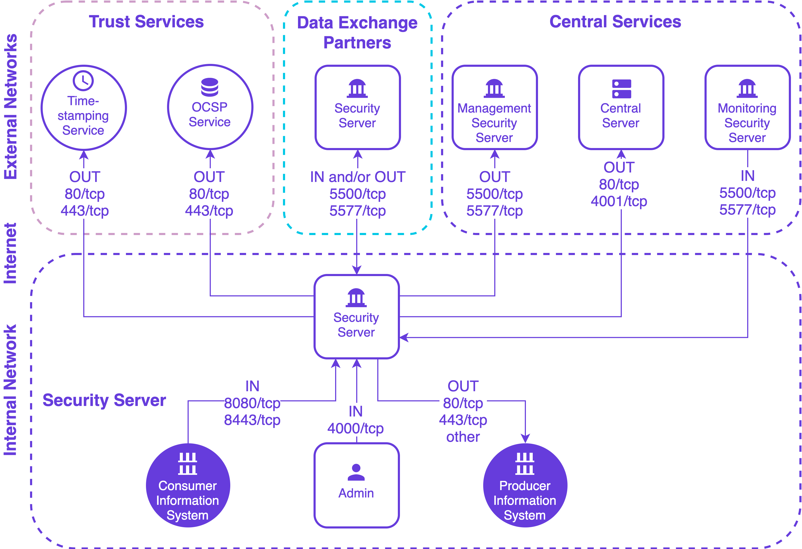

|  |
| -------------------------: |

# Security Server Installation Guide for Red Hat Enterprise Linux 7 (RHEL7) <!-- omit in toc -->

**X-ROAD 6**

Version: 1.10  
Doc. ID: IG-SS-RHEL7

---


## Version history <!-- omit in toc -->

 Date       | Version | Description                                                     | Author
 ---------- | ------- | --------------------------------------------------------------- | --------------------
 25.10.2018 | 1.0     | Initial version                                                 | Petteri Kivimäki
 16.11.2018 | 1.1     | Update link to Ubuntu installation guide                        | Jarkko Hyöty
 28.01.2018 | 1.2     | Update port 2080 documentation                                  | Petteri Kivimäki
 11.09.2019 | 1.3     | Remove Ubuntu 14.04 from supported platforms                    | Jarkko Hyöty
 12.09.2019 | 1.4     | Add instruction for remote database usage                       | Ilkka Seppälä
 10.10.2019 | 1.5     | Add instructions for binding xroad-proxy to ports 80,443        | Jarkko Hyöty
 30.04.2020 | 1.6     | Add instructions how to use remote database located in Microsoft Azure        | Ilkka Seppälä
 12.06.2020 | 1.7     | Update reference data regarding JMX listening ports | Petteri Kivimäki
 24.06.2020 | 1.8    | Add repository sign key details in section [2.2 Reference data](#22-reference-data) | Petteri Kivimäki
 24.06.2020 | 1.9    | Remove environmental and operational monitoring daemon JMX listening ports from section [2.2 Reference data](#22-reference-data) | Petteri Kivimäki
 09.08.2020 | 1.10    | Update ports information in section [2.2 Reference data](#22-reference-data), add section [2.2.1 Network Diagram](#221-network-diagram) | Petteri Kivimäki
## Table of Contents <!-- omit in toc -->

<!-- toc -->

- [License](#license)
- [1 Introduction](#1-introduction)
  - [1.1 Target Audience](#11-target-audience)
  - [1.2 Terms and abbreviations](#12-terms-and-abbreviations)
  - [1.3 References](#13-references)
- [2 Installation](#2-installation)
  - [2.1 Supported Platforms](#21-supported-platforms)
  - [2.2 Reference Data](#22-reference-data)
    - [2.2.1 Network Diagram](#221-network-diagram)  
  - [2.3 Requirements for the Security Server](#23-requirements-for-the-security-server)
  - [2.4 Preparing OS](#24-preparing-os)
  - [2.5 Installation](#25-installation)
  - [2.6 Post-Installation Checks](#26-post-installation-checks)
  - [2.7 Installing the Support for Hardware Tokens](#27-installing-the-support-for-hardware-tokens)
  - [2.8 Installing the Support for Environmental Monitoring](#28-installing-the-support-for-environmental-monitoring)
  - [2.9 Remote Database Post-Installation Tasks](#29-remote-database-post-installation-tasks)
- [3 Security Server Initial Configuration](#3-security-server-initial-configuration)
  - [3.1 Prerequisites](#31-prerequisites)
  - [3.2 Reference Data](#32-reference-data)
  - [3.3 Configuration](#33-configuration)

<!-- tocstop -->

## License

This document is licensed under the Creative Commons Attribution-ShareAlike 3.0 Unported License. To view a copy of this license, visit http://creativecommons.org/licenses/by-sa/3.0/

## 1 Introduction


### 1.1 Target Audience

The intended audience of this Installation Guide are X-Road Security server system administrators responsible for installing and using X-Road software. The daily operation and maintenance of the security server is covered by its User Guide \[[UG-SS](#Ref_UG-SS)\].

The document is intended for readers with a moderate knowledge of Linux server management, computer networks, and the X-Road working principles.

### 1.2 Terms and abbreviations

See X-Road terms and abbreviations documentation \[[TA-TERMS](#Ref_TERMS)\].

### 1.3 References

1.  <a id="Ref_UG-SS" class="anchor"></a>\[UG-SS\] X-Road 6. Security Server User Guide. Document ID: [UG-SS](ug-ss_x-road_6_security_server_user_guide.md)

2.  <a id="Ref_TERMS" class="anchor"></a>\[TA-TERMS\] X-Road Terms and Abbreviations. Document ID: [TA-TERMS](../terms_x-road_docs.md).

## 2 Installation


### 2.1 Supported Platforms

The security server runs on the following platforms:

* Red Hat Enterprise Linux 7.3 (RHEL7) or newer operating system on a 64-bit platform. The security server software is distributed as .rpm packages through the official X-Road repository at https://artifactory.niis.org/xroad-release-rpm/
* Ubuntu Server 18.04 Long-Term Support (LTS) operating system. See [IG-SS](ig-ss_x-road_v6_security_server_installation_guide.md) for more information.

The software can be installed both on physical and virtualized hardware (of the latter, Xen and Oracle VirtualBox have been tested).


### 2.2 Reference Data

*Note*: The information in empty cells should be determined before the server’s installation, by the person performing the installation.

**Caution**: Data necessary for the functioning of the operating system is not included.


| **Ref** |                           | **Explanation**
| ------- | --------------------------| ----------------------------------------------------------
| 1.0     | RHEL7 (v7.3 or newer), 64-bit2 CPU, 4 GB RAM, 10 GB free disk space | Minimum requirements
| 1.1     | https://artifactory.niis.org/xroad-release-rpm  | X-Road package repository
| 1.2     | https://artifactory.niis.org/api/gpg/key/public | The repository key.<br /><br />Hash: `935CC5E7FA5397B171749F80D6E3973B`<br  />Fingerprint: `A01B FE41 B9D8 EAF4 872F  A3F1 FB0D 532C 10F6 EC5B`<br  />3rd party key server: [SKS key servers](http://pool.sks-keyservers.net/pks/lookup?op=vindex&hash=on&fingerprint=on&search=0xFB0D532C10F6EC5B)
| 1.3     |                          | Account name in the user interface
 1.4    | **Inbound ports from external network** | Ports for inbound connections from the external network to the security server
 &nbsp; | TCP 5500                                | Message exchange between security servers
 &nbsp; | TCP 5577                                | Querying of OCSP responses between security servers
 1.5    | **Outbound ports to external network**  | Ports for outbound connections from the security server to the external network
 &nbsp; | TCP 5500                                | Message exchange between security servers
 &nbsp; | TCP 5577                                | Querying of OCSP responses between security servers
 &nbsp; | TCP 4001                                | Communication with the central server
 &nbsp; | TCP 80                                  | Downloading global configuration from the central server
 &nbsp; | TCP 80,443                              | Most common OCSP and time-stamping services
 1.6    | **Inbound ports from internal network** | Ports for inbound connections from the internal network to the security server
 &nbsp; | TCP 4000                                | User interface and management REST API (local network). **Must not be accessible from the internet!**
 &nbsp; | TCP 8080 (or TCP 80), 8443 (or TCP 443) | Information system access points (in the local network). **Must not be accessible from the external network without strong authentication. If open to the external network, IP filtering is strongly recommended.**
 1.7    | **Outbound ports to internal network**  | Ports for inbound connections from the internal network to the security server 
 &nbsp; | TCP 80, 443, *other*                    | Producer information system endpoints
 &nbsp; | TCP 2080                                | Message exchange between security server and operational data monitoring daemon (by default on localhost)
| 1.8     |                          | Security server internal IP address(es) and hostname(s)
| 1.9     |                          | Security server public IP address, NAT address

It is strongly recommended to protect the security server from unwanted access using a firewall (hardware or software based). The firewall can be applied to both incoming and outgoing connections depending on the security requirements of the environment where the security server is deployed. It is recommended to allow incoming traffic to specific ports only from explicitly defined sources using IP filtering. **Special attention should be paid with the firewall configuration since incorrect configuration may leave the security server vulnerable to exploits and attacks.**

#### 2.2.1 Network Diagram

The network diagram below provides an example of a basic Security Server setup. Allowing incoming connections from the Monitoring Security Server on ports 5500/tcp and 5577/tcp is necessary for the X-Road Operator to be able to monitor the ecosystem and provide statistics and support for Members.



The table below lists the required connections between different components.

**Connection Type** | **Source** | **Target** | **Target Ports** | **Protocol** | **Note** |
-----------|------------|-----------|-----------|-----------|-----------|
Out | Security Server | Central Server | 80, 4001 | tcp | |
Out | Security Server | Management Security Server | 5500, 5577 | tcp | |
Out | Security Server | OCSP Service | 80 / 443 | tcp | |
Out | Security Server | Timestamping Service | 80 / 443 | tcp | |
Out | Security Server | Data Exchange Partner Security Server (Service Producer) | 5500, 5577 | tcp | |
Out | Security Server | Producer Information System | 80, 443, other | tcp | Target in internal network |
In  | Monitoring Security Server | Security Server | 5500, 5577 | tcp | |
In  | Data Exchange Partner Security Server (Service Consumer) | Security Server | 5500, 5577 | tcp | |
In | Consumer Information System | Security Server | 8080, 8443 | tcp | Source in internal network |
In | Admin | Security Server | 4000 | tcp | Source in internal network |

### 2.3 Requirements for the Security Server

Minimum recommended hardware parameters:

-   the server’s hardware (motherboard, CPU, network interface cards, storage system) must be supported by RHEL7 in general;

-   a 64-bit dual-core Intel, AMD or compatible CPU; AES instruction set support is highly recommended;

-   2 CPU;

-   4 GB RAM;

-   10 GB free disk space (OS partition), 20-40 GB free disk space (`/var` partition);

-   a 100 Mbps network interface card.

Requirements to software and settings:

-   an installed and configured RHEL7 (v7.3 or newer) x86-64 operating system;

-   if the security server is separated from other networks by a firewall and/or NAT, the necessary connections to and from the security server are allowed (**reference data: 1.4; 1.5; 1.6; 1.7**). The enabling of auxiliary services which are necessary for the functioning and management of the operating system (such as DNS, NTP, and SSH) stay outside the scope of this guide;

-   if the security server has a private IP address, a corresponding NAT record must be created in the firewall (**reference data: 1.9**).


### 2.4 Preparing OS

-   Set the operating system locale. Add following line to the `/etc/environment` file.

        LC_ALL=en_US.UTF-8

-   Install `yum-utils`, a collection of utilities that integrate with yum to extend its native features.

        sudo yum install yum-utils

-   If `/tmp` directory is mounted using `noexec` switch, the admin UI does not start, because it uses `/tmp` directory. 
    Check is `/tmp` directory mounted using `noexec` switch:

        mount | grep /tmp

    Does the output contain `/tmp` and `noexec`?
    
        /dev/loop0 on /tmp type ext3 (rw,noexec,nosuid,nodev)

    If yes, then `noexec` switch must be removed modifying `/etc/fstab` file. In addition, the directory must be mounted again to make the changes effective immediately:
    
        mount -o remount,exec /tmp


### 2.5 Installation

To install the X-Road security server software on *RHEL7* operating system, follow these steps.

1.  Add X-Road package repository (**reference data: 1.1**) and Extra Packages for Enterprise Linux (EPEL) repository:

        sudo yum install https://dl.fedoraproject.org/pub/epel/epel-release-latest-7.noarch.rpm
        sudo yum-config-manager --add-repo https://artifactory.niis.org/xroad-release-rpm/rhel/7/current

    The following packages are fetched from EPEL: _crudini_, _rlwrap_, and _nginx_.

2.  Add the X-Road repository’s signing key to the list of trusted keys (**reference data: 1.2**):

        sudo rpm --import https://artifactory.niis.org/api/gpg/key/public

3. (Optional step) If you want to use remote database server instead of the default locally installed one, you need to pre-create two configuration files. The first file `db.properties` contains the database connection configuration and the other `xroad.properties` the database administrator related properties. The configuration can be done by performing the following steps:

        sudo useradd xroad
        sudo mkdir /etc/xroad
        sudo chown xroad:xroad /etc/xroad
        sudo chmod 751 /etc/xroad
        sudo touch /etc/xroad/db.properties
        sudo chown xroad:xroad /etc/xroad/db.properties
        sudo chmod 640 /etc/xroad/db.properties
        sudo touch /etc/xroad.properties
        sudo chown root:root /etc/xroad.properties
        sudo chmod 600 /etc/xroad.properties

    Edit `/etc/xroad.properties` contents. See the example below. Replace parameter values with your own.

        postgres.connection.password = {database superuser password}
        postgres.connection.user = {database superuser name, postgres by default}

    If your remote database is in Microsoft Azure the connection usernames need to be in format `username@servername`. Edit `/etc/xroad/db.properties` contents. See the example below. Replace parameter values with your own.

        serverconf.hibernate.connection.url = jdbc:postgresql://database-1.cuvgtltu8dqq.eu-west-1.rds.amazonaws.com:5432/serverconf
        serverconf.hibernate.connection.username = serverconf
        serverconf.hibernate.connection.password = H1nGmB3uqtU7IJ82qqEaMaH2ozXBBkh0
        op-monitor.hibernate.connection.url = jdbc:postgresql://database-1.cuvgtltu8dqq.eu-west-1.rds.amazonaws.com:5432/op-monitor
        op-monitor.hibernate.connection.username = opmonitor
        op-monitor.hibernate.connection.password = V8jCARSA7RIuCQWr59Hw3UK9zNzBeP2l
        messagelog.hibernate.connection.url = jdbc:postgresql://database-1.cuvgtltu8dqq.eu-west-1.rds.amazonaws.com:5432/messagelog
        messagelog.hibernate.connection.username = messagelog
        messagelog.hibernate.connection.password = 1wmJ-bK39nbA4EYcTS9MgdjyJewPpf_w

    In case remote database is used, one should verify that the version of the local PostgreSQL client matches the version of the remote PostgreSQL server.

4.  Issue the following command to install the security server packages (use package xroad-securityserver-ee to include configuration specific to Estonia; use package xroad-securityserver-fi to include configuration specific to Finland):

        sudo yum install xroad-securityserver

5. Add system user (**reference data: 1.3**) whom all roles in the user interface are granted to. Add a new user with the command
   
        sudo xroad-add-admin-user <username>
   
   User roles are discussed in detail in X-Road Security Server User Guide \[[UG-SS](#Ref_UG-SS)\].

6. (Optional step) Change xroad-proxy to use ports 80 and 443

    By default, xroad-proxy listens for consumer information system connections on ports 8080 (HTTP) and 8443 (HTTPS). To use standard HTTP(S) ports 80 and 443, make the following modifications:

    * Edit `/etc/xroad/conf.d/local.ini` and add the following properties in the `[proxy]` section:
      ```
      [proxy]
      client-http-port=80
      client-https-port=443
      ```
    * Check that the default http server listening on ports 80 (or 443) is not enabled
      * Edit /etc/nginx/nginx.conf and remove the default http server block (`server { ... }`) or change it to listen on a different port.
      * Test that configuration file syntax is OK: `sudo nginx -t`
      * Reload nginx configuration (`sudo systemctl reload nginx`)

7. Once the installation is completed, start the security server

    `sudo systemctl start xroad-proxy`

### 2.6 Post-Installation Checks

The installation is successful if system services are started and the user interface is responding.

-   Ensure from the command line that X-Road services are in the `running` state (example output follows):

        sudo systemctl | grep xroad

        xroad-confclient.service  loaded active running  X-Road confclient
        xroad-jetty9.service      loaded active running  X-Road Jetty server
        xroad-monitor.service     loaded active running  X-Road Monitor
        xroad-proxy.service       loaded active running  X-Road Proxy
        xroad-signer.service      loaded active running  X-Road signer

-   Ensure that the security server user interface at https://SECURITYSERVER:4000/ (**reference data: 1.8; 1.6**) can be opened in a Web browser. To log in, use the account name chosen during the installation (**reference data: 1.3**). While the user interface is still starting up, the Web browser may display the “502 Bad Gateway” error.


### 2.7 Installing the Support for Hardware Tokens

Hardware security tokens (smartcard, USB token, Hardware Security Module) have not been tested on RHEL7. Therefore, support is not provided.


### 2.8 Installing the Support for Environmental Monitoring

The support for environmental monitoring functionality on a security server is provided by package xroad-monitor that is installed by default. The package installs and starts the `xroad-monitor` process that will gather and make available the monitoring information.


### 2.9 Remote Database Post-Installation Tasks

Local PostgreSQL is always installed with Security Server. When remote database host is used, the local PostgreSQL can be stopped and disabled after the installation.

To stop the local PostgreSQL server

`systemctl stop postgresql`

To disable the local PostgreSQL server so that it does not start automatically when the server is rebooted.

`systemctl mask postgresql`


## 3 Security Server Initial Configuration

During the security server initial configuration, the server’s X-Road membership information and the software token’s PIN are set.


### 3.1 Prerequisites

Configuring the security server assumes that the security server owner is a member of the X-Road.


### 3.2 Reference Data

ATTENTION: Reference items 2.1 - 2.3 in the reference data are provided to the security server owner by the X-Road central’s administrator.

The security server code and the software token’s PIN will be determined during the installation at the latest, by the person performing the installation.

 Ref  |                                                   | Explanation
 ---- | ------------------------------------------------- | --------------------------------------------------
 2.1  | &lt;global configuration anchor file&gt; or &lt;URL&gt; | Global configuration anchor file
 2.2  | E.g.<br>GOV - government<br> COM - commercial     | Member class of the security server's owner
 2.3  | &lt;security server owner register code&gt;       | Member code of the security server's owner
 2.4  | &lt;choose security server identificator name&gt; | Security server's code
 2.5  | &lt;choose PIN for software token&gt;             | Software token’s PIN


### 3.3 Configuration

To perform the initial configuration, open the address

    https://SECURITYSERVER:4000/

in a Web browser (**reference data: 1.8; 1.6**). To log in, use the account name chosen during the installation (**reference data: 1.3).**

Upon first log-in, the system asks for the following information.

-   The global configuration anchor file (**reference data: 2.1**).

    **Please verify anchor hash value with the published value.**

If the configuration is successfully downloaded, the system asks for the following information.

-   The security server owner’s member class (**reference data: 2.2**).

-   The security server owner’s member code (**reference data: 2.3**).
    If the member class and member code are correctly entered, the system displays the security server owner’s name as registered in the X-Road center.

-   Security server code (**reference data: 2.4**), which is chosen by the security server administrator and which has to be unique across all the security servers belonging to the same X-Road member.

-   Software token’s PIN (**reference data: 2.5**). The PIN will be used to protect the keys stored in the software token. The PIN must be stored in a secure place, because it will be no longer possible to use or recover the private keys in the token once the PIN has been lost.

