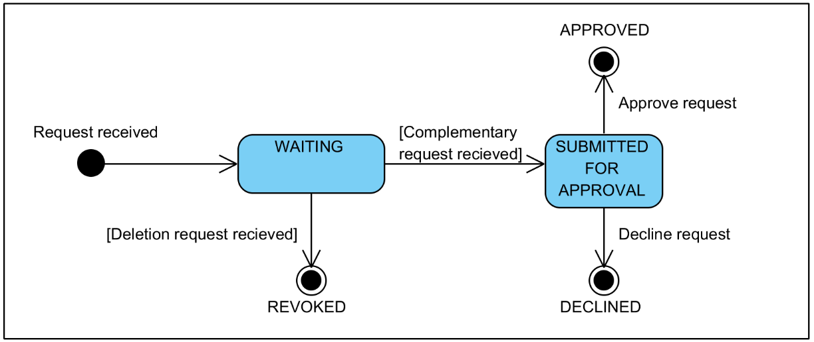

# X-Road: Central Server User Guide <!-- omit in toc --> 

Version: 2.16  
Doc. ID: UG-CS

## Version history <!-- omit in toc --> 

| Date       | Version     | Description                                                                  | Author             |
|------------|-------------|------------------------------------------------------------------------------|--------------------|
| 28.08.2014 | 0.1     | Initial version ||
| 28.09.2014 | 0.2     | Translation to English  ||
| 09.10.2014 | 0.3     | Minor updates and corrections. Security Categories removed. ||
| 09.10.2014 | 0.4     | Add service CA OCSP responder changed to Add top CA OCSP responder ||
| 14.10.2014 | 0.5     | Title page, header, footer modified ||
| 28.11.2014 | 0.6     | Logback information added (Chapter 17). Introduction added (Chapter 1). Security Officer user role added (Section 2.1). System Settings added (Chapter 4). Configuration Management added (Chapter 5). Database Management Chapter deleted. ||
| 1.12.2014  | 1.0     | Minor corrections  ||
| 23.01.2015 | 1.1     | License information. Certification services management and time stamping services management chapters updated (Chapters 11 and 12). ||
| 30.04.2015 | 1.2     | “sdsb” changed to “xroad” ||
| 30.06.2015 | 1.3     | Minor corrections done ||
| 3.07.2015  | 1.4     | Audit Log chapter added (Chapter 14) ||
| 31.08.2015 | 1.5     | Information about high availability added (Chapter 3) ||
| 15.09.2015 | 1.6     | Reference to the audit log events added         ||
| 17.09.2015 | 1.7     | Corrections related to high availability added ||
| 18.09.2015 | 1.8     | Minor corrections done ||
| 21.09.2015 | 1.9     | References fixed ||
| 22.10.2015 | 1.10    | Corrections in Chapter 17 ||
| 04.11.2015 | 1.11    | Updates related to backup and restore (Chapter 13) ||
| 30.11.2015 | 2.0     | Management service provider configuration updated (Section 4.2); management requests system updated (Chapter 6); key label added to configuration signing key generation (Section 5.4.1); section about adding a subsystem to an X-Road member added (Section 7.3); only subsystems can be registered as security server clients or be members of global groups; certification service settings updated (11.1). Editorial changes made. ||
| 17.12.2015 | 2.1     | Added user instructions for monitoring. ||
| 14.4.2016  | 2.2     | Added chapter for additional configuration options. ||
| 5.9.2016   | 2.3     | Added instructions for configuring OCSP fetch interval. ||
| 20.01.2017 | 2.4     | Added license text and version history | Sami Kallio |
| 05.03.2018 | 2.5     | Added terms and abbreviations reference and document links | Tatu Repo |
| 18.08.2018 | 2.6     | Corrected `ocspFetchInterval` default value (Chapter 16.2) | Petteri Kivimäki |
| 15.11.2018 | 2.7     | Minor corrections for Ubuntu 18 | Jarkko Hyöty |
| 23.01.2019 | 2.8     | Information about automatic approval of auth cert registration requests added. Updates in Chapters 6-8. | Petteri Kivimäki |
| 06.02.2019 | 2.9     | Information about automatic approval of security server client registration requests added. Updates in Chapters 6-8. | Petteri Kivimäki |
| 02.07.2019 | 2.10    | Security Server owner change added (Chapter 7.10) | Petteri Kivimäki |
| 14.08.2019 | 2.11    | Added automatic backups | Ilkka Seppälä |
| 11.09.2019 | 2.12    | Remove Ubuntu 14.04 support | Jarkko Hyöty |
| 26.11.2019 | 2.13    | Update Chapter 3 with remote database support possiblity | Ilkka Seppälä |
| 03.12.2019 | 2.14    | Remove HA setup dependency on BDR | Jarkko Hyöty |
| 13.03.2020 | 2.15    | Add instructions for migrating to remote database | Ilkka Seppälä |
| 30.03.2020 | 2.16    | Added description of pre-restore backups | Ilkka Seppälä |

## Table of Contents <!-- omit in toc --> 
<!-- toc -->

  * [License](#license)
- [1. Introduction](#1-introduction)
  - [1.1 Target Audience](#11-target-audience)
  - [1.2 Terms and abbreviations](#12-terms-and-abbreviations)
  - [1.3 References](#13-references)
- [2. User Management](#2-user-management)
  - [2.1 User Roles](#21-user-roles)
  - [2.2 Managing the Users](#22-managing-the-users)
- [3. Standalone and High-Availability Systems](#3-standalone-and-high-availability-systems)
  - [3.1 Detecting the Type of Deployment in the User Interface](#31-detecting-the-type-of-deployment-in-the-user-interface)
  - [3.2 Checking the Status of the Nodes of the Cluster](#32-checking-the-status-of-the-nodes-of-the-cluster)
- [4. System Settings](#4-system-settings)
  - [4.1 Managing the Member Classes](#41-managing-the-member-classes)
  - [4.2 Configuring the Management Service Provider](#42-configuring-the-management-service-provider)
    - [4.2.1 Appointing the Management Service Provider](#421-appointing-the-management-service-provider)
    - [4.2.2 Registering the Management Service Provider as a Security Server Client](#422-registering-the-management-service-provider-as-a-security-server-client)
    - [4.2.3 Configuring the Management Services in the Management Services’ Security Server](#423-configuring-the-management-services-in-the-management-services-security-server)
  - [4.3 Configuring the Central Server Address](#43-configuring-the-central-server-address)
    - [4.3.1 Notes on HA Setup](#431-notes-on-ha-setup)
    - [4.3.2 Changing the Central Server Address](#432-changing-the-central-server-address)
- [5. Configuration Management](#5-configuration-management)
  - [5.1 Viewing the Configuration Settings](#51-viewing-the-configuration-settings)
  - [5.2 Downloading the Configuration Anchor](#52-downloading-the-configuration-anchor)
  - [5.3 Re-Creating the Configuration Anchor](#53-re-creating-the-configuration-anchor)
  - [5.4 Changing the Configuration Signing Keys](#54-changing-the-configuration-signing-keys)
    - [5.4.1 Generating a Configuration Signing Key](#541-generating-a-configuration-signing-key)
    - [5.4.2 Activating a Configuration Signing Key](#542-activating-a-configuration-signing-key)
    - [5.4.3 Deleting a Configuration Signing Key](#543-deleting-a-configuration-signing-key)
  - [5.5 Viewing the Contents of a Configuration Part](#55-viewing-the-contents-of-a-configuration-part)
  - [5.6 Uploading a Trusted Anchor](#56-uploading-a-trusted-anchor)
  - [5.7 Viewing the Contents of a Trusted Anchor](#57-viewing-the-contents-of-a-trusted-anchor)
  - [5.8 Deleting a Trusted Anchor](#58-deleting-a-trusted-anchor)
- [6. The Management Requests System](#6-the-management-requests-system)
  - [6.1 Registration Requests](#61-registration-requests)
    - [6.1.1 State Machine Model for Registration Requests](#611-state-machine-model-for-registration-requests)
  - [6.2 Deletion Requests](#62-deletion-requests)
  - [6.3 Viewing the Management Request Details](#63-viewing-the-management-request-details)
- [7 Managing the X-Road Members](#7-managing-the-x-road-members)
  - [7.1 Adding a Member](#71-adding-a-member)
  - [7.2 Viewing the Member Details](#72-viewing-the-member-details)
  - [7.3 Adding a Subsystem to an X-Road Member](#73-adding-a-subsystem-to-an-x-road-member)
  - [7.4 Registering a Member's Security Server](#74-registering-a-members-security-server)
  - [7.5 Registering a Client to a Security Server](#75-registering-a-client-to-a-security-server)
  - [7.6 Removing a Client from a Security Server](#76-removing-a-client-from-a-security-server)
  - [7.7 Changing the Global Group Membership of an X-Road Member’s Subsystem](#77-changing-the-global-group-membership-of-an-x-road-members-subsystem)
  - [7.8 Deleting a Subsystem](#78-deleting-a-subsystem)
  - [7.9 Deleting an X-Road Member](#79-deleting-an-x-road-member)
  - [7.10 Changing a Security Server's Owner](#710-changing-a-security-servers-owner)
- [8. Managing the Security Servers](#8-managing-the-security-servers)
  - [8.1 Viewing the Security Server Details](#81-viewing-the-security-server-details)
  - [8.2 Changing the Security Server Address](#82-changing-the-security-server-address)
  - [8.3 Registering a Security Server's Authentication Certificate](#83-registering-a-security-servers-authentication-certificate)
  - [8.4 Deleting a Security Server's Authentication Certificate](#84-deleting-a-security-servers-authentication-certificate)
  - [8.5 Deleting a Security Server](#85-deleting-a-security-server)
- [9. Managing the Central Services](#9-managing-the-central-services)
  - [9.1 Adding a Central Service](#91-adding-a-central-service)
  - [9.2 Changing the Service implementing a Central Service](#92-changing-the-service-implementing-a-central-service)
  - [9.3 Deleting a Central Service](#93-deleting-a-central-service)
- [10. Managing the Global Groups](#10-managing-the-global-groups)
  - [10.1 Adding a Global Group](#101-adding-a-global-group)
  - [10.2 Viewing the Global Group Details](#102-viewing-the-global-group-details)
  - [10.3 Changing the Description of a Global Group](#103-changing-the-description-of-a-global-group)
  - [10.4 Changing the Members of a Global Group](#104-changing-the-members-of-a-global-group)
  - [10.5 Deleting a Global Group](#105-deleting-a-global-group)
- [11. Managing the Approved Certification Services](#11-managing-the-approved-certification-services)
  - [11.1 Adding an Approved Certification Service](#111-adding-an-approved-certification-service)
  - [11.2 Changing an Approved Certification Service](#112-changing-an-approved-certification-service)
  - [11.3 Deleting an Approved Certification Service](#113-deleting-an-approved-certification-service)
- [12. Managing the Approved Timestamping Services](#12-managing-the-approved-timestamping-services)
  - [12.1 Adding an Approved Timestamping Service](#121-adding-an-approved-timestamping-service)
  - [12.2 Changing the URL of an Approved Timestamping Service](#122-changing-the-url-of-an-approved-timestamping-service)
  - [12.3 Deleting an Approved Timestamping Service](#123-deleting-an-approved-timestamping-service)
- [13. Configuration Backup and Restore](#13-configuration-backup-and-restore)
  - [13.1 Backing Up the System Configuration](#131-backing-up-the-system-configuration)
  - [13.2 Restoring the System Configuration in the User Interface](#132-restoring-the-system-configuration-in-the-user-interface)
  - [13.3 Restoring the Configuration from the Command Line](#133-restoring-the-configuration-from-the-command-line)
  - [13.4 Downloading, Uploading and Deleting Configuration Backup Files](#134-downloading-uploading-and-deleting-configuration-backup-files)
  - [13.5 Automatic Backups](#135-automatic-backups)
- [14. Audit Log](#14-audit-log)
  - [14.1 Changing the Configuration of the Audit Log](#141-changing-the-configuration-of-the-audit-log)
  - [14.2 Archiving the Audit Log](#142-archiving-the-audit-log)
- [15. Monitoring](#15-monitoring)
- [16. Additional configuration options](#16-additional-configuration-options)
  - [16.1 Verify next update](#161-verify-next-update)
  - [16.2 OCSP fetch interval](#162-ocsp-fetch-interval)
- [17. Logs and System Services](#17-logs-and-system-services)
- [18. Migrating to Remote Database Host](#18-migrating-to-remote-database-host)

<!-- tocstop -->


## License

This document is licensed under the Creative Commons Attribution-ShareAlike 3.0 Unported License. To view a copy of this license, visit http://creativecommons.org/licenses/by-sa/3.0/.

# 1. Introduction

## 1.1 Target Audience

The intended audience of this User Guide are X-Road central server administrators who are responsible for everyday management of the X-Road central server.

Instructions for the installation and initial configuration of the central server can be found in the Central Server Installation Guide [CSI](#13-references). Instructions for installing the central server in a cluster for achieving high availability can be found in the Central Server High Availability Installation Guide [IG-CSHA](#13-references).

## 1.2 Terms and abbreviations

See X-Road terms and abbreviations documentation \[[TA-TERMS](#Ref_TERMS)\].

## 1.3 References

1. [CSI] Cybernetica AS. X-Road 6. Central Server Installation Guide. Document ID: [IG-CS](ig-cs_x-road_6_central_server_installation_guide.md)
2. [IG-CSHA] Cybernetica AS. X-Road 6. Central Server High Availability Installation Guide. Document ID: [IG-CSHA](ig-csha_x-road_6_ha_installation_guide.md)
3. [JSON] Introducing JSON, [http://json.org/](http://json.org/)
4. [SPEC-AL] Cybernetica AS. X-Road: Audit log events. Document ID: SPEC-AL
5. [SSI] Cybernetica AS. X-Road 6. Security Server Installation Guide. Document ID: [IG-SS](ig-ss_x-road_v6_security_server_installation_guide.md)
6. [IG-CS] Cybernetica AS. X-Road 6. Central Server Installation Guide. Document ID: [IG-CS](ig-cs_x-road_6_central_server_installation_guide.md)
7. [UC-GCONF] Cybernetica AS. X-Road 6: Use Case Model for Global Configuration Distribution. Document ID: [UC-GCONF](../UseCases/uc-gconf_x-road_use_case_model_for_global_configuration_distribution_1.4_Y-883-8.md)
8. [RFC-OCSP] Online Certificate Status Protocol – OCSP, [https://tools.ietf.org/html/rfc6960](https://tools.ietf.org/html/rfc6960)
9. <a id="Ref_TERMS" class="anchor"></a>\[TA-TERMS\] X-Road Terms and Abbreviations. Document ID: [TA-TERMS](../terms_x-road_docs.md).

# 2. User Management

## 2.1 User Roles

The central server supports the following user roles:

- Registration Officer (xroad-registration-officer) is responsible for handling the information about X-Road members.
- System Administrator (xroad-system-administrator) is responsible for the installation, configuration, and maintenance of the central server.
- Security Officer (xroad-security-officer) is responsible for the application of the security policy and security requirements.

One user can have multiple roles, and multiple users can fulfill the same role. Each role has a corresponding system group, created upon the installation of the system. The system user names are used for logging in to the user interface of the central server.

The document indicates in sections similar to the following example, which user role is required for performing a particular action in the user interface. For example

`Access rights: System Administrator`

Caution: If the logged-in user does not have a permission to carry out a task, the button that initiates the action is hidden (and neither is it possible to run the task using its corresponding keyboard combinations or mouse actions). Only the permitted information and actions are visible and available to the user.

## 2.2 Managing the Users

During the installation, a super user equipped with all the roles is created. You can create additional users that have restricted rights. User management is carried out in root user's permissions using the command line.

To add a new user, issue the command:

`adduser username`

To grant permissions to the user you created, add it to the corresponding system groups, for example:

`adduser username xroad-registration-officer`<br>
`adduser username xroad-system-administrator`<br>
`adduser username xroad-security-officer`

To remove a user’s permission, remove the user from the corresponding system group, for example:

`deluser username xroad-registration-officer`

To remove a user, enter:

`deluser username`

# 3. Standalone and High-Availability Systems

The central server can be installed and configured in several ways:
- A standalone server with local database
- A standalone server with remote database
- A cluster of central servers (nodes) using a remote database. The system continues to function if one or more of the central server nodes are experiencing problems or are down for maintenance. If the database is highly available (e.g using hot-standby with automatic fail-over or multi-master replication), the system can also recover from database problems with minimal downtime.

When the system is configured with the most basic option standalone server with local database, there is no high-availability support. If either the web server or the database server break, the system goes down.

In the case of an HA setup, the central servers share configuration via an optionally highly-available database. While most of the system settings described in this document apply to the whole cluster, some have a meaning that is local to each node. In addition, all the configuration signing keys are local to each node and must be generated separately. This distinction will be stated explicitly throughout this document, where necessary.

In an HA setup, if the system is configured using different nodes in parallel, the effect will be similar to several people updating the configuration of a standalone server at the same time.

## 3.1 Detecting the Type of Deployment in the User Interface

In order to detect the type of deployment and the name of the node in the cluster in the case of HA setup, the logged-in user should check the instance identifier displayed in the left upper corner of the user interface. In the case of an HA setup, the name of the node is displayed to the right of the instance identifier in parentheses.

## 3.2 Checking the Status of the Nodes of the Cluster

In order to check the status of the nodes in an HA setup, the following script can be used on the command line:

`/usr/share/xroad/scripts/check_ha_cluster_status.py`

# 4. System Settings
## 4.1 Managing the Member Classes

Access rights: Security Officer

To add a member class, follow these steps.

1. On the Management menu, select System Settings.
2. Locate the Member Classes section and click Add.
3. In the window that opens, enter the member class code and description. Click OK.

To edit the description of a member class, follow these steps.

1. On the Management menu, select System Settings.
2. Locate the Member Classes section, select a member class and click Edit.
3. In the window that opens, enter the member class description and click OK.

To delete a member class, follow these steps.

1. On the Management menu, select System Settings.
2. Locate the Member Classes section, select a member class and click Delete.

Only the member classes that are used by none of the X-Road members can be deleted.

## 4.2 Configuring the Management Service Provider

The central server provides management services to the security servers that are part of the (local) X-Road infrastructure (see Chapter 6).

A subsystem of an X-Road member acting as a service provider for the management services must be appointed in the central server (see 4.2.1), registered as a client of the management services’ security server (see 4.2.2) and configured to provide the services in the management services’ security server (see 4.2.3).

The management services’ security server must be installed and registered in the central server before the management service provider can be registered as a client of the security server and the management services can be configured (see [SSI](#13-references)).

### 4.2.1 Appointing the Management Service Provider

Access rights: Security Officer

To appoint the management service provider in the central server, follow these steps.

1. On the Management menu, select System Settings.
2. Locate the Management Services section and click Edit.
3. In the window that opens, find the subsystem of an X-Road member to be appointed as the management service provider and click OK.

### 4.2.2 Registering the Management Service Provider as a Security Server Client

The management service provider can be registered as a security server client as described in this section only if the management service provider is not registered as a client of any security servers. In case the management service provider is already a client of a security server then the identifier of the security server is displayed instead of the Register button.

To register the appointed management service provider as a security server client to the management services’ security server, follow these steps.

1. On the Management menu, select System Settings.
2. Locate the Management Services section and click Register.
3. Locate the "Security Server Information" section on the registration request form, click Search and select the security server that will be used as the management services’ security server.
4. Click Submit to submit the registration request.

On successful registration the identifier of the management services’ security server is displayed instead of the Register button.

### 4.2.3 Configuring the Management Services in the Management Services’ Security Server

Access rights: Security server’s Service Administrator

The data necessary for configuring the management services in the security server can be found at the central server Management -> System Settings -> Management Services section.

To configure management services in the management services’ security server, follow these steps.

1. On the Configuration menu of the security server, select Security Server Clients, select the client who will provide the management services and click the Services icon on that row.
2. Click Add WSDL, enter the management services WSDL address in the window that opens and click OK.
3. Expand the WSDL, by clicking the + icon, select a service and click Edit.
4. In the window that opens, enter the management services address. If necessary, edit other service parameters. Check the Apply to All in WSDL checkbox and click OK. Ensure that the parameters of all the management services have changed.
5. Activate the management service’s WSDL by selecting the row of the WSDL and clicking Enable.
6. Navigate to the Service Clients tab.
7. Click Add and search for the global group security-server-owners. Select the group and click Next.
8. In the window that opens, click Add All to ACL to add all management services (authCertDeletion, clientDeletion, clientReg) to the security-server-owners group’s access rights list.

## 4.3 Configuring the Central Server Address

Access rights: Security Officer

In the System Settings view, the central server's public DNS name or its external IP address is displayed. This address is used by the security servers to access the services provided by the central server (configuration download, management services).

**ATTENTION!** When the central server address is changed,

- the management services address in the management services’ security server needs to be reconfigured,
- the internal configuration anchor need to be redistributed to the security server administrators and
- the external configuration anchor needs to be redistributed to the federation partners.

The services provided by the central server must be available from both the new and old address, until all servers using the services have uploaded the configuration anchor containing the new address.

### 4.3.1 Notes on HA Setup

In an HA setup, the address of the central server is local to the node that is being configured.

In an HA setup, internal and external configuration anchors contain information about each central server that is part of the cluster. If the address of one of the servers is changed, configuration anchors will be re-generated automatically on all the nodes.

### 4.3.2 Changing the Central Server Address

To change the central server address, follow these steps.

1. In the Management menu, select System Settings.
2. Locate the System Parameters section and click Edit.
3. Enter the central server’s address and click OK. When the address is changed, the system:
  - changes the management services WSDL address,
  - changes the management services address,
  - changes the configuration source addresses,
  - generates new configuration anchors for the internal and external configuration sources.
4. After the central server address is changed, act as follows.
  - Download the internal configuration source anchor and distribute the anchor along with the anchor’s hash value to the security server administrators of the local X-Road infrastructure.
  - In case of federated X-Road systems, download the external configuration source anchor and distribute the anchor along with the anchor’s hash value to the federation partners.
  - Reconfigure the management services addresses in the management service security server.

# 5. Configuration Management

## 5.1 Viewing the Configuration Settings

Access rights: Security Officer, System Administrator

- The configuration management view consists of three sections.
The Internal Configuration View. The internal configuration is distributed by the central server to the security servers of the local X-Road infrastructure. The information needed to download and verify the internal configuration is included in the internal configuration anchor, which must be distributed to the security server administrators and uploaded to the security servers. Along with the internal configuration anchor, the anchor file hash value must be distributed. The hash value is used by the security server administrators to verify the integrity of the anchor file.
- The External Configuration View. The external configuration is distributed by the central server to the federation partners (either to the security servers directly or through a configuration proxy). The information needed to download and verify the external configuration is included in the external configuration anchor, which must be distributed to the federation partner’s central server (or configuration proxy) administrators and uploaded to the central server (or configuration proxy). Along with the external configuration anchor, the anchor file hash value must be distributed. The hash value is used by the federation partners to verify the integrity of the anchor file.
- The Trusted Anchors View. A trusted anchor is the configuration anchor of the configuration source(s) distributing the external configuration of a federation partner. Upon loading the trusted anchor into the central server, the anchor is included into the internal configuration, allowing the security servers to download the external configuration of a federation partner as well as the internal configuration of the local X-Road infrastructure.

## 5.2 Downloading the Configuration Anchor

Access rights: Security Officer

To download a configuration anchor, follow these steps.

1. On the Management menu, select Configuration Management and select either the Internal Configuration or External Configuration view, as appropriate.
2. In the Anchor section, click Download and save the prompted file.

## 5.3 Re-Creating the Configuration Anchor

Access rights: Security Officer

Normally, the configuration anchors are generated (and in an HA setup, distributed to every node) automatically by the system upon changes in the data included in the anchor (one or more central server addresses, signing keys). The re-creation of an anchor is necessary only for recovering from error situations.

To re-create an anchor, follow these steps.

1. On the Management menu, select Configuration Management and select either the Internal Configuration or External Configuration view, as appropriate.
2. In the Anchor section, click Re-Create.

## 5.4 Changing the Configuration Signing Keys

Access rights: Security Officer

Key change can be either
- regular change – the key is changed periodically (for example, annually) to minimize the risk of exposure;
- emergency change – the key and all its back-ups have been destroyed or the key has been exposed.

As the key change must be carried out efficiently without disrupting the operation of X-Road, the procedure is completed in two stages, wherein the old key and the new key can exist in parallel.

Note that in an HA setup, each node has its own set of configuration signing keys. The old and new key can exist in parallel on each node. Regular key change should cover all the nodes in a cluster and the new configuration anchor should be distributed after the keys have been changed on each node.

The steps of key change are as follows:

- First, a new key is generated (on each node in HA setups) and the configuration anchor containing the public key part(s) of the key(s) is distributed to X-Road participants. Until all participants have received the public key(s), the old (i.e. current) key(s) is/are used for signing configuration.
- Then, after all participants have received and uploaded the new public key(s), the old key(s) is/are removed and the new key(s) is/are used to sign configuration.

To perform a regular key change, follow these steps.

1. Generate, but do not activate a new configuration signing key (see 5.4.1) (in an HA setup, for each node). The system uses the old (active) key(s) to sign the configuration. Upon the generation of a new key, the system generates a new anchor for the corresponding configuration sources.
2. Download the anchor (see 5.2) containing the public key part(s) of the new signing key(s) and distribute the anchor along with the anchor file hash value either to the security server administrators (in case of internal configuration anchor) or to the federation partners (in case of external configuration anchor).
3. Activate the new signing key(s) (see 5.4.2).
The new signing key(s) should only be activated after all the affected server administrators have received and uploaded the distributed anchor. The central servers use the active key to sign configuration. If a server administrator has not uploaded the configuration anchor containing the public key part of the new key before the new key is activated, the verification of the downloaded configuration in the security servers will fail and the services exchange with the X-Road participants described in the configuration will be discontinued.
4. Delete the old signing key (in an HA setup, delete the old keys on all the nodes) (see 5.4.3). Upon the deletion of a key, the system generates a new configuration anchor.
5. Download the generated anchor (it does not contain the public key part(s) of the old signing key(s)) and distribute the anchor along with the anchor file hash value either to the security server administrators (in case of internal configuration anchor) or to the federation partners (in case of external configuration anchor).

To perform an emergency key change, the new key must be activated and the old key deleted immediately after the generation of the new key (in the steps described above, step 2 is skipped). The configuration anchor distributed to the security server administrators (in case of internal configuration anchor) or to the federation partners (in case of external configuration anchor) must only contain the public key part of the new signing key.

### 5.4.1 Generating a Configuration Signing Key

Access rights: Security Officer

To generate a configuration signing key, follow these steps.

1. On the Management menu, select Configuration Management and select either the Internal Configuration or External Configuration view, as appropriate.
2. In the Signing Keys section, click New Key.
3. In a window that opens, select a key device, insert a label for the key, and click OK.
4. If needed, enter the key device’s PIN (PIN is asked, when the device has not been logged in to).

The system will automatically generate the corresponding configuration anchor containing the public key part of the generated key.
If the generated key is the only signing key for the configuration source, the key will automatically be set as active (the active key is displayed in bold font style).

### 5.4.2 Activating a Configuration Signing Key

Access rights: Security Officer

To activate a configuration signing key, follow these steps.

1. On the Management menu, select Configuration Management and select either the Internal Configuration or External Configuration view, as appropriate.
2. In the Signing Keys section, select an inactive key (the active key is displayed in bold font style) and click Activate.

### 5.4.3 Deleting a Configuration Signing Key

Access rights: Security Officer

To delete a configuration signing key, follow these steps.

1. On the Management menu, select Configuration Management and select either the Internal Configuration or External Configuration view, as appropriate.
2. In the Signing Keys section, select an inactive key (the active key is displayed in bold font style) and click Delete.
3. Confirm the deletion by clicking Confirm.

## 5.5 Viewing the Contents of a Configuration Part

Access rights: Security Officer, System Administrator

The contents of a configuration part can be viewed by downloading the configuration part file.

1. On the Management menu, select Configuration Management and select either the Internal Configuration or External Configuration view, as appropriate.
2. In the Configuration Parts section, select a configuration part and click Download.
3. Save or open the prompted file.

## 5.6 Uploading a Trusted Anchor

Access rights: Security Officer

To upload a trusted anchor, follow these steps.

1. On the Management menu, select Configuration Management and select the Trusted Anchors view.
2. Click Upload Anchor, find the external configuration anchor received from a federation partner and click Upload.
3. Verify the integrity of the anchor file by comparing the displayed anchor file hash value with the hash value provided by the federation partner and confirm the anchor upload by clicking Confirm.

In case a previous anchor from the same federation partner has been uploaded to the system, the new anchor will replace the old one.

## 5.7 Viewing the Contents of a Trusted Anchor

Access rights: Security Officer, System Administrator

The contents of a trusted anchor can be viewed by downloading the anchor file.
To download an anchor file, follow these steps.

1. On the Management menu, select Configuration Management and select the Trusted Anchors view.
2. In the anchor section, click Download.
3. Save or open the prompted file.

## 5.8 Deleting a Trusted Anchor

Access rights: Security Officer

To delete an anchor file, follow these steps.
1. On the Management menu, select Configuration Management and select the Trusted Anchors view.
2. In the anchor section, click Delete.
3. Confirm the deletion by clicking Confirm.

# 6. The Management Requests System
## 6.1 Registration Requests

As the registration of associations in the X-Road governing authority is security-critical, the following measures are applied to increase security by default:

- The registration request must be submitted to the X-Road governing authority over two channels, or in other words, the registration wish must be expressed through two complementary requests:
one request is submitted to the X-Road central server through the security server,
the other request is submitted to the X-Road governing authority through means independent of the X-Road (for example, over a digitally signed e-mail). This request must be formalized in the central server by the central server administrator. 
  - Security server owner change request is an exception - it is enough to submit one request through security server and the complementary request is generated automatically. Manual approval is still required by default.
- The association must be approved by the X-Road governing authority.

There are three types of registration requests:

- authentication certificate registration request (see Sections 7.4 and 8.3);
- security server client registration request (see Section 7.5);
- security server owner change request (see Section 7.10)

It is possible to streamline the registration process of authentication certificates and security server clients by enabling automatic approval.
 
- authentication certificate registration requests
  - When automatic approval is enabled, it is enough to submit an authentication certificate registration request to the X-Road central server through the security server, and the request will be automatically approved immediately.
  - Automatic approval is applied to existing members only.
  - By default, automatic approval of authentication certificate registration requests is disabled. It can be enabled by setting the `auto-approve-auth-cert-reg-requests` property value to `true` on central server.
- security server client registration requests
  - When automatic approval is enabled, it is enough to submit a security server client registration request to the X-Road central server through the security server, and the request will be automatically approved immediately.
  - Automatic approval is applied to existing members only. In addition, automatic approval is applied only if the client registration request has been signed by the member owning the subsystem to be registered as a security server client.
  - By default, automatic approval of security server client registration requests is disabled. It can be enabled by setting the `auto-approve-client-reg-requests` property value to `true` on central server.
- security server owner change requests
    - When automatic approval is enabled, it is enough to submit a security server owner change request to the X-Road central server through the security server, and the request will be automatically approved immediately.
    - Automatic approval is applied to existing members only.
    - By default, automatic approval of security server owner change requests is disabled. It can be enabled by setting the `auto-approve-owner-change-requests` property value to `true` on central server.
    
### 6.1.1 State Machine Model for Registration Requests

A registration request can be in one of the following states. See Figure 1 for the state machine diagram.



Figure 1. State machine diagram for registration requests

Waiting – a registration request has been submitted either from a security server or formalized in the central server, but the complementary request has not been submitted. From this state, the request can move to the following states.
- “Submitted for approval”, if the complementary request is received (see 7.4, 7.5 and 8.3).
- “Revoked”.
  - Registration request received from a security server are automatically revoked by deletion requests sent from the security server for the same object that was submitted for registration with the registration request.
  - Registration request formalized in the central server can be revoked by the central server administrator in the central server (see 7.4, 7.5 and 8.3). A deletion request for the same object that was submitted for registration with the registration request is created upon revocation.

Submitted for approval – both complementary requests have been submitted to the central server, but the association between the objects of the registration request has not been approved. From this state, the request can move to the following states.
- “Approved”, if the registration request is approved in the central server (see 7.4, 7.5 and 8.3).
- “Declined”, if the registration request is declined in the central server (see 7.4, 7.5 and 8.3).

Approved – the complementary registration requests have been approved. The association between the objects of the registration request has been created.

Declined – the complementary registration requests have been declined.

Revoked – a registration request has been revoked.

If automatic approval of authentication certificate registration requests and/or security server client registration requests is enabled, the complimentary registration request is created and approved automatically. Therefore, the request moves directly to Approved state.

## 6.2 Deletion Requests

Complementary requests are not needed for association deletion requests. Associations are deleted on the basis of a single request, which is either submitted through a security server or formalized in the central server.

Deletion requests are
- authentication certificate deletion request (see Section 8.4);
- security server client deletion request (see Section 7.6).

## 6.3 Viewing the Management Request Details

Access rights: Registration Officer

To open the detail view, follow these steps.
1. On the main menu, select Management and then Management Requests.
2. Select from the table a request and either double-click it or click Details.

There are three data sections in the view.

1. Information about the request.
  - Request ID – the identifier of the request;
  - Received – the date and time of saving the request in the central server;
  - Source – the source of the request. The request can be either submitted through a security server (SECURITY_SERVER) or created in the central server (CENTER);
  - Status (only for registration requests) – the state of the request, see Figure 1;
  - Complementary/Revoking request ID (only for registration requests) – the identifier of the request that caused the status change of this request from "Waiting" to "Submitted for approval" or from "Waiting" to "Revoked";
  - Comments – the source event for the automatic generation of the request. For example, when a security server is deleted from the central server, deletion requests are automatically generated for all the clients and authentication certificates registered for this security server. In the "Comments" field of the generated requests, a comment with the server identifier is added in such case. This field is left empty for requests that are not automatically generated by the central server.
2. Information about the security server associated with the request.
  - Owner Name – the name of the security server owner (X-Road member);
  - Owner Class – the member class of the security server owner;
  - Owner Code – the member code of the security server owner;
  - Server Code – the code of the security server;
  - Address – the address of the security server. The field is filled only for authentication certificate registration requests submitted through a security server, and only if the security server's administration deemed it necessary to provide an address upon request submission.
3. Information about the request object – that is, the client or the authentication certificate being registered or deleted.

  For the authentication certificate:
  - CA – the name of the certification authority that issued the certificate;
  - Serial Number – the serial number of the certificate;
  - Subject – all attributes of the certificate's Subject field;
  - Expires – the expiration date of the certificate;

  For the security server client:

  - Name – the name of the X-Road member managing the subsystem;
  - Class – the member class of the X-Road member managing the subsystem;
  - Code – the member code of the X-Road member managing the subsystem;
  - Subsystem – the code of the subsystem.

# 7 Managing the X-Road Members
## 7.1 Adding a Member

Access rights: Registration Officer

To add a new X-Road member, follow these steps.
1. On the Configuration menu, select Members and click Add.
2. In the window that opens, enter the member's information and click OK. The new member appears in the list of members.

## 7.2 Viewing the Member Details

Access rights: Registration Officer

To open the detail view, follow these steps.
1. On the Configuration menu, select Members.
2. Select from the table an X-Road member and either double-click it or click Details.

The view consists of six sections.
1. "Member Details" – displays the member's class, code, and name.
2. "Owned Servers" – displays the codes of servers owned by this member.  
Hint: Click a server's code to open the server's detail view.
3. "Global Group Membership" – displays information about the group membership of the member or its subsystems.
Hint: Click a group's code to open the group's detail view.
4. "Subsystems" – displays the member's subsystem codes, as well as the code of the security server the subsystem is a client of. If a subsystem is not a client of any security servers, it is displayed in red.
Hint: Click the related security server's code to open the security server's detail view.
5. "Used Servers" – displays information about security servers that provide hosting service to the member’s subsystems. The following information is displayed: the code of the security server hosting the subsystem, the code of the subsystem that is being hosted and the name of the security server owner.
Hint: Click the security server's code to open the server's detail view. Click the owner's name to open the owner's detail view.
6. "Management Requests" – displays all management requests related to the member and the security servers in the member's ownership.
Hint: Click a request ID to open the request's detail view.

## 7.3 Adding a Subsystem to an X-Road Member

Access rights: Registration Officer

To add a subsystem to an X-Road member, follow these steps.
1. On the Configuration menu, select Members, select the member to whom you wish to add a subsystem and click Details.
2. In the view that opens, locate the Subsystems section and click Add.
3. Enter the code of the subsystem and click OK.

## 7.4 Registering a Member's Security Server

Access rights: Registration Officer

The actions required to register an X-Road member's security server depend on whether automatic approval of authentication certificate registration requests is enabled or disabled (_default_).

When automatic approval of authentication certificate registration requests is enabled, the following action must be taken:
- An authentication certificate registration request must be sent from the security server to the central server by the security server administrator.

Automatic approval of authentication certificate registration requests is disabled by default. In that case, to register an X-Road member's security server, the following actions must be taken.
- An authentication certificate registration request must be sent from the security server to the central server by the security server administrator;
- The complementary authentication certificate registration request must be formalized in the central server by the central server administrator, on the appeal of the security server's owner.
- The complimentary requests must be approved by the central server administrator.

To formalize the central server-side request to register a security server, follow these steps.
1. On the Configuration menu, select Members, select a member whose security server you wish to register and click Details.
2. In the window that opens, select the Owned Servers section and click Add.
3. Enter the code of the security server being registered on the registration form.
4. Click Upload and locate the authentication certificate file of the security server.
5. Click Submit to submit the registration request.

If the request is successfully submitted, a corresponding record appears in the member's detail view in the "Management Requests" section (Request Type "Certificate registration"), and in the list of management requests (on the main menu select Management and then Management Requests).

The central server-side request is in "Waiting" state if the request submitted through the security server has not arrived in the central server by the time the central server-side request is submitted.

The complementary requests are in "Submitted for approval" state if the request submitted through the security server has arrived in the central server by the time the central server-side request is submitted.

Registration requests in the state "Submitted for approval" can be approved or rejected by the central server administrator.

To approve a request
open one of its complementary requests in detail view and click Approve.
On the approval of the request
- the complementary requests move to the "Approved" state;
- the registered security server appears both in the "Owned Servers" section of its owner’s detail view and in the list of security servers (on the main menu, select Configuration and then Security Servers);
- the security server's owner is added to the global "security-server-owners" group.

To decline a request
- open one of the complementary requests in detail view and click Decline. Upon declining a request, both complementary requests move to the "Declined" state.

The registration requests formalized in the central server that are in the "Waiting" state can be revoked (e.g., if the request was submitted erroneously).

To revoke a request, follow these steps.
1. Open a registration request in the "Waiting" state. You can either:
  - Locate the request in the list of management requests: on the main menu, click Management, click Management Requests and then click Details;
  - Locate the request from the detail view section Management Requests of the object associated with the request (security server or security server's owner).
2. Click Revoke. Upon revoking a request, a deletion request corresponding to the registration request is automatically generated and the registration request is moved to the "Revoked" state.

## 7.5 Registering a Client to a Security Server

Access rights: Registration Officer

The actions required to register a subsystem of an X-Road member as a security server client depend on whether automatic approval of security server client registration requests is enabled or disabled (_default_).

When automatic approval of security server client registration requests is enabled, the following action must be taken:
- A security server client registration request must be sent from the security server to the central server by the security server administrator.

Automatic approval of security server client registration requests is disabled by default. In that case, to register a subsystem of an X-Road member as a security server client, the following actions must be taken.
- A security server client registration request must be sent from the security server to the central server by the security server administrator;
- The complementary security server client registration request must be formalized in the central server by the central server administrator, on the appeal of the security server's owner.
- The complimentary requests must be approved by the central server administrator.

The central server-side client registration request can be formalized either through the security server's detail view or a member's detail view.

To formalize the request through the member's detail view, follow these steps.
1. On the Configuration menu, select Members, select the member that wishes to register its subsystem as a security server client from the list and click Details.
2. In the window that opens, open the Used Servers section and click Add.
3. On the registration request form that opens, do the following:
enter the code of the subsystem in the "Client Information" section on the Subsystem field;
locate the "Security Server Information" section, click Search and in the window that opens, select the appropriate security server.
4. Click Submit to submit the registration request.

To formalize the request through the security server's detailed view, follow these steps.
1. On the Configuration menu, select Security servers, select from the list a security server where a new client wishes to register and click Details.
2. In the window that opens, locate the Clients section and click Add.
3. On the registration request form, locate the "Client Information" section, click Search and in the window that opens, select the registrant's information, or enter the information manually.
4. Click Submit to submit the registration request.

If the request is successfully submitted, a corresponding record appears in the member's detail view in the "Management Requests" section (Request Type "Client registration"), and in the list of management requests (on the main menu select Management and then Management Requests).

The central server-side request is in "Waiting" state if the request submitted through the security server has not arrived in the central server by the time the central server-side request is submitted.

The complementary requests are in "Submitted for approval" state if the request submitted through the security server has arrived in the central server by the time the central server-side request is submitted.

Registration requests in the state "Submitted for approval" can be approved or rejected by the central server administrator.

To approve a request
- open one of its complementary requests in detail view and click Approve.

On the approval of the request, follow these steps.
- The complementary requests move to the "Approved" state.
- Information about the security server is displayed in the "Used Servers" section of the detail view of the member whose subsystem was registered as client.
- The client's information is displayed in the "Clients" section of the detailed view of the security server to which the client was registered.

To decline a request
- open one of the complementary requests in detail view and click Decline. Upon declining a request, its complementary requests move to the "Declined" state.

The registration requests formalized in the central server that are in the "Waiting" state can be revoked (e.g., if the request was submitted erroneously).

To revoke a request, follow these steps.
1. Open a registration request in the "Waiting" state. You can either:
  - locate the request in the list of management requests: on the main menu, click Management, click Management Requests and then click Details;
  - locate the request from the “Management Requests” section of the detail view of the object associated with the request (security server or security server's owner), and click the request ID.
2. Click Revoke. Upon revoking a request, a deletion request corresponding to the registration request is automatically generated and the registration request is moved to the "Revoked" state.

## 7.6 Removing a Client from a Security Server

Access rights: Registration Officer

The association between an X-Road member and a security server is deleted by the corresponding security server's client deletion request. The request can be submitted through the security server or in the central server.

The association between the security server's owner and the security server cannot be deleted.

Removing a client from the security server clients can be carried out either through the security server's detail view or a member's detail view.

To submit a security server client deletion request through a member's detail view, follow these steps.
1. On the Configuration menu, select Members, select the member whose subsystem is to be removed from a security server and click Details.
2. In the window that opens, locate the Used Servers section, select the association between the client subsystem and the security server, and click Delete.
3. Review the information displayed on the client deletion request and click Submit to submit the request.
4. The submitted request appears in the "Management Requests" section of the member's detail view and in the requests management view (on the main menu, select Management and then Management Requests).

To submit a security server client deletion request through security server's detail view, follow these steps.
1. On the Configuration menu, select Security Servers, select a security server from where the client is to be removed and click Details.
2. In the window that opens, locate the Clients section, select the client subsystem and click Delete.
3. Review the information displayed on the client deletion request and click Submit to submit the request.
4. The submitted request appears in the "Management Requests" section of the security server's detail view and in the requests management view (on the main menu, select Management and then Management Requests).

## 7.7 Changing the Global Group Membership of an X-Road Member’s Subsystem

Access rights: Registration Officer

To change the group membership of X-Road members’ subsystems, two options are provided:
- member-based – use it if you need to change a specific X-Road member's subsystem's group membership. The procedure is described in this section;
- group-based – use it if you need to change the membership of a specific group. The procedure is described in section 10.4

To add a member’s subsystem to a global group, follow these steps.
1. On the Configuration menu, select Members, select a member whose subsystem you wish to add to a global group and click Details.
2. In the view that opens, locate the Global Group Membership section and click Add.
3. Select the subsystem from the Subsystem drop-down. On the Group drop-down, select the group where the member’s subsystem should be added to.
4. Click OK.

To remove a member’s subsystem from a global group, follow these steps.
1. On the Configuration menu, select Members, select a member whose subsystem you wish to remove from a global group and click Details.
2. In the view that opens, locate the Global Group Membership section.
3. Select the row containing the association between the subsystem and the global group and click Delete to remove the subsystem from the selected group.
4. In the confirmation window that opens, click Confirm.

## 7.8 Deleting a Subsystem

Access rights: Registration Officer

In the central server, the X-Road member's subsystem can be deleted only if the subsystem is not associated with any security servers, that is, not registered as a client of any security servers. If the subsystem is not associated with any security servers, its code is displayed in red.

To delete an X-Road member's subsystem, follow these steps.
1. On the Configuration menu, select Members, select a member whose subsystem you wish to delete and click Details.
2. In the view that opens, find from the Subsystems section the subsystem you wish to delete and click Delete. Note: The "Delete" button is enabled only if the subsystem is not a client of any security servers.

## 7.9 Deleting an X-Road Member

Access rights: Registration Officer

When an X-Road member is deleted, information about all security servers in its ownership will be deleted as well.

To delete an X-Road member, follow these steps.
1. On the Configuration menu, select Members, select a member that you wish to delete, and click Details.
2. In the view that opens, locate the Member Details section and click Delete. In the confirmation window that opens, click Confirm.

## 7.10 Changing a Security Server's Owner

Access rights: Registration Officer

The actions required to change a security server's owner depend on whether automatic approval of security server owner change requests is enabled or disabled (_default_).

When automatic approval of security server owner change requests is enabled, the following action must be taken:
- A security server owner chang request must be sent from the security server to the central server by the security server administrator.

Automatic approval of security server owner change requests is disabled by default. In that case, to change the owner of a security server, the following actions must be taken.
- A security server owner change request must be sent from the security server to the central server by the security server administrator;
- The complementary security server owner change request is formalized in the central server automatically;
- The complimentary requests must be approved by the central server administrator, on the appeal of the security server's owner.

Registration requests in the state "Submitted for approval" can be approved or rejected by the central server administrator.

- To approve a request open one of its complementary requests in detail view and click Approve. On the approval of the request, the complementary requests move to the "Approved" state. 
- To decline a request, open one of the complementary requests in detail view and click Decline. Upon declining a request, its complementary requests move to the "Declined" state.

# 8. Managing the Security Servers
## 8.1 Viewing the Security Server Details

Access rights: Registration Officer

To open the detail view, follow these steps.
1. On the main menu, select Configuration and then select Security Servers.
2. Choose from the table a security server and either double-click it or click Details.

The view contains four sections.
- "Security Server Details" – information about the server and its owner.
- "Clients" – information about clients registered for this security server.
Hint: Click a client's code to open the client's detail view.
- "Authentication Certificates" – information about the security server's registered authentication certificates.
Hint: Click a certificate's serial number to open the certificate's detail view.
- "Management Requests" – a list of all management requests associated with the security server.
Hint: Click a request ID to open the request's detail view.

## 8.2 Changing the Security Server Address

Access rights: Registration Officer

By default, the security server's address is provided in the registration request of the authentication certificate sent from the security server. The address must be changed if it was not set when the request was submitted or if it is no longer valid.

There are several reasons why setting the security server’s address matters.
- The services that are relayed through a security server become available once the security server’s address is set.
- By registering the addresses of security servers, the service clients are certain to receive a response to their queries in a reasonable time, even if the relaying security server is overloaded with service requests (e.g., the requests from addresses belonging to registered security servers are served before requests coming from unknown addresses).

To change the security server address, follow these steps.
1. On the Configuration menu, select Security Servers, select the security server whose address you wish to change and click Details.
2. In the view that opens, locate the "Security Server Details" section and click Edit adjacent to the "Address" field.
3. Enter the security server's address and click OK.

## 8.3 Registering a Security Server's Authentication Certificate

Access rights: Registration Officer

The actions required to register a security server's authentication certificate depend on whether automatic approval of authentication certificate registration requests is enabled or disabled (_default_).

When automatic approval of authentication certificate registration requests is enabled, the following action must be taken:
- An authentication certificate registration request must be sent from the security server to the central server by the security server administrator.

Automatic approval of authentication certificate registration requests is disabled by default. In that case, to register a security server's authentication certificate, the following actions must be taken.
- An authentication certificate registration request must be sent from the security server to the central server by the security server administrator;
- The complementary authentication certificate registration request must be formalized in the central server by the central server administrator, on the appeal of the security server's owner.
- The complimentary requests must be approved by the central server administrator.

To formalize the registration request of an authentication certificate in the central server, follow these steps.
1. On the Configuration menu, select Security servers, select the security server whose authentication certificate you wish to register and click Details.
2. In the window that opens, locate the "Authentication Certificates" section and click Add.
3. On the registration request form that opens, click Upload and locate the authentication certificate file of the security server being registered.
4. Click Submit to submit the registration request.

If the request is successfully submitted, a corresponding record appears in the server's and server owner's detail view in the Management Requests section (Request Type "Certificate registration"), and in the list of management requests (on the main menu, select Management and then Management Requests).

The central server-side request is in "Waiting" state if the request submitted through the security server has not arrived in the central server by the time the central server-side request is submitted.

The complementary requests are in "Submitted for approval" state if the request submitted through the security server has arrived in the central server by the time the central server-side request is submitted.

Registration requests in the state "Submitted for approval" can be approved or rejected by the central server administrator.

To approve the request
- open the detailed view of one of its complementary requests and click Approve.

Upon approving the request
- the complementary requests move to the "Approved" state;
- the registered authentication certificate appears in the security server's detail view, in the "Authentication Certificates" section.

To decline the request
- open one of the complementary requests in detail view and click Decline. Upon declining a request, its complementary requests move to the "Declined" state.

The registration requests formalized in the central server that are in the "Waiting" state can be revoked (e.g., if the request was submitted erroneously).

To revoke a request, follow these steps.
1. Open a registration request in the "Waiting" state. You can either:
locate the request in the list of management requests: On the main menu, select Management, click Management Requests and then click Details or double-click the request row;
locate the request from the “Management Requests” detail view section of the security server associated with the request and click the request ID.
2. Click Revoke. Upon revoking, the request it is moved to the "Revoked" state.

## 8.4 Deleting a Security Server's Authentication Certificate

Access rights: Registration Officer

The authentication certificate registered for a security server is deleted when an authentication certificate deletion request is received for that certificate. The request can be submitted through the security server or in the central server.

To submit an authentication certificate deletion request in the central server, follow these steps.
1. On the Configuration menu, select Security Servers, select the security server whose certificate you wish to delete and click Details.
2. In the view that opens, locate the Authentication Certificates section, find the correct authentication certificate and click Delete.
3. Review the information displayed on the deletion request and click Submit to submit the request.
4. The submitted request appears in the "Management Requests" section of the security server's and its owner's detail view and in the requests management view (on the main menu, select Management and then Management Requests).

## 8.5 Deleting a Security Server

Access rights: Registration Officer

To delete a security server, follow these steps.
1. On the Configuration menu, select Security Servers, select from the list the security server that you wish to delete and click Details.
2. In the view that opens, locate the "Security Server Details" section and click Delete. Confirm the action by clicking Confirm.

If the security server being deleted has registered clients or authentication certificates, deletion requests for those associations are automatically generated.

# 9. Managing the Central Services
## 9.1 Adding a Central Service

Access rights: System Administrator

To add a central service, follow these steps.
1. On the Configuration menu, select Central Services and click Add.
2. In the window that opens:
  - enter the central service's code in the Central Service Code field;
  - enter the implementing service's code in the Code field and the service version in the Version field;
  - click Search Provider to find and enter the subsystem providing the central service.
3. When all required fields are filled, click OK.

## 9.2 Changing the Service implementing a Central Service

Access rights: System Administrator

To change or delete a service that implements a central service, follow these steps.
1. On the Configuration menu, select Central Services, select a service from the list and click Edit.
2. In the window that opens, change or delete (Clear) information about the implementing service.
3. Click OK when done.

## 9.3 Deleting a Central Service

Access rights: System Administrator

To delete a central service, follow these steps.
1. On the Configuration menu, select Central Services.
2. Select from the list a central service that you wish to delete and click Delete.
3. In the window that opens, click Confirm.

# 10. Managing the Global Groups
## 10.1 Adding a Global Group

Access rights: Registration Officer

To add a new global group, follow these steps.
1. On the main menu, select Configuration, select Groups and click Add.
2. In the window that opens, enter the new group's code and description, and click OK. The new group is added to the list of global groups.

## 10.2 Viewing the Global Group Details

Access rights: Registration Officer

To see the details of a global group, follow these steps.
1. On the main menu, select Configuration and then Groups.
2. Select a global group from the table and either double-click it or click Details.

In the global group detail view, a list of the group's members is displayed. The detail view allows you to change the group's description, delete the group, and add or remove its members.

## 10.3 Changing the Description of a Global Group

Access rights: Registration Officer

To change the description of a global group, follow these steps.
1. On the main menu, select Configuration and then Groups.
2. Select a global group from the table and click Details.
3. In the view that opens, click Edit, change the group’s description and click OK.

## 10.4 Changing the Members of a Global Group

Access rights: Registration Officer

Note that the members of the global group security-server-owners are managed automatically by the central server and cannot be added or removed manually.

To add subsystems of X-Road members to a global group, follow these steps.
1. On the main menu, select Configuration and then Groups.
2. Select the global group from the table and click Details.
3. In the view that opens, click Add Members.
4. Locate and select one or more subsystems and click Add Selected Members. Or filter a selection of subsystems with the search function and add them all to the group by clicking Add All.

To remove members from a group, follow these steps.
1. On the main menu, select Configuration and then Groups.
2. Select the global group from the table and click Details.
3. Select one or more subsystems from the list of group members and click Remove Selected Members. To remove all group members, click Remove All Members.
4. In the confirmation window that opens, click Confirm.

## 10.5 Deleting a Global Group

Access rights: Registration Officer

To delete a global group, follow these steps.
1. On the main menu, select Configuration and then Groups.
2. Select a global group from the table and click Details.
3. In the view that opens, click Delete Group and in the confirmation window click Confirm.

# 11. Managing the Approved Certification Services
## 11.1 Adding an Approved Certification Service

Access rights: System Administrator

To add a certification service, follow these steps.
1. On the Configuration menu, select Certification Services and click Add.
2. Locate the certification service CA certificate file and click Next.
3. Set the certification service settings as follows.
  - If the certification service issues only authentication certificates, check the This CA can only be used for TLS authentication checkbox. However, if the certification service issues additionally or only signing certificates, leave the checkbox empty.
  - Enter the fully qualified class name that implements the ee.ria.xroad.common.certificateprofile.CertificateProfileInfo interface to the field Certificate Profile Info (for example: ee.ria.xroad.common.certificateprofile.impl.SkKlass3CertificateProfileInfoProvider).
  - If the CA certificate contains the certification service CA’s OCSP service information, and the PKI does not have intermediate CAs, the procedure is complete.
4. If necessary, enter the certification service CA’s OCSP service URL and/or certificate in the OCSP responders tab by clicking Add.
5. Information about intermediate CAs can be added in the Intermediate CAs tab.
To add a new intermediate CA
  - click Add;
  - in the window that opens, locate the certificate file of the intermediate CA and click OK;
  - to add OCSP service information to the new intermediate CA, open the OCSP responders tab and click Add.

## 11.2 Changing an Approved Certification Service

Access rights: System Administrator

While it is not possible to change the certification service's CA certificate, it is possible to
- change the service settings;
- add, change, and delete the certificate service CA’s OCSP services;
- add, change, and delete the certificates and OCSP service information of intermediate CAs.

To edit a certification service, follow these steps.
1. On the Configuration menu, select Certification Services.
2. Select from the list the certification service you want to edit and click Edit.

## 11.3 Deleting an Approved Certification Service

Access rights: System Administrator

To delete a certification service from the list of approved services, follow these steps.
1. On the Configuration menu, select Certification Services.
2. Select from the list the approved certification service you wish to remove and click Delete.
3. In the window that opens, click Confirm.

# 12. Managing the Approved Timestamping Services
## 12.1 Adding an Approved Timestamping Service

Access rights: System Administrator

To add an approved timestamping service, follow these steps.
1. On the Configuration menu, select Time Stamping Services and click Add.
2. In the window that opens, enter the timestamping service URL and click Upload to locate the certificate file of the timestamping service.
3. Verify that you have loaded the correct certificate and click OK. Information about the new timestamping service appears in the list.

## 12.2 Changing the URL of an Approved Timestamping Service

Access rights: System Administrator

To change the timestamping service URL, follow these steps.
1. On the Configuration menu, select Time Stamping Services, select a timestamping service from the list and click Edit.
2. In the window that opens, edit the URL and click OK.

## 12.3 Deleting an Approved Timestamping Service

Access rights: System Administrator

To remove a timestamping service, follow these steps.
1. On the Configuration menu, select Time Stamping Services, select a timestamping service from the list and click Delete.
2. In the window that opens, click Confirm.

# 13. Configuration Backup and Restore

Access rights: System Administrator

The central server backs up
the database (excluding the schema_migrations table and the database schema) and
the directories `/etc/xroad/` and `/etc/nginx/sites-enabled/`.

## 13.1 Backing Up the System Configuration

To back up the configuration, follow these steps.
1. On the Management menu, select Back Up and Restore.
2. Click Back Up Configuration to start the backup process.
3. A window opens displaying the output from the backup script; click OK to close it.
4. When done, the configuration backup file appears in the list of configuration backup files.

## 13.2 Restoring the System Configuration in the User Interface

To restore configuration, follow these steps.
1. On the Management menu, select Back Up and Restore.
2. Select a file from the list of configuration backup files and click Restore.
3. Click Confirm to proceed.
4. A window opens displaying the output from the restore script; click OK to close it.

If something goes wrong while restoring the configuration it is possible to revert back to the old configuration. Central Server stores so called pre-restore configuration automatically to `/var/lib/xroad/conf_prerestore_backup.tar`. Either move it to `/var/lib/xroad/backup/` folder and utilize the user interface to restore it or use the command line interface described in the next chapter.

## 13.3 Restoring the Configuration from the Command Line

To restore configuration from the command line, the following data must be available:
- the instance ID of the central server and,
- in HA setup, the node name of the central server.

It is expected that the restore command is run by the xroad user.

Use the following command to restore configuration in non-HA setup:
`/usr/share/xroad/scripts/restore_xroad_center_configuration.sh -i <instance_ID> -f <path + filename>`

In HA setup, this command has an additional mandatory parameter, the node name:
`/usr/share/xroad/scripts/restore_xroad_center_configuration.sh -i <instance_ID> -n <node_name> -f <path + filename>`

For example (all in one line, non-HA setup):
`/usr/share/xroad/scripts/restore_xroad_center_configuration.sh -i EE -f /var/lib/xroad/backup/conf_backup_20140707_200916.tar`

For example (all in one line, HA setup):
`/usr/share/xroad/scripts/restore_xroad_center_configuration.sh -i EE -n node_0 -f /var/lib/xroad/backup/conf_backup_20140707_200916.tar`

If it is absolutely necessary to restore the system from a backup made on a different central server, the forced mode of the restore command can be used with the –F option. For example:
`/usr/share/xroad/scripts/restore_xroad_center_configuration.sh -F -f /var/lib/xroad/backup/conf_backup_20140707_200916.tar`

## 13.4 Downloading, Uploading and Deleting Configuration Backup Files

The following actions can be performed in the Back Up and Restore view.

To save the configuration backup file locally:
- click Download on the respective row and save the prompted file.
To delete the configuration backup file:
- click Delete on the respective row and confirm the action by clicking Confirm.
To upload a configuration file from the local file system to the security server:
- click Upload Backup File, select a file to be uploaded and click OK. The uploaded configuration file appears in the list of configuration files.

## 13.5 Automatic Backups

By default the Central Server backs up its configuration automatically once every day. Backups older than 30 days are automatically removed from the server. If needed, the automatic backup policies can be adjusted by editing the `/etc/cron.d/xroad-center` file.

# 14. Audit Log

The central server keeps an audit log of the events performed by the central server administrator. The audit log events are generated by the user interface when the user changes the system’s state or configuration. The user actions are logged regardless of whether the outcome of the action was a success or a failure. The complete list of the audit log events is described in [SPEC-AL](#13-references).

Actions that change the system’s state or configuration but are not carried out using the user interface are not logged (for example, X-Road software installation and upgrade, user creation and permission granting, and changing of the configuration files in the file system).

An audit log record contains
- the description of the user action,
- the date and time of the event,
- the username of the user that performed the action, and
- the data related to the event.

For example, adding a new member in the central server produces the following log record:

`2015-07-03T11:40:52+03:00 my-central-server-host INFO  [X-Road Center UI] 2015-07-03 11:40:52+0300 - {"event":"Add member","user":"admin1", "data":{"memberName":"member1 name","memberClass":"COM", "memberCode":"member1"}}`

The event is present in JSON [JSON](#13-references) format, in order to ensure machine processability. The field event represents the description of the event, the field user represents the user name of the performer, and the field data represents data related with the event. The failed action event record contains an additional field reason for the error message. For example:

`2015-07-03T11:51:24+03:00 my-central-server-host INFO  [X-Road Center UI] 2015-07-03 11:51:24+0300 - {"event":"Log in to token failed","user":"admin1", "reason":"PIN incorrect","data":{"tokenId":"0","tokenSerialNumber":null, "tokenFriendlyName":"softToken-0"}}`

By default, audit log is located in the file

`/var/log/xroad/audit.log`

## 14.1 Changing the Configuration of the Audit Log

The X-Road software writes the audit log to the syslog (rsyslog) using UDP interface (default port is 514). Corresponding configuration is located in the file

`/etc/rsyslog.d/90-udp.conf`

The audit log records are written with level INFO and facility LOCAL0. By default, log records of that level and facility are saved to the X-Road audit log file

`/var/log/xroad/audit.log`

The default behavior can be changed by editing the rsyslog configuration file

`/etc/rsyslog.d/40-xroad.conf`

Restart the rsyslog service to apply the changes made to the configuration file

`service rsyslog restart`

The audit log is rotated monthly by logrotate. To configure the audit log rotation, edit the logrotate configuration file

`/etc/logrotate.d/xroad-center`

## 14.2 Archiving the Audit Log

In order to save hard disk space and avoid loss of the audit log records during central server crash, it is recommended to archive the audit log files periodically to an external storage or a log server.

The X-Road software does not offer special tools for archiving the audit log. The rsyslog can be configured to redirect the audit log to an external location.

# 15. Monitoring

Monitoring is taken to use by installing the monitoring support (see [IG-CS](#13-references) and appointing the central monitoring client as specified below.

Identity of central monitoring client (if any) is configured using central server's admin user interface. Configuration is done by updating a specific optional configuration file (see [UC-GCONF](#13-references)) monitoring-params.xml. This configuration file is distributed to all security servers through the global configuration distribution process (see [UC-GCONF](#13-references)).

```xml
<tns:conf xmlns:id="http://x-road.eu/xsd/identifiers" xmlns:tns="http://x-road.eu/xsd/xroad.xsd" xmlns:xsi="http://www.w3.org/2001/XMLSchema-instance" xsi:schemaLocation="http://x-road.eu/xsd/xroad.xsd">
    <monitoringClient>
        <monitoringClientId id:objectType="SUBSYSTEM">
            <id:xRoadInstance>fdev</id:xRoadInstance>
            <id:memberClass>GOV</id:memberClass>
            <id:memberCode>1710128-9</id:memberCode>
            <id:subsystemCode>LIPPIS</id:subsystemCode>
        </monitoringClientId>
    </monitoringClient>
</tns:conf>
```

One can configure either one member or a member's subsystem to be the central monitoring client. Permission to execute monitoring queries is strictly limited to that single member or subsystem - defining one subsystem to be a monitoring client does not grant the corresponding member access to querying monitoring data (and vice versa).

To disable central monitoring client altogether, update configuration to one which has no client:

```xml
<tns:conf xmlns:id="http://x-road.eu/xsd/identifiers" xmlns:tns="http://x-road.eu/xsd/xroad.xsd" xmlns:xsi="http://www.w3.org/2001/XMLSchema-instance" xsi:schemaLocation="http://x-road.eu/xsd/xroad.xsd">
    <monitoringClient>
    </monitoringClient>
</tns:conf>
```

# 16. Additional configuration options
## 16.1 Verify next update

For additional robustness the OCSP [RFC-OCSP](#13-references) response verifier can be configured to skip checking of nextUpdate parameter. By default the checking is turned on and to turn it off the user has to take action.

Configuration is done by updating a specific optional configuration file (see [UC-GCONF](#13-references)) nextupdate-params.xml. This configuration file is distributed to all security servers through the global configuration distribution process (see [UC-GCONF](#13-references)).

```xml
<xro:conf xmlns:xro="http://x-road.eu/xsd/xroad.xsd">
  <verifyNextUpdate>true</verifyNextUpdate>
</xro:conf>
```

With verifyNextUpdate element value “false” the nextUpdate parameter checking is switched off.

## 16.2 OCSP fetch interval

The xroad-signer component has a specific interval how often it downloads new OCSP [RFC-OCSP](#13-references) responses. By default the fetch interval is configured to 1200 seconds. To use something else than the default value a global configuration extension part (see [UC-GCONF](#13-references)) of specific format can be uploaded to central server.

```xml
<xro:conf xmlns:xro="http://x-road.eu/xsd/xroad.xsd">
    <ocspFetchInterval>1200</ocspFetchInterval>
</xro:conf>
```

The value is the fetch interval in seconds for new OCSP responses.

# 17. Logs and System Services

Most significant central server services are the following:

| Service        | Purpose           | Log  |
| ------------- |:-------------:| -----:|
| xroad-jetty     | The application server providing the user interface and the request acceptance service. | `/var/log/xroad/jetty/` |
| xroad-signer      | The service that manages key settings.      |   `/var/log/xroad/signer.log` |
| nginx | The Web server that distributes configuration and implements the TLS protocol in the user interface.      |    `/var/log/nginx/` |

System services can be managed using the systemd facility.
To start a service, issue the following command as a root user:

`service <service> start`

To stop a service, enter:

`service <service> stop`

To read logs, a user must have root user's rights or belong to the xroad system group.

For logging, the Logback system is used.

Logback configuration files are stored in the `/etc/xroad/conf.d/` directory.

Default settings for logging are the following:
- logging level: INFO;
- rolling policy: whenever file size reaches 100 MB.

# 18. Migrating to Remote Database Host

Since version 6.23.0 Central Server supports using remote databases. In case you have an already running standalone Central Server with local database, it is possible to migrate it to use remote database host instead. The instructions for this process are listed below.

Prerequisites

* Same version (10 or later) of PostgreSQL installed on the remote database host.
* Network connections to PostgreSQL port (tcp/5432) are allowed from the Central Server to the remote database server.

1. Shutdown X-Road processes.

    `systemctl stop "xroad*"`

2. Dump the local database centerui_production to be migrated. The credentials of the database user can be found in `/etc/xroad/db.properties`. Notice that the versions of the local PostgreSQL client and remote PostgreSQL server must match.

    `pg_dump -F t -h 127.0.0.1 -p 5432 -U centerui -f centerui_production.dat centerui_production`

3. Shut down and mask local postgresql so it won't start when xroad-proxy starts.

    `systemctl stop postgresql`
    `systemctl mask postgresql`

4. Connect to the remote database server as the superuser postgres and create roles, databases and access permissions as follows. Note that the line `GRANT centerui_production to postgres` is AWS RDS specific and not necessary if the postgres user is a true super-user.

Central Server version 6.23.x
```
    psql -h <remote-db-url> -p <remote-db-port> -U postgres
    CREATE DATABASE centerui_production ENCODING 'UTF8';
    CREATE ROLE centerui LOGIN PASSWORD '<centerui-password>';
    GRANT centerui to postgres;
    \c centerui_production
    CREATE EXTENSION hstore;
```

Additionally for Central Server version 6.24.x or greater
```
    CREATE SCHEMA centerui AUTHORIZATION centerui;
```

5. Restore the database dumps on the remote database host.

Version 6.23.x

    `pg_restore -h <remote-db-url> -p <remote-db-port> -U centerui -O -n public -1 -d centerui_production centerui_production.dat`

Version 6.24.x or greater

    `pg_restore -h <remote-db-url> -p <remote-db-port> -U centerui -O -n centerui -1 -d centerui_production centerui_production.dat`

6. Create properties file `/etc/xroad.properties` containing the superuser password.

```
    sudo touch /etc/xroad.properties
    sudo chown root:root /etc/xroad.properties
    sudo chmod 600 /etc/xroad.properties
```

7. Edit `/etc/xroad.properties`.

```
    postgres.connection.password = '<master-password>'
```

8. Update `/etc/xroad/db.properties` contents with correct database host URLs and passwords.

```
    username = centerui
    password = <centerui-password>
    database = centerui_production
    host = <remote-db-url>
    port = <remote-db-port>
```

9. Start again the X-Road services.

```
    systemctl start xroad-jetty
    systemctl start xroad-signer
```
