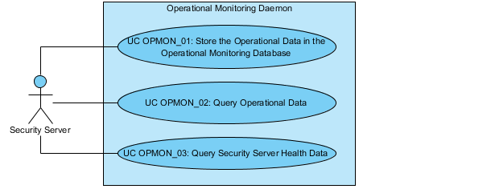

# X-Road: Use Case Model for Operational Monitoring Daemon <!-- omit in toc -->

Version: 0.10  
Doc. ID: UC-OPMON

| Date       | Version | Description                                                           | Author           |
|------------|---------|-----------------------------------------------------------------------|------------------|
|            | 0.5     | Initial version                                                       |                  |
| 23.01.2017 | 0.6     | Added license text, table of contents and version history             | Sami Kallio      |
| 05.03.2018 | 0.7     | Added terms and abbreviations reference and moved terms to term doc   | Tatu Repo        |
| 18.02.2019 | 0.8     | Main success scenario updated: optional id for request/response pairs | Caro Hautamäki   |
| 12.12.2019 | 0.9     | Update the document with refactored fields                            | Ilkka Seppälä    |
| 01.06.2023 | 0.10    | Update references                                                     | Petteri Kivimäki |

## Table of Contents <!-- omit in toc -->
    
<!-- toc -->

- [License](#license)
- [1 Introduction](#1-introduction)
  - [1.1 Purpose](#11-purpose)
  - [1.2 Terms and Abbreviations](#12-terms-and-abbreviations)
  - [1.3 References](#13-references)
- [2 Overview](#2-overview)
- [3 Use Case Model](#3-use-case-model)
  - [3.1 Actors](#31-actors)
  - [3.2 UC OPMON_01: Store the Operational Data in the Operational Monitoring Database](#32-uc-opmon01-store-the-operational-data-in-the-operational-monitoring-database)
  - [3.3 UC OPMON_02: Query Operational Data](#33-uc-opmon02-query-operational-data)
  - [3.5 UC OPMON_03: Query Security Server Health Data](#35-uc-opmon03-query-security-server-health-data)

<!-- tocstop -->

## License

This document is licensed under the Creative Commons Attribution-ShareAlike 3.0 Unported License. To view a copy of this license, visit http://creativecommons.org/licenses/by-sa/3.0/.

## 1 Introduction

### 1.1 Purpose

The purpose of this document is to describe the events that take place in the operational monitoring daemon during the communication with security server and/or with an external monitoring system (e.g. Zabbix).

The use cases include verifications that take place, and the main error conditions that may be encountered during the described process. The general system errors that may be encountered in most of the use cases (e.g., database connection errors or out of memory errors) are not described in this document.

### 1.2 Terms and Abbreviations

See X-Road terms and abbreviations documentation \[[TA-TERMS](#Ref_TERMS)\].

### 1.3 References

**ARC-OPMOND** -- X-Road: Operational Monitoring Daemon Architecture. Document ID: [ARC-OPMOND](../Architecture/arc-opmond_x-road_operational_monitoring_daemon_architecture_Y-1096-1.md).  
**PR-OPMON** -- X-Road: Operational Monitoring Protocol. Document ID: [PR-OPMON](../Protocols/pr-opmon_x-road_operational_monitoring_protocol_Y-1096-2.md).  
**PR-OPMONJMX** -- X-Road: Operational Monitoring JMX Protocol. Document ID: [PR-OPMONJMX](../Protocols/pr-opmonjmx_x-road_operational_monitoring_jmx_protocol_Y-1096-3.md).  
**TA-TERMS** -- X-Road Terms and Abbreviations. Document ID: [TA-TERMS](../../terms_x-road_docs.md).

## 2 Overview

The main function of the operational monitoring daemon is to collect operational monitoring data and health data of the X-Road security server(s). The operational monitoring daemon makes operational and health data available for the owner of the security server, regular client and central monitoring client via security server. Local health data is available for external monitoring systems (e.g. Zabbix) over JMXMP interface.

An overview of the components of the monitoring daemon and its interfaces is provided in \[[ARC-OPMOND](#ARC-OPMOND)\].

## 3 Use Case Model

### 3.1 Actors

The X-Road monitoring use case model includes the following actors.

- Security server -- A local security server that sends operational data stored in the operational monitoring buffer to the monitoring daemon and mediates operational data messages between operational monitoring daemon and remote security servers.

- External monitoring system -- A monitoring tool (e.g. Zabbix) that collects local security server health data via JMXMP interface.

The relationships between the actors and use cases are described in Figure 1.

**Figure 1. Operational monitoring daemon use case diagram**

### 3.2 UC OPMON_01: Store the Operational Data in the Operational Monitoring Database

**Level:** System task

**Actors:** Security server

**Brief Description:** Security server stores operational data in the operational monitoring buffer and sends the stored information to the monitoring daemon. The operational monitoring database component collects operational data of the X-Road security server(s) via store operational data interface.

**Preconditions:** -

**Postconditions:** -

**Trigger:** A security server sends operational data stored in the operational monitoring buffer to the monitoring daemon.

**Main Success Scenario:**

1. System receives the data storing request containing the following operational monitoring data fields (the fields not marked as mandatory are optional):
    * the internal IP of the security server (mandatory);
    * type of the security server (either *Client* or *Producer*; mandatory);
    * request in timestamp (In the client's security server: the Unix timestamp in milliseconds when the request was received by the client's security server. In the service provider's security server: the Unix timestamp in milliseconds when the request was received by the service provider's security server. Mandatory.);
    * request out timestamp (In the client's security server: the Unix timestamp in milliseconds when the request was sent out from the client's security server to the client's information system. In the service provider's security server: the Unix timestamp in milliseconds when the request was sent out from the service provider's security server. If the request is either a metadata request or a proxy monitoring data request the value of the parameter is equal to ‘request in timestamp’);
    * response in timestamp (In the client's security server: the Unix timestamp in milliseconds when the response was received by the client's security server. In the service provider's security server: the Unix timestamp in milliseconds when the response was received by the service provider's security server. If the request is either a metadata request or a proxy monitoring data request the value of the parameter is equal to ‘response out timestamp’);
    * response out timestamp (In the client's security server: the Unix timestamp in milliseconds when the response was sent out from the client's security server to the client's information system. In the service provider's security server: the Unix timestamp in milliseconds when the response was sent out from the service provider's security server. Mandatory.);
    * the X-Road instance identifier of the instance used by the client;
    * the member class of the X-Road member (client);
    * the member code of the X-Road member (client);
    * the subsystem code of the X-Road member (client);
    * the X-Road instance identifier of the instance used by the service provider;
    * the member class of the X-Road member (service provider);
    * the member code of the X-Road member (service provider);
    * the subsystem code of the X-Road member (service provider);
    * the code of the service;
    * the version number of the service;
    * the class of the represented party;
    * the code of the represented party;
    * the unique identifier of the message;
    * the personal code of the client that initiated the request;
    * the client's internal identifier of the message;
    * the version of the X-Road message protocol;
    * the external address of client's security server (IP or host name) defined in global configuration;
    * the external address of service provider's security server (IP or host name) defined in global configuration;
    * the size of the request (bytes);
    * the size of the MIME-container of the request (sum of the SOAP request message and attachments data size in bytes);
    * the number of attachments of the request;
    * the size of the response (bytes);
    * the size of the MIME-container of the response (sum of the SOAP response message and attachments data size in bytes);
    * the number of attachments of the response;
    * the type of the service;
    * the indication of successful/unsuccessful request mediation (boolean; mandatory);
    * the id to distinguish X-Road request/response pairs; (client and provider)
    * SOAP fault code;
    * SOAP fault reason.

2. System adds the Unix timestamp in seconds when the record was received by the monitoring daemon, and stores the data in the database. For the records of type 'Producer' the system updates the health check data (in memory) based on the received data. In case the request was successful:

	* the time of the last successful request (the Unix timestamp in milliseconds);
	* the number of successful requests occurred during the last period;
	* the minimum duration of the requests occurred during the last period in milliseconds;
	* the average duration of the requests occurred during the last period in milliseconds;
	* the maximum duration of the requests occurred during the last period in milliseconds;
	* the standard deviation of the duration of the requests occurred during the last period;
	* the minimum message size of the requests occurred during the last period in bytes;
	* the average message size of the requests occurred during the last period in bytes;
	* the maximum message size of the requests occurred during the last period in bytes;
	* the standard deviation of the message size of the requests occurred during the last period;
	* the minimum message size of the responses occurred during the last period in bytes;
	* the average message size of the responses occurred during the last period in bytes;
	* the maximum message size of the responses occurred during the last period in bytes;
	* the standard deviation of the message size of the responses occurred during the last period.

  In case the request was unsuccessful:
  * the time of the last unsuccessful request (the Unix timestamp in milliseconds);
  * the number of unsuccessful requests occurred during the last period;

3. System sends an acknowledgement to security server.

**Extensions:**

2a. Storing operational monitoring data failed.

  * 2a.1. System responses with an error message.

**Related information:** -

### 3.3 UC OPMON_02: Query Operational Data

**Level:** System task

**Actors:** Security server

**Brief Description:** Security server receives an operational data request and sends the request to the operational monitoring daemon. The sender of the original request can be either the owner of the security server, a regular client or a central monitoring client. System parses the operational data request and composes a response. If the request included the list of the requested operational data parameters only requested parameters are included in the response. Otherwise, the response contains all parameters listed in UC MON_01 step 1. The internal IP of the security server is included in the response only for the owner of the security server and the central monitoring client.

**Preconditions:** -

**Postconditions:** System has replied with a response message.

**Trigger:** The operational monitoring daemon receives an operational data request from the security server.

**Main Success Scenario:**

1. System receives an operational data request. The request includes the following information:
    * the beginning of the time interval of requested operational data (the Unix timestamp in seconds);
    * the end of the time interval of requested operational data (the Unix timestamp in seconds);
    * the identifier of a client the operational data is requested about (optional);
    * the set of the requested operational data parameters (optional; parameters are described in UC MON_01 step 1; if not filled the response contains all listed parameters).
2. System parses the request and verifies that the beginning of time interval of requested operational data is smaller than the end of the time interval.
3. System verifies the request is coming from central monitoring client (defined in the global configuration). System queries requested operational data records of either one client that is specified in the search criteria of the request or all clients (if the client is not specified in the search criteria) according to the time interval given in the request.
4. System composes the response including all operational data records from the given time interval.
5. System replies with a response message.

**Extensions:**  

2a. System verifies that the beginning and/or the end of the time interval is invalid (missing/not a number/negative number).

  * 2a.1. System composes a SOAP fault message.

  * 2a.2. Use case continues from step 5.

2b. System verifies that the beginning of the time interval of requested operational data is bigger than the end of the time interval.

  * 2b.1. System composes a SOAP fault message.

  * 2b.2. Use case continues from step 5.

2c. System verifies that the beginning of the time interval of requested operational data is bigger or equal to the value of *current time - configured offset seconds* of the monitoring daemon.

  * 2c.1. System composes a SOAP fault message.

  * 2c.2. Use case continues from step 5.

2d. System verifies that the end of the time interval of requested operational data is bigger or equal to the value of *current time - configured offset seconds* of the monitoring daemon.

  * 2d.1. System calculates new value for the end of the time interval *current time  - configured offset seconds - 1* for making the query and use case continues from step 3. The Unix timestamp in seconds (equal with the *current time  - configured offset seconds*) to use for the beginning of time interval of the next query is included into the response in step 4 of the use case.

2e. System verifies that the set of the requested operational data parameters contains an unknown parameter.

  * 2e.1. System composes a SOAP fault message.

  * 2e.2. Use case continues from step 5.

2f. System verifies that the identifier of a client the operational data is requested about is faulty.

  * 2f.1. System composes a SOAP fault message.

  * 2f.2. Use case continues from step 5.

3a. System verifies that the request is coming from the owner of the security server (the *clientId* included in the request corresponds to the security server owner identifier defined in the global configuration). System queries requested operational data records of either one client that is specified in the search criteria of the request or all clients (if the client is not specified in the search criteria) according to the time interval given in the request.

  * 3a.1. Use case continues from step 4.

    * 3a.1a. System verifies that no records were found and composes an empty response.

    * 3a.1b. Use case continues from step 5.

3b. System verifies that the request is coming from a regular client and queries requested operational data associated with that client of either one client that is specified in the search criteria of the request or all clients (if the client is not specified in the search criteria) according to the time interval given in the request.

  * 3b.1. System composes the response including only the operational data records associated with that client from the given time interval.

    * 3b.1a. System verifies that no records were found and composes an empty response.

    * 3b.1b. Use case continues from step 5.

4a. System verifies that no records were found.

  * 4a.1. System composes an empty response.

  * 4a.2. Use case continues from step 5.

4b. System verifies that the result of the query includes more records than the defined maximum number of records in the response allows.

  * 4b.1. System composes a response including the number of records allowed plus all records that have the same timestamp as the last included record. In case some queried records are still left over, the Unix timestamp in seconds (equal with the last included record timestamp +1 second) to use for the beginning of the time interval of the next query is included in the response.

  * 4b.2. Use case continues from step 5.

**Related information:**
- Operational data SOAP messages must conform to the profile described in document “X-Road: Operational Monitoring Protocol” \[[PR-OPMON](#PR-OPMON)\].

### 3.5 UC OPMON_03: Query Security Server Health Data

**Level:** System task

**Actors:** Security server, External monitoring system

**Brief Description:** Local health data requests are sent to the operational monitoring daemon by an external monitoring system over JMXMP interface. Health data requests coming from remote security servers are received by the local security server that sends the requests to the operational monitoring daemon.

**Preconditions:** -

**Postconditions:** System has replied with a response message.

**Trigger:** The operational monitoring daemon receives the request from external monitoring system or from local security server.

**Main Success Scenario:**

1. System receives a health data request from local security server. The request includes the following information:
    * the identifier of a client the health data is requested about (optional).
2. System parses the request and verifies that the client is specified. System queries health data about that specific client.
3. System composes the response including the following data fields:
    * the time when the operational monitoring daemon was started (the Unix timestamp in milliseconds);
    * the duration of the statistics period in seconds;
    * per every service:
      * the time of the last successful request (the Unix timestamp in milliseconds);
      * the time of the last unsuccessful request (the Unix timestamp in milliseconds);
      * the service type;
      * the number of successful requests occurred during the last period;
	    * the number of unsuccessful requests occurred during the last period;

	* the following data is included in the response only if the number of successful requests occurred during the last period is > 0:

	  * the minimum duration of the requests (the Unix timestamp in milliseconds);
	  * the average duration of the requests (the Unix timestamp in milliseconds);
	  * the maximum duration of the requests (the Unix timestamp in milliseconds);
	  * the standard deviation of the duration of the requests;
	  * the minimum message size of the requests in bytes;
	  * the average message size of the requests in bytes;
	  * the maximum message size of the requests in bytes;
	  * the standard deviation of the message size of the requests;
	  * the minimum message size of the responses in bytes;
	  * the average message size of the responses in bytes;
	  * the maximum message size of the responses in bytes;
	  * the standard deviation of the message size of the responses.

4. System replies with a response message.

**Extensions:**

1a. System receives a health data request over the JMXMP interface.

  * 1a.1. System composes the response according to the requested field. Supported fields are following:
    * the time when the operational monitoring daemon was started (the Unix timestamp in milliseconds);
    * the duration of the statistics period in seconds;
    * per every service:
      * the time of the last successful request (the Unix timestamp in milliseconds);
      * the time of the last unsuccessful request (the Unix timestamp in milliseconds);
      * the number of successful requests occurred during the last period;
	    * the number of unsuccessful requests occurred during the last period;
	    * the minimum duration of the requests during the last period in milliseconds;
  	  * the average duration of the requests during the last period in milliseconds;
	    * the maximum duration of the requests during the last period in milliseconds;
	    * the standard deviation of the duration of the requests during the last period;
  	  * the minimum message size of the requests during the last period in bytes;
	    * the average message size of the requests during the last period in bytes;
  	  * the maximum message size of the requests during the last period in bytes;
	    * the standard deviation of the message size of the requests during the last period;
  	  * the minimum message size of the responses during the last period in bytes;
  	  * the average message size of the responses during the last period in bytes;
  	  * the maximum message size of the responses during the last period in bytes;
  	  * the standard deviation of the message size of the responses during the last period.

  * 1a.2. Use case continues from step 4.

2a. System parses the request and identifies that the client is not specified. System queries health data about all clients.

  * 2a.1. Use case continues from step 3.

2b. System verifies that the identifier of a client the health data is requested about is faulty.

  * 2b.1. System composes a SOAP fault message.

  * 2b.2. Use case continues from step 4.

**Related information:**
- Health data SOAP messages must conform to the profile described in document “X-Road: Operational Monitoring Protocol” \[[PR-OPMON](#PR-OPMON)\].
- Health data JMX messages must confirm to the profile described in document "X-Road: Operational Monitoring JMX Protocol" \[[PR-OPMONJMX](#PR-OPMONJMX)\].
