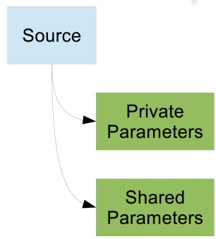
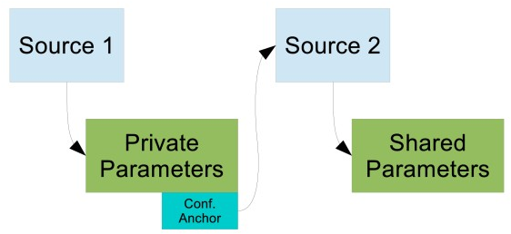

# X-Road: Protocol for Downloading Configuration

**Technical Specification**

Version: 2.10
Doc. ID: PR-GCONF

| Date       | Version | Description                                           | Author             |
|------------|---------|-------------------------------------------------------|--------------------|
| 04.09.2015 | 1.4     | Minor fixes                                           | Siim Annuk         |
| 09.09.2015 | 2.0     | Editorial changes made                                | Imbi Nõgisto       |
| 23.10.2015 | 2.1     | Shared-parameters chema updated                       | Siim Annuk         |
| 28.10.2015 | 2.2     | Typos fixed                                           | Siim Annuk         |
| 09.11.2015 | 2.3     | More typos                                            | Margus Freudenthal |
| 17.12.2015 | 2.4     | Added description of monitoring paramters             | Janne Mattila      |
| 05.09.2016 | 2.5     | Added description of optional configuration parts     | Janne Mattila      |
|            | 2.6     | Converted to markdown format                          |                    |
| 20.01.2017 | 2.7     | Added version history                                 | Sami Kallio        |
| 06.03.2018 | 2.8     | Moved terms to term doc, added doc reference and link | Tatu Repo          |
| 08.11.2018 | 2.9     | Deprecated global configuration V1                    | Ilkka Seppälä      |
| 08.11.2018 | 2.10    | Introduction of V3                                    | Andres Rosenthal   |

## Table of Contents

<!-- vim-markdown-toc GFM -->
* [License](#license)
* [1 Introduction](#1-introduction)
    * [1.1 Terms and Abbreviations](#11-terms-and-abbreviations)
    * [1.2 References](#12-references)
* [2 Protocol for Downloading Configuration](#2-protocol-for-downloading-configuration)
    * [2.1 General](#21-general)
    * [2.2 Format of Configuration Anchor](#22-format-of-configuration-anchor)
    * [2.3 Format of Signed Configuration](#23-format-of-signed-configuration)
    * [2.4 Format of Directory](#24-format-of-directory)
    * [2.5 List of Content Identifiers](#25-list-of-content-identifiers)
    * [2.6 Downloading and Verifying the Configuration](#26-downloading-and-verifying-the-configuration)
    * [2.7 Versioning](#27-versioning)
* [3 Deploying the Protocol](#3-deploying-the-protocol)
    * [3.1 The Simplest Case](#31-the-simplest-case)
    * [3.2 Detached Shared Parameters](#32-detached-shared-parameters)
    * [3.3 Simple Federated Installation](#33-simple-federated-installation)
    * [3.4 Federated Installation with Proxies](#34-federated-installation-with-proxies)
* [Annex A. Examples](#annex-a-examples)
    * [A.1 Example of Configuration Anchor](#a1-example-of-configuration-anchor)
    * [A.2 Example of Signed Directory](#a2-example-of-signed-directory)
* [Annex B. shared-parameters.xsd](#annex-b-shared-parametersxsd)
    * [Version 2](#version-2)
    * [Version 1](#version-1)
* [Annex C. private-parameters.xsd](#annex-c-private-parametersxsd)
    * [Version 1 and 2](#version-1-and-2)
* [Annex D. monitoring-conf.xsd](#annex-d-monitoring-confxsd)
* [Annex E. configuration-anchor.xsd](#annex-e-configuration-anchorxsd)
* [Annex F. ocsp-nextupdate-conf.xsd](#annex-f-ocsp-nextupdate-confxsd)
* [Annex G. ocsp-fetchinterval-conf.xsd](#annex-g-ocsp-fetchinterval-confxsd)

<!-- vim-markdown-toc -->

## License

This document is licensed under the Creative Commons Attribution-ShareAlike 3.0 Unported License. To view a copy of this license, visit http://creativecommons.org/licenses/by-sa/3.0/.

## 1 Introduction

This specification describes protocol that is used to distribute configuration to security servers of an X-Road installation. Additionally, the same protocol is used to distribute configuration between two federated X-Road instances.

This protocol is based on HTTP and MIME protocols and supports refreshing the configuration meta-info without having to download the actual configuration files. The configuration parameters are distributed in XML format and described using XML Schema [XMLSCM1], [XMLSCM2].

This protocol builds on existing transport and message encoding mechanisms. Therefore, this specification does not cover the technical details and error conditions related to downloading information over HTTP and decoding MIME messages. These concerns are discussed in detail in their respective standards.

The chapter [2 Protocol for Downloading Configuration](#2-protocol-for-downloading-configuration) as well as appendices [Annex B](#annex-b-shared-parametersxsd), [Annex C](#annex-c-private-parametersxsd) and [Annex E](#annex-e-configuration-anchorxsd) of this specification contain normative information. All the other sections are informative in nature. All the references are normative.

This specification does not include option for partially implementing the protocol – the conformant implementation must implement the entire specification.

The key words "MUST", "MUST NOT", "REQUIRED", "SHALL", "SHALL NOT", "SHOULD", "SHOULD NOT", "RECOMMENDED", "MAY", and "OPTIONAL" in this document (in uppercase, as shown) are to be interpreted as described in [RFC2119].

### 1.1 Terms and Abbreviations

The following figure contains a class diagram that illustrates important concepts used in this specification.


See X-Road terms and abbreviations documentation \[[TA-TERMS](#Ref_TERMS)\].

### 1.2 References

- [XMLSCM1] XML Schema Part 1: Structures Second Edition, 2004.
- [XMLSCM2] XML Schema Part 2: Datatypes Second Edition, 2004.
- [RFC2119] Key words for use in RFCs to Indicate Requirement Levels, Internet Engineering Task Force, 1997.
- [X509] Internet X.509 Public Key Infrastructure Certificate and Certificate Revocation List (CRL) Profile, Internet Engineering Task Force, 2008.
- [MPREL] The MIME Multipart/Related Content-type, Internet Engineering Task Force, 1998.
- [XMLDSIG] XML Signature Syntax and Processing Version 2.0, 2013.
- [ISO8601] Data Elements and Interchange Formats – Information Interchange – Representation of Dates and Times, International Organization for Standardization, 2004.
- <a id="Ref_TERMS" class="anchor"></a>\[TA-TERMS\] X-Road Terms and Abbreviations. Document ID: [TA-TERMS](../terms_x-road_docs.md).

## 2 Protocol for Downloading Configuration

### 2.1 General

Configuration clients download configuration using HTTP protocol (HTTP GET). Configuration source signs the configuration to protect it against modification. The configuration clients receive (via out of band means) configuration anchor containing information needed to successfully download and verify the configuration.

The configuration consists of a signed directory that references individual configuration parts. The signature has expiry date and thus the signed directory must be continuously refreshed by the configuration client. The clients can use the hash values contained in the directory to download the referenced configuration parts only when they are changed.

### 2.2 Format of Configuration Anchor

Configuration anchor is used to distribute information about configuration sources to configuration clients. Because configuration anchor is used to verify authenticity of the downloaded configuration, it must be protected against modification. Example means are digitally signing the file or distributing the fingerprint of the file to the client in person.

The configuration anchor is stored in an XML file containing a *configurationAnchor* element defined in Annex E . It contains the following fields:

- *generatedAt* – date when the anchor was generated. Can be used to check whether correct version of the anchor is used;
- *instanceIdentifier* – identifies the X-Road instance that provides configuration to this configuration source;
- *source* – describes a single configuration source. The *source* element contains the following fields:
  - *downloadURL* – HTTP URL that can be used to download signed configuration (see Section [2.3](#23-format-of-signed-configuration) for format of the downloaded file);
  - *verificationCert* – public key that can be used to verify the signed configuration, presented as X.509 [X509] certificate
  The certificate is only used as a container for the public key. The configuration client should not make any assumptions about other fields of the certificate.

Annex  A.2 contains an example configuration anchor file.

### 2.3 Format of Signed Configuration

Configuration client can download the configuration by making HTTP GET request to the configuration source. The content type of the response is *multipart/related* [MPREL]. The response is a MIME multipart that MUST consist of two parts:

1. Directory of configuration files. The directory is a nested MIME multipart. The format of this directory is specified in [2.4](#2-4-format-of-directory)
2. Signature of the directory, created using private key of the configuration source. The signature is calculated over the body of the first MIME part.

The signature part MUST have the following MIME headers:

- *Content-type* – the value MUST be “*application/octet-stream*”.
- *Content-transfer-encoding* – the value MUST be “*base64*”.
- *Signature-algorithm-id* – the value MUST identify the signature algorithm used to create the signature. This specification supports algorithm identifiers listed in XML Signature specification [XMLDSIG], Section 6.4.
- *Verification-certificate-hash* – the hash of the certificate that was used to sign this configuration. The value of the header MUST also include parameter *hash-algorithm-id* whose value is the hash algorithm identifier used to calculate the verification certificate hash.

The body of the signature part MUST be the value of the signature calculated using the signature algorithm identified in the *Signature-algorithm-id* header.

### 2.4 Format of Directory

The first entry in the directory MUST be a header-only entry with the header *Expire-date* that contains date and UTC time in ISO 8601 format [ISO8601]. This header specifies the end of validity time of the directory – after the validity time has passed, the configuration client MUST consider the configuration as invalid and should attempt to download fresh configuration. In addition, the header-only entry SHOULD include the header *Version* which identifies the version of the configuration (section [2.7](#27-versioning)).

The directory contains references to the individual configuration files. In addition to download URI, each directory item contains hash of the file that can be used to verify integrity of the downloaded file.

The directory is a MIME multipart (content type is *multipart/mixed*) where each part represents one configuration file. Each part MUST have the following MIME headers:

- *Content-type* – the value MUST be “*application/octet-stream*”.
- *Content-transfer-encoding –* encoding of the body of the part. The value MUST be “*base64*”.
- *Content-location* – URL that can be used to download the configuration file referenced by this directory item. The URL can be relative (the base is the location of the signed configuration).
- *Hash-algorithm-id –* identifies the hash algorithm used to create the content of the directory item. This specification supports algorithm identifiers listed in XML Signature specification [XMLDSIG], Section 6.2.

Each directory part CAN have the following MIME headers:

- *Content-identifier –* identifies the type of the configuration part. Example types can be private parameters and shared parameters. Section [2.5](#25-list-of-content-identifiers) lists the predefined content identifiers. In addition to these, each X-Road installation is free to add additional content to the configuration.
- *Content-file-name –* additional information about the configuration part. The configuration client CAN use value of this header as a hint about what name to use when saving this configuration part to a file.

The content of a directory part MUST be digest of the configuration part. The digest algorithm is specified in the *Hash-algorithm-id* MIME header. The input to the digest calculation is body of the file that can be downloaded from the URL specified in the *Content-location* MIME header.

Annex A.2 contains an example of a signed directory.

### 2.5 List of Content Identifiers

This specification defines the following content identifiers. The X-Road implementations are free to define additional types of configuration parts that are distributed to configuration clients.

- *PRIVATE-PARAMETERS –* XML file conforming to private-parameters.xsd (see Annex C ).
- *SHARED-PARAMETERS* – XML file conforming to shared-parameters.xsd (see Annex B ). The configuration source can distribute several files of type *SHARED-PARAMETERS*. In this case each of the shared parameters files MUST describe separate X-Road instance.

In both of these cases, the implementation MUST include parameter *instance* whose value is the identifier for X-Road instance described by the configuration part. For example:

Content-Identifier: SHARED-PARAMETERS; instance="EE"

### 2.6 Downloading and Verifying the Configuration

A configuration client can download the configuration by making HTTP GET requests to the configuration source. To download and verify the entire configuration, the client can follow these steps.

1. Parse the configuration anchor and read the download URI (pointing to the configuration directory) and the verification certificate.
2. Download the configuration directory from the URI and parse it.
3. Verify the signature of the configuration directory using the public key of the verification certificate. The signature algorithm identifier is specified by the MIME header *Signature-algorithm-id* of the MIME part containing the signature.
4. For each directory part,
    1. download the configuration file from the URL indicated in the *Content-location* MIME header;
    2. verify the integrity of the downloaded file by comparing the hash of the file with the hash contained in the directory (the hash algorithm is specified in MIME header *Hash-algorithm-id*).
5. For each configuration anchor in the private parameters file, download and verify the configuration using this set of rules.

### 2.7 Versioning

The current version of the configuration is 3.

Configuration source MAY support several versions of the configuration. The configuration client SHOULD signal the version it supports by appending a "version" query parameter in the download URI specified in the configuration anchor. The version number is an integer which is incremented when a backwards-incompatible change is made to the PRIVATE-PARAMETERS or SHARED-PARAMETERS configuration part.

For backwards compatibility, the configuration source MAY return a default version of the configuration if the version query parameter is not present. The configuration source MUST respond with HTTP error code 404 (Not Found) if the client requests a version that is not available.

## 3 Deploying the Protocol

The protocol described in the previous section can be deployed in various ways. In particular, the difference is how the Governing Authority distributes several configuration parts between configuration sources and how the configuration from the federated X-Road instances is distributed to the members.

### 3.1 The Simplest Case

This scenario involves a standalone X-Road instance that is not federated with any other X‑Road instances. In this case, the simplest configuration involves one configuration source that distributes all the necessary configuration.

- private parameters (content identifier *PRIVATE-PARAMETERS*)
- shared parameters (content identifier *SHARED-PARAMETERS*) and
- optionally any additional configuration parts that are specific to this X-Road installation. *Monitoring parameters* belong to this category.

Because the shared parameters are distributed in the main configuration, the private parameters part does not contain any additional configuration sources.



### 3.2 Detached Shared Parameters

This scenario involves a standalone X-Road instance that uses different configuration sources for private and shared parameters.

In this case the X-Road governing authority manages two configuration sources. The first source contains the private parameters and, optionally, other configuration parts that are specific to this X-Road instance. The second source contains shared parameters. The private parameters part contains anchor for the second configuration source. Figure below illustrates this situation.



Compared to the simplest case, the configuration authority must maintain two separate configuration sources. Additionally, the configuration clients must make additional HTTP requests to download the directory from *Source 2*. For a non-federated installation, this solution does not offer significant benefits, but it is a good starting point for building a federated X-Road infrastructure.

### 3.3 Simple Federated Installation

This scenario involves two federated X-Road installations. Both installations are set up according to "Detached Shared Parameters". Figure below describes the setup. Both X-Road installations maintain two configuration sources, one for private parameters, the other one for shared parameters. For both installations, the private parameters part contains configuration anchors for both of the sources that distribute shared parameters.


Members of the X-Road installations are initialized with configuration anchor pointing to private configuration source of their governing installation. This source is then used to download private parameters that contains configuration anchors for the sources that distribute shared parameters.

### 3.4 Federated Installation with Proxies

Scenario from the simple federated installation can be further developed by using configuration proxies. The figure below shows a setup where one X-Road installation uses proxies to cache both the incoming and outgoing shared parameters. Proxy is configured with a configuration anchor and it downloads and caches configuration from the source described by the anchor. Additionally, proxy acts as a configuration source and allows clients to download the cached configuration.


Instead of direct references from private parameters of one installation to shared configuration source of the other installation, the X-Road installation 2 sets up two proxies. Proxy 1 downloads shared parameters of X-Road installation 2 and redistributes them to other X-Road installations. Proxy 2 downloads shared parameters of another X-Road installation (1 in this example) and distributes them to members of X-Road installation 2.

In this setup, the X-Road 2 has complete control over configuration that is exchanged with other X-Road installations – both incoming and outgoing. Using a proxy can improve availability of the shared parameters and reduce load on shared configuration sources of both X-Road installations. In addition, the proxies can transform the configuration, e.g. by filtering out some member classes. However, the filtering should be declared in the federation agreement to avoid any confusion among the members of the federated X-Road installations.

## Annex A. Examples

### A.1 Example of Configuration Anchor
```xml
<?xml version="1.0" encoding="UTF-8"?>
<tns:configurationAnchor xmlns:tns="http://x-road.eu/xsd/xroad.xsd">
    <generatedAt>2014-05-20T16:42:55Z<generatedAt>
    <instanceIdentifier>EE</instanceIdentifier>
    <source>
        <downloadURI>http://10.10.10.10/conf</downloadURI>
        <verificationCert>ZGVmYXVsdA==</verificationCert>
    </source>
</tns:configurationAnchor>
```

### A.2 Example of Signed Directory

This example directory contains two parts. The first part contains private parameters and the second part contains shared parameters.

```http
Content-Type: multipart/related; charset=UTF-8; boundary=envelopeboundary

--envelopeboundary
Content-Type: multipart/mixed; charset=UTF-8; boundary=innerboundary

--innerboundary
Expire-date: 2014-05-20T17:42:55Z

--innerboundary
Content-type: application/octet-stream
Content-transfer-encoding: base64
Content-identifier: PRIVATE-PARAMETERS; instance="EE"
Content-location: /private-parameters.xml
Hash-algorithm-id: http://www.w3.org/2001/04/xmlenc#sha512

qgD1gNt3i/eDMCy0s6lTig6TD5h4=
--innerboundary
Content-type: application/octet-stream
Content-transfer-encoding: base64
Content-identifier: SHARED-PARAMETERS; instance="EE"
Content-location: /shared-parameters.xml
Hash-algorithm-id: http://www.w3.org/2001/04/xmlenc#sha512

qgD1gNt3i/eDMCy0s6lTig6TD5h4=
--innerboundary--
--envelopeboundary
Content-type: application/octet-stream
Content-transfer-encoding: base64
Signature-algorithm-id: http://www.w3.org/2001/04/xmldsig-more#rsa-sha512
Verification-certificate-hash: trng71M3bScT0fkc1TBWUaG+D28zTo;
    hash-algorithm-id="http://www.w3.org/2001/04/xmlenc#sha512"

D1XfU3UXTFxS8s8iVW9+ePJhcuYTgpN4+Ze4oZgjbt...=
--envelopeboundary--
```

## Annex B. shared-parameters.xsd

### Version 3

- Changes in version 3:
  - *source* element of type *ConfigurationSourceType* was added into *SharedParametersType* as the basis to "automatic configuration signing keys' rotation" feature.
  - *acmeServer* complex element was added into *ApprovedCaType* to introduce support for ACME specific certification services.
  - *any* element was added into *SharedParametersType* to enable the ability to add new optional elements without breaking backwards compatibility (i.e. without breaking the schema validation on older Security Servers).

```xml
<?xml version="1.0" encoding="UTF-8"?>
<schema xmlns="http://www.w3.org/2001/XMLSchema"
    xmlns:tns="http://x-road.eu/xsd/xroad.xsd"
    targetNamespace="http://x-road.eu/xsd/xroad.xsd"
    xmlns:id="http://x-road.eu/xsd/identifiers">
    <import namespace="http://x-road.eu/xsd/identifiers"
        schemaLocation="http://x-road.eu/xsd/identifiers.xsd" id="id"/>

    <element name="conf" type="tns:SharedParametersType">
        <annotation>
            <documentation> Set of configuration parameters that are
                used by members of this X-Road instance and other
                federated instances. </documentation>
        </annotation>
    </element>

    <complexType name="SharedParametersType">
        <sequence>
            <element name="instanceIdentifier" type="string">
                <annotation>
                    <documentation> Code that uniquely identifies this
                        instance of the X-Road system within a
                        federation of systems. </documentation>
                </annotation>
            </element>
            <element name="source" type="tns:ConfigurationSourceType" maxOccurs="unbounded">
                <annotation>
                    <documentation> Describes one configuration source.
                    </documentation>
                </annotation>
            </element>
            <element name="approvedCA" type="tns:ApprovedCAType"
                minOccurs="0" maxOccurs="unbounded">
                <annotation>
                    <documentation> Certification authority approved
                        by the Governing Authority of providing
                        certification services for members of this
                        X-Road instance. </documentation>
                </annotation>
            </element>
            <element name="approvedTSA" type="tns:ApprovedTSAType"
                minOccurs="0" maxOccurs="unbounded">
                <annotation>
                    <documentation> Time-stamping authority approved
                        by the Governing Authority of providing
                        time-stamping services for members of this
                        X-Road instance. </documentation>
                </annotation>
            </element>
            <element name="member" type="tns:MemberType" minOccurs="0"
                maxOccurs="unbounded">
                <annotation>
                    <documentation> Registered member of this X-Road
                        system. </documentation>
                </annotation>
            </element>
            <element name="securityServer"
                type="tns:SecurityServerType" minOccurs="0"
                maxOccurs="unbounded">
                <annotation>
                    <documentation> Security server registered in this
                        X-Road system. </documentation>
                </annotation>
            </element>
            <element name="globalGroup" type="tns:GlobalGroupType"
                minOccurs="0" maxOccurs="unbounded">
                <annotation>
                    <documentation> Group of access rights subjects,
                        defined by the Governing Authority. An access
                        rights subject can be either a member or a
                        subsystem. </documentation>
                </annotation>
            </element>
            <element name="centralService"
                type="tns:CentralServiceType" minOccurs="0"
                maxOccurs="unbounded">
                <annotation>
                    <documentation> Central service, defined by the
                        Governing Authority. </documentation>
                </annotation>
            </element>
            <element name="globalSettings"
                type="tns:GlobalSettingsType">
                <annotation>
                    <documentation> Classifiers and security policy
                        settings used in this X-Road instance.
                    </documentation>
                </annotation>
            </element>
            <any processContents="lax" minOccurs="0" maxOccurs="unbounded"/>
        </sequence>
    </complexType>

    <complexType name="ConfigurationSourceType">
        <sequence>
            <element name="address" type="string">
                <annotation>
                    <documentation> The address of the central server which provides the signed configuration.</documentation>
                </annotation>
            </element>
            <element name="internalVerificationCert" type="base64Binary" maxOccurs="unbounded">
                <annotation>
                    <documentation> Public key that can be used to verify the signed configuration, presented as X.509 certificate.</documentation>
                </annotation>
            </element>
            <element name="externalVerificationCert" type="base64Binary" maxOccurs="unbounded">
                <annotation>
                    <documentation> Public key that can be used to verify the signed configuration, presented as X.509 certificate.</documentation>
                </annotation>
            </element>
        </sequence>
    </complexType>

    <complexType name="MemberType">
        <sequence>
            <element name="memberClass" type="tns:MemberClassType">
                <annotation>
                    <documentation> Member class of the member.
                    </documentation>
                </annotation>
            </element>
            <element name="memberCode" type="string">
                <annotation>
                    <documentation> Code that uniquely identifies the
                        member within the given member class.
                    </documentation>
                </annotation>
            </element>
            <element name="name" type="string">
                <annotation>
                    <documentation> Full, official name of the member,
                        used in user interfaces. </documentation>
                </annotation>
            </element>
            <element name="subsystem" type="tns:SubsystemType"
                minOccurs="0" maxOccurs="unbounded">
                <annotation>
                    <documentation> Represents information about a
                        part of the member's information system that
                        is acting as an independent service consumer
                        or provider in the X-Road system.
                    </documentation>
                </annotation>
            </element>
        </sequence>
        <attribute name="id" type="ID"/>
    </complexType>

    <complexType name="SecurityServerType">
        <sequence>
            <element name="owner" type="IDREF">
                <annotation>
                    <documentation> Identifier of the member who is
                        responsible for the security server.
                    </documentation>
                </annotation>
            </element>
            <element name="serverCode" type="string">
                <annotation>
                    <documentation> Code that uniquely identifies this
                        server within servers owned by the same
                        member. </documentation>
                </annotation>
            </element>
            <element name="address" type="string" minOccurs="0">
                <annotation>
                    <documentation> Externally visible address of the
                        security server. </documentation>
                </annotation>
            </element>
            <element name="authCertHash" type="base64Binary"
                minOccurs="0" maxOccurs="unbounded">
                <annotation>
                    <documentation> Hash of the authentication
                        certificate used by the security server.
                    </documentation>
                </annotation>
            </element>
            <element name="client" type="IDREF" minOccurs="0"
                maxOccurs="unbounded">
                <annotation>
                    <documentation> Identifier a registered client of
                        this security server. Client can be either a
                        member or a subsystem. </documentation>
                </annotation>
            </element>
        </sequence>
    </complexType>

    <complexType name="ApprovedCAType">
        <sequence>
            <element name="name" type="string">
                <annotation>
                    <documentation> Name of the CA, used in user
                        interfaces. </documentation>
                </annotation>
            </element>
            <element name="authenticationOnly" type="boolean"
                minOccurs="0">
                <annotation>
                    <documentation> If present and true, indicates
                        that certificates issued by this CA can only
                        be used for TLS authentication and not for
                        creating and verifying digital
                        signatures/seals. </documentation>
                </annotation>
            </element>
            <element name="topCA" type="tns:CaInfoType">
                <annotation>
                    <documentation> Topmost (usually self-signed) CA
                        that is used as trust anchor. </documentation>
                </annotation>
            </element>
            <element name="intermediateCA" type="tns:CaInfoType"
                minOccurs="0" maxOccurs="unbounded">
                <annotation>
                    <documentation> Intermediate CA. This information
                        can be used for certificate path building and
                        finding OCSP responders. </documentation>
                </annotation>
            </element>
            <element name="certificateProfileInfo" type="string">
                <annotation>
                    <documentation>
                    Fully qualified class name implementing the ee.ria.xroad.common.certificateprofile.CertificateProfileInfoProvider interface.
                    </documentation>
                </annotation>
            </element>
            <element name="acmeServer" type="tns:AcmeServer" minOccurs="0">
                 <annotation>
                     <documentation>ACME specific certification services settings.</documentation>
                 </annotation>
            </element>
        </sequence>
    </complexType>

    <complexType name="GlobalGroupType">
        <sequence>
            <element name="groupCode" type="string">
                <annotation>
                    <documentation> Code that uniquely identifies the
                        group within an X-Road instance.
                    </documentation>
                </annotation>
            </element>
            <element name="description" type="string">
                <annotation>
                    <documentation> Description of the group.
                    </documentation>
                </annotation>
            </element>
            <element name="groupMember"
                type="id:XRoadClientIdentifierType" minOccurs="0"
                maxOccurs="unbounded">
                <annotation>
                    <documentation> Identifier of an X-Road member or
                        a subsystem belonging to this group.
                    </documentation>
                </annotation>
            </element>
        </sequence>
    </complexType>

    <complexType name="OcspInfoType">
        <annotation>
            <documentation> Information about an OCSP provider.
            </documentation>
        </annotation>
        <sequence>
            <element name="url" type="string">
                <annotation>
                    <documentation> URL of the OSCP server.
                    </documentation>
                </annotation>
            </element>
            <element name="cert" type="base64Binary" minOccurs="0">
                <annotation>
                    <documentation> Certificate used by the OCSP
                        server to sign OCSP responses.
                    </documentation>
                </annotation>
            </element>
        </sequence>
    </complexType>

    <complexType name="ApprovedTSAType">
        <sequence>
            <element name="name" type="string">
                <annotation>
                    <documentation> Name of the time-stamping
                        authority, used in user interfaces.
                    </documentation>
                </annotation>
            </element>
            <element name="url" type="string">
                <annotation>
                    <documentation> URL of the time-stamping service.
                    </documentation>
                </annotation>
            </element>
            <element name="cert" type="base64Binary">
                <annotation>
                    <documentation> Certificate used by the
                        time-stamping server to sign responses.
                    </documentation>
                </annotation>
            </element>
        </sequence>
    </complexType>

    <complexType name="CaInfoType">
        <annotation>
            <documentation> This type encapsulates information about a
                certification authority. </documentation>
        </annotation>
        <sequence>
            <element name="cert" type="base64Binary">
                <annotation>
                    <documentation> The CA certificate value.
                    </documentation>
                </annotation>
            </element>
            <element name="ocsp" type="tns:OcspInfoType" minOccurs="0"
                maxOccurs="unbounded">
                <annotation>
                    <documentation> List of OCSP responders that
                        provide status of certificates issued by this
                        CA. </documentation>
                </annotation>
            </element>
        </sequence>
    </complexType>

    <complexType name="AcmeServer">
        <sequence>
            <element name="directoryURL" type="string">
                <annotation>
                    <documentation> ACME directory URL that is used as an entrypoint to communicate with the ACME server. The response of this
                        endpoint will return all the other necessary API endpoints for making ACME operations.
                        This is used by the Security Server's code internally to order and receive certificates from the CA
                        automatically. </documentation>
                </annotation>
            </element>
            <element name="ipAddress" type="string" minOccurs="0">
                <annotation>
                    <documentation> ACME server IP address or multiple addresses separated by comma, that Security Server admins can
                        use to whitelist the ACME Server in their firewall rules, so that the ACME server's HTTP challenge
                        wouldn't be blocked. </documentation>
                </annotation>
            </element>
        </sequence>
    </complexType>

    <complexType name="SubsystemType">
        <sequence>
            <element name="subsystemCode" type="string">
                <annotation>
                    <documentation> Code that uniquely identifies this
                        subsystem within the subsystems of its
                        parent-member. </documentation>
                </annotation>
            </element>
        </sequence>
        <attribute name="id" type="ID"/>
    </complexType>

    <complexType name="MemberClassType">
        <sequence>
            <element name="code" type="string">
                <annotation>
                    <documentation> Code that uniquely identifies the
                        member class in this X-Road instance.
                    </documentation>
                </annotation>
            </element>
            <element name="description" type="string">
                <annotation>
                    <documentation> Description of the member class.
                    </documentation>
                </annotation>
            </element>
        </sequence>
    </complexType>

    <complexType name="CentralServiceType">
        <sequence>
            <element name="serviceCode" type="string">
                <annotation>
                    <documentation> Code that uniquely identifies a
                        central service in this X-Road instance.
                    </documentation>
                </annotation>
            </element>
            <element name="implementingService"
                type="id:XRoadServiceIdentifierType" minOccurs="0">
                <annotation>
                    <documentation> Identifier of the service that
                        implements the central service.
                    </documentation>
                </annotation>
            </element>
        </sequence>
    </complexType>

    <complexType name="GlobalSettingsType">
        <sequence>
            <element name="memberClass" type="tns:MemberClassType"
                minOccurs="0" maxOccurs="unbounded">
                <annotation>
                    <documentation> Lists the member classes used in
                        this X-Road instance. </documentation>
                </annotation>
            </element>
            <element name="ocspFreshnessSeconds" type="integer">
                <annotation>
                    <documentation> Maximum allowed validity time of
                        OCSP responses. If producedAt field of an OCSP
                        response is older than ocspFreshnessSeconds
                        seconds, it is no longer valid.
                    </documentation>
                </annotation>
            </element>
        </sequence>
    </complexType>
</schema>
```

### Version 2

```xml
<?xml version="1.0" encoding="UTF-8"?>
<schema xmlns="http://www.w3.org/2001/XMLSchema"
    xmlns:tns="http://x-road.eu/xsd/xroad.xsd"
    targetNamespace="http://x-road.eu/xsd/xroad.xsd"
    xmlns:id="http://x-road.eu/xsd/identifiers">
    <import namespace="http://x-road.eu/xsd/identifiers"
        schemaLocation="http://x-road.eu/xsd/identifiers.xsd" id="id"/>

    <element name="conf" type="tns:SharedParametersType">
        <annotation>
            <documentation> Set of configuration parameters that are
                used by members of this X-Road instance and other
                federated instances. </documentation>
        </annotation>
    </element>

    <complexType name="SharedParametersType">
        <sequence>
            <element name="instanceIdentifier" type="string">
                <annotation>
                    <documentation> Code that uniquely identifies this
                        instance of the X-Road system within a
                        federation of systems. </documentation>
                </annotation>
            </element>
            <element name="approvedCA" type="tns:ApprovedCAType"
                minOccurs="0" maxOccurs="unbounded">
                <annotation>
                    <documentation> Certification authority approved
                        by the Governing Authority of providing
                        certification services for members of this
                        X-Road instance. </documentation>
                </annotation>
            </element>
            <element name="approvedTSA" type="tns:ApprovedTSAType"
                minOccurs="0" maxOccurs="unbounded">
                <annotation>
                    <documentation> Time-stamping authority approved
                        by the Governing Authority of providing
                        time-stamping services for members of this
                        X-Road instance. </documentation>
                </annotation>
            </element>
            <element name="member" type="tns:MemberType" minOccurs="0"
                maxOccurs="unbounded">
                <annotation>
                    <documentation> Registered member of this X-Road
                        system. </documentation>
                </annotation>
            </element>
            <element name="securityServer"
                type="tns:SecurityServerType" minOccurs="0"
                maxOccurs="unbounded">
                <annotation>
                    <documentation> Security server registered in this
                        X-Road system. </documentation>
                </annotation>
            </element>
            <element name="globalGroup" type="tns:GlobalGroupType"
                minOccurs="0" maxOccurs="unbounded">
                <annotation>
                    <documentation> Group of access rights subjects,
                        defined by the Governing Authority. An access
                        rights subject can be either a member or a
                        subsystem. </documentation>
                </annotation>
            </element>
            <element name="centralService"
                type="tns:CentralServiceType" minOccurs="0"
                maxOccurs="unbounded">
                <annotation>
                    <documentation> Central service, defined by the
                        Governing Authority. </documentation>
                </annotation>
            </element>
            <element name="globalSettings"
                type="tns:GlobalSettingsType">
                <annotation>
                    <documentation> Classifiers and security policy
                        settings used in this X-Road instance.
                    </documentation>
                </annotation>
            </element>
        </sequence>
    </complexType>

    <complexType name="MemberType">
        <sequence>
            <element name="memberClass" type="tns:MemberClassType">
                <annotation>
                    <documentation> Member class of the member.
                    </documentation>
                </annotation>
            </element>
            <element name="memberCode" type="string">
                <annotation>
                    <documentation> Code that uniquely identifies the
                        member within the given member class.
                    </documentation>
                </annotation>
            </element>
            <element name="name" type="string">
                <annotation>
                    <documentation> Full, official name of the member,
                        used in user interfaces. </documentation>
                </annotation>
            </element>
            <element name="subsystem" type="tns:SubsystemType"
                minOccurs="0" maxOccurs="unbounded">
                <annotation>
                    <documentation> Represents information about a
                        part of the member's information system that
                        is acting as an independent service consumer
                        or provider in the X-Road system.
                    </documentation>
                </annotation>
            </element>
        </sequence>
        <attribute name="id" type="ID"/>
    </complexType>

    <complexType name="SecurityServerType">
        <sequence>
            <element name="owner" type="IDREF">
                <annotation>
                    <documentation> Identifier of the member who is
                        responsible for the security server.
                    </documentation>
                </annotation>
            </element>
            <element name="serverCode" type="string">
                <annotation>
                    <documentation> Code that uniquely identifies this
                        server within servers owned by the same
                        member. </documentation>
                </annotation>
            </element>
            <element name="address" type="string" minOccurs="0">
                <annotation>
                    <documentation> Externally visible address of the
                        security server. </documentation>
                </annotation>
            </element>
            <element name="authCertHash" type="base64Binary"
                minOccurs="0" maxOccurs="unbounded">
                <annotation>
                    <documentation> Hash of the authentication
                        certificate used by the security server.
                    </documentation>
                </annotation>
            </element>
            <element name="client" type="IDREF" minOccurs="0"
                maxOccurs="unbounded">
                <annotation>
                    <documentation> Identifier a registered client of
                        this security server. Client can be either a
                        member or a subsystem. </documentation>
                </annotation>
            </element>
        </sequence>
    </complexType>

    <complexType name="ApprovedCAType">
        <sequence>
            <element name="name" type="string">
                <annotation>
                    <documentation> Name of the CA, used in user
                        interfaces. </documentation>
                </annotation>
            </element>
            <element name="authenticationOnly" type="boolean"
                minOccurs="0">
                <annotation>
                    <documentation> If present and true, indicates
                        that certificates issued by this CA can only
                        be used for TLS authentication and not for
                        creating and verifying digital
                        signatures/seals. </documentation>
                </annotation>
            </element>
            <element name="topCA" type="tns:CaInfoType">
                <annotation>
                    <documentation> Topmost (usually self-signed) CA
                        that is used as trust anchor. </documentation>
                </annotation>
            </element>
            <element name="intermediateCA" type="tns:CaInfoType"
                minOccurs="0" maxOccurs="unbounded">
                <annotation>
                    <documentation> Intermediate CA. This information
                        can be used for certificate path building and
                        finding OCSP responders. </documentation>
                </annotation>
            </element>
            <element name="certificateProfileInfo" type="string">
                <annotation>
                    <documentation>
                    Fully qualified class name implementing the ee.ria.xroad.common.certificateprofile.CertificateProfileInfoProvider interface.
                    </documentation>
                </annotation>
            </element>
        </sequence>
    </complexType>

    <complexType name="GlobalGroupType">
        <sequence>
            <element name="groupCode" type="string">
                <annotation>
                    <documentation> Code that uniquely identifies the
                        group within an X-Road instance.
                    </documentation>
                </annotation>
            </element>
            <element name="description" type="string">
                <annotation>
                    <documentation> Description of the group.
                    </documentation>
                </annotation>
            </element>
            <element name="groupMember"
                type="id:XRoadClientIdentifierType" minOccurs="0"
                maxOccurs="unbounded">
                <annotation>
                    <documentation> Identifier of an X-Road member or
                        a subsystem belonging to this group.
                    </documentation>
                </annotation>
            </element>
        </sequence>
    </complexType>

    <complexType name="OcspInfoType">
        <annotation>
            <documentation> Information about an OCSP provider.
            </documentation>
        </annotation>
        <sequence>
            <element name="url" type="string">
                <annotation>
                    <documentation> URL of the OSCP server.
                    </documentation>
                </annotation>
            </element>
            <element name="cert" type="base64Binary" minOccurs="0">
                <annotation>
                    <documentation> Certificate used by the OCSP
                        server to sign OCSP responses.
                    </documentation>
                </annotation>
            </element>
        </sequence>
    </complexType>

    <complexType name="ApprovedTSAType">
        <sequence>
            <element name="name" type="string">
                <annotation>
                    <documentation> Name of the time-stamping
                        authority, used in user interfaces.
                    </documentation>
                </annotation>
            </element>
            <element name="url" type="string">
                <annotation>
                    <documentation> URL of the time-stamping service.
                    </documentation>
                </annotation>
            </element>
            <element name="cert" type="base64Binary">
                <annotation>
                    <documentation> Certificate used by the
                        time-stamping server to sign responses.
                    </documentation>
                </annotation>
            </element>
        </sequence>
    </complexType>

    <complexType name="CaInfoType">
        <annotation>
            <documentation> This type encapsulates information about a
                certification authority. </documentation>
        </annotation>
        <sequence>
            <element name="cert" type="base64Binary">
                <annotation>
                    <documentation> The CA certificate value.
                    </documentation>
                </annotation>
            </element>
            <element name="ocsp" type="tns:OcspInfoType" minOccurs="0"
                maxOccurs="unbounded">
                <annotation>
                    <documentation> List of OCSP responders that
                        provide status of certificates issued by this
                        CA. </documentation>
                </annotation>
            </element>
        </sequence>
    </complexType>

    <complexType name="SubsystemType">
        <sequence>
            <element name="subsystemCode" type="string">
                <annotation>
                    <documentation> Code that uniquely identifies this
                        subsystem within the subsystems of its
                        parent-member. </documentation>
                </annotation>
            </element>
        </sequence>
        <attribute name="id" type="ID"/>
    </complexType>

    <complexType name="MemberClassType">
        <sequence>
            <element name="code" type="string">
                <annotation>
                    <documentation> Code that uniquely identifies the
                        member class in this X-Road instance.
                    </documentation>
                </annotation>
            </element>
            <element name="description" type="string">
                <annotation>
                    <documentation> Description of the member class.
                    </documentation>
                </annotation>
            </element>
        </sequence>
    </complexType>

    <complexType name="CentralServiceType">
        <sequence>
            <element name="serviceCode" type="string">
                <annotation>
                    <documentation> Code that uniquely identifies a
                        central service in this X-Road instance.
                    </documentation>
                </annotation>
            </element>
            <element name="implementingService"
                type="id:XRoadServiceIdentifierType" minOccurs="0">
                <annotation>
                    <documentation> Identifier of the service that
                        implements the central service.
                    </documentation>
                </annotation>
            </element>
        </sequence>
    </complexType>

    <complexType name="GlobalSettingsType">
        <sequence>
            <element name="memberClass" type="tns:MemberClassType"
                minOccurs="0" maxOccurs="unbounded">
                <annotation>
                    <documentation> Lists the member classes used in
                        this X-Road instance. </documentation>
                </annotation>
            </element>
            <element name="ocspFreshnessSeconds" type="integer">
                <annotation>
                    <documentation> Maximum allowed validity time of
                        OCSP responses. If producedAt field of an OCSP
                        response is older than ocspFreshnessSeconds
                        seconds, it is no longer valid.
                    </documentation>
                </annotation>
            </element>
        </sequence>
    </complexType>
</schema>
```

## Annex C. private-parameters.xsd

### Version 3

Changes in version 3:
- *any* element was added into *SharedParametersType* to enable the ability to add new optional elements without breaking backwards compatibility (i.e. without breaking the schema validation on older Security Servers).

```xml
<?xml version="1.0" encoding="UTF-8"?>
<schema xmlns="http://www.w3.org/2001/XMLSchema"
    xmlns:tns="http://x-road.eu/xsd/xroad.xsd"
    targetNamespace="http://x-road.eu/xsd/xroad.xsd"
    xmlns:id="http://x-road.eu/xsd/identifiers">
    <import namespace="http://x-road.eu/xsd/identifiers"
        schemaLocation="http://x-road.eu/xsd/identifiers.xsd" id="id"/>
    <element name="conf" type="tns:PrivateParametersType">
        <annotation>
            <documentation> Set of configuration parameters that are
                used only by members of this X-Road instance.
            </documentation>
        </annotation>
    </element>
    <element name="configurationAnchor"
        type="tns:ConfigurationAnchorType">
        <annotation>
            <documentation> Information about a source of
                configuration. </documentation>
        </annotation>
    </element>

    <complexType name="PrivateParametersType">
        <sequence>
            <element name="instanceIdentifier" type="string">
                <annotation>
                    <documentation> Code that uniquely identifies this
                        instance of the X-Road system within a
                        federation of systems. </documentation>
                </annotation>
            </element>
            <element name="configurationAnchor"
                type="tns:ConfigurationAnchorType" minOccurs="0"
                maxOccurs="unbounded">
                <annotation>
                    <documentation> Information about a source of
                        configuration. </documentation>
                </annotation>
            </element>
            <element name="managementService"
                type="tns:ManagementServiceType">
                <annotation>
                    <documentation> Parameters of management services
                        called by the security servers.
                    </documentation>
                </annotation>
            </element>
            <element name="timeStampingIntervalSeconds" type="integer">
                <annotation>
                    <documentation> Time interval (in seconds) after
                        which a logged signature should be
                        time-stamped. This ensures that the
                        time-stamped signature can be used as evidence
                        at some later date. </documentation>
                </annotation>
            </element>
        </sequence>
    </complexType>

    <complexType name="ManagementServiceType">
        <sequence>
            <element name="authCertRegServiceAddress" type="string">
                <annotation>
                    <documentation> Address of the authentication
                        certificate registration service that can be
                        called by the security servers.
                    </documentation>
                </annotation>
            </element>
            <element name="authCertRegServiceCert" type="base64Binary"
                minOccurs="0">
                <annotation>
                    <documentation> Server certificate that is used to
                        authenticate TLS connection to the
                        authentication certificate registration
                        service. </documentation>
                </annotation>
            </element>
            <element name="managementRequestServiceProviderId"
                type="id:XRoadClientIdentifierType">
                <annotation>
                    <documentation> Identifier of the X-Road member or
                        subsystem providing the management request
                        services. </documentation>
                </annotation>
            </element>
        </sequence>
    </complexType>

    <complexType name="ConfigurationAnchorType">
        <sequence>
            <element name="generatedAt" minOccurs="0" type="dateTime">
                <annotation>
                    <documentation>Date when this anchor was produced
                    </documentation>
                </annotation>
            </element>
            <element name="instanceIdentifier" type="string">
                <annotation>
                    <documentation> Code of the X-Road instance that
                        provides configuration to this configuration
                        source. </documentation>
                </annotation>
            </element>
            <element name="source"
                type="tns:ConfigurationSourceType"
                maxOccurs="unbounded">
                <annotation>
                    <documentation>                         
                        Describes one configuration source.
                    </documentation>
                </annotation>
            </element>
        </sequence>
    </complexType>

    <complexType name="ConfigurationSourceType">
		<sequence>
            <element name="downloadURL" type="string">
                <annotation>
                    <documentation> HTTP URL that can be used to
                        download signed configuration.
                    </documentation>
                </annotation>
            </element>
            <element name="verificationCert" type="base64Binary"
                maxOccurs="unbounded">
                <annotation>
                    <documentation> Public key that can be used to
                        verify the signed configuration, presented as
                        X.509 certificate. </documentation>
                </annotation>
            </element>
        </sequence>
	</complexType>
</schema>
```

### Version 2

```xml
<?xml version="1.0" encoding="UTF-8"?>
<schema xmlns="http://www.w3.org/2001/XMLSchema"
    xmlns:tns="http://x-road.eu/xsd/xroad.xsd"
    targetNamespace="http://x-road.eu/xsd/xroad.xsd"
    xmlns:id="http://x-road.eu/xsd/identifiers">
    <import namespace="http://x-road.eu/xsd/identifiers"
        schemaLocation="http://x-road.eu/xsd/identifiers.xsd" id="id"/>
    <element name="conf" type="tns:PrivateParametersType">
        <annotation>
            <documentation> Set of configuration parameters that are
                used only by members of this X-Road instance.
            </documentation>
        </annotation>
    </element>
    <element name="configurationAnchor"
        type="tns:ConfigurationAnchorType">
        <annotation>
            <documentation> Information about a source of
                configuration. </documentation>
        </annotation>
    </element>

    <complexType name="PrivateParametersType">
        <sequence>
            <element name="instanceIdentifier" type="string">
                <annotation>
                    <documentation> Code that uniquely identifies this
                        instance of the X-Road system within a
                        federation of systems. </documentation>
                </annotation>
            </element>
            <element name="configurationAnchor"
                type="tns:ConfigurationAnchorType" minOccurs="0"
                maxOccurs="unbounded">
                <annotation>
                    <documentation> Information about a source of
                        configuration. </documentation>
                </annotation>
            </element>
            <element name="managementService"
                type="tns:ManagementServiceType">
                <annotation>
                    <documentation> Parameters of management services
                        called by the security servers.
                    </documentation>
                </annotation>
            </element>
            <element name="timeStampingIntervalSeconds" type="integer">
                <annotation>
                    <documentation> Time interval (in seconds) after
                        which a logged signature should be
                        time-stamped. This ensures that the
                        time-stamped signature can be used as evidence
                        at some later date. </documentation>
                </annotation>
            </element>
        </sequence>
    </complexType>

    <complexType name="ManagementServiceType">
        <sequence>
            <element name="authCertRegServiceAddress" type="string">
                <annotation>
                    <documentation> Address of the authentication
                        certificate registration service that can be
                        called by the security servers.
                    </documentation>
                </annotation>
            </element>
            <element name="authCertRegServiceCert" type="base64Binary"
                minOccurs="0">
                <annotation>
                    <documentation> Server certificate that is used to
                        authenticate TLS connection to the
                        authentication certificate registration
                        service. </documentation>
                </annotation>
            </element>
            <element name="managementRequestServiceProviderId"
                type="id:XRoadClientIdentifierType">
                <annotation>
                    <documentation> Identifier of the X-Road member or
                        subsystem providing the management request
                        services. </documentation>
                </annotation>
            </element>
        </sequence>
    </complexType>

    <complexType name="ConfigurationAnchorType">
        <sequence>
            <element name="generatedAt" minOccurs="0" type="dateTime">
                <annotation>
                    <documentation>Date when this anchor was produced
                    </documentation>
                </annotation>
            </element>
            <element name="instanceIdentifier" type="string">
                <annotation>
                    <documentation> Code of the X-Road instance that
                        provides configuration to this configuration
                        source. </documentation>
                </annotation>
            </element>
            <element name="source"
                type="tns:ConfigurationSourceType"
                maxOccurs="unbounded">
                <annotation>
                    <documentation>                         
                        Describes one configuration source.
                    </documentation>
                </annotation>
            </element>
        </sequence>
    </complexType>

    <complexType name="ConfigurationSourceType">
		<sequence>
            <element name="downloadURL" type="string">
                <annotation>
                    <documentation> HTTP URL that can be used to
                        download signed configuration.
                    </documentation>
                </annotation>
            </element>
            <element name="verificationCert" type="base64Binary"
                maxOccurs="unbounded">
                <annotation>
                    <documentation> Public key that can be used to
                        verify the signed configuration, presented as
                        X.509 certificate. </documentation>
                </annotation>
            </element>
        </sequence>
	</complexType>
</schema>
```

## Annex D. monitoring-conf.xsd

```xml
<?xml version="1.0" encoding="UTF-8"?>
<schema xmlns="http://www.w3.org/2001/XMLSchema"
        xmlns:tns="http://x-road.eu/xsd/xroad.xsd"
        targetNamespace="http://x-road.eu/xsd/xroad.xsd"
        xmlns:id="http://x-road.eu/xsd/identifiers">
    <import namespace="http://x-road.eu/xsd/identifiers"
            schemaLocation="identifiers.xsd" id="id"/>

    <element name="conf" type="tns:MonitoringParametersType">
        <annotation>
            <documentation>
                Configuration parameters that define how distributed central monitoring works.
            </documentation>
        </annotation>
    </element>

    <complexType name="MonitoringParametersType">
        <sequence>
            <element name="monitoringClient"
                     type="tns:MonitoringClientType">
                <annotation>
                    <documentation>
                        Monitoring client, which is athorized to query monitoring data from all security servers.
                    </documentation>
                </annotation>
            </element>
        </sequence>
    </complexType>

    <complexType name="MonitoringClientType">
        <sequence>
            <element name="monitoringClientId"
                     minOccurs="0"
                     type="id:XroadClientIdentifierType">
                <annotation>
                    <documentation>
                        Identifier of the X-Road member or subsystem which is athorized to query monitoring data from all security servers.
                    </documentation>
                </annotation>
            </element>
        </sequence>
    </complexType>
</schema>
```

## Annex E. configuration-anchor.xsd

```xml
<?xml version="1.0" encoding="UTF-8"?>
<schema xmlns="http://www.w3.org/2001/XMLSchema"
    xmlns:tns="http://x-road.eu/xsd/xroad.xsd"
    targetNamespace="http://x-road.eu/xsd/xroad.xsd">
    <element name="configurationAnchor"
        type="tns:ConfigurationAnchorType">
        <annotation>
            <documentation> Information about a source of
                configuration. </documentation>
        </annotation>
    </element>
    <complexType name="ConfigurationAnchorType">
        <sequence>
            <element name="generatedAt" minOccurs="0" type="dateTime">
                <annotation>
                    <documentation>Date when this anchor was produced
                    </documentation>
                </annotation>
            </element>
            <element name="instanceIdentifier" type="string">
                <annotation>
                    <documentation> Code of the X-Road instance that
                        provides configuration to this configuration
                        source. </documentation>
                </annotation>
            </element>
            <element name="source"
                type="tns:ConfigurationSourceType"
                maxOccurs="unbounded">
                <annotation>
                    <documentation>                         
                        Describes one configuration source.
                    </documentation>
                </annotation>
            </element>
        </sequence>
    </complexType>
    <complexType name="ConfigurationSourceType">
		<sequence>
            <element name="downloadURL" type="string">
                <annotation>
                    <documentation> HTTP URL that can be used to
                        download signed configuration.
                    </documentation>
                </annotation>
            </element>
            <element name="verificationCert" type="base64Binary"
                maxOccurs="unbounded">
                <annotation>
                    <documentation> Public key that can be used to
                        verify the signed configuration, presented as
                        X.509 certificate. </documentation>
                </annotation>
            </element>
        </sequence>
	</complexType>
</schema>
```

## Annex F. ocsp-nextupdate-conf.xsd

```xml
<?xml version="1.0" encoding="UTF-8"?>
<schema xmlns="http://www.w3.org/2001/XMLSchema"
        xmlns:tns="http://x-road.eu/xsd/xroad.xsd"
        targetNamespace="http://x-road.eu/xsd/xroad.xsd"
        xmlns:id="http://x-road.eu/xsd/identifiers">
  <import namespace="http://x-road.eu/xsd/identifiers"
          schemaLocation="identifiers.xsd" id="id"/>

  <element name="conf" type="tns:OcspNextUpdateType">
    <annotation>
      <documentation>
        OCSP nextUpdate configuration element
      </documentation>
    </annotation>
  </element>

  <complexType name="OcspNextUpdateType">
    <sequence>
      <element name="verifyNextUpdate"
               minOccurs="1"
               maxOccurs="1"
               type="boolean">
        <annotation>
          <documentation>
            Tells whether OCSP nextUpdate should be verified true/false
          </documentation>
        </annotation>
      </element>
    </sequence>
  </complexType>
</schema>
```

## Annex G. ocsp-fetchinterval-conf.xsd

```xml
<?xml version="1.0" encoding="UTF-8"?>
<schema xmlns="http://www.w3.org/2001/XMLSchema"
        xmlns:tns="http://x-road.eu/xsd/xroad.xsd"
        targetNamespace="http://x-road.eu/xsd/xroad.xsd"
        xmlns:id="http://x-road.eu/xsd/identifiers">

  <import namespace="http://x-road.eu/xsd/identifiers"
          schemaLocation="identifiers.xsd" id="id"/>

  <element name="conf" type="tns:OcspFetchIntervalType">
    <annotation>
      <documentation>
        OCSP fetch interval configuration element
      </documentation>
    </annotation>
  </element>

  <complexType name="OcspFetchIntervalType">
    <sequence>
      <element name="ocspFetchInterval"
               minOccurs="1"
               maxOccurs="1"
               type="int">
        <annotation>
          <documentation>
            Indicates fetch interval for OCSP responses (in seconds)
          </documentation>
        </annotation>
      </element>
    </sequence>
  </complexType>
</schema>
```
