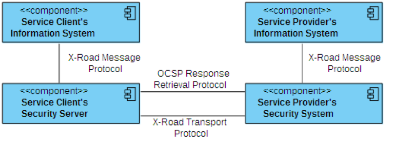
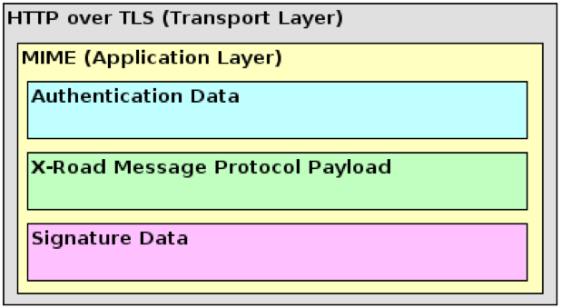
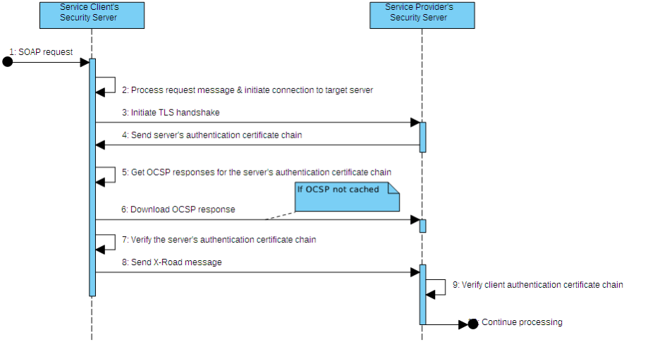

# X-Road: Message Transport Protocol
**Technical Specification**

Version: 2.6  
01.06.2023  
Doc. ID: PR-MESSTRANSP

---

## Version history

Date       | Version | Description                                                                                       | Author
-----------|---------|---------------------------------------------------------------------------------------------------|---------------------
01.07.2015 | 0.6     | Translated to English	                                                                            | Siim Annuk
14.07.2015 | 0.7     | Total restructuring	                                                                              | Ilja Kromonov
11.08.2015 | 0.8     | Comments added	                                                                                   | Margus Freudenthal
11.08.2015 | 0.9     | Fixes according to comments	                                                                      | Siim Annuk
27.08.2015 | 1.0     | Minor improvements	                                                                               | Siim Annuk
28.08.2015 | 1.1     | Comments and editorial changes	                                                                   | Margus Freudenthal
28.08.2015 | 1.2     | More fixes according to comments	                                                                 | Siim Annuk
31.08.2015 | 1.3     | Made minor editorial changes	                                                                     | Margus Freudenthal
09.09.2015 | 2.0     | Editorial changes made	                                                                           | Imbi Nõgisto
14.10.2015 | 2.1     | Changes added about HTTP headers and attachments. Ports 5500 and 5577 are default configuration.	 | Siim Annuk
17.10.2015 | 2.2     | Anchored the figures in place	                                                                    | Margus Freudenthal
01.03.2019 | 2.3     | X-Request-Id header	                                                                              | Caro Hautamäki
04.03.2019 | 2.4     | Converted into Markdown	                                                                          | Caro Hautamäki
22.10.2020 | 2.5     | Added REST message protocol                                                                       | Janne Mattila
01.06.2023 | 2.6     | Update references                                                                                 | Petteri Kivimäki

## Table of Contents

<!-- toc -->

- [License](#license)
- [1 Introduction](#1-introduction)
  * [1.1 Overview](#11-overview)
  * [1.2 Terms and Abbreviations](#12-terms-and-abbreviations)
  * [1.3 References](#13-references)
- [2 Transport Layer](#2-transport-layer)
  * [2.1 TLS Authentication](#21-tls-authentication)
  * [2.2 Downloading OCSP Responses from Service Providers](#22-downloading-ocsp-responses-from-service-provider)
- [3 Application Layer](#3-application-layer)
  * [3.1 X-road Transport Message](#31-x-road-transport-message)
  * [3.2 Message Handling in Service Client's Security Server](#32-message-handling-in-service-clients-security-server)
  * [3.3 Message Handling in Service Provider's Security Server](#33-message-handling-in-service-providers-security-server)
- [4 Annex: Example Messages](#4-annex-example-messages)
  * [4.1 Response to OCSP Downloading Request](#41-response-to-ocsp-downloading-request)
  * [4.2 Simple SOAP Request](#42-simple-soap-request)
  * [4.3 Simple SOAP Response](#43-simple-soap-response)
  * [4.4 SOAP Request with Attachments](#44-soap-request-with-attachments)
  * [4.5 SOAP Response with Fault as Last Part](#45-soap-response-with-fault-as-last-part)
  * [4.6 REST Request](#46-rest-request)
  * [4.7 REST Response](#47-rest-response)

<!-- tocstop -->

## License

This document is licensed under the Creative Commons Attribution-ShareAlike 3.0 Unported License. To view a copy of this license, visit http://creativecommons.org/licenses/by-sa/3.0/

## 1 Introduction

This document describes the communications protocol that is used by service client's and service provider's security servers to exchange messages with each other.

### 1.1 Overview

<a id="Messtransport_protocol_overview" class="anchor"></a>


Figure 1. Protocols used in the X-Road system

As can be seen from [Figure 1](#Messtransport_protocol_overview), three protocols are involved when exchanging messages between a service client and a service provider. These include:
- X-Road message protocol – used for communication between an information system and a security server within an organization
  - There are two types of X-Road message protocols, one for SOAP and one for REST
  - X-Road message protocol (for SOAP) is a profile of the SOAP protocol (<http://www.w3.org/TR/2000/NOTE-SOAP-20000508/>).
  See [PR-MESS](#Ref_PR-MESS) for details.
  - X-Road message protocol for REST is a protocol for consuming and producing REST services.
  See [PR-REST](#Ref_PR-REST) for details.
  - Same message protocol needs to be used in both ends. Using _message protocol for REST_ between service client's information system and
  security server, and _message protocol for SOAP_ between service provider's security server and information system is not supported.

- X-Road message transport protocol – a synchronous secure communication protocol that provides confidentiality and integrity when exchanging messages between two security servers over the public Internet. This protocol is described in the current document.

- OCSP Response Retrieval Protocol – the protocol used in parallel with the X-Road message transport protocol when establishing a secure communications channel between the service client's and the service provider's security servers (see [Section 2.2](#22-downloading-ocsp-responses-from-service-provider) for details).

The communication protocol is divided into two layers ([Figure 2](#Messtransport_protocol_layers)) – the transport layer and the application layer. The transport layer uses HTTP over mutually authenticated TLS; see  [Section 2](#2-transport-layer)  for details on how the TLS session is established. The application layer consists of MIME multipart encoded X-Road transport messages that are exchanged over the transport layer (HTTPS); see [Section 3](#3-application-layer) for the exact format of the message and how it's processed.

The service client's security server encapsulates the request message it receives from the service client into an X-Road transport message and in turn receives an X-Road transport message (message format described in [Section 3.1](#31-x-road-transport-message)) from the service provider's security server before forwarding the encapsulated response back to the service client (process described in detail in [Section 3.2](#32-message-handling-in-service-clients-security-server)).
 
The service provider's security server receives the X-Road transport message from the service client's security server and forwards the encapsulated request message to the service provider. The service provider's security server encapsulates the response from the service provider into an X-Road transport message and sends it to the service client's security server (process described in detail in [Section 3.3](#33-message-handling-in-service-providers-security-server)).

Chapters [2](#2-transport-layer) and [3](#3-application-layer), as well as the annex of this specification contain normative information. All the other sections are informative in nature. All the references are normative.

This specification does not include option for partially implementing the protocol – the conformant implementation must implement the entire specification.

<a id="Messtransport_protocol_layers" class="anchor"></a>


Figure 2. Layers of the X-Road message transport protocol

### 1.2 Terms and Abbreviations

See X-Road terms and abbreviations documentation \[[TA-TERMS](#Ref_TERMS)\].

### 1.3 References

1. <a id="Ref_PR-SIGDOC" class="anchor"></a>\[PR-SIGDOC\] Freudenthal, Margus. Profile for High-Perfomance Digital Signature. Cybernetica Research Reports, T-4-23, 2015 <https://cyber.ee/research/reports/>

2. <a id="Ref_BATCH-TS" class="anchor"></a>\[BATCH-TS\] Freudenthal, Margus. Using Batch Hashing for Signing and Time-Stamping. Cybernetica Research Reports, T-4-20, 2013 <https://cyber.ee/research/reports/>

3. <a id="Ref_PR-MESS" class="anchor"></a>\[PR-MESS\] X-Road: Message Protocol v4.0. Document ID: [PR-MESS](../Protocols/pr-mess_x-road_message_protocol.md).

4. <a id="Ref_TERMS" class="anchor"></a>\[TA-TERMS\] X-Road Terms and Abbreviations. Document ID: [TA-TERMS](../terms_x-road_docs.md).

5. <a id="Ref_PR-REST" class="anchor"></a>\[PR-REST\] X-Road: Message Protocol for REST. Document ID: [PR-REST](../Protocols/pr-rest_x-road_message_protocol_for_rest.md).

## 2 Transport Layer

### 2.1 TLS Authentication

Security servers use authentication certificates to initiate a mutually authenticated message exchange. Each security server's authentication certificate must be registered at the central server. The certification service provider that issued these certificates must be approved by the central server. Therefore, certificate chains constructed when authenticating the connection must include certificates up to the issuing certificate of the trusted certification service provider that is registered at the central server as an approved certification authority.

The process of establishing of a secure communication channel can be described by the following steps.

1. An X-Road request message arrives at the service client's security server.

2. Service client's security server processes the request and determines the target service provider's security server.

3. Service client's security server initiates the TLS handshake with the target service provider's security server on port 5500 (default configuration).

4. Service client's security server receives the authentication certificate chain of the service provider's security server as part of the TLS handshake.

5. Service client's security server checks if the local OCSP cache contains OCSP responses for the received certificates.

6. If the OCSP responses are not cached, the service client's security server must download them from the service provider's security server and cache them locally (see [Section 2.2](#22-downloading-ocsp-responses-from-service-provider) for details).

7. Service client's security server verifies that the authentication certificate of the service provider's security server was issued by an approved certification service provider and builds the certification chain for the authentication certificate. The certification chain and corresponding OCSP responses are then verified.

8. If verification is successful, the service client's security server forwards the X-Road transport message to the service provider's security server. If verification failed, the service client's security server sends a SOAP Fault message back to the service client's information system.

9. Having received the X-Road transport message, the service provider's security server verifies the service client's authentication certificate chain using the global configuration.

This process is illustrated in the sequence diagram in Figure 3.

<a id="Messtransport_protocol_auth" class="anchor"></a>


Figure 3. TLS authentication

### 2.2 Downloading OCSP Responses from Service Provider

Each X-Road security server only interacts with the CA that issued the certificates used by it. For this reason, the OCSP responses for certificates are always transferred together with the certificates themselves. The security servers cache the OCSP responses for their certificates and periodically update this cache.

The service client's security server sends the OCSP responses for authentication certificate as part of the request message. However, before sending the request the client's security server must verify service provider's security server's authentication certificate. Because the OCSP stapling specification is not widely implemented yet, the client's security server downloads the OCSP responses from the service provider's security server using a separate channel (HTTP).

Service provider's security server must respond to HTTP GET requests to port 5577 (default configuration). In the HTTP GET request the client's security server indicates the certificates whose OCSP responses are requested. For this, the client includes cert query parameters whose content is hexadecimally encoded SHA-1 hashes of the certificates. For example, the following URL is used to retrieve OCSP responses for two certificates: 

`http://SECURITYSERVER:5577/?cert=a1b2c3d4e5&cert=f6g7h8i9j0`

where SECURITYSERVER is the address of the service provider's security server.

As a response to this request the service responds with a MIME multipart message (`multipart/related`). Each part of this message must contain a requested OCSP responses with content-type `application/ocsp-response`. See Annex [4.1](#41-response-to-ocsp-downloading-request) for an example response.

## 3 Application Layer

The integrity of transmitted message is ensured by signing the X-Road transport message in the security server. The signature can be either a regular signature or a batch signature. Batch signatures must be created for messages that contain attachments. If a signing key is located on a slow secure signature creation device then batch signatures may be used when signing many messages simultaneously. See \[[PR-SIGDOC](#Ref_PR-SIGDOC)\] for more information about how signatures are created.

The X-Road message transport protocol is designed for streaming the message contents (e.g. attachments) between security servers. The signature can be calculated after the previous parts (e.g. attachments) of the transport message have been transferred to the other party. Streaming the message contents puts restrictions on how the signature of the transport message must be verified. The contents of the transport message must be cached in the security server before the signature of the message can be verified, because the verification result determines the validity of the message – the security server must not forward an invalid message to the other party.

### 3.1 X-Road Transport Message

<a id="Messtransport_message" class="anchor"></a>


Figure 4. X-Road transport messages

The X-Road transport messages are encoded as MIME multipart messages with content-type `multipart/mixed`.

For SOAP messages, the content-type of the client request message is sent from the service client's security server
to the service provider's security server and vice versa using the `x-original-content-type` HTTP header.
The value of the original content type is used to forward the request or response message to the service provider's
or service client's information system. All other HTTP headers sent by the service client's security server or service
provider's security server are not preserved in the security server. MIME headers in the multipart message are preserved.

For REST messages, the content-type of the client request message is sent from the service client's security server
to the service provider's security server and vice versa using the `application/x-road-rest-request` and
`application/x-road-rest-response` parts, which contain "REST header part" of the REST request or response.
REST header part consists of HTTP request line (for requests), HTTP status line (for responses), and HTTP headers (for both).
Besides `Content-Type` header, also other headers may be preserved by the security server, but the processing varies.
Some new headers are added (replaced if one already exists) by the security server, for example `x-road-request-id`.
Some headers will be removed, for example `User-Agent`.
All other headers are passed through as-is, for example `X-Powered-By`.
For details, see \[[PR-REST](#Ref_PR-REST)\] and "Use of HTTP Headers".

The X-Road transport message encapsulates either the SOAP/REST message package that arrives to the security server or a
SOAP fault message (uses content-type `text/xml` instead of `multipart/mixed`). The latter is only sent from the
service provider's security server to the service client's security server if an error occurred before processing the
request message in the service provider's security server. The normal X-Road request message must consist of the
following MIME message parts (see [Figure 4](#Messtransport_message)). The parts are mandatory unless stated otherwise:

1. byte contents of OCSP responses (content-type `application/ocsp-response`) of the service client's security server authentication certificate chain that was used to authenticate the TLS connection;

2. (optional, either this or REST message must exist) the SOAP message (content-type `text/xml` or `application/xop+xml` in case the original message is a MTOM-encoded SOAP message package);

3. (optional) a nested MIME multipart (content-type `multipart/mixed`) containing all attachments as parts. This part is only present if the original SOAP message package contains attachments;

4. (optional, either this or SOAP message must exist) the REST message header (content-type `application/x-road-rest-request`)

5. (optional) a REST request body (content-type `application/x-road-rest-body`) This part is only present if the REST request contains a body.

6. (optional) if the signature is a batch signature, then:

    a) the hash chain result XML (content-type `application/hash-chain-result`) and

    b)	the hash chain XML (content-type `application/hash-chain`) of the signature.

7. the signature XML (content-type `signature/bdoc-1.0/ts`) associated with the SOAP/REST message and any attachments of the encapsulated message;

The normal X-Road response message must consist of the following MIME message parts (see [Figure 4](#Messtransport_message)). The parts are mandatory unless stated otherwise:

1. (optional, either this or REST message must exist) the SOAP message (content-type `text/xml` or `application/xop+xml` in case the original message is a MTOM-encoded SOAP message package);

2. (optional) a nested MIME multipart (content-type `multipart/mixed) containing all attachments as parts. This part is only present if the original SOAP message package contains attachments;

3. (optional, either this or SOAP message must exist) the REST message header (content-type `application/x-road-rest-response`)

4. (optional) a REST response body (content-type `application/x-road-rest-body`) This part is only present if the REST response contains a body.

5. (optional) if the signature is a batch signature, then:

    a)	the hash chain result XML (content-type `application/hash-chain-result`) and

    b)	the hash chain XML (content-type `application/hash-chain`) of the signature.

6. one of the following:

    a)	the signature XML (content-type `signature/bdoc-1.0/ts`) associated with the SOAP message and any attachments of the encapsulated message; or

    b)	a SOAP fault XML (content-type `text/xml`), if any errors occurred during the processing of the message (i.e. error when creating signature). Since the previous parts of the message have already been sent to the other party, the SOAP fault must be sent as the last part.

### 3.2 Message Handling in Service Client's Security Server

The following describes the actions that the service client's security server must take in order to perform a secure message exchange between a service client and a service provider.

1. Receive a REST request, SOAP message or a SOAP message package (if attachments are present) from the service client (message format described in [PR-MESS](#Ref_PR-MESS)).

2. Parse either the SOAP message or `X-Road-Client` header to determine the target service provider.

3. Establish TLS connection with it's security server (see [Section 2.1](#21-tls-authentication)).

4. Send an X-Road transport message to the service provider's security server (message format described in [Section 3.1](#31-x-road-transport-message)) in the following steps:

    a)	For SOAP and REST messages, add the following HTTP headers to the HTTP headers of the HTTP request:

    * UUID (`x-road-request-id`). The id is shared between request/response pairs so one can easily find corresponding messages from logs if needed.

    * Hash algorithm identifier (`x-hash-algorithm`). The hash algorithm is used by the other party to calculate the hashes of the message parts to be used during message verification.

    * Original content type (`x-original-content-type`) of the request message.
    
    * Version (`x-proxy-version`) of the client X-Road proxy
    
    * (only for SOAP messages) original SOAPAction (`x-original-soapaction`)

    b)	For REST messages, add the following additional HTTP header:

    * Message type discriminator (`x-road-message-type`) with value `REST`

    c) Write an OCSP response part to the transport message (content-type `application/ocsp-response`) for each OCSP response in the authentication certificate chain used for establishing the TLS connection.

    d) For SOAP messages, write the service client's request SOAP message (content-type `text/xml` or `application/xop+xml` in case the original message is a MTOM-encoded SOAP message package) to the transport message. Calculate the hash of the request SOAP message.

    e) If the original request was a SOAP message package, write a nested MIME multipart (content-type `multipart/mixed`) containing all attachments as parts. Copy the MIME headers of each attachment part and calculate the hash of the data. 

    f) For REST messages, write the REST request header part (content-type `application/x-road-rest-request`). This part contains HTTP request line and HTTP headers. Calculate the hash of this part.

    * Some new headers must be added (replaced if one already exists) by the security server, for example `x-road-request-id`

    * Some headers must be removed, for example `User-Agent`

    * All other headers must be copied from original request as-is, for example `X-Powered-By`

    * For details, see \[[PR-REST](#Ref_PR-REST)\] and "Use of HTTP Headers"

    g) For REST messages with a request body, write the part containing the REST request body (content-type `application/x-road-rest-body`). Calculate the hash of the body.

    h) Calculate the signature using the stored message and attachment hashes in accordance with \[[PR-SIGDOC](#Ref_PR-SIGDOC), [BATCH-TS](#Ref_BATCH-TS)\]. Write the signature as the last part of the message (content-type `signature/bdoc-1.0/ts`).

5. Start reading a response from the target service provider's security server (message format described in [Section 3.1](#31-x-road-transport-message).

6. If the content-type of the response is `multipart/mixed` then process the message parts as follows:

    a) The first part must be the encapsulated SOAP response message or REST response message. The message is not forwarded to the service client until it can be verified.

    b) SOAP response is identified by content-type `text/xml` or `application/xop+xml` in case the response is a MTOM-encoded SOAP message package. 

    1. If the content-type of the next part is `multipart/mixed` then this part is the nested attachments multipart. 

    c) REST response is identified by content-type `application/x-road-rest-response`
    
    1. REST response header part has content-type `application/x-road-rest-response`. This part contains the HTTP status line and HTTP headers.

    2. If the content-type of the next part is `application/x-road-rest-body` then this part is the body of the REST response. For responses without a body, this part does not exist.
    
    d) If the content-type of the next part is `application/hash-chain-result` then this message contains a batch signature. The hash chain result is stored for message verification.

    e) If the content-type of the next part is `application/hash-chain` then this message contains a batch signature. The hash chain is stored for message verification. The hash chain result must be present if the hash chain is present.

    f) If the content-type of the last part is `signature/bdoc-1.0/ts` then the part contains the signature of the message. If the content-type of the part is `text/xml` then the part contains a SOAP fault indicating that an error occurred during the processing of the message in the service provider's security server and it must be returned to the service client.

If the content-type of the response is `text/xml` then an error occurred at the service provider's security server and the received SOAP Fault must be returned to the service client. In case of any other content-type, the response is malformed and a corresponding SOAP Fault must be returned to the service client.

7. Verify the response message using the stored message hash, attachment hashes, and signature in accordance with \[[PR-SIGDOC](#Ref_PR-SIGDOC), [BATCH-TS](#Ref_BATCH-TS)\].

8. Send the service provider's REST response, encapsulated response SOAP message, or a SOAP message package in case the response has attachments to the service client.

    a) For REST responses, response HTTP headers are copied from `application/x-road-rest-response`

<a id="Messtransport_protocol_message_processing_client" class="anchor"></a>


Figure 5. Message processing on service client's side

### 3.3 Message Handling in Service Provider's Security Server

The following describes the actions that the service provider's security server must take in order to perform a secure message exchange between a service client and a service provider.

1. Establish TLS connection with the service client's security server (see [Section 2.1](#21-tls-authentication)).

2. Start reading the X-Road transport message from the service client's security server (message format described in [Section 3.1](#31-x-road-transport-message)).

3. The content-type of the request message must be `multipart/mixed`. The security server must process the message parts as follows:

    a) Read all the parts with content-type `application/ocsp-response`. These parts contain OCSP responses that must be used in when verifying the authentication certificate chain of the service client's security server.

    b) The part that comes after OCSP responses must be either a SOAP or REST request
    
    c) SOAP request is identified by content-type `text/xml` or `application/xop+xml`

    1. If content-type is `text/xml`, this part contains a regular SOAP request. If content-type is `application/xop+xml` this part contains the encapsulated SOAP request message for a MTOM-encoded SOAP message package. The message is not forwarded to the service provider until it can be verified.

    2. If the content-type of the next part is `multipart/mixed` then this part is the nested attachments multipart.

    d) REST request is identified by content-type `application/x-road-rest-request`

    1. REST request header part has content-type `application/x-road-rest-response`. This part contains the HTTP request line and HTTP headers.

    2. If the content-type of the next part is `application/x-road-rest-body` then this part is the body of the REST request. For requests without a body, this part does not exist.

    d) If the content-type of the next part is `application/hash-chain-result` then this message contains a batch signature. The hash chain result is stored for message verification.

    e) If the content-type of the next part is `application/hash-chain` then this message contains a batch signature. The hash chain is stored for message verification.

    f) If the content-type of the last part is `signature/bdoc-1.0/ts` then the part contains the signature of the message. If the content-type of the last part is `text/xml` then the part contains a SOAP fault indicating that an error occurred during the processing of the message in the service client's security server.

4. Verify the request message using the stored message hash, attachment hashes, and signature in accordance with \[[PR-SIGDOC](#Ref_PR-SIGDOC), [BATCH-TS](#Ref_BATCH-TS)\].

5. Either send the encapsulated SOAP message and any attachments to the target service provider, or execute a REST request against target service provider.

6. Start reading a response from the target service provider (message format described in [PR-MESS](#Ref_PR-MESS)).

7. Send an X-Road transport message to the service client's security server (message format described in [Section 3.1](#31-x-road-transport-message)) in the following steps:

    a) Add the following HTTP headers to the HTTP headers of the HTTP request:

    * Hash algorithm identifier (`x-hash-algorithm`). The hash algorithm is used by the other party to calculate the hashes of the message parts to be used during message verification.

    * Only in the case of SOAP messages, original content type (`x-original-content-type`) of the request message.

    b) For SOAP messages, write the service provider's response SOAP message (content-type `text/xml` or `application/xop+xml` in case the original message is a MTOM-encoded SOAP message package). Calculate the hash of the response SOAP message to be used when creating the signature.

    c) If the response from the service provider was a SOAP message package, write a nested MIME multipart (`multipart/mixed`) containing all attachments as parts. For each part, calculate the hash of the data to be used when creating the signature.

    d) For REST messages, write the REST response header part (content-type `application/x-road-rest-response`). This part contains HTTP status line and HTTP headers. Calculate the hash of the response message to be used when creating the signature.

    * Some new headers must be added (replaced if one already exists) by the security server, for example `x-road-request-id`

    * Some headers must be removed, for example `User-Agent`

    * All other headers must be copied from original request as-is, for example `X-Powered-By`

    * For details, see \[[PR-REST](#Ref_PR-REST)\] and "Use of HTTP Headers"

    e) If the response from the service provider contained a REST message body, write the part containing this (content-type `application/x-road-rest-body`). Calculate the hash of the body to be used when creating the signature. 

    f) Calculate the signature using the stored message and attachment hashes in accordance with \[[PR-SIGDOC](#Ref_PR-SIGDOC), [BATCH-TS](#Ref_BATCH-TS)\]. Write the signature as the last part of the message (content-type `signature/bdoc-1.0/ts`).
    
<a id="Messtransport_protocol_message_processing_service_provider" class="anchor"></a>


Figure 6. Message processing on service provider's side

## 4 Annex: Example Messages

All the example messages only contain the relevant HTTP headers (content-type) and the headers of the MIME parts. The contents of the MIME parts are omitted for brevity.

### 4.1 Response to OCSP Downloading Request

```http
Content-Type: multipart/related; charset=UTF-8; boundary=jetty625909216ic7gfi1u 

--jetty625909216ic7gfi1u 
Content-Type: application/ocsp-response 

...bytes of the ASN.1-encoded OCSP response...
--jetty625909216ic7gfi1u--
```

### 4.2 Simple SOAP Request

```http
Content-Type: multipart/mixed; charset=UTF-8; boundary=xtop1357783211hcn1yiro 

--xtop1357783211hcn1yiro 
Content-Type: application/ocsp-response 

...ocsp response...
--xtop1357783211hcn1yiro 
Content-Type: text/xml ; charset=UTF-8

...request SOAP...
--xtop1357783211hcn1yiro 
Content-Type: signature/bdoc-1.0/ts 

...signature XML...
--xtop1357783211hcn1yiro--
```

### 4.3 Simple SOAP Response

```http
Content-Type: multipart/mixed; charset=UTF-8; boundary=xatt569125687hcu8vfma

--xatt569125687hcu8vfma
Content-Type: text/xml ; charset=UTF-8

...response SOAP...
--xatt569125687hcu8vfma
Content-Type: signature/bdoc-1.0/ts 

...signature XML...
--xatt569125687hcu8vfma--
```

### 4.4 SOAP Request with Attachments

```http
Content-Type: multipart/mixed; charset=UTF-8; boundary=xtop1357783211hcn1yiro
 
--xtop1357783211hcn1yiro 
Content-Type: application/ocsp-response 

...ocsp response...
--xtop1357783211hcn1yiro
Content-Type: text/xml; charset=UTF-8

...request SOAP...
--xtop1357783211hcn1yiro 
Content-Type: multipart/mixed; charset=UTF-8; boundary=xtop569125687h3h10du0 

--xtop569125687h3h10du0
Content-Type: text/plain; charset=UTF-8
Content-Location: attachment.txt
 
...attachment data...
--xtop569125687h3h10du0 
Content-Type: application/octet-stream
Content-Transfer-Encoding: base64
Content-Id: <data.bin>

...attachment data...
--xtop569125687h3h10du0 --

--xtop1357783211hcn1yiro 
Content-Type: application/hash-chain-result

...hash chain result XML...
--xtop1357783211hcn1yiro 
Content-Type: application/hash-chain

...hash chain XML...
--xtop1357783211hcn1yiro 
Content-Type: signature/bdoc-1.0/ts 

...signature XML...
--xtop1357783211hcn1yiro--
```

### 4.5 SOAP Response with Fault as Last Part

```http
Content-Type: multipart/mixed; charset=UTF-8; boundary=xatt569125687hcu8vfma

--xatt569125687hcu8vfma
Content-Type: text/xml; charset=UTF-8

...response SOAP...
--xatt569125687hcu8vfma
Content-Type: text/xml; charset=UTF-8

...SOAP fault...
--xatt569125687hcu8vfma--
```

### 4.6 REST Request

```http
Content-Type: multipart/mixed; charset=UTF-8; boundary=xtopVuvPTiuLRQanuYKzamfNZBOlxZclEe

--xtopVuvPTiuLRQanuYKzamfNZBOlxZclEe
content-type: application/ocsp-response

...ocsp response...
--xtopVuvPTiuLRQanuYKzamfNZBOlxZclEe
content-type: application/x-road-rest-request

...REST request header...
--xtopVuvPTiuLRQanuYKzamfNZBOlxZclEe
content-type: application/x-road-rest-body

...REST request body...
--xtopVuvPTiuLRQanuYKzamfNZBOlxZclEe
content-type: application/hash-chain-result

...hash chain result XML...
--xtopVuvPTiuLRQanuYKzamfNZBOlxZclEe
content-type: application/hash-chain

...hash chain XML...
--xtopVuvPTiuLRQanuYKzamfNZBOlxZclEe
content-type: signature/bdoc-1.0/ts

...signature XML...
--xtopVuvPTiuLRQanuYKzamfNZBOlxZclEe--
```

### 4.7 REST Response

```http
Content-Type: multipart/mixed; charset=UTF-8; boundary=xtoptrgBinKkBvoijBRQYWabkZvkECcuIH

--xtoptrgBinKkBvoijBRQYWabkZvkECcuIH
content-type: application/x-road-rest-response

...REST response header...
--xtoptrgBinKkBvoijBRQYWabkZvkECcuIH
content-type: application/x-road-rest-body

...REST response body...
--xtoptrgBinKkBvoijBRQYWabkZvkECcuIH
content-type: application/hash-chain-result

...hash chain result XML...
--xtoptrgBinKkBvoijBRQYWabkZvkECcuIH
content-type: application/hash-chain

...hash chain XML...
--xtoptrgBinKkBvoijBRQYWabkZvkECcuIH
content-type: signature/bdoc-1.0/ts

...signature XML...
--xtoptrgBinKkBvoijBRQYWabkZvkECcuIH--
```
