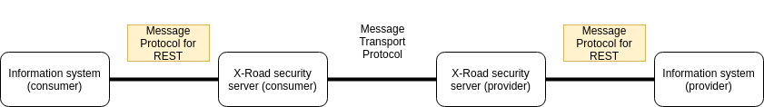

# X-Road: Message Protocol for REST

**Technical Specification**

Version: 1.0.3    
Doc. ID: PR-REST

---

## Version history

| Date       | Version | Description                                                                                                                                                                                                                                                                                                                                                                                                                                                                                                                                                                                                                                                                                                                                                                                     | Author                                                                                                 |
|:-----------|:--------|:------------------------------------------------------------------------------------------------------------------------------------------------------------------------------------------------------------------------------------------------------------------------------------------------------------------------------------------------------------------------------------------------------------------------------------------------------------------------------------------------------------------------------------------------------------------------------------------------------------------------------------------------------------------------------------------------------------------------------------------------------------------------------------------------|:-------------------------------------------------------------------------------------------------------|
| 02.10.2018 | 0.1.0   | Initial draft version                                                                                                                                                                                                                                                                                                                                                                                                                                                                                                                                                                                                                                                                                                                                                                           | Ilkka Seppälä                                                                                          |
| 30.10.2018 | 0.2.0   | <ul><li>Multiple phrasing improvements</li><li>Protocol version format changed to 'r1' from 'v1'</li><li>Introduced serviceId concept</li><li>Image updated</li><li>Improved error handling</li><li>Introduced security section</li><li>Clarified REST interface section</li><li>Add default content-type</li><li>Clarified optional X-Road headers</li><li>Clarified error handling</li></ul>                                                                                                                                                                                                                                                                                                                                                                                                  | Ilkka Seppälä <br /> Petteri Kivimäki <br /> Jarkko Hyöty                                              |
| 11.01.2019 | 0.3.0   | <ul><li>Remove constant prefix `/rest` from the protocol</li><li>Consumer ID is specified with HTTP headers instead of encoding it to the request URL</li><li>Clarified service id and client id encoding (percent-encoded UTF-8)</li><li>Changes to "Use of HTTP Headers" section <br /> - Clarified user defined headers rules <br /> - Added filtered headers section <br /> - Added cache headers section <br /> - Added cross-origin resource sharing section <br /> - Clarified Content-Type header <br /> - Added explanation of specially handled headers </li><li>Added HTTP version to "Scope and Requirements" chapter</li><li>Use OpenAPI 3.0 service description</li><li>Updated the examples according to REST guidelines</li><li>Added section about HTTP redirections</li></ul> | Ilkka Seppälä <br /> Petteri Kivimäki <br /> Jarkko Hyöty <br /> Janne Mattila <br /> Lauri Koutaniemi |
| 21.02.2019 | 0.4.0   | <ul><li>Added chapter 1.2 containing general description about REST architectural style</li><li>Clarified 3.2 objectives</li><li>Clarified 'X-Road-UserId' header</li><li>Added 4.3 request hash header</li><li>Added 4.6 example 5 about tracking the source of error</li><li>Clarified 2.3 protocol versioning</li><li>Minor grammar changes to 4.1</li><li>Added a warning to 4.4 about following redirects</li><li>Fixed 4.6 example 2 -> X-Road-Error header added</li><li>Clarified 4.6 user defined headers</li><li>Clarified 5.1 what is the role of OpenAPI 3</li><li>Updated the response body format in 4.6 error handling</li><li>Added X-Road-Security-Server header to 4.3 to make it possible to call monitoring via REST</li></ul>                                              | Ilkka Seppälä <br /> Petteri Kivimäki <br /> Jarkko Hyöty                                              |
| 22.03.2019 | 0.5.0   | <ul><li>Clarified 1.1 overview</li><li>Clarified 3.2 objectives</li><li>Added to 4.3 chapter "X-Road specific headers returned in the response"</li><li>Clarified the use of X-Road-Id in 4.3</li><li>Removed chapter 5.2 where it was recommended to use \[REST-BEST-PRACTISES\]</li><li>Updated examples in chapters 4.6 and 6</li><li>Updated request hash description in 4.3</li></ul>                                                                                                                                                                                                                                                                                                                                                                                                      | Ilkka Seppälä <br /> Petteri Kivimäki <br /> Jarkko Hyöty                                              |
| 22.03.2019 | 0.9.0   | Initial Markdown documentation                                                                                                                                                                                                                                                                                                                                                                                                                                                                                                                                                                                                                                                                                                                                                                  | Caro Hautamäki                                                                                         |
| 25.04.2019 | 1.0.0   | Update document version number                                                                                                                                                                                                                                                                                                                                                                                                                                                                                                                                                                                                                                                                                                                                                                  | Jarkko Hyöty                                                                                           |
| 19.05.2020 | 1.0.1   | Added chapter [4.8 Identifier Character Restrictions](#48-identifier-character-restrictions)                                                                                                                                                                                                                                                                                                                                                                                                                                                                                                                                                                                                                                                                                                    | Ilkka Seppälä                                                                                          |
| 27.05.2022 | 1.0.2   | <ul><li>Added `X-Road-Represented-Party` extension header to 4.3</li><li>Updated `X-Road-Client` header description in 4.3</ul>                                                                                                                                                                                                                                                                                                                                                                                                                                                                                                                                                                                                                                                                 | Petteri Kivimäki                                                                                       |
| 15.06.2023 | 1.0.3   | Stricter identifier character restrictions                                                                                                                                                                                                                                                                                                                                                                                                                                                                                                                                                                                                                                                                                                                                                      | Madis Loitmaa                                                                                          |

## License

This document is licensed under the Creative Commons Attribution-ShareAlike 3.0 Unported License. To view a copy of this
license, visit http://creativecommons.org/licenses/by-sa/3.0/

## Table of Contents

<!-- toc -->
<!-- vim-markdown-toc GFM -->

* [1 Introduction](#1-introduction)
    * [1.1 Overview](#11-overview)
    * [1.2 REST](#12-rest)
* [2 Definitions](#2-definitions)
    * [2.1 Key Words](#21-key-words)
    * [2.2 X-Road Terminology](#22-x-road-terminology)
    * [2.3 Versioning](#23-versioning)
    * [2.4 References](#24-references)
* [3 Scope](#3-scope)
    * [3.1 Scope and Requirements](#31-scope-and-requirements)
    * [3.2 Objectives](#32-objectives)
* [4 Message Format](#4-message-format)
    * [4.1 REST Interface](#41-rest-interface)
    * [4.2 URI Sanitation](#42-uri-sanitation)
    * [4.3 Use of HTTP Headers](#43-use-of-http-headers)
    * [4.4 HTTP Redirects](#44-http-redirects)
    * [4.5 Use of Query Parameters](#45-use-of-query-parameters)
    * [4.6 Error handling](#46-error-handling)
        * [Example 1 (Category 1)](#example-1-category-1)
        * [Example 2 (Category 2)](#example-2-category-2)
        * [Example 3 (Category 3)](#example-3-category-3)
        * [Example 4 (Category 4)](#example-4-category-4)
        * [Example 5 (Tracking the source of error)](#example-5-tracking-the-source-of-error)
    * [4.7 Security](#47-security)
    * [4.8 Identifier Character Restrictions](#48-identifier-character-restrictions)
* [5 Services](#5-services)
    * [5.1 Describing Services](#51-describing-services)
* [6 Examples](#6-examples)
    * [6.1 General](#61-general)
    * [6.2 GET Request and Response](#62-get-request-and-response)
    * [6.3 PUT Request and Response](#63-put-request-and-response)
    * [6.4 POST Request and Response](#64-post-request-and-response)
    * [6.5 DELETE Request and Response](#65-delete-request-and-response)
    * [6.6 POST Request with Attachments and Response](#66-post-request-with-attachments-and-response)
* [Appendix 1 Example Service Definition](#appendix-1-example-service-definition)

<!-- vim-markdown-toc -->

## 1 Introduction

### 1.1 Overview

Representational State Transfer \[[REST](#Ref_RFC2119)\] is an architectural style that
defines a set of constraints to be used for creating web services. Web
services that conform to the \[[REST](#Ref_RFC2119)\] architectural style, or RESTful web
services, provide interoperability between computer systems on the
Internet. REST-compliant web services allow the requesting systems to
access and manipulate representations of web resources by using a
uniform and predefined set of stateless operations. In the REST
architectural style, the client and server implementations can be
independent as long as they know the format of messages to send each
other.

This document describes the X-Road Message Protocol for \[[REST](#Ref_RFC2119)\]. The protocol is used in X-Road
infrastructure between information systems and X-Road Security Servers to consume and produce REST
services. Between the Security Servers there is another protocol called X-Road Message Transport
Protocol which is described in its own document \[[PR-MESSTRANSP](#Ref_XMESSTP)\].



### 1.2 REST

In the REST architecture, clients send requests to retrieve, modify or delete resources. Servers send responses to these
requests. In general a request consists of

- HTTP verb, which defines the kind of operation to perform
- header, which allows the client to pass along information about the request
- path to a resource
- an optional message body containing data

Typically four different HTTP verbs are used to interact with the resources in REST system

- GET - retrieve a resource
- POST - create new resource
- PUT - update a resource
- DELETE - delete a resource

The most common headers used in RESTful communication are `Accept` and `Content-Type`. By including the `Accept` header
in the request the client specifies the content types it is able to read. When reading the request, the server should
respect the `Accept` header and provide the response in the specified format. The server sets the `Content-Type` header
in the response message to reveal the actual type of content.

The requests need to specify the path to the resource it is operating on. There are no strict rules how the paths have
to be defined, but there are commonly used recommendations. In RESTful APIs, the paths should be designed logically and
consistently so that the operations are easy to use for the client. For example a
request `GET https://petstore.niis.org/v2/pets/1124` will read a certain pet's information
and `POST https://petstore.niis.org/v2/pets` will create a new pet.

The response indicates the result of the operation with HTTP status code. The expected status code of success varies
depending on the requested operation.

- GET - 200 OK
- POST - 201 CREATED
- PUT - 200 OK
- DELETE - 204 NO CONTENT

Also when the operation fails, the reason is indicated with HTTP status. Some of the most common error codes are listed
below.

- 400 BAD REQUEST
- 404 NOT FOUND
- 500 INTERNAL SERVER ERROR

## 2 Definitions

### 2.1 Key Words

The key words "MUST", "MUST NOT", "REQUIRED", "SHALL", "SHALL NOT", "SHOULD", "SHOULD NOT", "RECOMMENDED", "MAY", and "
OPTIONAL" in this document (in uppercase, as shown) are to be interpreted as described in \[[RFC2119](#Ref_RFC2119)\].

### 2.2 X-Road Terminology

The X-Road specific terminology such as instance, member class, member and subsystem are described in the document
\[[XROAD-TERMS](#Ref_TERMS)\].

### 2.3 Versioning

The X-Road Message Protocol for REST uses \[[SEMANTIC-VERSIONING](#Ref_SEMVER)\] rules. After the initial development
phase (0.x) there MUST be a strongly justified reason for amending or updating the protocol. Especially new major
versions of the protocol SHOULD be extremely rare.

The protocol version identifier comes from the major version of the protocol and is a mandatory part of the request URL.
The initial released version of the protocol will have the identifier r1. When the protocol needs to be updated, the
most important consideration is backwards compatibility.

**A)** If the change can be introduced in a backwards compatible manner (i.e. the clients not aware of the change are
still able to communicate using the protocol) the major protocol version and the protocol version identifier remain the
same. Depending on the scope of the change, the minor or patch version is incremented e.g. 1.0.0 → 1.1.0.

**B)** If the change requires breaking the backwards compatibility the major protocol version and the
protocol version identifier are incremented e.g. 1.2.3 → 2.0.0. The old protocol will be supported
for at least a year after releasing the new version.

### 2.4 References

<a name="Ref_REST" class="anchor"></a>\[REST\] Representational state
transfer https://en.wikipedia.org/wiki/Representational_state_transfer

<a name="Ref_RFC2119" class="anchor"></a>\[RFC2119\] Key words to Indicate Requirement
Levels https://www.ietf.org/rfc/rfc2119.txt

<a name="Ref_RFC7231" class="anchor"></a>\[RFC7231\] Hypertext Transfer Protocol (HTTP/1.1): Semantics and
Content https://tools.ietf.org/html/rfc7231

<a name="Ref_UUID" class="anchor"></a>\[UUID\] Universally unique
identifier https://en.wikipedia.org/wiki/Universally_unique_identifier

<a name="Ref_RFC3986" class="anchor"></a>\[RFC3986\] Uniform Resource Identifier (URI): Generic
Syntax https://tools.ietf.org/html/rfc3986

<a name="Ref_PERCENTENC" class="anchor"></a>\[PERCENT-ENCODING\] Uniform Resource Identifier (URI):
Percent-Encoding https://tools.ietf.org/html/rfc3986#section-2.1

<a name="Ref_OPENAPIINIT" class="anchor"></a>\[OPENAPI-INITIATIVE\] OpenAPI Initiative https://www.openapis.org/

<a name="Ref_OPENAPI3" class="anchor"></a>\[OPENAPI3\] OpenAPI Specification Version
3.0.0 https://github.com/OAI/OpenAPI-Specification/blob/master/versions/3.0.0.md

<a name="Ref_SEMVER" class="anchor"></a>\[SEMANTIC-VERSIONING\] Semantic Versioning https://semver.org/

<a name="Ref_HPPP" class="anchor"></a>\[HPPP\] Testing for HTTP Parameter pollution (
OTG-INPVAL-004) https://www.owasp.org/index.php/Testing_for_HTTP_Parameter_pollution_(OTG-INPVAL-004)

<a name="Ref_SSRF" class="anchor"></a>\[SSRF\] Server Side Request
Forgery https://www.owasp.org/index.php/Server_Side_Request_Forgery

<a name="Ref_RFC2616" class="anchor"></a>\[RFC2616\] Hypertext Transfer Protocol --
HTTP/1.1 https://tools.ietf.org/html/rfc2616.html

<a name="Ref_RFC6265" class="anchor"></a>\[RFC6265\] HTTP State Management Mechanism https://tools.ietf.org/html/rfc6265

<a name="Ref_HTTPHEADERS" class="anchor"></a>\[LIST-OF-HTTP-HEADERS\] List of HTTP header
fields https://en.wikipedia.org/wiki/List_of_HTTP_header_fields

<a name="Ref_XMESSTP" class="anchor"></a>\[PR-MESSTRANSP\] X-Road: Message Transport
Protocol [PR-MESSTRANSP](https://github.com/nordic-institute/X-Road/blob/develop/doc/Protocols/pr-messtransp_x-road_message_transport_protocol.md)

<a name="Ref_TERMS" class="anchor"></a>\[XROAD-TERMS\] X-Road Terms and
Abbreviations [TA-TERMS](https://github.com/nordic-institute/X-Road/blob/develop/doc/terms_x-road_docs.md)

## 3 Scope

### 3.1 Scope and Requirements

- X-Road SHALL support both SOAP and REST protocols side by side. This document describes only the X-Road Message
  Protocol for REST. The X-Road Message Protocol for SOAP and the X-Road Message Transport Protocol are described in
  other documents.
- Only synchronous request-response messages SHALL be supported. Asynchronous or one-way operations SHALL NOT be
  possible.
- Any payload type over REST SHALL be supported. The payload MUST NOT be restricted to just JSON or XML.
- The protocol SHALL support any message size. In practice the message size is limited by the Security Server's memory
  and disk sizes. For security reasons it is RECOMMENDED to introduce a configurable "maximum message size" parameter in
  the Security Server implementation.
- HTTP/1.1 SHALL be supported.

### 3.2 Objectives

- The objective of the draft versions (0.x) of the protocol is to develop it openly and utilize a process to receive and
  integrate feedback from the community.
- The objective of the protocol version 1.x is to is to be future proof so that no protocol level changes are required
  for X-Road version 7.
- The protocol must have a versioning mechanism, so that new protocol versions can be published when necessary and
  multiple versions can work in parallel.

## 4 Message Format

### 4.1 REST Interface

HTTP version 1.1 is used by the protocol as described in \[[RFC2616](#Ref_RFC2616)\]. The consumer member/subsystem is
specified using HTTP headers. The service to be called is encoded as part of the HTTP/HTTPS request URL. Here is the
generic form of the REST service call.

**Request format**

```http
{http-request-method} /{protocol-version}/{serviceId}[/path][?query-parameters]
```

**HTTP request headers**

```http
X-Road-Client: {client}
```

- **{http-request-method}** can be one of the request methods defined in \[[RFC7231](#Ref_RFC7231)\]. For example `GET`
  , `POST`, `PUT` and `DELETE`.
- **{protocol-version}**: specifies the major version of the X-Road Message Protocol for REST. For the initial
  version `r1` MUST be used.
- **{client}**: specifies the member/subsystem that is used as a service client - an entity that initiates the service
  call. The identifier consists of the following
  parts: `[X-Road instance]/[member class]/[member code]/[subsystem code]`. Including the subsystem code is OPTIONAL.
- **{serviceId}** identifies the service that is registered under {provider-subsystem} and invoked by the request.
  {serviceId} contains the following parts:
    - `[X-Road instance]/[member class]/[member code]/[subsystem code]/[service code]`. Including the subsystem code is
      OPTIONAL.
    - The **{serviceId}** is mapped to an actual service URL by the Security Server (see the example below).
- **\[path\]** contains the relative path to the service to be called
- **\[query-parameters\]** contains the query parameters to be sent to the service

Here is a practical example of an X-Road REST call.

**Request example**

```http
GET /r1/INSTANCE/CLASS2/MEMBER2/SUBSYSTEM2/BARSERVICE/v1/bar/zyggy?quu=1
```

**HTTP request headers**

```http
X-Road-Client: INSTANCE/CLASS1/MEMBER1/SUBSYSTEM1
```

Breakdown of the request URI:

- **{http-request-method}**: `GET`
- **{protocol-version}**: `/r1`
- **{client}**: `INSTANCE/CLASS1/MEMBER1/SUBSYSTEM1`
- **{serviceId}**: `/INSTANCE/CLASS2/MEMBER2/SUBSYSTEM2/BARSERVICE`
- **\[path\]**: `/v1/bar/zyggy`
- **\[query-parameters\]**: `?quu=1`

Assuming that the serviceId maps to the URL https://barservice.example.org/, the provider will see the
request `GET https://barservice.example.org/v1/bar/zyggy?quu=1`. The reason for naming the service independently of the
path is that the same provider could have a fooservice as well (https://fooservice.example.org/), in which case it would
be difficult to tell the services apart if the path was the service Id (both services could have paths like "/v1/...")
unless the fooservice was attached to a separate subsystem.

### 4.2 URI Sanitation

The REST URIs are composed of different parts (e.g. INSTANCE/CLASS/MEMBER/SUBSYSTEM) and some of them may contain
characters that can not be used in URIs directly. The URI syntax is described in \[[RFC3986](#Ref_RFC3986)\]. Because of
this the consumer information system needs to represent the parts using UTF-8 and encode the parts separately using
\[[PERCENT-ENCODING](#Ref_PERCENTENC)\]. The path separator "/" is used to delimit the parts and must not be encoded,
unless the part actually contains the character "/" (not recommended).

**Examples**

Invalid:

```
INSTANCE%2FCLASS%2FMEMBER%2FSUBSYSTEM%2FBARSERVICE
```

Valid:

```
INSTANCE/CLASS/MEMBER/SUBSYSTEM/BAR%2FSERVICE  (where the service code is "BAR/SERVICE")
```

On the Security Server side the incoming request URIs MUST be strictly validated. Input strings from the user can't be
trusted. Lengths of the strings need to be checked and maximum length or the request URI needs to be limited. Although
the URI standard does not specify a maximum size of the URL, most clients enforce an arbitrary limit of 2000 characters.
The Security Server implementation MAY do this as well. Sending data that is difficult to express in a hierarchical
manner, and especially data that is larger than this 2000 character limit, should be transmitted in the body of the
request.

The REST URI parsing scenario is particularly vulnerable to \[[HPPP](#Ref_HPPP)\] (HTTP Parameter Pollution) and
\[[SSRF](#Ref_SSRF)\] (Server-Side Request Forgery) attacks. The Security Server SHOULD explicitly be prepared for them.

### 4.3 Use of HTTP Headers

There is only one mandatory HTTP header in the protocol that needs to be set by the client. Otherwise the use of headers
in X-Road REST service calls is OPTIONAL. The mandatory header and the most common optional header types and their
operation are described next.

Note. HTTP headers are not case-sensitive. `X-Road-Client` and `x-road-client` are both valid header names.

**Mandatory X-Road headers in the request**

- **X-Road-Client**: Specifies the member/subsystem that is used as a service client - an entity that initiates the
  service call. The identifier consists of the following
  parts: `[X-Road instance]/[member class]/[member code]/[subsystem code]`. Including the subsystem code is OPTIONAL.
  The identifier parts MUST be represented as UTF-8 and encoded using \[[PERCENT-ENCODING](#Ref_PERCENTENC)\].
    - The service client MUST NOT generate multiple `X-Road-Client` headers in the request. If multiple `X-Road-Client`
      headers are present in the request, the Security Server SHOULD use the last defined header as the initiator of the
      service call.
  ```http
  X-Road-Client: INSTANCE/CLASS/MEMBER/SUBSYSTEM
  ```

**X-Road specific headers returned in the response**

The response contains some X-Road specific headers that are set by the provider Security Server. The provider service
SHOULD NOT set these headers since in that case they will be overwritten.

- **X-Road-Client**:  Specifies the member/subsystem that is used as a service client
- **X-Road-Service**:  Specifies the serviceId that is invoked by the service client
- **X-Road-Id**: Unique identifier for this message
- **X-Road-Request-Hash**: For responses, this field contains sha-512 encoded hash of the request message
- **X-Road-Error**: This header is provided in case there was an error processing the request and it occurred somewhere
  in X-Road (on the consumer or provider Security Server)
- **X-Road-Request-Id**: Unique identifier for the request
  ```http
  X-Road-Client: INSTANCE/CLASS/MEMBER/SUBSYSTEM
  X-Road-Service: INSTANCE/CLASS/MEMBER/SUBSYSTEM/PETSTORE
  X-Road-Id: fa2e18a5-c2cb-4d09-b994-f57727f7c3fb
  X-Road-Request-Hash: 4c519cf0-0e5e-4ccf-b72b-8ed6fe289e6e
  X-Road-Request-Id: f92591a3-6bf0-49b1-987b-0dd78c034cc3
  ```

**Request hash header**

- **X-Road-Request-Hash**: For responses, this field SHALL contain the base-64 encoded SHA512(SHA512(headers)+SHA512(
  body)). If there is no body, then only the headers are included in the calculation i.e. the field contains the base-64
  encoded SHA512(headers). This field is automatically filled in by the service provider's Security Server. The field is
  used to create a strong connection between a request and a response. Thus, it is possible to prove, for example, that
  a certain registry record is returned in response to a certain query.
- The request hash header MUST be automatically created by the service provider's Security Server
  and it MUST be verified by the service client's Security Server
- The request message SHOULD NOT contain the request hash header.
- The response message returned by a service provider SHOULD NOT contain the request hash header. If the response
  message contains the request hash header, the service provider's Security Server MUST ignore the field and replace it
  with the created field.
  ```http
  X-Road-Request-Hash: 14sEri8SmLNy/DJyTob0ZddAskmdRy5ZUyhbr33iLkaA+gLpWcivUH16fzbuIs7hhs2AnA4lJDloyIihXMlVQA== 
  ```

**Content-Type header**

- With REST messages that include the request body it is RECOMMENDED that the content's media type is indicated with
  this header. Additionally it is RECOMMENDED to use the charset parameter to indicate the character encoding used the
  REST message.
- The REST messages originating from the Security Server (e.g. error messages) MUST include the header and indicate the
  content's type and character encoding with it.
- If Content-Type header is included in the request message by the consumer information system, it MUST be transported
  unmodified through X-Road to the provider information system
- If Content-Type header is included in the response message by the provider information system, it MUST be transported
  unmodified through X-Road to the consumer information system
  ```http
  Content-Type: application/json; charset=utf-8
  Content-Type: multipart/form-data; boundary=something
  ```

In case the service consumer does not provide the `Content-Type` header (or some of its components), the request message
is anyhow passed to the provider service which can decide what to do with it.

**Accept header**

- It is RECOMMENDED that the service consumer advertises the content types it is able to understand by including
  the `Accept` header in the request message.
- If `Accept` header is included in the request message, it MUST be transported unmodified through X-Road to the service
  provider.
  ```http
  Accept: application/xml
  ```

In case the service consumer does not provide the Accept header, the Security Server MUST use the default
content-type `application/json`.

**Security Server, Represented Party and X-Road extension headers**

- **X-Road-Security-Server**: To send the request to a specific Security Server this header needs to be included. It
  contains the following parts:
    - `[X-Road instance]/[member class]/[member code]/[server code]`
- **X-Road-Represented-Party**: The purpose of this header is to allow sending of additional information to the X-Road
  service providers in case when service client represents third party while issuing a query. The query is initiated by
  a third party and the results are also forwarded to that third party, but the request itself is signed by a client
  identified by the `X-Road-Client` header. It contains the following parts:
    - `[member class]/[member code]`
    - Including the member class is OPTIONAL. If the member class is omitted, also the separator `/` must be omitted:
        - `[member code]`
- Other X-Road extension headers are not defined in this document. Rather they are just contracts between information
  systems and X-Road handles them like any user defined header.
  ```http
  X-Road-Security-Server: INSTANCE/MEMBERCLASS/MEMBERCODE/SERVERCODE
  X-Road-Represented-Party: MEMBERCLASS/MEMBERCODE
  ```

**Optional X-Road headers**

- **X-Road-Id**: Unique identifier for this message. It is RECOMMENDED to use universally unique identifiers
  \[[UUID](#Ref_UUID)\]. If `X-Road-Id` is not provided, it SHALL be generated by the consumer Security Server. The
  provider Security Server SHALL include the `X-Road-Id` header in the response message.
- **X-Road-UserId**: User whose action initiated the request. The user ID should be prefixed with two-letter ISO country
  code (e.g., EE12345678901).
- **X-Road-Issue**: Identifies received application, issue or document that was the cause of the service request. This
  field may be used by the client information system to connect service requests (and responses) to working procedures.
  ```http
  X-Road-Id: fa2e18a5-c2cb-4d09-b994-f57727f7c3fb
  X-Road-UserId: EE12345678901
  X-Road-Issue: MT324223MSD
  ```

**X-Road error header**

- X-Road-Error: This header is provided in case there was an error processing the request and it occurred somewhere in
  X-Road (on the consumer or provider Security Server). With it the client can easily distinguish between the errors
  occurring on provider services and errors on X-Road Security Servers. Note that the header does not contain detailed
  error information but is more like a flag indicator to the interested parties. The header contains only the error type
  and the more detailed information such as the HTTP response code, error message body etc. need to be read from the
  response body.
  ```
  Server.ServerProxy.DatabaseError
  ```

**User defined headers**

- User defined HTTP headers (i.e. the headers not mentioned in \[[LIST-OF-HTTP-HEADERS](#Ref_HTTPHEADERS)\] or this
  document) MUST be passed to recipient unmodified by X-Road Security Server.
  ```http
  X-Powered-By: PHP/5.2.17
  X-Pingback: https://example.com/xmlrpc.php
  ```

**Cache headers**

- X-Road does not cache messages. Cache headers MUST be passed as-is and the consumer/provider MAY take advantage of
  this information.
  ```http
  Cache-Control: no-cache, no-store, must-revalidate
  Pragma: no-cache
  ```

**Cross-origin resource sharing**

- Security Server is not designed to be a direct proxy for a web front-end. It does not do anything specific to enable
  cross-origin resource sharing (CORS).

**Filtered headers**

Some HTTP headers MUST be rewritten by the Security Server. The original value, if any, will not be passed through. The
Security Server will either provide a new value or not send the header at all.

- Hop-by-hop headers
    - Connection, Keep-Alive, Proxy-Authenticate, Proxy-Authorization, TE, Trailer, Transfer-Encoding, Upgrade
- Headers that can leak the name or address of the origin host
    - Host
    - User-Agent
    - Server

**Specially handled headers**

Some HTTP headers are handled by the Security Server and the user should not expect that they are passed through X-Road
unmodified.

- Expect
    - Expectation `100 Continue`  MAY be handled locally at the consumer Security Server. Support for other expectations
      is OPTIONAL.
    - (`100 Continue` is the only expectation defined by \[[RFC7231](#Ref_RFC7231)\])
- Content-Length
    - The Security Server MAY change the transfer encoding, thus removing or adding a content-length header as
      necessary.

### 4.4 HTTP Redirects

The service provider may respond with HTTP redirection. HTTP redirects are responses with a status code of 3xx. There
are several types of redirects and they fall into three categories: permanent, temporary and special redirections.
X-Road does not follow redirects and passes the redirection unmodified to the service consumer. The service consumer may
decide what to do with this response. Generally speaking, the redirects pose a security threat and should not be blindly
followed. The default setting for following redirects is recommended to be off.

### 4.5 Use of Query Parameters

The use of query parameters in the X-Road REST service calls is supported. The query parameters need be encoded
\[[PERCENT-ENCODING](#Ref_PERCENTENC)\] by the consumer information system as described in \[[RFC3986](#Ref_RFC3986)\].
The query parameters MUST be passed unmodified through the X-Road Security Servers to the provider service.

### 4.6 Error handling

In a normal situation the request reaches the provider service and it returns the response back to the consumer
information system. However, the Security Server may encounter technical errors and in these cases it must respond in a
predictable manner. When a technical error occurs, the Security Server MUST use HTTP status codes as defined in
\[[RFC7231](#Ref_RFC7231)\] to communicate it back to the consumer information system.

\[[RFC7231](#Ref_RFC7231)\] defines over 70 HTTP status codes. Most of the developers do not have them memorized so they
have to go to the Internet and look them up. To make it simpler for the developers the X-Road Message Protocol for REST
uses only a small subset of HTTP status codes.

When it is boiled down, there are really 4 categories of errors between the client and the Security Server.

1. Everything worked in the Security Server's perspective but the provider information system returns an error response.
2. The provider information system encounters a technical error and is not able to return a response.
3. The consumer information system sends a request that does not comply with the X-Road Message Protocol for REST.
4. The Security Server encounters a technical error.

We map these categories to the HTTP status codes and response bodies.

1. The status code, response body and HTTP headers are generated by the provider information system and they are
   returned as-is.
2. 500 - The status code, response body and HTTP headers are returned by the Security Server.
3. 400 - Bad Request. The status code, response body and HTTP headers are returned by the Security Server.
4. 500 - Internal Server Error. The status code, response body and HTTP headers are returned by the Security Server.

Using only the HTTP status codes it is impossible to know if the error occurred on X-Road Security Servers or on the
provider service. The `type` field in the response body gives some tools since the X-Road errors start with `Client` (
consumer service), `Server.ClientProxy` (consumer Security Server) or `Server.ServerProxy` (provider Security Server).
To make it easier to distinguish between the errors coming from the X-Road Security Server and the provider service, the
Security Server MUST add an additional HTTP header to the response when the error occurs on the Security Server.
The `X-Road-Error` header is specified in chapter [4.3](#43-use-of-http-headers).

When the error occurs on the Security Server, the Security Server implementation SHOULD respect the `Accept` header
specified by the consumer information system and return the X-Road error response using the suggested content type,
defaulting to `application/json`. Additionally, the Security Server MUST include `Content-Type` header in the response
to indicate the media type of the response.

#### Example 1 (Category 1)

Everything worked in the Security Server's perspective, but the service returned an error. Status code, response body
and HTTP headers are generated by the provider information system and they are returned as-is.

HTTP status code:

```
405
```

Response body:

```json
{
  "timestamp": "2019-03-21T09:45:19.904Z",
  "status": 405,
  "error": "Method Not Allowed",
  "message": "Request method 'PUT' not supported",
  "path": "/v3/pet/findByStatus"
}
```

HTTP headers:

```http
Content-Type: application/json;charset=utf-8
Date: Thu, 21 Mar 2019 09:45:19 GMT
x-road-id: 5ea48ae9-15c1-465a-be15-9b6ef2c7ef4a
x-road-client: DEV/COM/222/TESTCLIENT
x-road-service: DEV/COM/222/TESTSERVICE/petstore
x-road-request-id: f92591a3-6bf0-49b1-987b-0dd78c034cc3
x-road-request-hash: yFOLGuJ0zmLhZSgwp3ooSBQbR9ejSvTc6p6FvBmcSEB2tDD6bxpjiv8sHORxqz4MMgEADH7IcARNprLfEwudNw==
Content-Length: 159
```

#### Example 2 (Category 2)

Everything worked in the Security Server's perspective, but the service timed out. The status code, response body and
HTTP headers are returned by the Security Server.

HTTP status code:

```
500
```

Response body:

```json
{
  "type": "Server.ServerProxy.NetworkError",
  "message": "Connect to 10.139.178.1:8080 [/10.139.178.1] failed: Connection timed out (Connection timed out)",
  "detail": "9bc95b6e-2f1d-4a41-a7e6-11eda7d734d5"
}
```

HTTP headers:

```http
Date: Thu, 21 Mar 2019 11:42:03 GMT
Content-Type: application/json;charset=utf-8
X-Road-Error: Server.ServerProxy.NetworkError
Content-Length: 199
```

#### Example 3 (Category 3)

The consumer information system sends a request that doesn't conform to the X-Road Message Protocol for REST. The status
code, response body and HTTP headers are returned by the Security Server.

HTTP status code:

```
400
```

Response body:

```json
{
  "type": "Client.BadRequest",
  "message": "Error parsing the client's REST request. Please that the request format corresponds to the X-Road Message Protocol for REST (r1).",
  "detail": "018cbcae-537e-421b-b6f6-2608dc97bd90"
}
```

HTTP headers:

```http
Date: Thu, 21 Mar 2019 11:45:12 GMT
Content-Type: application/json;charset=utf-8
X-Road-Error: Client.BadRequest
Content-Length: 167
```

#### Example 4 (Category 4)

Error occurred on the provider Security Server. The status code, response body and HTTP headers are returned by the
Security Server.

HTTP status code:

```
500
```

Response body:

```json
{
  "type": "Server.ServerProxy.DatabaseError",
  "message": "Error accessing database (serverconf)",
  "detail": "3c4d0f08-440f-417f-b935-bc801e103d51"
}
```

HTTP headers:

```http
Date: Thu, 21 Mar 2019 11:57:11 GMT
Content-Type: application/json;charset=utf-8
X-Road-Error: Server.ServerProxy.DatabaseError
Content-Length: 141
```

#### Example 5 (Tracking the source of error)

When an error occurs it is important to be able to track the component that is causing the error. One of the most
confusing error responses can be HTTP 500 Internal Error.

HTTP 500 can come from the service provider or from the Security Servers.

**A)** If the response does not contain the `X-Road-Error` header, the source of the error is the provider information
system.

**B)** If the response contains the `X-Road-Error` header the source of the error is X-Road and the more specific
component can be deduced from the `type` field in the response body. For example `Server.ServerProxy.ServiceFailed`
means that the provider Security Server did not get answer from the provider service. `Server.ServerProxy.DatabaseError`
means that provider Security Server encountered internal error. `Server.ClientProxy.OutdatedGlobalConf` points to
consumer Security Server's problem.

### 4.7 Security

Secure REST services should only provide HTTPS endpoints. This concerns both the consumer Security Server and the
provider service. HTTPS protects authentication credentials in transit, for example passwords, API keys or JSON Web
Tokens. It also allows clients to authenticate the service and guarantees integrity of the transmitted data.

It is RECOMMENDED to use mutually authenticated client-side certificates in the connections between the Security Server
and information systems - both service consumers and service providers, to provide additional protection for highly
privileged web services. Security Server MUST support mutually authenticated client-side certificates on both consumer
and provider side. Use of JWT tokens as an authentication method between the Security Server and information system is
not supported. Instead, sending JWT tokens in HTTP headers from the service consumer to the service provider is
supported - X-Road passes the headers unmodified.

### 4.8 Identifier Character Restrictions

X-Road identifiers include, but are not restricted to:

- Instance id
- Member class
- Member code
- Subsystem code
- Service code
- Service version
- Security server code

X-Road Message Protocol for REST imposes some restrictions on the characters that can be used in X-Road identifiers. 
Only the following characters MUST be used in the identifier values:
- Letters `A...Z` and `a...z`
- Numbers `0...9`
- Symbols `'()+,-.=?`

## 5 Services

### 5.1 Describing Services

The REST services that are going to be connected to Security Server SHOULD be described with \[[OPENAPI3](#Ref_OPENAPI3)
\]. It is a specification for machine-readable interface files for describing, producing, consuming, and visualizing
RESTful web services. The OpenAPI Specification is a community-driven open specification within the
\[[OPENAPI-INITIATIVE](#Ref_OPENAPIINIT)\], a Linux Foundation Collaborative Project.

An example \[[OPENAPI3](#Ref_OPENAPI3)\] service definition file is listed
in [Appendix 1](#appendix-1-example-service-definition). This service is used in the examples of the next chapter.

## 6 Examples

### 6.1 General

The pet store service used in the following examples has an \[[OPENAPI3](#Ref_OPENAPI3)\] service description file
available in [Appendix 1](#appendix-1-example-service-definition). The most important aspects of the service are
described in the text but for more details please refer to the aforementioned service description file.

The examples assume that the `serviceId` is mapped to https://petstore.niis.org/.

### 6.2 GET Request and Response

REQUEST

| Service       | Method | Description     | Parameters                  |
|:--------------|:-------|:----------------|:----------------------------|
| /pets/{petId} | GET    | Finds pet by ID | petId - ID of pet to return |

Service called directly

```bash
curl -X GET "https://petstore.niis.org/v2/pets/1124" -H "accept: application/json"
```

Service called through X-Road

```bash
curl -X GET "https://{securityserver}/r1/{serviceId}/v2/pets/1124" -H "accept: application/json" -H "X-Road-Client: {client}"
```

Service response

```json
{
  "id": 1124,
  "name": "Siddu",
  "photoUrls": [],
  "tags": [],
  "status": "Offline"
}
```

Service response code

```
200
```

Service response headers

```
Content-Type: application/json;charset=utf-8
Date: Thu, 21 Mar 2019 12:36:39 GMT
x-road-id: 29f4d011-ef17-4f2f-9bb1-0452ce17d3f5
x-road-client: DEV/COM/222/TESTCLIENT
x-road-service: DEV/COM/222/TESTSERVICE/petstore
x-road-request-id: f92591a3-6bf0-49b1-987b-0dd78c034cc3
x-road-request-hash: Xvx9V2U5c5RhDUiXpVLtW7L8vTd5cM2IOBU2n9efEk7/m3ECKyGAp7yTpJpTWpo6HcmwSaGO+cinxMVKjxJTOQ==
Content-Length: 1148
```

### 6.3 PUT Request and Response

REQUEST

| Service       | Method | Description            | Parameters                                          |
|:--------------|:-------|:-----------------------|:----------------------------------------------------|
| /pets/{petId} | PUT    | Update an existing pet | body - Pet object that will be updated in the store |

Service called directly

```bash
curl -X PUT "https://petstore.niis.org/v2/pets/5657082955040009" -H "accept: application/json" -H "Content-Type: application/json" -d '{ "id": 0, "category": { "id": 0, "name": "string" }, "name": "doggie", "photoUrls": [ "string" ], "tags": [ { "id": 0, "name": "string" } ], "status": "available"}'
```

Service called through X-Road

```bash
curl -X PUT "https://{securityserver}/r1/{serviceId}/v2/pets/5657082955040009" -H "accept: application/json" -H "Content-Type: application/json"  -H "X-Road-Client: {client}" -d '{ "id": 0, "category": { "id": 0, "name": "string" }, "name": "doggie", "photoUrls": [ "string" ], "tags": [ { "id": 0, "name": "string" } ], "status": "available"}'
```

Service response

```json
{
  "id": 5657082955040009,
  "category": {
    "id": 0,
    "name": "string"
  },
  "name": "doggie",
  "photoUrls": [
    "string"
  ],
  "tags": [
    {
      "id": 0,
      "name": "string"
    }
  ],
  "status": "available"
}
```

Service response code

```
200
```

Service response headers

```
Date: Thu, 21 Mar 2019 12:43:33 GMT
x-road-id: acdb2c7a-c705-41c2-b595-4cd62e78316e
x-road-client: DEV/COM/222/TESTCLIENT
x-road-service: DEV/COM/222/TESTSERVICE/petstore
x-road-request-id: f92591a3-6bf0-49b1-987b-0dd78c034cc3
x-road-request-hash: MOEfTqBjdqYiX3db9hxJ6JvHvCpYqfA6t0Uhdv6g2I29fMY8ld4CbN8tslj6mUQPXoRaUdPm7NdZeAYTg6zi+A==
Content-Length: 0
```

### 6.4 POST Request and Response

REQUEST

| Service       | Method | Description                | Parameters                                            |
|:--------------|:-------|:---------------------------|:------------------------------------------------------|
| /pets         | POST   | Add a new pet to the store | body - Pet object that needs to be added to the store |

Service called directly

```bash
curl -X POST "https://petstore.niis.org/v2/pets" -H "accept: application/json" -H "Content-Type: application/json" -d '{ "id": 0, "category": { "id": 0, "name": "string" }, "name": "doggie", "photoUrls": [ "string" ], "tags": [ { "id": 0, "name": "string" } ], "status": "available"}'
```

Service called through X-Road

```bash
curl -X POST "https://{securityserver}/r1/{serviceId}/v2/pets" -H "accept: application/json" -H "Content-Type: application/json" -H "X-Road-Client: {client}" -d '{ "id": 0, "category": { "id": 0, "name": "string" }, "name": "doggie", "photoUrls": [ "string" ], "tags": [ { "id": 0, "name": "string" } ], "status": "available"}'
```

Service response

```json
{
  "id": 5657082955040122,
  "category": {
    "id": 0,
    "name": "string"
  },
  "name": "doggie",
  "photoUrls": [
    "string"
  ],
  "tags": [
    {
      "id": 0,
      "name": "string"
    }
  ],
  "status": "available"
}
```

Service response code

```
200
```

Service response headers

```
Date: Thu, 21 Mar 2019 12:49:38 GMT
x-road-id: dcaaa3a2-a158-41e1-8775-309848052358
x-road-client: DEV/COM/222/TESTCLIENT
x-road-service: DEV/COM/222/TESTSERVICE/petstore
x-road-request-id: f92591a3-6bf0-49b1-987b-0dd78c034cc3
x-road-request-hash: VCNZdwTxl7m3XC6Mpfw1H6qJUtBcm3Y6tfCvg5b3W/fb2RRXsLF9wftR3u6ElclE+RFaiAN/OkSz02fAYbNKaw==
Content-Length: 0
```

### 6.5 DELETE Request and Response

REQUEST

| Service       | Method | Description            | Parameters                        |
|:--------------|:-------|:-----------------------|:--------------------------------- |
| /pets/{petId} | DELETE | Deletes a pet          | petId - Pet id to delete          |

Service called directly

```bash
curl -X DELETE "https://petstore.niis.org/v2/pets/1124" -H "accept: application/json"
```

Service called through X-Road

```bash
curl -X DELETE "https://{securityserver}/r1/{serviceId}/v2/pets/1124" -H "accept: application/json"  -H "X-Road-Client: {client}"
```

Service response

```
```

Service response code

```
200
```

Service response headers

```
Date: Thu, 21 Mar 2019 12:49:38 GMT
x-road-id: 6209d61b-6ab5-4443-a09a-b8d2a7c491b2
x-road-client: DEV/COM/222/TESTCLIENT
x-road-service: DEV/COM/222/TESTSERVICE/petstore
x-road-request-id: f92591a3-6bf0-49b1-987b-0dd78c034cc3
x-road-request-hash: lQBoldcyuI3BerjHfkleRQ45AyYoFlF7zXSN6yH/RwvTNWEcsTQM18EfqMxYfdkyGGB26oxAjAWv/AcfmZF7og==
Content-Length: 0
```

### 6.6 POST Request with Attachments and Response

REQUEST

| Service              | Method | Description            | Parameters                        |
|:---------------------|:-------|:-----------------------|:--------------------------------- |
| /pets/{petId}/images | POST   | uploads an image       |• petId - ID of pet to update <br /> • additionalMetadata - Additional data to pass to server <br /> • file - file to upload|

Service called directly

```bash
curl -X POST "https://petstore.niis.org/v2/pets/1124/images" -H "accept: application/json" -H "Content-Type: multipart/form-data" -F "file=@A-fluffy-cat-looking-funny-surprised-or-concerned.jpg;type=image/jpeg"
```

Service called through X-Road

```bash
curl -X POST "https://{securityserver}/r1/{serviceId}/v2/pets/1124/images" -H "accept: application/json" -H "Content-Type: multipart/form-data" -H "X-Road-client: {client}" -F "file=@A-fluffy-cat-looking-funny-surprised-or-concerned.jpg;type=image/jpeg"
```

Service response

```json
{
  "code": 200,
  "type": null,
  "message": "additionalMetadata: null\nFile uploaded to ./file, 170025 bytes"
}
```

Service response code

```
200
```

Service response headers

```
Content-Type: application/json;charset=utf-8
Date: Thu, 21 Mar 2019 13:02:29 GMT
x-road-id: 86e081a6-ec16-4b8d-b729-963f9659a80c
x-road-client: DEV/COM/222/TESTCLIENT
x-road-service: DEV/COM/222/TESTSERVICE/petstore
x-road-request-id: f92591a3-6bf0-49b1-987b-0dd78c034cc3
x-road-request-hash: EycIkZAz4WMvbKgnBvd0wUcN4A4w0RZMvugD36ZJ2PpwwGZuMGfxCoO4C0ZC3c4LBGF0rh61vunL3ssZV6TB3Q==
Content-Length: 100
```

## Appendix 1 Example Service Definition

```yaml
openapi: 3.0.0
info:
  description: >-
    This is a sample server Petstore server.
  version: 1.0.0
  title: Petstore
  contact:
    email: info@niis.org
  license:
    name: Apache 2.0
    url: 'http://www.apache.org/licenses/LICENSE-2.0.html'
tags:
  - name: pet
    description: Everything about your Pets
    externalDocs:
      description: Find out more
      url: 'https://niis.org'
  - name: store
    description: Access to Petstore orders
  - name: user
    description: Operations about user
    externalDocs:
      description: Find out more about our store
      url: 'https://niis.org'
paths:
  /pets:
    get:
      tags:
        - pet
      summary: Get pets from store
      description: Search pets
      operationId: getPets
      parameters:
        - name: term
          in: query
          description: search term
          required: false
          schema:
            type: string
      responses:
        '200':
          description: successful operation
          content:
            application/xml:
              schema:
                type: array
                items:
                  $ref: '#/components/schemas/Pet'
            application/json:
              schema:
                type: array
                items:
                  $ref: '#/components/schemas/Pet'
        '400':
          description: Invalid ID supplied
        '404':
          description: Pet not found
      security:
        - api_key: [ ]
    post:
      tags:
        - pet
      summary: Add a new pet to the store
      description: ''
      operationId: addPet
      responses:
        '201':
          description: pet created
        '405':
          description: Invalid input
      security:
        - petstore_auth:
            - 'write:pets'
            - 'read:pets'
      requestBody:
        $ref: '#/components/requestBodies/Pet'
  '/pets/{petId}':
    get:
      tags:
        - pet
      summary: Find pet by ID
      description: Returns a single pet
      operationId: getPetById
      parameters:
        - name: petId
          in: path
          description: ID of pet to return
          required: true
          schema:
            type: integer
            format: int64
      responses:
        '200':
          description: successful operation
          content:
            application/xml:
              schema:
                $ref: '#/components/schemas/Pet'
            application/json:
              schema:
                $ref: '#/components/schemas/Pet'
        '400':
          description: Invalid ID supplied
        '404':
          description: Pet not found
      security:
        - api_key: [ ]
    put:
      tags:
        - pet
      summary: Update an existing pet
      description: ''
      operationId: updatePet
      parameters:
        - name: petId
          in: path
          description: ID of pet to return
          required: true
          schema:
            type: integer
            format: int64
      responses:
        '200':
          description: Pet updated
        '400':
          description: Invalid ID supplied
        '404':
          description: Pet not found
        '405':
          description: Validation exception
      security:
        - petstore_auth:
            - 'write:pets'
            - 'read:pets'
      requestBody:
        $ref: '#/components/requestBodies/Pet'
    delete:
      tags:
        - pet
      summary: Deletes a pet
      description: ''
      operationId: deletePet
      parameters:
        - name: api_key
          in: header
          required: false
          schema:
            type: string
        - name: petId
          in: path
          description: Pet id to delete
          required: true
          schema:
            type: integer
            format: int64
      responses:
        '200':
          description: Pet deleted
        '400':
          description: Invalid ID supplied
        '404':
          description: Pet not found
      security:
        - petstore_auth:
            - 'write:pets'
            - 'read:pets'
  '/pets/{petId}/images':
    post:
      tags:
        - pet
      summary: Uploads an image
      description: ''
      operationId: uploadFile
      parameters:
        - name: petId
          in: path
          description: ID of pet to update
          required: true
          schema:
            type: integer
            format: int64
      responses:
        '200':
          description: successful operation
          content:
            application/json:
              schema:
                $ref: '#/components/schemas/ApiResponse'
      security:
        - petstore_auth:
            - 'write:pets'
            - 'read:pets'
      requestBody:
        content:
          multipart/form-data:
            schema:
              type: object
              properties:
                additionalMetadata:
                  description: Additional data to pass to server
                  type: string
                file:
                  description: file to upload
                  type: string
                  format: binary
  /store/inventories:
    get:
      tags:
        - store
      summary: Returns pet inventories by status
      description: Returns a map of status codes to quantities
      operationId: getInventory
      responses:
        '200':
          description: successful operation
          content:
            application/json:
              schema:
                type: object
                additionalProperties:
                  type: integer
                  format: int32
      security:
        - api_key: [ ]
  /store/orders:
    post:
      tags:
        - store
      summary: Place an order for a pet
      description: ''
      operationId: placeOrder
      responses:
        '200':
          description: successful operation
          content:
            application/xml:
              schema:
                $ref: '#/components/schemas/Order'
            application/json:
              schema:
                $ref: '#/components/schemas/Order'
        '400':
          description: Invalid Order
      requestBody:
        content:
          application/json:
            schema:
              $ref: '#/components/schemas/Order'
        description: order placed for purchasing the pet
        required: true
  '/store/orders/{orderId}':
    get:
      tags:
        - store
      summary: Find purchase order by ID
      description: >-
        For valid response try integer IDs with value >= 1 and <= 10.      
        Other values will generated exceptions
      operationId: getOrderById
      parameters:
        - name: orderId
          in: path
          description: ID of pet that needs to be fetched
          required: true
          schema:
            type: integer
            format: int64
            minimum: 1
            maximum: 10
      responses:
        '200':
          description: successful operation
          content:
            application/xml:
              schema:
                $ref: '#/components/schemas/Order'
            application/json:
              schema:
                $ref: '#/components/schemas/Order'
        '400':
          description: Invalid ID supplied
        '404':
          description: Order not found
    delete:
      tags:
        - store
      summary: Delete purchase order by ID
      description: >-
        For valid response try integer IDs with positive integer value.      
        Negative or non-integer values will generate API errors
      operationId: deleteOrder
      parameters:
        - name: orderId
          in: path
          description: ID of the order that needs to be deleted
          required: true
          schema:
            type: integer
            format: int64
            minimum: 1
      responses:
        '200':
          description: Purchase order deleted
        '400':
          description: Invalid ID supplied
        '404':
          description: Order not found
  /users:
    post:
      tags:
        - user
      summary: Create user
      description: This can only be done by the logged in user.
      operationId: createUser
      responses:
        default:
          description: successful operation
      requestBody:
        content:
          application/json:
            schema:
              $ref: '#/components/schemas/User'
        description: Created user object
        required: true
  /users/login:
    get:
      tags:
        - user
      summary: Logs user into the system
      description: ''
      operationId: loginUser
      parameters:
        - name: username
          in: query
          description: The user name for login
          required: true
          schema:
            type: string
        - name: password
          in: query
          description: The password for login in clear text
          required: true
          schema:
            type: string
      responses:
        '200':
          description: successful operation
          headers:
            X-Rate-Limit:
              description: calls per hour allowed by the user
              schema:
                type: integer
                format: int32
            X-Expires-After:
              description: date in UTC when token expires
              schema:
                type: string
                format: date-time
          content:
            application/xml:
              schema:
                type: string
            application/json:
              schema:
                type: string
        '400':
          description: Invalid username/password supplied
  /users/logout:
    get:
      tags:
        - user
      summary: Logs out current logged in user session
      description: ''
      operationId: logoutUser
      responses:
        default:
          description: successful operation
  '/users/{username}':
    get:
      tags:
        - user
      summary: Get user by user name
      description: ''
      operationId: getUserByName
      parameters:
        - name: username
          in: path
          description: 'The name that needs to be fetched. Use user1 for testing. '
          required: true
          schema:
            type: string
      responses:
        '200':
          description: successful operation
          content:
            application/xml:
              schema:
                $ref: '#/components/schemas/User'
            application/json:
              schema:
                $ref: '#/components/schemas/User'
        '400':
          description: Invalid username supplied
        '404':
          description: User not found
    put:
      tags:
        - user
      summary: Updated user
      description: This can only be done by the logged in user.
      operationId: updateUser
      parameters:
        - name: username
          in: path
          description: name that need to be updated
          required: true
          schema:
            type: string
      responses:
        '200':
          description: User updated
        '400':
          description: Invalid user supplied
        '404':
          description: User not found
      requestBody:
        content:
          application/json:
            schema:
              $ref: '#/components/schemas/User'
        description: Updated user object
        required: true
    delete:
      tags:
        - user
      summary: Delete user
      description: This can only be done by the logged in user.
      operationId: deleteUser
      parameters:
        - name: username
          in: path
          description: The name that needs to be deleted
          required: true
          schema:
            type: string
      responses:
        '200':
          description: User deleted
        '400':
          description: Invalid username supplied
        '404':
          description: User not found
externalDocs:
  description: Find out more
  url: 'https://niis.org'
servers:
  - url: 'https://petstore.niis.org/v2'
  - url: 'http://petstore.niis.org/v2'
components:
  requestBodies:
    UserArray:
      content:
        application/json:
          schema:
            type: array
            items:
              $ref: '#/components/schemas/User'
      description: List of user object
      required: true
    Pet:
      content:
        application/json:
          schema:
            $ref: '#/components/schemas/Pet'
        application/xml:
          schema:
            $ref: '#/components/schemas/Pet'
      description: Pet object that needs to be added to the store
      required: true
  securitySchemes:
    petstore_auth:
      type: oauth2
      flows:
        implicit:
          authorizationUrl: 'http://petstore.niis.org/oauth/dialog'
          scopes:
            'write:pets': modify pets in your account
            'read:pets': read your pets
    api_key:
      type: apiKey
      name: api_key
      in: header
  schemas:
    Order:
      type: object
      properties:
        id:
          type: integer
          format: int64
        petId:
          type: integer
          format: int64
        quantity:
          type: integer
          format: int32
        shipDate:
          type: string
          format: date-time
        status:
          type: string
          description: Order Status
          enum:
            - placed
            - approved
            - delivered
        complete:
          type: boolean
          default: false
      xml:
        name: Order
    Category:
      type: object
      properties:
        id:
          type: integer
          format: int64
        name:
          type: string
      xml:
        name: Category
    User:
      type: object
      properties:
        id:
          type: integer
          format: int64
        username:
          type: string
        firstName:
          type: string
        lastName:
          type: string
        email:
          type: string
        password:
          type: string
        phone:
          type: string
        userStatus:
          type: integer
          format: int32
          description: User Status
      xml:
        name: User
    Tag:
      type: object
      properties:
        id:
          type: integer
          format: int64
        name:
          type: string
      xml:
        name: Tag
    Pet:
      type: object
      required:
        - name
        - photoUrls
      properties:
        id:
          type: integer
          format: int64
        category:
          $ref: '#/components/schemas/Category'
        name:
          type: string
          example: doggie
        photoUrls:
          type: array
          xml:
            name: photoUrl
            wrapped: true
          items:
            type: string
        tags:
          type: array
          xml:
            name: tag
            wrapped: true
          items:
            $ref: '#/components/schemas/Tag'
        status:
          type: string
          description: pet status in the store
          enum:
            - available
            - pending
            - sold
      xml:
        name: Pet
    ApiResponse:
      type: object
      properties:
        code:
          type: integer
          format: int32
        type:
          type: string
        message:
          type: string
```
