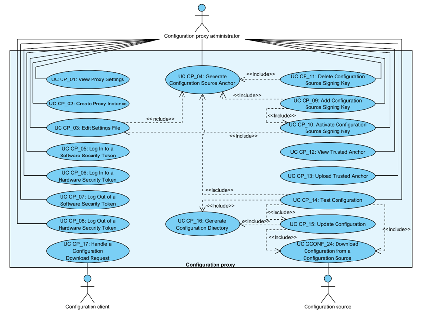

# X-Road: Configuration Proxy Use Case Model
**Analysis**

Version: 1.4  
07.03.2018
<!-- 20 pages -->
Doc. ID: UC-CP
--------------------------------------------

## Version history

Date       | Version | Description                                                     | Author
---------- | ------- | --------------------------------------------------------------- | --------------------
09.07.2015 |  0.1    |   Initial version                                                                                               | Riin Saarmäe, Ilja Kromonov
14.09.2015 |  0.2    |   Additions and corrections done                                                                                | Ilja Kromonov
18.09.2015 |  0.3    |   Introduction and actors sections added                                                                        | Riin Saarmäe
18.09.2015 |  0.4    |   Corrections made                                                                                              | Riin Saarmäe
21.09.2015 |  1.0    |   Editorial changes made                                                                                        | Imbi Nõgisto
08.11.2015 |  1.1    |   Renamed *Scope* element to *System*. *Native* (X-Road instance) renamed to *local*. Minor corrections done.   | Riin Saarmäe
14.12.2015 |  1.2    |   UC CP\_06 fixed                                                                                               | Riin Saarmäe
29.08.2017 |  1.3    |   Changed documentation type from docx to md file |   Lasse Matikainen
07.03.2018 |  1.4    |   Moved terms to term doc, added term doc reference and link | Tatu Repo

## Table of Contents

- [1 Introduction](#1-introduction)
    * [1.1 Purpose](#11-purpose)
    * [1.2 Terms and Abbreviations](#12-terms-and-abbreviations)
    * [1.3 References](#13-references)
- [2 Overview](#2-overview)
- [3 Use Case Model](#3-use-case-model)
    * [3.1 Actors](#31-actors)
    * [3.2 UC CP\_01: View Proxy Settings](#32-uc-cp_01-view-proxy-settings)
    * [3.3 UC CP\_02: Create Proxy Instance](#33-uc-cp_02-create-proxy-instance)
    * [3.4 UC CP\_03: Edit Settings File](#34-uc-cp_03-edit-settings-file)
    * [3.5 UC CP\_04: Generate Configuration Source Anchor](#35-uc-cp_04-generate-configuration-source-anchor)
    * [3.6 UC CP\_05: Log In to a Software Security Token](#36-uc-cp_05-log-in-to-a-software-security-token)
    * [3.7 UC CP\_06: Log In to a Hardware Security Token](#37-uc-cp_06-log-in-to-a-hardware-security-token)
    * [3.8 UC CP\_07: Log Out of Software Security Token](#38-uc-cp_07-log-out-of-software-security-token)
    * [3.9 UC CP\_08: Log Out of a Hardware Security Token](#39-uc-cp_08-log-out-of-a-hardware-security-token)
    * [3.10 UC CP\_09: Add Configuration Source Signing Key](#310-uc-cp_09-add-configuration-source-signing-key)
    * [3.11 UC CP\_10: Activate Configuration Source Signing Key](#311-uc-cp_10-activate-configuration-source-signing-key)
    * [3.12 UC CP\_11: Delete Configuration Source Signing Key](#312-uc-cp_11-delete-configuration-source-signing-key)
    * [3.13 UC CP\_12: View Trusted Anchor](#313-uc-cp_12-view-trusted-anchor)
    * [3.14 UC CP\_13: Upload Trusted Anchor](#314-uc-cp_13-upload-trusted-anchor)
    * [3.15 UC CP\_14: Test Configuration](#315-uc-cp_14-test-configuration)
    * [3.16 UC CP\_15: Update Configuration](#316-uc-cp_15-update-configuration)
    * [3.17 UC CP\_16: Generate Configuration Directory](#317-uc-cp_16-generate-configuration-directory)
    * [3.18 UC CP\_17: Handle a Configuration Download Request](#318-uc-cp_17-handle-a-configuration-download-request)

## License

This work is licensed under the Creative Commons Attribution-ShareAlike
3.0 Unported License. To view a copy of this license, visit
http://creativecommons.org/licenses/by-sa/3.0/.

## 1 Introduction

### 1.1 Purpose

The purpose of this document is to describe the use cases concerning the
configuration proxy.

The use cases include verifications that take place, and the main error
conditions that may be encountered during the described process. The
general system errors that may be encountered in most of the use cases
(e.g., out of memory errors) are not described in this document.

The use cases assume that the configuration proxy software is installed
(see UG-CP).

The use cases including a human actor (the *level* of the use case is
*user task*) assume that the actor is logged in to the system.

### 1.2 Terms and Abbreviations

See X-Road terms and abbreviations documentation \[[TA-TERMS](#Ref_TERMS)]\.

### 1.3 References

1.  \[PKCS11\] PKCS \#11 Cryptographic Token
    Interface Base Specification Version 2.40. Function return values.
    <http://docs.oasis-open.org/pkcs11/pkcs11-base/v2.40/csprd01/pkcs11-base-v2.40-csprd01.html#_Toc372627249>

2.  \[PR-GCONF\] X-Road: Protocol for
    Downloading Configuration. Document ID: [PR-GCONF](../Protocols/pr-gconf_x-road_protocol_for_downloading_configuration.md).

3.  \[UG-CP\] X-Road: Configuration Proxy Manual.
    Document ID: [UG-CP](../Manuals/ug-cp_x-road_v6_configuration_proxy_manual.md).

4.  \[UC-GCONF\] X-Road: Use Case Model for
    Global Configuration Distribution. Document ID: [UC-GCONF](uc-gconf_x-road_use_case_model_for_global_configuration_distribution_1.4_Y-883-8.md).
    
5.  \[TA-TERMS\] X-Road Terms and Abbreviations. Document ID: [TA-TERMS](../terms_x-road_docs.md).

## 2 Overview

The configuration proxy acts as an intermediary between X-Road servers
in the matters of global configuration exchange.

The goal of the configuration proxy is to download an X-Road global
configuration from a provided configuration source and further
distribute it in a secure way.

The configuration proxy can be configured to mediate several global
configurations (from multiple configuration sources).

## 3 Use Case Model

### 3.1 Actors

The use case model for the X-Road configuration proxy includes the
following actors.

-   **CP administrator** – Configuration proxy administrator – a person
    responsible for managing the configuration proxy.

-   **Configuration client** – System acting as a configuration client.
    Can either be a security server or another configuration proxy.

-   **Configuration source** – a component (HTTP server) that
    distributes global configuration and is managed by the central
    server or another configuration proxy.

Relationships between the actors, the system and the use cases are
described in Figure 1.

Figure 1. Use case diagram for the configuration proxy

### 3.2 UC CP\_01: View Proxy Settings

**System**: Configuration proxy

**Level**: User task

**Component**: Configuration proxy

**Actor**: CP administrator

**Brief Description**: CP administrator views the settings of the
configured configuration proxy instances.

**Preconditions**: -

**Postconditions**: The settings are displayed to CP administrator.

**Trigger**: -

**Main Success Scenario**:

1.  CP administrator selects to view all proxy instance settings.

2.  System displays list of proxy instances. For each instance, the
    following information is displayed:

    -   trusted anchor;

    -   configuration download URL;

    -   active signing key identifier and respective certificate;

    -   list of inactive signing key identifiers and respective
        certificates;

    -   configuration validity interval.

**Extensions**:

-  1a. CP administrator selects to view the settings for a specific proxy instance.
    - 1a.1. System displays information from step 2 for the requested instance only.

-  1b. CP administrator selects to view the settings for a proxy instance that does not exist.
    - 1b.1. System notifies CP administrator with the error message “Configuration for proxy instance '&lt;INSTANCE&gt;' does not exist.”, &lt;INSTANCE&gt; being the identifier of the proxy instance.

-  1c. The configuration file for a configuration proxy instance is missing:
    -  1c.1. System notifies CP administrator with the error message “'conf.ini' could not be loaded for proxy '&lt;INSTANCE&gt;': 'conf.ini' does not exist.”, &lt;INSTANCE&gt; being the identifier of the proxy instance.

-  2a. Only partial configuration information for a proxy instance is available.
    -  2a.1. The settings are displayed with additional error messages. The settings information may contain one or more of the following messages:
        -   trusted anchor is invalid or missing - “'anchor.xml' could not be loaded: IOError: /etc/xroad/confproxy/&lt;INSTANCE&gt;/anchor.xml (No such file or directory)”, &lt;INSTANCE&gt; being the identifier of the proxy instance;
        -   the active signing key has not been configured - “active-signing-key-id: NOT CONFIGURED (add 'active-signing-key-id' to 'conf.ini')”;
        -   configuration validity interval has not been configured - “Validity interval: NOT CONFIGURED (add 'validity-interval-seconds' to 'conf.ini')”;

**Related information**:
-   See \[[UG-CP](#Ref_UG-CP)\] for details.

### 3.3 UC CP\_02: Create Proxy Instance

**System**: Configuration proxy

**Level**: User task

**Component**: Configuration proxy

**Actor**: CP administrator

**Brief Description**: CP administrator creates a new configuration
proxy instance for distributing configuration from a configuration
source.

**Preconditions**: -

**Postconditions**: Configuration files for a proxy instance with the
specified identifier are available on the file system.

**Trigger**: -

**Main Success Scenario**:

1.  CP administrator selects to create a new proxy instance with the
    specified identifier.

2.  System creates the settings directory for the new proxy instance and
    generates the initial configuration file 'conf.ini', containing a
    default value (600) for *validity-interval-seconds*, which describes
    the configuration validity interval.

**Extensions**:

- 1a. Proxy instance with the specified identifier already exists:
    - 1a.1. System notifies CP administrator with the error message “Configuration for instance '&lt;INSTANCE&gt;' already exists, aborting.”, &lt;INSTANCE&gt; being the provided instance identifier, and terminates the use case.

**Related information**:

-   By default the settings directory is located at
    /etc/xroad/confproxy/&lt;INSTANCE&gt;, where &lt;INSTANCE&gt; is the
    provided instance identifier. See \[[UG-CP](#Ref_UG-CP)\] for details.

### 3.4 UC CP\_03: Edit Settings File

**System**: Configuration proxy

**Level**: User task

**Component**: Configuration proxy

**Actor**: CP administrator

**Brief Description**: CP administrator modifies settings of a
configuration proxy instance.

**Preconditions**: The given configuration proxy instance has been
created.

**Postconditions**: Changes made by CP administrator are reflected in
the operation of the configuration proxy.

**Trigger**: Step 1 of 3.11.

**Main Success Scenario**:

1.  CP administrator selects to edit a proxy instance settings file.

2.  CP administrator modifies the proxy instance settings file content.
    Possible setting keys are:

    -   validity-interval-seconds;

    -   active-signing-key-id;

    -   signing-key-id-\*.

3.  CP administrator saves the edited file.

4.  CP administrator generates configuration anchor file (see 3.5), in
    case signing keys were added or deleted.

**Extensions**: -

**Related information**:

-   By default the settings file is located at
    /etc/xroad/confproxy/&lt;INSTANCE&gt;/conf.ini, where
    &lt;INSTANCE&gt; is the name of the configuration proxy instance.
    See \[[UG-CP](#Ref_UG-CP)\] for details.

### 3.5 UC CP\_04: Generate Configuration Source Anchor

**System**: Configuration proxy

**Level**: User task

**Component**: Configuration proxy

**Actor**: CP administrator

**Brief Description**: CP administrator generates a configuration source
anchor for a configuration proxy instance.

**Preconditions**: The configuration proxy instance has been configured.

**Postconditions**: -

**Triggers**:

-   Step 4 of 3.4.

-   Step 5 of 3.10.

-   Step 3 of 3.12.

-   Step 1 of 3.15.

**Main Success Scenario**:

1.  CP administrator selects to generate a configuration anchor (as a
    file with the given name) for the specified proxy instance.

2.  System verifies that the information needed to generate the anchor
    is present:

    -   configuration provider's source anchor is present;

    -   configuration proxy server address is configured;

    -   at least one signing key with corresponding certificate is
        configured.

3.  System generates and saves the anchor file.

**Extensions**:

- 1b. CP administrator selects to generate a configuration anchor for a proxy instance that does not exist:
    - 1b.1. System notifies CP administrator with the error message “Configuration for proxy instance '&lt;INSTANCE&gt;' does not exist.”, &lt;INSTANCE&gt; being the identifier of the proxy instance. The use case terminates.

- 2a. The source anchor for the proxy instance does not exist:
    - 2a.1. System notifies CP administrator with the error message “Could not load source anchor: IOError: /etc/xroad/confproxy/&lt;INSTANCE&gt;/anchor.xml (No such file or directory)”, &lt;INSTANCE&gt; being the identifier of the proxy instance. The use case terminates.

- 2b. The configuration proxy address has not been configured:
    - 2b.1. System notifies CP administrator with the error message “configuration-proxy.address has not been configured in 'local.ini'!”. The use case terminates.

- 2c. No signing keys have been configured for the proxy instance:
    - 2c.1. System notifies CP administrator with the error message “No signing keys configured!”. The use case terminates.

- 3a. CP administrator does not have permission to write to the file system:
    - 3a.1. System notifies CP administrator with the error message “Cannot write anchor to '&lt;FILE&gt;', permission denied.”, &lt;FILE&gt; being the file path provided by CP administrator. The use case terminates.

**Related information:**

-   See \[[UG-CP](#Ref_UG-CP)\] for details.

### 3.6 UC CP\_05: Log In to a Software Security Token

**System:** Configuration proxy

**Level:** User task

**Component:** Configuration proxy

**Actor:** CP administrator

**Brief Description:** CP administrator logs in to the security token,
making it usable for key generation.

**Preconditions:** The token has not been logged in to.

**Postconditions:** -

**Trigger:** CP administrator wishes to make the functionality of the
token available to the system.

**Main Success Scenario:**

1.  CP administrator selects log in to a software security token.

2.  CP administrator inserts the token PIN code.

3.  System verifies the PIN code is correct and logs in to the token.

**Extensions:**

- 3a. The entered PIN code is incorrect:
    - 3a.1. System displays the error message: “PIN incorrect” and terminates the use case.

**Related information:** -

### 3.7 UC CP\_06: Log In to a Hardware Security Token

**System**: Configuration proxy

**Level**: User task

**Component:** Configuration proxy

**Actor**: CP administrator

**Brief Description**: CP administrator logs in to a hardware token by
entering the token PIN code.

**Preconditions**:

-   The hardware security token is initialized and connected to the
    system.

-   The token has not been logged in to.

**Postconditions**: -

**Trigger**: CP administrator wishes to make the functionality of the
token available to the system.

**Main Success Scenario**:

1.  CP administrator selects log in to a hardware security token holding
    a configuration signing key.

2.  CP administrator inserts the token PIN code.

3.  System verifies that the token is not locked.

4.  System verifies that the inserted PIN code is correct and logs in to
    the token.

**Extensions**:

- 3-4a. The login attempt failed (e.g., incorrect PIN was inserted, token is inaccessible).
    - 3-4a.1. System displays the error message: “Login failed: X”, where “X” is the error code from the PKCS \#11 cryptographic token interface (see \[[PKCS11](#Ref_PKCS11)\]) and terminates the use case.

**Related information**: -

### 3.8 UC CP\_07: Log Out of Software Security Token

**System:** Configuration proxy

**Level:** User task

**Component:** Configuration proxy

**Actor:** CP administrator

**Brief Description:** CP administrator logs out of a software security
token.

**Preconditions:**

-   The software security token is holding one or more configuration
    signing keys.

-   The software security token is logged in to.

**Postconditions:** The token is logged out of. The system cannot use
the keys on the token for signing configuration.

**Trigger:** CS administrator wishes to log out of a software security
token.

**Main Success Scenario:**

1.  CP administrator selects to log out of a token.

2.  System logs out of the token.

**Extensions: -**

**Related information**: -

### 3.9 UC CP\_08: Log Out of a Hardware Security Token

**System**: Configuration proxy

**Level**: User task

**Component:** Configuration proxy

**Actor**: CP administrator

**Brief Description**: CP administrator logs out of a hardware security
token.

**Preconditions**: The hardware security token is logged in to.

**Postconditions**: -

**Trigger**: CP administrator wishes to log out of a hardware security
token.

**Main Success Scenario**:

1.  CP administrator selects to log out of a security token.

2.  System logs out of the token.

**Extensions**:

- 2a. The logout attempt failed (e.g., token is inaccessible).
    - 2a.1. System displays the error message: “Logout failed: X”, where “X” is the error code from the PKCS \#11 cryptographic token interface \[[PKCS11](#Ref_PKCS11)\] and terminates the use case.

**Related information**: -

### 3.10 UC CP\_09: Add Configuration Source Signing Key

**System**: Configuration proxy

**Level**: User task

**Component**: Configuration proxy

**Actor**: CP administrator

**Brief Description**: CP administrator adds a configuration source
signing key to a particular configuration proxy instance.

**Preconditions**: A security token is connected to the system and is
logged in to.

**Postconditions**: -

**Trigger**: CP administrator wishes to add a signing key for a proxy
instance (e.g., as a part of performing a regular key change).

**Main Success Scenario**:

1.  CP administrator selects to add a new configuration source signing
    key to the specified configuration proxy instance from the given
    security token.

2.  System generates a new configuration signing key on the referred
    token and a corresponding self-signed certificate.

3.  System saves the generated key information and the certificate to
    the proxy instance settings file.

4.  CP administrator activates the generated key (see 3.11), if needed.

5.  CP administrator generates configuration anchor file (see 3.5).

**Extensions**:

- 2a. Key generation fails.
    - 2a.1. System displays an error message: “Failed to generate signing key: X”, where “X” is the description of the error. If the key generation failed on a hardware security token, then “X” is the error code from the PKCS \#11 cryptographic token interface \[PKCS11\].

- 2b. Generation of the self-signed certificate fails:
    - 2b.1. System deletes the generated key.
    - 2b.1a. Key deletion fails.
    - 2b.1a.1. Use case continues from step 2b.2.
    - 2b.2. System displays the error message: “Failed to generate signing  key: X”, where “X” is the description of the error.

**Related information**: -

### 3.11 UC CP\_10: Activate Configuration Source Signing Key

**System**: Configuration proxy

**Level**: User task

**Component**: Configuration proxy

**Actor**: CP administrator

**Brief Description**: CP administrator activates an existing
configuration source signing key for a particular configuration proxy
instance.

**Preconditions**: A security token containing an inactive signing key
associated with the configuration source is connected to the system.

**Postconditions**: System is using a different key for signing
configuration.

**Triggers**:

-   CP administrator wishes to change the key that the system uses for
    signing configuration provided by the source.

-   Step 4 of 3.10.

**Main Success Scenario**:

1.  CP administrator edits the active key identifier in the
    configuration proxy instance settings file (see 3.4).

2.  System starts using the activated key.

**Extensions**: -

**Related information**:

-   By default the settings file is located at
    /etc/xroad/confproxy/&lt;INSTANCE&gt;/conf.ini, where
    &lt;INSTANCE&gt; is the name of the configuration proxy instance.
    See \[[UG-CP](#Ref_UG-CP)\] for details.

### 3.12 UC CP\_11: Delete Configuration Source Signing Key

**System**: Configuration proxy

**Level**: User task

**Component**: Configuration proxy

**Actor**: CP administrator

**Brief Description**: CP administrator deletes a configuration source
signing key from a particular configuration proxy instance.

**Preconditions**: A security token containing an inactive signing key
associated with the configuration source is connected to the system.

**Postconditions**: -

**Trigger**: CP administrator wishes to delete a configuration signing
key.

**Main Success Scenario**:

1.  CP administrator selects to delete an inactive configuration source
    signing key.

2.  System deletes the selected configuration signing key from the
    security token and the corresponding certificate and key ID from the
    configuration proxy instance settings file.

3.  CP administrator generates configuration anchor file (see 3.5).

**Extensions**:

- 1a. CP administrator selects to delete an active configuration source signing key.
    - 1a.1. System notifies CP administrator with the error message “Not allowed to delete an active signing key!”. The use case terminates.

- 1b. CP administrator selects to delete a key that does not belong to this proxy instance.
    - 1b.1. System notifies CP administrator with the error message “The key ID '&lt;KEY\_ID&gt;' could not be found in 'conf.ini'.”, where &lt;KEY\_ID&gt; is the id of the key to be deleted. The use case terminates.

**Related information**:

-   See \[[UG-CP](#Ref_UG-CP)\] for details.

### 3.13 UC CP\_12: View Trusted Anchor

**System**: Configuration proxy

**Level**: User task

**Component**: Configuration proxy

**Actor**: CP administrator

**Brief Description**: CP administrator views the content of the
configuration anchor used by the configuration proxy to download the
global configuration for a particular instance.

**Preconditions**: Trusted anchor file exists.

**Postconditions**: The anchor file content has been displayed to CP
administrator.

**Trigger**: CP administrator wishes to view the configuration anchor
information e.g., to verify that the system is using the latest anchor
provided by the governing agency.

**Main Success Scenario**:

1.  CP administrator selects to view trusted anchor.

2.  System displays the anchor file content.

**Extensions**: -

**Related information**:

-   By default the anchor file is located at
    /etc/xroad/confproxy/&lt;INSTANCE&gt;/anchor.xml, where
    &lt;INSTANCE&gt; is the name of the configuration proxy instance.
    See \[[UG-CP](#Ref_UG-CP)\] for details.

### 3.14 UC CP\_13: Upload Trusted Anchor

**System**: Configuration proxy

**Level**: User task

**Component**: Configuration proxy

**Actor**: CP administrator

**Brief Description**: CP administrator places the configuration
provider's anchor file into the configuration proxy instance settings
directory.

**Preconditions**: -

**Postconditions**: An anchor file has been saved to the system.

**Trigger**: Configuration proxy initialization; trusted configuration
provider sends updated configuration anchor.

**Main Success Scenario**:

1.  CP administrator copies the anchor file to configuration proxy
    instance settings directory.

**Extensions**: -

**Related information**:

-   By default the anchor file is located at
    /etc/xroad/confproxy/&lt;INSTANCE&gt;/anchor.xml, where
    &lt;INSTANCE&gt; is the name of the configuration proxy instance.
    See \[[UG-CP](#Ref_UG-CP)\] for details.

### 3.15 UC CP\_14: Test Configuration

**System**: Configuration proxy

**Level**: User task

**Component**: Configuration proxy

**Actor**: CP administrator

**Brief Description**: CP administrator executes a number of console
commands that let him verify the correctness of the configuration proxy
instance settings.

**Preconditions**: CP administrator has tested the system setup.

**Postconditions**: -

**Trigger**: CP administrator wishes to verify that a configuration
proxy instance has been setup correctly.

**Main Success Scenario**:

1.  CP administrator generates the proxy instance anchor file. (see
    3.5).

2.  CP administrator runs the configuration download script providing it
    with the generated anchor and a directory for placing the downloaded
    configuration (see \[[UG-CP](#Ref_UG-CP)\] for details).

3.  The configuration is downloaded from the configuration source: UC
    GCONF\_21: Download Configuration from a Configuration Source
   \[[UC-GCONF](#Ref_UC-GCONF)\].

4.  CP administrator verifies that configuration download (see 3.16) and
    configuration directory generation (see 3.17) were successful.

**Extensions:** -

**Related information**:

-   The specific commands used to test the configuration of a proxy
    instance are described in the configuration proxy manual \[UG-CP\].

### 3.16 UC CP\_15: Update Configuration

**System**: Configuration proxy

**Level**: System

**Component**: Configuration proxy

**Actor**: -

**Brief Description**: System downloads the configuration and generates
the configuration directory distributed to the configuration clients.

**Preconditions**: Trusted configuration anchor exists.

**Postconditions**: -

**Triggers**:

-   Timer (defined by *cron* daemon).

-   Step 4 of 3.15.

**Main Success Scenario**:

1.  System downloads the configuration: UC GCONF\_21: Download
    Configuration from a Configuration Source \[[UC-GCONF](#Ref_UC-GCONF)\].

2.  System generates the configuration directory: 3.17.

**Extensions:**

- 1a. Configuration download terminates with an error.
    - 1a.1. Use case terminates.

**Related information**:

-   By default the *cron* job is executed every
    minute. 

-   The format of the configuration anchor and configuration directory,
    and the protocol for downloading the configuration are described in
    the document “X-Road: Protocol for Downloading Configuration”
    \[[PR-GCONF](#Ref_PR-GCONF)\].

### 3.17 UC CP\_16: Generate Configuration Directory

**System**: Configuration
proxy

**Level**: Subfunction

**Component**: Configuration proxy

**Actor**: -

**Brief Description**: The configuration proxy generates the
configuration directory that will be distributed to configuration
clients for a particular configuration proxy instance.

**Preconditions**: Active configuration signing key and downloaded
configuration files exist, downloaded configuration is not expired.

**Postconditions**: The configuration directory has been generated and
is being distributed to configuration clients.

**Triggers**:

-   Step 4 of 3.15.

-   Step 2 of 3.16.

**Main Success Scenario**:

1.  Systems adds information (content type, content transfer encoding,
    content file name, content identifier, content location, hash
    algorithm id, file digest) about configuration part files to
    configuration directory.

2.  System adds parameters (instance identifier, expire date) to the
    configuration directory.

3.  System signs the configuration directory.

4.  System makes the signed directory and configuration part files
    available to configuration clients.

**Extensions**: -

**Related information**: -

### 3.18 UC CP\_17: Handle a Configuration Download Request

**System**: Configuration proxy

**Level**: System task

**Component:** Configuration proxy, security server, central server

**Actor**: Configuration client

**Brief Description**: System receives a configuration download request
from a configuration client and responds.

**Preconditions**: Signed configuration directory and configuration part
files are made available for downloading (see 3.17).

**Postconditions**: The configuration client has received either the
requested configuration item (signed configuration directory or a
configuration part file) or an error message.

**Trigger**: Download request from a configuration client.

**Main Success Scenario**:

1.  Configuration client requests to download the signed configuration
    directory or a configuration part file.
    
2.  System responds with the requested files.

**Extensions**:

- 2a. Request cannot be served.
    - 2a.1. System responds with an error message.

**Related information**: -
