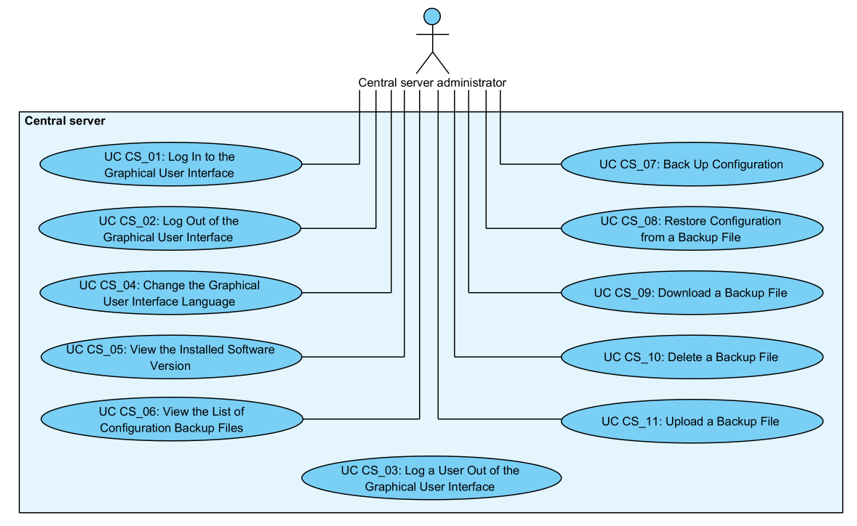

# X-Road: Use Case Model for Central Server Management
**Analysis**

Version: 1.6  
25.08.2021
<!-- 38 pages -->
Doc. ID: UC-CS
------------------------------------------------------

## Version history

Date       | Version | Description                                                     | Author
---------- | ------- | --------------------------------------------------------------- | --------------------
31.08.2015 |  0.1    |   Initial draft                                                                                                                           |   Riin Saarmäe
17.09.2015 |  0.2    |   Initial version                                                                                                                         |   Riin Saarmäe
17.09.2015 |  0.3    |   Corrections done                                                                                                                        |   Riin Saarmäe
21.09.2015 |  1.0    |   Editorial changes made                                                                                                                  |   Imbi Nõgisto
08.11.2015 |  1.1    |   Renamed *Scope* element to *System*. Renamed *User* to *CS administrator*. Updated use cases CS\_07 and CS\_08. Minor corrections done. |   Riin Saarmäe
13.12.2015 |  1.2    |   Restore clears the shared memory (UC CS\_08)                                                                                            |   Riin Saarmäe
29.08.2017 |  1.3    |  Changed documentation type from docx to md file | Lasse Matikainen
19.02.2018 |  1.4    |   Updated the negative case extension for backing up the central server | Tatu Repo
06.03.2018 |  1.5    |   Added term doc reference and link, added reference links | Tatu Repo
25.08.2021 |  1.6    | Update X-Road references from version 6 to 7 | Caro Hautamäki

## Table of Contents

- [1 Introduction](#1-introduction)
    * [1.1 Terms and Abbreviations](#11-terms-and-abbreviations)
    * [1.2 References](#12-references)
- [2 Use Case Model](#2-use-case-model)
- [2.1 Actors](#21-actors)
    * [2.2 UC CS\_01: Log In to the Graphical User Interface](#22-uc-cs_01-log-in-to-the-graphical-user-interface)
    * [2.3 UC CS\_02: Log Out of the Graphical User Interface](#23-uc-cs_02-log-out-of-the-graphical-user-interface)
    * [2.4 UC CS\_03: Log a User Out of the Graphical User Interface](#24-uc-cs_03-log-a-user-out-of-the-graphical-user-interface)
    * [2.5 UC CS\_04: Change the Graphical User Interface Language](#25-uc-cs_04-change-the-graphical-user-interface-language)
    * [2.6 UC CS\_05: View the Installed Software Version](#26-uc-cs_05-view-the-installed-software-version)
    * [2.7 UC CS\_06: View the List of Configuration Backup Files](#27-uc-cs_06-view-the-list-of-configuration-backup-files)
    * [2.8 UC CS\_07: Back Up Configuration](#28-uc-cs_07-back-up-configuration)
    * [2.9 UC CS\_08: Restore Configuration from a Backup File](#29-uc-cs_08-restore-configuration-from-a-backup-file)
    * [2.10 UC CS\_09: Download a Backup File](#210-uc-cs_09-download-a-backup-file)
    * [2.11 UC CS\_10: Delete a Backup File](#211-uc-cs_10-delete-a-backup-file)
    * [2.12 UC CS\_11: Upload a Backup File](#212-uc-cs_11-upload-a-backup-file)

## License

This work is licensed under the Creative Commons Attribution-ShareAlike
3.0 Unported License. To view a copy of this license, visit
http://creativecommons.org/licenses/by-sa/3.0/.

## 1 Introduction

The purpose of this document is to describe the general central server
use cases that do not fall under any of the following topics.

-   The use cases for global configuration management and distribution
    are described in the document “X-Road: Use Case Model for Global
    Configuration Distribution” \[[UC-GCONF](#Ref_UC-GCONF)\].

-   The use cases for federating X-Road instances are described in the
    document “X-Road: Use Case Model for Federation” \[UC-FED\].

-   The use cases for the management of X-Road members and security
    servers are described in the document “X-Road: Use Case Model for
    Member Management” \[[UC-MEMBER](#Ref_UC-MEMBER)\].

-   The use cases for the management of global groups and central
    services are described in the document “X-Road: Use Case Model for
    Service Management” \[[UC-SERVICE](#Ref_UC-SERVICE)\].

-   The use cases for the management of certification services and
    timestamping services are described in the document “X-Road: Use
    Case Model for Trust Service Management” \[[UC-TRUST](#Ref_UC-TRUST)\].

The use cases include verifications that take place, and the main error
conditions that may be encountered during the described process. The
general system errors that may be encountered in most of the use cases
(e.g., database connection errors or out of memory errors) are not
described in this document.

The use cases assume that the X-Road software components involved in the
use cases are installed and initialised (see \[[IG-CS](#Ref_IG-CS)\]).

The use cases (except for 2.2) including a human actor (the *level* of
the use case is *user task*) assume that the actor is logged in to the
system and has the access rights required to carry out the use case.

### 1.1 Terms and Abbreviations

See X-Road terms and abbreviations documentation \[[TA-TERMS](#Ref_TERMS)\].

### 1.2 References

1.  \[IG-CS\]
    X-Road 7. Central Server Installation Guide. Document ID: [IG-CS](../Manuals/ig-cs_x-road_6_central_server_installation_guide.md).

2.  \[SPEC-AL\] X-Road:
    Audit Log Events. Document ID: SPEC-AL.

3.  \[UC-GCONF\] X-Road: Use Case Model for
    Global Configuration Distribution. Document ID: [UC-GCONF](uc-gconf_x-road_use_case_model_for_global_configuration_distribution_1.4_Y-883-8.md).

4.  \[UC-FED\] X-Road: Use Case Model for
    Federation. Document ID: [UC-FED](uc-fed_x-road_use_case_model_for_federation_1.1_Y-883-7.md).

5.  \[UC-MEMBER\] X-Road: Use Case Model for
    Member Management. Document ID: [UC-MEMBER](uc-member_x-road_use_case_model_for_member_management.md).

6.  \[UC-SERVICE\] X-Road: Use Case Model for
    Service Management. Document ID: [UC-SERVICE](uc-service_x-road_use_case_model_for_service_management_1.6_Y-883-3.md).

7.  \[UC-TRUST\] X-Road: Use Case Model for
    Trust Service Management. Document ID: [UC-TRUST](uc-trust_x-road_use_case_model_for_trust_service_management_1.1.1_Y-883-9.md).

8.  \[TA-TERMS\] X-Road Terms and Abbreviations. Document ID: [TA-TERMS](../terms_x-road_docs.md).

## 2 Use Case Model

### 2.1 Actors

The use case model for central server management includes the following
actor.

-   **CS administrator** (central server administrator) – a person
    responsible for managing the central server.

Relationships between the actor, the system and the use cases are
described in Figure 1.

Figure 1. Use case diagram for central server management

### 2.2 UC CS\_01: Log In to the Graphical User Interface

**System**: Central server

**Level**: User task

**Component:** Central server

**Actor**: CS administrator

**Brief Description**: CS administrator logs in to the graphical user
interface (GUI) of the central server.

**Preconditions**: -

**Postconditions**: An audit log record for the event has been created.

**Trigger**: CS administrator wants to log in to the GUI to view or
manage the central server configuration.

**Main Success Scenario**:

1.  CS administrator selects to log in to the GUI.

2.  CS administrator inserts the username and password.

3.  System verifies that the system is not currently undergoing the
    system restore process.

4.  System verifies that a user with the inserted username and password
    is configured in the system configuration and logs CS administrator
    in to the GUI.

5.  System logs the event “Log in user” to the audit log.

**Extensions**:

- 3a. The system is currently undergoing the system restore process.
    - 3a.1. System displays the error message “Restore in progress, try again later”.
    - 3a.2. System logs the event “Log in user failed” to the audit log.
    - 3a.3. CS administrator selects to reinsert the username and/or the password. Use case continues from step 3.
    - 3a.3a. CS administrator selects to terminate the use case.

- 4a. The user with the inserted username does not exist or the password is incorrect.
    - 4a.1. System displays the error message “Authentication failed. Please try again”. The text fields are emptied.
    - 4a.2. System logs the event “Log in user failed” to the audit log.
    - 4a.3. CS administrator selects to reinsert the username and/or the password. Use case continues from step 3.
    - 4a.3a. CS administrator selects to terminate the use case.

**Related information**:

-   The audit log is located at /var/log/xroad/audit.log. The data set
    of audit log records is described in the document “X-Road: Audit Log
    Events” \[[SPEC-AL](#Ref_SPEC-AL)\].

### 2.3 UC CS\_02: Log Out of the Graphical User Interface

**System**: Central server

**Level**: User task

**Component:** Central server

**Actor**: CS administrator

**Brief Description**: CS administrator logs out of the GUI.

**Preconditions**: -

**Postconditions**:

-   CS administrator is logged out of the GUI.

-   An audit log record for the event has been created.

**Trigger**: CS administrator wants to log out of the GUI.

**Main Success Scenario**:

1.  CS administrator selects to log out of the GUI.

2.  System logs CS administrator out of the GUI.

3.  System logs the event “Log out user” to the audit log.

**Extensions**: -

**Related information**:

-   The audit log is located at /var/log/xroad/audit.log. The data set
    of audit log records is described in the document “X-Road: Audit Log
    Events” \[[SPEC-AL](#Ref_SPEC-AL)\].

### 2.4 UC CS\_03: Log a User Out of the Graphical User Interface

**System**: Central server

**Level**: System task

**Component:** Central server

**Actor**: -

**Brief Description**: System logs the user out of the GUI when the
logged in user has been idle for 30 minutes.

**Preconditions**: -

**Postconditions**: The user is logged out of the GUI.

**Triggers**: The logged in user has been idle for 30 minutes.

**Main Success Scenario**:

1.  System logs the user out of the GUI.

2.  System displays the message “Session timed out. Redirecting.”

**Extensions**: -

**Related information**: -

### 2.5 UC CS\_04: Change the Graphical User Interface Language

**System**: Central server

**Level**: User task

**Component:** Central server

**Actor**: CS administrator

**Brief Description**: CS administrator changes the language of the GUI.

**Preconditions**: -

**Postconditions**: An audit log record for the event has been created.

**Trigger**: CS administrator wants to change the language of the GUI.

**Main Success Scenario**:

1.  CS administrator selects to change the language of the GUI.

2.  System displays the list of supported languages.

3.  CS administrator selects a language.

4.  System saves the CS administrator's choice and displays the GUI in
    the language in the selected language.

5.  System logs the event “Set UI language” to the audit log.

**Extensions**: -

**Related information**:

-   The audit log is located at /var/log/xroad/audit.log. The data set
    of audit log records is described in the document “X-Road: Audit Log
    Events” \[[SPEC-AL](#Ref_SPEC-AL)\].

### 2.6 UC CS\_05: View the Installed Software Version

**System**: Central server

**Level**: User task

**Component:** Central server

**Actor**: CS administrator

**Brief Description**: CS administrator views the version of the
installed software.

**Preconditions**: -

**Postconditions**: The version of the software has been displayed to CS
administrator.

**Trigger**: CS administrator wants to view the version of the installed
software.

**Main Success Scenario**:

1.  CS administrator selects to view the version of the installed
    software.

2.  System displays the version information.

**Extensions**: -

**Related information**: -

### 2.7 UC CS\_06: View the List of Configuration Backup Files

**System**: Central server

**Level**: User task

**Component:** Central server

**Actors:** CS administrator

**Brief Description**: CS administrator views the list of configuration
backup files.

**Preconditions**: *-*

**Postconditions**: The list of configuration backup files has been
displayed to CS administrator.

**Trigger**: CS administrator wants to view the list of configuration
backup files.

**Main Success Scenario**:

1.  CS administrator selects to view the list of configuration backup
    files.

2.  System displays the list of backup files. For each file, the
    following information is displayed:

    -   the file name of the backup file.

        The following user action options are displayed:

    -   back up configuration: 2.8;
    
    -   upload a backup file: 2.12;
    
    -   download a backup file: 2.10;
    
    -   restore system configuration from a backup file: 2.9;
    
    -   delete a backup file: 2.11.

**Extensions**: -

**Related information**: -

### 2.8 UC CS\_07: Back Up Configuration

**System**: Central server

**Level**: User task

**Component:** Central server

**Actor**: CS administrator

**Brief Description**: CS administrator backs up the central server
configuration.

**Preconditions**: -

**Postconditions**: An audit log record for the event has been created.

**Triggers**: CS administrator wants to back up the central server
configuration.

**Main Success Scenario**:

1.  CS administrator selects to back up the central server
    configuration.

2.  System runs the backup script that

    a.  creates the database dump file (to /var/lib/xroad/dbdump.dat)
        containing the contents of the central server database. The
        schema\_migrations table and the database schema are excluded
        from the database dump;

    b.  creates the backup file containing the database dump file and
        the following directories:

    -   /etc/xroad/

    -   /etc/nginx/sites-enabled/
    
    and includes the following information as a label in the created .tar file:

    -   the type of the server (“central” for central servers),
    
    -   the version of the central server software,
    
    -   the X-Road instance identifier,
    
    -   the node name if the central server is a part of a high availability
    
        cluster;

    c.  saves the created backup file to the directory
        /var/lib/xroad/backup.

3.  System displays the message “Configuration backup created” and the
    output of the backup script.

4.  System logs the event “Back up configuration” to the audit log.

**Extensions**:

- 3a. Backing up the central server configuration failed.
    - 3a.1  Backup script produces an error code that prompts the error handling to remove any incomplete backup archives
    - 3a.2. System displays the error message “Error making configuration backup, script exited with status code 'X'” (where “X” is the exit code of the backup script) and the output of the backup script.
    - 3a.3. System logs the event “Back up configuration failed” to the audit log.
    - 3a.4. Use case terminates.

**Related information**:

-   The audit log is located at /var/log/xroad/audit.log. The data set
    of audit log records is described in the document “X-Road: Audit Log
    Events” \[[SPEC-AL](#Ref_SPEC-AL)\].

### 2.9 UC CS\_08: Restore Configuration from a Backup File

**System**: Central server

**Level**: User task

**Component:** Central server

**Actor**: CS administrator

**Brief Description**: CS administrator restores the central server
configuration from a backup file.

**Preconditions**: A backup file is saved in the system configuration.

**Postconditions**: -

**Trigger**: CS administrator wants to restore the central server
configuration to a previously backed up state.

**Main Success Scenario**:

1.  CS administrator selects to restore the central server configuration
    from a backup file saved in the system configuration.

2.  System prompts for confirmation.

3.  CS administrator confirms.

4.  System runs the restore script that

    a.  verifies that the file is a valid backup file;

    b.  verifies the label of the backup file:

    -   verifies that the server type in the label corresponds to
        the type of the server that is being restored;

        *Note: System verifies only the server type and ignores the rest of the information in the label in case the restore script is called from the CLI with the -F option.*

    -   verifies that the server software version in the label is compatible
        with the installed software version of the server that is being
        restored;
        
    -   verifies that the instance identifier in the label corresponds to
        the instance identifier of the central server that is being
        restored;
        
    -   verifies that the node name in the label corresponds to the node
        name of the central server that is being restored if the restored
        server is a part of a high availability cluster.
            
    c.  Clears the shared memory;
    
    d.  stops all system services, except for xroad-jetty;
    
    e.  creates a pre-restore backup of the system configuration (step 2 of 2.8) to /var/lib/xroad/conf\_prerestore\_backup.tar (the pre-restore backup file is overwritten on each restore);
    
    f.  deletes the content of the following directories:
    
    -   /etc/xroad/
    -   /etc/nginx/sites-enabled/
    
    g.  restores the contents of the directories
    
    - /etc/xroad/
    - /etc/nginx/sites-enabled/
    
    from the backup file;
        
    h.  writes the database dump from the backup file to /var/lib/xroad/dbdump.dat;
    
    i.  restores the database data from the dump file /var/lib/xroad/dbdump.dat.
    
    j.  starts the system services that were previously stopped.

3.  System displays the message “Configuration restored successfully
    from file 'X'.” (where X is the file name of the backup file) and
    the output of the restore script.

4.  System logs the event “Restore configuration” to the audit log.

**Extensions**:

- 3a. CS administrator cancels the restoring of the configuration from the backup file.
    - 3a.1. Use case terminates.

- 4a. Restoring the central server configuration failed.
    - 4a.1. System displays the error message “Restoring configuration from file 'X' failed.” (where “X” is the file name of the backup file) and the output of the restore script.
    - 4a.2. System logs the event “Restore configuration failed” to the audit log.
    - 4a.3. Use case terminates.

**Related information**:

-   The backup files are located at /var/lib/xroad/backup.

-   The audit log is located at /var/log/xroad/audit.log. The data set
    of audit log records is described in the document “X-Road: Audit Log
    Events” \[[SPEC-AL](#Ref_SPEC-AL)\].

### 2.10 UC CS\_09: Download a Backup File

**System**: Central server

**Level**: User task

**Component:** Central server

**Actor**: CS administrator

**Brief Description**: CS administrator downloads a backup file.

**Preconditions**: A backup file is saved in the system configuration.

**Postconditions**: The backup file has been downloaded.

**Trigger**: CS administrator wants to download a backup file.

**Main Success Scenario**:

1.  CS administrator selects to download a backup file.

2.  System prompts the file for downloading.

3.  CS administrator saves the file to the local file system.

**Extensions**: -

**Related information**: -

### 2.11 UC CS\_10: Delete a Backup File

**System**: Central server

**Level**: User task

**Component:** Central server

**Actor**: CS administrator

**Brief Description**: CS administrator deletes a backup file.

**Preconditions**: A backup file is saved in the system configuration.

**Postconditions**: -

**Trigger**: CS administrator wants to delete a backup file.

**Main Success Scenario**:

1.  CS administrator selects to delete a backup file.

2.  System prompts for confirmation.

3.  CS administrator confirms.

4.  System deletes the backup file and displays the message “Selected
    backup deleted successfully”.

5.  System logs the event “Delete backup file” to the audit log.

**Extensions**:

- 3a. CS administrator cancels the deleting of the backup file.
    - 3a.1. Use case terminates.

**Related information**:

-   The audit log is located at /var/log/xroad/audit.log. The data set
    of audit log records is described in the document “X-Road: Audit Log
    Events” \[[SPEC-AL](#Ref_SPEC-AL)\].

### 2.12 UC CS\_11: Upload a Backup File

**System**: Central server

**Level**: User task

**Component:** Central server

**Actor**: CS administrator

**Brief Description**: CS administrator uploads a backup file to the
central server.

**Preconditions**: -

**Postconditions**: -

**Trigger**: CS administrator wants to upload a backup file.

**Main Success Scenario**:

1.  CS administrator selects to upload a backup file.

2.  CS administrator selects the file from the local file system.

3.  System verifies that the file name contains valid characters.

4.  System verifies that the extension of the uploaded file is .tar.

5.  System verifies that the content of the uploaded is in tar format.

6.  System verifies that a backup file with the same file name does not
    exist in the system configuration.

7.  System saves the backup file to the system configuration and
    displays the message “New backup file uploaded successfully”.

8.  System logs the event “Upload backup file” to the audit log.

**Extensions**:

- 3a. The file name contains invalid characters.
    - 3a.1. System displays the error message “Failed to upload new backup file: Filename 'X' contains invalid characters. Valid characters include: (A-Z), (a-z), (0-9), (\_), (.), (-).'” (where “X” is the file name of the uploaded file).
    - 3a.2. System logs the event “Upload backup file failed” to the audit log.
    - 3a.3. CS administrator selects to reselect the backup file. Use casecontinues from step 3.
    - 3a.3a. CS administrator selects to terminate the use case.

- 4a. The file extension is not .tar.
    - 4a.1. System displays the error message “Failed to upload new backup file: Uploaded file name 'X' has an invalid extension, the only valid one is 'tar'” (where “X” is the file name of the uploaded file).
    - 4a.2. System logs the event “Upload backup file failed” to the audit log.
    - 4a.3. CS administrator selects to reselect the backup file. Use case continues from step 3.
    - 4a.3a. CS administrator selects to terminate the use case.

- 5a. The content of the file is not in valid format.
    - 5a.1. System displays the error message “Failed to upload new backup file: Content of uploaded file must be in tar format”.
    - 5a.2. System logs the event “Upload backup file failed” to the audit log.
    - 5a.3. CS administrator selects to reselect the backup file. Use casecontinues from step 3.
    - 5a.3a. CS administrator selects to terminate the use case.

- 6a. A backup file with the same file name is saved in the system configuration.
    - 6a.1. System displays the message “Backup file with name 'X' alreadyexists, do you want to overwrite it?” (where “X” is the file name ofthe uploaded file) and prompts for confirmation.
    - 6a.2. CS administrator confirms. Use case continues from step 7.
    - 6a.2a. CS administrator cancels the upload.
    - 6a.2a.1. CS administrator selects to reselect the backup file. Use case continues from step 3.
    - 6a.2a.1a. CS administrator selects to terminate the use case.

**Related information**:

-   The backup files are saved to /var/lib/xroad/backup.

-   The audit log is located at /var/log/xroad/audit.log. The data set
    of audit log records is described in the document “X-Road: Audit Log
    Events” \[[SPEC-AL](#Ref_SPEC-AL)\].
