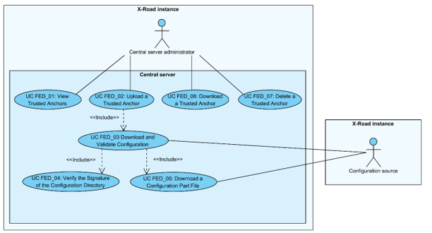

# X-Road: Use Case Model for Federation
**Analysis**

Version: 1.4  
25.08.2021
<!-- 15 pages -->
Doc. ID: UC-FED

---------------------------------------

## Version history

 Date       | Version | Description                                                     | Author
 ---------- | ------- | --------------------------------------------------------------- | --------------------
15.09.2015  | 0.1     |  Initial version                                                | Riin Saarmäe
16.09.2015  | 0.2     |  Minor corrections done                                         | Riin Saarmäe
20.09.2015  | 1.0     |  Editorial changes made                                         | Imbi Nõgisto
08.11.2015  | 1.1     |  Renamed *Scope* element to *System*. *Native* (X-Road instance) renamed to *local*. Minor corrections done. |   Riin Saarmäe
29.08.2017  | 1.2     |  Changed documentation type from docx to md file |   Lasse Matikainen
06.03.2018  | 1.3     |  Moved terms to term doc, added term doc reference and link, added internal MD-doc links | Tatu Repo
25.08.2021  | 1.4     | Update X-Road references from version 6 to 7 | Caro Hautamäki

## Table of Contents

- [1 Introduction](#1-introduction)
    * [1.1 Purpose](#11-purpose)
    * [1.2 Terms and Abbreviations](#12-terms-and-abbreviations)
    * [1.3 References](#13-references)
- [2 Overview](#2-overview)
- [3 Use Case Model](#3-use-case-model)
    * [3.1 Actors](#31-actors)
    * [3.2 UC FED\_01: View Trusted Anchors](#32-uc-fed_01-view-trusted-anchors)
    * [3.3 UC FED\_02: Upload a Trusted Anchor](#33-uc-fed_02-upload-a-trusted-anchor)
    * [3.4 UC FED\_03: Download and Validate Configuration](#34-uc-fed_03-download-and-validate-configuration)
    * [3.5 UC FED\_04: Verify the Signature of the Configuration Directory](#35-uc-fed_04-verify-the-signature-of-the-configuration-directory)
    * [3.6 UC FED\_05: Download a Configuration Part File](#36-uc-fed_05-download-a-configuration-part-file)
    * [3.7 UC FED\_06: Download a Trusted Anchor](#37-uc-fed_06-download-a-trusted-anchor)
    * [3.8 UC FED\_07: Delete a Trusted Anchor](#38-uc-fed_07-delete-a-trusted-anchor)

## License

This work is licensed under the Creative Commons Attribution-ShareAlike
3.0 Unported License. To view a copy of this license, visit
http://creativecommons.org/licenses/by-sa/3.0/.

## 1 Introduction

### 1.1 Purpose

The purpose of this document is to describe the use cases concerning the
federation of X-Road instances.

The use cases include verifications that take place, and the main error
conditions that may be encountered during the described process. The
general system errors that may be encountered in most of the use cases
(e.g., database connection errors or out of memory errors) are not
described in this document.

The use cases assume that the X-Road software components involved in the
use cases are installed and initialised (see \[[IG-CS](#Ref_IG-CS)\]).

The use cases including a human actor (the *level* of the use case is
*user task*) assume that the actor is logged in to the system and has
the access rights required to carry out the use case.

### 1.2 Terms and Abbreviations

See X-Road terms and abbreviations documentation \[[TA-TERMS](#Ref_TERMS)\].

### 1.3 References

1.  \[IG-CS\] X-Road 7. Central Server
    Installation Guide. Document ID: [IG-CS](../Manuals/ig-cs_x-road_6_central_server_installation_guide.md).

2.  \[PR-GCONF\] X-Road: Protocol for
    Downloading Configuration. Document ID: [PR-GCONF](../Protocols/pr-gconf_x-road_protocol_for_downloading_configuration.md).

3.  \[SPEC-AL\] X-Road: Audit Log Events.
    Document ID: SPEC-AL.

4.  \[UC-GCONF\] X-Road: Use Case Model for
    Global Configuration Distribution. Document ID: [UC-GCONF](uc-gconf_x-road_use_case_model_for_global_configuration_distribution_1.4_Y-883-8.md).
    
5.  \[TA-TERMS\] X-Road Terms and Abbreviations. Document ID: [TA-TERMS](../terms_x-road_docs.md).

## 2 Overview

The trust federation of X-Road instances allows for the members of one
X-Road instance to use the services provided by members of the other
instance, thus making the X-Road systems interoperable.

To make the federating systems aware of each other, the external
configuration anchor of the federation partner must be uploaded as a
trusted anchor to the central servers of the federating X-Road
instances.

The trusted anchors are distributed to the security servers as a part of
the internal configuration. The security servers use the trusted anchors
to download external configuration from the federation partners. The
external configuration contains the information that the security
servers of the partner instances need to communicate with each other.

To end a federation relationship with an X-Road instance, the trusted
anchor of that instance must be deleted from the central server.

For more information on configuration distribution please see the
documents “X-Road: Protocol for Downloading Configuration” \[[PR-GCONF](#Ref_PR-GCONF)\]
and “X-Road: Use Case Model for Global Configuration Distribution”
\[[UC-GCONF](#Ref_UC-GCONF)\].

## 3 Use Case Model

### 3.1 Actors

The use case model for the federation of X-Road systems includes the
following actors.

-   **CS administrator** (central server administrator) – a person
    responsible for managing the central server.

-   **Configuration source** – a component (HTTP server) managed by the
    central server or the configuration proxy that distributes external
    configuration.

Relationships between the actors, the systems and the use cases are
described in Figure 1.

Figure 1. Use case diagram for the federation of X-Road systems

### 3.2 UC FED\_01: View Trusted Anchors

**System**: Central server

**Level**: User task

**Component:** Central server

**Actor**: CS administrator

**Brief Description**: CS administrator views the list of trusted
anchors.

**Preconditions**: -

**Postconditions**: The list of trusted anchors has been displayed to CS
administrator.

**Trigger**: -

**Main Success Scenario**:

1.  CS administrator selects to view trusted anchors.

2.  System displays the list of trusted anchors uploaded to the central
    server. For each anchor, the following information is displayed:

    -   the instance identifier of the X-Road instance the trusted
        anchor originates from;

    -   the SHA-224 hash value of the trusted anchor file;

    -   the generation date and time (UTC) of the trusted anchor file.
        
         The following user action options are displayed:

    -   upload a trusted anchor: 3.3;
    
    -   download a trusted anchor: 3.7;
    
    -   delete a trusted anchor: 3.8.

**Extensions**: -

**Related information**: -

### 3.3 UC FED\_02: Upload a Trusted Anchor

**System**: Central server

**Level**: User task

**Component:** Central server

**Actor**: CS administrator

**Brief Description**: CS administrator uploads a trusted anchor to the
system. The system validates the anchor file and downloads configuration
from the source pointed by the anchor to verify that the source is
functional. The system includes the uploaded anchor to the list of
configuration sources distributed to the security servers of this X-Road
instance via the global configuration.

**Preconditions**: CS administrator has received an external
configuration anchor file from a federation partner and validated the
integrity of the anchor.

**Postconditions**: -

**Trigger**: CS administrator receives an external configuration anchor
file from a federation partner. The external anchor file should be
distributed (via out of band means) to the federation partners when the
federation is first set up or in case the contents of the external
configuration anchor are updated (e.g., due to external configuration
signing key changes, central server address changes, central server high
availability setup changes).

**Main success scenario**:

1.  CS administrator selects to upload a trusted anchor.

2.  CS administrator selects the anchor file from the local file system.

3.  System verifies that the selected file is a valid configuration
    anchor file by validating the uploaded file against the
    configuration anchor schema.

4.  System verifies that the configuration anchor does not point to a
    configuration source of this X-Road instance.

5.  System calculates and displays the SHA-224 hash value and the
    generation time of the selected anchor file and prompts for
    confirmation.

6.  CS administrator confirms.

7.  System downloads the signed configuration from the source defined by
    the uploaded anchor and validates the configuration: 3.4.

8.  System verifies that an anchor with the same instance identifier as
    the uploaded one exists in the system configuration and replaces the
    existing anchor with the uploaded one.

9.  System logs the event “Add trusted anchor” to the audit log.

**Extensions**:

- 3a. The selected file is not a valid configuration anchor file.
    - 3a.1. System displays the error message: “Failed to upload trusted anchor: Incorrect file structure.”.
    - 3a.2. CS administrator selects to reselect the configuration anchor file. Use case continues from step 3.
    - 3a.2a. CS administrator selects to terminate the use case.

- 4a. The anchor points to a configuration source of the local X-Road instance.
    - 4a.1. System displays the error message: “Failed to upload trusted anchor: Anchors originating from this instance are not supported as trusted anchors.”.
    - 4a.2. CS administrator selects to reselect the configuration anchor file. Use case continues from step 3.
    - 4a.2a. CS administrator selects to terminate the use case.

- 6a. CS administrator selects to terminate the use case.

- 7a. Downloading of the configuration fails.
    - 7a.1. System displays the error message: “Failed to save uploaded trusted anchor: Configuration source cannot be reached, check source URL in uploaded anchor file”.
    - 7a.2. System logs the event “Add trusted anchor failed” the audit log.
    - 7a.3. Use case terminates.

- 7b. The downloaded configuration is expired.
    - 7b.1. System displays the error message: “Failed to save uploaded trusted anchor: Configuration from source is out of date”.
    - 7b.2. System logs the event “Add trusted anchor failed” the audit log.
    - 7b.3. Use case terminates.

- 7c. Verification of the signature value of the downloaded configuration failed.
    - 7c.1. System displays the error message: “Failed to save uploaded trusted anchor: Signature of configuration cannot be verified”.
    - 7c.2. System logs the event “Add trusted anchor failed” the audit log.
    - 7c.3. Use case terminates.

- 7d. The downloaded configuration directory contains private parameters configuration part (i.e., the configuration anchor points to an internal configuration source).
    - 7d.1. System displays the error message: “Failed to upload trusted anchor: Anchor points to an internal configuration source. Only external configuration source anchors are supported as trusted anchors.”.
    - 7d.2. System logs the event “Add trusted anchor failed” the audit log.
    - 7d.3. Use case terminates.

- 7e. Verification of the downloaded configuration fails for reasons other than the ones listed in extensions 7b-d.
    - 7e.1. System displays the error message: “Failed to save uploaded trusted anchor: Configuration from source failed verification”.
    - 7e.2. System logs the event “Add trusted anchor failed” the audit log.
    - 7e.3. Use case terminates.

- 8a. No anchor with the same instance identifier as the uploaded one exists in the system configuration.
    - 8a.1. System saves the uploaded anchor to system configuration.

**Related information:**

-   The audit log is located at /var/log/xroad/audit.log. The data set
    of audit log records is described in the document “X-Road: Audit Log
    Events” \[[SPEC-AL](#Ref_SPEC-AL)\].

-   The format of the configuration anchor and the configuration
    directory and the protocol for downloading the configuration are
    described in the document “X-Road: Protocol for Downloading
    Configuration” \[[PR-GCONF](#Ref_PR-GCONF)\].

### 3.4 UC FED\_03: Download and Validate Configuration

**System**: Central server

**Level**: Subfunction

**Component:** Central server, configuration proxy

**Actor**: Configuration source

**Brief Description**: System downloads the configuration directory
describing the configuration provided by the configuration source and
verifies the integrity of the directory. System downloads the
configuration files described in the configuration directory.

**Preconditions**: -

**Postconditions**: -

**Trigger**: Step 7 of 3.3.

**Main Success Scenario**:

1.  System finds configuration source addresses from the configuration
    anchor.

2.  System downloads the signed configuration directory by making a HTTP
    GET request to a randomly chosen configuration source address found
    in the configuration anchor.

3.  System parses the downloaded configuration directory and verifies
    that the configuration directory is signed and not expired (compares
    the *Expire-date* header value of the configuration directory to
    current date).

4.  System verifies the signature of the configuration directory: 3.5.

5.  System downloads the configuration part files found in the
    configuration directory: 3.6.

**Extensions**:

- 2a. Download from a configuration source address fails.
    - 2a.1. System downloads the signed configuration directory by making aHTTP GET request to the next randomly chosen configuration source address found in the configuration anchor.
        - 2a.1a. Downloading failed from every configuration source addresses listed in the configuration anchor.
        - 2a.1a.1. System logs the error message: “Failed to download configuration from any configuration location: X” (where “X” is the list of configuration source addresses that were tried). Use case terminates.
    -  2a.2. Use case continues from step 3.

- 3a. Parsing of the configuration directory resulted in an error (e.g., the value of the MIME header *Content-transfer-encoding* was found not to be “base64”).
    - 3a.1. System logs the error message. Use case terminates.

- 3b. The configuration directory is missing the *Expire-date* header.
    - 3b.1. System logs the error message: “Configuration instance X is missing signed data expiration date” (where “X” is the instance identifier of the configuration). Use case terminates.

- 3c. The downloaded configuration is not signed. System logs the error message: “Configuration instance X is missing  signed data” (where “X” is the instance identifier of the configuration). Use case terminates.

- 3d. The downloaded configuration is expired.
    - 3d.1. System logs the error message: “Configuration instance X expired on Y” (where “X” is the instance identifier of the configuration and “Y” is the expiration date and time of the downloaded configuration directory). Use case terminates.

- 4a. The signature verification process terminated with an error
condition.
    -  4a.1. Use case terminates.

- 5a. The downloading of a configuration part terminated with an error condition.
    - 5a.1. Use case terminates.

**Related information**:

-   The error messages are logged to
    /var/log/xroad/configuration-client.log.

### 3.5 UC FED\_04: Verify the Signature of the Configuration Directory

**System**: Central server

**Level**: Subfunction

**Component:** Central server

**Actor**: -

**Brief Description**: System verifies the signature of the
configuration directory using the configuration source anchor.

**Preconditions**: -

**Postconditions**: -

**Trigger**: Step 4 of 3.4.

**Main Success Scenario**:

1.  System finds the configuration signature algorithm (value of the
    MIME header *Signature-algorithm-id*) and the hash value of the
    verification certificate (value of the MIME header
    *Verification-certificate-hash*) from the signature part of the
    downloaded configuration directory.

2.  System uses the found hash value to find the corresponding signature
    verification certificate from the configuration source anchor.

3.  System verifies the configuration signature value using the
    signature algorithm and the signature verification certificate.

**Extensions**:

- 2a. System cannot find the verification certificate needed to verify the signature.
    - 2a.1. System logs the error message: “Cannot verify signature of configuration instance X: could not find verification certificate for certificate hash Y” (where “X” is the instance identifier of the configuration and “Y” is the hash value of the verification certificate that was used to sign the configuration directory). Use case terminates.

- 3a. Signature verification fails.
    - 3a.1. System logs the error message: “Failed to verify signature of configuration instance X” (where “X” is the instance identifier of the configuration directory). Use case terminates.

**Related information**:

- The error messages are logged to
  /var/log/xroad/configuration-client.log.

### 3.6 UC FED\_05: Download a Configuration Part File

**System**: Central server

**Level**: Subfunction

**Component:** Central server, configuration proxy

**Actor**: Configuration source

**Brief Description**: System downloads a configuration part file from
the configuration source and verifies the integrity of the downloaded
file.

**Preconditions**: -

**Postconditions**: -

**Trigger**: Step 5 of 3.4.

**Main Success Scenario**:

1.  System downloads the configuration file from the URL provided by the
    *Content-location* MIME header in the configuration part of the
    configuration directory.

2.  System calculates the hash value of the downloaded file using the
    algorithm defined by the *Hash-algorithm-id* MIME header and
    verifies that the hash value of the downloaded file matches the hash
    value in the configuration part.

3.  System verifies that the instance identifier stated in the
    downloaded file matches the *instance* parameter value of the
    *Content-identifier* MIME header of the configuration directory.

**Extensions**:

- 1a. The downloading of the file failed.
    - 1a.1. System logs the error message describing the reason of the failure. Use-case terminates.

- 2a. The hash values differ.
    - 2a.1. System logs the error message: “Failed to verify content integrity X” (where “X” is the *Content-identifier* or *Content-location* MIME header value of the configuration part). Use case terminates.

- 3a. The instance identifier value in the downloaded configuration file differs from the *instance* parameter value of the *Content-identifier* MIME header.
    - 3a.1. System logs the error message: “Content part X has invalid instance identifier (expected Y, but was Z)” (where “X” is the *Content-identifier* or *Content-location* MIME header value of the configuration part; “Y” is the *instance* parameter value; and “Z” is the instance identifier value in the downloaded configuration file). Use case terminates.

**Related information**:

- The error messages are logged to 
  /var/log/xroad/configuration-client.log.

### 3.7 UC FED\_06: Download a Trusted Anchor 

**System**: Central server

**Level**: User task

**Component:** Central server

**Actor**: CS administrator

**Brief Description**: CS administrator downloads a trusted anchor.

**Preconditions**: A trusted anchor is saved in the system
configuration.

**Postconditions**: The trusted anchor file has been downloaded by CS
administrator.

**Trigger:** CS administrator wishes to view the contents of the
configuration anchor file or to store the file to an external location.

**Main Success Scenario**:

1.  CS administrator selects to download the trusted anchor file.

2.  System presents the anchor file for downloading.

3.  CS administrator saves the anchor file to the local file system.

**Extensions**: -

**Related information**: -

### 3.8 UC FED\_07: Delete a Trusted Anchor 

**System**: Central server

**Level**: User task

**Component:** Central server

**Actor**: CS administrator

**Brief Description**: CS administrator deletes a trusted anchor. The
anchor is removed from the list of configuration sources distributed to
the security servers of this X-Road instance via the global
configuration.

**Preconditions**: A trusted anchor has been uploaded to the system.

**Postconditions**: -

**Trigger**: A federation relationship is terminated.

**Main success scenario**:

1.  CS administrator selects to delete a trusted anchor.

2.  System prompts for confirmation.

3.  CS administrator confirms the deletion.

4.  System deletes the selected configuration anchor and displays the
    message “Configuration anchor of instance 'X' deleted
    successfully.”, where “X” is the instance identifier of the X-Road
    instance the deleted anchor originated from.

5.  System logs the event “Delete trusted anchor” to the audit log.

**Extensions**:

- 3a. CS administrator selects to terminate the use case.

**Related information:**

-   The audit log is located at /var/log/xroad/audit.log. The data set
    of audit log records is described in the document “X-Road: Audit Log
    Events” \[[SPEC-AL](#Ref_SPEC-AL)\].
