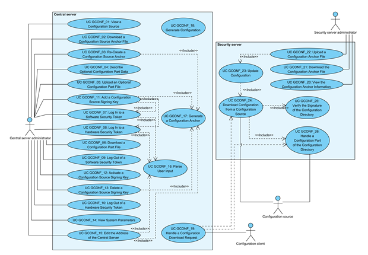

# X-Road: Use Case Model for Global Configuration Distribution
**Analysis**

Version: 1.8  
07.02.2023
Doc. ID: UC-GCONF

-----------------

## Version history

| Date       | Version | Description                                                                                                                                                                                                                                                                      | Author             |
|------------|---------|----------------------------------------------------------------------------------------------------------------------------------------------------------------------------------------------------------------------------------------------------------------------------------|--------------------|
| 09.07.2015 | 0.1     | Initial version                                                                                                                                                                                                                                                                  | Riin Saarmäe       |
| 10.09.2015 | 0.2     | Central server use cases added                                                                                                                                                                                                                                                   | Riin Saarmäe       |
| 14.09.2015 | 0.3     | Error messages for global configuration generation added                                                                                                                                                                                                                         | Martin Lind        |
| 14.09.2015 | 0.4     | Added comments and minor editorial changes                                                                                                                                                                                                                                       | Margus Freudenthal |
| 15.09.2015 | 0.5     | Changes in error messages' structure and more accurate configuration location                                                                                                                                                                                                    | Martin Lind        |
| 15.09.2015 | 0.6     | Corrections and additions done                                                                                                                                                                                                                                                   | Riin Saarmäe       |
| 16.09.2015 | 0.7     | Use cases for changing the central server address added                                                                                                                                                                                                                          | Riin Saarmäe       |
| 20.09.2015 | 1.0     | Editorial changes made                                                                                                                                                                                                                                                           | Imbi Nõgisto       |
| 21.09.2015 | 1.1     | Minor corrections made                                                                                                                                                                                                                                                           | Imbi Nõgisto       |
| 04.11.2015 | 1.2     | Renamed *Scope* element to *System*. Renamed *native* to *local*. Added brief description to UC GCONF\_5.                                                                                                                                                                        | Riin Saarmäe       |
| 16.12.2015 | 1.3     | GCONF\_11 updated: a label value can be assigned for the key on generation. UC GCONF\_24 updated: the last successful configuration source is used for downloading configuration, if the download from the last successful source fails then the next source is chosen randomly. | Riin Saarmäe       |
| 12.02.2016 | 1.4     | GCONF\_22 updated: the verification of the instance identifier on configuration anchor file upload added.                                                                                                                                                                        | Meril Vaht         |
| 29.08.2017 | 1.5     | Changed documentation type from docx to md file                                                                                                                                                                                                                                  | Lasse Matikainen   |
| 06.03.2018 | 1.6     | Moved terms to term doc, added term doc reference and link, added internal MD-doc links                                                                                                                                                                                          | Tatu Repo          |
| 25.08.2021 | 1.7     | Update X-Road references from version 6 to 7                                                                                                                                                                                                                                     | Caro Hautamäki     |
| 07.02.2023 | 1.8     | Updates regarding the validation-program property for optional configuration parts                                                                                                                                                                                               | Justas Samuolis    |

## Table of Contents

- [1 Introduction](#1-introduction)
    * [1.1 Purpose](#11-purpose)
    * [1.2 Terms and Abbreviations](#12-terms-and-abbreviations)
    * [1.3 References](#13-references)
- [2 Overview](#2-overview)
    * [2.1 Actors](#21-actors)
    * [2.2 Central Server Use Cases](#22-central-server-use-cases)
        * [2.2.1 UC GCONF\_01: View a Configuration Source](#221-uc-gconf_01-view-a-configuration-source)
        * [2.2.2 UC GCONF\_02: Download a Configuration Source Anchor File](#222-uc-gconf_02-download-a-configuration-source-anchor-file)
        * [2.2.3 UC GCONF\_03: Re-Create a Configuration Source Anchor](#223-uc-gconf_03-re-create-a-configuration-source-anchor)
        * [2.2.4 UC GCONF\_04: Describe Optional Configuration Part Data](#224-uc-gconf_04-describe-optional-configuration-part-data)
        * [2.2.5 UC GCONF\_05: Upload an Optional Configuration Part File](#225-uc-gconf_05-upload-an-optional-configuration-part-file)
        * [2.2.6 UC GCONF\_06: Download a Configuration Part File](#226-uc-gconf_06-download-a-configuration-part-file)
        * [2.2.7 UC GCONF\_07: Log In to a Software Security Token](#227-uc-gconf_07-log-in-to-a-software-security-token)
        * [2.2.8 UC GCONF\_08: Log In to a Hardware Security Token](#228-uc-gconf_08-log-in-to-a-hardware-security-token)
        * [2.2.9 UC GCONF\_09: Log Out of a Software Security Token](#229-uc-gconf_09-log-out-of-a-software-security-token)
        * [2.2.10 UC GCONF\_10: Log Out of a Hardware Security Token](#2210-uc-gconf_10-log-out-of-a-hardware-security-token)
        * [2.2.11 UC GCONF\_11: Add a Configuration Source Signing Key](#2211-uc-gconf_11-add-a-configuration-source-signing-key)
        * [2.2.12 UC GCONF\_12: Activate a Configuration Source Signing Key](#2212-uc-gconf_12-activate-a-configuration-source-signing-key)
        * [2.2.13 UC GCONF\_13: Delete a Configuration Source Signing Key](#2213-uc-gconf_13-delete-a-configuration-source-signing-key)
        * [2.2.14 UC GCONF\_14: View System Parameters](#2214-uc-gconf_14-view-system-parameters)
        * [2.2.15 UC GCONF\_15: Edit the Address of the Central Server](#2215-uc-gconf_15-edit-the-address-of-the-central-server)
        * [2.2.16 UC GCONF\_16: Parse User Input](#2216-uc-gconf_16-parse-user-input)
        * [2.2.17 UC GCONF\_17: Generate a Configuration Anchor](#2217-uc-gconf_17-generate-a-configuration-anchor)
        * [2.2.18 UC GCONF\_18: Generate Configuration](#2218-uc-gconf_18-generate-configuration)
        * [2.2.19 UC GCONF\_19: Handle a Configuration Download Request](#2219-uc-gconf_19-handle-a-configuration-download-request)
    * [2.3 Security Server Use Cases](#23-security-server-use-cases)
        * [2.3.1 UC GCONF\_20: View the Configuration Anchor Information](#231-uc-gconf_20-view-the-configuration-anchor-information)
        * [2.3.2 UC GCONF\_21: Download the Configuration Anchor File](#232-uc-gconf_21-download-the-configuration-anchor-file)
        * [2.3.3 UC GCONF\_22: Upload a Configuration Anchor File](#233-uc-gconf_22-upload-a-configuration-anchor-file)
        * [2.3.4 UC GCONF\_23: Update Configuration](#234-uc-gconf_23-update-configuration)
        * [2.3.5 UC GCONF\_24: Download Configuration from a Configuration Source](#235-uc-gconf_24-download-configuration-from-a-configuration-source)
        * [2.3.6 UC GCONF\_25: Verify the Signature of the Configuration Directory](#236-uc-gconf_25-verify-the-signature-of-the-configuration-directory)
        * [2.3.7 UC GCONF\_26: Handle a Configuration Part of the Configuration Directory](#237-uc-gconf_26-handle-a-configuration-part-of-the-configuration-directory)

## License

This work is licensed under the Creative Commons Attribution-ShareAlike
3.0 Unported License. To view a copy of this license, visit
http://creativecommons.org/licenses/by-sa/3.0/.

## 1 Introduction

### 1.1 Purpose

The purpose of this document is to describe:

-   the management of configuration sources in central server and
    security server,

-   the generation and distribution of the global configuration in
    central server and

-   the downloading and verification of the global configuration in
    security server.

This document does not include use cases for

-   the federation of X-Road systems – these use cases are described in
    document “X-Road: Use Case Model for Federation” \[UC-FED\].

-   the functionality of the configuration proxy – these use cases are
    described in document “X-Road: Use Case Model for the Configuration
    Proxy” \[[UC-CP](#Ref_UC-CP)\].

The use cases include verifications that take place, and the main error
conditions that may be encountered during the described process. The
general system errors that may be encountered in most of the use cases
(e.g., database connection errors or out of memory errors) are not
described in this document.

The use cases assume that the X-Road software components involved in the
use cases are installed and initialised (see \[[IG-CS](#Ref_IG-CS)\] and \[[IG-SS](#Ref_IG-SS)\]).

The use cases including a human actor (the *level* of the use case is
*user task*) assume, that the actor is logged in to the system and has
the access rights required to carry out the use case.

### 1.2 Terms and Abbreviations

See X-Road terms and abbreviations documentation \[[TA-TERMS](#Ref_TERMS)\].

### 1.3 References

1.  \[IG-CS\] X-Road 7. Central Server
    Installation Guide. Document ID: [IG-CS](../Manuals/ig-cs_x-road_6_central_server_installation_guide.md).

2.  \[IG-SS\] X-Road 7. Security Server
    Installation Guide. Document ID: [IG-SS](../Manuals/ig-ss_x-road_v6_security_server_installation_guide.md).

3.  \[INI\] INI file.
    <http://en.wikipedia.org/wiki/INI_file>

4.  \[PKCS11\] PKCS \#11 Cryptographic Token
    Interface Base Specification Version 2.40. Function return values.
    <http://docs.oasis-open.org/pkcs11/pkcs11-base/v2.40/csprd01/pkcs11-base-v2.40-csprd01.html#_Toc372627249>

5.  \[PR-GCONF\] X-Road: Protocol for
    Downloading Configuration. Document ID: [PR-GCONF](../Protocols/pr-gconf_x-road_protocol_for_downloading_configuration.md).

6.  \[SPEC-AL\] X-Road:
    Audit Log Events. Document ID: SPEC-AL.

7.  \[UC-CP\] X-Road: Use Case Model for the
    Configuration Proxy. Document ID: [UC-CP](uc-cp_x-road_configuration_proxy_use_case_model_1.2_Y-883-5.md).

8.  \[UC-FED\] X-Road: Use Case Model for
    Federation. Document ID: [UC-FED](uc-fed_x-road_use_case_model_for_federation_1.1_Y-883-7.md).

9.  \[UG-SYSPAR\] X-Road:
    System Parameters. Document ID: [UG-SYSPAR](../Manuals/ug-syspar_x-road_v6_system_parameters.md).

10. \[TA-TERMS\] X-Road Terms and Abbreviations. Document ID: [TA-TERMS](../terms_x-road_docs.md).

## 2 Overview

The X-Road security servers periodically download global configuration
distributed by the configuration providers. The global configuration is
used to verify the parties communicating over the X-Road and to check
the validity of various data items, such as authentication certificates,
OCSP responses and timestamps.

The information needed by the security servers for downloading and
verifying global configuration is contained in configuration anchors.
The configuration anchors are distributed by the internal configuration
providers to the security server owners via out of band means.

The configuration providers ensure the integrity of the distributed
configuration by signing the configuration directory.

### 2.1 Actors

The use case model for downloading configuration includes the following
actors.

-   **SS administrator** (security server administrator) – a person
    responsible for managing the security server.

-   **CS administrator** (central server administrator) – a person
    responsible for managing the central server.

-   **Configuration source** – a component (HTTP server) managed by the
    central server or the configuration proxy that distributes global
    configuration.

-   **Configuration client** – security server that downloads
    configuration from configuration source(s).

Relationships between the actors, systems and use cases are described in
Figure 1.

Figure 1. Use case diagram for distributing global configuration

### 2.2 Central Server Use Cases

#### 2.2.1 UC GCONF\_01: View a Configuration Source 

**System**: Central server

**Level**: User task

**Component:** Central server

**Actor**: CS administrator

**Brief Description**: CS administrator views the information about a
configuration source provided by the central server.

**Preconditions**: -

**Postconditions**: The configuration source information has been
displayed to CS administrator.

**Trigger**: CS administrator wishes to view the configuration source
information.

**Main Success Scenario**:

1.  CS administrator selects to view a configuration source.

2.  System displays a configuration source provided by the central
    server. The following information is displayed.

    -   Type of the configuration source (internal/external).

    -   The SHA-224 hash value of the configuration anchor.

    -   The generation date and time (UTC) of the configuration anchor.

    -   The configuration download URL – address from where the
        configuration directory provided by this source can be
        downloaded. The system composes the download URL by adding
        */internalconf* or */externalconf*
        (depending on the type of the configuration source) to the
        address of the central server.

    -   List of configuration signing keys. For each key, the following
        information is displayed:

        -   the identifier of the device holding the key,

        -   the identifier of the key,

        -   the key generation date and time.

    The key currently used to sign configuration is displayed is
    emphasised. Only the keys that have a certificate associated with them are displayed.

    -   List of configuration part files distributed by the source. For each
     configuration part, the following information is displayed:

    -   name of the configuration part file,

    -   content identifier of the configuration part,

    -   date and time when the configuration part file was last updated.
    
    The following user action options are displayed:

    -   download the configuration source anchor file: 2.2.2;
    
    -   re-create the configuration source anchor file: 2.2.3;
    
    -   add a configuration signing key: 2.2.11;
    
    -   delete a configuration signing key: 2.2.13;
    
    -   activate a configuration signing key: 2.2.12;
    
    -   log in to a security token holding a configuration signing key:
        2.2.7 or 2.2.8;
    
    -   log out of a security token holding a configuration signing key:
        2.2.9 or 2.2.10;
    
    -   download a configuration part file: 2.2.6;
    
    -   upload an optional configuration part file: 2.2.5, in case the
        optional part is described in the system: 2.2.4.

**Extensions**: -

**Related information**: -

#### 2.2.2 UC GCONF\_02: Download a Configuration Source Anchor File

**System**: Central server

**Level**: User task

**Component:** Central server

**Actor**: CS administrator

**Brief Description**: CS administrator downloads the configuration
anchor of a configuration source.

**Preconditions**: The anchor file has been generated.

**Postconditions**: CS administrator has downloaded the anchor file.

**Trigger**: CS administrator wishes to download the configuration
anchor, either to view its contents or to distribute the anchor to
configuration clients.

**Main Success Scenario**:

1.  CS administrator selects to download the configuration anchor of a
    configuration source (internal or external).

2.  System presents the configuration anchor file for downloading.

3.  CS administrator saves the anchor file to the file system of the
    local computer.

**Extensions**: -

**Related information**:

-   The contents and format of the configuration anchor file is
    described in the document “X-Road: Protocol for Downloading
    Configuration” \[[PR-GCONF](#Ref_PR-GCONF)\].

#### 2.2.3 UC GCONF\_03: Re-Create a Configuration Source Anchor

**System**: Central server

**Level**: User task

**Component:** Central server

**Actor**: CS administrator

**Brief Description**: CS administrator re-creates the configuration
anchor of a configuration source. Under normal system behaviour,
generation of the anchor file by CS administrator is unnecessary, as the
system generates the anchor file automatically when needed. The
re-creation allows to recover from system malfunctions.

**Preconditions**: -

**Postconditions**: An audit log record for the event has been created.

**Trigger**: CS administrator wishes to re-create the configuration
anchor for a configuration source.

**Main Success Scenario**:

1.  CS administrator selects to re-create the configuration anchor.

2.  System generates the configuration anchor: 2.2.17.

3.  System displays the message: “Internal configuration anchor
    generated successfully” or “External configuration anchor generated
    successfully, depending on the configuration source the anchor was
    re-created for.

4.  System logs the event “Re-create internal configuration anchor” or
    “Re-create external configuration anchor”, depending on which
    configuration source the anchor file was re-created for, to the
    audit log.

**Extensions**:

- 2a. The process of generating the anchor terminated with an error message.
    - 2a.1. System displays the error message: “X configuration anchor generation failed: Y”, where “X” is the type of the configuration source (internal or external) and “Y” is the reason for the failure.
    - 2a.2. System logs the event “Re-create internal configuration anchor failed” or “Re-create external configuration anchor failed”, depending on the configuration source, to the audit log. Use case terminates.

**Related information**:

-   The audit log is located at /var/log/xroad/audit.log. The data set
    of audit log records is described in the document “X-Road: Audit Log
    Events” \[[SPEC-AL](#Ref_SPEC-AL)\].

#### 2.2.4 UC GCONF\_04: Describe Optional Configuration Part Data

**System**: Central server

**Level**: User task

**Component:** Central server

**Actor**: CS administrator

**Brief Description**: CS administrator creates a file in the system
configuration that contains information needed for the system to
recognize, validate and distribute an optional configuration part.

**Preconditions**: -

**Postconditions**: A file describing an optional configuration part has
been saved in the system configuration. The option to upload the
optional configuration part file is enabled in the GUI.

**Trigger**: Information not contained in the shared or private
parameters parts needs to be added to the global configuration.

**Main Success Scenario**:

1.  CS administrator creates an INI file (see \[[INI](#Ref_INI)\]) in the
    /etc/xroad/configuration-parts directory containing the following
    key-value pairs:

    a.  content-identifier = &lt;value&gt; (e.g., FOO)

    b.  file-name = &lt;value&gt; (e.g., foo.xml)

2.  CS administrator saves the created file.

**Extensions**: -

**Related information**:

-   The description file must be a valid INI file and the read
    permission of the created description file must be given to the
    “xroad” group.

-   The system uses the values of the content-identifier and file-name
    keys respectively as *Content-identifier* and *Content-file-name*
    MIME header values in the configuration directory (for further
    information, please see the document “X-Road: Protocol for
    Downloading Configuration” \[[PR-GCONF](#Ref_PR-GCONF)\]) and also for displaying
    configuration part information in the GUI.

-   Editing or deleting the INI file manually is currently not supported
    and may result in inconsistent system behavior. The current solution
    assumes that the INI files describing optional configuration
    parameters are added, edited and deleted by software installation or
    update packages.

#### 2.2.5 UC GCONF\_05: Upload an Optional Configuration Part File

**System**: Central server

**Level**: User task

**Component:** Central server

**Actor**: CS administrator

**Brief Description**: CS administrator uploads an optional
configuration part file.

**Preconditions**: Optional configuration part data is described in the
system (see 2.2.4).

**Postconditions**: An audit log record for the event has been created.

**Trigger**: The contents of the optional configuration part file have
been changed and CS administrator wants to upload the updated file to
the system.

**Main Success Scenario**:

1.  CS administrator selects to upload an optional configuration part
    file.

2.  CS administrator inserts the path to the configuration part file in
    the computer's file system.

3.  System verifies that the uploaded file conforms to xsd schema for 
    given content identifier.

4.  System displays the message “Configuration file for content
    identifier 'X' uploaded successfully.”, where “X” is the
    content-identifier described for the configuration part.

5.  System verifies that a file for this optional configuration part
    already exists in the system configuration and replaces the existing
    file with the uploaded one.

6.  System logs the event “Upload configuration part” to the audit log.

**Extensions**:

- 3a. A validator is not described for this configuration part.
    - 3a.1. Use case continues from step 5.

- 3b. The system is unable to find the described validation program.
    - 3b.1. System displays the error message: “Failed to upload configuration part: Validation program 'X' does not exist in the file system.”, where “X” is the validation program path described for this configuration part.
    - 3b.2. System logs the event “Upload configuration part failed” to the audit log.
    - 3b.3. CS administrator selects to reinsert the path to the configuration part file. Use case continues from step 3.
        - 3b.3a. CS administrator selects to terminate the use case.

- 3c. The communication with the validation program closed unexpectedly.
    - 3c.1. System displays the error message: “Validation program 'X' ended prematurely, make sure if it does the right thing.”, where “X” is the validation program path described for this configuration part.
    - 3c.2. System logs the event “Upload configuration part failed” to the audit log.
    - 3c.3. CS administrator selects to reinsert the path to the configuration part file. Use case continues from step 3.
        - 3c.3a. CS administrator selects to terminate the use case.

- 3d. An error occurred while running the validation program.
    - 3d.1. System displays the error message: “IO error occurred when running validation program 'X', message: 'Y'”, where “X” is the validation program path described for this configuration part and “Y” is the description of the error.
    - 3d.2. System logs the event “Upload configuration part failed” to the audit log.
    - 3d.3. CS administrator selects to reinsert the path to the configuration part file. Use case continues from step 3.
        - 3d.3a. CS administrator selects to terminate the use case.

- 4a. The validation succeeded with validation errors.
    - 4a.1. System displays the error message: “Failed to upload configuration part: Validation of configuration file with content identifier 'X' failed.”, where “X” is the content identifier of the optional configuration part CS administrator chose to upload, and the validation errors.
    - 4a.2. System logs the event “Upload configuration part failed” to the audit log.
    - 4a.3. CS administrator selects to reinsert the path to the configuration part file. Use case continues from step 3.
        - 4a.3a. CS administrator selects to terminate the use case.

- 4b. The validation succeeded with validation warnings.
    - 4b.1. System displays the message: “Configuration file for content identifier 'X' uploaded with some warnings.”, where “X” is the content identifier of the optional configuration part CS administrator chose to upload, and the validation warnings.
    - 4b.2. Use case continues from step 6.

- 6a. No previous file for this optional part exists in the system's database.
    - 6a.1. System saves the uploaded file.

**Related information**:

-   The uploaded file is distributed to the configuration clients as a
    part of the internal configuration.

-   The audit log is located at /var/log/xroad/audit.log. The data set
    of audit log records is described in the document “X-Road: Audit Log
    Events” \[[PR-GCONF](#Ref_PR-GCONF)\].

#### 2.2.6 UC GCONF\_06: Download a Configuration Part File

**System**: Central server

**Level**: User task

**Component:** Central server

**Actor**: CS administrator

**Brief Description**: CS administrator downloads a configuration part
file.

**Preconditions**: Configuration part file has been generated by the
system or uploaded to the system.

**Postconditions**: CS administrator has downloaded the configuration
part file.

**Trigger**: CS administrator wishes to download a configuration part
file, e.g., to view the contents of the file.

**Main Success Scenario**:

1.  CS administrator selects to download a configuration part file.

2.  System presents the configuration part file for downloading.

3.  CS administrator saves the configuration part file to the computer's
    file system.

**Extensions**: -

**Related information**:

-   The schemas for private parameters and shared parameters are
    described in the document “X-Road: Protocol for Downloading
    Configuration” \[[PR-GCONF](#Ref_PR-GCONF)\].

#### 2.2.7 UC GCONF\_07: Log In to a Software Security Token

**System**: Central server

**Level**: User task

**Component:** Central server

**Actor**: CS administrator

**Brief Description**: CS administrator logs in to a software token by
entering the token PIN code.

**Preconditions**: The token is in logged out state.

**Postconditions**: An audit log record for the event has been created.

**Triggers**:

-   CS administrator wishes to make the functionality of the token
    available to the system.

-   Step 4a.1. of 2.2.11.

**Main Success Scenario**:

1.  CS administrator selects log in to a software security token.

2.  CS administrator enters the token PIN code.

3.  System parses the user input: 2.2.16.

4.  System verifies the PIN code is correct and logs in to the token.

5.  System logs the event “Log in to token” to the audit log.

**Extensions**:

- 3a. The parsing of the user input terminated with an error message.
    - 3a.1. System displays the termination message of the parsing process.
    - 3a.2. System logs the event “Log in to token failed” to the audit log.
    - 3a.3. CS administrator selects to re-enter the PIN code. Use case continues from step 3.
        - 3a.3a. CS administrator selects to terminate the use case.

- 4a. The entered PIN code is incorrect:
    - 4a.1. System displays the error message: “PIN incorrect”.
    - 4a.2. System logs the event “Log in to token failed” to the audit log.
    - 4a.3. CS administrator selects to re-enter the PIN code. Use case continues from step 3.
        - 4a.3a. CS administrator selects to terminate the use case.

**Related information**:

-   The audit log is located at /var/log/xroad/audit.log. The data set
    of audit log records is described in the document “X-Road: Audit Log
    Events” \[[SPEC-AL](#Ref_PR-GCONF)\].

#### 2.2.8 UC GCONF\_08: Log In to a Hardware Security Token

**System**: Central server

**Level**: User task

**Component:** Central server

**Actor**: CS administrator

**Brief Description**: CS administrator logs in to a hardware token by
entering the token PIN code.

**Preconditions**:

-   The hardware security token is initialized and connected to the
    system.

-   The token is in logged out state.

**Postconditions**: An audit log record for the event has been created.

**Triggers**:

-   CS administrator wishes to make the functionality of the token
    available to the system.

-   Step 4a.1. of 2.2.11.

**Main Success Scenario**:

1.  CS administrator selects log in to a hardware security token holding
    a configuration signing key.

2.  CS administrator enters the token PIN code.

3.  System parses the user input: 2.2.16.

4.  System verifies, that the token is not locked.

5.  System verifies that the entered PIN code conforms to the PIN code
    format configured for the token.

6.  System verifies the entered PIN code is correct and logs in to the
    token.

7.  System logs the event “Log in to token” to the audit log.

**Extensions**:

- 3a. The parsing of the user input terminated with an error message.
    - 3a.1. System displays the termination message of the parsing process.
    - 3a.2. System logs the event “Log in to token failed” to the audit log.
    - 3a.3. CS administrator selects to re-enter the PIN code. Use case continues from step 3.
        - 3a.3a. CS administrator selects to terminate the use case.

- 4-6a. The login attempt failed (e.g., incorrect PIN was entered).
    - 4-6a.1. System displays the error message: “Login failed: X”, where “X” is the error code from the PKCS \#11 cryptographic token interface (see \[PKCS11\]).
    - 4-6a.2. System logs the event “Log in to token failed” to the audit log.
    - 4-6a.3. CS administrator selects to re-enter the PIN code. Use case continues from step 3.
        - 4-6a.3a. CS administrator selects to terminate the use case.

- 4b. The token is inaccessible.
    - 4b.1. System displays the error message: “Token 'X' not available”, where “X” is the identifier of the security token.
    - 4b.2. System logs the event “Log in to token failed” to the audit log.
    - 4-6a.3. CS administrator selects to re-enter the PIN code. Use case continues from step 3.
        - 4-6a.3a. CS administrator selects to terminate the use case.

- 4b. The security token is locked (too many incorrect PIN entries).
    - 4b.1. System displays the error message: “PIN locked”.
    - 4b.2. System logs the event “Log in to token failed” to the audit log.
    - 4b.3. CS administrator selects to re-enter the PIN code. Use case continues from step 3.
        - 4b.3a. CS administrator selects to terminate the use case.

- 5b. The format of the entered PIN code is not acceptable for the token.
    - 5b.1. System displays the error message: “PIN format incorrect”.
    - 5b.2. System logs the event “Log in to token failed” to the audit log.
    - 5b.3. CS administrator selects to re-enter the PIN code. Use case continues from step 3.
        - 5b.3a. CS administrator selects to terminate the use case.

- 6b. The entered PIN code is incorrect and one login attempt is left.
    - 6b.1. System displays the error message: “Login failed: CKR\_PIN\_INCORRECT, tries left: 1”.
    - 6b.2. System logs the event “Log in to token failed” to the audit log.
    - 6b.3. CS administrator selects to re-enter the PIN code. Use case continues from step 3.
        - 6b.3a. CS administrator selects to terminate the use case.

- 6c. The entered PIN code is incorrect and no login attempts are left (i.e., the token is locked).
    - 6c.1. System displays the error message: “Login failed: CKR\_PIN\_INCORRECT. PIN locked.”.
    - 6c.2. System logs the event “Log in to token failed” to the audit log.
    - 6c.3. CS administrator selects to re-enter the PIN code. Use case continues from step 3.
        - 6b.3a. CS administrator selects to terminate the use case.

**Related information**:

-   The audit log is located at /var/log/xroad/audit.log. The data set
    of audit log records is described in the document “X-Road: Audit Log
    Events” \[[SPEC-AL](#Ref_SPEC-AL)\].

#### 2.2.9 UC GCONF\_09: Log Out of a Software Security Token

**System**: Central server

**Level**: User task

**Component:** Central server

**Actor**: CS administrator

**Brief Description**: CS administrator logs out of a software security
token.

**Preconditions**:

-   The software security token is holding one or more configuration
    signing keys.

-   The software security token is in logged in state.

**Postconditions**:

-   The token is in logged out state.

-   The system cannot use the keys on the token for signing
    configuration.

-   An audit log record for the event has been created.

**Trigger**: CS administrator wishes to log out of a software security
token.

**Main Success Scenario**:

1.  CS administrator selects to log out of a token.

2.  System logs out of the token.

3.  System logs the event “Log out from token” to the audit log.

**Extensions**: -

**Related information**:

-   The audit log is located at /var/log/xroad/audit.log. The data set
    of audit log records is described in the document “X-Road: Audit Log
    Events” \[[SPEC-AL](#Ref_SPEC-AL)\].

#### 2.2.10 UC GCONF\_10: Log Out of a Hardware Security Token

**System**: Central server

**Level**: User task

**Component:** Central server

**Actor**: CS administrator

**Brief Description**: CS administrator logs out of a hardware security
token.

**Preconditions**:

-   The hardware security token is holding one or more configuration
    signing keys.

-   The hardware security token is logged in to.

**Postconditions**:

-   The system cannot use the keys on the token for signing
    configuration.

-   An audit log record for the event has been created.

**Trigger**: CS administrator wishes to log out of a software security
token.

**Main Success Scenario**:

1.  CS administrator selects to log out of a security token.

2.  System logs out of the token.

3.  System logs the event “Log out from token” to the audit log.

**Extensions**:

- 2a. The logout attempt failed (e.g., token is inaccessible).
    - 2a.1. System displays the error message: “Logout failed: X”, where “X” is the error code from the PKCS \#11 cryptographic token interface \[PKCS11\].
    - 2a.2. System logs the event “Log out from token failed” to the audit log.
    - 2a.3. Use case terminates.

**Related information**:

-   The audit log is located at /var/log/xroad/audit.log. The data set
    of audit log records is described in the document “X-Road: Audit Log
    Events” \[[SPEC-AL](#Ref_SPEC-AL)\].

#### 2.2.11 UC GCONF\_11: Add a Configuration Source Signing Key

**System**: Central server

**Level**: User task

**Component:** Central server

**Actor**: CS administrator

**Brief Description**: CS administrator generates a configuration source
signing key on a security token. System creates a self-signed
certificate containing the public key part of the generated key and
generates the configuration anchor containing the created certificate.

**Preconditions**: A security token is initialised and connected to the
system.

**Postconditions**: -

**Trigger**: CS administrator wishes to add a signing key for a
configuration source (e.g., as a part of performing a regular key
change).

**Main Success Scenario**:

1.  CS administrator selects to add a configuration source signing key
    for a configuration source (either internal or external).

2.  System displays the list of available security tokens.

3.  CS administrator selects a security token and enters the label of
    the key.

4.  System generates a new configuration signing key with the inserted
    label on the selected token.

5.  System creates a self-signed certificate containing the public key
    part of the generated key.

6.  System saves the generated key information and the created
    certificate to system configuration.

7.  System verifies that the selected configuration source already has
    an active key.

8.  System logs the event “Generate internal configuration signing key”
    or “Generate external configuration signing key”, depending of the
    configuration source, to the audit log.

9.  System generates the configuration anchor for the configuration
    source: 2.2.17.

**Extensions**:

- 3a. The desired token is not on the list:
    - 3a.1. CS administrator terminates the use case.

- 4a. Key generation fails because the token is not logged in to.
    - 4a.1. System initiates the use case 2.2.7 or 2.2.8, depending on the type of the selected token.
    - 4a.2. System verifies that the log in process ended successfully. Use case continues from step 4.
        - 4a.2a. The log in process terminated with an error condition.
            - 4a.2a.1. CS administrator selects to reselect a security token. Use case continues from step 4.
                - 4a.2a.1a. CS administrator selects to terminate the use case.

- 4b. Key generation fails.
    - 4b.1. System displays an error message: “Failed to generate signing key: X”, where “X” is the description of the error. If the key generation failed on a hardware security token, then “X” is the error code from the PKCS \#11 cryptographic token interface \[PKCS11\].
    - 4b.2. System logs the event “Generate internal configuration signing key failed” or “Generate external configuration signing key failed”, depending of the configuration source, to the audit log.
    - 4b.3. CS administrator selects to reselect a security token. Use case continues from step 4.
        - 4b.3a. CS administrator selects to terminate the use case.

- 5a. Generation of the self-signed certificate fails:
    - 5a.1. System deletes the generated key.
        - 5a.1a. Key deletion fails.
            - 5a.1a.1. Use case continues from step 5a.2.
    - 5a.2. System displays the error message: “Failed to generate signing key: X”, where “X” is the description of the error.
    - 5a.3. System logs the event “Generate internal configuration signing key failed” or “Generate external configuration signing key failed”, depending of the configuration source, to the audit log.
    - 5a.4. CS administrator selects to reselect a security token. Use case continues from step 4.
        - 5a.4a. CS administrator selects to terminate the use case.

- 7a. The selected source does not have an active key.
    - 7a.1. System marks the key as active and starts using the key for signing the configuration provided by the source.
    - 7a.2. Use case continues from step 8.

**Related information**:

-   The audit log is located at /var/log/xroad/audit.log. The data set
    of audit log records is described in the document “X-Road: Audit Log
    Events” \[[SPEC-AL](#Ref_SPEC-AL)\].

#### 2.2.12 UC GCONF\_12: Activate a Configuration Source Signing Key

**System**: Central server

**Level**: User task

**Component:** Central server

**Actor**: CS administrator

**Brief Description**: CS administrator activates a configuration
signing key. System uses the active key to sign configuration provided
by the configuration source.

**Preconditions**: A security token containing an inactive signing key
associated with the configuration source is connected to the system.

**Postconditions**: -

**Trigger**: CS administrator wishes to change the key that the system
uses for signing configuration provided by the source.

**Main Success Scenario**:

1.  CS administrator selects to activate an inactive configuration
    source signing key.

2.  System prompts for confirmation.

3.  CS administrator confirms.

4.  System verifies that the key to be activated is accessible, marks
    the key as active and starts using the key for signing the
    configuration provided by the source.

5.  System logs the event “Activate internal configuration signing key”
    or “Activate external configuration signing key”, depending of the
    configuration source, to the audit log.

**Extensions**:

- 3a. CS administrator cancels the key activation.
    - 3a.1. System terminates use case.

- 4a. The key to be activated is not accessible.
    - 4a.1. System displays the error message: “Failed to activate signing key: token or key not available”.
    - 4a.2. System logs the event “Activate internal configuration signing key failed” or “Activate external configuration signing key failed”, depending of the configuration source, to the audit log.
    - 4a.3. Use case terminates.

**Related information**:

-   The audit log is located at /var/log/xroad/audit.log. The data set
    of audit log records is described in the document “X-Road: Audit Log
    Events” \[[SPEC-AL](#Ref_SPEC-AL)\].

#### 2.2.13 UC GCONF\_13: Delete a Configuration Source Signing Key

**System**: Central server

**Level**: User task

**Component:** Central server

**Actor**: CS administrator

**Brief Description**: CS administrator deletes a configuration source
signing key and the associated certificate. System generates the
configuration anchor that contains updated certificates for the
configuration source.

**Preconditions**: The signing key is not in active state (i.e., the
system is using another key for signing the configuration).

**Postconditions**: -

**Trigger**: CS administrator wishes to delete a configuration signing
key.

**Main Success Scenario**:

1.  CS administrator selects to delete a configuration source signing
    key.

2.  System prompts for confirmation.

3.  CS administrator confirms.

4.  System deletes the selected configuration signing key information
    and the associated certificate from system configuration and
    displays the message: “Key successfully deleted from central server
    configuration”.

5.  System generates the configuration anchor for the configuration
    source: 2.2.17.

6.  System logs the event “Delete internal configuration signing key” to
    the audit log.

7.  System deletes the signing key from the security token and displays
    the message: “Key successfully deleted from token 'X'”, where “X” is
    the identifier of the token.

**Extensions**:

- 3a. CS administrator cancels the key deletion.
    - 3a1. System terminates use case.

- 7a. System fails to delete the signing key form the security token.
    - 7a.1. System displays the error message: “Failed to delete key from token 'X': Y”, where “X” is the identifier of the token and “Y” is the error details.

**Related information**:

-   The audit log is located at /var/log/xroad/audit.log. The data set
    of audit log records is described in the document “X-Road: Audit Log
    Events” \[[SPEC-AL](#Ref_SPEC-AL)\].

#### 2.2.14 UC GCONF\_14: View System Parameters

**System**: Central server

**Level**: User task

**Component:** Central server

**Actor**: CS administrator

**Brief Description**: CS administrator views the system parameters of
the central server.

**Preconditions**: -

**Postconditions**: The system parameters have been displayed to the CS
administrator.

**Trigger**: CS administrator wishes to view the system parameters.

**Main Success Scenario**:

1.  CS administrator selects to view the system parameters.

2.  System displays the following information:

    -   the instance identifier of this X-Road instance;

    -   the address of the central server.

    The following user action options are displayed:

    -   edit the address of the central server: 2.2.15.

**Extensions**: -

**Related information**: -

#### 2.2.15 UC GCONF\_15: Edit the Address of the Central Server

**System**: Central server

**Level**: User task

**Component:** Central server

**Actor**: CS administrator

**Brief Description**: CS administrator changes the address of the
central server.

**Preconditions**: -

**Postconditions**: An audit log record for the event has been created.

**Trigger**: CS administrator wishes to change the address on which the
central server is available for incoming requests (e.g., management
service requests, configuration download requests).

**Main Success Scenario**:

1.  CS administrator selects to change the public address of the central
    server.

2.  CS administrator inserts the address.

3.  System parses the user input 2.2.16.

4.  System verifies, that the inserted address is a valid DNS name or IP
    address.

5.  System saves the address.

6.  System logs the event “Edit central server address” to the audit
    log.

7.  System generates configuration anchors for the internal and external
    configuration: 2.2.17.

**Extensions**:

- 3a. The parsing of the user input terminated with an error message.
    - 3a.1. System displays the termination message of the parsing process.
    - 3a.2. System logs the event “Edit central server address failed” to the audit log.
    - 3a.3. User selects to reinsert the address. Use case continues from step 3.
        - 3a.3a. User selects to terminate the use case.

- 4a. The inserted address is not valid.
    - 4a.1. System displays the error message: “Central server address must be DNS name or IP address”.
    - 4a.2. System logs the event “Edit central server address failed” to the audit log.
    - 4a.3. User selects to reinsert the address. Use case continues from step 3.
        - 4a.3a. User selects to terminate the use case.

**Related information**:

-   The audit log is located at /var/log/xroad/audit.log. The data set
    of audit log records is described in the document “X-Road: Audit Log
    Events” \[[SPEC-AL](#Ref_SPEC-AL)\].

#### 2.2.16 UC GCONF\_16: Parse User Input

**System**: Central server

**Level**: Subfunction

**Component:** Central server

**Actors**: -

**Brief Description**: System removes the leading and trailing
whitespaces from the user input and verifies that the required fields
are not empty.

**Preconditions**: -

**Postconditions**: -

**Triggers**:

-   Step 3 of 2.2.7.

-   Step 3 of 2.2.8.

-   Step 3 of 2.2.15.

**Main Success Scenario**:

1.  System removes leading and trailing whitespaces.

2.  System verifies that the mandatory fields are filled.

3.  System verifies that the user input does not exceed 255 characters.

**Extensions**:

- 2a. One or more mandatory fields are not filled.
    - 2a.1. Use case terminates with the error message “Missing parameter: 'X'”, where “X” is the name of the missing parameter.

- 3a. The user input exceeds 255 symbols.
    - 3a.1. Use case terminates with the error message “Parameter X input exceeds 255 characters”, where “X” is the name of the parameter that had more than 255 characters inserted.

**Related information: -**

#### 2.2.17 UC GCONF\_17: Generate a Configuration Anchor

**System**: Central server

**Level**: Subfunction

**Component:** Central server

**Actor**: -

**Brief Description**: System generates for a configuration source a
configuration anchor containing the information needed for the
configuration clients for downloading and verifying configuration from
the configuration source.

**Preconditions**: The instance identifier and central server address
are saved in the system configuration.

**Postconditions**: -

**Triggers**:

-   Step 2 of 2.2.3.

-   Step 9 of 2.2.11.

-   Step 5 of 2.2.13.

-   Step 7 of 2.2.15.

**Main Success Scenario**:

1.  System verifies that at least one signing key with the corresponding
    certificate is saved in the system configuration for the
    configuration source.

2.  System generates the anchor file and calculates the file hash.

3.  System saves the anchor file, file hash and file generation time to
    system configuration.

4.  System displays the message: “Internal configuration anchor
    generated successfully” or “External configuration anchor generated
    successfully”, depending on the configuration source.

**Extensions**:

- 1a. System did not find any configuration signing keys for the configuration source.
    - 1a.1. System displays the error message: “X configuration anchor generation failed: No configuration signing keys configured”, where “X” stands for either “Internal” or “External”, depending on the configuration source. Use case terminates.

**Related information**:

-   The schema for the configuration anchor file can be found in the
    document “X-Road: Protocol for Downloading Configuration”
    \[[PR-GCONF](#Ref_PR-GCONF)\].

#### 2.2.18 UC GCONF\_18: Generate Configuration

**System**: Central server

**Level**: System task

**Component:** Central server

**Actor**: -

**Brief Description**: System generates private and shared configuration
part files, builds and signs the configuration directories for
configuration sources, and makes the global configuration available for
configuration clients.

**Preconditions**: -

**Postconditions**: -

**Trigger**: Configuration generation timer defined in the central
server configuration file /etc/cron.d/xroad-center*.*

**Main Success Scenario**:

1.  System verifies that the system configuration contains the data
    necessary for generating configuration and generates the private
    parameters and shared parameters configuration part files.

2.  System verifies the validity of the generated files against the
    respective schemas and saves the generated files to the system
    configuration.

3.  System

    -   calculates the configuration expiry time (by adding the value of
        the central server system parameter *confExpireIntervalSeconds*
        to current time);

    -   calculates the hash values of the generated configuration files
        using the algorithm defined by the value of the central server
        system parameter *confHashAlgoUri*; and

    -   builds the internal and external configuration directories.

4.  System signs the internal and external configuration directories
    using the active configuration signing keys of the respective
    configuration sources.

5.  System makes the signed configuration directories and configuration
    part files available to configuration clients.

**Extensions**:

- 1a. The generation of the configuration part files failed because the central server address is not configured.
    - 1a.1. System logs the error message “Failed to generate valid global configuration: No authentication service registration URL present. Central server may have not been initialized”.
    - 1a.2. System displays the error message “Global configuration generation failing since 'X'”, where “X” is the time and date since when the system has not been able to generate distributable global configuration.
    - 1a.3. Use case terminates.

- 1b. The generation of the configuration part files failed because the management service provider is not configured.
    - 1b.1. System logs the error message “Failed to generate valid global configuration: Management services provider is not configured”.
    - 1b.2. System displays the error message “Global configuration generation failing since 'X'”, where “X” is the time and date since when the system has not been able to generate distributable global configuration.
    - 1b.3. Use case terminates.

- 1c. The generation of the configuration part files failed for any other reason than the ones stated in extensions 1a and 1b.
    - 1c.1. System logs the error message “Failed to generate valid global configuration: X”, where “X” is the technical system error message.
    - 1c.2. System displays the error message “Global configuration generation failing since 'X'”, where “X” is the time and date since when the system has not been able to generate distributable global configuration.
    - 1c.3. Use case terminates.

- 2a. The validation of the configuration part files failed.
    - 2a.1. System logs the error message “Failed to generate valid global configuration: X”, where “X” is the XML Schema validator specific error message.
    - 2a.2. System displays the error message “Global configuration generation failing since 'X'”, where “X” is the time and date since when the system has not been able to generate distributable global configuration.
    - 2a.3. Use case terminates.

- 3-5a. The building or signing of the configuration directory failed.
    - 3-5a.1. System logs the error message “Failed to generate global configuration: X”, where “X” is the description of the error that occurred.
    - 3-5a.3. Use case terminates.

**Related information**:

-   The system parameters are described in document “X-Road: System
    Parameters” \[UG-SYSPAR\].

-   The contents of the signed directory and the schemas for private
    parameters and shared parameters are described in the document
    “X-Road: Protocol for Downloading Configuration” \[[PR-GCONF](#Ref_PR-GCONF)\].

-   The error messages are logged to /var/log/xroad/jetty/jetty.log.

#### 2.2.19 UC GCONF\_19: Handle a Configuration Download Request 

**System**: Central server

**Level**: System task

**Component:** Central server, security server, configuration proxy

**Actor**: Configuration client

**Brief Description**: System receives a configuration download request
from a configuration client and responds.

**Preconditions**: Signed configuration directory and configuration part
files have been made available for downloading.

**Postconditions**: The configuration client has received either the
requested configuration item (signed configuration directory or a
configuration part file) or an error message.

**Trigger**: Download request from a configuration client.

**Main Success Scenario**:

1.  Configuration client requests to download the signed configuration
    directory or a configuration part file.

2.  System responds with the requested files.

**Extensions**:

- 2a. Request cannot be served.
    - 2a1. System responds with an error message.

**Related information**: -

### 2.3 Security Server Use Cases 

#### 2.3.1 UC GCONF\_20: View the Configuration Anchor Information

**System**: Security server

**Level**: User task

**Component:** Security server

**Actor**: SS administrator

**Brief Description**: SS administrator views the information regarding
the configuration anchor used by the system to download global
configuration.

**Preconditions**: A configuration anchor is saved in the system
configuration (see 2.3.3).

**Postconditions**: The configuration anchor information is displayed to
SS administrator.

**Trigger**: SS administrator wishes to view the configuration anchor
information e.g., to verify that the system is using the latest anchor
provided by the governing agency.

**Main Success Scenario**:

1.  SS administrator selects to view the configuration anchor.

2.  System displays the following information.

    -   The SHA-224 hash value of the configuration anchor.

    -   The generation date and time (UTC) of the configuration anchor.
    
    The following user action options are displayed:

    -   download the configuration anchor file: 2.3.2;

    -   upload a configuration anchor file: 2.3.3.

**Extensions**: -

**Related information**: -

#### 2.3.2 UC GCONF\_21: Download the Configuration Anchor File

**System**: Security server

**Level**: User task

**Component:** Security server

**Actor**: SS administrator

**Brief Description**: SS administrator downloads the configuration
anchor file used by the system to download configuration.

**Preconditions**: A configuration anchor is saved in the system
configuration.

**Postconditions**: The configuration anchor file used by the system has
been downloaded by the SS administrator.

**Trigger**: SS administrator wishes to view the contents of the
configuration anchor file or to store the file to an external location.

**Main Success Scenario**:

1.  SS administrator selects to download the configuration anchor file.

2.  System presents the configuration anchor file for downloading.

3.  SS administrator saves the anchor file to the local file system.

**Extensions**: -

**Related information**: -

#### 2.3.3 UC GCONF\_22: Upload a Configuration Anchor File

**System**: Security server

**Level**: User task

**Component:** Security server

**Actor**: SS administrator

**Brief Description**: SS administrator uploads the configuration anchor
file to the system. System displays the details of the anchor and asks
for SS administrator to confirm the upload. After confirmation, the
system verifies that the configuration downloaded from the source
pointed by this anchor is usable and starts using the uploaded anchor.

**Preconditions**: SS administrator has received a configuration anchor
file form the internal configuration provider and validated the
integrity of the anchor.

**Postconditions**: -

**Trigger**: The configuration anchor needs to be uploaded

-   on system initialization or

-   when the X-Road governing agency has notified SS administrator that
    the configuration anchor needs to be updated.

**Main Success Scenario**:

1.  SS administrator selects to upload a configuration anchor file.

2.  SS administrator inserts the path to the anchor file in the local
    file system.

3.  System verifies that the file is a valid configuration anchor file
    by validating the uploaded file against the configuration anchor
    schema.

4.  System verifies that the instance identifier in the anchor file
    corresponds to the instance identifier of the security server.

5.  System calculates and displays the SHA-224 hash value and the
    generation time of the selected anchor file and prompts for
    confirmation.

6.  SS administrator confirms.

7.  System verifies that the anchor file is functional by downloading
    configuration from the source pointed by the anchor: 2.3.4.

8.  System saves the configuration anchor (overwriting the existing
    anchor if such exists).

9.  System logs the event “Upload configuration anchor” to the audit
    log.

**Extensions**:

- 3a. The selected file is not a valid configuration anchor file.
    - 3a.1. System displays the error message: “Configuration anchor import failed: invalid anchor file”.
    - 3a.2. SS administrator selects to reinsert the path to the configuration anchor file. Use case continues from step 3.
        - 3a.2a. SS administrator selects to terminate the use case.

- 4a. The instance identifier in the anchor file does not correspond to the instance identifier of the security server.
    - 4a.1. System displays the error message: “Configuration anchor upload failed: unexpected instance identifier found in anchor”.
    - 4a.2. System logs the event “Upload configuration anchor failed” to the audit log.
    - 4a.3. SS administrator selects to reinsert the path to the configuration anchor file. Use case continues from step 3.
        - 4a.3a. SS administrator selects to terminate the use case.

- 6a. SS administrator cancels the import.
    - 6a.2. Use case terminates.

- 7a. Downloading of the internal configuration fails.
    - 7a.1. System displays the error message: “Configuration source cannot be reached, check source URL in uploaded anchor file”.
    - 7a.2. System logs the event “Upload configuration anchor failed” to the audit log.
    - 7a.3. SS administrator selects to reinsert the path to the configuration anchor file. Use case continues from step 3.
        - 7a.3a. SS administrator selects to terminate the use case.

- 7b. The downloaded internal configuration is expired.
    - 7b.1. System displays the error message: “Configuration from source is out of date”.
    - 7b.2. System logs the event “Upload configuration anchor failed” to the audit log.
    - 7b.3. SS administrator selects to reinsert the path to the configuration anchor file. Use case continues from step 3.
        - 7b.3a. SS administrator selects to terminate the use case.

- 7c. Verification of the signature value of the downloaded internal configuration failed.
    - 7c.1. System displays the error message: “Signature of configuration cannot be verified”.
    - 7c.2. System logs the event “Upload configuration anchor failed” to the audit log.
    - 7c.3. SS administrator selects to reinsert the path to the configuration anchor file. Use case continues from step 3.
        - 7c.3a. SS administrator selects to terminate the use case.

- 7d. The downloaded internal configuration directory does not contain private parameters.
    - 7d.1. System displays the error message: “Configuration anchor import failed: invalid anchor file”.
    - 7d.2. System logs the event “Upload configuration anchor failed” to the audit log.
    - 7d.3. SS administrator selects to reinsert the path to the configuration anchor file. Use case continues from step 3.
        - 7d.3a. SS administrator selects to terminate the use case.

- 7e. The verification of the downloaded internal configuration fails for reasons other than the ones listed in extensions 7b-d.
    - 7e.1. System displays the error message: “Configuration from source failed verification”.
    - 7e.2. System logs the event “Upload configuration anchor failed” to the audit log.
    - 7e.3. SS administrator selects to reinsert the path to the configuration anchor file. Use case continues from step 3.
        - 7e.3a. SS administrator selects to terminate the use case.

**Related information**:

-   The audit log is located at /var/log/xroad/audit.log. The data set
    of audit log records is described in the document “X-Road: Audit Log
    Events” \[[PR-SPEC-AL](#Ref_SPEC-AL)\].

-   The format of the configuration anchor and the configuration
    directory and the protocol for downloading the configuration are
    described in the document “X-Road: Protocol for Downloading
    Configuration” \[[PR-GCONF](#Ref_PR-GCONF)\].

#### 2.3.4 UC GCONF\_23: Update Configuration 

**System**: Security server

**Level**: System task

**Component:** Security server

**Actor**: -

**Brief Description**: System updates configuration by downloading
global configuration from every known configuration source and updating
the states of system configuration objects based on information found in
the downloaded configuration files.

**Preconditions**: Configuration anchor is saved in the system
configuration.

**Postconditions**: -

**Triggers**:

-   Step 7 of 2.3.3.

-   Timer defined by the security server system parameter
    *configuration-client.update-interval*.

**Main Success Scenario**:

1.  System downloads internal configuration: 2.3.5.

2.  System finds configuration anchors pointing to external
    configuration sources from the private parameters part of the
    internal configuration and downloads configuration from each source
    pointed by the anchors: 2.3.5.

3.  System verifies that the state values of one or more system
    configuration objects (i.e. authentication certificates, security
    server clients) need to be updated and updates the values.

**Extensions**:

- 1a. Internal configuration download terminates with an error.
    - 1a.1. Use case terminates.

- 2a. System did not find any configuration anchors pointing to external configuration sources from the private parameters part (i.e., the X-Road instance is not currently federated with any other X-Road instances).
    - 2a.1. Use case continues from step 3.

- 2b. Downloading configuration from one or more external configuration sources terminated with an error.
    - 2b.1. Use case continues from step 3.

**Related information**:

-   The system parameters are described in document “X-Road: System
    Parameters” \[[UG-SYSPAR](#Ref_UG-SYSPAR)\].

-   The format of the configuration anchor and configuration directory,
    and the protocol for downloading the configuration are described in
    the document “X-Road: Protocol for Downloading Configuration”
    \[[PR-GCONF](#Ref_PR-GCONF)\].

#### 2.3.5 UC GCONF\_24: Download Configuration from a Configuration Source

**System**: Security server

**Level**: Subfunction

**Component:** Security server, central server, configuration proxy

**Actor**: Configuration source

**Brief Description**: System downloads the configuration directory
describing the configuration provided by the configuration source and
verifies the integrity of the directory. System updates the
configuration files stored in the system to match the list of
configuration parts described in the configuration directory by
downloading the latest version of (or deleting) the obsolete or missing
files.

**Preconditions**: -

**Postconditions**: -

**Triggers**: Steps 1 and 2 of 2.3.4.

**Main Success Scenario**:

1.  System finds configuration source addresses from the configuration
    anchor.

2.  System downloads the signed configuration directory by making a HTTP
    GET request to the configuration source address found in the
    configuration anchor that successfully served the last configuration
    download request.

3.  System saves the information about the configuration source that
    successfully served the configuration download request.

4.  System parses the downloaded configuration directory and verifies
    that the configuration directory is signed and not expired (compares
    the *Expire-date* header value of the configuration directory to
    current date).

5.  System verifies the signature of the configuration directory: 2.3.6.

6.  System handles each configuration part found in the configuration
    directory: 2.3.7.

7.  System verifies, that one or more configuration files were
    downloaded and saves the files, replacing existing files (if such
    exist).

8.  System saves the expiry date of the downloaded configuration files.

9.  System verifies that every configuration file saved in the system
    configuration that originates from the used configuration source is
    described in the configuration directory.

**Extensions**:

- 1a. System cannot find the configuration anchor.
    - 1a.1. System logs the error message: “Cannot download configuration,anchor file X does not exist”, where “X” is the anchor file name.

- 2a. Download from the last successful configuration source address fails.
    - 2a.1. System downloads the signed configuration directory by making a HTTP GET request to a random configuration download address found in the configuration anchor, excluding the address(es) from where the configuration download failed.
        - 2a.1a. Downloading the configuration failed. Use case continues from step 2a.
        - 2a.1b. Downloading failed from every configuration source addresses listed in the configuration anchor.
            - 2a.1a.1. System logs the error message: “Failed to download configuration from any configuration location: X” (where “X” is the list of configuration source addresses that were tried). Use case terminates.
    - 2a.2. Use case continues from step 3.

- 4a. Parsing of the configuration directory resulted in an error (e.g., the value of the MIME header *Content-transfer-encoding* was found not to be “base64”).
    - 4a.1. System logs the error message. Use case terminates.

- 4b. The configuration directory is missing the *Expire-date* header.
    - 4b.1. System logs the error message: “Configuration instance X is missing signed data expiration date” (where “X” is the instance identifier of the configuration). Use case terminates.

- 4c. The downloaded configuration is not signed.
    - 4c.1. System logs the error message: “Configuration instance X is missing signed data” (where “X” is the instance identifier of the configuration). Use case terminates.

- 4d. The downloaded configuration is expired.
    - 4d.1. System logs the error message: “Configuration instance X expired on Y” (where “X” is the instance identifier of the configuration and “Y” is the expiration date and time of the downloaded configuration directory). Use case terminates.

- 5a. The signature verification process terminated with an error condition.
    - 5a.1. Use case terminates.

- 6a. The downloading of a configuration part file terminated with an error condition.
    - 6a.1. Use case terminates.

- 7a. System encounters an error while saving the downloaded files.
    - 7a.1. System logs the error message: “Failed to sync downloaded files list” and restores the previous state of the configuration file set. Use case terminates.

- 8b. No configuration files were downloaded.
    - 8b.1. Use case continues from step 9.

- 9a. System finds one or more configuration files that originate from the used configuration source but are not described in the configuration source.
    - 9a.1. System deletes the configuration files.

**Related information**:

-   The error messages are logged to
    /var/log/xroad/configuration-client.log.

#### 2.3.6 UC GCONF\_25: Verify the Signature of the Configuration Directory

**System**: Security server

**Level**: Subfunction

**Component:** Security server

**Actor**: -

**Brief Description**: System verifies the signature of the
configuration directory using the configuration source anchor.

**Preconditions**: -

**Postconditions**: -

**Trigger**: Step 4 of 2.3.5.

**Main Success Scenario**:

1.  System finds the configuration signature algorithm (value of the
    MIME header *Signature-algorithm-id*) and the hash value of the
    verification certificate (value of the MIME header
    *Verification-certificate-hash*) from the signature part of the
    downloaded configuration directory.

2.  System uses the found hash value to find the corresponding signature
    verification certificate from the configuration source anchor.

3.  System verifies the configuration signature value using the
    signature algorithm and the signature verification certificate.

**Extensions**:

- 2a. System cannot find the verification certificate needed to verify the signature.
    - 2a.1. System logs the error message: “Cannot verify signature of configuration instance X: could not find verification certificate for certificate hash Y” (where “X” is the instance identifier of the configuration and “Y” is the hash value of the verification certificate that was used to sign the configuration directory). Use case terminates.

- 3a. Signature verification fails.
    - 3a.1. System logs the error message: “Failed to verify signature of configuration instance X” (where “X” is the instance identifier of the configuration directory). Use case terminates.

**Related information**:

-   The error messages are logged to
    /var/log/xroad/configuration-client.log.

#### 2.3.7 UC GCONF\_26: Handle a Configuration Part of the Configuration Directory

**System**: Security server

**Level**: Subfunction

**Component:** Security server, central server, configuration proxy

**Actor**: Configuration source

**Brief Description**: System checks if the configuration file described
in the configuration directory part is missing from the system or
differs from the one stored in the system. If the file is missing or
needs to be updated, the system downloads the file from the
configuration source and verifies the integrity of the downloaded file.

**Preconditions**: -

**Postconditions**: The system has verified that the configuration file
corresponding to the configuration part is up to date or has downloaded
the latest version of the file from the configuration source.

**Trigger**: Step 5 of 2.3.5.

**Main Success Scenario**:

1.  System finds a configuration file stored in the system that
    corresponds to the file name part of the value of the
    *Content-location* MIME header of the configuration part. System
    calculates the hash value for the found file using the hash
    algorithm stated in the *Hash-algorithm-id* MIME header of the
    configuration part.

2.  System verifies that the hash value given as the contents of the
    configuration part is different from the hash value calculated for
    the configuration file stored in the system.

3.  System downloads the configuration file from the URL provided by the
    *Content-location* MIME header in the configuration part.

4.  System calculates the hash value of the downloaded file using the
    algorithm defined by the *Hash-algorithm-id* MIME header and
    verifies that the hash value of the downloaded file matches the hash
    value in the configuration part.

5.  In case the *Content-identifier* MIME header value of the downloaded
    configuration part is either *PRIVATE-PARAMETERS* or
    *SHARED-PARAMETERS*, the system verifies that the instance
    identifier stated in the downloaded file matches the *instance*
    parameter value of the *Content-identifier* MIME header.

**Extensions**:

- 1a. System cannot find a stored file corresponding to the configuration part.
    -  1a.1. Use case continues from step 3.

- 2a. The hash values are equal.
    - 2a.1. Use-case terminates.

- 3a. The downloading of the file failed.
    - 3a.1. System logs the error message describing the reason of the failure. Use-case terminates.

- 4a. The hash values differ.
    - 4a.1. System logs the error message: “Failed to verify content integrity X” (where “X” is the *Content-identifier* or *Content-location* MIME header value of the configuration part). Use case terminates.

- 5a. The *Content-identifier* value is neither *PRIVATE-PARAMETERS* nor *SHARED-PARAMETERS*.
    - 5a.1. Use-case terminates.

- 5b. The instance identifier value in the downloaded configuration file differs from the *instance* parameter value of the *Content-identifier* MIME header.
    - 5b.1. System logs the error message: “Content part X has invalid instance identifier (expected Y, but was Z)” (where “X” is the *Content-identifier* or *Content-location* MIME header value of the configuration part; “Y” is the *instance* parameter value; and “Z” is the instance identifier value in the downloaded configuration file). Use case terminates.

**Related information**:

-   The error messages are logged to
    /var/log/xroad/configuration-client.log.
