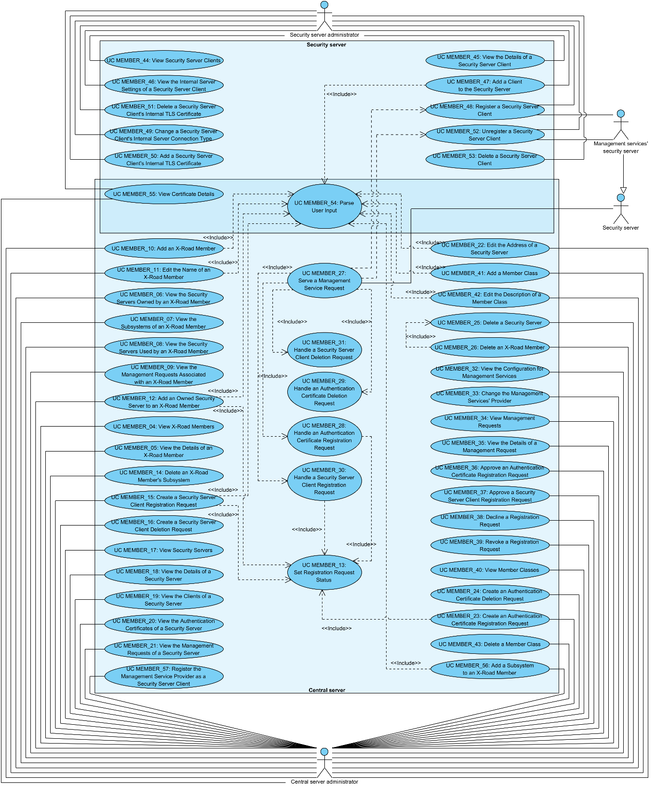

# X-Road: Use Case Model for Member Management
**Analysis**

Version: 1.9  
25.08.2021
<!--  63 pages -->
Doc. ID: UC-MEMBER

---

## Version history

 Date       | Version | Description                                                     | Author
 ---------- | ------- | --------------------------------------------------------------- | --------------------
 06.07.2015 | 0.1     | Initial draft                                                   | Anna Laaneväli
 18.08.2015 | 0.2     | Initial version                                                 | Anna Laaneväli
 31.08.2015 | 0.3     | Additions done                                                  | Anna Laaneväli
 21.09.2015 | 0.4     | Rewrite                                                         | Riin Saarmäe
 21.09.2015 | 1.0     | Editorial changes made                                          | Riin Saarmäe
 27.09.2015 | 1.1     | Summary use cases added; member class management use cases added; internal TLS certificate use cases added; global group use cases moved to [UC-SERVICE](#Ref_UC-SERVICE); use cases for management services updated. | Riin Saarmäe
 08.11.2015 | 1.2     | Minor corrections done                                          | Riin Saarmäe
 16.12.2015 | 1.3     | [UC MEMBER\_56](#2311-uc-member_56-add-a-subsystem-to-an-x-road-member) and [UC MEMBER\_57](#2332-uc-member_57-register-the-management-service-provider-as-a-security-server-client) added. Only subsystems (and not members) can be added and registered as security server clients. [UC MEMBER\_32](#2330-uc-member_32-view-the-configuration-for-management-services) and [UC MEMBER\_28](#2326-uc-member_28-handle-an-authentication-certificate-registration-request) updated. Minor corrections done.  | Riin Saarmäe
 24.11.2016 | 1.4     | XTE-297: Internal Servers tab is displayed to security server owner | Meril Vaht
 23.02.2017 | 1.6     | Converted to Github flavoured Markdown, added license text, adjusted tables and identification for better output in PDF | Toomas Mölder 
 06.03.2018 | 1.7     | Moved terms to term doc, added term doc reference and link, added internal MD-doc links | Tatu Repo
 06.02.2019 | 1.8     | Minor update to [UC_MEMBER\_48](#245-uc-member_48-register-a-security-server-client) | Petteri Kivimäki
 25.08.2021 | 1.9     | Update X-Road references from version 6 to 7 | Caro Hautamäki

## Table of Contents

<!-- toc -->

- [License](#license)
- [1 Introduction](#1-introduction)
  * [1.1 Purpose](#11-purpose)
  * [1.2 Terms and Abbreviations](#12-terms-and-abbreviations)
  * [1.3 References](#13-references)
- [2 Use Case Model](#2-use-case-model)
  * [2.1 Summary Use Cases](#21-summary-use-cases)
    + [2.1.1 UC MEMBER\_01: Configure and Register a Security Server](#211-uc-member_01-configure-and-register-a-security-server)
    + [2.1.2 UC MEMBER\_02: Configure and Register a Subsystem of the Security Server Owner as a Security Server Client](#212-uc-member_02-configure-and-register-a-subsystem-of-the-security-server-owner-as-a-security-server-client)
    + [2.1.3 UC MEMBER\_03: Interface an Organization with the X-Road System](#213-uc-member_03-interface-an-organization-with-the-x-road-system)
  * [2.2 Actors](#22-actors)
  * [2.3 Central Server Use Cases](#23-central-server-use-cases)
    + [2.3.1 UC MEMBER\_04: View X-Road Members](#231-uc-member_04-view-x-road-members)
    + [2.3.2 UC MEMBER\_05: View the Details of an X-Road Member](#232-uc-member_05-view-the-details-of-an-x-road-member)
    + [2.3.3 UC MEMBER\_06: View the Security Servers Owned by an X-Road Member](#233-uc-member_06-view-the-security-servers-owned-by-an-x-road-member)
    + [2.3.4 UC MEMBER\_07: View the Subsystems of an X-Road Member](#234-uc-member_07-view-the-subsystems-of-an-x-road-member)
    + [2.3.5 UC MEMBER\_08: View the Security Servers Used by an X-Road Member](#235-uc-member_08-view-the-security-servers-used-by-an-x-road-member)
    + [2.3.6 UC MEMBER\_09: View the Management Requests Associated with an X-Road Member](#236-uc-member_09-view-the-management-requests-associated-with-an-x-road-member)
    + [2.3.7 UC MEMBER\_10: Add an X-Road Member](#237-uc-member_10-add-an-x-road-member)
    + [2.3.8 UC MEMBER\_11: Edit the Name of an X-Road Member](#238-uc-member_11-edit-the-name-of-an-x-road-member)
    + [2.3.9 UC MEMBER\_12: Add an Owned Security Server to an X-Road Member](#239-uc-member_12-add-an-owned-security-server-to-an-x-road-member)
    + [2.3.10 UC MEMBER\_13: Set Registration Request Status](#2310-uc-member_13-set-registration-request-status)
    + [2.3.11 UC MEMBER\_56: Add a Subsystem to an X-Road Member](#2311-uc-member_56-add-a-subsystem-to-an-x-road-member)
    + [2.3.12 UC MEMBER\_14: Delete an X-Road Member's Subsystem](#2312-uc-member_14-delete-an-x-road-members-subsystem)
    + [2.3.13 UC MEMBER\_15: Create a Security Server Client Registration Request](#2313-uc-member_15-create-a-security-server-client-registration-request)
    + [2.3.14 UC MEMBER\_16: Create a Security Server Client Deletion Request](#2314-uc-member_16-create-a-security-server-client-deletion-request)
    + [2.3.15 UC MEMBER\_17: View Security Servers](#2315-uc-member_17-view-security-servers)
    + [2.3.16 UC MEMBER\_18: View the Details of a Security Server](#2316-uc-member_18-view-the-details-of-a-security-server)
    + [2.3.17 UC MEMBER\_19: View the Clients of a Security Server](#2317-uc-member_19-view-the-clients-of-a-security-server)
    + [2.3.18 UC MEMBER\_20: View the Authentication Certificates of a Security Server](#2318-uc-member_20-view-the-authentication-certificates-of-a-security-server)
    + [2.3.19 UC MEMBER\_21: View the Management Requests of a Security Server](#2319-uc-member_21-view-the-management-requests-of-a-security-server)
    + [2.3.20 UC MEMBER\_22: Edit the Address of a Security Server](#2320-uc-member_22-edit-the-address-of-a-security-server)
    + [2.3.21 UC MEMBER\_23: Create an Authentication Certificate Registration Request](#2321-uc-member_23-create-an-authentication-certificate-registration-request)
    + [2.3.22 UC MEMBER\_24: Create an Authentication Certificate Deletion Request](#2322-uc-member_24-create-an-authentication-certificate-deletion-request)
    + [2.3.23 UC MEMBER\_25: Delete a Security Server](#2323-uc-member_25-delete-a-security-server)
    + [2.3.24 UC MEMBER\_26: Delete an X-Road Member](#2324-uc-member_26-delete-an-x-road-member)
    + [2.3.25 UC MEMBER\_27: Serve a Management Service Request](#2325-uc-member_27-serve-a-management-service-request)
    + [2.3.26 UC MEMBER\_28: Handle an Authentication Certificate Registration Request](#2326-uc-member_28-handle-an-authentication-certificate-registration-request)
    + [2.3.27 UC MEMBER\_29: Handle an Authentication Certificate Deletion Request](#2327-uc-member_29-handle-an-authentication-certificate-deletion-request)
    + [2.3.28 UC MEMBER\_30: Handle a Security Server Client Registration Request](#2328-uc-member_30-handle-a-security-server-client-registration-request)
    + [2.3.29 UC MEMBER\_31: Handle a Security Server Client Deletion Request](#2329-uc-member_31-handle-a-security-server-client-deletion-request)
    + [2.3.30 UC MEMBER\_32: View the Configuration for Management Services](#2330-uc-member_32-view-the-configuration-for-management-services)
    + [2.3.31 UC MEMBER\_33: Change the Management Service Provider](#2331-uc-member_33-change-the-management-service-provider)
    + [2.3.32 UC MEMBER\_57: Register the Management Service Provider as a Security Server Client](#2332-uc-member_57-register-the-management-service-provider-as-a-security-server-client)
    + [2.3.33 UC MEMBER\_34: View Management Requests](#2333-uc-member_34-view-management-requests)
    + [2.3.34 UC MEMBER\_35: View the Details of a Management Request](#2334-uc-member_35-view-the-details-of-a-management-request)
    + [2.3.35 UC MEMBER\_36: Approve an Authentication Certificate Registration Request](#2335-uc-member_36-approve-an-authentication-certificate-registration-request)
    + [2.3.36 UC MEMBER\_37: Approve a Security Server Client Registration Request](#2336-uc-member_37-approve-a-security-server-client-registration-request)
    + [2.3.37 UC MEMBER\_38: Decline a Registration Request](#2337-uc-member_38-decline-a-registration-request)
    + [2.3.38 UC MEMBER\_39: Revoke a Registration Request](#2338-uc-member_39-revoke-a-registration-request)
    + [2.3.39 UC MEMBER\_40: View Member Classes](#2339-uc-member_40-view-member-classes)
    + [2.3.40 UC MEMBER\_41: Add a Member Class](#2340-uc-member_41-add-a-member-class)
    + [2.3.41 UC MEMBER\_42: Edit the Description of a Member Class](#2341-uc-member_42-edit-the-description-of-a-member-class)
    + [2.3.42 UC MEMBER\_43: Delete a Member Class](#2342-uc-member_43-delete-a-member-class)
  * [2.4 Security Server Use Cases](#24-security-server-use-cases)
    + [2.4.1 UC MEMBER\_44: View Security Server Clients](#241-uc-member_44-view-security-server-clients)
    + [2.4.2 UC MEMBER\_45: View the Details of a Security Server Client](#242-uc-member_45-view-the-details-of-a-security-server-client)
    + [2.4.3 UC MEMBER\_46: View the Internal Server Settings of a Security Server Client](#243-uc-member_46-view-the-internal-server-settings-of-a-security-server-client)
    + [2.4.4 UC MEMBER\_47: Add a Client to the Security Server](#244-uc-member_47-add-a-client-to-the-security-server)
    + [2.4.5 UC MEMBER\_48: Register a Security Server Client](#245-uc-member_48-register-a-security-server-client)
    + [2.4.6 UC MEMBER\_49: Change a Security Server Client's Internal Server Connection Type](#246-uc-member_49-change-a-security-server-clients-internal-server-connection-type)
    + [2.4.7 UC MEMBER\_50: Add a Security Server Client's Internal TLS Certificate](#247-uc-member_50-add-a-security-server-clients-internal-tls-certificate)
    + [2.4.8 UC MEMBER\_51: Delete a Security Server Client's Internal TLS Certificate](#248-uc-member_51-delete-a-security-server-clients-internal-tls-certificate)
    + [2.4.9 UC MEMBER\_52: Unregister a Security Server Client](#249-uc-member_52-unregister-a-security-server-client)
    + [2.4.10 UC MEMBER\_53: Delete a Security Server Client](#2410-uc-member_53-delete-a-security-server-client)
  * [2.5 Common Use Cases](#25-common-use-cases)
    + [2.5.1 UC MEMBER\_54: Parse User Input](#251-uc-member_54-parse-user-input)
    + [2.5.2 UC MEMBER\_55: View Certificate Details](#252-uc-member_55-view-certificate-details)

<!-- tocstop -->

## License

This document is licensed under the Creative Commons Attribution-ShareAlike 3.0 Unported License. To view a copy of this license, visit http://creativecommons.org/licenses/by-sa/3.0/

## 1 Introduction

### 1.1 Purpose

The purpose of this document is to describe:

-   the management of X-Road members and security servers in the central server and

-   the management of security server clients in the security server.

This document does not include

-   use cases for service and access right management – these use cases are described in the document “X-Road: Use Case Model for Service Management” \[[UC-SERVICE](#Ref_UC-SERVICE)\];

-   use cases for security token, key and certificate management in the security server – these use cases are described in the document “X-Road: Use Case Model for Security Server Management” \[[UC-SS](#Ref_UC-SS)\].

The use cases include verifications that take place, and the main error conditions that may be encountered during the described process. The general system errors that may be encountered in most of the use cases (e.g., database connection errors or out of memory errors) are not described in this document.

The use cases assume that the X-Road software components involved in the use cases are installed and initialised (see \[[IG-CS](#Ref_IG-CS)\] and \[[IG-SS](#Ref_IG-SS)\]).

The use cases including a human actor (the *level* of the use case is *user task*) assume that the actor is logged in to the system and has the access rights required to carry out the use case.

### 1.2 Terms and Abbreviations

See X-Road terms and abbreviations documentation \[[TA-TERMS](#Ref_TERMS)\].

### 1.3 References

1.  \[IG-CS\] X-Road 7. Central Server Installation Guide. Document ID: [IG-CS](../Manuals/ig-cs_x-road_6_central_server_installation_guide.md).

2.  \[IG-SS\] X-Road 7. Security Server Installation Guide. Document ID: [IG-SS](../Manuals/ig-ss_x-road_v6_security_server_installation_guide.md).

3.  \[PR-MSERV\] X-Road: Protocol for Management Services. Document ID: [PR-MSERV](../Protocols/pr-mserv_x-road_protocol_for_management_services.md).

4.  \[SPEC-AL\] X-Road: Audit Log Events. Document ID: SPEC-AL.

5.  \[UC-GCONF\] X-Road: Use Case Model for Global Configuration Distribution. Document ID: [UC-GCONF](uc-gconf_x-road_use_case_model_for_global_configuration_distribution_1.4_Y-883-8.md).

6.  \[UC-MESS\] X-Road: Use Case Model for Member Communication. Document ID: [UC-MESS](uc-mess_x-road_member_communication_use_case_model.md).

7.  \[UC-SERVICE\] X-Road: Use Case Model for Service Management. Document ID: [UC-SERVICE](uc-service_x-road_use_case_model_for_service_management_1.6_Y-883-3.md).

8.  \[UC-SS\] X-Road: Use Case Model for Security Server Management. Document ID: [UC-SS](uc-ss_x-road_use_case_model_for_security_server_management_1.4_Y-883-4.md).

9.  \[UG-SS\] X-Road 7. Security Server User Guide. Document ID: [UG-SS](../Manuals/ug-ss_x-road_6_security_server_user_guide.md).

10. \[X509\] Internet X.509 Public Key Infrastructure Certificate and Certificate Revocation List (CRL) Profile, Internet Engineering Task Force, 2008.

11. \[TA-TERMS\] X-Road Terms and Abbreviations. Document ID: [TA-TERMS](../terms_x-road_docs.md).

## 2 Use Case Model

### 2.1 Summary Use Cases

The use cases in this section summarize the minimal set of actions that need to be performed to achieve the following goals:

-   set up and register an X-Road security server;

-   register a subsystem of the security server owner as a client of the security server;

-   register a subsystem of another organization as a client of the security server.

The use cases do not describe the organizational aspects of these processes.

#### 2.1.1 UC MEMBER\_01: Configure and Register a Security Server

**System**: X-Road system

**Level**: Summary

**Component:** Central server, Security server

**Actors**:

-   CS administrator – the administrator of the central server of the local X-Road instance.

-   SS administrator – the administrator of the security server owned by the X-Road member who wishes to register it's subsystem as a security server client.

**Brief Description**: SS administrator installs, initializes and configures a security server and obtains the signing certificate of the security server owner and the authentication certificate of the security server. SS administrator initiates the registration of the security server. CS administrator completes the registration of the security server.

**Preconditions**: The use case assumes that the organization that owns the security server is registered as an X-Road member (see [2.3.7](#237-uc-member_10-add-an-x-road-member)).

**Postconditions**: The security server is ready for registering clients and for exchanging X-Road messages.

**Trigger**: An X-Road member wishes to set up a security server.

**Main Success Scenario**:

1.  SS administrator installs and initializes a security server following the instructions given in the document “X-Road 7. Security Server Installation Guide” \[[IG-SS](#Ref_IG-SS)\].

2.  SS administrator adds one or more timestamping services for the security server: UC SS\_07 \[[UC-SS](#Ref_UC-SS)\].

3.  SS administrator configures the tokens, keys and certificates:

    -   connects the security tokens used for holding signing keys to the security server and initializes the tokens;

    -   creates a signing key for the security server owner and an authentication key for the security server: UC SS\_28 \[[UC-SS](#Ref_UC-SS)\];

    -   creates the certificate signing requests for the created signing key and authentication key: UC SS\_29 \[[UC-SS](#Ref_UC-SS)\];

    -   forwards the certificate signing requests to an approved certification service provider and receives the corresponding certificates;

    -   imports the signing certificate and the authentication certificate: UC SS\_30 \[[UC-SS](#Ref_UC-SS)\].

4.  SS administrator initiates the registration of the security server:

    -   sends an authentication certificate registration request from the security server: UC SS\_34 \[[UC-SS](#Ref_UC-SS)\] (the request is served by the central server: [2.3.25](#2325-uc-member_27-serve-a-management-service-request)) and

    -   sends an authentication certificate registration request to the X-Road governing authority via out-of-band means.

5.  CS administrator completes the registration of the security server:

    -   adds the security server as an owned server to the X-Road member: [2.3.9](#239-uc-member_12-add-an-owned-security-server-to-an-x-road-member) and

    -   approves the registration requests: [2.3.35](#2335-uc-member_36-approve-an-authentication-certificate-registration-request).

    -   The central server generates and distributes global configuration that contains the created registration relations between the security server owner and the security server, and between the security server and the authentication certificate: UC GCONF\_18 \[[UC-GCONF](#Ref_UC-GCONF)\].

6.  SS administrator waits for the security server to update configuration: UC GCONF\_23 \[[UC-GCONF](#Ref_UC-GCONF)\] and verifies that the state of the security server owner and the authentication certificate is *registered*: [2.4.1](#241-uc-member_44-view-security-server-clients) and UC SS\_19 \[[UC-SS](#Ref_UC-SS)\].

7.  SS administrator activates the authentication certificate: UC SS\_32 \[[UC-SS](#Ref_UC-SS)\].

**Extensions**: -

**Related information**: -

#### 2.1.2 UC MEMBER\_02: Configure and Register a Subsystem of the Security Server Owner as a Security Server Client

**System**: X-Road system

**Level**: Summary

**Component:** Central server, Security server

**Actors**:

-   CS administrator – the administrator of the central server of the local X-Road instance.

-   SS administrator – the administrator of the security server owned by the X-Road member who wishes to register it's subsystem as a security server client.

**Brief Description**: SS administrator adds the subsystem as a security server client and initiates the registration of the subsystem. CS administrator completes the registration of the subsystem as the client of the security server. SS administrator configures the subsystem for using and/or providing services.

**Preconditions**: The use case assumes that the security server is configured and registered: [2.1.1](#211-uc-member_01-configure-and-register-a-security-server).

**Postconditions**: A subsystem of the security server owner is registered as the security server client and ready to use and/or provide X-Road services.

**Trigger**: The security server owner wishes to use the security server to use or provide X-Road services.

**Main Success Scenario**:

1.  SS administrator adds a subsystem of the security server owner as a client of the security server: [2.4.4](#244-uc-member_47-add-a-client-to-the-security-server).

2.  SS administrator initiates the registration of the subsystem:

    -   sends a security server client request from the security server: [2.4.5](#245-uc-member_48-register-a-security-server-client) (the request is served by the central server: [2.3.25](#2325-uc-member_27-serve-a-management-service-request)) and

    -   sends a security server client request to the X-Road governing authority via out-of-band means.

3.  CS administrator completes the registration of the subsystem:

    -   creates a security server client registration request: [2.3.13](#2313-uc-member_15-create-a-security-server-client-registration-request) and

    -   approves the registration requests: [2.3.36](#2336-uc-member_37-approve-a-security-server-client-registration-request).

    -   The central server generates and distributes global configuration that contains the created registration relation between the security server and the subsystem: UC GCONF\_18 \[[UC-GCONF](#Ref_UC-GCONF)\].

4.  SS administrator waits for the security server to update configuration: UC GCONF\_23 \[[UC-GCONF](#Ref_UC-GCONF)\] and verifies that the state of the subsystem is *registered*: [2.4.1](#241-uc-member_44-view-security-server-clients).

5.  In case the subsystem is used in the service client role, SS administrator configures the settings for internal server communication: [2.4.6](#246-uc-member_49-change-a-security-server-clients-internal-server-connection-type), and adds internal TLS certificates to the subsystem if HTTPS connection is used: [2.4.7](#247-uc-member_50-add-a-security-server-clients-internal-tls-certificate).

6.  In case the subsystem is used in the service provider role, SS administrator:

    -   adds internal TLS certificates to the subsystem if HTTPS connection is used to communicate with the internal servers: [2.4.7](#247-uc-member_50-add-a-security-server-clients-internal-tls-certificate) and

    -   configures the services and access rights: \[[UC-SERVICE](#Ref_UC-SERVICE)\].

**Extensions**: -

**Related information**: -

#### 2.1.3 UC MEMBER\_03: Interface an Organization with the X-Road System

**System**: X-Road system

**Level**: Summary

**Component:** Central server, Security server

**Actors**:

-   CS administrator – the administrator of the central server of the local X-Road instance.

-   SS administrator – the administrator of the security server that the organization wants to use for using or providing X-Road services.

-   Organization – an organization that wishes to start providing services on the X-Road or to use services provided by X-Road members.

**Brief Description**: SS administrator adds the organization's subsystem as a security server client and configures the signing keys and certificates of the organization. SS administrator initiates the registration of the organization's subsystem. The registration is completed by CS administrator. SS administrator configures the subsystem for using and/or providing services.

**Preconditions**: The use case assumes that the organization uses security server hosting services provided by another organization and that the used security server is registered in the X-Road central server.

**Postconditions**: A subsystem of the organization is registered as the security server client and ready to use and/or provide X-Road services.

**Trigger**: An organization wishes to start providing services on the X-Road or to use services provided by X-Road members.

**Main Success Scenario**:

1.  CS administrator registers the organization as an X-Road member: [2.3.7](#237-uc-member_10-add-an-x-road-member).

2.  SS administrator adds the organization's subsystem as a client of the security server: [2.4.4](#244-uc-member_47-add-a-client-to-the-security-server).

3.  SS administrator configures the tokens, keys and certificates for the organization's subsystem:

    -   connects the security tokens used for holding signing keys of the organization to the security server and initializes the tokens;

    -   creates a signing key for the organization: UC SS\_28 \[[UC-SS](#Ref_UC-SS)\];

    -   creates the certificate signing requests for the created signing key: UC SS\_29 \[[UC-SS](#Ref_UC-SS)\];

    -   forwards the certificate signing request to the organization. The organization forwards the certificate signing request to an approved certification service provider, receives the corresponding signing certificate and forwards the certificate to SS administrator.

    -   SS administrator imports the signing certificate to the security server: UC SS\_30 \[[UC-SS](#Ref_UC-SS)\].

4.  SS administrator initiates the registration of the organization's subsystem:

    -   sends a security server client request from the security server: [2.4.5](#245-uc-member_48-register-a-security-server-client) (the request is served by the central server: [2.3.25](#2325-uc-member_27-serve-a-management-service-request)) and

    -   sends a security server client request to the X-Road governing authority via out-of-band means.

5.  CS administrator completes the registration of the organization's subsystem:

    -   creates a security server client registration request: [2.3.13](#2313-uc-member_15-create-a-security-server-client-registration-request) and

    -   approves the registration requests: [2.3.36](#2336-uc-member_37-approve-a-security-server-client-registration-request).

    -   The central server generates and distributes global configuration that contains the created registration relation between the security server and the subsystem: UC GCONF\_18 \[[UC-GCONF](#Ref_UC-GCONF)\].

6.  SS administrator waits for the security server to update configuration: UC GCONF\_23 \[[UC-GCONF](#Ref_UC-GCONF)\] and verifies that the state of the organization's subsystem is *registered*: [2.4.1](#241-uc-member_44-view-security-server-clients).

7.  In case the organization's subsystem is used in the service client role, SS administrator configures the settings for internal server communication: [2.4.6](#246-uc-member_49-change-a-security-server-clients-internal-server-connection-type), and adds internal TLS certificates to the subsystem if HTTPS connection is used: [2.4.7](#247-uc-member_50-add-a-security-server-clients-internal-tls-certificate).

8.  In case the organization's subsystem is used in the service provider role, SS administrator

    -   adds internal TLS certificates to the subsystem if HTTPS connection is used to communicate with the internal servers: [2.4.7](#247-uc-member_50-add-a-security-server-clients-internal-tls-certificate) and

    -   configures the services and access rights: \[[UC-SERVICE](#Ref_UC-SERVICE)\].

**Extensions**: -

**Related information**: -

### 2.2 Actors

The use case model for X-Road member management includes the following actors.

-   **SS administrator** (security server administrator) – a person responsible for managing the security server.

-   **CS administrator** (central server administrator) – a person responsible for managing the central server.

-   **Security server** – a security server that sends management service requests to the central server. The authentication certificate deletion requests, and security server client registration and deletion requests are forwarded to the central server by the management services' security server. The authentication certificate registration request is sent directly to the central server by the security server that the certificate is to be registered for.

-   **Management services' security server** – a security server that has the management services' provider for this X-Road instance registered as a security server client.

Relationships between the actors, systems and use cases are described in [Figure 1](#Ref_Use_case_diagram_for_member_management).

Figure 1. Use case diagram for member management

### 2.3 Central Server Use Cases

#### 2.3.1 UC MEMBER\_04: View X-Road Members

**System**: Central server

**Level**: User task

**Component:** Central server

**Actor**: CS administrator

**Brief Description**: CS administrator views the list of X-Road members.

**Preconditions**: -

**Postconditions**: The list of X-Road members has been displayed to CS administrator.

**Trigger**: -

**Main Success Scenario**:

1.  CS administrator selects to view the list of X-Road members.

2.  System displays the number of X-Road members and the following information for each member:

    -   the name of the X-Road member;

    -   the member class of the X-Road member;

    -   the member code of the X-Road member.

    The following user action options are displayed:

    -   add an X-Road member: [2.3.7](#237-uc-member_10-add-an-x-road-member);

    -   view the details of an X-Road member: [2.3.2](#232-uc-member_05-view-the-details-of-an-x-road-member).

**Extensions**: -

**Related information**: -

#### 2.3.2 UC MEMBER\_05: View the Details of an X-Road Member

**System**: Central server

**Level**: User task

**Component:** Central server

**Actor**: CS administrator

**Brief Description**: CS administrator views the details of an X-Road member.

**Preconditions**: -

**Postconditions**: The details of an X-Road member have been displayed to CS administrator

**Trigger**: -

**Main Success Scenario**:

1.  CS administrator selects to view the details of an X-Road member.

2.  System displays the following information:

    -   the name of the X-Road member;

    -   the member class of the X-Road member;

    -   the member code of the X-Road member.

    The following user action options are displayed:

    -   edit the name of the X-Road member: [2.3.8](#238-uc-member_11-edit-the-name-of-an-x-road-member);

    -   view the security servers owned by the X-Road member: [2.3.3](#233-uc-member_06-view-the-security-servers-owned-by-an-x-road-member);

    -   view the global group membership of the X-Road member: see UC SERVICE\_36 \[[UC-SERVICE](#Ref_UC-SERVICE)\];

    -   view the subsystems of the X-Road member: [2.3.4](#234-uc-member_07-view-the-subsystems-of-an-x-road-member);

    -   view the security servers where the X-Road member or the member's subsystems are registered as security server clients: [2.3.5](#235-uc-member_08-view-the-security-servers-used-by-an-x-road-member);

    -   view the management requests associated with the X-Road member: [2.3.6](#236-uc-member_09-view-the-management-requests-associated-with-an-x-road-member);

    -   delete the X-Road member: [2.3.24](#2324-uc-member_26-delete-an-x-road-member).

**Extensions**: -

**Related information**: -

#### 2.3.3 UC MEMBER\_06: View the Security Servers Owned by an X-Road Member

**System**: Central server

**Level**: User task

**Component:** Central server

**Actor**: CS administrator

**Brief Description**: CS administrator views the list of security servers owned by the X-Road member.

**Preconditions**: -

**Postconditions**: The list of security servers that are owned by the X-Road member has been displayed to CS administrator.

**Trigger**: -

**Main Success Scenario**:

1.  CS administrator selects to view the security servers owned by an X-Road member.

2.  System displays the list of security servers. For each server, the security server code is displayed. The following user action options are displayed:

    -   create an authentication certificate registration request for adding an owned security server for the X-Road member: [2.3.9](#239-uc-member_12-add-an-owned-security-server-to-an-x-road-member);

    -   view the details of a security server owned by the X-Road member: [2.3.16](#2316-uc-member_18-view-the-details-of-a-security-server).

**Extensions**: -

**Related information**: -

#### 2.3.4 UC MEMBER\_07: View the Subsystems of an X-Road Member

**System**: Central server

**Level**: User task

**Component:** Central server

**Actor**: CS administrator

**Brief Description**: CS administrator views the list of an X-Road member's subsystems.

**Preconditions**: -

**Postconditions**: The list of X-Road member's subsystems has been displayed to CS administrator.

**Trigger**: -

**Main Success Scenario**:

1.  CS administrator selects to view the subsystems of an X-Road member.

2.  System displays the list of subsystems of the member. The following information is displayed for each subsystem:

    -   the code of the subsystem;

    -   the code of the security server where the subsystem is registered as the security server client.

    The following user action options are displayed:

    -   add a subsystem to the X-Road member [2.3.11](#2311-uc-member_56-add-a-subsystem-to-an-x-road-member);

    -   delete a subsystem that is not registered as a client to any security servers: [2.3.12](#2312-uc-member_14-delete-an-x-road-members-subsystem).

**Extensions**: -

**Related information**: -

#### 2.3.5 UC MEMBER\_08: View the Security Servers Used by an X-Road Member

**System**: Central server

**Level**: User task

**Component:** Central server

**Actor**: CS administrator

**Brief Description**: CS administrator views the list of security servers where the X-Road member's subsystems are registered as security server clients.

**Preconditions**: -

**Postconditions**: The list of security servers used by the subsystems of the member have been displayed to CS administrator.

**Trigger**: -

**Main Success Scenario**:

1.  CS administrator selects to view the security servers used by an X-Road member.

2.  The system displays the list of security servers that have the member's subsystems registered as security server clients. The following information is displayed for each security server:

    -   the code of the security server;

    -   the code of the subsystem that is the client of the security server;

    -   the name of the owner of the security server.

    The following user action options are displayed:

    -   view the details of the security server that has a subsystem of the member registered as a security server client: [2.3.16](#2316-uc-member_18-view-the-details-of-a-security-server);

    -   view the details of the owner of the security server that has the a subsystem of the member registered as a security server client: [2.3.2](#232-uc-member_05-view-the-details-of-an-x-road-member);

    -   create a security server client registration request for registering a subsystem of the member as a client to a security server: [2.3.13](#2313-uc-member_15-create-a-security-server-client-registration-request);

    -   create a security server client deletion request to delete the registration of a member's subsystem as a client of a security server: [2.3.14](#2314-uc-member_16-create-a-security-server-client-deletion-request).

**Extensions**: -

**Related information**: -

#### 2.3.6 UC MEMBER\_09: View the Management Requests Associated with an X-Road Member

**System**: Central server

**Level**: User task

**Component:** Central server

**Actor**: CS administrator

**Brief Description**: CS administrator views the list of management requests that are associated with an X-Road member.

**Preconditions**: -

**Postconditions**: The management requests associated with the X-Road member have been displayed to CS administrator.

**Trigger**: -

**Main Success Scenario**:

1.  CS administrator selects to view management requests associated with the X-Road member.

2.  System displays the list of management requests that concern the member's security servers or subsystems. The following information is displayed for each management request:

    -   the identifier of the request;

    -   the type of the request;

    -   the date and time of when the request was saved in the system configuration;

    -   the status of the request.

    The following user action options are displayed:

    -   view the details of a request associated with the X-Road member: [2.3.34](#2334-uc-member_35-view-the-details-of-a-management-request).

**Extensions**: -

**Related information**:

-   The protocol for management services is described the document “X-Road: Protocol for Management Services” \[[PR-MSERV](#Ref_PR-MSERV)\].

#### 2.3.7 UC MEMBER\_10: Add an X-Road Member

**System**: Central server

**Level**: User task

**Component:** Central server

**Actor**: CS administrator

**Brief description**: CS administrator registers an organization as an X-Road member.

**Preconditions**:

-   The organization has entered into an X-Road membership contract with the X-Road governing agency.

-   At least one member class is described in the system configuration.

**Postcondition**: An audit log record for the event is created.

**Trigger:** An organization has been approved for joining the X-Road by the X-Road governing authority.

**Main success scenario**:

1.  CS administrator selects to add an X-Road member.

2.  CS administrator inserts the following information:

    -   the name of the organization;

    -   the X-Road member class of the organization and

    -   the X-Road member code of the organization.

3.  System parses the user input: [2.5.1](#251-uc-member_54-parse-user-input).

4.  System verifies that an organization with the inserted member class and member code combination is not already an X-Road member.

5.  System saves the added X-Road member information to system configuration.

6.  System displays the message: “Successfully added X-Road member with member class 'X' and member code 'Y'.”, where “X” is the inserted member class and “Y” the inserted member code.

7.  System logs the event “Add member” to the audit log.

**Extensions:**

3a. The parsing of the user input terminated with an error message.

- 3a.1. System displays the error message: “Failed to add member: X”, where X is the termination message of the parsing process.

- 3a.2. System logs the event “Add member failed” to the audit log.

- 3a.3. CS administrator selects to reinsert the member information. Use case continues from step 3.

    - 3a.3a. CS administrator selects to terminate the use case.

4a. An X-Road member with the inserted member class and member code combination already exists.

- 4a.1. System displays the error message “Failed to add member: Member with class X and code Y already exists”, where “X” is the X-Road member class and “Y” is the X-Road member code that was inserted.

- 4a.2. System logs the event “Add member failed” to the audit log.

- 4a.3 CS administrator selects to reinsert the member information. Use case continues from step 3.

    - 4a.3a. CS administrator selects to terminate the use case.

**Related information**:

-   The audit log is located at `/var/log/xroad/audit.log`. The data set of audit log records is described in the document “X-Road: Audit Log Events” \[[SPEC-AL](#Ref_SPEC-AL)\].

#### 2.3.8 UC MEMBER\_11: Edit the Name of an X-Road Member

**System**: Central server

**Level**: User task

**Component:** Central server

**Actor**: CS administrator

**Brief description**: CS administrator edits the name of an X-Road member.

**Precondition**: -

**Postcondition**: An audit log record for the event is created.

**Trigger**: The name of an X-Road member needs to be changed.

**Main success scenario**:

1.  CS administrator selects to edit the name of an X-Road member.

2.  CS administrator inserts the name.

3.  System parses the user input: [2.5.1](#251-uc-member_54-parse-user-input).

4.  System saves the changes.

5.  System logs the event “Edit member name” to the audit log.

**Extensions**:

3a. The parsing of the user input terminated with an error message.

- 3a.1. System displays the error message: “Failed to edit member: X”, where X is the termination message of the parsing process.

- 3a.2. System logs the event “Edit member name failed” to the audit log.

- 3a.3. CS administrator selects to reinsert the member information. Use case continues from step 3.

    - 3a.3a. CS administrator selects to terminate the use case.

**Related information:**

-   The audit log is located at `/var/log/xroad/audit.log`. The data set of audit log records is described in the document “X-Road: Audit Log Events” \[[SPEC-AL](#Ref_SPEC-AL)\].

#### 2.3.9 UC MEMBER\_12: Add an Owned Security Server to an X-Road Member

**System**: Central server

**Level**: User task

**Component:** Central server

**Actor**: CS administrator

**Brief Description**: CS administrator creates an authentication certificate registration request.

**Preconditions**: CS administrator is in possession of the information (authentication certificate and security server code) needed to register the security server for the X-Road member.

**Postconditions**: -

**Trigger**: The owner of the security server has forwarded a request for registering a security server to the X-Road governing authority. The request must include the authentication certificate and the code of the security server.

**Main Success Scenario**:

1.  CS administrator selects to add an owned security server to an X-Road member.

2.  System displays the authentication certificate registration request, prefilling the known values.

3.  CS administrator inserts the security server code.

4.  CS administrator uploads the authentication certificate file from the local file system.

5.  CS administrator submits the request.

6.  System verifies that the uploaded file is in PEM or DER format and is an authentication certificate (certificate is an authentication certificate, if it has *ExtendedKeyUsage* extension which contains *ClientAuthentication* or if it has *keyUsage* extension which has *digitalSignature*, *keyEncipherment* or *dataEncipherment* bit set); and displays the message “Certificate imported successfully”.

7.  System parses the user input: [2.5.1](#251-uc-member_54-parse-user-input).

8.  System verifies that no other authentication certificate registration request have been created in the central server for this authentication certificate. The previously created requests that are in the *revoked* or *declined* state are not included in this verification.

9.  System verifies that a security server with the entered code is not already registered as an owned server for the X-Road member.

10. System saves the authentication certification registration request and sets the status of the request: [2.3.10](#2310-uc-member_13-set-registration-request-status).

11. System displays the message “Request of adding authentication certificate to new security server 'X' added successfully”, where “X” is the X-Road identifier of the security server.

12. System logs the event “Add security server” to the audit log.

**Extensions**:

5a. CS administrator decides not to submit the request and terminates the use case.

6a. The uploaded file is not in PEM or DER format.

  - 6a.1. System displays the error message: “Failed to import authentication certificate: Incorrect file format. Only PEM and DER files allowed.”.

  - 6a.2. CS administrator selects to re-upload the authentication certificate. Use case continues from step 5.

    - 6a.2a. CS administrator selects to terminate the use case.

6b. The uploaded certificate is not an authentication certificate.

  - 6b.1. System displays the error message: “Failed to import authentication certificate: This certificate cannot be used for authentication.”.

  - 6b.2. CS administrator selects to re-upload the authentication certificate. Use case continues from step 5.

    - 6b.2a. CS administrator selects to terminate the use case.

7a. The parsing of the user input terminated with an error message.

  - 7a.1. System displays the error message “Failed to add new owned server request: X”, where “X” is the termination message of the parsing process.

  - 7a.2. System logs the event “Add security server failed” to the audit log.

  - 7a.3 CS administrator selects to reinsert the server code. Use case continues from step 5.

    - 7a.3a. CS administrator selects to terminate the use case.

8a. The authentication certificate is already registered or submitted for registration with another authentication certificate registration request.

  - 8a.1. System displays the error message “Failed to add new owned server request: Certificate is already submitted for registration with request 'X'”, where “X” is the identifier of the registration request that contains the certificate.

  - 8a.2. System logs the event “Add security server failed” to the audit log.

  - 8a.3 CS administrator selects to re-upload the authentication certificate. Use case continues from step 5.

    - 8a.3a. CS administrator selects to terminate the use case.

9a. A security server with the submitted code is already registered as an owned server for the X-Road member

  - 9a.1. System displays the error message “Failed to add new owned server request: Server with owner class 'X', owner code 'Y' and server code 'Z' already exists.”, where “X” is the member class and “Y” the member code of the X-Road member the security server is being added to and “Z” is the inserted server code.

  - 9a.2. System logs the event “Add security server failed” to the audit log.

  - 9a.3 CS administrator selects to reinsert the server code. Use case continues from step 5.

    - 9a.3a. CS administrator selects to terminate the use case.

**Related information**:

-   The audit log is located at `/var/log/xroad/audit.log`. The data set of audit log records is described in the document “X-Road: Audit Log Events” \[[SPEC-AL](#Ref_SPEC-AL)\].

-   The protocol for management services is described the document “X-Road: Protocol for Management Services” \[[PR-MSERV](#Ref_PR-MSERV)\].

#### 2.3.10 UC MEMBER\_13: Set Registration Request Status

**System**: Central server

**Level**: Subfunction

**Component:** Central server

**Actor**: -

**Brief Description**: System looks for complementary request of the saved request. If one is found, the status of the requests is set to *submitted for approval*. If not, the status of the saved request is set to *waiting*.

**Preconditions**: -

**Postconditions**: The status of the saved request is set.

**Triggers**:

-   Step 10 of [2.3.9](#239-uc-member_12-add-an-owned-security-server-to-an-x-road-member).

-   Step 6 of [2.3.13](#2313-uc-member_15-create-a-security-server-client-registration-request).

-   Step 6 of [2.3.21](#2321-uc-member_23-create-an-authentication-certificate-registration-request).

-   Step 11 of [2.3.26](#2326-uc-member_28-handle-an-authentication-certificate-registration-request).

-   Step 6 of [2.3.28](#2328-uc-member_30-handle-a-security-server-client-registration-request).

**Main Success Scenario**:

1.  System verifies that a complementary request for the saved request exists in the system.

2.  System sets the state of the saved request and the complementary request to *submitted for approval*.

3.  System adds the complementary request identifier to both of the registration requests.

**Extensions**:

1a. A complementary request for the saved request does not exist in the system.

  - 1a.1. System sets the status of the saved request to *waiting*.

  - 1a.2. Use case terminates.

**Related information**: -

#### 2.3.11 UC MEMBER\_56: Add a Subsystem to an X-Road Member

**System**: Central server

**Level**: User task

**Component:** Central server

**Actor**: CS administrator

**Brief description**: CS administrator adds a subsystem to an X-Road member.

**Preconditions**: -

**Postcondition**: An audit log record for the event is created.

**Trigger:** -

**Main success scenario**:

1.  CS administrator selects to add a subsystem to an X-Road member.

2.  CS administrator inserts the code of the subsystem.

3.  System parses the user input: [2.5.1](#251-uc-member_54-parse-user-input).

4.  System verifies that a subsystem with the inserted code is not already saved for this X-Road member in the system configuration.

5.  System saves the added subsystem to system configuration.

6.  System logs the event “Add subsystem” to the audit log.

**Extensions:**

3a. The parsing of the user input terminated with an error message.

  - 3a.1. System displays the termination message of the parsing process.

  - 3a.2. System logs the event “Add subsystem failed” to the audit log.

  - 3a.3. CS administrator selects to reinsert the subsystem code. Use case continues from step 3.

    - 3a.3a. CS administrator selects to terminate the use case.

4a. The X-Road member already has a subsystem with the inserted code.

  - 4a.1. System displays the error message “Failed to add subsystem: Subsystem 'X' already exists”, where “X” is the inserted subsystem code.

  - 4a.2. System logs the event “Add subsystem failed” to the audit log.

  - 4a.3 CS administrator selects to reinsert the member information. Use case continues from step 3.

    - 4a.3a. CS administrator selects to terminate the use case.

**Related information:**

-   The audit log is located at `/var/log/xroad/audit.log`. The data set of audit log records is described in the document “X-Road: Audit Log Events” \[[SPEC-AL](#Ref_SPEC-AL)\].

#### 2.3.12 UC MEMBER\_14: Delete an X-Road Member's Subsystem

**System**: Central server

**Level**: User task

**Component:** Central server

**Actor**: CS administrator

**Brief description**: CS administrator deletes a subsystem of an X-Road member.

**Precondition**: The subsystem is not registered as a security server client.

**Postcondition**: -

**Trigger**: -

**Main success scenario**:

1.  CS administrator selects to delete a subsystem of an X-Road member.

2.  System prompts for confirmation.

3.  CS administrator confirms.

4.  System verifies that the subsystem is a member of one or more global groups and deletes the respective group membership records from the system configuration.

5.  System deletes the subsystem from the system configuration.

6.  System logs the event “Delete subsystem” to the audit log.

**Extensions:**

3a. CS administrator selects not to delete the subsystem and terminates the use case.

4a. The subsystem is not a member of any global groups.

  - 4a.1. Use case continues from step 5.

**Related information:**

-   The audit log is located at `/var/log/xroad/audit.log`. The data set of audit log records is described in the document “X-Road: Audit Log Events” \[[SPEC-AL](#Ref_SPEC-AL)\].

#### 2.3.13 UC MEMBER\_15: Create a Security Server Client Registration Request

**System**: Central server

**Level**: User task

**Component:** Central server

**Actor**: CS administrator

**Brief Description**: CS administrator creates a security server client registration request for registering an X-Road member's subsystem as a client of a security server.

**Preconditions**: CS administrator is in possession of the information (the X-Road identifier of the client to be registered and the X-Road identifier of the security server) needed to register an X-Road member's subsystem as a client of a security server.

**Postconditions**: -

**Trigger**: The X-Road member has forwarded a request for registering as a security server client to the X-Road governing authority.

**Main Success Scenario**:

1.  CS administrator selects to create a security server client registration request for an X-Road member's subsystem.

2.  System displays the security server client registration request, prefilling the known values.

3.  CS administrator inserts the information needed to create the registration request – the X-Road identifiers of the client and the security server (unless prefilled by the system) and submits the request.

4.  System parses the user input: [2.5.1](#251-uc-member_54-parse-user-input).

5.  System verifies that the client is not already registered as a client of the security server.

6.  System verifies that no other security server client registration request containing the submitted information have been created in the central server. The previously created requests that are in the *revoked* or *declined* state are not included in this verification.

7.  System saves the security server client registration request and sets the status of the request: [2.3.10](#2310-uc-member_13-set-registration-request-status).

8.  System verifies that the subsystem inserted to the registration request as the client does not already exists for the X-Road member and saves the subsystem information to the system configuration.

9.  System displays the message “Request of adding client 'X' to security server 'Y' added successfully”, where “X” is the X-Road identifier of the security server.

10. System logs the event “Register member as security server client” to the audit log.

**Extensions**:

3a. CS administrator selects not to submit the request and terminates the use case.

4a. The parsing of the user input terminated with an error message.

  - 4a.1. System displays the error message “Failed to add new server client request: X”, where “X” is the termination message of the parsing process.

  - 4a.2. System logs the event “Register member as security server client failed” to the audit log.

  - 4a.3 CS administrator selects to reinsert the information. Use case continues from step 4.

    - 4a.3a. CS administrator selects to terminate the use case.

5a. The inserted client is already registered as a client of the security server.

  -  5a.1. System displays the error message: Failed to add new server client request: 'X' has already been registered as a client to security server 'Y'”, where “X” is the X-Road identifier of the client and “Y” is the X-Road identifier of the security server.

  - 5a.2. System logs the event “Register member as security server client failed” to the audit log.

  - 5a.3. CS administrator selects to reinsert the information needed to create the registration request. Use case continues from step 4.

    - 5a.3a. CS administrator selects to terminate the use case.

6a. A request for registering the client to the security server has already been created.

  - 6a.1. System displays the error message: “Failed to add new server client request: A request for registering 'X', as a client to security server 'Y' has already been submitted (Z, request ID: 'ZZ')'”, where

    -   “X” is the X-Road identifier of the client,

    -   “Y” is the X-Road identifier of the security server,

    -   “Z” is the date and time of when the existing request was saved to the system configuration and

    -   “ZZ” is the identifier of the existing request.

  - 6a.2. System logs the event “Register member as security server client failed” to the audit log.

  - 6a.3. CS administrator selects to reinsert the information needed to create the registration request. Use case continues from step 4.

    - 6a.3a. CS administrator selects to terminate the use case.

8a. A subsystem code was not inserted or a subsystem with the inserted code already exists for this X-Road member.

- 8a.1. The use case continues from step 8.

**Related information**:

-   The audit log is located at `/var/log/xroad/audit.log`. The data set of audit log records is described in the document “X-Road: Audit Log Events” \[[SPEC-AL](#Ref_SPEC-AL)\].

-   The protocol for management services is described the document “X-Road: Protocol for Management Services” \[[PR-MSERV](#Ref_PR-MSERV)\].

#### 2.3.14 UC MEMBER\_16: Create a Security Server Client Deletion Request

**System**: Central server

**Level**: User task

**Component:** Central server

**Actor**: CS administrator

**Brief Description**: CS administrator creates a security server client deletion request to delete the registration of a client of a security server.

**Preconditions**: CS administrator is in possession of the information (the X-Road identifier of the client to be deleted and the X-Road identifier of the security server) needed to delete the registration of an X-Road member's subsystem as a client of a security server.

**Postconditions**: -

**Trigger**: The X-Road member has forwarded a request for deleting the registration to the X-Road governing authority.

**Main Success Scenario**:

1.  CS administrator selects to create a security server client deletion request for a subsystem of an X-Road member.

2.  System displays a prefilled security server client deletion request.

3.  CS administrator submits the request.

4.  System saves the request and deletes the registration relation between the client and the security server.

5.  System displays the message: “Request of deleting client 'X' from security server 'Y' added successfully”, where “X” is the X-Road identifier of the subsystem and “Y” is the X-Road identifier of the security server.

6.  System logs the event “Unregister member as security server client” to the audit log.

**Extensions**:

3a. CS administrator selects to terminate the use case.

**Related information**:

-   The audit log is located at `/var/log/xroad/audit.log`. The data set of audit log records is described in the document “X-Road: Audit Log Events” \[[SPEC-AL](#Ref_SPEC-AL)\].

-   The protocol for management services is described the document “X-Road: Protocol for Management Services” \[[PR-MSERV](#Ref_PR-MSERV)\].

#### 2.3.15 UC MEMBER\_17: View Security Servers

**System**: Central server

**Level**: User task

**Component:** Central server

**Actor**: CS administrator

**Brief Description**: CS administrator views the information about security servers that are registered in the central server.

**Preconditions**: -

**Postconditions**: The information about registered security servers has been displayed to CS administrator.

**Trigger**: -

**Main Success Scenario**:

1.  CS administrator selects to view security servers.

2.  System displays the list of security servers registered in the central server. The following information is displayed for each security server:

    -   the security server code;

    -   the name, member class and member code of the security server owner.

    The following user action options are displayed:

    -   view the details of a security server: [2.3.16](#2316-uc-member_18-view-the-details-of-a-security-server).

**Extensions**: -

**Related information**: -

#### 2.3.16 UC MEMBER\_18: View the Details of a Security Server

**System**: Central server

**Level**: User task

**Component:** Central server

**Actor**: CS administrator

**Brief Description**: CS administrator views the detailed information about a security server that is registered in the central server.

**Preconditions**: -

**Postconditions**: The information about a registered security server has been displayed to CS administrator.

**Trigger**: -

**Main Success Scenario**:

1.  CS administrator selects to view the details of a security server.

2.  System displays the detailed information about a security server registered in the central server. The following information is displayed:

    -   the name, member class and member code of the security server owner;

    -   the security server code;

    -   the date and time of when the security server was registered (the registration request was approved);

    -   the address of the security server.

    The following user action options are displayed:

    -   view the clients of the security server: [2.3.17](#2317-uc-member_19-view-the-clients-of-a-security-server);

    -   view the authentication certificates of the security server: [2.3.18](#2318-uc-member_20-view-the-authentication-certificates-of-a-security-server);

    -   view the management requests associated with the security server: [2.3.19](#2319-uc-member_21-view-the-management-requests-of-a-security-server);

    -   edit the address of the security server: [2.3.20](#2320-uc-member_22-edit-the-address-of-a-security-server);

    -   delete the security server: [2.3.23](#2323-uc-member_25-delete-a-security-server).

**Extensions**: -

**Related information**: -

#### 2.3.17 UC MEMBER\_19: View the Clients of a Security Server

**System**: Central server

**Level**: User task

**Component:** Central server

**Actor**: CS administrator

**Brief Description**: CS administrator views the list of clients registered to a security server, excluding the security server owner.

**Preconditions**: -

**Postconditions**: The list of clients registered to the security server has been displayed to CS administrator.

**Trigger**: -

**Main Success Scenario**:

1.  CS administrator selects to view the clients of a security server.

2.  System displays the list of clients registered to the security server, excluding the security server owner. The following information is displayed for each client:

    -   the name of the client;

    -   the member class of the client;

    -   the member code of the client;

    -   the subsystem code of the client.

    The following user action options are displayed:

    -   view the details of a client registered to the security server: [2.3.2](#232-uc-member_05-view-the-details-of-an-x-road-member);

    -   add a client to the security server: [2.3.13](#2313-uc-member_15-create-a-security-server-client-registration-request);

    -   remove a client from the security server: [2.3.14](#2314-uc-member_16-create-a-security-server-client-deletion-request).

**Extensions**: -

**Related information**: -

#### 2.3.18 UC MEMBER\_20: View the Authentication Certificates of a Security Server

**System**: Central server

**Level**: User task

**Component:** Central server

**Actor**: CS administrator

**Brief Description**: CS administrator views the list of authentication certificates registered for a security server.

**Preconditions**: -

**Postconditions**: The list of authentication certificates registered for the security server has been displayed to CS administrator.

**Trigger**: -

**Main Success Scenario**:

1.  CS administrator selects to view the authentication certificates of a security server.

2.  System displays the list of authentication certificates registered for the security server. The following information is displayed for each certificate:

    -   the Common Name (CN) of the CA that issued the certificate;

    -   the serial number of the certificate;

    -   the Distinguished Name (DN) of the subject of the certificate;

    -   the expiry date of the certificate.

    The following user action options are displayed:

    -   view the details of an authentication certificate registered for the security server: [2.5.2](#252-uc-member_55-view-certificate-details);

    -   add an authentication certificate for the security server: [2.3.21](#2321-uc-member_23-create-an-authentication-certificate-registration-request);

    -   remove a registered authentication certificate of this security server: [2.3.22](#2322-uc-member_24-create-an-authentication-certificate-deletion-request).

**Extensions**: -

**Related information**: -

#### 2.3.19 UC MEMBER\_21: View the Management Requests of a Security Server

**System**: Central server

**Level**: User task

**Component:** Central server

**Actor**: CS administrator

**Brief Description**: CS administrator views the list of management request associated with the security server.

**Preconditions**: -

**Postconditions**: The list of management request associated with the security server has been displayed to CS administrator.

**Trigger**: -

**Main Success Scenario**:

1.  CS administrator selects to view the management request of a security server.

2.  System displays the list of management request associated with the security server. The following information is displayed for each request:

    -   the identifier of the request;

    -   the type of the request;

    -   the date and time of when the request was saved to the system configuration;

    -   the status of the request.

    The following user action options are displayed:

    -   view the details of a management request associated with the security server: [2.3.34](#2334-uc-member_35-view-the-details-of-a-management-request).

**Extensions**: -

**Related information**: -

#### 2.3.20 UC MEMBER\_22: Edit the Address of a Security Server

**System**: Central server

**Level**: User task

**Component:** Central server

**Actor**: CS administrator

**Brief Description**: CS administrator changes the address of a security server.

**Preconditions**: -

**Postconditions**: An audit log record for the event is created.

**Trigger**: -

**Main Success Scenario**:

1.  CS administrator selects to edit the address of a security server.

2.  CS administrator inserts the new address.

3.  System parses the user input: [2.5.1](#251-uc-member_54-parse-user-input).

4.  System verifies that the inserted address is a valid DNS name or IP address.

5.  System saves the inserted value.

6.  System logs the event “Edit security server address” to the audit log.

**Extensions**:

3a. The parsing of the user input terminated with an error message.

  - 3a.1. System displays the termination message of the parsing process.

  - 3a.2. System logs the event “Edit central server address failed” to the audit log.

  - 3a.3. CS administrator selects to reinsert the address. Use case continues from step 3.

    - 3a.3a. CS administrator selects to terminate the use case.

4a. The inserted address is not a valid DNS name or IP address.

  - 4a.1. System displays the error message “Central server address must be DNS name or IP address”.

  - 4a.2. System logs the event “Edit central server address failed” to the audit log.

  - 4a.3. CS administrator selects to reinsert the address. Use case continues from step 3.

    - 4a.3a. CS administrator selects to terminate the use case.

**Related information**:

-   The audit log is located at `/var/log/xroad/audit.log`. The data set of audit log records is described in the document “X-Road: Audit Log Events” \[[SPEC-AL](#Ref_SPEC-AL)\].

#### 2.3.21 UC MEMBER\_23: Create an Authentication Certificate Registration Request

**System**: Central server

**Level**: User task

**Component:** Central server

**Actor**: CS administrator

**Brief Description**: CS administrator creates an authentication certificate registration request.

**Preconditions**: CS administrator is in possession of the information (the authentication certificate and the X-Road identifier of the security server) needed to create the request.

**Postconditions**: -

**Trigger**: The owner of the security server has forwarded a request for registering an authentication certificate for a security server to the X-Road governing authority.

**Main Success Scenario**:

1.  CS administrator selects to create an authentication certificate registration request.

2.  System displays the authentication certificate registration request, prefilling the known values.

3.  CS administrator uploads the authentication certificate file from the local file system and submits the request.

4.  System verifies that the uploaded file is in PEM or DER format and displays the message “Certificate imported successfully”.

5.  System verifies that no other authentication certificate registration request have been created in the central server for this authentication certificate. The previously created requests that are in the *revoked* or *declined* state are not included in this verification.

6.  System saves the authentication certification registration request and sets the status of the request: [2.3.10](#2310-uc-member_13-set-registration-request-status).

7.  System displays the message “Request of adding authentication certificate to existing security server 'X' added successfully”, where “X” is the X-Road identifier of the security server.

8.  System logs the event “Add authentication certificate for security server” to the audit log.

**Extensions**:

3a. CS administrator decides not to create the request and terminates the use case.

4a. The uploaded file is not in PEM or DER format.

  - 4a.1. System displays the error message: “Failed to import authentication certificate: Incorrect file format. Only PEM and DER files allowed.”.

  - 4a.2. CS administrator selects to re-upload the authentication certificate. Use case continues from step 4.

    - 4a.2a. CS administrator selects to terminate the use case.

5a. The authentication certificate is already registered or submitted for registration with another authentication certificate registration request.

  - 5a.1. System displays the error message “Failed to add authentication certificate adding request: Certificate is already submitted for registration with request 'X'”, where “X” is the identifier of the registration request that contains the certificate.

  - 5a.2. System logs the event “Add authentication certificate for security server failed” to the audit log.

  - 5a.3 CS administrator selects to re-upload the authentication certificate. Use case continues from step 4.

    - 5a.3a. CS administrator selects to terminate the use case.

**Related information**:

-   The audit log is located at `/var/log/xroad/audit.log`. The data set of audit log records is described in the document “X-Road: Audit Log Events” \[[SPEC-AL](#Ref_SPEC-AL)\].

-   The protocol for management services is described the document “X-Road: Protocol for Management Services” \[[PR-MSERV](#Ref_PR-MSERV)\].

#### 2.3.22 UC MEMBER\_24: Create an Authentication Certificate Deletion Request

**System**: Central server

**Level**: User task

**Component:** Central server

**Actor**: CS administrator

**Brief Description**: CS administrator creates an authentication certificate deletion request.

**Preconditions**: CS administrator is in possession of the information (the serial number of the authentication certificate and the X-Road identifier of the security server) needed to create the request.

**Postconditions**: -

**Trigger**: The owner of the security server has forwarded a request for deleting an authentication certificate of a security server to the X-Road governing authority.

**Main Success Scenario**:

1.  CS administrator selects to create an authentication certificate deletion request.

2.  System displays the prefilled authentication certificate registration request.

3.  CS administrator submits the request.

4.  System saves the request and deletes the authentication certificate.

5.  System displays the message: “Request of deleting authentication certificate from security server 'X' added successfully”, where “X” is the X-Road identifier of the security server.

6.  System logs the event “Delete authentication certificate of security server” to the audit log.

**Extensions**:

3a. CS administrator decides not to create the request and terminates the use case.

**Related information**:

-   The audit log is located at `/var/log/xroad/audit.log`. The data set of audit log records is described in the document “X-Road: Audit Log Events” \[[SPEC-AL](#Ref_SPEC-AL)\].

-   The protocol for management services is described the document “X-Road: Protocol for Management Services” \[[PR-MSERV](#Ref_PR-MSERV)\].

#### 2.3.23 UC MEMBER\_25: Delete a Security Server

**System**: Central server

**Level**: User task

**Component:** Central server

**Actor**: CS administrator

**Brief Description**: CS administrator deletes a security server. System generates deletion requests for the clients and authentication certificates registered for the deleted server.

**Preconditions**: CS administrator is in possession of the information (X-Road identifier of the security server) needed to delete the server.

**Postconditions**: -

**Triggers**:

-   The owner of the security server has forwarded a request for deleting the security server to the X-Road governing authority.

-   Step 4a.1 of [2.3.24](#2324-uc-member_26-delete-an-x-road-member).

**Main Success Scenario**:

1.  CS administrator selects to delete a security server.

2.  System prompts for confirmation.

3.  CS administrator confirms.

4.  System verifies that the security server has no registered clients (except for the owner).

5.  System verifies that the security server has no registered authentication certificates.

6.  System deletes the security server from the system configuration.

7.  System logs the event “Delete security server” to the audit log.

**Extensions**:

3a. CS administrator decides not to delete the security server and terminates the use case.

4a. The security server has registered clients (other than the owner). For each registered client:

  - 4a.1. system creates and saves a security server client deletion request with the comment “'X' deletion”, where “X” is the X-Road identifier of the security server to be deleted;

  - 4a.2. system deletes the registration relation between the client and the security server.

  - 4a.3. Use case continues from step 5.

5a. The security server has registered authentication certificates. For each registered certificate:

  - 5a.1. system creates and saves an authentication certificate deletion request with the comment “'X' deletion”, where “X” is the X-Road identifier of the security server to be deleted;

  - 5a.2. system deletes the authentication certificate.

  - 5a.3. Use case continues from step 6.

**Related information**:

-   The audit log is located at `/var/log/xroad/audit.log`. The data set of audit log records is described in the document “X-Road: Audit Log Events” \[[SPEC-AL](#Ref_SPEC-AL)\].

-   The protocol for management services is described the document “X-Road: Protocol for Management Services” \[[PR-MSERV](#Ref_PR-MSERV)\].

#### 2.3.24 UC MEMBER\_26: Delete an X-Road Member

**System**: Central server

**Level**: User task

**Component:** Central server

**Actor**: CS administrator

**Brief Description**: CS administrator deletes an X-Road member.

**Preconditions**: The X-Road membership contract between the organization registered as an X-Road member and the X-Road governing agency has been terminated.

**Postconditions**: -

**Trigger**: The X-Road membership contract between the organization registered as an X-Road member and the X-Road governing agency is terminated.

**Main Success Scenario**:

1.  CS administrator selects to delete an X-Road member.

2.  System prompts for confirmation.

3.  CS administrator confirms.

4.  System verifies that the member has no owned security servers.

5.  System verifies that the member's subsystems are not clients of any security servers.

6.  System verifies that the member or the member's subsystems do not belong to any global groups.

7.  System deletes the member and the member's subsystems (if any exist) from the system configuration.

8.  System logs the event “Delete member” to the audit log.

**Extensions**:

3a. CS administrator decides not to delete the security server and terminates the use case.

4a. The member has owned security servers. For each owned security server:

  - 4a.1. system deletes the security server: steps 4-6 of [2.3.23](#2323-uc-member_25-delete-a-security-server);

  - 4a.2. use case continues from step 5.

5a. The member's subsystems are clients of security servers. For each security server client registration relation:

  - 5a.1. system creates and saves a security server client deletion request with the comment “'X' deletion”, where “X” is the X-Road identifier of the X-Road member that is being deleted;

  - 5a.2. system deletes the registration relation between the client and the security server;

  - 5a.3. use case continues from step 6.

6a. The member or member's subsystems belong to global groups.

  - 6a.1. System removes the member or member's subsystems from global groups.

  - 6a.2. Use case continues from step 7.

**Related information**:

-   The audit log is located at `/var/log/xroad/audit.log`. The data set of audit log records is described in the document “X-Road: Audit Log Events” \[[SPEC-AL](#Ref_SPEC-AL)\].

-   The protocol for management services is described the document “X-Road: Protocol for Management Services” \[[PR-MSERV](#Ref_PR-MSERV)\].

#### 2.3.25 UC MEMBER\_27: Serve a Management Service Request

**System**: Central server

**Level**: System task

**Component:** Central server, security server

**Actor**: Security server

**Brief Description**: System receives and handles a management request form a security server and responds.

**Preconditions**: -

**Postconditions**: The system has responded to the management service request with the identifier of the management request or with an error message.

**Trigger**: Management service request.

**Main Success Scenario**:

1.  System receives a management service request from a security server.

2.  System handles the management request depending of the type of the request:

    -   authentication certificate registration request: [2.3.26](#2326-uc-member_28-handle-an-authentication-certificate-registration-request);

    -   authentication certificate deletion request: [2.3.27](#2327-uc-member_29-handle-an-authentication-certificate-deletion-request);

    -   security server client registration request: [2.3.28](#2328-uc-member_30-handle-a-security-server-client-registration-request);

    -   security server client deletion request: [2.3.29](#2329-uc-member_31-handle-a-security-server-client-deletion-request).

3.  System verifies that the handling process did not terminate with an exception message and creates a response message containing the SOAP message from the management request and the identifier of the saved management request.

4.  System sends the response message to the security server.

**Extensions**:

3a. The handling of the management request terminated with an error message.

  - 3a.1. System creates a response message containing the termination message of the request handling process.

  - 3a.2. Use case continues from step 4.

**Related information**:

-   The protocol for management services is described the document “X-Road: Protocol for Management Services” \[[PR-MSERV](#Ref_PR-MSERV)\].

#### 2.3.26 UC MEMBER\_28: Handle an Authentication Certificate Registration Request

**System**: Central server

**Level**: Subfunction

**Component:** Central server

**Actor**: -

**Brief Description**: System parses the request and verifies the contents of the request. System saves the request and sets the status of the request.

**Preconditions**: -

**Postconditions**: System has processed the request and either saved the request or created an exception message.

**Trigger**: Step 2 of [2.3.25](#2325-uc-member_27-serve-a-management-service-request).

**Main Success Scenario**:

1.  System parses the authentication certificate registration request message and verifies that all required parts are included in the message.

2.  System verifies the SOAP message contained in the request: see UC MESS\_04 \[[UC-MESS](#Ref_UC-MESS)\].

3.  System verifies the signature that was created using the private key part of the authentication key the authentication certificate was issued for.

4.  System verifies the signature of the security server owner.

5.  System builds the certificate chain from the security server owner's certificate to a trusted certification authority (CA) certificate and verifies the certificate chain: see UC MESS\_07 \[[UC-MESS](#Ref_UC-MESS)\].

6.  System builds the certificate chain from the authentication certificate to a trusted certification authority (CA) certificate and verifies the certificate chain: see UC MESS\_07 \[[UC-MESS](#Ref_UC-MESS)\].

7.  System verifies that the request was sent by a security server of this X-Road instance.

8.  System verifies that the security server owner identifier read from the security server identifier matches the service client identifier from the SOAP message header.

9.  System verifies that the certificate submitted for registration is not already registered for the security server.

10. System verifies that no other authentication certificate registration request have been received for the authentication certificate contained in the request. The previously created requests that are in the *revoked* or *declined* state are not included in this verification.

11. System saves the authentication certificate registration request and sets the status of the request: [2.3.10](#2310-uc-member_13-set-registration-request-status).

**Extensions**:

1a. The parsing process terminated with an error.

  - 1a.1. Use case terminates with the exception message containing the error message from the parsing process.

1b. The SOAP message is missing from the request.

  - 1b.1. Use case terminates with the exception message “Request contains no SOAP message”.

1c. The signature algorithm identifier for the authentication certificate signature is missing.

  - 1c.1. Use case terminates with the exception message “Auth signature algorithm id is missing”.

1d. The signature algorithm identifier for the security server owner's signature is missing.

  - 1d.1. Use case terminates with the exception message “Owner signature algorithm id is missing”.

1e. The authentication certificate signature is missing.

  - 1e.1. Use case terminates with the exception message “Auth signature is missing”.

1f. The security server owner's signature is missing.

  - 1f.1. Use case terminates with the exception message “Owner signature is missing”.

1g. The authentication certificate is missing.

  - 1g.1. Use case terminates with the exception message “Auth certificate is missing”.

1h. The security server owner's certificate is missing.

  - 1h.1. Use case terminates with the exception message “Owner certificate is missing”.

1i. The OCSP response for the owner's certificate is missing.

  - 1i.1. Use case terminates with the exception message “Owner certificate OCSP is missing”.

2a. The process of verifying the SOAP message terminated with an exception message.

  - 1a.1. Use case terminates with the exception message from the SOAP verification process.

3a. The authentication certificate signature verification failed.

  - 3a.1. Use case terminates with the exception message “Auth signature verification failed”.

4a. The security server owner's signature verification failed.

  - 4a.1. Use case terminates with the exception message “Owner signature verification failed”.

5a. The building or verifying the security server owner's certificate chain failed.

  - 5a.1. Use case terminates with the exception message “Owner certificate is invalid: X”, where “X” is the error message from validation process.

6a. The building or verifying the authentication certificate chain failed.

  - 6a.1. Use case terminates with the exception message “Authentication certificate is invalid: X”, where “X” is the error message from validation process.

7a. The instance identifier found in the security server identifier in the management request do not match the instance identifier of this X-Road instance.

  - 7a.1. Use case terminates with the exception message “Invalid management service address. Contact central server administrator”.

8a. The security server owner identifier and the service client identifier do not match.

  - 8a.1. Use case terminates with the exception message “The security server owner identifier in the request (X) and the service client identifier (Y) in the SOAP header do not match”, where “X” is the X-Road identifier read from the *server* element of the SOAP body and “Y” is the X-Road identifier read from the *client* element of the SOAP header.

9a. The submitted certificate is already registered for the security server.

  - 9a.1. Use case terminates with the exception message “Certificate is already registered, request id 'X'”, where X is the identifier of the previous authentication certificate registration request submitted to register the certificate.

10a. A request containing the authentication certificate has already been received.

  - 10a.1. Use case terminates with the exception message “Certificate is already submitted for registration with request 'X'”, where “X” is the identifier of the registration request that contains the certificate.

**Related information**:

-   The protocol for management services is described the document “X-Road: Protocol for Management Services” \[[PR-MSERV](#Ref_PR-MSERV)\].

#### 2.3.27 UC MEMBER\_29: Handle an Authentication Certificate Deletion Request

**System**: Central server

**Level**: Subfunction

**Component:** Central server

**Actor**: -

**Brief Description**: System parses the request and verifies the contents of the request. System revokes the registration request or deletes the relation requested by the deletion request.

**Preconditions**: -

**Postconditions**: System has processed the request and either saved the request and executed the action requested by the request or created an exception message.

**Trigger**: Step 2 of [2.3.25](#2325-uc-member_27-serve-a-management-service-request).

**Main Success Scenario**:

1.  System parses the authentication certificate deletion request.

2.  System verifies that the request was sent by a security server of this X-Road instance.

3.  System verifies that the security server owner identifier read from the security server identifier matches the service client identifier from the SOAP message header.

4.  System saves the deletion request.

5.  System verifies that the certificate contained in the request has been previously submitted for registration with an authentication registration request sent from the security server and the status of the registration request is *waiting*.

6.  System sets the registration request status to *revoked* and adds the identifier of the deletion request to the registration request.

7.  System verifies that the certificate contained in the request is registered for the security server and deletes the certificate.

**Extensions**:

1a. The parsing process terminated with an error.

  - 1a.1. Use case terminates with the exception message containing the error message from the parsing process.

2a. The instance identifier found in the security server identifier in the management request do not match the instance identifier of this X-Road instance.

  - 2a.1. Use case terminates with the exception message “Invalid management service address. Contact central server administrator”.

3a. The security server owner identifier and the service client identifier do not match.

  - 3a.1. Use case terminates with the exception message “The security server owner identifier in the request (X) and the service client identifier (Y) in the SOAP header do not match”, where “X” is the X-Road identifier read from the *server* element of the SOAP body and “Y” is the X-Road identifier read from the *client* element of the SOAP header.

5a. System does not find any registered certificates, or registration requests in *waiting* status that contain the certificate, for this security server.

  - 5a.1. Use case continues from step 7.

7a. The authentication certificate contained in the request is not registered for the security server.

  - 7a.1. Use case terminates.

**Related information**:

-   The protocol for management services is described the document “X-Road: Protocol for Management Services” \[[PR-MSERV](#Ref_PR-MSERV)\].

#### 2.3.28 UC MEMBER\_30: Handle a Security Server Client Registration Request

**System**: Central server

**Level**: Subfunction

**Component:** Central server

**Actor**: -

**Brief Description**: System parses the request and verifies the contents of the request. System saves the request and sets the status of the request.

**Preconditions**: -

**Postconditions**: System has processed the request and either saved the request or created an exception message.

**Trigger**: Step 2 of [2.3.25](#2325-uc-member_27-serve-a-management-service-request).

**Main Success Scenario**:

1.  System parses the security server client registration request.

2.  System verifies that the request was sent by a security server of this X-Road instance to register a subsystem of an X-Road member of this X-Road instance.

3.  System verifies that the security server owner identifier read from the security server identifier matches the service client identifier from the SOAP message header.

4.  System verifies that the client is not already registered as a client of the security server.

5.  System verifies that a duplicate of the request does not exist in the system configuration. The previously received requests that are in the *revoked* or *declined* state are not included in this verification.

6.  System saves the request and sets the status of the request: [2.3.10](#2310-uc-member_13-set-registration-request-status).

**Extensions**:

1a. The parsing process terminated with an error.

  - 1a.1. Use case terminates with the exception message containing the error message from the parsing process.

2a. The instance identifiers found in the security server identifier or security server client identifier in the management request do not match the instance identifier of this X-Road instance.

  - 2a.1. Use case terminates with the exception message “Invalid management service address. Contact central server administrator”.

3a. The security server owner identifier and the service client identifier do not match.

  - 3a.1. Use case terminates with the exception message “The security server owner identifier in the request (X) and the service client identifier (Y) in the SOAP header do not match”, where “X” is the X-Road identifier read from the *server* element of the SOAP body and “Y” is the X-Road identifier read from the *client* element of the SOAP header.

4a. The registration relation requested by the registration request already exists.

  - 4a.1. Use case terminates with the exception message “'X' has already been registered as a client to security server 'Y'”, where “X” is the X-Road identifier of the client and “Y” is the X-Road identifier of the security server.

5a. A duplicate request is found.

  - 5a.1. Use case terminates with the exception message “Failed to add new server client request: A request for registering 'X', as a client to security server 'Y' has already been submitted (Z, request ID: 'ZZ')'”, where

    -   “X” is the X-Road identifier of the client,

    -   “Y” is the X-Road identifier of the security server,

    -   “Z” is the date and time of when the existing request was saved to the system configuration and

    -   “ZZ” is the identifier of the existing request.

**Related information**:

-   The protocol for management services is described the document “X-Road: Protocol for Management Services” \[[PR-MSERV](#Ref_PR-MSERV)\].

#### 2.3.29 UC MEMBER\_31: Handle a Security Server Client Deletion Request

**System**: Central server

**Level**: Subfunction

**Component:** Central server

**Actor**: -

**Brief Description**: System parses the request and verifies the contents of the request. System revokes the registration request or deletes the relation requested by the deletion request.

**Preconditions**: -

**Postconditions**: System has processed the request and either saved the request and executed the action requested by the request or created an exception message.

**Trigger**: Step 2 of [2.3.25](#2325-uc-member_27-serve-a-management-service-request).

**Main Success Scenario**:

1.  System parses the security server client deletion request.

2.  System verifies that the request was sent by a security server of this X-Road instance to unregister a subsystem of an X-Road member of this X-Road instance.

3.  System verifies that the security server owner identifier read from the security server identifier matches the service client identifier from the SOAP message header.

4.  System verifies that the security server specified in the request exists.

5.  System saves the deletion request.

6.  System verifies that the security server client contained in the request has been previously submitted for registration with a registration request sent from the security server and the status of the registration request is *waiting*.

7.  System sets the registration request status to *revoked* and adds the identifier of the deletion request to the registration request.

8.  System verifies that the security server client contained in the request is registered for the security server and deletes the registration relation between the security server and the client.

**Extensions**:

1a. The parsing process terminated with an error.

  - 1a.1. Use case terminates with the exception message containing the error message from the parsing process.

2a. The instance identifiers found in the security server identifier or security server client identifier in the management request do not match the instance identifier of this X-Road instance.

  - 2a.1. Use case terminates with the exception message “Invalid management service address. Contact central server administrator”.

3a. The security server owner identifier and the service client identifier do not match.

  - 3a.1. Use case terminates with the exception message “The security server owner identifier in the request (X) and the service client identifier (Y) in the SOAP header do not match”, where “X” is the X-Road identifier read from the *server* element of the SOAP body and “Y” is the X-Road identifier read from the *client* element of the SOAP header.

4a. The security server with the identifier specified in the request is or registered in the central server.

  - 4a.1. Use case terminates with the exception message “Server not found: X” where X is the X-Road identifier of the security server specified in the request.

6a. System does not find any registration requests in *waiting* status for this security server that contain the security server client.

  - 6a.1. Use case continues from step 8.

8a. The security server client contained in the request is not registered for the security server.

  - 8a.1. Use case terminates.

**Related information**:

-   The protocol for management services is described the document “X-Road: Protocol for Management Services” \[[PR-MSERV](#Ref_PR-MSERV)\].

#### 2.3.30 UC MEMBER\_32: View the Configuration for Management Services

**System**: Central server

**Level**: User task

**Component:** Central server

**Actor**: CS administrator

**Brief Description**: CS administrator view the configuration for management services.

**Preconditions**: -

**Postconditions**: The configuration for management services has been displayed to CS administrator.

**Trigger**: CS administrator needs to configure management services in the management services' security server.

**Main Success Scenario**:

1.  CS administrator selects to view the configuration for management services.

2.  System displays the following information:

    -   the X-Road identifier of the management services provider;

    -   the name of the management services provider;

    -   the X-Road identifiers of the security servers where the management service provider is registered as a security server client;

    -   the URL of the WSDL file describing the management services;

    -   the address of the management services (i.e., the address where the service requests received by the management services' security server should be forwarded);

    -   the code of the global group that needs to have access rights to management services. This group is managed by the central server software and comprises of the owners (X-Road members) of registered security servers.

    The following user action options are displayed:

    -   change the provider of the management services: [2.3.31](#2331-uc-member_33-change-the-management-service-provider);

    -   register the management service provider as a security server client: [2.3.32](#2332-uc-member_57-register-the-management-service-provider-as-a-security-server-client).

**Extensions**: -

**Related information**: -

#### 2.3.31 UC MEMBER\_33: Change the Management Service Provider

**System**: Central server

**Level**: User task

**Component:** Central server

**Actor**: CS administrator

**Brief Description**: CS administrator changes the management service provider.

**Preconditions**: The new management service provider (X-Road member's subsystem) must exist in the system configuration.

**Postconditions**:

-   The management service provider has been changed.

-   An audit log record for the event is created.

**Trigger**: The management service provider needs to be changed.

**Main Success Scenario**:

1.  CS administrator selects to change the management service provider.

2.  CS administrator selects the management service provider from the list of X-Road members' subsystems.

3.  System saves the changes.

4.  System logs the event “Edit provider of management services” to the audit log.

**Extensions**: -

**Related information**:

-   The audit log is located at `/var/log/xroad/audit.log`. The data set of audit log records is described in the document “X-Road: Audit Log Events” \[[SPEC-AL](#Ref_SPEC-AL)\].

#### 2.3.32 UC MEMBER\_57: Register the Management Service Provider as a Security Server Client

**System**: Central server

**Level**: User task

**Component:** Central server

**Actor**: CS administrator

**Brief Description**: CS administrator creates a registration request for registering the management service provider as a security server client. System saves the registration relation.

**Preconditions**:

-   The management service provider is not registered as a client of any security servers.

-   The security server where the management service provider will be registered exists in the system configuration.

**Postconditions**: -

**Trigger**: The management service provider needs to be registered as a client of the management services' security server to set up (bootstrap) the management services on the initial configuration of an X-Road instance.

**Main Success Scenario**:

1.  CS administrator selects to register the management service provider as a security server client.

2.  System displays a security server client registration request, prefilling the client's values with the management service provider's information.

3.  CS administrator selects the security server where the management service provider will be registered from the list of security servers registered in the central server and submits the request.

4.  System saves the security server client registration request and sets the status of the request to *approved*.

5.  System saves the registration relation between the management service provider and the security server to system configuration.

6.  System displays the message: “Management service provider 'X' registered as security server 'Y' client”, where “X” is the X-Road identifier of the management service provider and “Y” is the X-Road identifier of the security server.

7.  System logs the event “Register management service provider as security server client” to the audit log.

**Extensions**:

3a. CS administrator selects not to submit the request and terminates the use case.

**Related information**:

-   The audit log is located at `/var/log/xroad/audit.log`. The data set of audit log records is described in the document “X-Road: Audit Log Events” \[[SPEC-AL](#Ref_SPEC-AL)\].

#### 2.3.33 UC MEMBER\_34: View Management Requests

**System**: Central server

**Level**: User task

**Component:** Central server

**Actor**: CS administrator

**Brief Description**: CS administrator views the list of management requests.

**Preconditions**: -

**Postconditions**: The list of management requests saved in the system configuration has been displayed to CS administrator.

**Trigger**: -

**Main Success Scenario**:

1.  CS administrator selects to view management requests.

2.  System displays the list of management requests. The following information is displayed for each request.

    -   The identifier of the request.

    -   The date and time of when the management request was saved to the system configuration.

    -   The type of the request:

        -   *certificate registration* for authentication certificate registration requests;

        -   *certificate deletion* for authentication certificate deletion requests;

        -   *client registration* for security server client registration requests;

        -   *client deletion* for security server client deletion requests.

    -   The source of the request

        -   *Security server* for the requests that have been submitted to the central server through a security server; and

        -   *X-Road center* for the requests that have been created in the central server.

    -   The name of the owner of the server that is the subject of the request.

    -   The X-Road identifier of the server that is the subject of the request.

    -   The status of the request (for registration requests).

    The following user action options are displayed:

    -   view the details of a management request: [2.3.34](#2334-uc-member_35-view-the-details-of-a-management-request).

**Extensions**: -

**Related information**:

-   The protocol for management services is described the document “X-Road: Protocol for Management Services” \[[PR-MSERV](#Ref_PR-MSERV)\].

#### 2.3.34 UC MEMBER\_35: View the Details of a Management Request

**System**: Central server

**Level**: User task

**Component:** Central server

**Actor**: CS administrator

**Brief Description**: CS administrator view the details of a management request.

**Preconditions**: -

**Postconditions**: The details of the management request have been displayed to CS administrator.

**Trigger**: -

**Main Success Scenario**:

1.  CS administrator selects to view the details of a management request.

2.  System displays the following information.

    -   Information about the request:

        -   the identifier of the request;

        -   the date and time of saving the request in the central server;

        -   the source of the request. The request can be either submitted through a security server (SECURITY\_SERVER) or created in the central server (CENTER);

        -   the identifier of the request that caused the status change of the request from *waiting* to *submitted for approval* or from *waiting* to *revoked*;

        -   a comment about the source event for the generation of the request. For example, when a security server is deleted from the central server, deletion requests are automatically generated for all the clients and authentication certificates of this security server. In the “Comments” field of the generated request, a comment with the server identifier is added in such case.

    -   Information about the security server associated with the request:

        -   the name, member class and member code of the security server owner;

        -   the code of the security server;

        -   the address of the security server. This field is filled only for authentication certificate registration requests submitted through a security server, and only if the security server's administration deemed it necessary to provide an address upon request submission.

    -   Information about the request object – that is, client or authentication certificate being registered or deleted.

    For an authentication certificate:

    -   the name of the certification authority who issued the certificate;

    -   the serial number of the certificate;

    -   the attributes of the certificate's subject field;

    -   the expiration date of the certificate.

    For a security server client:

    -   the name of the client (the name of the X-Road member responsible for the subsystem submitted for registration or unregistration with this request);

    -   the member class, member code and subsystem code of the client.

    The following user action options are displayed:

    -   approve a pair of complementary registration requests: [2.3.35](#2335-uc-member_36-approve-an-authentication-certificate-registration-request);

    -   decline a pair of complementary registration requests: [2.3.37](#2337-uc-member_38-decline-a-registration-request);

    -   revoke a registration request created in the central server: [2.3.38](#2338-uc-member_39-revoke-a-registration-request).

**Extensions**: -

**Related information**: -

#### 2.3.35 UC MEMBER\_36: Approve an Authentication Certificate Registration Request

**System**: Central server

**Level**: User task

**Component:** Central server

**Actor**: CS administrator

**Brief Description**: CS administrator approves an authentication certificate registration request. System sets the statuses of the complementary requests to *approved*. System registers the security server as an owned server of the X-Road client that sent the request, if the security server was not previously registered. System saves the authentication certificate and the registration relation between the certificate and the security server.

**Preconditions**: The status of the complementary pair of registration requests is *submitted for approval*.

**Postconditions**: -

**Trigger**: -

**Main Success Scenario**:

1.  CS administrator selects to approve an authentication certificate registration request.

2.  System prompts for confirmation.

3.  CS administrator confirms.

4.  System verifies that a security server with the identifier specified in the registration request is registered as an owned server of the X-Road member that sent the registration request.

5.  System saves the authentication certificate and the registration relation between the certificate and the security server.

6.  System sets the state of the complementary requests to *approved*.

7.  System logs the event “Approve registration request” to the audit log.

**Extensions**:

3a. CS administrator decides not to approve the request and terminates the use case.

4a. The security server is not registered as an owned server of the X-Road member that sent the registration request.

  - 4a.1. System saves the security server information found in the registration request to the system configuration as an owned security server of the X-Road member.

  - 4a.2. Use case continues from step 5.

**Related information**:

-   The audit log is located at `/var/log/xroad/audit.log`. The data set of audit log records is described in the document “X-Road: Audit Log Events” \[[SPEC-AL](#Ref_SPEC-AL)\].

-   The protocol for management services is described the document “X-Road: Protocol for Management Services” \[[PR-MSERV](#Ref_PR-MSERV)\].

#### 2.3.36 UC MEMBER\_37: Approve a Security Server Client Registration Request

**System**: Central server

**Level**: User task

**Component:** Central server

**Actor**: CS administrator

**Brief Description**: CS administrator approves a security server client registration request. System sets the statuses of the complementary requests to *approved*, and saves the registration relation between the security server client and the security server.

**Preconditions**: The status of the complementary pair of registration requests is *submitted for approval*.

**Postconditions**: -

**Trigger**: -

**Main Success Scenario**:

1.  CS administrator selects to approve a security server client registration request.

2.  System prompts for confirmation.

3.  CS administrator confirms.

4.  System saves the registration relation between the security server client and the security server.

5.  System sets the state of the complementary requests to *approved*.

6.  System logs the event “Approve registration request” to the audit log.

**Extensions**:

3a. CS administrator decides not to approve the request and terminates the use case.

**Related information**:

-   The audit log is located at `/var/log/xroad/audit.log`. The data set of audit log records is described in the document “X-Road: Audit Log Events” \[[SPEC-AL](#Ref_SPEC-AL)\].

-   The protocol for management services is described the document “X-Road: Protocol for Management Services” \[[PR-MSERV](#Ref_PR-MSERV)\].

#### 2.3.37 UC MEMBER\_38: Decline a Registration Request

**System**: Central server

**Level**: User task

**Component:** Central server

**Actor**: CS administrator

**Brief Description**: CS administrator declines a pair of complementary registration requests.

**Preconditions**: The state of the pair of complementary registration requests is *submitted for approval*.

**Postconditions**: -

**Trigger**:

**Main Success Scenario**:

1.  CS administrator selects to decline a registration request.

2.  System prompts for confirmation.

3.  CS administrator confirms.

4.  System sets the state of the request and the complementary request to *declined*.

5.  System displays the message “Successfully declined request with id 'X'”, where “X” is the identifier of the declined request.

6.  System logs the event “Decline registration request” to the audit log.

**Extensions**:

3a. CS administrator decides not to decline the request and terminates the use case.

**Related information**:

-   The audit log is located at `/var/log/xroad/audit.log`. The data set of audit log records is described in the document “X-Road: Audit Log Events” \[[SPEC-AL](#Ref_SPEC-AL)\].

-   The protocol for management services is described the document “X-Road: Protocol for Management Services” \[[PR-MSERV](#Ref_PR-MSERV)\].

#### 2.3.38 UC MEMBER\_39: Revoke a Registration Request

**System**: Central server

**Level**: User task

**Component:** Central server

**Actor**: CS administrator

**Brief Description**: CS administrator revokes a registration request that has been created in the central server. System creates a deletion request for the relation requested by the registration request.

**Preconditions**: The status of the registration request is *waiting*.

**Postconditions**: -

**Trigger**: An erroneously created registration request is discovered.

**Main Success Scenario**:

1.  CS administrator selects to revoke a registration request.

2.  System prompts for confirmation.

3.  CS administrator confirms.

4.  System creates and saves a deletion request for the relation requested by the registration request.

5.  System sets the state of the registration request to *revoked* and adds the identifier of the created deletion request to the registration request as the revoking request identifier.

6.  System displays the message “Successfully revoked X registration request with id 'Y'”, where “X” is either “client” or “authentication”, depending on the request type; and “Y” is the identifier of the declined request.

7.  System logs the event “Revoke authentication certificate registration request” or “Revoke client registration request”, depending on the type of the revoked request to the audit log.

**Extensions**:

3a. CS administrator decides not to revoke the request and terminates the use case.

**Related information**:

-   The audit log is located at `/var/log/xroad/audit.log`. The data set of audit log records is described in the document “X-Road: Audit Log Events” \[[SPEC-AL](#Ref_SPEC-AL)\].

-   The protocol for management services is described the document “X-Road: Protocol for Management Services” \[[PR-MSERV](#Ref_PR-MSERV)\].

#### 2.3.39 UC MEMBER\_40: View Member Classes

**System**: Central server

**Level**: User task

**Component:** Central server

**Actor**: CS administrator

**Brief Description**: CS administrator views the list of member classes described in the central server.

**Preconditions**: -

**Postconditions**: The list of member classes has been displayed to CS administrator.

**Trigger**: -

**Main Success Scenario**:

1.  CS administrator selects to view member classes.

2.  System displays the list of member classes described in the system. The following information is displayed for each member class:

    -   the code of the member class;

    -   the description of the member class.

    The following user action options are displayed:

    -   add a member class: [2.3.40](#2340-uc-member_41-add-a-member-class);

    -   edit the description of a member class: [2.3.41](#2341-uc-member_42-edit-the-description-of-a-member-class);

    -   delete a member class: [2.3.42](#2342-uc-member_43-delete-a-member-class).

**Extensions**: -

**Related information**: -

#### 2.3.40 UC MEMBER\_41: Add a Member Class

**System**: Central server

**Level**: User task

**Component:** Central server

**Actor**: CS administrator

**Brief Description**: CS administrator adds a member class.

**Preconditions**: -

**Postconditions**: An audit log record for the event is created.

**Trigger**: A member class needs to be described for this X-Road instance.

**Main Success Scenario**:

1.  CS administrator selects to add a member class.

2.  CS administrator inserts the code and description for the member class.

3.  System parses the user input: [2.5.1](#251-uc-member_54-parse-user-input);

4.  System converts the inserted member class code to uppercase and verifies that no other member class with the inserted code and/or description exists in the system configuration.

5.  System saves the member class information.

6.  System logs the event “Add member class” to the audit log.

**Extensions**:

3a. The parsing of the user input terminated with an error.

  - 3a.1. System displays the termination message of the parsing process.

  - 3a.2. System logs the event “Add member class failed” to the audit log.

  - 3a.3. CS administrator selects to reinsert member class information. Use case continues from step 3.

    - 3a.3a. CS administrator selects to terminate the use case.

4a. A member class with the inserted code already exists in the system configuration.

  - 4a.1. System displays the error message: “Member class with the same code already exists”.

  - 4a.2. System logs the event “Add member class failed” to the audit log.

  - 4a.3. CS administrator selects to reinsert member class information. Use case continues from step 3.

    - 4a.3a. CS administrator selects to terminate the use case.

4b. A member class with the inserted description already exists in the system configuration.

  - 4b.1. System displays the error message: “description 'X' has already been taken”, where “X” is the description of the group.

  - 4b.2. System logs the event “Add member class failed” to the audit log.

  - 4b.3. CS administrator selects to reinsert member class information. Use case continues from step 3.

    - 4b.3a. CS administrator selects to terminate the use case.

**Related information**:

-   The audit log is located at `/var/log/xroad/audit.log`. The data set of audit log records is described in the document “X-Road: Audit Log Events” \[[SPEC-AL](#Ref_SPEC-AL)\].

#### 2.3.41 UC MEMBER\_42: Edit the Description of a Member Class

**System**: Central server

**Level**: User task

**Component:** Central server

**Actor**: CS administrator

**Brief Description**: CS administrator changes the description of a member class.

**Preconditions**: -

**Postconditions**: An audit log record for the event is created.

**Trigger**: -

**Main Success Scenario**:

1.  CS administrator selects to edit the description of a member class.

2.  CS administrator inserts the description.

3.  System parses the user input: [2.5.1](#251-uc-member_54-parse-user-input).

4.  System verifies that no other member class with the inserted description exist in the system configuration.

5.  System saves the member class description.

6.  System logs the event “Edit member class description” to the audit log.

**Extensions**:

3a. The parsing of the user input terminated with an error.

  - 3a.1. System displays the termination message of the parsing process.

  - 3a.2. System logs the event “Edit member class description failed” to the audit log.

  - 3a.3. CS administrator selects to reinsert the description. Use case continues from step 3.

    - 3a.3a. CS administrator selects to terminate the use case.

4a. A member class with the inserted description already exists in the system configuration.

  - 4a.1. System displays the error message: “description 'X' has already been taken”, where “X” is the description of the group.

  - 4a.2. System logs the event “Edit member class description failed” to the audit log.

  - 4a.3. CS administrator selects to reinsert the description. Use case continues from step 3.

    - 4a.3a. CS administrator selects to terminate the use case.

**Related information**:

-   The audit log is located at `/var/log/xroad/audit.log`. The data set of audit log records is described in the document “X-Road: Audit Log Events” \[[SPEC-AL](#Ref_SPEC-AL)\].

#### 2.3.42 UC MEMBER\_43: Delete a Member Class

**System**: Central server

**Level**: User task

**Component:** Central server

**Actor**: CS administrator

**Brief Description**: CS administrator deletes a member class that is not used by any of the X-Road members.

**Preconditions**: -

**Postconditions**: An audit log record for the event is created.

**Trigger**: A member class that no longer has any members or was erroneously added needs to be deleted.

**Main Success Scenario**:

1.  CS administrator selects to delete a member class.

2.  System verifies that no X-Road members belong to the member class.

3.  System deletes the member class from the system configuration.

4.  System logs the event “Delete member class” to the audit log.

**Extensions**:

2a. One or more X-Road members belong to the member class.

  - 2a.1. System displays the error message: “Cannot delete member class Z: found X-Road members belonging to the class. Only classes with no registered members can be deleted.”, where “Z” is the code of the member class.

  - 2a.2. System logs the event “Delete member class failed” to the audit log.

  - 2a.3. Use case terminates.

**Related information**:

-   The audit log is located at `/var/log/xroad/audit.log`. The data set of audit log records is described in the document “X-Road: Audit Log Events” \[[SPEC-AL](#Ref_SPEC-AL)\].

### 2.4 Security Server Use Cases

#### 2.4.1 UC MEMBER\_44: View Security Server Clients

**System**: Security server

**Level**: User task

**Component:** Security server

**Actor**: SS administrator

**Brief Description**: SS administrator views the clients of the security server.

**Preconditions**: -

**Postconditions**: The list of clients of the security server and their structure Member (Owner), Members and their Subsystems has been displayed to SS administrator.

**Trigger**: -

**Main Success Scenario**:

1.  SS administrator selects to view the security server clients.

2.  System displays the list structure of clients Member (Owner), Members and related Subsystems. The following information is displayed for each client in the view.

    -   The name of the client. A clear structured list defines with the help of icons the hierarchy of the clients. The Name of the client opens a view of the details of the desired client. Note: SS administrators can not view details of the members not owned by the Security Server.
    
    -   The X-Road identifier of the Member (Owner) and all Subsystems ("Member or Subsystem":"Instance":"Member Class":"Server code":"Client name")
    
    -   The status of the Member (Owner) and all Subsystems 
    
    -   The option to add a Subsystem (in case a client is a member)

    The following user action options are displayed:
    
    -   Search for a Client

    -   Add a client: [2.4.4](#244-uc-member_47-add-a-client-to-the-security-server);
    
    -   Add a subsystem (in case a member is already available in the Security Server)

    -   View the details of a client (via Client's name)

**Extensions**: -

**Related information**:

-   The security server client state machine model is described in the document “Security Server User Guide” \[[UG-SS](#Ref_UG-SS)\].

#### 2.4.2 UC MEMBER\_45: View the Details of the Owner Member

**System**: Security server

**Level**: User task

**Component:** Security server

**Actor**: SS administrator

**Brief Description**: SS administrator views the details of the Owner Member.

**Preconditions**: -

**Postconditions**: The details of the Owner Member have been displayed to SS administrator.

**Trigger**: -

**Main Success Scenario**:

1.  SS administrator selects to view the details of the Owner Member.

2.  System displays the following information.

    -   The name of the Owner Member.

    -   The member class, member code.

    -   The list of signature certificates saved in the system configuration for the security server client. The following information is displayed for each certificate:

        -   the name of the CA that issued the certificate;

        -   the serial number of the certificate;

        -   the status of the certificate (either *in use* or *disabled*);

        -   the expiry date of the certificate.

**Extensions**: -

**Related information**: -

#### 2.4.25 UC MEMBER\_45: View the Details of a security Server client

**System**: Security server

**Level**: User task

**Component:** Security server

**Actor**: SS administrator

**Brief Description**: SS administrator views the details of a Security Server client.

**Preconditions**: -

**Postconditions**: The details of the Security Server client have been displayed to SS administrator.

**Trigger**: -

**Main Success Scenario**:

1.  SS administrator selects to view the details the Security Server client.

2.  System displays the following information.

    -   The name of the X-Road Security Server client.

    -   The member class, member code and subsystem code of the security server client.

    Depending on the status of the client, the following user action options are displayed:

    -   start the registration process for the security server client by sending a security server client registration request to the central server: [2.4.5](#245-uc-member_48-register-a-security-server-client);

    -   unregister the client from the security server by sending a security server client deletion request to the central server: [2.4.9](#249-uc-member_52-unregister-a-security-server-client);

    -   delete the security server client: [2.4.10](#2410-uc-member_53-delete-a-security-server-client);

**Extensions**: -

**Related information**: -

#### 2.4.3 UC MEMBER\_46: View the Internal Server Settings of the Owner Member or the security Server client

**System**: Security server

**Level**: User task

**Component:** Security server

**Actor**: SS administrator

**Brief Description**: SS administrator view the settings for the internal servers of the Owner Member.

**Preconditions**: -

**Postconditions**: The settings for the internal servers of the Owner Member or the security Server client have been displayed to SS administrator.

**Trigger**: -

**Main Success Scenario**:

1.  SS administrator selects to view the settings for the internal servers of the Owner Member or the security Server client.

2.  System displays the following information:

    -   the connection type for the internal servers that act as service clients (for security server owner the connection type is set to HTTPS by default);

    -   the list of internal TLS certificates saved for the Owner Member or the security Server client. The SHA-1 hash value of the certificate is displayed for each certificate.
    
    -   the Security Server certificate

    The following user action options are displayed:

    -   change the connection type for the security server owner or security server client's internal servers that act as service clients: [2.4.6](#246-uc-member_49-change-a-security-server-clients-internal-server-connection-type);

    -   view the details of an internal TLS certificate: [2.5.2](#252-uc-member_55-view-certificate-details);

    -   add an internal TLS certificate: [2.4.7](#247-uc-member_50-add-a-security-server-clients-internal-tls-certificate);

    -   delete an internal TLS certificate: [2.4.8](#248-uc-member_51-delete-a-security-server-clients-internal-tls-certificate);
    
    -   export the Security Server certificate

**Extensions**: -

**Related information**: -

#### 2.4.35 UC MEMBER\_46: View the Internal Server Settings of a Security Server Client

**System**: Security server

**Level**: User task

**Component:** Security server

**Actor**: SS administrator

**Brief Description**: SS administrator view the settings for the internal servers of a security server owner or a security server client.

**Preconditions**: -

**Postconditions**: The settings for the internal servers of a security server owner or a security server client have been displayed to SS administrator.

**Trigger**: -

**Main Success Scenario**:

1.  SS administrator selects to view the settings for the internal servers of a security server owner or a security server client.

2.  System displays the following information:

    -   the connection type for the a security server owner or security server client's internal servers that act as service clients (for security server owner the connection type is set to HTTPS by default);

    -   the list of internal TLS certificates saved for the owner or the client. The SHA-1 hash value of the certificate is displayed for each certificate.

    The following user action options are displayed:

    -   change the connection type for the security server owner or security server client's internal servers that act as service clients: [2.4.6](#246-uc-member_49-change-a-security-server-clients-internal-server-connection-type);

    -   view the details of an internal TLS certificate: [2.5.2](#252-uc-member_55-view-certificate-details);

    -   add an internal TLS certificate: [2.4.7](#247-uc-member_50-add-a-security-server-clients-internal-tls-certificate);

    -   delete an internal TLS certificate: [2.4.8](#248-uc-member_51-delete-a-security-server-clients-internal-tls-certificate);

**Extensions**: -

**Related information**: -

#### 2.4.4 UC MEMBER\_47: Add a Client to the Security Server

**System**: Security server

**Level**: User task

**Component**: Security server

**Actor**: SS administrator

**Brief description**: SS administrator adds a client to the security server.

**Precondition**: The desired client does not exist in the Security Server

**Postcondition**: -

**Trigger**: -

**Main success scenario**:

SS administrator selects to add a security server client.

1. SS administrator inserts the parameters of the client (manually or from the Global list).

- System parses the user input: [2.5.1](#251-uc-member_54-parse-user-input);

- System verifies that a client with the inserted identifier does not already exist in the system configuration.

- System verifies that an X-Road member with the inserted identifier exists by looking the member up from the global configuration.

2. If there are two or more security tokens on the Security Server, the SS administrator selects selects the one on which the client is added

3. SS administrator selects to generate a key

- SS administrator inserts the label value (not required, may be left blank)

4. SS administrator selects to generate a certificate signing request for a key

- system prefills the intended usage of the certificate (signing)

- system prefills the security server client the certificate will be issued for

- SS administrator selects the certification service from the list of approved certification services that will issue the certificate and

- SS administrator selects the format of the certificate signing request (PEM or DER)

- System uses the certificate profile info class described for the selected CA to display the subject distinguished name fields of the CSR, prefilling the values available for the system

- User inserts the values of the subject distinguished name that were not prefilled by the system

- System parses the user input: [2.5.1](#251-uc-member_54-parse-user-input)

- System verifies, that information of the token holding the key the CSR was generated for has not been previously saved to the system configuration and saves the token information.

- System verifies, that the key the CSR was generated for has not been previously saved to the system configuration and saves the key information, assigning the key usage according to the certificate usage selected for the generated CSR.

5. SS administrator can:

- abort the operation: the system terminates client, key and certificate generation

- continue the operation: the operation continues to step 6

6. System creates a new key, generates the certificate signing request and prompts the request file for downloading.

- SS administrator saves the CSR file to the local file system

7.  System saves the client to the system configuration and sets the status of the client to *saved*

8. System generates a key with the inserted label on the token

9. System shows the CSR next to related key and sets the status of the certificate to *requested*

10. System logs the event “Generate key” to the audit log.

11. System logs the event “Add client” to the audit log.

**Extensions**:

1a. The parsing of the user input terminated with an error.

  - 1a.1. System displays the termination message of the parsing process.

  - 1a.2. System logs the event “Add client failed” to the audit log.

  - 1a.3. SS administrator selects to reinsert the client identifier. Use case continues from step 1.

    - 1a.3a. SS administrator selects to terminate the use case.
    
1b. SS administrator selected to add new subsystem to an existing member. _Member details are prefilled and are not editable_

  - 1b.1. SS administrator inputs the subsystem code OR

  - 1b.2. SS administrator selects the subsystem code by searching form existing subsystems    

2a. A client with the inserted identifier already exists in the system configuration.

  - 2a.1. System displays the error message: “Client already exists”.

  - 2a.2. System logs the event “Add client failed” to the audit log.

  - 2a.3. SS administrator selects to reinsert the client identifier. Use case continues from step 1.

    - 2a.3a. SS administrator selects to terminate the use case.

3a. An X-Road member with the inserted identifier does not exist.

  - 3a.1. System prompts the message “The person/organisation 'X' is not registered as X-Road member” (where “X” is the entered identifier) and asks for confirmation for continuing.

  - 3a.2. SS administrator selects not to continue and reinserts the client identifier. Use case continues from step 1.

    - 3a.2a. SS administrator selects not to continue and terminates the use case.
    
4a. SS administrator cancels the new client addition. Use case terminates client, key and certificate generation.

**Related information**:

-   The audit log is located at `/var/log/xroad/audit.log`. The data set of audit log records is described in the document “X-Road: Audit Log Events” \[[SPEC-AL](#Ref_SPEC-AL)\].

-   The security server client state machine model is described in the document “Security Server User Guide” \[[UG-SS](#Ref_UG-SS)\].

-   Details on generating a key: see UC SS\_28 \[[UC-SS](#Ref_UC-SS)\].

-   Details on generating a CSR: see UC SS\_29 \[[UC-SS](#Ref_UC-SS)\].

#### 2.4.5 UC MEMBER\_48: Register a Security Server Client

**System**: Security server

**Level**: User task

**Component:** Security server, Central server

**Actors**:

-   SS administrator

-   Management services' security server

**Brief Description**: SS administrator initiates the process of registering a security server client. System sends a security server client registration request to the central server.

**Preconditions**:

-   The state of the security server client is *saved*.

-   The security server client is not the owner of the security server.

-   The member that owns the subsystem to be registered as a security server client has a signing key and certificate.

**Postconditions**: An audit log record for the event is created.

**Trigger**: -

**Main Success Scenario**:

1.  SS administrator selects to initiate the registration of a security server client.

2.  System verifies that the selected subsystem exists in the global configuration.

3.  System creates an X-Road SOAP request containing the security server client registration request.

4.  System sends the request to the management services' security server: see UC MESS\_02 \[[UC-MESS](#Ref_UC-MESS)\], where this system acts as both the Client IS and the System; the owner of this security server acts as the service client; and the central server acts as the Provider IS.

5.  System receives the response from the management services' security server and verifies that the response was not an error message.

6.  System sets the state of the client to *registration in progress*.

7.  System logs the event “Register client” to the audit log.

**Extensions**:

2a. The subsystem does not exist in the global configuration.

  - 2a.1. System prompts the message “New subsystem 'X' will be submitted for registration for member 'Y'.” (where “X” is the subsystem code and “Y” the member identifier part of the client identifier) and asks for confirmation for continuing.

  - 2a.2. SS administrator selects to continue. Use case continues from step 3.

    - 2a.2a. SS administrator selects not to continue and terminates the use case.

3-5a. The creating or sending of the registration request failed, or the response was an error message.

  - 3-5a.1. System displays the error message: “Failed to send registration request: X”, where “X” is the description of the encountered error.

  - 3-5a.2. System logs the event “Register client failed” to the audit log.

  - 3-5a.3. Use case terminates.

**Related information**:

-   The audit log is located at `/var/log/xroad/audit.log`. The data set of audit log records is described in the document “X-Road: Audit Log Events” \[[SPEC-AL](#Ref_SPEC-AL)\].

-   The security server client state machine model is described in the document “Security Server User Guide” \[[UG-SS](#Ref_UG-SS)\].

-   The protocol for sending management requests is described the document “X-Road: Protocol for Management Services” \[[PR-MSERV](#Ref_PR-MSERV)\].

#### 2.4.6 UC MEMBER\_49: Change a Security Server Client's Internal Server Connection Type

**System**: Security server

**Level**: User task

**Component:** Security server

**Actor**: SS administrator

**Brief Description**: SS administrator changes the connection type for a security server Member Owner or a security server client's internal servers that act as service clients.

**Preconditions**: -

**Postconditions**:

-   An audit log record is created for the event.

-   System accepts connections from the security server owner or client's internal servers that are of the type the SS administrator selected.

**Trigger**: -

**Main Success Scenario**:

1.  SS administrator selects to change the internal server connection type for a security server owner or a security server client. By default the connection type for security server owner is set to HTTPS.

2.  SS administrator selects the connection type (HTTP, HTTPS, HTTPS NO AUTH).

3.  System saves the connection type.

4.  System logs the event “Set connection type for servers in service consumer role” to the audit log.

**Extensions**: -

**Related information**:

-   The audit log is located at `/var/log/xroad/audit.log`. The data set of audit log records is described in the document “X-Road: Audit Log Events” \[[SPEC-AL](#Ref_SPEC-AL)\].

#### 2.4.7 UC MEMBER\_50: Add a Security Server Client's Internal TLS Certificate

**System**: Security server

**Level**: User task

**Component:** Security server

**Actor**: SS administrator

**Brief Description**: SS administrator uploads an internal TLS certificate for a security server Member Owner or a security server client.

**Preconditions**: -

**Postconditions**: An audit log record is created for the event.

**Trigger**: -

**Main Success Scenario**:

1.  SS administrator selects to add an internal TLS certificate for a security server Member Owner or a security server client.

2.  SS administrator selects and uploads a certificate file from the local file system.

3.  System verifies that the uploaded file is in PEM or DER format.

4.  System verifies that this certificate is not already saved in the system configuration for this security server client.

5.  System saves the certificate and displays the message: “Certificate imported successfully”.

6.  System logs the event “Add internal TLS certificate” to the audit log.

**Extensions**:

3a. The uploaded file is not in PEM or DER format.

  - 3a.1. System displays the error message: “Incorrect file format. Only PEM and DER files allowed.”.

  - 3a.2. System logs the event “Add internal TLS certificate failed” to the audit log.

  - 3a.3. SS administrator selects to re-upload the certificate. Use case continues from step 3.

    - 3a.3a. SS administrator selects to terminate the use case.

4a. The uploaded certificate has already been saved for the security server client.

  - 4a.1. System displays the error message: “Certificate already exists”.

  - 4a.2. System logs the event “Add internal TLS certificate failed” to the audit log.

  - 4a.3. SS administrator selects to re-upload the certificate. Use case continues from step 3.

    - 4a.3a. SS administrator selects to terminate the use case.

**Related information**:

-   The audit log is located at `/var/log/xroad/audit.log`. The data set of audit log records is described in the document “X-Road: Audit Log Events” \[[SPEC-AL](#Ref_SPEC-AL)\].

#### 2.4.8 UC MEMBER\_51: Delete a Security Server Client's Internal TLS Certificate

**System**: Security server

**Level**: User task

**Component:** Security server

**Actor**: SS administrator

**Brief Description**: SS administrator deletes a security server Member Owner or a security server client's internal TLS certificate.

**Preconditions**: -

**Postconditions**: -

**Trigger**: -

**Main Success Scenario**:

1.  SS administrator selects to delete an internal TLS certificate of a security server owner or a security server client.

2.  System prompts for confirmation.

3.  SS administrator confirms.

4.  System deletes the certificate from system configuration.

5.  System logs the event “Delete internal TLS certificate” to the audit log.

**Extensions**:

3a. SS administrator decides not to delete the certificate and terminates the use case.

**Related information**:

-   The audit log is located at `/var/log/xroad/audit.log`. The data set of audit log records is described in the document “X-Road: Audit Log Events” \[[SPEC-AL](#Ref_SPEC-AL)\].

#### 2.4.9 UC MEMBER\_52: Unregister a Security Server Client

**System**: Security server

**Level**: User task

**Component:** Security server, Central server

**Actors**:

-   SS administrator

-   Management services' security server

**Brief Description**: SS administrator initiates the process of unregistering a security server client. System sends a security server client deletion request to the central server.

**Preconditions**:

-   The state of the security server client is *registered* or *registration in progress*.

-   The security server client is not the owner of the security server.

**Postconditions**: -

**Trigger**: -

**Main Success Scenario**:

1.  SS administrator selects to unregister a security server client.

2.  System prompts for confirmation.

3.  SS administrator confirms.

4.  System creates an X-Road SOAP request containing the security server client deletion request.

5.  System sends the request to the management services' security server: see UC MESS\_02 \[[UC-MESS](#Ref_UC-MESS)\], where this system acts as both the Client IS and the System; the owner of this security server acts as the service client; and the central server acts as the Provider IS.

6.  System verifies that the response was not an error message.

7.  System sets the state of the client to *deletion in progress*.

8.  System logs the event “Unregister client” to the audit log.

**Extensions**:

3a. SS administrator decides not to unregister the client and terminates the use case.

4-6a. The creating or sending of the deletion request failed, or the response was an error message.

  - 4-6a.1. System displays the error message: “Failed to send deletion request: X”, where “X” is the description of the encountered error.

  - 4-6a.2. System logs the event “Unregister client failed” to the audit log.

  - 4-6a.3. Use case terminates.

**Related information**:

-   The audit log is located at `/var/log/xroad/audit.log`. The data set of audit log records is described in the document “X-Road: Audit Log Events” \[[SPEC-AL](#Ref_SPEC-AL)\].

-   The security server client state machine model is described in the document “Security Server User Guide” \[[UG-SS](#Ref_UG-SS)\].

-   The protocol for sending management requests is described the document “X-Road: Protocol for Management Services” \[[PR-MSERV](#Ref_PR-MSERV)\].

#### 2.4.10 UC MEMBER\_53: Delete a Security Server Client

**System**: Security server

**Level**: User task

**Component**: Security server

**Actor**: SS administrator

**Brief description**: SS administrator deletes the information about a security server client.

**Preconditions**:

-   The state of the security server client is *saved*, *global error* or *deletion in progress*.

-   The security server client is not the owner of the security server.

**Postcondition**: -

**Trigger**: -

**Main success scenario**:

1.  SS administrator selects to delete a security server client.

2.  System prompts for confirmation.

3.  SS administrator confirms.

4.  System verifies that the signature certificates associated with the client have no other users and asks for confirmation to delete the client's signature certificates.

5.  SS administrator confirms by clicking DELETE button.

6.  System deletes the signature certificates associated with the client from the system configuration.

7.  System deletes the information about the client from the system configuration.

8.  System logs the event “Delete client” to the audit log.

**Extensions**:

3a. SS administrator selects not to delete the client and terminates the use case.

4a. The signature certificates associated with the client have other users. Use case continues form step 7.

5a. SS administrator selects not to delete the signature certificates associated with the client. Use case continues form step 7.

**Related information**:

-   The audit log is located at `/var/log/xroad/audit.log`. The data set of audit log records is described in the document “X-Road: Audit Log Events” \[[SPEC-AL](#Ref_SPEC-AL)\].

-   The security server client state machine model is described in the document “Security Server User Guide” \[[UG-SS](#Ref_UG-SS)\].

### 2.5 Common Use Cases

#### 2.5.1 UC MEMBER\_54: Parse User Input

**System**: Security server, Central server

**Level**: Subfunction

**Component:** Security server, Central server

**Actors**: -

**Brief Description**: System removes the leading and trailing whitespaces from the user input and verifies that the required fields are not empty.

**Preconditions**: -

**Postconditions**: -

**Triggers**:

-   Step 3 of [2.3.7](#237-uc-member_10-add-an-x-road-member).

-   Step 3 of [2.3.8](#238-uc-member_11-edit-the-name-of-an-x-road-member).

-   Step 7 of [2.3.9](#239-uc-member_12-add-an-owned-security-server-to-an-x-road-member).

-   Step 3 of [2.3.11](#2311-uc-member_56-add-a-subsystem-to-an-x-road-member).

-   Step 4 of [2.3.13](#2313-uc-member_15-create-a-security-server-client-registration-request).

-   Step 3 of [2.3.20](#2320-uc-member_22-edit-the-address-of-a-security-server).

-   Step 3 of [2.3.40](#2340-uc-member_41-add-a-member-class).

-   Step 3 of [2.3.41](#2341-uc-member_42-edit-the-description-of-a-member-class).

-   Step 3 of [2.4.4](#244-uc-member_47-add-a-client-to-the-security-server).

**Main Success Scenario**:

1.  System removes leading and trailing whitespaces.

2.  System verifies that the mandatory fields are filled.

3.  System verifies that the user input does not exceed 255 characters.

**Extensions**:

2a. One or more mandatory fields are not filled.

  - 2a.1. Use case terminates with the error message “Missing parameter: 'X'”, where “X” is the name of the missing parameter.

3a. The user input exceeds 255 symbols.

  - 3a.1. Use case terminates with the error message “Parameter X input exceeds 255 characters”, where “X” is the name of the parameter that had more than 255 characters inserted.

**Related information**: -

#### 2.5.2 UC MEMBER\_55: View Certificate Details

**System**: Central server or security server

**Level**: User task

**Component:** Central server, security server

**Actor**: CS/SS administrator

**Brief Description**: CS/SS administrator views the contents of a certificate.

**Preconditions**: -

**Postconditions**: The contents of the certificate have been displayed to CS/SS administrator.

**Triggers**: -

**Main Success Scenario**:

1.  CS/ administrator selects to view a certificate.

2.  System displays the following information:

    -   the contents of the certificate;

    -   the SHA-1 hash value of the certificate.

**Extensions**: -

**Related information**:

-   See \[[X509](#Ref_X509)\] for detailed information on the contents of the certificate.

