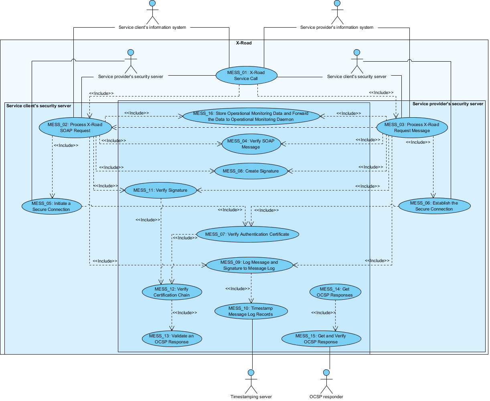
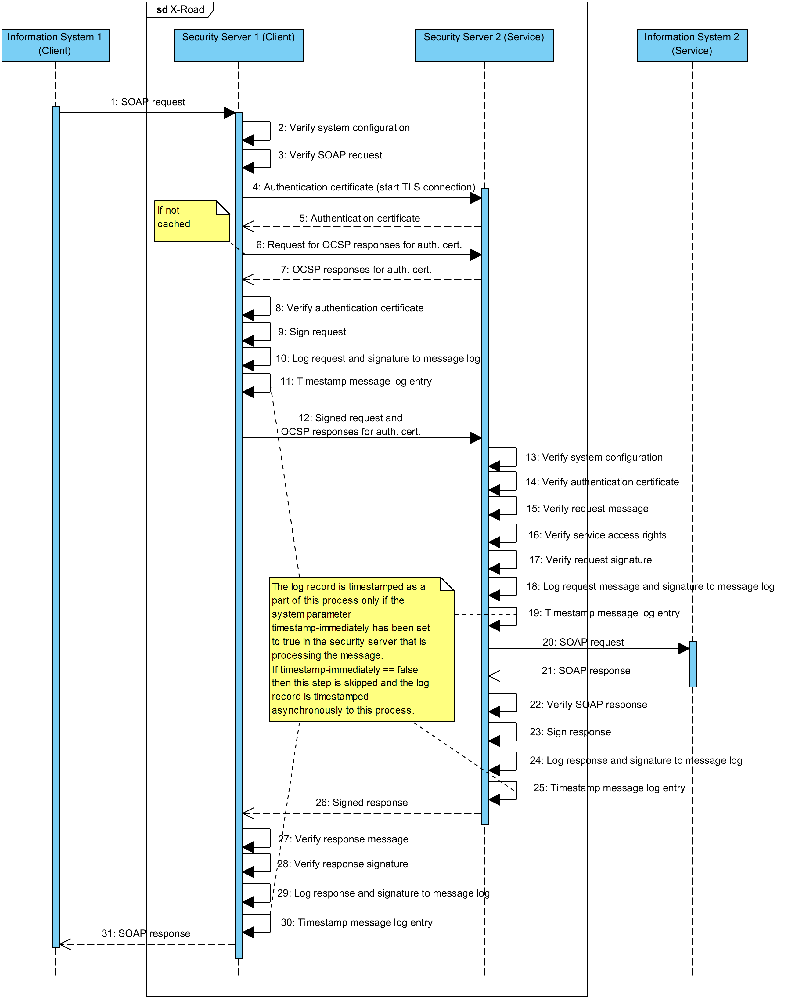

|  |
| -------------------------: |

# X-Road: Use Case Model for Member Communication

**Analysis**

Version: 1.8  
19.01.2023
<!-- 38 pages -->
Doc. ID: UC-MESS

---

## Version history

| Date       | Version | Description                                                                                                                                                                                                                                                              | Author             |
|------------|---------|--------------------------------------------------------------------------------------------------------------------------------------------------------------------------------------------------------------------------------------------------------------------------|--------------------|
| 02.06.2015 | 0.1     | Initial                                                                                                                                                                                                                                                                  | Riin Saarmäe       |
| 17.08.2015 | 0.2     | Sequence diagram added ([Annex A](#annex-a-sequence-diagram-for-messaging)). Component element added to use cases. Terms and Abbreviations section updated.                                                                                                              | Riin Saarmäe       |
| 31.08.2015 | 0.3     | Added comments and editorial changes                                                                                                                                                                                                                                     | Margus Freudenthal |
| 14.09.2015 | 0.4     | Minor corrections                                                                                                                                                                                                                                                        | Riin Saarmäe       |
| 20.09.2015 | 1.0     | Editorial changes made                                                                                                                                                                                                                                                   | Imbi Nõgisto       |
| 23.09.2015 | 1.1     | Use case [MESS\_09](#310-uc-mess_09-log-message-and-signature-to-message-log) (3.10) and sequence diagram ([Annex A](#annex-a-sequence-diagram-for-messaging)) updated                                                                                                   | Riin Saarmäe       |
| 08.11.2015 | 1.2     | Renamed *Scope* element to *System*. *Native* (X-Road instance) renamed to *local*. Minor corrections done.                                                                                                                                                              | Riin Saarmäe       |
| 26.11.2015 | 1.3     | Use cases [MESS\_02](#33-uc-mess_02-process-x-road-soap-request), [MESS\_03](#34-uc-mess_03-process-x-road-request-message), [MESS\_14](#315-uc-mess_14-get-ocsp-responses) and [MESS\_15](#316-uc-mess_15-get-and-verify-ocsp-response) updated.                        | Riin Saarmäe       |
| 05.02.2016 | 1.4     | XTE-225 - use case [MESS\_04](#35-uc-mess_04-verify-soap-message) updated.                                                                                                                                                                                               | Meril Vaht         |
| 14.12.2016 | 1.5     | Operational monitoring functionality added                                                                                                                                                                                                                               | Meril Vaht         |
| 22.02.2017 | 1.6     | Converted to Github flavoured Markdown, added license text, adjusted tables and identification for better output in PDF, re-numbered and re-bulleted [MESS\_16](#317-uc-mess_16-store-operational-monitoring-data-and-forward-the-data-to-operational-monitoring-daemon) | Toomas Mölder      |
| 06.03.2018 | 1.7     | Moved terms to term doc, added term doc reference and link, added internal MD-doc links                                                                                                                                                                                  | Tatu Repo          |
| 19.01.2023 | 1.8     | Updates regarding the *ocspFreshnessSeconds* parameter                                                                                                                                                                                                                   | Justas Samuolis    |

## Table of Contents

<!-- toc -->

- [License](#license)
- [1 Introduction](#1-introduction)
  * [1.1 Purpose](#11-purpose)
  * [1.2 Terms and Abbreviations](#12-terms-and-abbreviations)
  * [1.3 References](#13-references)
- [2 Overview](#2-overview)
- [3 Use Case Model](#3-use-case-model)
  * [3.1 Actors](#31-actors)
  * [3.2 UC MESS\_01: X-Road Service Call](#32-uc-mess_01-x-road-service-call)
  * [3.3 UC MESS\_02: Process X-Road SOAP Request](#33-uc-mess_02-process-x-road-soap-request)
  * [3.4 UC MESS\_03: Process X-Road Request Message](#34-uc-mess_03-process-x-road-request-message)
  * [3.5 UC MESS\_04: Verify SOAP Message](#35-uc-mess_04-verify-soap-message)
  * [3.6 UC MESS\_05: Initiate a Secure Connection](#36-uc-mess_05-initiate-a-secure-connection)
  * [3.7 UC MESS\_06: Establish the Secure Connection](#37-uc-mess_06-establish-the-secure-connection)
  * [3.8 UC MESS\_07: Verify Authentication Certificate](#38-uc-mess_07-verify-authentication-certificate)
  * [3.9 UC MESS\_08: Create Signature](#39-uc-mess_08-create-signature)
  * [3.10 UC MESS\_09: Log Message and Signature to Message Log](#310-uc-mess_09-log-message-and-signature-to-message-log)
  * [3.11 UC MESS\_10: Timestamp Message Log Records](#311-uc-mess_10-timestamp-message-log-records)
  * [3.12 UC MESS\_11: Verify Signature](#312-uc-mess_11-verify-signature)
  * [3.13 UC MESS\_12: Verify Certificate Chain](#313-uc-mess_12-verify-certificate-chain)
  * [3.14 UC MESS\_13: Validate an OCSP Response](#314-uc-mess_13-validate-an-ocsp-response)
  * [3.15 UC MESS\_14: Get OCSP Responses](#315-uc-mess_14-get-ocsp-responses)
  * [3.16 UC MESS\_15: Get and Verify OCSP Response](#316-uc-mess_15-get-and-verify-ocsp-response)
  * [3.17 UC MESS\_16: Store Operational Monitoring Data and Forward the Data to Operational Monitoring Daemon](#317-uc-mess_16-store-operational-monitoring-data-and-forward-the-data-to-operational-monitoring-daemon)
- [Annex A Sequence Diagram for Messaging](#annex-a-sequence-diagram-for-messaging)

<!-- tocstop -->

## License

This document is licensed under the Creative Commons Attribution-ShareAlike 3.0 Unported License. To view a copy of this license, visit http://creativecommons.org/licenses/by-sa/3.0/

## 1 Introduction

### 1.1 Purpose

The purpose of this document is to describe the events and verifications that take place in the security servers during the communication between an X-Road service client and an X‑Road service provider.

### 1.2 Terms and Abbreviations

See X-Road terms and abbreviations documentation \[[TA-TERMS](#Ref_TERMS)\].

### 1.3 References

1.  \[BATCH\] Freudenthal, M. Using Batch Hashing for Signing and Time-Stamping. Cybernetica Research Reports, T-4-20, 2013. <https://cyber.ee/research/reports/>

2.  \[HPDS\] Freudenthal, M. Profile for High-Perfomance Digital Signature. T-4-23, 2015. <https://cyber.ee/research/reports/>

3.  \[PR-MESS\] Cybernetica AS. X-Road: Message Protocol v4.0. Document ID: [PR-MESS](../Protocols/pr-mess_x-road_message_protocol.md).

4.  \[PR-MESSTRANSP\] Cybernetica AS. X-Road: Message Transport Protocol. Document ID: [PR-MESSTRANSP](../Protocols/pr-messtransp_x-road_message_transport_protocol_2.2_Y-743-4.docx).

5.  \[UC-GCONF\] Cybernetica AS. X-Road: Use Case Model for Global Configuration Distribution. Document ID: [UC-GCONF](uc-gconf_x-road_use_case_model_for_global_configuration_distribution_1.4_Y-883-8.md).

6.  \[UG-SYSPAR\] Cybernetica AS. X-Road: System Parameters. Document ID: [UG-SYSPAR](../Manuals/ug-syspar_x-road_v6_system_parameters.md).

7.  \[XAdES\] XML Advanced Electronic Signatures (XadES). ETSI TS 101 903 V1.3.2.

8.  \[UC-SS\] X-Road: Use Case Model for Security Server Management. Document ID: [UC-SS](uc-ss_x-road_use_case_model_for_security_server_management_1.4_Y-883-4.md).

9.  \[UC-OPMON\] Cybernetica AS. X-Road Operational Monitoring Daemon: Use Case Model. Document ID: [UC-OPMON](../OperationalMonitoring/UseCases/uc-opmon_x-road_use_case_model_for_operational_monitoring_daemon_Y-1095-2.md).

10. \[TA-TERMS\] X-Road Terms and Abbreviations. Document ID: [TA-TERMS](../terms_x-road_docs.md).

## 2 Overview

X-Road services are used by X-Road members communicating directly with each other via security servers, using synchronous request-response messaging pattern.

Security servers periodically download global configuration from the central server (see \[[UC-GCONF](#Ref_UC-GCONF)\]). The global configuration is used to check validity of various data items, such as certificates, OCSP responses and timestamps. In addition, the global configuration is used to verify that communicating parties are registered on the X-Road.

Security servers ensure the integrity and confidentiality of the exchanged messages by signing the messages with the X-Road member's signing key and using mutually authenticated Transport Layer Security (TLS) channel for transport. The long-term evidential value of the signed messages is ensured by logging the exchanged messages and periodically timestamping the message logs.

The security servers interact with trust services to acquire certificate validity information and to timestamp signed messages. The trust service calls are asynchronous with respect to the message exchange.

Security servers store operational monitoring data in operational monitoring buffer and forward the data to operational monitoring daemon (see \[[UC-OPMON](#Ref_UC-OPMON)\]).

The communication process between an X-Road service client and an X-Road service provider is described in detail as use cases in [Chapter 3](#3-use-case-model).

The general steps of the communication process, excluding actions that are asynchronous to the message exchange process, are depicted as a sequence diagram in [Annex A](#annex-a-sequence-diagram-for-messaging).

## 3 Use Case Model

### 3.1 Actors

The X-Road member communication use case model includes the following actors.

-   **Client IS** (service client's information system) – a subsystem of an X-Road member acting as a service client in an X-Road service call event.

-   **Client SS** (service client's security server) – X-Road security server where the service client's information system is registered as a client of this security server.

-   **Provider IS** (service provider's information system) – a subsystem of an X-Road member acting as a service provider in an X-Road service call event.

-   **Provider SS** (service provider's security server) – X-Road security server where the service provider's information system is registered as a client of this security server.

-   **TSS** (timestamping server) – a timestamping service approved by the X-Road and configured to be used by the Client SS and Provider SS.

-   **OCSP responder** – OCSP service providing OCSP responses for the approved certification service that issued the certificates used by the Client SS and Provider SS.

Relationships between actors, systems and use cases are described in [Figure 1](#Ref_Communication_use_case_diagram).

Figure 1. Communication use case diagram

### 3.2 UC MESS\_01: X-Road Service Call

**System**: X-Road

**Level**: Summary

**Component**: Security server

**Actors**:

-   Client IS

-   Client SS

-   Provider SS

-   Provider IS

**Brief Description**: A service client initiates a service call and receives a response. Both the request and the response are processed by the service client's and the service provider's security servers.

**Preconditions**:

-   Service provider and service client are affiliated to the X-Road.

-   Service provider and service client have entered into a service usage contract.

-   Service provider and service client have interfaced their information systems as subsystems to the X-Road system.

-   Service client's security server is running and able to receive messages.

**Postcondition**: Service client's information system has received either a service response or a SOAP Fault message.

**Trigger**: Service client's information system initiates an X-Road service call.

**Main Success Scenario**:

1.  Client IS forms and sends an X-Road SOAP request to the Client SS.

2.  Client SS processes the X-Road SOAP request and forwards the request as X-Road request message to the Provider SS: [3.3](#33-uc-mess_02-process-x-road-soap-request) (steps 1-14).

3.  Provider SS processes the X-Road request message and forwards the request as X-Road SOAP request to the Provider IS: [3.4](#34-uc-mess_03-process-x-road-request-message) (steps 1-14).

4.  Provider IS processes the received request, forms an X-Road SOAP response and sends the response to Provider SS.

5.  Provider SS processes the X-Road SOAP response and forwards the response as X-Road response message to the Client SS: [3.4](#34-uc-mess_03-process-x-road-request-message) (steps 15-20).

6.  Client SS processes the X-Road response message and forwards the response as X-Road SOAP response to the Client IS: [3.3](#33-uc-mess_02-process-x-road-soap-request) (steps 15-22).

7.  Client IS receives and processes the response.

**Extensions**:

2-6a. Processing or forwarding the message results in an error. Client IS receives a SOAP Fault message. The use case terminates.

**Related information**:

-   X-Road SOAP messages must conform to the profile described in document “X-Road: Message Protocol” \[[PR-MESS](#Ref_PR-MESS)\].

-   Messaging between security servers conforms to the protocol described in document “X-Road: Message Transport Protocol” \[[PR-MESSTRANSP](#Ref_PR-MESSTRANSP)\].

### 3.3 UC MESS\_02: Process X-Road SOAP Request

**System**: Service client's security server

**Level**: System

**Component**: Security server

**Actors**:

-   Client IS

-   Provider SS

**Brief Description**: The system receives a request message from Client IS; verifies that the system configuration allows X-Road message exchange and that the request message composition conforms to the X-Road message protocol; sets up a secure connection session with the Provider SS; signs the request message; logs the request message and the signature; sends the request message and signature to Provider SS and awaits for the response. After receiving the response from Provider SS, system validates the response composition and signature; logs the response message and signature and sends the response to the Client IS. In case a verification or a validation fails or when the system encounters an error condition, the system sends an error (SOAP Fault) message to the Client IS.

**Preconditions**:

-   Service client's security server is running and able to receive messages.

**Postconditions**: -

**Trigger**: Client IS sends a request to the system.

**Main Success Scenario**:

1.  System receives the request and verifies that the request was sent using POST method.

2.  System verifies that the system configuration contains valid global configuration.

3.  System verifies that the system configuration contains an authentication certificate that can be used for exchanging messages with another security server (the certificate must be active and valid).

4.  System verifies that the request contains a SOAP message and verifies the SOAP message: [3.5](#35-uc-mess_04-verify-soap-message).

5.  System verifies that the target service is not an X-Road central service (SOAP request header contains X-Road service identifier and not X-Road central service identifier).

6.  System verifies that the Client IS is in *Registered* state in the system configuration.

7.  System verifies that the communication type for the Client IS in the system configuration is set to “HTTPS” and that the Client IS has made the connection for sending the request using HTTPS protocol.

8.  System verifies that the Client IS provided a TLS certificate that matches a certificate saved for the Client IS in the system configuration.

9.  System looks up Provider SS addresses from the global configuration.

10. System prepares the authentication information that will be sent to the Provider SS while setting up a secure connection.

11. System verifies that no cached communication sessions with the found addresses exist and initiates a secure connection with the fastest responder: [3.6](#36-uc-mess_05-initiate-a-secure-connection).

12. System signs the request message: [3.9](#39-uc-mess_08-create-signature).

13. System logs the request message and signature to the message log: [3.10](#310-uc-mess_09-log-message-and-signature-to-message-log).

14. System sends the signed request and OCSP responses needed to verify the authentication certificate to the Provider SS and waits for the response.

15. System receives a response from the Provider SS and parses the response to verify that the message parts are well-formed.

16. System verifies that the response is not a SOAP Fault message.

17. System verifies that the response contains a SOAP message and a signature.

18. System verifies the signature: [3.12](#312-uc-mess_11-verify-signature).

19. System verifies that the SOAP response headers are consistent with the SOAP request headers.

20. System verifies that the request message hash is included in the response and that the hash matches the request message.

21. System logs the response message and signature to the message log: [3.10](#310-uc-mess_09-log-message-and-signature-to-message-log).

22. System stores operational monitoring data in operational monitoring buffer: [3.17](#317-uc-mess_16-store-operational-monitoring-data-and-forward-the-data-to-operational-monitoring-daemon).

23. System sends the response message to the Client IS.

**Extensions**:

1a. Request was sent using a method other than POST.

  - 1a.1. System sends a SOAP Fault message with fault string “Must use POST request method instead of X” (where “X” is the used method) to the Client IS. The use case terminates.

2a. The global configuration is expired.

  - 2a.1. System sends a SOAP Fault message with fault string “Global configuration is expired” to the Client IS. The use case terminates.

3a. Security server does not have usable authentication certificates.

  - 3a.1. System sends a SOAP Fault message with fault string “Security server has no valid authentication certificate” to the Client IS. The use case terminates.

4a. Request does not contain a SOAP message.

  - 4a.1. System sends a SOAP Fault message with fault string “Request does not contain SOAP message” to the Client IS. The use case terminates.

4b. The validation process terminates with an exception message.

  - 4b.1. System sends a SOAP Fault message with fault string containing the exception message to the Client IS. The use case terminates.

5a. The target service is an X-Road central service (SOAP request header contains X-Road central service identifier).

  - 5a.1. System looks up the identifier of the implementing service from the global configuration and writes it to the request header. The use case continues from step 6.

    - 5a.1a. System cannot find the identifier of the implementing service that for the central service from the global configuration.

      - 5a.1a.1. System sends a SOAP Fault message with fault string “Cannot find implementing service for central service 'X'” (where “X” is the central service identifier) to the Client IS. The use case terminates.

5b. Request contains both a service identifier and a central service identifier.

  - 5b.1. System sends a SOAP Fault message with fault string “Message header must contain either service id or central service id” to the Client IS. The use case terminates.

6a. Client IS is not in *Registered* state.

  - 6a.1. System sends a SOAP Fault message with fault string “Client 'X' not found” (where “X” is the X-Road identifier of Client IS) to the Client IS. The use case terminates.

7a. Client IS connection type in the system configuration is “HTTP” and Client IS has made an HTTP connection.

  - 7a.1. The use case continues from step 9.

7b. Client IS connection type in the system configuration is “HTTP”, but Client IS has made an HTTPS connection.

  - 7b.1. The use case continues from step 9.

7c. Client IS connection type in the system configuration is “HTTPS NO AUTH”, but Client IS has made an HTTP connection.

  - 7c.1. System sends a SOAP Fault message with fault string “Client (X) specifies HTTPS NO AUTH but client made plaintext connection” (where “X” is the X-Road identifier of Client IS) to the Client IS. The use case terminates.

7d. Client IS connection type in the system configuration is “HTTPS”, but Client IS has made an HTTP connection.

  - 7d.1. System sends a SOAP Fault message with fault string “Client (X) specifies HTTPS but did not supply TLS certificate” (where “X” is the X-Road identifier of Client IS) to the Client IS. The use case terminates.

8a. No TLS certificates for the Client IS are found in the system configuration.

  - 8a.1. System sends a SOAP Fault message with fault string “Client (X) has no IS certificates” (where “X” is the X-Road identifier of Client IS) to the Client IS. The use case terminates.

8b. No matching TLS certificates for the Client IS are found in the system configuration.

  - 8b.1. System sends a SOAP Fault message with fault string “Client (X) TLS certificate does not match any IS certificates” (where “X” is the X-Road identifier of Client IS) to the Client IS. The use case terminates.

9a. No Provider SS addresses for the requested service are found.

  - 9a.1. System sends a SOAP Fault message with fault string “Could not find addresses for service provider “X”” (where “X” is the service provider's X-Road identifier) to the Client IS. The use case terminates.

10a. System cannot find an authentication key that can be used for establishing a secure connection.

  - 10a.1. System sends a SOAP Fault message with fault string “Could not find active authentication key for security server 'X'” (where “X” is the security server identifier) to the Client IS. The use case terminates.

11a. System finds a cached session with one of the found security servers.

  - 11a.1. System reuses the cached session information to set up a connection: [3.6](#36-uc-mess_05-initiate-a-secure-connection) from step 3.

    - 11a.1a. The process of initiating a secure connection using the cached session information terminates with an exception message.

      - 11a.1a.1. System sends a SOAP Fault message with fault string containing the exception message to the Client IS. The use case terminates.

  - 11a.2. The use case continues from step 12.

11b. The process of initiating a secure connection terminates with an exception message.

  - 11b.1. System sends a SOAP Fault message with fault string containing the exception message to the Client IS. The use case terminates.

11c. System could not initiate contact with any of the found Provider SS addresses.

  - 11c.1. System sends a SOAP Fault message with fault string “Could not connect to any target host (X)” (where X is the list of Provider SS addresses). The use case terminates.

12a. The signature creation process terminates with an exception message.

  - 12a.1. System sends a SOAP Fault message with fault string containing the exception message to the Client IS. The use case terminates.

13a. The logging process terminates with an exception message.

  - 13a.1. System sends a SOAP Fault message with fault string containing the exception message to the Client IS. The use case terminates.

15a. System does not receive a response within the timeout period set by the security server system parameter *proxy.client-timeout*.

  - 15a.1. System sends a SOAP Fault message containing the fault detail to the Client IS. The use case terminates.

15b. The parsing of the response message resulted in an error.

  - 15b.1. System sends a SOAP Fault message with fault string containing the encountered error details to the Client IS. The use case terminates.

16a. The response is a Fault message.

  - 16a.1. System sends a SOAP Fault message with fault string containing the received fault message content to the Client IS. The use case terminates.

17a. Response does not contain a SOAP message.

  - 17a.1. System sends a SOAP Fault message with fault string “Response does not have SOAP message” to the Client IS. The use case terminates.

17b. Response does not contain a signature.

  - 17b.1. System sends a SOAP Fault message with fault string “Response does not have signature” to the Client IS. The use case terminates.

18a. Signature verification process terminates with an exception message.

  - 18a.1. System sends a SOAP Fault message with fault string containing the exception message to the Client IS. The use case terminates.

19a. Response headers are not consistent with the request headers.

  - 19a.1. System sends a SOAP Fault message with string “Response from server proxy is not consistent with request” to the Client IS. The use case terminates.

20a. Request message hash contained in the response does not match request message.

  - 20a.1. System sends a SOAP Fault message with fault string “Request message hash does not match request message” to the Client IS. The use case terminates.

20b. Response does not contain the request message hash.

  - 20b.1. System sends a SOAP Fault message with fault string “Response from server proxy is missing request message hash” to the Client IS. The use case terminates.

21a. The logging process terminates with an exception message.

  - 21a.1. System sends a SOAP Fault message with fault string containing the exception message to the Client IS. The use case terminates.

22a. The size of the operational monitoring buffer defined with a system parameter is 0.

  - 22a.1. The operational monitoring data is not stored in operational monitoring buffer and will not be sent to the operational monitoring daemon.

**Related information**:

-   All the fault strings are logged to `/var/log/xroad/proxy.log`.

-   The system parameters are described in document “X-Road: System Parameters” \[[UG-SYSPAR](#Ref_UG-SYSPAR)\]

### 3.4 UC MESS\_03: Process X-Road Request Message

**System**: Service provider's security server

**Level**: System

**Component**: Security server

**Actors**:

-   Client SS

-   Provider IS

**Brief Description**:

The system receives a communication request from Client SS; verifies that the system configuration allows X-Road message exchange; establishes a secure connection session with the Client SS; receives the X-Road service request; verifies the signature of the request; logs the request message and signature to the message log; forwards the request message to the Provider IS or to operational monitoring daemon (if the request is either operational monitoring data request or security server health data request) and waits for the response. Upon receiving the response from the Provider IS, system verifies that the response message composition conforms to the X-Road message protocol; signs the response message; logs the response message and signature to the message log and forwards the message and the signature to the Client SS. In case a verification or a validation fails or when the system encounters an error condition, the system sends a SOAP Fault message to the Client SS.

**Preconditions**:

-   Service provider's security server is running and able to receive messages.

**Postcondition**: -

**Trigger**: The service client's security server sends an X-Road service request to the service provider's security server.

**Main Success Scenario**:

1.  System receives the request and verifies that the request was sent using POST method.

2.  System verifies that the system configuration contains valid global configuration.

3.  System verifies that the Provider IS is in *Registered* state in the system configuration.

4.  System finds the signing information for the service provider. (The system does not accept the request if signing the respective response is not possible.)

5.  System establishes the secure connection initiated by Client SS: [3.7](#37-uc-mess_06-establish-the-secure-connection).

6.  System parses the request to verify that the message parts are well-formed.

7.  System verifies that the request does not contain a SOAP Fault message.

8.  System verifies that the request contains a SOAP message and a signature.

9.  System verifies that the requested service is configured in the system, allowed for the requesting information system and enabled.

10. System verifies the signature: [3.12](#312-uc-mess_11-verify-signature).

11. System logs the request message and signature to the message log: [3.10](#310-uc-mess_09-log-message-and-signature-to-message-log).

12. System looks up the address of the Provider IS form the system configuration.

13. System verifies that the Provider IS should be connected using HTTP protocol. System initiates a connection with the Provider IS.

14. System sends the request and waits for the response.

15. System receives a response from the Provider IS or operational monitoring daemon and verifies the SOAP message: [3.5](#35-uc-mess_04-verify-soap-message).

16. System verifies that the response is not a SOAP Fault message.

17. System adds the request message hash to the response message header.

18. System signs the response message: [3.9](#39-uc-mess_08-create-signature).

19. System logs the response message and signature to the message log: [3.10](#310-uc-mess_09-log-message-and-signature-to-message-log).

20. System stores operational monitoring data in operational monitoring buffer: [3.17](#317-uc-mess_16-store-operational-monitoring-data-and-forward-the-data-to-operational-monitoring-daemon).

21. System sends the response message to the Client SS.

**Extensions**:

1a. Request was sent using a method other than POST.

  - 1a1. System sends a SOAP Fault message with fault string “Must use POST request method instead of X” (where “X” is the used method) to the Client SS. The use case terminates.

2a. The global configuration is expired.

  - 2a.1. System sends a SOAP Fault message with fault string “Global configuration is expired” to the Client SS. The use case terminates.

3a. Client information system is not in *Registered* state.

  - 3a1. System sends a SOAP Fault message with fault string “Client 'X' not found” (where “X” is the service provider's information system X-Road identifier) to the Client SS. The use case terminates.

4a. System could not find signing information for the X-Road member.

  - 4a.1. System sends a SOAP Fault message with fault string “Failed to get signing info for member 'X': Y” (where “X” is the X-Road member's identifier and “Y” is the description of the encountered error) to the Client SS. The use case terminates.

5a. The establishment of the secure channel terminates with an exception message.

  - 5a.1. System sends a SOAP Fault message with fault string containing the exception message to the Client SS. The use case terminates.

6a. The parsing of the request message resulted in an error.

  - 6a.1. System sends a SOAP Fault message with fault string containing the encountered error details to the Client SS. The use case terminates.

7a. The request contains a fault message.

  - 7a.1. System discards the received message. The use case terminates.

8a. Request does not contain a SOAP message.

  - 8a.1. System sends a SOAP Fault message with fault string “Request does not have SOAP message” to the Client SS. The use case terminates.

8b. Request does not contain a signature.

  - 8b.1. System sends a SOAP Fault message with fault string “Request does not have signature” to the Client SS. The use case terminates.

9a. The requested service is not found in the system configuration.

  - 9a1. System sends a SOAP Fault message with fault string “Unknown service: X” (where “X” is the X-Road identifier of the requested service) to the Client SS. The use case terminates.

9b. The requesting information system does not have access rights for the requested service.

  - 9b1. System sends a SOAP Fault message with fault string “Request is not allowed: X” (where “X” is the X-Road identifier of the requested service) to the Client SS. The use case terminates.

9c. The requested service is disabled.

  - 9c1. System sends a SOAP Fault message with fault string “Service X is disabled: Y” (where “X” is the X-Road identifier of the requested service and “Y” is a notification message entered by the person who disabled the service) to the Client SS. The use case terminates.

10a. Signature verification process terminates with an exception message.

  - 10a.1. System sends a SOAP Fault message with fault string containing the exception message to the Client SS. The use case terminates.

11a. The logging process terminates with an exception message.

  - 11a.1. System sends a SOAP Fault message with fault string containing the exception message to the Client SS. The use case terminates.

12a. System cannot find the Provider IS address from the system configuration.

  - 12a.1. System sends a SOAP Fault message with fault string “Service address not specified for 'X'” (where “X” is the X-Road identifier of the requested service) to the Client SS. The use case terminates.

12b. The service provider information system's address found in the system configuration is malformed.

  - 12b1. System sends a SOAP Fault message with fault string “Malformed service address 'X': Y” (where “X” is the X-Road identifier of the requested service and Y is an exception message) to the Client SS. The use case terminates.

12c. The request is either operational monitoring data request or security server health data request. System looks up the address of the operational monitoring daemon form operational monitoring daemon configuration file.

  - 12c.1. Use case continues from step 13.

    - 12c.1a. The service operational monitoring daemon address found in the configuration file is malformed.

      - 12c.1a.1. System sends a SOAP Fault message with fault string to the Client SS. The use case terminates.

13a. System fails to initiate a connection with the Provider IS.

  - 13a.1. System sends a SOAP Fault message with fault string containing the error details to the Client SS. The use case terminates.

13b. Provider IS should be connected using HTTPS and the Provider IS certificate should not be verified.

  - 13b.1. System finds the Provider IS TLS certificate from the connection but does not verify the certificate. Use case continues from step 14.

    - 13b.1a. System fails to find the TLS certificate.

      - 13b.1a.1. System sends a SOAP Fault message with fault string “Could not get peer certificates” to the Client SS. The use case terminates.

13c. Provider IS should be connected using HTTPS and the Provider IS certificate should be verified.

  - 13c.1. System finds the Provider IS TLS certificate from the connection.

    - 13c.1a. System fails to find the TLS certificate.

      - 13c.1a.1. System sends a SOAP Fault message with fault string “Could not get peer certificates” to the Client SS. The use case terminates.

  - 13c.2. System verifies that the TLS certificate sent by the Provider IS matches one of the TLS certificates configured for the Provider IS in the system configuration. Use case continues from step 14.

    - 13c.2a. System does not find any TLS certificates for the Provider IS from the system configuration.

      - 13c.2a.1. System sends a SOAP Fault message with fault string “Client 'X' has no IS certificates” (where “X” is the identifier of the Provider IS) to the Client SS. The use case terminates.

    - 13c.2b. None of the TLS certificates configured for the Provider IS match the certificate the Provider IS presented for TLS authentication.

      - 13c.2b.1. System sends a SOAP Fault message with fault string “Server certificate is not trusted” to the Client SS. The use case terminates.

13d. The request is either operational monitoring data request or security server health data request. System verifies that the operational monitoring daemon should be connected using HTTP protocol. System initiates a connection with the operational monitoring daemon.

  - 13d.1. Use case continues from step 14.

    - 13d.1a. System fails to initiate a connection with the operational monitoring daemon.

      - 13d.1a.1. System sends a SOAP Fault message with fault string containing the error details to the Client SS. The use case terminates.

13e. The request is either operational monitoring data request or security server health data request. System verifies that the operational monitoring daemon should be connected using HTTPS and the operational monitoring daemon certificate should be verified.

  - 13e.1. System uses the internal TLS certificate of the security server for connection.

  - 13e.2. System finds the operational monitoring daemon TLS certificate from the connection.

    - 13e.2a. System fails to find the TLS certificate.

      - 13e.2a.1. System sends a SOAP Fault message with fault string to the Client SS. The use case terminates.

  - 13e.3. System verifies that the TLS certificate sent by the operational monitoring daemon matches the TLS certificate configured for the operational monitoring daemon in the system configuration. Use case continues from step 14.

    - 13e.3a. System does not find TLS certificate for the operational monitoring daemon from the system configuration.

      - 13e.3a.1. System sends a SOAP Fault message with fault string to the Client SS. The use case terminates.

    - 13e.3b. The TLS certificate configured for the operational monitoring daemon does not match the certificate the operational monitoring daemon presented for TLS authentication.

      - 13e.3b.1. System sends a SOAP Fault message with fault string to the Client SS. The use case terminates.

14a. System does not receive a response within the timeout period configured for the service in the system configuration.

  - 14a.1. System sends a SOAP Fault message containing the fault details to the Client SS. The use case terminates.

15a. The validation process terminates with an exception message.

  - 15a.1. System sends a SOAP Fault message with fault string containing the exception message to the Client SS. The use case terminates.

16a. The response is a SOAP Fault message.

  - 16a1. System sends a SOAP Fault message with fault string containing the received Fault message content to the Client SS. The use case terminates.

18a. The signature creation process terminates with an exception message.

  - 18a.1. System sends a SOAP Fault message with fault string containing the exception message to the Client SS. The use case terminates.

19a. The logging process terminates with an exception message.

  - 19a.1. System sends a SOAP Fault message with fault string containing the exception message to the Client SS. The use case terminates.

20a. The size of the operational monitoring buffer defined with a system parameter is 0.

  - 20a.1. The operational monitoring data is not stored in operational monitoring buffer and will not be sent to the operational monitoring daemon.

**Related information**:

-   All fault strings are logged to `/var/log/xroad/proxy.log`.

-   The system parameters are described in document “X-Road: System Parameters” \[[UG-SYSPAR](#Ref_UG-SYSPAR)\].

### 3.5 UC MESS\_04: Verify SOAP Message

**System**: Security server

**Level**: Subfunction

**Component**: Security server

**Actors**: -

**Brief Description**: The system verifies that the SOAP message received from an information system (Client IS or Provider IS) conforms to the X-Road message protocol \[[PR-MESS](#Ref_PR-MESS)\].

**Preconditions**: -

**Postconditions**: -

**Triggers**:

-   Step 4 of [3.3](#33-uc-mess_02-process-x-road-soap-request).

-   Step 14 of [3.4](#34-uc-mess_03-process-x-road-request-message).

**Main Success Scenario**:

1.  System verifies that the base content type of the message is either *text/xml* or *multipart/related*.

2.  System verifies that the SOAP message is well-formed.

**Extensions**:

1a. System fails to get the base content type from the message.

  - 1a.1. System creates an exception message: “Could not get content type from request”. The use case terminates.

1b. Base content type of the message is neither *text/xml* nor *multipart/related*.

  - 1b.1. System creates an exception message: “Invalid content type: X” (where “X” is the base content type). The use case terminates.

2a. The SOAP body element is missing from the message.

  - 2a.1. System creates an exception message: “Malformed SOAP message: body missing”. The use case terminates.

2b. The validation of the SOAP envelope against the SOAP envelope schema (<http://schemas.xmlsoap.org/soap/envelope/>) fails.

  - 2b.1. System creates an exception message containing the validation fault message. The use case terminates.

2c. The message is not a SOAP Fault and the SOAP header element is missing from the message.

  - 2c.1. System creates an exception message: “Malformed SOAP message: header missing”. The use case terminates.

2d. The message is not a SOAP Fault and the *service* and *centralservice* headers are both empty.

  - 2d.1. System creates an exception message: “Message header must contain either service id or central service id“. The use case terminates.

2e. The message is not a SOAP Fault and the SOAP header contains duplicate fields.

  - 2e.1. System creates an exception message: “SOAP header contains duplicate field 'X'” (where “X” is the duplicated header element name). The use case terminates.

2f. The message contains attachments and system fails to get the content type of an attachment part.

  - 2f.1. System creates an exception message: “Could not get content type for part“. The use case terminates.

2g. The *objectType* of the service client is MEMBER but the SOAP header contains the element *subsystemCode*.

  - 2g.1. System creates an exception message: “Redundant subsystem code”. The use case terminates.

2h. The *objectType* of the service client is SUBSYSTEM but the SOAP header does not contain the element *subsystemCode*.

  - 2h.1. System creates an exception message: “Missing required subsystem code”. The use case terminates.

**Related information**: -

### 3.6 UC MESS\_05: Initiate a Secure Connection

**System**: Service client's security server

**Level**: Subfunction

**Component**: Security server

**Actor**: Provider SS

**Brief Description**: The system initiates a secure connection with the Provider SS and validates the authentication information of the Provider SS.

**Preconditions**: -

**Postconditions**: -

**Trigger**: Step 11 of [3.3](#33-uc-mess_02-process-x-road-soap-request).

**Main Success Scenario**:

1.  System initiates a TLS handshake with the Provider SS.

2.  System exchanges session authentication information with the Provider SS.

3.  System gets the service provider identifier and authentication certificate from the session authentication information.

4.  System verifies that the authentication certificate was issued by an approved certification service provider and builds the certificate chain from the authentication certificate to a trusted certification authority (CA) certificate.

5.  System finds that one or more of the OCSP responses needed to verify the certificate chain are not cached in the system (from a previous session). System uses the authentication certificate and the registered link between the authentication certificate and the Provider SS to find the address of the Provider SS from the global configuration. System sends a request for missing OCSP responses to the Provider SS.

6.  System receives and caches the OCSP responses.

7.  System verifies the authentication certificate: [3.8](#38-uc-mess_07-verify-authentication-certificate).

8.  System caches the session information.

**Extensions**:

3a. System cannot find usable certificates from the session authentication information.

  - 3a.1. System creates an exception message: “Service provider did not send correct authentication certificate“. The use case terminates.

3b. System cannot find certificates from the session authentication information.

  - 3b.1. System creates an exception message: “Could not get peer certificates from context“. The use case terminates.

4a. The authentication certificate issuer is not listed as an approved certification service in the global configuration.

  - 4a.1. System creates an exception message: “Certificate is not issued by approved certification service provider“. The use case terminates.

5a. System cannot find a link between the Provider SS and the authentication certificate received from the Provider SS from the global configuration (the authentication certificate is not registered in the X-Road central server as a certificate used by the Provider SS).

  - 5a.1. System creates an exception message: “Unable to find provider address for authentication certificate X (service provider: Y)” (where “X” is the serial number of the authentication certificate the Provider SS sent and “Y” is the service provider's identifier). The use case terminates.

6a. System did not receive all the OCSP responses needed to verify the certificate chain.

  - 6a.1. System creates an exception message: “Could not get all OCSP responses from server (expected X, but got Y)” (where “X” is the number of certificates in the certificate chain and “Y” is the number of OCSP responses received from the Provider SS). The use case terminates.

7a. The authentication certificate verification process terminates with an exception message.

  - 7a.1. The use case terminates with the exception message.

**Related information**: -

### 3.7 UC MESS\_06: Establish the Secure Connection

**System**: Service provider's security server

**Level**: Subfunction

**Component**: Security server

**Actor**: Client SS

**Brief Description**: The system finishes setting up the secure connection initiated by the Client SS by validating the authentication information received from the Client SS.

**Preconditions**: Client SS has initiated the secure connection and the system has received validation information from the Client SS.

**Postconditions**: -

**Trigger**: Step 5 of [3.4](#34-uc-mess_03-process-x-road-request-message).

**Main Success Scenario**:

1.  System verifies that the request message received from the Client SS contains OCSP responses.

2.  System verifies that the authentication certificate of the Client SS was issued by an approved certification service provider.

3.  System verifies the authentication certificate of the Client SS: [3.8](#38-uc-mess_07-verify-authentication-certificate).

**Extensions**:

1a. System cannot find the OCSP response needed to verify the authentication certificate.

  - 1a.1. System creates an exception message: “Cannot verify TLS certificate, corresponding OCSP response is missing“. The use case terminates.

2a. The authentication certificate issuer is not listed as an approved certification service in the global configuration.

  - 2a.1. System creates an exception message: “Certificate is not issued by approved certification service provider“. The use case terminates.

3a. The verification process terminates with an exception message.

  - 3a.1. The use case terminates with the exception message.

**Related information**: -

### 3.8 UC MESS\_07: Verify Authentication Certificate

**System**: Security server

**Level**: Subfunction

**Component**: Security server

**Actors**: -

**Brief Description**: The system validates the authentication certificate and verifies that the peer security server is entitled to use the authentication certificate it presented and that it is entitled to send messages on behalf of the service client (in case the Provider SS performs the verification) or the service provider (in case the Client SS performs the verification).

**Preconditions**: -

**Postconditions**: The validity of the authentication certificate is either verified or refuted.

**Triggers**:

-   Step 7 of [3.6](#36-uc-mess_05-initiate-a-secure-connection).

-   Step 3 of [3.7](#37-uc-mess_06-establish-the-secure-connection).

**Main Success Scenario**:

1.  System verifies that the certificate is an authentication certificate (The certificate is an authentication certificate, if it has *ExtendedKeyUsage* extension which contains *ClientAuthentication* or if it has *keyUsage* extension which has *digitalSignature*, *keyEncipherment* or *dataEncipherment* bit set).

2.  System builds the certificate chain from the authentication certificate to a trusted certification authority (CA) certificate.

3.  System verifies the certificate chain: [3.13](#313-uc-mess_12-verify-certificate-chain).

4.  System verifies (using global configuration) that the authentication certificate is registered for the security server who provided the authentication certificate and the security server is entitled to send messages on behalf of the service client/service provider (the service provider/service client is registered as a client of the security server).

**Extensions**:

1a. The certificate is not an authentication certificate.

  - 1a.1. System creates an exception message: “Peer certificate is not an authentication certificate“. The use case terminates.

2a. System does not find enough certificates to build a certificate chain.

  - 2a.1. System creates an exception message: “Chain must have at least user's certificate and root certificate authority“. The use case terminates.

2b. System encounters an error while building the certificate path from the signature certificate to the trusted root certificate.

  - 2b.1. System creates an exception message containing the details of the encountered error. The use case terminates.

3a. The certificate chain validation process terminates with an exception message.

  - 3a.1. The use case terminates with the exception message.

4a. Security server is not entitled to send messages on behalf of the service client/service provider.

  - 4a.1. System creates an exception message: “Client 'X' is not registered at security server Y” (where “X” is the identifier of the service client or service provider and “Y” is the identifier of the security server who provided the authentication certificate). The use case terminates.

4b. The presented authentication certificate is not registered in the central server.

  - 4b.1. System creates an exception message: “Authentication certificate X is not associated with any security server” (where “X” is the subject name of the authentication certificate). The use case terminates.

**Related information**: -

### 3.9 UC MESS\_08: Create Signature

**System**: Security server

**Level**: Subfunction

**Component**: Security server

**Actors**: -

**Brief Description**: The system signs the message using the signature key and certificate of the service client (in case the Client SS creates the signature) or the service provider (in case the Provider SS creates the signature).

**Preconditions**: -

**Postconditions**: -

**Triggers**:

-   Step 12 of [3.3](#33-uc-mess_02-process-x-road-soap-request).

-   Step 18 of [3.4](#34-uc-mess_03-process-x-road-request-message).

**Main Success Scenario**:

1.  System finds signing information (key, certificate, OCSP responses) for the X-Road member that sent the message to be signed.

2.  System creates the signature. Please see documents “Profile for High-Perfomance Digital Signature” \[[HPDS](#Ref_HPDS)\] and “Using Batch Hashing for Signing and Time-Stamping” \[[BATCH](#Ref_BATCH)\] for detailed description of X-Road signatures.

**Extensions**:

1a. System could not find signing info for the X-Road member.

  - 1a.1. System creates an exception message: “Failed to get signing info for member 'X': Y” (where “X” is the X-Road member's identifier and “Y” is the description of the encountered error). The use case terminates.

1b. System could not find any usable (active, valid) signature certificates for the X-Road member.

  - 1b.1. System creates an exception message: “Failed to get signing info for member 'X': Member 'X' has no suitable certificates” (where “X” is the X-Road member's identifier). The use case terminates.

2a. System could not build the certificate chain for the signature certificate.

  - 2a.1. System creates an exception message: “Got empty certificate chain for certificate X” (where X is the certificate serial number). The use case terminates

2b. System did not find an OCSP response for one or more certificates in the certificate chain.

  - 2b.1. System creates an exception message: “Could not get OCSP responses for certificates (X)” (where “X” is the list of certificates). The use case terminates.

**Related information**: -

### 3.10 UC MESS\_09: Log Message and Signature to Message Log

**System**: Security server

**Level**: Subfunction

**Component**: Security server

**Actors**: -

**Brief Description**: The system verifies that logging is allowed (if the time of last successful timestamping is older than specified by the security policy, then no more messages are accepted by the message log) and creates a log record containing the message and the signature. If the system is configured for synchronous timestamping, then the logging process includes timestamping of the created log record.

**Preconditions**: -

**Postconditions**: -

**Triggers**:

-   Steps 13 and 21 of [3.3](#33-uc-mess_02-process-x-road-soap-request).

-   Steps 11 and 19 of [3.4](#34-uc-mess_03-process-x-road-request-message).

**Main Success Scenario**:

1.  System verifies that at least one timestamping service exists in the system configuration.

2.  System verifies that timestamping has not been failing for longer than the period set by the security server system parameter *acceptable-timestamp-failure-period*.

3.  System creates a log record consisting of the SOAP message (attachments are not logged) and the signature and saves the record to message log.

4.  System verifies that the log record should be timestamped synchronously to the messaging process (security server system parameter *timestamp-immediately* value is set to *true*).

5.  System timestamps the message log record: [3.11](#311-uc-mess_10-timestamp-message-log-records) from step 2.

**Extensions**:

1a. No timestamping services are found in the system configuration.

  - 1a.1. System creates an exception message: “Cannot time-stamp messages: no time-stamping services configured“. The use case terminates.

2a. Timestamping has been failing for longer than the allowed period.

  - 2a.1. System creates an exception message: “Cannot time-stamp messages“. The use case terminates.

3a. Creating or saving the log record encounters an error.

  - 3a.1. System creates an exception message containing the details of the encountered error. The use case terminates.

4a. The security server system parameter *timestamp-immediately* value is set to *false*.

  - 4a.1. System timestamps the log record asynchronously, at the next time timestamping is triggered by the timer defined by central server system parameter *timeStampingIntervalSeconds*. The use case terminates.

5a. Timestamping terminates with an exception message.

  - 5a.1. The use case terminates with the exception message.

**Related information**: -

### 3.11 UC MESS\_10: Timestamp Message Log Records

**System**: Security server

**Level**: Subfunction

**Component**: Security server

**Actor**: TSS

**Brief Description**: The system finds log records that need to be timestamped, creates a timestamping request and sends it to the TSS. Upon receiving the response from the TSS, the system validates the response and logs it to the message log.

**Preconditions**: -

**Postconditions**: -

**Triggers**:

-   Step 5 of [3.10](#310-uc-mess_09-log-message-and-signature-to-message-log) if the security server system parameter *timestamp-immediately* value is set to *true.*

-   Timer defined by central server system parameter *timeStampingIntervalSeconds* if the security server system parameter *timestamp-immediately* value is set to *false.*

**Main Success Scenario**:

1.  System verifies that message log records that need to be timestamped exist.

2.  System verifies that the system configuration contains valid global configuration.

3.  System looks up timestamping service addresses from the system configuration.

4.  System creates timestamping request, sends the request to the first timestamping service found in the system configuration and receives the response.

5.  System reads the response and verifies that the timestamp was granted (status of the response is either *granted* or *grantedWithMods*).

6.  System verifies that the response corresponds with the request.

7.  System verifies that the timestamp is signed by an approved timestamping authority.

8.  System creates a timestamp record that contains the timestamp and saves the timestamp record to database. System associates the timestamped message records with the timestamp record.

**Extensions**:

1a. No log records that need timestamping are found.

  - 1a.1. The use case terminates.

2a. Global configuration is expired.

  - 2a.1. System creates an exception message: “Global configuration is expired”. The use case terminates.

3a. No timestamping services are found in the system configuration.

  - 3a.1. System creates an exception message: “Cannot time-stamp, no TSP URLs configured“. The use case terminates.

4a. System failed to get a response from the timestamping service.

  - 4a.1. System sends the timestamping request to the next timestamping service found in the system configuration.

    - 4a.1a. System fails to get a response. The use case continues from step 4a.1.

    - 4a.1b. System has tried and failed to get a response from all the timestamping services listed in the system configuration.

      - 4a.1b.1. System creates an exception message: “Failed to get time stamp from any time-stamping providers“. The use case terminates.

5a. System failed to read the response.

  - 5a.1. System creates an exception message: “Could not read time-stamp response“. The use case terminates.

5b. Timestamp was not granted.

  - 5b.1. System creates an exception message containing the response status information. The use case terminates.

6a. The verification resulted in an error (the response does not correspond to the request).

  - 6a.1. System creates an exception message containing the details of the encountered error. The use case terminates.

7a. System does not find the certificate of the timestamp signer from the list of approved timestamping services.

  - 7a.1. System creates an exception message: “Could not find TSP certificate for timestamp“. The use case terminates.

7b. System fails to get timestamp signer information.

  - 7b.1. System creates an exception message: “Could not get signer information for X” (where “X” is the serial number of the certificate used to sign the timestamp.). The use case terminates.

7c. Verification of the signature fails.

  - 7c.1. System creates an exception message: “Failed to verify timestamp“. The use case terminates.

8a. Creating or saving the log record fails or associating the log records with the timestamp record fails.

  - 8a.1. System creates an exception message containing the error information. The use case terminates.

**Related information**:

-   Information about timestamping in X-Road system can be found in documents “Profile for High-Perfomance Digital Signature” \[[HPDS](#Ref_HPDS)\] and “Using Batch Hashing for Signing and Time-Stamping” \[[BATCH](#Ref_BATCH)\].

### 3.12 UC MESS\_11: Verify Signature

**System**: Security server

**Level**: Subfunction

**Component**: Security server

**Actors**: -

**Brief Description**: System verifies that the signature is valid.

**Preconditions**: -

**Postconditions**: -

**Triggers**:

-   Step 18 of [3.3](#33-uc-mess_02-process-x-road-soap-request).

-   Step 10 of [3.4](#34-uc-mess_03-process-x-road-request-message).

**Main Success Scenario**:

1.  System validates the signature against the XAdES schema \[UC-OPMON](#Ref_UC-OPMON)\]).

2.  System verifies that the signature is a batch signature and verifies the hash chain (hash chain verification steps are described in document “Using Batch Hashing for Signing and Time-Stamping” \[[BATCH](#Ref_BATCH)\]).

3.  System verifies that the signature contains a signature certificate (*keyUsage* extension of the certificate has *nonRepudiation* bit set).

4.  System verifies that the signature certificate was issued by an approved certification service.

5.  System verifies that the signing certificate was issued to the X-Road member who (or whose subsystem) sent the message the signature was attached to.

6.  System verifies the signature value.

7.  System verifies the certificate chain using the signature certificate, OCSP responses and any extra certificates: [3.13](#313-uc-mess_12-verify-certificate-chain).

**Extensions**:

1a. Validation against the schema fails.

  - 1a.1. System creates an exception message containing the validation errors. The use case terminates.

2a. The signature is not a batch signature.

  - 2a.1. The use case continues form step 3.

2b. Hash chain verification fails.

  - 2b.1. System creates an exception message containing the encountered verification error. The use case terminates.

3a. System did not find a signing certificate in the signature.

  - 3a.1. System creates an exception message: “Signature does not contain signing certificate“. The use case terminates.

3b. The signing certificate does not qualify as a signature certificate.

  - 3b.1. System creates an exception message: “Certificate X is not a signing certificate” (where “X” is the subject name of the certificate). The use case terminates.

4a. System did not find the issuer of the certificate from the list of approved certification services in the global configuration.

  - 4a.1. System creates an exception message: “Certificate is not issued by approved certification service provider“. The use case terminates.

5a. System fails to read the identifier of the subject of the certificate from the signature certificate.

  - 5a.1. System creates an exception message containing the encountered error. The use case terminates.

5b. The subject common name does not match the identifier of the sender of the message.

  - 5b.1. System creates an exception message: “Name in certificate (X) does not match name in message (Y)” (where “X” is the common name of the person the certificate was issued to and “Y” is the identifier of the X-Road member who sent the message). The use case terminates.

6a. Verification of the signature value failed.

  - 6a.1. System creates an exception message: “Signature is not valid“. The use case terminates.

7a. The certificate chain validation process terminates with an exception message.

  - 7a.1. The use case terminates with the exception message.

**Related information**: -

### 3.13 UC MESS\_12: Verify Certificate Chain

**System**: Security server

**Level**: Subfunction

**Component**: Security server

**Actors**: -

**Brief Description**: System verifies the certificate chain.

**Preconditions**: -

**Postconditions**: -

**Triggers**:

-   Step 3 of [3.8](#38-uc-mess_07-verify-authentication-certificate).

-   Step 8 of [3.12](#312-uc-mess_11-verify-signature).

**Main Success Scenario**:

1.  System builds the certificate chain from the signature or authentication certificate (depending on the trigger of this use case) to a trusted certification authority (CA) certificate.

2.  System validates the certificate chain.

3.  System finds and validates the OCSP responses for each certificate in the certificate chain: [3.14](#314-uc-mess_13-validate-an-ocsp-response).

**Extensions**:

2a. Validation of the certificate chain failed.

  - 2a.1. System creates an exception message containing the details of the validation error. The use case terminates.

3a. System cannot find an OCSP response for a certificate in the certificate chain.

  - 3a.1. System creates an exception message: “Unable to find OCSP response for certificate X” (where “X” is the subject name of the certificate). The use case terminates.

3b. An OCSP response validation process terminates with an exception message.

  - 3b.1. The use case terminates with the exception message.

**Related information**: -

### 3.14 UC MESS\_13: Validate an OCSP Response

**System**: Security server

**Level**: Subfunction

**Component**: Security server

**Actors**: -

**Brief Description**: System verifies that the OCSP response is valid and the OCSP response status is *good*.

**Preconditions**: -

**Postconditions**: -

**Trigger**: Step 3 of [3.13](#313-uc-mess_12-verify-certificate-chain).

**Main Success Scenario**:

1.  System verifies that the certificate identified in a response received from the OCSP responder corresponds to the one identified in the corresponding request.

2.  System verifies that the signature on the OSCP response is valid.

3.  System verifies that the signer is currently authorized to sign the OCSP responses for the certificate authority that has issued the certificate the OCSP response was given to.

4.  System verifies that the OCSP response is not older than allowed by the global configuration. The validity period of OCSP responses is defined by the central server system parameter *ocspFreshnessSeconds*.

5.  System verifies (when available) that the time at or before which newer information will be available about the status of the certificate is greater than the current time.

6.  System verifies the OCSP response status value is *good*.

**Extensions**:

1a. The certificate in the OCSP response does not match the one in the request.

  - 1a.1. System creates an exception message: “OCSP response does not apply to certificate (sn = X)” (where “X” is the serial number of the certificate). The use case terminates.

2a. System cannot find the OCSP responder certificate needed to validate the signature.

  - 2a.1. System creates an exception message: “Could not find OCSP certificate for responder ID“. The use case terminates.

2b. The validation of the signature fails.

  - 2b.1. System creates an exception message: “Signature on OCSP response is not valid“. The use case terminates.

3a. The OCSP responder is not authorized to sign OCSP responses for the certificate authority that has issued the certificate.

  - 3a.1. System creates an exception message: “OCSP responder is not authorized for given CA“. The use case terminates.

4a. The OCSP status is too old.

  - 4a.1. System creates an exception message: “OCSP response is too old (thisUpdate: X)“, where “X” is a date representing the beginning time of validity of this response. The use case terminates.

5a. Newer information about the status of the certificate should be available.

  - 5a.1. System creates an exception message: “OCSP response is too old: newer information is available“. The use case terminates.

6a. The status of the OCSP response is not *good*.

  - 6a.1. System creates an exception message: “OCSP response indicates certificate status is X”, where “X” is the status (possible values: *unknown*, *revoked (date: &lt;revocation time&gt;)*, *invalid*) of the OCSP response. The use case terminates.

**Related information**: -

### 3.15 UC MESS\_14: Get OCSP Responses

**System**: Security server

**Level**: Subfunction

**Component**: Security server

**Actors**: -

**Brief Description**: System gets and caches OCSP responses for usable certificates using OCSP responders defined in the global configuration.

**Preconditions**: -

**Postconditions**: -

**Trigger**: Timer. The system calculates the timer interval by dividing the central server system parameter *ocspFreshnessSeconds* value by 10.

The value of *ocspFreshnessSeconds* determines the validity period of the cached OCSP responses. To buffer against temporary OCSP responder service malfunctions or system failures, the refresh interval of the responses is set to 10 times less than the validity period.

**Main Success Scenario**:

1.  System verifies that the system configuration contains valid global configuration.

2.  System finds certificates from the system configuration that are in *Registered* state and not disabled or expired.

3.  System gets an OCSP response for each found certificate: [3.16](#316-uc-mess_15-get-and-verify-ocsp-response).

4.  System caches the received OCSP responses.

**Extensions**:

1a. Global configuration is expired.

  - 1a.1. System creates an exception message: “Global configuration is expired”. The use case terminates.

2a. System cannot find any certificates that are not disabled or expired.

  - 2a.1. The use case terminates.

**Related information**: -

### 3.16 UC MESS\_15: Get and Verify OCSP Response

**System**: Security server

**Level**: Subfunction

**Component**: Security server

**Actor**: OCSP responder

**Brief Description**: System finds OCSP responders for a certificate, makes an OCSP request and validates the received response.

**Preconditions**: -

**Postconditions**: -

**Triggers**:

-   Step 3 of [3.15](#315-uc-mess_14-get-ocsp-responses).

-   Certificate import (see \[[UC-SS](#Ref_UC-SS)\]).

**Main Success Scenario**:

1.  System finds OCSP responder addresses from the global configuration.

2.  System gets an OCSP response from one of the found OCSP responders.

3.  System verifies the OCSP response:

    1.  System verifies that the certificate identified in a response received from the OCSP responder corresponds to the one in the corresponding request.

    2.  System verifies that the signature on the OSCP response is valid.

    3.  System verifies that the signer is currently authorized to sign the OCSP responses for the certificate authority that has issued the certificate the OCSP response was given to.

    4.  System verifies that the OCSP response is not older than allowed by the global configuration. The validity period of OCSP responses is defined by the central server system parameter *ocspFreshnessSeconds.*

    5.  System verifies (when available) that the time at or before which newer information will be available about the status of the certificate is greater than the current time.

**Extensions**:

1a. System cannot find any OCSP responders for a certificate.

  - 1a.1. System logs an error message: “No OCSP responder URIs available”. The use case terminates.

2a. System cannot get a response from an OCSP responder.

  - 2a.1. System logs an error message: “Unable to fetch response from responder at X” (where X is the OCSP responder address).

2b. System cannot get an OCSP response from any of the responders.

  - 2b.1. System logs an error message: “Unable to get valid OCSP response from any responders“. The use case terminates.

3a. Validation of the OCSP response fails.

  - 3a.1. System logs a warning message: “Received OCSP response that failed verification“. The use case terminates.

**Related information**: -

### 3.17 UC MESS\_16: Store Operational Monitoring Data and Forward the Data to Operational Monitoring Daemon

**System**: Security server

**Level**: Subfunction

**Component**: Security server

**Actors**: -

**Brief Description**: Security server stores operational monitoring data in operational monitoring buffer. One operational monitoring data record is created for each request during the message exchange. Security server forwards operational data stored in operational monitoring buffer to operational monitoring daemon. Successfully forwarded records are removed from the operational monitoring buffer.

**Preconditions**: -

**Postconditions**: -

**Triggers**:

-   Step 22 of [3.3](#33-uc-mess_02-process-x-road-soap-request).

-   Step 20 of [3.4](#34-uc-mess_03-process-x-road-request-message).

-   The time interval for periodical sending of operational monitoring data has passed.

**Main Success Scenario**:

1.  System stores the following data in the operational monitoring buffer (the fields not marked as mandatory are optional):

    -   the internal IP of the security server (mandatory);

    -   type of the security server (either *Client* or *Producer*, mandatory);

    -   request in timestamp (In the client's security server: the Unix timestamp in milliseconds when the request was received by the client's security server. In the service provider's security server: the Unix timestamp in milliseconds when the request was received by the service provider's security server. Mandatory.);

    -   request out timestamp (In the client's security server: the Unix timestamp in milliseconds when the request was sent out from the client's security server to the client's information system. In the service provider's security server: the Unix timestamp in milliseconds when the request was sent out from the service provider's security server. If the request is either a metadata request or a proxy monitoring data request the value of the parameter is equal to ‘request in timestamp’);

    -   response in timestamp (In the client's security server: the Unix timestamp in milliseconds when the response was received by the client's security server. In the service provider's security server: the Unix timestamp in milliseconds when the response was received by the service provider's security server. If the request is either a metadata request or a proxy monitoring data request the value of the parameter is equal to ‘response out timestamp’);

    -   response out timestamp (In the client's security server: the Unix timestamp in milliseconds when the response was sent out from the client's security server to the client's information system. In the service provider's security server: the Unix timestamp in milliseconds when the response was sent out from the service provider's security server. Mandatory.);

    -   the X-Road instance identifier of the instance used by the client;

    -   the member class of the X-Road member (client);

    -   the member code of the X-Road member (client);

    -   the subsystem code of the X-Road member (client);

    -   the X-Road instance identifier of the instance used by the service provider;

    -   the member class of the X-Road member (service provider);

    -   the member code of the X-Road member (service provider);

    -   the subsystem code of the X-Road member (service provider);

    -   the code of the service;

    -   the version number of the service;

    -   the class of the represented party;

    -   the code of the represented party;

    -   the unique identifier of the message;

    -   the personal code of the client that initiated the request;

    -   the client's internal identifier of the message;

    -   the version of the X-Road message protocol;

    -   the external address of client's security server (IP or host name) defined in global configuration;

    -   the external address of service provider's security server (IP or host name) defined in global configuration;

    -   the size of the request (bytes);

    -   the size of the MIME-container of the request (bytes);

    -   the number of attachments of the request;

    -   the size of the response (bytes);

    -   the size of the MIME-container of the response (bytes);

    -   the number of attachments of the response;

    -   the indication of successful/unsuccessful request mediation (boolean; mandatory);

    -   SOAP fault code;

    -   SOAP fault reason.

2.  System verifies how many records there are in operational monitoring buffer and composes a JSON message.

3.  System verifies that the operational monitoring daemon should be connected using HTTP protocol. System initiates a connection with the operational monitoring daemon.

4.  System forwards the operational data record(s) to the operational monitoring daemon. The number of records included in one message is defined by a system parameter.

5.  System receives an acknowledgement from operational monitoring daemon.

6.  System removes successfully forwarded record(s) from operational monitoring buffer.

7.  System verifies that there are no more records in operational monitoring buffer.

**Extensions**:

1a. The size limit of the operational monitoring buffer has been exceeded.

  - 1a.1. System removes the oldest record from the operational monitoring buffer and logs a warning message: “Operational monitoring buffer overflow, removing the eldest record ‘X’”, where “X” is the index of the record in operational monitoring buffer.

  - 1a.2. Use case continues from step 1.

1b. The time interval for periodical sending of operational monitoring data (defined by a system parameter) has passed.

  - 1b.1. Use case continues from step 2.

2a. System verifies that the process of sending operational data to operational monitoring daemon is not finished.

  - 2a.1. Use case terminates.

2b. System verifies that there are no operational monitoring records in operational monitoring buffer.

  - 2b.1. Use case terminates.

3a. System fails to initiate a connection with the operational monitoring daemon.

  - 3a.1. System logs an error message. The use case terminates.

3b. System verifies that the operational monitoring daemon should be connected using HTTPS and the operational monitoring daemon certificate should be verified.

  - 3b.1. System uses the internal TLS certificate of the security server for connection.

  - 3b.2. System finds the operational monitoring daemon TLS certificate from the connection.

    - 3b.2a. System fails to find the TLS certificate.

      - 3b.2a.1. System logs an error message. The use case terminates.

  - 3b.3. System verifies that the TLS certificate sent by the operational monitoring daemon matches the TLS certificate configured for the operational monitoring daemon in the system configuration. Use case continues from step 4.

    - 3b.3a. System does not find the TLS certificate for the operational monitoring daemon from the system configuration.

      - 3b.3a.1. System logs an error message. The use case terminates.

    - 3b.3b. TLS certificate configured for the operational monitoring daemon does not match the certificate the operational monitoring daemon presented for TLS authentication.

      - 3b.3b.1. System logs an error message. The use case terminates.

5a. Storing operational monitoring data in operational monitoring daemon failed.

  - 5a.1. Use case terminates.

6a. System verifies that there are more records in operational monitoring buffer.

  - 6a.1. Use case continues from step 3.

**Related information**: The functionality of operational monitoring daemon is described in \[[UC-OPMON](#Ref_UC-OPMON)\].

## Annex A Sequence Diagram for Messaging

