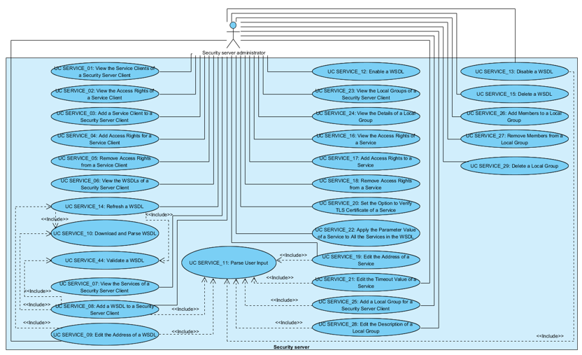
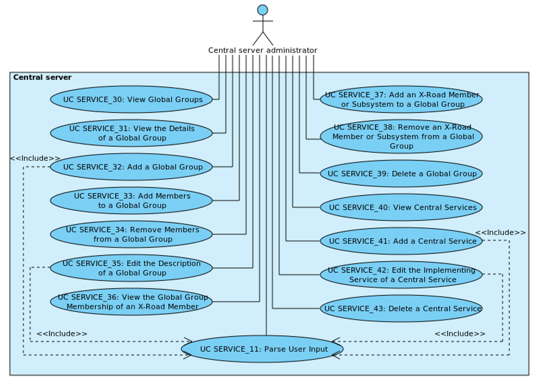

# X-Road: Use Case Model for Service Management
**Analysis**

Version: 1.10  
17.04.2023
<!-- 45 pages -->
  
Doc.ID: UC-SERVICE

------------------------------------------------------------------------------------

## Version history

| Date       | Version | Description                                                                                                           | Author           |
|------------|---------|-----------------------------------------------------------------------------------------------------------------------|------------------|
| 09.06.2015 | 0.1     | Initial version                                                                                                       | Meril Vaht       |
| 21.08.2015 | 0.2     | Updated version                                                                                                       | Meril Vaht       |
| 11.09.2015 | 0.3     | Updated version                                                                                                       | Meril Vaht       |
| 16.09.2015 | 0.4     | Updated version                                                                                                       | Meril Vaht       |
| 17.09.2015 | 0.5     | Comments and editorial changes made                                                                                   | Riin Saarmäe     |
| 17.09.2015 | 0.6     | Comments and editorial changes accepted                                                                               | Meril Vaht       |
| 20.09.2015 | 1.0     | Editorial changes made                                                                                                | Imbi Nõgisto     |
| 27.09.2015 | 1.1     | Use cases for managing an X-Road member's global group membership records added. *Scope* element renamed to *System*. | Riin Saarmäe     |
| 23.10.2015 | 1.2     | User renamed to SS/CS administrator; updated: UC SERVICE\_11, XTE-78, XTE-161.                                        | Meril Vaht       |
| 26.10.2015 | 1.3     | UC SERVICE\_09 updated according to system developments.                                                              | Meril Vaht       |
| 27.10.2015 | 1.4     | Editorial changes made                                                                                                | Meril Vaht       |
| 23.12.2015 | 1.5     | XTE-117 – WSDL validator (UC SERVICE\_08, UC SERVICE\_09, UC SERVICE\_14 updated; UC SERVICE\_44 added)               | Meril Vaht       |
| 29.12.2015 | 1.6     | Editorial changes made                                                                                                | Meril Vaht       |
| 29.08.2017 | 1.7     | Changed documentation type from docx to md file                                                                       | Lasse Matikainen |
| 06.03.2018 | 1.8     | Moved terms to term doc, added term doc reference and link, added internal MD-doc links                               | Tatu Repo        |
| 25.08.2021 | 1.9     | Update X-Road references from version 6 to 7                                                                          | Caro Hautamäki   |
| 17.04.2023 | 1.10    | Remove central services support                                                                                       | Justas Samuolis  |

<!-- toc -->

## Table of Contents

- [1 Introduction](#1-introduction)
  * [1.1 Purpose](#11-purpose)
  * [1.2 Terms and Abbreviations](#12-terms-and-abbreviations)
  * [1.3 References](#13-references)
- [2 Overview](#2-overview)
- [3 Use Case Model](#3-use-case-model)
  * [3.1 Security server](#31-security-server)
    * [3.1.1 Actors](#311-actors)
    * [3.1.2 UC SERVICE\_01: View the Service Clients of a Security Server Client](#312-uc-service_01-view-the-service-clients-of-a-security-server-client)
    * [3.1.3 UC SERVICE\_02: View the Access Rights of a Service Client](#313-uc-service_02-view-the-access-rights-of-a-service-client)
    * [3.1.4 UC SERVICE\_03: Add a Service Client to a Security Server Client](#314-uc-service_03-add-a-service-client-to-a-security-server-client)
    * [3.1.5 UC SERVICE\_04: Add Access Rights for a Service Client](#315-uc-service_04-add-access-rights-for-a-service-client)
    * [3.1.6 UC SERVICE\_05: Remove Access Rights from a Service Client](#316-uc-service_05-remove-access-rights-from-a-service-client)
    * [3.1.7 UC SERVICE\_06: View the WSDLs of a Security Server Client](#317-uc-service_06-view-the-wsdls-of-a-security-server-client)
    * [3.1.8 UC SERVICE\_07: View the Services of a Security Server Client](#318-uc-service_07-view-the-services-of-a-security-server-client)
    * [3.1.9 UC SERVICE\_08: Add a WSDL to a Security Server Client](#319-uc-service_08-add-a-wsdl-to-a-security-server-client)
    * [3.1.10 UC SERVICE\_09: Edit the Address of a WSDL](#3110-uc-service_09-edit-the-address-of-a-wsdl)
    * [3.1.11 UC SERVICE\_10: Download and Parse WSDL](#3111-uc-service_10-download-and-parse-wsdl)
    * [3.1.12 UC SERVICE\_44: Validate a WSDL](#3112-uc-service_44-validate-a-wsdl)
    * [3.1.13 UC SERVICE\_11: Parse User Input](#3113-uc-service_11-parse-user-input)
    * [3.1.14 UC SERVICE\_12: Enable a WSDL](#3114-uc-service_12-enable-a-wsdl)
    * [3.1.15 UC SERVICE\_13: Disable a WSDL](#3115-uc-service_13-disable-a-wsdl)
    * [3.1.16 UC SERVICE\_14: Refresh a WSDL](#3116-uc-service_14-refresh-a-wsdl)
    * [3.1.17 UC SERVICE\_15: Delete a WSDL](#3117-uc-service_15-delete-a-wsdl)
    * [3.1.18 UC SERVICE\_16: View the Access Rights of a Service](#3118-uc-service_16-view-the-access-rights-of-a-service)
    * [3.1.19 UC SERVICE\_17: Add Access Rights to a Service](#3119-uc-service_17-add-access-rights-to-a-service)
    * [3.1.20 UC SERVICE\_18: Remove Access Rights from a Service](#3120-uc-service_18-remove-access-rights-from-a-service)
    * [3.1.21 UC SERVICE\_19: Edit the Address of a Service](#3121-uc-service_19-edit-the-address-of-a-service)
    * [3.1.22 UC SERVICE\_20: Set the Option to Verify TLS Certificate of a Service](#3122-uc-service_20-set-the-option-to-verify-tls-certificate-of-a-service)
    * [3.1.23 UC SERVICE\_21: Edit the Timeout Value of a Service](#3123-uc-service_21-edit-the-timeout-value-of-a-service)
    * [3.1.24 UC SERVICE\_22: Apply the Parameter Value of a Service to All the Services in the WSDL](#3124-uc-service_22-apply-the-parameter-value-of-a-service-to-all-the-services-in-the-wsdl)
    * [3.1.25 UC SERVICE\_23: View the Local Groups of a Security Server Client](#3125-uc-service_23-view-the-local-groups-of-a-security-server-client)
    * [3.1.26 UC SERVICE\_24: View the Details of a Local Group](#3126-uc-service_24-view-the-details-of-a-local-group)
    * [3.1.27 UC SERVICE\_25: Add a Local Group for a Security Server Client](#3127-uc-service_25-add-a-local-group-for-a-security-server-client)
    * [3.1.28 UC SERVICE\_26: Add Members to a Local Group](#3128-uc-service_26-add-members-to-a-local-group)
    * [3.1.29 UC SERVICE\_27: Remove Members from a Local Group](#3129-uc-service_27-remove-members-from-a-local-group)
    * [3.1.30 UC SERVICE\_28: Edit the Description of a Local Group](#3130-uc-service_28-edit-the-description-of-a-local-group)
    * [3.1.31 UC SERVICE\_29: Delete a Local Group](#3131-uc-service_29-delete-a-local-group)
  * [3.2 Central Server](#32-central-server)
    * [3.2.1 Actors](#321-actors)
    * [3.2.2 UC SERVICE\_30: View Global Groups](#322-uc-service_30-view-global-groups)
    * [3.2.3 UC SERVICE\_31: View the Details of a Global Group](#323-uc-service_31-view-the-details-of-a-global-group)
    * [3.2.4 UC SERVICE\_32: Add a Global Group](#324-uc-service_32-add-a-global-group)
    * [3.2.5 UC SERVICE\_33: Add Members to a Global Group](#325-uc-service_33-add-members-to-a-global-group)
    * [3.2.6 UC SERVICE\_34: Remove Members from a Global Group](#326-uc-service_34-remove-members-from-a-global-group)
    * [3.2.7 UC SERVICE\_35: Edit the Description of a Global Group](#327-uc-service_35-edit-the-description-of-a-global-group)
    * [3.2.8 UC SERVICE\_36: View the Global Group Membership of an X-Road Member](#328-uc-service_36-view-the-global-group-membership-of-an-x-road-member)
    * [3.2.9 UC SERVICE\_37: Add an X-Road Member or Subsystem to a Global Group](#329-uc-service_37-add-an-x-road-member-or-subsystem-to-a-global-group)
    * [3.2.10 UC SERVICE\_38: Remove an X-Road Member or Subsystem from a Global Group](#3210-uc-service_38-remove-an-x-road-member-or-subsystem-from-a-global-group)
    * [3.2.11 UC SERVICE\_39: Delete a Global Group](#3211-uc-service_39-delete-a-global-group)

<!-- tocstop -->

## License

This work is licensed under the Creative Commons Attribution-ShareAlike
3.0 Unported License. To view a copy of this license, visit
http://creativecommons.org/licenses/by-sa/3.0/.

## 1 Introduction

### 1.1 Purpose

The purpose of this document is to describe the management of services
and access rights in X-Road security servers and central server,
including:

-   the management of the service clients of a security server client,

-   the management of the services of a security server client,

-   the management of the local groups of a security server client,

-   the management of global groups and

The use cases include verifications that take place, and the main error
conditions that may be encountered during the described process. The
general system errors that may be encountered in most of the use cases
(e.g., database connection errors or out of memory errors) are not
described in this document.

The use cases assume that the X-Road software components involved in the
use cases are installed and initialised (see \[[IG-CS](#Ref_IG-CS)\] and \[[IG-SS](#Ref_IG-SS)\]).

The use cases including a human actor (the level of the use case is user
task) assume, that the actor is logged in to the system and has the
access rights required to carry out the use case.

### 1.2 Terms and Abbreviations

See X-Road terms and abbreviations documentation \[[TA-TERMS](#Ref_TERMS)\].

### 1.3 References

1\. \[IG-CS\] X-Road 7. Central Server Installation
Guide. Document ID: [IG-CS](../Manuals/ig-cs_x-road_6_central_server_installation_guide.md).

2\. \[IG-SS\] X-Road 7. Security Server
Installation Guide. Document ID: [IG-SS](../Manuals/ig-ss_x-road_v6_security_server_installation_guide.md).

3\. \[SPEC-AL\] X-Road:
Audit Log Events. Document ID: SPEC-AL.

4\. \[UG-SYSPAR\] X-Road:
System Parameters. Document ID: [UG-SYSPAR](../Manuals/ug-syspar_x-road_v6_system_parameters.md).

5\. \[TA-TERMS\] X-Road Terms and Abbreviations. Document ID: [TA-TERMS](../terms_x-road_docs.md).

## 2 Overview

There are two possibilities for access rights management in a security
server:

-   access rights management based on service clients – it is possible
    to view, add and remove access rights granted for a local access
    rights group, a global access rights group or a subsystem.

-   access rights management based on services – it is possible to view,
    add and remove access rights granted to a service.

To facilitate the management of service access rights for a group of
X-Road subsystems that use the same services, it is possible to create a
local access rights group in a security server. The access rights
granted for a group apply for all the members of the group.

Similarly, in central server, it is possible to create a global access
rights group for a group of X-Road subsystems that use the same services
(for example local authorities).

A local group can only be used to manage the service access rights of
one security server client in one security server. The global groups can
be used by all the security server clients in all the security servers.

## 3 Use Case Model

### 3.1 Security server

#### 3.1.1 Actors

The X-Road security server service management use case model includes
the following actors:

-   **SS administrator** (security server administrator) – a person
    responsible for managing the security server.

The relationships between the actor, system and use cases are described
in Figure 1.

Figure 1. Use case diagram for service and access rights management in the security server

#### 3.1.2 UC SERVICE\_01: View the Service Clients of a Security Server Client

**System**: Security server

**Level**: User task

**Component**: Security server

**Actors**: SS administrator

**Brief** **Description**: SS administrator views the service clients of
a security server client.

**Preconditions**: -

**Postconditions**: The list of the security server client's service
clients has been displayed to SS administrator.

**Trigger**: SS administrator wants to view the service clients of a
security server client.

**Main** **Success** **Scenario**:

1.  SS administrator selects to view the service clients of a security
    server client.

2.  System displays the list of service clients. For each service
    client, the following information is displayed:

    -   the name of the X-Road member responsible for the subsystem if
        the service client is a subsystem, or the description of the
        group, if the service client is an access rights group;

    -   the X-Road identifier of the service client.

    The SS administrator has a possibility to choose amongst the following actions:

    -   add a service client to the security server client: 3.1.4;
    
    -   view a service client's access rights: 3.1.3.

**Extensions**: -

**Related** **information**: -

#### 3.1.3 UC SERVICE\_02: View the Access Rights of a Service Client

**System**: Security server

**Level**: User task

**Component**: Security server

**Actors**: SS administrator

**Brief** **Description**: SS administrator views the service access
rights of a service client.

**Preconditions**: -

**Postconditions**: The list of service client's access rights has been
displayed to SS administrator.

**Trigger**: SS administrator wants to view a service client's access
rights.

**Main** **Success** **Scenario**:

1.  SS administrator selects to view the access rights of a service
    client.

2.  System displays the list of security server client's services to
    which the service client has access rights for. For each service,
    the following information is displayed:

    -   the code of the service;

    -   the title of the service and

    -   the date of when the access right of this service was granted to
        the service client.

    The SS administrator has a possibility to choose amongst the following actions:

    -   add service access rights for the service client: 3.1.5;
    
    -   remove access rights from the service client: 3.1.6.

**Extensions**: -

**Related** **information**: -

#### 3.1.4 UC SERVICE\_03: Add a Service Client to a Security Server Client

**System**: Security server

**Level**: User task

**Component**: Security server

**Actors**: SS administrator

**Brief** **Description**: SS administrator grants access rights to a
security server client's services for a subject (a local access rights
group, a global access rights group or an X-Road member's subsystem).

**Preconditions**:

-   The subject has been registered in the central server (in case the
    subject is a global access rights group or an X-Road member's
    subsystem) or has been created in the security server (in case the
    subject is a local access rights group).

-   The security server client has one or more services.

-   The subject is not a service client of this security server client.

**Postconditions**:

-   The service client has been added to a security server client and
    access rights have been granted for the service client.

-   An audit log record for the event is created.

**Trigger**: SS administrator wants to grant access rights to a security
server client's services for a subject.

**Main** **Success** **Scenario**:

1.  SS administrator selects to add a service client for a security
    server client.

2.  SS administrator selects the subject and the services to which to
    grant access rights. SS administrator can only add subsystems, local
    groups or global groups as a service client.

3.  System saves the access right records to the system configuration.

4.  System logs the event “Add access rights to subject” to the audit
    log.

**Extensions**: -

**Related** **information**:

-   The audit log is located at /var/log/xroad/audit.log. The data set
    of audit log records is described in the document “X-Road: Audit Log
    Events” \[[SPEC-AL](#Ref_SPEC-AL)\]

#### 3.1.5 UC SERVICE\_04: Add Access Rights for a Service Client

**System**: Security server

**Level**: User task

**Component**: Security server

**Actors**: SS administrator

**Brief** **Description**: SS administrator adds access rights for a
service client.

**Preconditions**: The security server client has one or more services
whose access rights have not been granted for the service client.

**Postconditions**:

-   The access rights to one or more services have been added for the
    service client.

-   An audit log record for the event is created.

**Trigger**: SS administrator wants to add access rights for a service
client.

**Main** **Success** **Scenario**:

1.  SS administrator selects to add access rights for a service client.

2.  SS administrator selects the services to which to grant access
    rights for. SS administrator can only select the services to which
    the service client does not already have access rights for.

3.  System saves the access right records to the system configuration.

4.  System logs the event “Add access rights to subject” to the audit
    log.

**Extensions**: -

**Related** **information**:

-   The audit log is located at /var/log/xroad/audit.log. The data set
    of audit log records is described in the document “X-Road: Audit Log
    Events” \[[SPEC-AL](#Ref_SPEC-AL)\]

#### 3.1.6 UC SERVICE\_05: Remove Access Rights from a Service Client

**System**: Security server

**Level**: User task

**Component**: Security server

**Actors**: SS administrator

**Brief** **Description**: SS administrator removes access rights form a
service client.

**Preconditions**: -

**Postconditions**:

-   Access rights to one or more services have been removed from the
    service client.

-   An audit log record for the event is created.

**Trigger**: SS administrator wants to remove access rights form a
service client.

**Main** **Success** **Scenario**:

1.  SS administrator selects to remove service access rights from a
    service client.

2.  SS administrator selects the services to which to remove the access
    rights.

3.  System deletes the access right records from the system
    configuration.

4.  System logs the event “Remove access rights from subject” to the
    audit log.

**Extensions**: -

**Related** **information**:

-   The audit log is located at /var/log/xroad/audit.log. The data set
    of audit log records is described in the document “X-Road: Audit Log
    Events” \[[SPEC-AL](#Ref_SPEC-AL)\].

#### 3.1.7 UC SERVICE\_06: View the WSDLs and the RESTs of a Security Server Client

**System**: Security server

**Level**: User task

**Component**: Security server

**Actors**: SS administrator

**Brief** **Description**: SS administrator views the list of security
server client's WSDLs and RESTs.

**Preconditions**: -

**Postconditions**: The list of security server client's WSDLs and RESTs has been
displayed to SS administrator.

**Trigger**: SS administrator wants to view the list of security server
client's WSDLs and RESTs.

**Main** **Success** **Scenario**:

1.  SS administrator selects to view the list of security server
    client's WSDLs and RESTs.

2.  System displays the list of WSDLs and RESTs. For each WSDL and RESTs, the following
    information is displayed:

    -   the URL of the WSDL or REST;

    -   the date of when the WSDL or REST was last refreshed;

    -   the status of the WSDL or REST– the inactive items are marked as
        “disabled”.

    The SS administrator has a possibility to choose amongst the following actions:

    -   view the services of the security server client: 3.1.8;
    
    -   add a WSDL or REST to the security server client: 3.1.9;
    
    -   edit the address of a WSDL or REST: 3.1.10;
    
    -   enable a WSDL or a REST: 3.1.14;
    
    -   disable a WSDL or a REST: 3.1.15;
    
    -   refresh a WSDL or a REST: 3.1.16;
    
    -   delete a WSDL or a REST: 3.1.17.

**Extensions**: -

**Related** **information**: -

#### 3.1.8 UC SERVICE\_07: View the Services of a Security Server Client

**System**: Security server

**Level**: User task

**Component**: Security server

**Actors**: SS administrator

**Brief** **Description**: SS administrator views the list of a security
server client's services.

**Preconditions**: -

**Postconditions**: The list of a security server client's services has
been displayed to SS administrator.

**Trigger**: SS administrator wants to view the list of a security
server client's services.

**Main** **Success** **Scenario**:

1.  SS administrator selects to view the list of a security server
    client's services.

2.  System displays the list of services. For each service, the
    following information is displayed:

    -   the code and the version of the service (formatted as
        'code.version');

    -   the number of subjects that have access rights to the service;

    -   the title of the service;

    -   the URL of the service;

    -   the connection type for accessing the service (http, https or
        https with no authentication);

    -   the service timeout value in seconds;

    -   the date of when the WSDL containing the description of the
        service was last refreshed.

    The SS administrator has a possibility to choose amongst the following actions:

    -   view the access rights of a service: 3.1.18;
    
    -   edit the timeout value of a service: 3.1.23;
    
    -   edit the address of a service: 3.1.21;
    
    -   set the option to verify internal TLS certificate 3.1.22;
    
    -   apply the parameter value of one service to all the services in the
        WSDL or REST: 3.1.24.

**Extensions**: -

**Related** **information**: -

#### 3.1.9 UC SERVICE\_08: Add a WSDL or REST to a Security Server Client

**System**: Security server

**Level**: User task

**Component**: Security server

**Actors**: SS administrator

**Brief** **Description**: SS administrator adds a WSDL or a REST to a security
server client (a WSDL or a REST can only be added to a subsystem). System gets
service descriptions from the WSDL or the REST.

**Preconditions**: -

**Postconditions**: -

**Trigger**: SS administrator wants to add WSDL or REST for a security server
client.

**Main** **Success** **Scenario**:

1.  SS administrator selects to add a WSDL or a REST.

2.  SS administrator inserts the URL of the WSDL or REST.

3.  System parses the user input: 3.1.13.

4.  System verifies that the inserted URL does not already exist in the
    list of WSDL or REST URLs saved in the system configuration for this client.

5.  System downloads the WSDL or REST file from the URL and reads service
    information from the downloaded file: 3.1.11.

6.  System verifies that the location of a WSDL or a REST validation program is
    described by the system parameter *wsdl-validator-command* or *rest-validator-command* and
    validates the WSDL or REST file using the validator: 3.1.12.

7.  System verifies that none of the services saved for this security
    server client in the system configuration have the same service code
    and service version value combination as any of the services read
    from the downloaded WSDL or REST file.

8.  System saves the WSDL or REST URL and sets the state of the WSDL or REST to
    “disabled” with the default disable message: “Out of order”.

9.  System saves the services read from the WSDL or REST file and sets the
    following default values for each of the services:

    -   service timeout value is set to 60 seconds;

    -   if the protocol part of the URL of the service is “https” then
        the value for TLS certification verification is set to “true”.

10. System logs the event “Add service description" to the audit log.

**Extensions**:

- 3a. The process of parsing the user input terminated with an error message.
    - 3a.1. System displays the error message “X” (where “X” is the termination message from the parsing process).
    - 3a.2. System logs the event “service description failed” to the audit log.
    - 3a.3. SS administrator selects to reinsert the URL of the WSDL or REST. Use case continues from step 3.
        - 3a.3a. SS administrator selects to terminate the use case.

- 4a. The inserted URL already exists.
    - 4a.1. System displays the error message “Failed to add WSDL: WSDL address already exists.” or “Failed to add REST: REST address already exists.”.
    - 4a.2. System logs the event “Add service description failed” to the audit log.
    - 4a.3. SS administrator selects to reinsert the URL of the WSDL or REST. Use case continues from step 3.
        - 4a.3a. SS administrator selects to terminate the use case.

- 5a. The process of downloading and parsing the WSDL or REST file terminated with an error message.
    - 5a.1. System displays the error message “Failed to add WSDL (or REST): X” (where “X” is the termination message from the downloading and parsing process).
    - 5a.2. System logs the event “Add service description failed” to the audit log.
    - 5a.3. SS administrator selects to reinsert the URL of the WSDL or REST. Use case continues from step 3.
        - 5a.3a. SS administrator selects to terminate the use case.

- 6a. The location of the WSDL or REST validator is not set.
    - 6a.1. System skips the process of validation.
    - 6a.2. Use case continues from step 7.

- 6b. The process of validating the WSDL or REST file was terminated with an error message.
    - 6b.1. System displays the WSDL or REST validator output describing the reason of the failure, and the error message from the validation process.
    - 6b.2. System logs the event “Add service description failed” to the audit log.
    - 6b.3. SS administrator selects to reinsert the URL of the WSDL or REST. Use case continues from step 3.
        - 6b.3a. SS administrator selects to terminate the use case.

- 6c. The process of validating the WSDL or REST file was finished with a warning message.
    - 6c.1. System prompts the warning message from the validation process. “WSDL ('X') validation gave the following warnings: 'Y'. Do you want to continue? (where “X” is the URL of the WSDL or REST and “Y” is the message from the validation process).
    - 6b.2. System logs the event “Add service description failed” to the audit log.
    - 6c.3. SS administrator chooses to continue with adding the WSDL or REST. Use case continues from step 7.
        - 6c.2a. SS administrator selects to terminate the use case.

- 6d. The address of the WSDL or REST validator program is incorrect and system was not able to run the validation program.
    - 6d.1. System displays the error message “Running WSDL (or REST) validator failed. Command not found.”.
    - 6d.2. System logs the event “Add service description failed” to the audit log.
    - 6b.3. SS administrator selects to reinsert the URL of the WSDL or REST. Use case continues from step 3.
        - 6b.3a. SS administrator selects to terminate the use case.

- 6e. The address of the WSDL or REST validator refers to non-executable file and system was not able to run the validation program.
    - 6e.1. System displays the error message “Running WSDL (or REST) validator failed. Command not executable.”.
    - 6e.2. System logs the event “Add service description failed” to the audit log.
    - 6b.3. SS administrator selects to reinsert the URL of the WSDL or REST. Use case continues from step 3.
        - 6b.3a. SS administrator selects to terminate the use case.

- 7a. A service with the same service code and version values as a service read from the WSDL or REST file was found for this client in the system configuration.
    - 7a.1. System displays the error message "Failed to add WSDL (or REST): Duplicate service. Service 'X' already exists in WSDL or REST 'Y'" (where “X” is the code.version of the service and “Y” is the URL of the existing WSDL where the duplicate service was found).
    - 7a.2. System logs the event “Add service description failed” to the audit log.
    - 7a.3. SS administrator selects to reinsert the URL of the WSDL OE REST. Use case continues from step 3.
        - 7a.3a. SS administrator selects to terminate the use case.

**Related** **information**:

-   The audit log is located at /var/log/xroad/audit.log. The data set
    of audit log records is described in the document “X-Road: Audit Log
    Events” \[[SPEC-AL](#Ref_SPEC-AL)\].

-   The system parameters are described in document “X-Road: System
    Parameters” \[[UG-SYSPAR](#Ref_UG-SYSPAR)\].

#### 3.1.10 UC SERVICE\_09: Edit the Address of a WSDL or REST

**System**: Security server

**Level**: User task

**Component**: Security server

**Actors**: SS administrator

**Brief** **Description**: SS administrator changes the URL of a WSDL or REST.

**Preconditions**: -

**Postconditions**: -

**Trigger**: SS administrator wants to change the URL of a WSDL or REST.

**Main** **Success** **Scenario**:

1.  SS administrator selects to edit the URL of a WSDL or REST.

2.  SS administrator inserts the new URL of the WSDL or REST.

3.  System parses the user input: 3.1.13.

4.  System verifies that the inserted URL does not already exist in the
    list of WSDL or REST URLs saved in the system configuration for this client.

5.  System refreshes the WSDL or REST: steps 2-6 of 3.1.16.

6.  System logs the event “Edit service description” to the audit log.

**Extensions**:

- 3a. The process of parsing the user input terminated with an error message.
    - 3a.1. System displays the error message “X” (where “X” is the termination message from the parsing process).
    - 3a.2. System logs the event “Edit service description failed” to the audit log.
    - 3a.3. SS administrator selects to reinsert the URL of the WSDL or REST. Use case continues from step 3.
    - 3a.3a. SS administrator selects to terminate the use case.

- 4a. The inserted URL already exists.
    - 4a.1. System displays the error message “Failed to edit WSDL (or REST): WSDL (or REST) address already exists.”.
    - 4a.2. System logs the event “Edit service description failed” to the audit log.
    - 4a.3. SS administrator selects to reinsert the URL of the WSDL or REST. Use case continues from step 3.
        - 4a.3a. SS administrator selects to terminate the use case.

- 5a. The process of refreshing the WSDL or REST file terminated with an error message.
    - 5a.1. System displays the error message “Failed to edit WSDL (or REST): 'X'” (where “X” is the termination message from the refreshing process).
    - 5a.2. System logs the event “Edit service description failed” to the audit log.
    - 5a.3. SS administrator selects to reinsert the URL of the WSDL or REST. Use case continues from step 3.
        - 5a.3a. SS administrator selects to terminate the use case.

**Related** **information**:

-   The audit log is located at /var/log/xroad/audit.log. The data set
    of audit log records is described in the document “X-Road: Audit Log
    Events” \[[SPEC-AL](#Ref_SPEC-AL)\].

#### 3.1.11 UC SERVICE\_10: Download and Parse WSDL or REST

**System**: Security server

**Level**: Subfunction

**Component**: Security server

**Actors**: -

**Brief** **Description**: The system downloads the WSDL or REST file from the
given URL and reads the service descriptions from the WSDL or REST file.

**Preconditions**: -

**Postconditions**: -

**Trigger**:

-   Step 5 of 3.1.9.

-   Step 2 of 3.1.16.

**Main** **Success** **Scenario**:

1.  System verifies that the URL is well-formed.

2.  System verifies that the URL points to a valid XML or JSON file and
    downloads the file.

3.  System verifies that the downloaded file is a valid WSDL or REST file.

4.  System parses the WSDL or REST file for service descriptions. The following
    information is read for each service that has a port element with
    SOAP over HTTP binding described:

    -   service URL is read from the
        /definitions/service/port/address/@location attribute;

    -   service code is read from the
        /definitions/binding/operation/@name attribute;

    -   service version is read from the
        /definitions/binding/operation/xrd:version element;

    -   service title is read from the
        /definitions/portType/operation/documentation/xrd:title element.

**Extensions**:

- 1a. The URL is malformed.
    - 1a.1. Use case terminates with the error message “Malformed URL (or REST). WSDL (or REST) URL must point to a WSDL (or REST) file.”.

- 2a. Downloading of the WSDL or REST file failed.
    - 2a.1. Use case terminates with the error message “Downloading WSDL failed. WSDL or REST URL must point to a WSDL or REST file.”.

- 2b. The URL points to data that is not a valid XML or JSON file.
    - 2b.1. Use case terminates with the error message “Incorrect file structure. WSDL (or REST) URL must point to a WSDL (or REST) file.”.

- 3a. The validation of the WSDL or REST failed.
    - 3a.1. Use case terminates with an error message describing the validation exception.

**Related** **information**: -

#### 3.1.12 UC SERVICE\_44: Validate a WSDL or REST

**System**: Security server

**Level**: Subfunction

**Component**: Security server

**Actors**: -

**Brief** **Description**: The system uses a WSDL or REST validation program to
validate a WSDL or REST file. The location of the validation program is
described by the system parameter *wsdl-validator-command* *rest-validator-command*.

**Preconditions**: -

**Postconditions**: -

**Trigger**:

-   Step 6 of 3.1.9.

-   Step 3 of 3.1.16.

**Main** **Success** **Scenario**:

1.  System runs the validation program and verifies that the validation
    did not return any errors or warnings.

**Extensions**:

- 1a. Validation errors were detected by WSDL or REST validation program while validating the WSDL file.
    - 1a.1. Use case terminates with an error message “WSDL (or REST)('X') validation failed” and displays the WSDL or REST  validator output „Y” (where 'X' is the URL of the WSDL and 'Y' is the reason of the failure).

- 1b. Warnings were detected by WSDL or REST validation program while validating the WSDL or REST file.
    - 1b.1. Use case terminates with a warning message “'X'” (where 'X' is the warning message).

- 1c. The validation program crashed while validating the WSDL or REST file.
    - 1c.1. Use case terminates with an error message “WSDL (or REST) ('X') validation failed” and displays the WSDL or REST validator output „Y” (where 'X' is the URL of the WSDL or REST and 'Y' is the reason of the failure).

**Related** **information**: -

#### 3.1.13 UC SERVICE\_11: Parse User Input

**System**: Security server, central server

**Level**: Subfunction

**Component**: Security server, central server

**Actors**: -

**Brief** **Description**: System parses the user input and verifies
that the input is well formatted.

**Preconditions**: -

**Postconditions**: -

**Trigger**:

-   Step 3 of 3.1.9.

-   Step 3 of 3.1.10.

-   Step 4 of 3.1.15.

-   Step 3 of 3.1.21.

-   Step 3 of 3.1.23.

-   Step 3 of 3.1.27.

-   Step 3 of 3.1.30.

-   Step 3 of 3.2.4.

-   Step 3 of 3.2.7.

-   Step 3 of 3.2.13.

-   Step 3 of 3.2.14.

**Main** **Success** **Scenario**:

1.  System removes leading and trailing whitespaces.

2.  System verifies that mandatory fields are filled.

3.  System verifies that the user input does not exceed 255 characters.

**Extensions**:

- 2a. One or more mandatory fields are not filled.
    - 2a.1. Use case terminates with the error message “Missing parameter: 'X'” (where “X” is the name of the missing parameter).

- 3a. The user input exceeds 255 characters.
    - 3a.1. Use case terminates with the error message "Parameter 'X' input exceeds 255 characters" (where “X” is the name of the parameter).

**Related** **information**: -

#### 3.1.14 UC SERVICE\_12: Enable a WSDL or REST

**System**: Security server

**Level**: User task

**Component**: Security server

**Actors**: SS administrator

**Brief** **Description**: SS administrator enables a WSDL or REST. The services
included in the WSDL or REST will be available for the service clients.

**Preconditions**: The WSDL or REST is disabled.

**Postconditions**:

-   The WSDL or REST has been enabled.

-   An audit log record for the event is created.

**Trigger**: SS administrator wants make the services described in a
WSDL available for the service clients.

**Main** **Success** **Scenario**:

1.  SS administrator selects to enable a WSDL or REST.

2.  System activates the WSDL or REST.

3.  System logs the event “Enable service description” to the audit log.

**Extensions**: -

**Related** **information**:

-   The audit log is located at /var/log/xroad/audit.log. The data set
    of audit log records is described in the document “X-Road: Audit Log
    Events \[[SPEC-AL](#Ref_SPEC-AL)\].

#### 3.1.15 UC SERVICE\_13: Disable a WSDL or REST

**System**: Security server

**Level**: User task

**Component**: Security server

**Actors**: SS administrator

**Brief** **Description**: SS administrator disables a WSDL or REST. The
services included in the WSDL or REST will not be available for service clients.
Clients who request to use these services will get the notice message
inserted by SS administrator as a response.

**Preconditions**: The WSDL or REST is not disabled.

**Postconditions**: -

**Trigger**: SS administrator wants make the services described in the
WSDL unavailable for the service clients.

**Main** **Success** **Scenario**:

1.  SS administrator selects to disable a WSDL or REST.

2.  System asks for notice message that will be sent as a response to
    service clients trying to access services described in the WSDL or REST.

3.  SS administrator inserts the message.

4.  System parses user input: 3.1.13.

5.  System disables the services described in the WSDL or REST. Service clients
    trying to access the disabled services will get the following error
    message as response: “Service X is disabled: Y”, where “X” is the
    X-Road identifier of the service and “Y” is the inserted notice
    message.

6.  System logs the event “Disable service description” to the audit log.

**Extensions**:

- 3a. SS administrator terminates the use case.

- 4a. The process of parsing the user input terminated with an error message.
    - 4a.1. System displays the error message “X” (where “X” is the termination message from the parsing process).
    - 4a.2. System logs the event “Disable service description failed” to the audit log.
    - 4a.3. SS administrator selects to reinsert the message. Use case continues from step 4.
        - 4a.3a. SS administrator selects to terminate the use case.

**Related** **information**:

-   The audit log is located at /var/log/xroad/audit.log. The data set
    of audit log records is described in the document “X-Road: Audit Log
    Events” \[[SPEC-AL](#Ref_SPEC-AL)\].

#### 3.1.16 UC SERVICE\_14: Refresh a WSDL or REST

**System**: Security server

**Level**: User task

**Component**: Security server

**Actors**: SS administrator

**Brief** **Description**: SS administrator refreshes a WSDL or REST. System
reloads the WSDL file from the WSDL or REST address.

**Preconditions**: -

**Postconditions**: -

**Trigger**:

-   SS administrator wants to refresh a WSDL or REST.

-   Step 5 of 3.1.10.

**Main** **Success** **Scenario**:

1.  SS administrator selects to refresh the WSDL or REST.

2.  System downloads the WSDL file from the WSDL or REST URL and reads service
    information from the downloaded file: 3.1.11.

3.  System verifies that the location of a WSDL or REST validation program is
    described by the system parameter *wsdl-validator-command* or *rest-validator-command* and
    validates the WSDL or REST file using the validator: 3.1.12.

4.  System verifies that none of the services described for this
    security server client in other WSDLs or RESTs than the one being refreshed
    have the same service code and service version value combination as
    any of the services read from the downloaded WSDL or REST file.

5.  System verifies that the composition of the services in the
    downloaded WSDL or REST does not differ from the current version.

6.  System updates the list of services saved in the system
    configuration for this WSDL or REST.

7.  System logs the event “Refresh service description” to the audit log.

**Extensions**:

- 2a. The process of downloading and parsing the WSDL or REST file terminated with an error message.
    - 2a.1. System displays the error message “X” (where “X” is the termination message from the downloading and parsing process).
    - 2a.2. System logs the event “Refresh service description failed” to the audit log.
        - 2a.2a. The process of refreshing the WSDL or REST was triggered from the use case 3.1.10. Use case terminates.
    - 2a.3. Use case terminates.

- 3a. The location of the WSDL or REST validator is not set.
    - 3a.1. System skips the process of validation.
    - 3a.2. Use case continues from step 4.

- 3b. The process of validating the WSDL or REST file was terminated with an error message.
    - 3b.1. System displays WSDL or REST validator output describing the reason of the failure, and the error message from the validation process.
    - 3b.2. System logs the event “Refresh service description failed” to the audit log.
        - 3b.2a. The process of refreshing the WSDL or REST was triggered from the use case 3.1.10 . Use case terminates.
    - 3b.3. Use case terminates.

- 3c. The process of validating the WSDL or REST file was finished with a warning message.
    - 3c.1. System prompts the warning message “WSDL (or REST) ('X') validation gave the following warnings: 'Y'. Do you want to continue?” (where “X” is the URL of the WSDL or REST and “Y” is the message from the validation process).
    - 3c.2. SS administrator chooses to continue with the refreshing process. Use case continues from step 4.
        - 3c.2a. SS administrator selects to terminate the use case.

- 3d. The address of the WSDL or REST validator program is incorrect and system was not able to run the validation program.
    - 3d.1. System displays the error message “Running WSDL (or REST) validator failed. Command not found.”.
    - 3d.2. System logs the event “Refresh service description failed” to the audit log.
        - 3d.2a. The process of refreshing the WSDL or REST was triggered from the use case 3.1.10. Use case terminates.
    - 3d.3. Use case terminates.

- 3e. The address of the WSDL or REST validator refers to non-executable file and system was not able to run the validation program.
    - 3e.1. System displays the error message “Running WSDL (or REST) validator failed. Command not executable.”.
    - 3e.2. System logs the event “Refresh service description failed” to the audit log.
        - 3e.2a. The process of refreshing the WSDL or REST was triggered from the use case 3.1.10 . Use case terminates.
    - 3e.3. Use case terminates.

- 4a. A service with the same service code and version values as a service read from the WSDL or REST file is described in another WSDL or REST of the service client.
    - 4a.1. System displays the error message “Duplicate service. Service 'X' already exists in WSDL or REST 'Y'” (where “X” is the code.version of the service and “Y” is the URL of the existing WSDL or REST where the duplicate service was found).
    - 4a.2. System logs the event “Refresh service description failed” to the audit log.
        - 4a.2a. The process of refreshing the WSDL or REST was triggered from the use case 3.1.10. Use case terminates.
    - 4a.3. Use case terminates.

- 5a. The composition of the services in the downloaded WSDL or REST differ from the current version.
    - 5a.1. System prompts the warning “Adding services: 'X' Deleting services: 'Y'” (where “X” and “Y” is the list of the service codes that have been added to or removed from the WSDL or REST) and asks for confirmation to continue.
    - 5a.2. System logs the event “Adding service description failed” to the audit log.
    - 5a.3. SS administrator selects to continue with the refreshing process. Use case continues from step 6.
        - 5a.3a. SS administrator selects to terminate the use case.

**Related** **information**:

-   The audit log is located at /var/log/xroad/audit.log. The data set
    of audit log records is described in the document “X-Road: Audit Log
    Events” \[[SPEC-AL](#Ref_SPEC-AL)\].

-   The system parameters are described in document “X-Road: System
    Parameters” \[[UG-SYSPAR](#Ref_UG-SYSPAR)\].

#### 3.1.17 UC SERVICE\_15: Delete a WSDL or REST

**System**: Security server

**Level**: User task

**Component**: Security server

**Actors**: SS administrator

**Brief** **Description**: SS administrator deletes a security server
client's WSDL or REST.

**Preconditions**: -

**Postconditions**: -

**Trigger**: SS administrator wants to delete a WSDL from the security
server client's list of WSDLs or RESTs.

**Main** **Success** **Scenario**:

1.  SS administrator selects to delete a WSDL or REST.

2.  System prompts for confirmation.

3.  SS administrator confirms.

4.  System deletes all information about the WSDL or REST, the services
    described in the WSDL or REST, and the access right records for the services
    described in the WSDL or REST from the system configuration.

5.  System logs the event “Delete service description” to the audit log.

**Extensions**:

- 3a. SS administrator terminates the use case.

**Related** **information**:

-   The audit log is located at /var/log/xroad/audit.log. The data set
    of audit log records is described in the document “X-Road: Audit Log
    Events” \[[SPEC-AL](#Ref_SPEC-AL)\].

#### 3.1.18 UC SERVICE\_16: View the Access Rights of a Service

**System**: Security server

**Level**: User task

**Component**: Security server

**Actors**: SS administrator

**Brief** **Description**: SS administrator views the access rights of a
security server client's service.

**Preconditions**: -

**Postconditions**: The access rights of the security server client's
service have been displayed to SS administrator.

**Trigger**: SS administrator wants to view the access rights of a
security server client's service.

**Main** **Success** **Scenario**:

1.  SS administrator selects to view the access rights of a security
    server client's service.

2.  System displays the list of service clients that have been given
    access rights to the service. For each service client, the following
    information is displayed:

    -   the name of the X-Road member responsible for the subsystem if
        the service client is a subsystem, or the description of the
        group, if the service client is an access rights group;

    -   the X-Road identifier of the service client;

    -   the date of when the access right to the service was granted.

    The SS administrator has a possibility to choose amongst the following actions:

    -   add access rights to the service: 3.1.19;
    
    -   remove subjects from the access rights list of the service: 3.1.20.

**Extensions**: -

**Related** **information**: -

#### 3.1.19 UC SERVICE\_17: Add Access Rights to a Service

**System**: Security server

**Level**: User task

**Component**: Security server

**Actors**: SS administrator

**Brief** **Description**: SS administrator changes the access rights to
a security server client's service by adding subjects to the access
rights list. Only X-Road member's subsystems, local groups or global
groups can be added to the access rights list.

**Preconditions**: The subjects are not in the access rights list of
this service.

**Postconditions**:

-   The subjects have been added to the access rights list of the
    security server client's service.

-   An audit log record for the event is created.

**Trigger**: SS administrator wants to change access rights for a
security server client's service.

**Main** **Success** **Scenario**:

1.  SS administrator selects to add subjects to the access rights list
    of a service.

2.  SS administrator selects the subjects to add to the access rights
    list. Only an X-Road member's subsystem, a local group or a global
    group can be added to the access rights list.

3.  System saves the access right records to the system configuration.

4.  System logs the event “Add access rights to service” to the audit
    log.

**Extensions**: -

**Related** **information**:

-   The audit log is located at /var/log/xroad/audit.log. The data set
    of audit log records is described in the document “X-Road: Audit Log
    Events” \[[SPEC-AL](#Ref_SPEC-AL)\].

### 3.1.20 UC SERVICE\_18: Remove Access Rights from a Service

**System**: Security server

**Level**: User task

**Component**: Security server

**Actors**: SS administrator

**Brief** **Description**: SS administrator removes subjects from the
access rights list of a service.

**Preconditions**: -

**Postconditions**:

-   One or more subjects have been removed from the access rights list
    of the service.

-   An audit log record for the event is created.

**Trigger**: SS administrator wants to remove subjects from the access
rights list of a service.

**Main** **Success** **Scenario**:

1.  SS administrator selects to remove subjects from the access rights
    list of a service.

2.  SS administrator selects the subjects to be removed.

3.  System deletes the access right records from the system
    configuration.

4.  System logs the event “Remove access rights from service” to the
    audit log.

**Extensions**: -

**Related** **information**:

-   The audit log is located at /var/log/xroad/audit.log. The data set
    of audit log records is described in the document “X-Road: Audit Log
    Events” \[[SPEC-AL](#Ref_SPEC-AL)\].

#### 3.1.21 UC SERVICE\_19: Edit the Address of a Service

**System**: Security server

**Level**: User task

**Component**: Security server

**Actors**: SS administrator

**Brief** **Description**: SS administrator changes the address of a
service.

**Preconditions**: -

**Postconditions**: An audit log record for the event is created.

**Trigger**: SS administrator wants to change the address of a service.

**Main** **Success** **Scenario**:

1.  SS administrator selects to edit the address of a service.

2.  SS administrator inserts the address.

3.  System parses the user input: 3.1.13.

4.  System verifies that the inserted URL is valid.

5.  System verifies that the protocol part of the URL of the service is
    “https” and sets the value for TLS certification verification to
    “true”.

6.  System saves the service address to the system configuration.

7.  System logs the event “Edit service parameters” to the audit log.

**Extensions**:

- 3a. The process of parsing the user input terminated with an error message.
    - 3a.1. System displays the termination message from the parsing process.
    - 3a.2. System logs the event “Edit service parameters failed” to the audit log.
    - 3a.3. SS administrator selects to reinsert the URL. Use case continues from step 3.
    - 3a.3a. SS administrator selects to terminate the use case.

- 4a. SS administrator inserted an invalid URL.
    - 4a.1. System displays the error message “Invalid URL format, must begin with 'http' or 'https'”.
    - 4a.2. System logs the event “Edit service parameters failed” to the audit log.
    - 4a.3. SS administrator selects to reinsert the URL. Use case continues from step 3.
        - 4a.3a. SS administrator selects to terminate the use case.

- 5a. The protocol part of the URL is “http”.
    - 5a.1. Use case continues from step 6.

**Related** **information**:

-   The audit log is located at /var/log/xroad/audit.log. The data set
    of audit log records is described in the document “X-Road: Audit Log
    Events” \[[SPEC-AL](#Ref_SPEC-AL)\].

#### 3.1.22 UC SERVICE\_20: Set the Option to Verify TLS Certificate of a Service

**System**: Security server

**Level**: User task

**Component**: Security server

**Actors**: SS administrator

**Brief** **Description**: SS administrator changes the TLS certificate
verification option of a service.

**Preconditions**: The protocol part of the service address is “https”.

**Postconditions**:

-   The SS administrator has changed the TLS certificate verification
    option.

-   An audit log record for the event is created.

**Trigger**: SS administrator wants to change the TLS certificate
verification option.

**Main** **Success** **Scenario**:

1.  SS administrator selects to change the TLS certificate verification
    option of a service.

2.  System saves the change.

3.  System logs the event “Edit service parameters” to the audit log.

**Extensions**: -

**Related** **information**:

-   If the option to verify the TLS certificate is set to “true”, the
    system will verify that the certificate that the client information
    system presented when setting up the TLS connection is previously
    saved in the system for the security server client providing the
    service.

-   The audit log is located at /var/log/xroad/audit.log. The data set
    of audit log records is described in the document “X-Road: Audit Log
    Events” \[[SPEC-AL](#Ref_SPEC-AL)\].

#### 3.1.23 UC SERVICE\_21: Edit the Timeout Value of a Service

**System**: Security server

**Level**: User task

**Component**: Security server

**Actors**: SS administrator

**Brief** **Description**: SS administrator changes the service timeout
value.

**Preconditions**: -

**Postconditions**: -

**Trigger**: SS administrator wants to change the service timeout value.

**Main** **Success** **Scenario**:

1.  SS administrator selects to edit the timeout value of a service.

2.  SS administrator inserts the timeout value.

3.  System parses the user input: 3.1.13.

4.  System verifies that the inserted value is in valid format.

5.  System saves the inserted service timeout value to the system
    configuration.

6.  System logs the event “Edit service parameters” to the audit log.

**Extensions**:

- 3a. The process of parsing the user input terminated with an error message.
    - 3a.1. System displays the termination message from the parsing process.
    - 3a.2. System logs the event “Edit service parameters failed” to the audit log.
    - 3a.3. SS administrator selects to reinsert the timeout value. Use case continues from step 3.
        - 3a.3a. SS administrator selects to terminate the use case.

- 4a. The inserted timeout value is 0.
    - 4a.1. System displays a warning message “A timeout value of zero is interpreted as an infinite timeout.” and asks for confirmation for continuing.
    - 4a.2. SS administrator selects to reinsert the timeout value. Use case continues from step 3.
        - 4a.2a. SS administrator selects to terminate the use case.
        - 4a.2b. SS administrator chooses to continue.
            - 4a.2b.1. Use case continues from step 5.

- 4b. The inserted timeout value is not a positive integer.
    - 4b.1. System displays the error message “Timeout value must be a positive integer.”
    - 4b.2. System logs the event “Edit service parameters failed” to the audit log.
    - 4a.3. SS administrator selects to reinsert the timeout value. Use case continues from step 3.
        - 4a.3a. SS administrator selects to terminate the use case.

**Related** **information**:

-   The audit log is located at /var/log/xroad/audit.log. The data set
    of audit log records is described in the document “X-Road: Audit Log
    Events” \[[SPEC-AL](#Ref_SPEC-AL)\].

#### 3.1.24 UC SERVICE\_22: Apply the Parameter Value of a Service to All the Services in the WSDL or REST

**System**: Security server

**Level**: User task

**Component**: Security server

**Actors**: SS administrator

**Brief** **Description**: SS administrator applies the value of a
service parameter (address, timeout, TLS certificate verification) of
one service to all the services in the WSDL or REST where the service is
described.

**Preconditions**: -

**Postconditions**:

-   The value of a service parameter is identical for all the services
    in a WSDL or REST. The TLS certificate verification option is changed only
    for the services where the protocol part of the service address is
    “https”.

-   An audit log record for the event is created.

**Trigger**: SS administrator wants to apply the parameter value of one
service to all the services in the WSDL or REST where the service is described.

**Main** **Success** **Scenario**:

1.  SS administrator selects to apply a service parameter value to all
    the services in the WSDL or REST.

2.  System saves the parameter value for every service described in the
    same WSDL or REST.

3.  System logs the event “Edit service parameters” to the audit log.

**Extensions**: -

**Related** **information**:

-   The audit log is located at /var/log/xroad/audit.log. The data set
    of audit log records is described in the document “X-Road: Audit Log
    Events” \[[SPEC-AL](#Ref_SPEC-AL)\].

#### 3.1.25 UC SERVICE\_23: View the Local Groups of a Security Server Client

**System**: Security server

**Level**: User task

**Component**: Security server

**Actors**: SS administrator

**Brief** **Description**: SS administrator views the list of local
groups of a security server client.

**Preconditions**: -

**Postconditions**: The list of local groups of a security server client
has been displayed to SS administrator.

**Trigger**: SS administrator wants to view the local groups of a
security server client.

**Main** **Success** **Scenario**:

1.  SS administrator selects to view the local groups of a security
    server client.

2.  System displays the list of local groups. For each local group, the
    following information is displayed:

    -   the code of the local group;

    -   the description of the local group;

    -   the number of members in the local group;

    -   the date of when the local group was last updated.

    The SS administrator has a possibility to choose amongst the following actions:

    -   view the members of a local group: 3.1.26;
    
    -   add a local group for the security server client: 3.1.27.

**Extensions**: -

**Related** **information**: -

#### 3.1.26 UC SERVICE\_24: View the Details of a Local Group

**System**: Security server

**Level**: User task

**Component**: Security server

**Actors**: SS administrator

**Brief** **Description**: SS administrator views the details of a local
group.

**Preconditions**: -

**Postconditions**: The details of the local group have been displayed
to SS administrator.

**Trigger**: SS administrator wants to view the details of a local
group.

**Main** **Success** **Scenario**:

1.  SS administrator selects to view the details of a local group.

2.  System displays the details of the local group, including the
    description of the group, the number of group members and the list
    of group members (X‑Road members' subsystems) of the local group.
    For each member, the following information is displayed:

    -   the name of the group member;

    -   the X-Road identifier of the group member;

    -   the date of when the member was added to the local group.

    The SS administrator has a possibility to choose amongst the followingactions:

    -   add group members to the local group: 3.1.28;
    
    -   remove group members from the local group: 3.1.29;
    
    -   edit the description of the local group: 3.1.30;
    
    -   delete the local group: 3.1.31.

**Extensions**: -

**Related** **information**: -

#### 3.1.27 UC SERVICE\_25: Add a Local Group for a Security Server Client

**System**: Security server

**Level**: User task

**Component**: Security server

**Actors**: SS administrator

**Brief** **Description**: SS administrator adds a local group to a
security server client.

**Preconditions**: -

**Postconditions**: An audit log record for the event is created.

**Trigger**: SS administrator wants to add a local group to a security
server client.

**Main** **Success** **Scenario**:

1.  SS administrator selects to add a local group to a security server
    client.

2.  SS administrator inserts the code and description for the local
    group.

3.  System parses the user input: 3.1.13.

4.  System verifies that a local group with the inserted code does not
    already exist for this security server client in the system
    configuration.

5.  System saves the information about the local group to the system
    configuration.

6.  System logs the event “Add group” to the audit log.

**Extensions**:

- 3a. The process of parsing the user input terminated with an error message.
    - 3a.1. System displays the termination message of the parsing process.
    - 3a.2. System logs the event “Add group failed” to the audit log.
    - 3a.3. SS administrator selects to reinsert the group information. Use case continues from step 3.
        - 3a.3a. SS administrator selects to terminate the use case.

- 4a. SS administrator inserted a group code that already exists.
    - 4a.1. System displays the error message “A group with code 'X' already exists” (where “X” is the group code).
    - 4a.2. System logs the event “Add group failed” to the audit log.
    - 4a.3. SS administrator selects to reinsert the group code. Use case continues from step 3.
        - 4a.3a. SS administrator selects to terminate the use case.

**Related** **information**:

-   The audit log is located at /var/log/xroad/audit.log. The data set
    of audit log records is described in the document “X-Road: Audit Log
    Events” \[[SPEC-AL](#Ref_SPEC-AL)\].

#### 3.1.28 UC SERVICE\_26: Add Members to a Local Group

**System**: Security server

**Level**: User task

**Component**: Security server

**Actors**: SS administrator

**Brief** **Description**: SS administrator adds members (X-Road
members' subsystems) to a security server client's local group. Added
group members will inherit all access rights granted for the group.

**Preconditions**: The subjects to be added are not members of this
group.

**Postconditions**:

-   Group members have been added to the local group.

-   An audit log record for the event is created.

**Trigger**: SS administrator wants to add group members to the local
group.

**Main** **Success** **Scenario**:

1.  SS administrator selects to add group members to the local group.

2.  SS administrator selects subsystems and adds them to the local
    group. It is possible to add only X-Road members' subsystems to the
    group and it is possible to add only those subsystems that are not
    already members of this group.

3.  System adds group members to the local group. Added group members
    will inherit all access rights granted for the group.

4.  System logs the event “Add members to group” to the audit log.

**Extensions**: -

**Related** **information**:

-   The audit log is located at /var/log/xroad/audit.log. The data set
    of audit log records is described in the document “X-Road: Audit Log
    Events” \[[SPEC-AL](#Ref_SPEC-AL)\]

#### 3.1.29 UC SERVICE\_27: Remove Members from a Local Group

**System**: Security server

**Level**: User task

**Component**: Security server

**Actors**: SS administrator

**Brief** **Description**: SS administrator removes group members from a
local group. The access rights granted for the group will not be
available for the removed group members.

**Preconditions**: -

**Postconditions**:

-   Group members have been removed from the local group.

-   An audit log record for the event is created.

**Trigger**: SS administrator wants to remove group members from a local
group.

**Main** **Success** **Scenario**:

1.  SS administrator selects to remove subjects from a local group.

2.  SS administrator selects group members and removes them from the
    local group.

3.  System removes group members from the local group. The access rights
    granted for the group will not be available for the removed group
    members.

4.  System logs the event “Remove members from group” to the audit log.

**Extensions**: -

**Related** **information**:

-   The audit log is located at /var/log/xroad/audit.log. The data set
    of audit log records is described in the document “X-Road: Audit Log
    Events” \[[SPEC-AL](#Ref_SPEC-AL)\].

#### 3.1.30 UC SERVICE\_28: Edit the Description of a Local Group

**System**: Security server

**Level**: User task

**Component**: Security server

**Actors**: SS administrator

**Brief** **Description**: SS administrator changes the description of a
local group.

**Preconditions**: A local group has been created.

**Postconditions**: An audit log record for the event is created.

**Trigger**: SS administrator wants to change the description of a local
group.

**Main** **Success** **Scenario**:

1.  SS administrator selects to edit the description of a local group.

2.  SS administrator inserts the description.

3.  System parses the user input: 3.1.13.

4.  System saves the local group description to the system
    configuration.

5.  System logs the event “Edit group description” to the audit log.

**Extensions**:

- 3a. The process of parsing the user input terminated with an error message.
    - 3a.1. System displays the termination message from the parsing process.
    - 3a.2. System logs the event “Edit group description failed” to the audit log.
    - 3a.3. SS administrator selects to reinsert the group description. Use case continues from step 3.
        - 3a.3a. SS administrator selects to terminate the use case.

**Related** **information**:

-   The audit log is located at /var/log/xroad/audit.log. The data set
    of audit log records is described in the document “X-Road: Audit Log
    Events” \[[SPEC-AL](#Ref_SPEC-AL)\]

#### 3.1.31 UC SERVICE\_29: Delete a Local Group

**System**: Security server

**Level**: User task

**Component**: Security server

**Actors**: SS administrator

**Brief** **Description**: SS administrator deletes a local group. The
access rights that were granted for the group will not be available for
the X-Road subsystems that were the members of this group.

**Preconditions**: -

**Postconditions**: -

**Trigger**: SS administrator wants to delete a local group.

**Main** **Success** **Scenario**:

1.  SS administrator selects to delete a local group.

2.  System prompts for confirmation to delete the local group.

3.  SS administrator confirms.

4.  System deletes the local group from the system configuration. The
    access rights that were granted for the group will not be available
    for the X-Road subsystems that were the members of this group.

5.  System logs the event “Delete group” to the audit log.

**Extensions**:

3a. SS administrator terminates the use case.

**Related** **information**:

-   The audit log is located at /var/log/xroad/audit.log. The data set
    of audit log records is described in the document “X-Road: Audit Log
    Events” \[[SPEC-AL](#Ref_SPEC-AL)\]

### 3.2 Central Server

#### 3.2.1 Actors

The X-Road central server service management use case model includes the
following actor:

-   **CS administrator** (central server administrator) – a person
    responsible for managing the central server.

The relationships between the actor, system and use cases are described
in Figure 2.

Figure 2. Central server use case diagram for service and access rights management

#### 3.2.2 UC SERVICE\_30: View Global Groups

**System**: Central server

**Level**: User task

**Component**: Central server

**Actors**: CS administrator

**Brief** **Description**: CS administrator views the list of global
groups.

**Preconditions**: -

**Postconditions**: The list of global groups has been displayed to CS
administrator.

**Trigger**: CS administrator wants to view the list of global groups.

**Main** **Success** **Scenario**:

1.  CS administrator selects to view the list of global groups.

2.  System displays the list of global groups. For each global group,
    the following information is displayed:

    -   the code of the global group;

    -   the description of the global group;

    -   the number of members in the global group;

    -   the date and time of when the global group was last updated.

    The CS administrator has a possibility to choose amongst the following actions:

    -   view the members of a global group: 3.2.3;
    
    -   add a global group: 3.2.4.

**Extensions**: -

**Related** **information**: -

#### 3.2.3 UC SERVICE\_31: View the Details of a Global Group

**System**: Central server

**Level**: User task

**Component**: Central server

**Actors**: CS administrator

**Brief** **Description**: CS administrator views the details of a
global group.

**Preconditions**: -

**Postconditions**: The details of the global group has been displayed
to CS administrator.

**Trigger**: CS administrator wants to view the details of a global
group.

**Main** **Success** **Scenario**:

1.  CS administrator selects to view the details of a global group.

2.  System displays the details of the global group, including the
    description of the group, the number of group members and the list
    of the members of the group. For each group member, the following
    information is displayed:

    -   the name of the group member;

    -   the X-Road identifier of the group member;

    -   the date and time of when the member was added to the global
        group.

    The CS administrator has a possibility to choose amongst the following actions:

    -   add members to the global group: 3.2.5;
    
    -   remove group members from the global group: 3.2.6;
    
    -   edit the description of the global group: 3.2.7;
    
    -   delete the global group: 3.2.11.

**Extensions**: -

**Related** **information**: -

#### 3.2.4 UC SERVICE\_32: Add a Global Group

**System**: Central server

**Level**: User task

**Component**: Central server

**Actors**: CS administrator

**Brief** **Description**: CS administrator adds a global group to the
central server.

**Preconditions**: -

**Postconditions**: An audit log record for the event is created.

**Trigger**: CS administrator wants to add a global group.

**Main** **Success** **Scenario**:

1.  CS administrator selects to add a global group.

2.  CS administrator inserts the code and description of the group.

3.  System parses the user input: 3.2.12.

4.  System verifies that a global group with the inserted code does not
    already exist in the system configuration.

5.  System saves the information about the new global group to the
    system configuration.

6.  System logs the event “Add global group” to the audit log.

**Extensions**:

- 3a. The process of parsing the user input terminated with an error message.
    - 3a.1. System displays the error message “Failed to add global group: 'X'” (where “X” is the termination message from the parsing process).
    - 3a.2. System logs the event “Add global group failed” to the audit log.
    - 3a.3. CS administrator selects to reinsert the group information. Use case continues from step 3.
        - 3a.3a. CS administrator selects to terminate the use case.

- 4a. CS administrator inserted a group code that already exists.
    - 4a.1. System displays the error message “Failed to add global group: group code 'X' has already been taken” (where “X” is the group code).
    - 4a.2. System logs the event “Add global group failed” to the audit log.
    - 4a.3. CS administrator selects to reinsert the group code. Use case continues from step 3.
        - 4a.3a. CS administrator selects to terminate the use case.

**Related** **information**:

-   The audit log is located at /var/log/xroad/audit.log. The data set
    of audit log records is described in the document “X-Road: Audit Log
    Events” \[[SPEC-AL](#Ref_SPEC-AL)\]

#### 3.2.5 UC SERVICE\_33: Add Members to a Global Group

**System**: Central server

**Level**: User task

**Component**: Central server

**Actors**: CS administrator

**Brief** **Description**: CS administrator adds members (X-Road members
or subsystems) to the global group. Added group members will inherit all
access rights granted for the group.

**Preconditions**: The subjects are not members of this group.

**Postconditions**:

-   Group members have been added to the global group.

-   An audit log record for the event is created.

**Trigger**: CS administrator wants to add members to the global group.

**Main** **Success** **Scenario**:

1.  CS administrator selects to add group members to the global group.

2.  CS administrator selects subjects and adds them to the global group.
    It is possible to add only those subjects that are not already
    members of this group.

3.  System adds group members to the global group. Added group members
    will inherit all access rights granted for the group.

4.  System logs the event “Add members to global group” to the audit
    log.

**Extensions**: -

**Related** **information**:

-   The audit log is located at /var/log/xroad/audit.log. The data set
    of audit log records is described in the document “X-Road: Audit Log
    Events” \[[SPEC-AL](#Ref_SPEC-AL)\]

#### 3.2.6 UC SERVICE\_34: Remove Members from a Global Group

**System**: Central server

**Level**: User task

**Component**: Central server

**Actors**: CS administrator

**Brief** **Description**: CS administrator removes members from a
global group. The access rights granted for the group will not be
available for the removed members.

**Preconditions**: -

**Postconditions**:

-   The group members have been removed from the global group.

-   An audit log record for the event is created.

**Trigger**: CS administrator wants to remove group members from a
global group.

**Main** **Success** **Scenario**:

1.  CS administrator selects to remove subjects from global group.

2.  CS administrator selects the subjects to be removed from the group.

3.  System removes the selected members from the global group. The
    access rights granted for the group will not be available for the
    removed members.

4.  System logs the event “Remove members from global group” to the
    audit log.

**Extensions**: -

**Related** **information**:

-   The audit log is located at /var/log/xroad/audit.log. The data set
    of audit log records is described in the document “X-Road: Audit Log
    Events” \[[SPEC-AL](#Ref_SPEC-AL)\].

#### 3.2.7 UC SERVICE\_35: Edit the Description of a Global Group

**System**: Central server

**Level**: User task

**Component**: Central server

**Actors**: CS administrator

**Brief** **Description**: CS administrator changes the description of
the global group.

**Preconditions**: -

**Postconditions**: An audit log record for the event is created.

**Trigger**: CS administrator wants to change the description of a
global group.

**Main** **Success** **Scenario**:

1.  CS administrator selects to edit the description of a global group.

2.  CS administrator inserts the description.

3.  System parses the user input: 3.1.13.

4.  System saves the global group description to the system
    configuration.

5.  System logs the event “Edit global group description” to the audit
    log.

**Extensions**:

- 3a. The process of parsing the user input terminated with an error message.
    - 3a.1. System displays the error message “'X'” (where “X” is the termination message from the parsing process).
    - 3a.2. System logs the event “Edit global group description failed” to the audit log.
    - 3a.3. CS administrator selects to reinsert the group description. Use case continues from step 3.
        - 3a.3a. CS administrator selects to terminate the use case.

**Related** **information**:

-   The audit log is located at /var/log/xroad/audit.log. The data set
    of audit log records is described in the document “X-Road: Audit Log
    Events” \[[SPEC-AL](#Ref_SPEC-AL)\]

#### 3.2.8 UC SERVICE\_36: View the Global Group Membership of an X-Road Member

**System**: Central server

**Level**: User task

**Component**: Central server

**Actor**: CS administrator

**Brief** **Description**: CS administrator views the list of global
groups to which an X-Road member belongs to (as a member or as a
subsystem).

**Preconditions**: -

**Postconditions**: The list of global groups the X-Road member belongs
to has been displayed to CS administrator.

**Trigger**: CS administrator wants to view the global groups an X-Road
member belongs to.

**Main** **Success** **Scenario**:

1.  CS administrator selects to view the list of global groups an X-Road
    member belongs to (as a member or as a subsystem).

2.  System displays the list of groups. For each group, the following
    information is displayed:

    -   the global group code;

    -   the date and time of when the member was added to the group;

    -   the code of the member's subsystem, if the member has joined the
        group as a subsystem.

    The CS administrator has a possibility to choose amongst the following actions:

    -   add the member or member's subsystem to a group: 3.2.9;
    
    -   view the details of the global group the member or member's
        subsystem belongs to: 3.2.3;
    
    -   remove the member or a member's subsystem from a group: 3.2.10;

**Extensions**: -

**Related** **information**: -

#### 3.2.9 UC SERVICE\_37: Add an X-Road Member or Subsystem to a Global Group

**System**: Central server

**Level**: User task

**Component**: Central server

**Actor**: CS administrator

**Brief** **Description**: CS administrator adds an X-Road member or a
member's subsystem to a global group.

**Preconditions**: One or more global groups have been created in the
central server.

**Postconditions**:

-   The X-Road member or subsystem is a member of a global group and
    inherits the access rights granted for this group in the security
    servers.

-   An audit log record for the event is created.

**Trigger**: CS administrator wants to add an X-Road member or a
member's subsystem to a global group.

**Main** **Success** **Scenario**:

1.  CS administrator selects to add an X-Road member or a member's
    subsystem to a global group.

2.  CS administrator selects whether to add the X-Road member or the
    subsystem of the member and selects the global group from the list
    of global groups to which the member or selected subsystem does not
    already belong to.

3.  System adds the member or member's subsystem to the selected global
    group and displays the message: “Member 'X' successfully added to
    global group 'Y'”, where “X” is the member code of the X-Road member
    and “Y” is the global group code.

4.  System logs the event “Add member to global group” to the audit log.

**Extensions**: -

-   Related information:

-   The audit log is located at /var/log/xroad/audit.log. The data set
    of audit log records is described in the document “X-Road: Audit Log
    Events” \[[SPEC-AL](#Ref_SPEC-AL)\].

#### 3.2.10 UC SERVICE\_38: Remove an X-Road Member or Subsystem from a Global Group

**System**: Central server

**Level**: User task

**Component**: Central server

**Actor**: CS administrator

**Brief** **Description**: CS administrator removes an X-Road member or
a member's subsystem from a global group.

**Preconditions**: -

**Postconditions**:

-   The X-Road member or subsystem is removed from a global group and
    loses the access rights granted for this group in the security
    servers.

-   An audit log record for the event is created.

**Trigger**: CS administrator wants to remove an X-Road member or a
member's subsystem from a global group.

**Main** **Success** **Scenario**:

1.  CS administrator selects to remove an X-Road member or a subsystem
    from a global group.

2.  System removes the member or member's subsystem from the global
    group and displays the message: “Member 'X' successfully deleted
    from global group 'Y'”, where “X” is the member code of the X-Road
    member and “Y” is the global group code.

3.  System logs the event “Remove member from global group” to the audit
    log.

**Extensions**: -

**Related** **information**:

-   The audit log is located at /var/log/xroad/audit.log. The data set
    of audit log records is described in the document “X-Road: Audit Log
    Events” \[[SPEC-AL](#Ref_SPEC-AL)\].

#### 3.2.11 UC SERVICE\_39: Delete a Global Group

**System**: Central server

**Level**: User task

**Component**: Central server

**Actors**: CS administrator

**Brief** **Description**: CS administrator deletes a global group. The
access rights that were granted for the group will not be available for
the X-Road members and subsystems that were the members of this group.

**Preconditions**: A global group has been created.

**Postconditions**: -

**Trigger**: CS administrator wants to delete a global group.

**Main** **Success** **Scenario**:

1.  CS administrator selects to delete a global group.

2.  System prompts for confirmation.

3.  CS administrator confirms.

4.  System deletes the global group from the system configuration.

5.  System logs the event “Delete global group” to the audit log.

**Extensions**:

- 3a. CS administrator terminates the use case.

**Related** **information**:

-   The audit log is located at /var/log/xroad/audit.log. The data set
    of audit log records is described in the document “X-Road: Audit Log
    Events” \[[SPEC-AL](#Ref_SPEC-AL)\].
