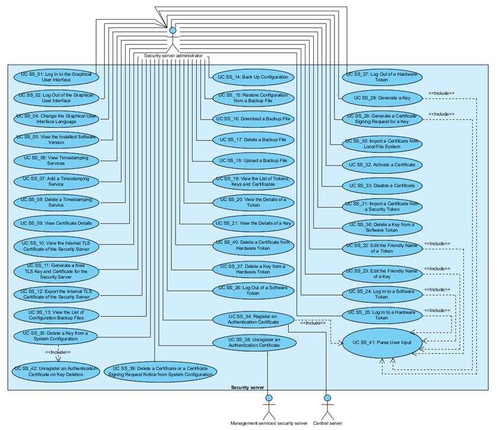

# X-Road: Use Case Model for Security Server Management
**Analysis**

Version: 1.13
09.11.2021
<!-- 49 pages -->
Doc. ID: UC-SS

-------------------------------------------------------

## Version history

<!-- toc -->

Date       | Version | Description                                                     | Author
---------- | ------- | --------------------------------------------------------------- | --------------------
10.09.2015 | 0.1     | Initial version                                                 | Meril Vaht
19.09.2015 | 0.2     | Corrections and additions done. The use cases for 'Keys and Certificates' added. | Meril Vaht
19.09.2015 | 0.3     | Overview added.       |  Meril Vaht
20.09.2015 | 0.4     | Comments and editorial changes | Riin Saarmäe
21.09.2015 | 0.5     | Comments and editorial changes accepted | Meril Vaht
21.09.2015 | 1.0     | Editorial changes made | Imbi Nõgisto
27.09.2016 | 1.1     | The use cases for 'Keys and Certificates' updated. | Meril Vaht
05.11.2015 | 1.2     | User renamed to SS administrator; UC SS\_01 - UC SS\_05 headings corrected. | Meril Vaht
30.11.2015 | 1.3     | Use cases updated according to system developments. | Meril Vaht
16.12.2015 | 1.4     | UC SS\_18, UC SS\_19, UC SS\_20, UC SS\_29, UC SS\_30, UC SS\_31, UC SS\_34, UC SS\_35, UC SS\_38, UC SS\_39 updated. UC SS\_42 added. Editorial changes made. | Meril Vaht
29.08.2017 | 1.5     | Changed documentation type from docx to md file |   Lasse Matikainen
19.02.2018 | 1.6     | Updated the negative case extension for backing up the central server | Tatu Repo
06.03.2018 | 1.7     | Moved terms to term doc, added term doc reference and link, added internal MD-doc links | Tatu Repo
27.03.2019 | 1.8     | Added use cases related to management REST API | Janne Mattila
24.10.2019 | 1.9     | Update use cases related to Security Server's TLS certificate | Guido Casalegno
28.03.2020 | 1.10    | Added edit API key use case | Petteri Kivimäki
01.04.2020 | 1.11    | Added notes about IP whitelists for REST API | Janne Mattila
25.08.2021 | 1.12    | Update X-Road references from version 6 to 7 | Caro Hautamäki
09.11.2021 | 1.13    | Update key deletion use cases to match current implementation | Janne Mattila

<!-- tocstop -->

## Table of Contents

<!-- toc -->

- [1 Introduction](#1-introduction)
  * [1.1 Purpose](#11-purpose)
  * [1.2 Terms and Abbreviations](#12-terms-and-abbreviations)
  * [1.3 References](#13-references)
- [2 Overview](#2-overview)
- [3 Use Case Model](#3-use-case-model)
  * [3.1 Actors](#31-actors)
  * [3.2 UC SS\_01: Log In to the Graphical User Interface](#32-uc-ss_01-log-in-to-the-graphical-user-interface)
  * [3.3 UC SS\_02: Log Out of the Graphical User Interface](#33-uc-ss_02-log-out-of-the-graphical-user-interface)
  * [3.4 UC SS\_03: Log a User Out of the Graphical User Interface](#34-uc-ss_03-log-a-user-out-of-the-graphical-user-interface)
  * [3.5 UC SS\_04: Change the Graphical User Interface Language](#35-uc-ss_04-change-the-graphical-user-interface-language)
  * [3.6 UC SS\_05: View the Installed Software Version](#36-uc-ss_05-view-the-installed-software-version)
  * [3.7 UC SS\_06: View Timestamping Services](#37-uc-ss_06-view-timestamping-services)
  * [3.8 UC SS\_07: Add a Timestamping Service](#38-uc-ss_07-add-a-timestamping-service)
  * [3.9 UC SS\_08: Delete a Timestamping Service](#39-uc-ss_08-delete-a-timestamping-service)
  * [3.10 UC SS\_09: View Certificate Details](#310-uc-ss_09-view-certificate-details)
  * [3.11 UC SS\_10: View the Internal TLS Certificate of the Security Server](#311-uc-ss_10-view-the-internal-tls-certificate-of-the-security-server)
  * [3.12 UC SS\_11: Generate a New TLS Key and Certificate for the Security Server](#312-uc-ss_11-generate-a-new-tls-key-and-certificate-for-the-security-server)
  * [3.13 UC SS\_12: Export the Internal TLS Certificate of the Security Server](#313-uc-ss_12-export-the-internal-tls-certificate-of-the-security-server)
  * [3.14 UC SS\_13: View the List of Configuration Backup Files](#314-uc-ss_13-view-the-list-of-configuration-backup-files)
  * [3.15 UC SS\_14: Back Up Configuration](#315-uc-ss_14-back-up-configuration)
  * [3.16 UC SS\_15: Restore Configuration from a Backup File](#316-uc-ss_15-restore-configuration-from-a-backup-file)
  * [3.17 UC SS\_16: Download a Backup File](#317-uc-ss_16-download-a-backup-file)
  * [3.18 UC SS\_17: Delete a Backup File](#318-uc-ss_17-delete-a-backup-file)
  * [3.19 UC SS\_18: Upload a Backup File](#319-uc-ss_18-upload-a-backup-file)
  * [3.20 UC SS\_19: View the List of Tokens, Keys and Certificates](#320-uc-ss_19-view-the-list-of-tokens-keys-and-certificates)
  * [3.21 UC SS\_20: View the Details of a Token](#321-uc-ss_20-view-the-details-of-a-token)
  * [3.22 UC SS\_21: View the Details of a Key](#322-uc-ss_21-view-the-details-of-a-key)
  * [3.23 UC SS\_22: Edit the Friendly Name of a Token](#323-uc-ss_22-edit-the-friendly-name-of-a-token)
  * [3.24 UC SS\_23: Edit the Friendly Name of a Key](#324-uc-ss_23-edit-the-friendly-name-of-a-key)
  * [3.25 UC SS\_24: Log In to a Software Token](#325-uc-ss_24-log-in-to-a-software-token)
  * [3.26 UC SS\_25: Log In to a Hardware Token](#326-uc-ss_25-log-in-to-a-hardware-token)
  * [3.27 UC SS\_26: Log Out of a Software Token](#327-uc-ss_26-log-out-of-a-software-token)
  * [3.28 UC SS\_27: Log Out of a Hardware Token](#328-uc-ss_27-log-out-of-a-hardware-token)
  * [3.29 UC SS\_28: Generate a Key](#329-uc-ss_28-generate-a-key)
  * [3.30 UC SS\_29: Generate a Certificate Signing Request for a Key](#330-uc-ss_29-generate-a-certificate-signing-request-for-a-key)
  * [3.31 UC SS\_30: Import a Certificate from Local File System](#331-uc-ss_30-import-a-certificate-from-local-file-system)
  * [3.32 UC SS\_31: Import a Certificate from a Security Token](#332-uc-ss_31-import-a-certificate-from-a-security-token)
  * [3.33 UC SS\_32: Activate a Certificate](#333-uc-ss_32-activate-a-certificate)
  * [3.34 UC SS\_33: Disable a Certificate](#334-uc-ss_33-disable-a-certificate)
  * [3.35 UC SS\_34: Register an Authentication Certificate](#335-uc-ss_34-register-an-authentication-certificate)
  * [3.36 UC SS\_35: Delete a Key from the System Configuration and from a Token](#336-uc-ss_35-delete-a-key-from-the-system-configuration-and-from-a-token)
  * [3.37 UC SS\_36: Delete a Key from a Software Token](#337-uc-ss_36-delete-a-key-from-a-software-token)
  * [3.38 UC SS\_37: Delete a Key from a Hardware Token](#338-uc-ss_37-delete-a-key-from-a-hardware-token)
  * [3.39 UC SS\_38: Unregister an Authentication Certificate](#339-uc-ss_38-unregister-an-authentication-certificate)
  * [3.40 UC SS\_39: Delete Certificate or a Certificate Signing Request Notice from System Configuration](#340-uc-ss_39-delete-certificate-or-a-certificate-signing-request-notice-from-system-configuration)
  * [3.41 UC SS\_40: Delete a Certificate from Hardware Token](#341-uc-ss_40-delete-a-certificate-from-hardware-token)
  * [3.42 UC SS\_41: Parse User Input](#342-uc-ss_41-parse-user-input)
  * [3.43 UC SS\_42: Unregister an Authentication Certificate on Key Deletion](#343-uc-ss_42-unregister-an-authentication-certificate-on-key-deletion)
  * [3.44 UC SS\_43: Create a new API key](#344-uc-ss_43-create-a-new-api-key)
  * [3.45 UC SS\_44: List API keys](#345-uc-ss_44-list-api-keys)
  * [3.46 UC SS\_45: Edit an API key](#346-uc-ss_45-edit-an-api-key)
  * [3.47 UC SS\_46: Revoke an API key](#347-uc-ss_46-revoke-an-api-key)
  * [3.48 UC SS\_47: Call a REST API](#348-uc-ss_47-call-a-rest-api)

<!-- tocstop -->

## License

This work is licensed under the Creative Commons Attribution-ShareAlike
3.0 Unported License. To view a copy of this license, visit
http://creativecommons.org/licenses/by-sa/3.0/.

## 1 Introduction

### 1.1 Purpose

The purpose of this document is to describe the management of the
security server including:

-   the management of the graphical user interface;

-   the management of timestamping services,

-   the management of the security server's internal TLS certificate,

-   the management of keys and certificates and

-   the backing up and restoring the security server configuration.

The use cases include verifications that take place, and the main error
conditions that may be encountered during the described process. The
general system errors that may be encountered in most of the use cases
(e.g., database connection errors or out of memory errors) are not
described in this document.

The use cases assume that the X-Road software components involved in the
use cases are installed and initialised (see \[[IG-SS](#Ref_IG-SS)\]).

The use cases including a human actor (the *level* of the use case is
*user task*) assume, that the actor is logged in to the system and has
the access rights required to carry out the use case.

### 1.2 Terms and Abbreviations

See X-Road terms and abbreviations documentation \[[TA-TERMS](#Ref_TERMS)\].

### 1.3 References

1.  <a id="Ref_IG-SS" class="anchor"></a>\[IG-SS\]
    X-Road 7. Security Server Installation Guide. Document ID: [IG-SS](../Manuals/ig-ss_x-road_v6_security_server_installation_guide.md).

2.  <a id="Ref_SPEC-AL" class="anchor"></a>\[SPEC-AL\] X-Road:
    Audit Log Events. Document ID: SPEC-AL.

3.  <a id="Ref_PKCS11" class="anchor"></a>\[PKCS11\] PKCS \#11 Cryptographic Token
    Interface Base Specification Version 2.40. Function return values.
    <http://docs.oasis-open.org/pkcs11/pkcs11-base/v2.40/csprd01/pkcs11-base-v2.40-csprd01.html#_Toc372627249>

4.  <a id="Ref_X509" class="anchor"></a>\[X509\] Internet X.509 Public Key
    Infrastructure Certificate and Certificate Revocation List (CRL)
    Profile, Internet Engineering Task Force, 2008.

5.  <a id="Ref_UC-MESS" class="anchor"></a>\[UC-MESS\] X-Road: Use Case Model for
    Member Communication. Document ID: [UC-MESS](uc-mess_x-road_member_communication_use_case_model.md).

6.  <a id="Ref_UC-MEMBER" class="anchor"></a>\[UC-MEMBER\] X-Road: Use Case Model for Member Management. Document
    ID: [UC-MEMBER](uc-member_x-road_use_case_model_for_member_management.md).

7.  <a id="Ref_PR-MSERV" class="anchor"></a>\[PR-MSERV\]
    X-Road: Protocol for Management Services. Document ID: [PR-MSERV](../Protocols/pr-mserv_x-road_protocol_for_management_services.md).

8. <a id="Ref_TERMS" class="anchor"></a>\[TA-TERMS\] X-Road Terms and Abbreviations. Document ID: [TA-TERMS](../terms_x-road_docs.md).

9. <a id="Ref_UG-SYSPAR" class="anchor"></a>\[UG-SYSPAR\] X-Road: System Parameters User Guide. Document ID: [UG-SYSPAR](../Manuals/ug-syspar_x-road_v6_system_parameters.md).

## 2 Overview

Timestamping services are used to preserve the evidence value of the
messages exchanged over the X-Road (see \[UC-MESS\]). The timestamping
services used in a security server must be approved by the X-Road
governing agency.

TLS certificates are used for establishing TLS connections with the
security server client's information systems if the “HTTPS” connection
method is chosen for the client's servers.

Signing certificates are used for signing X-Road messages.
Authentication certificates are used for establishing secure data
exchange channels between the security servers.

Backing up the system configuration ensures that in case of system
failure, the system configuration can be restored to a previously backed
up state.

## 3 Use Case Model

### 3.1 Actors

The X-Road security server management use case model includes the
following actor:

-   **SS administrator** (security server administrator) – a person
    responsible for managing the security server.

-   **Central server** – the central server of the X-Road instance. The
    central server provides management services for the security servers
    of this X-Road instance. The authentication certificate deletion
    requests are forwarded to the central server by the management
    services' security server. The authentication certificate
    registration request is sent directly to the central server by the
    security server that the certificate is to be registered for.

-   **Management services' security server** – a security server that
    has the management services' provider for this X-Road instance
    registered as a security server client.

The relationships between actors, systems and use cases are described in
Figure 1.



Figure 1. Use case diagram for security server management

### 3.2 UC SS\_01: Log In to the Graphical User Interface

**System**: Security server

**Level**: User task

**Component:** Security server

**Actor:** SS administrator

**Brief Description:** SS administrator logs in to the graphical user
interface (GUI) of the security server.

**Preconditions**: -

**Postconditions**: An audit log record for the event is created.

**Trigger**: SS administrator wishes to log in to the GUI to view or
manage the security server configuration.

**Main Success Scenario**:

1.  SS administrator selects to log in to the GUI.

2.  SS administrator inserts the user name and password.

3.  System verifies that the system is not currently undergoing the
    system restore process.

4.  System verifies that a user with the inserted user name and password
    is configured in the system configuration and logs the SS
    administrator in to the GUI.

5.  System logs the event “Log in user” to the audit log.

**Extensions**:

- 3a. The system is currently undergoing the system restore process.
    - 3a.1. System displays the error message “Restore in progress, try again later”.
    - 3a.2. System logs the event “Log out user” to the audit log.
    - 3a.3. SS administrator selects to reinsert the user name and/or the password. Use case continues from step 3.
        - 3a.3a. SS administrator selects to terminate the use case.

- 4a. The user with the inserted user name does not exist or the password is incorrect.
    - 4a.1. System displays the error message “Authentication failed. Please try again”. The text fields are emptied.
    - 4a.2. System logs the event “Log in user failed” to the audit log.
    - 4a.3. SS administrator selects to reinsert the user name and/or the password. Use case continues from step 3.
        - 4a.3a. SS administrator selects to terminate the use case.

**Related information**:

-   The audit log is located at /var/log/xroad/audit.log. The data set
    of audit log records is described in the document “X-Road: Audit Log
    Events” \[[SPEC-AL](#Ref_SPEC-AL)\].

### 3.3 UC SS\_02: Log Out of the Graphical User Interface

**System**: Security server

**Level**: User task

**Component:** Security server

**Actor**: SS administrator

**Brief Description**: SS administrator logs out of the GUI.

**Preconditions**: -

**Postconditions**:

-   SS administrator is logged out of the GUI.

-   An audit log record for the event is created.

**Triggers**: SS administrator wishes to log out of the GUI.

**Main Success Scenario**:

1.  SS administrator selects to log out of the GUI (Profile Menu > Log out).

2.  System logs the SS administrator out of the GUI and redirects the user to the Log-in view.

3.  System logs the event “Log out user” to the audit log.

**Extensions**: -

**Related information**:

-   The audit log is located at /var/log/xroad/audit.log. The data set
    of audit log records is described in the document “X-Road: Audit Log
    Events” \[[SPEC-AL](#Ref_SPEC-AL)\].

### 3.4 UC SS\_03: Log a User Out of the Graphical User Interface

**System**: Security server

**Level**: System task

**Component:** Security server

**Actor**: -

**Brief Description**: System logs the user out of the GUI when the
logged in user has been idle for 30 minutes.

**Preconditions**: -

**Postconditions**: User is logged out of the GUI.

**Triggers**: The logged in user has been idle for 30 minutes.

**Main Success Scenario**:

1.  User has been idle for 30 minutes.

2.  System displays the dialog “Session expired - You have been idle for 30 minutes and your session has expired. For security reasons, you will be logged out. <Button OK>”
 
3.  System logs the SS administrator out of the GUI and redirects the user to the Log-in view.

**Extensions**: -

**Related information**:

-   The audit log is located at /var/log/xroad/audit.log. The data set
    of audit log records is described in the document “X-Road: Audit Log
    Events” \[[SPEC-AL](#Ref_SPEC-AL)\].

### 3.5 UC SS\_04: Change the Graphical User Interface Language

**System**: Security server

**Level**: User task

**Component:** Security server

**Actor**: SS administrator

**Brief Description**: SS administrator changes the language of the GUI.

**Preconditions**: -

**Postconditions**:

-   The language of the GUI has been changed.

-   An audit log record for the event is created.

**Trigger**: SS administrator wishes to change the language of the GUI.

**Main Success Scenario**:

1.  SS administrator selects to change the language of the GUI.

2.  System displays the list of supported languages.

3.  SS administrator selects a language.

4.  System saves the SS administrator's choice and displays the GUI in
    the language the SS administrator selected.

5.  System logs the event “Set UI language” to the audit log.

**Extensions**: -

**Related information**:

-   The audit log is located at /var/log/xroad/audit.log. The data set
    of audit log records is described in the document “X-Road: Audit Log
    Events” \[[SPEC-AL](#Ref_SPEC-AL)\].

### 3.6 UC SS\_05: View the Installed Software Version

**System**: Security server

**Level**: User task

**Component:** Security server

**Actor**: SS administrator

**Brief Description**: SS administrator views the version of the
installed software.

**Preconditions**: -

**Postconditions**: The version of the software has been displayed to SS
administrator.

**Trigger**: SS administrator wishes to view the version of the
installed software.

**Main Success Scenario**:

1.  SS administrator selects to view the version of the installed
    software.

2.  System displays the version information.

**Extensions**: -

**Related information**: -

### 3.7 UC SS\_06: View Timestamping Services

**System**: Security server

**Level**: User task

**Component:** Security server

**Actors:** SS administrator

**Brief Description**: SS administrator views the list of timestamping
services configured for the security server.

**Preconditions**: -

**Postconditions**: The list of timestamping services used by the
security server has been displayed to SS administrator.

**Trigger**: SS administrator wants to view the list of timestamping
services.

**Main Success Scenario**:

1.  SS administrator selects to view the list of timestamping services.

2.  System displays the list of timestamping services. For each service,
    the following information is displayed:

    -   the name of the timestamping service;
    
    -   the URL of the timestamping service.

    The SS administrator has a possibility to choose amongst the following actions:

    -   add a timestamping service: 3.8;
    
    -   delete a timestamping service: 3.9.

**Extensions**: -

**Related information:** -

### 3.8 UC SS\_07: Add a Timestamping Service

**System**: Security server

**Level**: User task

**Component:** Security server

**Actors:** SS administrator

**Brief Description**: SS administrator adds a timestamping service to
be used by the security server.

**Preconditions**: One or more timestamping services have been approved
by the X-Road governing agency.

**Postconditions**: An audit log record for the event is created.

**Trigger**: SS administrator wants to add a timestamping service to be
used by the security server to timestamp message log records.

**Main Success Scenario**:

1.  SS administrator selects to add a timestamping service.

2.  SS administrator selects the timestamping service that he wants to
    add to the security server from the list of approved timestamping
    services.

3.  System verifies that the selected timestamping service is not
    already configured to be used by the system.

4.  System saves the timestamping service to the list of timestamping
    services that can be used to timestamp message log records.

5.  System logs the event “Add timestamping service” to the audit log.

**Extensions**:

- 3a. SS administrator selected a timestamping service that already exists in the security server.
    - 3a.1. System displays an error message “Failed to add timestamping service: timestamping service already exists”.
    - 3a.2. System logs the event “Add timestamping service failed” to the audit log.
    - 3a.3. Use case terminates.

**Related information**:

-   The audit log is located at /var/log/xroad/audit.log. The data set
    of audit log records is described in the document “X-Road: Audit Log
    Events” \[[SPEC-AL](#Ref_SPEC-AL)\].

### 3.9 UC SS\_08: Delete a Timestamping Service

**System**: Security server

**Level**: User task

**Component:** Security server

**Actors:** SS administrator

**Brief Description**: SS administrator deletes a timestamping service
from the security server.

**Preconditions**: -

**Postconditions**:

-   The security server can no longer use the deleted timestamping
    service to timestamp message log records.

-   An audit log record for the event is created.

**Trigger**: SS administrator wants to delete a timestamping service.

**Main Success Scenario**:

1.  SS administrator selects to delete a timestamping service.

2.  System deletes the selected timestamping service from the list of
    usable timestamping services.

3.  System logs the event “Delete timestamping service” to the audit
    log.

**Extensions**: -

**Related information**:

-   The audit log is located at /var/log/xroad/audit.log. The data set
    of audit log records is described in the document “X-Road: Audit Log
    Events” \[[SPEC-AL](#Ref_SPEC-AL)\].

### 3.10 UC SS\_09: View Certificate Details

**System**: Security server

**Level**: User task

**Component:** Security server

**Actors:** SS administrator

**Brief Description**: SS administrator views the contents of a
certificate.

**Preconditions**: -

**Postconditions**: Certificate details have been displayed to SS
administrator.

**Trigger**: SS administrator wants to view the details of a
certificate.

**Main Success Scenario**:

1.  SS administrator selects to view the details of a certificate.

2.  System displays the contents and the SHA-1 hash value of the
    certificate.

**Extensions**: -

**Related information**:

-   See \[[X509](#Ref_X509)\] for detailed information on the contents of
    certificates.

### 3.11 UC SS\_10: View the Security Server TLS Certificate

**System**: Security server

**Level**: User task

**Component:** Security server

**Actors:** SS administrator

**Brief Description**: SS administrator views the information about the the security server's TLS certificate.

**Preconditions**: -

**Postconditions**: The Security Server's TLS certificate information has been
displayed to SS administrator.

**Trigger**: SS administrator wants to view the security server's TLS certificate
information.

**Main Success Scenario**:

1.  SS administrator selects to view the Security Server's TLS certificate.

2.  System displays the SHA-1 hash value of the Security Server's TLS certificate. The SS administrator has a possibility to choose amongst the following actions:

    -   generate a new TLS key and certificate for the security server:
        3.12 ;
        
    -   generate a new TLS certificate request: 3.12 ;
  
    -   import a TLS certificate request: 3.12 ;

    -   view the details of the security server's TLS certificate: 3.10 ;

    -   export the security server's TLS certificate: 3.13 .

**Extensions**: -

**Related information**: -

### 3.12 UC SS\_11: Generate a New TLS Key and Certificate for the Security Server

**System**: Security server

**Level**: User task

**Component:** Security server

**Actors:** SS administrator

**Brief Description**: SS administrator generates a TLS key
and respective self-signed certificate for the security server.

**Preconditions**: -

**Postconditions**: -

**Trigger**: SS administrator wants to change the key and certificate
used for TLS connections with the client information systems.

**Main Success Scenario**:

1.  SS administrator selects to generate a new TLS key.

2.  System prompts for confirmation.

3.  SS administrator confirms.

4.  System generates and saves the new TLS key and the respective
    self-signed certificate, replacing the existing key and certificate
    (if such exist) with the new ones.

5.  System calculates the SHA-1 hash value of the certificate (for
    displaying in the GUI).

6.  System logs the event “Generate new internal TLS key and
    certificate” to the audit log.

7. SS administrator selects to generate a new TLS certificate request.

8. System prompts for defining a Distinguished name.

9. SS administrator inserts a Distinguished name.

10. System prompts a request to download the generated certificate request.

11. The security server generates a certificate request using the current key and the provided Distinguished Name.

12. SS administrator downloads and saves the certificate request file to the local file system.

13. After a Certification Authority has issued a TLS certificate, SS administrator imports and saves the certificate file to the local file system.

**Extensions**:

- 3a. SS administrator cancels the generating of the new TLS key.
    - 3a.1. Use case terminates.

- 4a. System failed to generate the key or the respective self-signed certificate.
    - 4a.1. System displays an error message “Failed to generate new key: 'X'” (where “X” is the reason of the failure). Use case terminates.

**Related information**:

-   The audit log is located at /var/log/xroad/audit.log. The data set
    of audit log records is described in the document “X-Road: Audit Log
    Events” \[[SPEC-AL](#Ref_SPEC-AL)\].

### 3.13 UC SS\_12: Export the TLS Certificate of the Security Server

**System**: Security server

**Level**: User task

**Component:** Security server

**Actors:** SS administrator

**Brief Description**: SS administrator exports the internal TLS
certificate of the security server to the local file system.

**Preconditions**: An internal TLS certificate has been created.

**Postconditions**: The internal TLS certificate has been exported.

**Trigger**: SS administrator wants to export an internal TLS
certificate.

**Main Success Scenario**:

1.  SS administrator selects to export the internal TLS certificate of
    the security server.

2.  System prompts a tar.qz file for downloading, that contains the TLS
    certificate in PEM and CER format.

3.  SS administrator saves the file to the local file system.

**Extensions**: -

**Related information**: -

### 3.14 UC SS\_13: View the List of Configuration Backup Files

**System**: Security server

**Level**: User task

**Component:** Security server

**Actors:** SS administrator

**Brief Description**: SS administrator views the list of configuration
backup files saved in the system configuration.

**Preconditions**: *-*

**Postconditions**: The list of configuration backup files has been
displayed to SS administrator.

**Trigger**: SS administrator wants to view the list of configuration
backup files.

**Main Success Scenario**:

1.  SS administrator selects to view the list of configuration backup
    files.

2.  System displays the list of backup files. For each file, the
    following information is displayed:

    -   the file name of the backup file.

    The SS administrator has a possibility to choose amongst the following actions:

    -   back up configuration: 3.15;
    
    -   upload a backup file: 3.19;
    
    -   download a backup file: 3.17;
    
    -   restore system configuration from a backup file: 3.16;
    
    -   delete a backup file: 3.18.

**Extensions**: -

**Related information**: -

### 3.15 UC SS\_14: Back Up Configuration

**System**: Security server

**Level**: User task

**Component:** Security server

**Actors:** SS administrator

**Brief Description**: SS administrator backs up the security server
configuration.

**Preconditions**: -

**Postconditions**: An audit log record for the event is created.

**Trigger**: SS administrator wants to back up the security server
configuration.

**Main Success Scenario**:

1.  SS administrator selects to back up the security server
    configuration.

2.  System runs the backup script, that

    a.  creates a dump file of the database (including the schema) to
        the location /var/lib/xroad/dbdump.dat, that contains the
        contents of the security server database;

    b.  creates the backup file containing the database dump file and
        the following directory:

    -   /etc/xroad/
    
    and includes the following information as a label in the created .tar file:
    
    -   the type of the server (“security” for security servers),
    
    -   the version of the security server software,
    
    -   the X-Road identifier of the security server;

    c.  saves the created backup file to /var/lib/xroad/backup.

3.  System displays the message “Configuration backup created” and the
    backup script output to the SS administrator.

4.  System logs the event “Back up configuration” to the audit log.

**Extensions**:

- 3a. Backing up the security server configuration failed.
    - 3a.1  Backup script produces an error code that prompts the error handling to remove any incomplete backup archives
    - 3a.2. System displays the error message “Error making configuration backup, script exited with status code 'X'” (where “X” is the exit code of the backup script) and the output of the backup script.
    - 3a.3. System logs the event “Back up configuration failed” to the audit log.
    - 3a.4. Use case terminates.

**Related information**:

-   The audit log is located at /var/log/xroad/audit.log. The data set
    of audit log records is described in the document “X-Road: Audit Log
    Events” \[[SPEC-AL](#Ref_SPEC-AL)\].

### 3.16 UC SS\_15: Restore Configuration from a Backup File

**System**: Security server

**Level**: User task

**Component:** Security server

**Actors:** SS administrator

**Brief Description**: SS administrator restores the security server
configuration from a backup file stored in the system configuration.

**Preconditions**: The backup file exists in the system configuration.

**Postconditions**: -

**Trigger**: SS administrator wants to restore the security server
configuration to a previously backed up state.

**Main Success Scenario**:

1.  SS administrator selects to restore security server configuration
    from a backup file saved in the system configuration.

2.  System prompts for confirmation.

3.  SS administrator confirms.

4.  System runs the script, that

    a.  verifies that the file is a valid backup file;

    b.  verifies the label of the backup file:

    -   verifies that the server type in the label corresponds to
        the type of the server that is being restored;

        *Note: System verifies only the server type and ignores the rest of  the information in the label in case the restore script is called from  the CLI with the -F option.*
    
    -   verifies that the server software version in the label is compatible
        with the installed software version of the server that is being
        restored;
    
    -   verifies that the security server identifier in the label
        corresponds to the identifier of the security server that is being
        restored;
    
    c.  clears shared memory;
    
    d.  stops all system services, except for xroad-proxy-ui-api;
    
    e.  creates a pre-restore backup of the system configuration (step 2 of
        3.15) to /var/lib/xroad/conf\_prerestore\_backup.tar (the
        pre-restore backup file is overwritten on each restore);
    
    f.  deletes the content of the following directory:
    
        -   /etc/xroad/
        
    g.  writes the database dump from the backup file to
        /var/lib/xroad/dbdump.dat;

    h.  restores the content of the directory /etc/xroad/ from the backup file;

    i.  restores the database data (including the schema) from the dump
        file /var/lib/xroad/dbdump.dat;

    j.  restarts all the services that were previously stopped.

5.  System displays the message “Configuration restored successfully
    from file 'X'.” (where “X” is the name of the backup file) and the
    restore script output to the SS administrator.

6.  System notifies the SS administrator: “During restore, security
    tokens were logged out from.”

7.  System logs the event “Restore configuration” to the audit log.

**Extensions**:

- 3a. SS administrator cancels the restoring of the configuration from the backup file.
    - 3a.1. Use case terminates.

- 4a. Restoring the security server configuration failed.
    - 4a.1. System displays the error message “Restoring configuration from file 'X' failed.” (where X is the file name of the backup file) and the output of the restore script.
    - 4a.2. System logs the event “Restore configuration failed” to the audit log.
    - 4a.3. Use case terminates.

**Related information**:

-   Backup files are located at /var/lib/xroad/backup.

-   The audit log is located at /var/log/xroad/audit.log. The data set
    of audit log records is described in the document “X-Road: Audit Log
    Events” \[[SPEC-AL](#Ref_SPEC-AL)\].

### 3.17 UC SS\_16: Download a Backup File

**System**: Security server

**Level**: User task

**Component:** Security server

**Actors:** SS administrator

**Brief Description**: SS administrator downloads a backup file.

**Preconditions**: A backup file is saved in the system configuration.

**Postconditions**: A backup file has been downloaded.

**Trigger**: SS administrator wants to download a backup file.

**Main Success Scenario**:

1.  SS administrator selects to download a backup file.

2.  System prompts the file for downloading.

3.  SS administrator saves the file to the local file system.

**Extensions**: -

**Related information**: -

### 3.18 UC SS\_17: Delete a Backup File

**System**: Security server

**Level**: User task

**Component:** Security server

**Actors:** SS administrator

**Brief Description**: SS administrator deletes a backup file.

**Preconditions**: A backup file is saved in the system configuration.

**Postconditions**: -

**Trigger**: SS administrator wants to delete a backup file.

**Main Success Scenario**:

1.  SS administrator selects to delete a backup file.

2.  System prompts for confirmation.

3.  SS administrator confirms.

4.  System deletes the backup file and displays the message “Selected
    backup deleted successfully” to the SS administrator.

5.  System logs the event “Delete backup file” to the audit log.

**Extensions**:

- 3a. SS administrator cancels the deleting of the backup file.
    - 3a.1. Use case terminates.

**Related information**: -

-   The audit log is located at /var/log/xroad/audit.log. The data set
    of audit log records is described in the document “X-Road: Audit Log
    Events” \[[SPEC-AL](#Ref_SPEC-AL)\].

### 3.19 UC SS\_18: Upload a Backup File

**System**: Security server

**Level**: User task

**Component:** Security server

**Actors:** SS administrator

**Brief Description**: SS administrator uploads a backup file to the
security server.

**Preconditions**: -

**Postconditions**: An audit log record for the event is created.

**Trigger**: SS administrator wants to upload a backup file.

**Main Success Scenario**:

1.  SS administrator selects to upload a backup file.

2.  SS administrator inserts the path to the file.

3.  System verifies that the name of the file contains valid characters.

4.  System verifies that the uploaded file has valid extension.

5.  System verifies that the content of the uploaded file is in tar
    format.

6.  System verifies that a backup file with the same file name does not
    exist in the system configuration.

7.  System saves the backup file to the system configuration and
    displays the message “New backup file uploaded successfully” to the
    SS administrator.

8.  System logs the event “Upload backup file” to the audit log.

**Extensions**:

- 3a. The file name contains invalid characters.
    - 3a.1. System displays the error message “Failed to upload new backup file: Filename 'X' contains invalid characters. Valid characters include: (A-Z), (a-z), (0-9), (\_), (.), (-).'” (where “X” is the file name of the uploaded file).
    - 3a.2. System logs the event “Upload backup file failed” to the audit log.
    - 3a.3. SS administrator selects to reinsert the path to the backup file. Use case continues from step 3.
        - 3a.3a. SS administrator selects to terminate the use case.

- 4a. The file has invalid extension.
    - 4a.1. System displays an error message “Failed to upload new backup file: Uploaded file name 'X' has invalid extension, valid one is 'tar'” (where “X” is the name of the uploaded file).
    - 4a.2. System logs the event “Upload backup file failed” to the audit log.
    - 4a.3. SS administrator selects to reinsert the path to the backup file. Use case continues from step 3.
        - 4a.3a. SS administrator selects to terminate the use case.

- 5a. The content of the file is not in tar format.
    - 5a.1. System displays the error message “Failed to upload new backup file: Content of uploaded file must be in tar format”.
    - 5a.2. System logs the event “Upload backup file failed” to the audit log.
    - 5a.3. SS administrator selects to reinsert the path to the backup file. Use case continues from step 3.
        - 5a.3a. SS administrator selects to terminate the use case.

- 6a. A backup file with the same file name is saved in the system configuration.
    - 6a.1. System displays the message “Backup file with name 'X' already exists, do you want to overwrite it?” (where “X” is the file name of the uploaded file) and prompts for confirmation.
    - 6a.2. SS administrator confirms. Use case continues from step 7.
        - 6a.2a. SS administrator cancels the upload.
            - 6a.2a.1. SS administrator selects to reinsert the path to the backup file. Use case continues from step 3.
                - 6a.2a.1a. SS administrator selects to terminate the use case.

**Related information**:

-   Backup files are located at /var/lib/xroad/backup.

-   The audit log is located at /var/log/xroad/audit.log. The data set
    of audit log records is described in the document “X-Road: Audit Log
    Events” \[[SPEC-AL](#Ref_SPEC-AL)\].

### 3.20 UC SS\_19: View the List of Tokens, Keys and Certificates

**System**: Security server

**Level**: User task

**Component:** Security server

**Actors:** SS administrator

**Brief Description**: SS administrator views the list of tokens, keys,
certificates and certificate signing request notices.

**Preconditions**: -

**Postconditions**: The list of tokens, keys and certificates has been
displayed to SS administrator.

**Trigger**: SS administrator wants to view the list of tokens, keys and
certificates.

**Main Success Scenario**:

1.  SS administrator selects to view the list of tokens, keys and
    certificates that are saved in the system configuration and/or
    visible to the system.

2.  System displays the list of tokens, keys and certificates.

    For each token, the following information is displayed:
    
    -   the friendly name of the token. For tokens that are not saved in the system configuration, and for tokens that are saved in the system configuration but the friendly name of the token has not been changed, the friendly name is displayed in the format &lt;module ID&gt;-&lt;serial number&gt;-&lt;label&gt;-&lt;slot index&gt;;
    
    -   the status of the token marked as 'BLOCKED', when the token is blocked.
    
    For each key, the following information is displayed:
    
    -   the friendly name of the key. For keys that are not saved in the system configuration, and for keys that are saved in the system configuration but the friendly name of the key has not been set, the label or identifier (if the label is not set) of the key is displayed as the friendly name;
    
    -   the type of the key ('sign' for keys that are used for signing; 'auth' for keys that are used for authentication; '?' for keys the usage is undefined).
    
    For each certificate, the following information is displayed:
    
    -   the common name (CN) of the issuer of the certificate;
    
    -   the serial number of the certificate;
    
    -   the identifier of the X-Road member the certificate was issued for in the format *member class : member code* for signing certificates (if a certificate has not been imported to a hardware token the identifier of the X-Road member is not displayed);
    
    -   the last OCSP response for certificates in the registered state, or the disabled status notice if the certificate is disabled;
    
    -   the expiry date of the certificate;

    -   the registration state of the certificate (if a certificate has not been imported to a hardware token the registration state is not displayed).

    For each certificate signing request notice, the following information is displayed:

    -   the identifier of the X-Road member the certificate signing request was generated for in the format *member class : member code* (only displayed for signing CSRs)*.*

    The SS administrator has a possibility to choose amongst the following actions:

    -   view the details of a token: 3.21;
    
    -   view the details of a key: 3.22;
    
    -   view the details of a certificate: 3.10;
    
    -   log in to a token: 3.25 and 3.26;
    
    -   log out of a token: 3.27 and 3.28 ;
    
    -   generate a key on a security token: 3.29;
    
    -   generate a certificate signing request: 3.30;
    
    -   import a certificate: 3.31 and 3.32;
    
    -   activate a certificate: 3.33;
    
    -   disable a certificate: 3.34;
    
    -   send an authentication certificate registration request: 3.35;
    
    -   delete a key: 3.36, 3.37 and 3.38;
    
    -   unregister an authentication certificate: 3.39;
    
    -   delete a certificate signing request notice: 3.40;
    
    -   delete a certificate: 3.40, and 3.41.

**Extensions**: -

**Related information**:

-   The information about tokens, keys and certificates configured for
    the system is stored in the file /etc/xroad/signer/keyconf.xml.

### 3.21 UC SS\_20: View the Details of a Token

**System**: Security server

**Level**: User task

**Component:** Security server

**Actors:** SS administrator

**Brief Description**: SS administrator views the details of a security
token.

**Preconditions**: -

**Postconditions**: The details of the security token are displayed to
SS administrator.

**Trigger**: SS administrator wants to view the details of a security
token.

**Main Success Scenario**:

1.  SS administrator selects to view the details of a token.

2.  System displays the details of the token:

    -   the friendly name of the token;
    
    -   the identifier of the token;

    -   the technical token status information.

    The SS administrator has a possibility to choose amongst the following actions:

    -   edit the friendly name of the token: 3.23.

**Extensions**: -

**Related information**:

-   The information about tokens, keys and certificates configured for
    the system is stored in the file /etc/xroad/signer/keyconf.xml.

### 3.22 UC SS\_21: View the Details of a Key

**System**: Security server

**Level**: User task

**Component:** Security server

**Actors:** SS administrator

**Brief Description**: SS administrator views the details of a key.

**Preconditions**: -

**Postconditions**: The details of the key are displayed to SS
administrator.

**Trigger**: SS administrator wants to view the details of a key.

**Main Success Scenario**:

1.  SS administrator selects to view the details of a key.

2.  System displays the following information:

    -   the friendly name of the key;
    
    -   the identifier of the key;
    
    -   the label of the key;
    
    -   the information, whether the key is read-only or not.

    The SS administrator has a possibility to choose amongst the following actions:

    -   edit the friendly name of the key: 3.24.

**Extensions**: -

**Related information**:

-   The information about tokens, keys and certificates configured for
    the system is stored in the file /etc/xroad/signer/keyconf.xml.

### 3.23 UC SS\_22: Edit the Friendly Name of a Token

**System**: Security server

**Level**: User task

**Component:** Security server

**Actors:** SS administrator

**Brief Description**: SS administrator changes the friendly name of a
security token.

**Preconditions**: The token information is saved in the system
configuration.

**Postconditions**: An audit log record for the event is created.

**Trigger**: SS administrator wants to change the friendly name of a
security token.

**Main Success Scenario**:

1.  SS administrator selects to change the friendly name of a security
    token and changes the name.

2.  System parses the user input: 3.42.

3.  System saves the changes to the system configuration.

4.  System logs the event “Set friendly name to token” to the audit log.

**Extensions**:

- 2a. The process of parsing the user input terminated with an error message.
    - 2a.1. System displays the termination message from the parsing process.
    - 2a.2. System logs the event “Set friendly name to token failed” to the audit log.
    - 2a.3. SS administrator selects to reinsert the friendly name. Use case continues form step 2.
        - 2a.3a. User selects to terminate the use case.

**Related information**:

-   The audit log is located at /var/log/xroad/audit.log. The data set
    of audit log records is described in the document “X-Road: Audit Log
    Events” \[[SPEC-AL](#Ref_SPEC-AL)\].

-   The information about tokens, keys and certificates configured for
    the system is stored in the file /etc/xroad/signer/keyconf.xml.

### 3.24 UC SS\_23: Edit the Friendly Name of a Key

**System**: Security server

**Level**: User task

**Component:** Security server

**Actors:** SS administrator

**Brief Description**: SS administrator changes the friendly name of a
key.

**Preconditions**: The key information is saved in the system
configuration.

**Postconditions**: An audit log record for the event is created.

**Trigger**: SS administrator wants to change the friendly name of a
key.

**Main Success Scenario**:

1.  SS administrator selects to change the friendly name of a key and
    changes the name.

2.  System parses the user input: 3.42.

3.  System saves the changes to the system configuration.

4.  System logs the event “Set friendly name to key” to the audit log.

**Extensions**:

- 2a. The process of parsing the user input terminated with an error message.
    - 2a.1. System displays the termination message from the parsing process.
    - 2a.2. System logs the event “Set friendly name to key failed” to the audit log.
    - 2a.3. SS administrator selects to reinsert the friendly name. Use case continues form step 2.
        - 2a.3a. SS administrator selects to terminate the use case.

**Related information**:

-   The audit log is located at /var/log/xroad/audit.log. The data set
    of audit log records is described in the document “X-Road: Audit Log
    Events” \[[SPEC-AL](#Ref_SPEC-AL)\].

-   The information about tokens, keys and certificates configured for
    the system is stored in the file /etc/xroad/signer/keyconf.xml.

### 3.25 UC SS\_24: Log In to a Software Token

**System**: Security server

**Level**: User task

**Component:** Security server

**Actors:** SS administrator

**Brief Description**: SS administrator logs in to a software token by
entering the PIN code of the token.

**Preconditions**: The token is in logged out state.

**Postconditions**: An audit log record for the event is created.

**Trigger**: SS administrator wants to make the functionality of the
token available to the system.

**Main Success Scenario**:

1.  SS administrator selects to log in to a software token.

2.  SS administrator enters the PIN code of the token.

3.  System parses the user input: 3.42.

4.  System verifies that the PIN code is correct and logs in to the
    token.

5.  System logs the event “Log in to token” to the audit log.

**Extensions**:

- 3a. The process of parsing the user input terminated with an error message.
    - 3a.1. System displays the termination message from the parsing process.
    - 3a.2. System logs the event “Log in to token failed” to the audit log.
    - 3a.3. SS administrator selects to re-enter the PIN code. Use case continues form step 3.
    - 3a.3a. SS administrator selects to terminate the use case.

- 4a. The entered PIN code is incorrect.
    - 4a.1. System displays the error message: “PIN incorrect”.
    - 4a.2. System logs the event “Log in to token failed” to the audit log.
    - 4a.3. SS administrator selects to re-enter the PIN code. Use case continues from step 3.
        - 4a.3a. SS administrator selects to terminate the use case.

**Related information**:

-   The audit log is located at /var/log/xroad/audit.log. The data set
    of audit log records is described in the document “X-Road: Audit Log
    Events” \[[SPEC-AL](#Ref_SPEC-AL)\].

-   The information about tokens, keys and certificates configured for
    the system is stored in the file /etc/xroad/signer/keyconf.xml.

### 3.26 UC SS\_25: Log In to a Hardware Token

**System**: Security server

**Level**: User task

**Component:** Security server

**Actors:** SS administrator

**Brief Description**: SS administrator logs in to a hardware token by
entering the PIN code of the token.

**Preconditions**:

-   The hardware token is initialized and connected to the system.

-   The token is in logged out state.

**Postconditions**: An audit log record for the event is created.

**Trigger**: SS administrator wants to make the functionality of the
token available to the system.

**Main Success Scenario**:

1.  SS administrator selects to log in to a hardware token.

2.  SS administrator enters the PIN code of the token.

3.  System parses the user input: 3.42.

4.  System verifies that the token is not locked.

5.  System verifies that the format of the entered PIN code is correct.

6.  System verifies that the PIN code is correct and logs in to the
    token.

7.  System logs the event “Log in to token” to the audit log.

**Extensions**:

- 3a. The process of parsing the user input terminated with an error´message.
    - 3a.1. System displays the termination message from the parsing process.
    - 3a.2. System logs the event “Log in to token failed” to the audit log.
    - 3a.3. SS administrator selects to re-enter the PIN code. Use case continues form step 3.
        - 3a.3a. SS administrator selects to terminate the use case.

- 4-6a. The login attempt failed (e.g., token is inaccessible).
    - 4-6a.1. System displays the error message: ”Login failed: X”, where “X” is the error code from the PKCS \#11 cryptographic token interface (see \[PKCS11\]).
    - 4-6a.2. System logs the event “Log in to token failed” to the auditlog.
    - 4-6a.3. SS administrator selects to re-enter the PIN code. Use casecontinues from step 3.
        - 4-6a.3a. SS administrator selects to terminate the use case.

- 4b. The security token is locked.
    - 4b.1. System displays the error message: “PIN locked”.
    - 4b.2. System logs the event “Log in to token failed” to the audit log.
    - 4b.3. SS administrator selects to re-enter the PIN code. Use case continues from step 3.
        - 4b.3a. SS administrator selects to terminate the use case.

- 5b. The format of the entered PIN code is incorrect.
    - 5b.1. System displays the error message: “PIN format incorrect”.
    - 5b.2. System logs the event “Log in to token failed” to the audit log.
    - 5b.3. SS administrator selects to re-enter the PIN code. Use case continues from step 3.
        - 5b.3a. SS administrator selects to terminate the use case.

- 6b. The entered PIN code is incorrect.
    - 6b.1. System displays the error message: “Login failed: CKR\_PIN\_INCORRECT”.
    - 6b.2. System logs the event “Log in to token failed” to the audit log.
    - 6b.3. SS administrator selects to re-enter the PIN code. Use case continues from step 3.
        - 6b.3a. SS administrator selects to terminate the use case.

- 6c. The entered PIN code is incorrect and one login attempt is left.
    - 6c.1. System displays the error message: ”Login failed: CKR\_PIN\_INCORRECT, tries left: 1”.
    - 6c.2. System logs the event “Log in to token failed” to the audit log.
    - 6c.3. SS administrator selects to re-enter the PIN code. Use case continues from step 3.
        - 6c.3a. SS administrator selects to terminate the use case.

- 6d. The entered PIN code is incorrect and no login attempts are left.
    - 6d.1. System displays the error message: ”Login failed: CKR\_PIN\_INCORRECT. PIN locked.”.
    - 6d.2. System logs the event “Log in to token failed” to the audit log.
    - 6d.3. SS administrator selects to re-enter the PIN code. Use case continues from step 3.
        - 6d.3a. SS administrator selects to terminate the use case.

**Related information**:

-   The audit log is located at /var/log/xroad/audit.log. The data set
    of audit log records is described in the document “X-Road: Audit Log
    Events” \[[SPEC-AL](#Ref_SPEC-AL)\].

-   The information about tokens, keys and certificates configured for
    the system is stored in the file /etc/xroad/signer/keyconf.xml.

### 3.27 UC SS\_26: Log Out of a Software Token

**System**: Security server

**Level**: User task

**Component:** Security server

**Actors:** SS administrator

**Brief Description**: SS administrator logs out of a software token.

**Preconditions**: The token is in logged in state.

**Postconditions**: The token in logged out state. The system cannot use
the keys and certificates on the token.

**Trigger**: SS administrator wants to log out of a software token.

**Main Success Scenario**:

1.  SS administrator selects to log out of a software token.

2.  System logs out of the token.

3.  System logs the event “Log out from token” to the audit log.

**Extensions**: -

**Related information**:

-   The audit log is located at /var/log/xroad/audit.log. The data set
    of audit log records is described in the document “X-Road: Audit Log
    Events” \[[SPEC-AL](#Ref_SPEC-AL)\].

-   The information about tokens, keys and certificates configured for
    the system is stored in the file /etc/xroad/signer/keyconf.xml.

### 3.28 UC SS\_27: Log Out of a Hardware Token

**System**: Security server

**Level**: User task

**Component:** Security server

**Actors:** SS administrator

**Brief Description**: SS administrator logs out of a hardware token.

**Preconditions**: The token is in logged in state.

**Postconditions**: The token is in logged out state. The system cannot
use the keys and certificates on the token.

**Trigger**: SS administrator wants to log out of a hardware token.

**Main Success Scenario**:

1.  SS administrator selects to log out of a hardware token.

2.  System logs out of the token.

3.  System logs the event “Log out from token” to the audit log.

**Extensions**:

- 2a. The logout attempt failed (e.g., token is inaccessible).
    - 2a.1. System displays the error message: “Logout failed: X”, where “X” is the error code from the PKCS \#11 cryptographic token interface \[PKCS11\].
    - 2a.2. System logs the event “Log out from token failed” to the audit log.
    - 2a.3. Use case terminates.

**Related information**:

-   The audit log is located at /var/log/xroad/audit.log. The data set
    of audit log records is described in the document “X-Road: Audit Log
    Events” \[[SPEC-AL](#Ref_SPEC-AL)\].

-   The information about tokens, keys and certificates configured for
    the system is stored in the file /etc/xroad/signer/keyconf.xml.

### 3.29 UC SS\_28: Generate a Key

**System**: Security server

**Level**: User task

**Component:** Security server

**Actors:** SS administrator

**Brief Description**: SS administrator generates a key on a security
token.

**Preconditions**: The token is in logged in state.

**Postconditions**: -

**Trigger**: SS administrator wants to generate a key on a security
token.

**Main Success Scenario**:

1.  SS administrator selects to generate a key on a security token.

2.  System prompts for the label of the key.

3.  SS administrator inserts the label value (not required, may be left
    blank).

4.  System parses the user input: 3.42.

5.  SS administrator

    -   selects the intended usage of the certificate (signing or
        authentication) if the usage of the key the CSR is generated for
        has not been assigned before,

    -   selects the security server client the certificate will be
        issued for (only for signing certificates) from the list of this
        security server's clients,

    -   selects the certification service from the list of approved
        certification services that will issue the certificate and

    -   selects the format of the certificate signing request (PEM or
        DER).

6.  System uses the certificate profile info class described for the
    selected CA to display the subject distinguished name fields of the
    CSR, prefilling the values available for the system.

7.  User inserts the values of the subject distinguished name that were
    not prefilled by the system.

8.  System parses the user input: 3.42.

9.  SS administrator either

    -   selects to cancel the key creation: process aborted
    
    -   selects to generate the key creation: process continue to step 10

10.  System generates a key with the inserted label on the token.

11.  System verifies, that information of the token holding the key the
    CSR was generated for has not been previously saved to the system
    configuration and saves the token information.

12.  System verifies, that the key the CSR was generated for has not been
    previously saved to the system configuration and saves the key
    information, assigning the key usage according to the certificate
    usage selected for the generated CSR.

13.  System saves a notice about the generated CSR to the system
    configuration.

14. System logs the event “Generate CSR” to the audit log.

15.  System generates the certificate signing request and prompts the
    request file for downloading.

16. SS administrator saves the CSR file to the local file system.


**Extensions**:

- 4a. The process of parsing the user input terminated with an error message.
    - 4a.1. System displays the termination message from the parsing process.
    - 4a.2. System logs the event “Generate key failed” to the audit log.
    - 4a.3. SS administrator selects to reinsert the label. Use case continues form step 2.
    - 4a.3a. SS administrator selects to terminate the use case.
    
- 8a. The process of parsing the user input terminated with an error message.
    - 8a.1. System displays the termination message from the parsing process.
    - 8a.2. System logs the event “Generate CSR failed” to the audit log.
    - 8a.3. SS administrator selects to reinsert the distinguished name. Use case continues form step 5.
        - 5a.3a. SS administrator selects to terminate the use case.

- 10a. The generation of the key failed (e.g., token is inaccessible).
    - 10a.1. System displays the error message describing the encountered error. If the key generation failed on a hardware token, then the error message is an error code from the PKCS \#11 cryptographic token interface (see \[PKCS11\]).
    - 10a.2. System logs the event “Generate key failed” to the audit log.
    - 10a.3. Use case terminates.

- 15a. The generation of the CSR failed (e.g., token is inaccessible).
    - 15a.1. System displays the error message describing the encountered error. If the key which the CSR was to be generated for is stored on a hardware token, then the error message might be an error code from the PKCS \#11 cryptographic token interface (see \[PKCS11\]).
    - 15a.2. System logs the event “Generate CSR failed” to the audit log.
    - 15a.3. Use case terminates.


**Related information**:

-   The audit log is located at /var/log/xroad/audit.log. The data set
    of audit log records is described in the document “X-Road: Audit Log
    Events” \[[SPEC-AL](#Ref_SPEC-AL)\].

### 3.30 UC SS\_29: Generate a Certificate Signing Request for a Key

**System**: Security server

**Level**: User task

**Component:** Security server

**Actors**: SS administrator

**Brief Description**: SS administrator generates a certificate signing
request for a key and saves the request file to the local file system.
The token, key (if not already saved to the system configuration) and a
notice about the certificate signing request is saved to the system
configuration.

**Preconditions**: The key is accessible for the system. The token
holding the key is in logged in state.

**Postconditions**: -

**Trigger**: SS administrator wants to generate a certificate signing
request.

**Main Success Scenario**:

1.  SS administrator selects to generate a certificate signing request
    for a key.

2.  SS administrator

    -   selects the intended usage of the certificate (signing or
        authentication) if the usage of the key the CSR is generated for
        has not been assigned before,

    -   selects the security server client the certificate will be
        issued for (only for signing certificates) from the list of this
        security server's clients,

    -   selects the certification service from the list of approved
        certification services that will issue the certificate and

    -   selects the format of the certificate signing request (PEM or
        DER).

3.  System uses the certificate profile info class described for the
    selected CA to display the subject distinguished name fields of the
    CSR, prefilling the values available for the system.

4.  User inserts the values of the subject distinguished name that were
    not prefilled by the system.

5.  System parses the user input: 3.42.

6.  System generates the certificate signing request and prompts the
    request file for downloading.

7.  System verifies, that information of the token holding the key the
    CSR was generated for has not been previously saved to the system
    configuration and saves the token information.

8.  System verifies, that the key the CSR was generated for has not been
    previously saved to the system configuration and saves the key
    information, assigning the key usage according to the certificate
    usage selected for the generated CSR.

9.  System saves a notice about the generated CSR to the system
    configuration.

10. System logs the event “Generate CSR” to the audit log.

11. SS administrator saves the CSR file to the local file system.

**Extensions**:

- 4a. All the required fields of the distinguished name are prefilled by the system. Use case continues from step 6.

- 4b. SS administrator cancels the generation of the CSR. Use case terminates.

- 5a. The process of parsing the user input terminated with an error message.
    - 5a.1. System displays the termination message from the parsing process.
    - 5a.2. System logs the event “Generate CSR failed” to the audit log.
    - 5a.3. SS administrator selects to reinsert the distinguished name. Use case continues form step 5.
        - 5a.3a. SS administrator selects to terminate the use case.

- 6a. The generation of the CSR failed (e.g., token is inaccessible).
    - 6a.1. System displays the error message describing the encountered error. If the key which the CSR was to be generated for is stored on a hardware token, then the error message might be an error code from the PKCS \#11 cryptographic token interface (see \[PKCS11\]).
    - 6a.2. System logs the event “Generate CSR failed” to the audit log.
    - 6a.3. Use case terminates.

- 7a. The token information is already saved in the system configuration. Use case continues from step 8.

- 8a. The key information is already saved in the system configuration. Use case continues from step 9.

**Related information:**

-   The audit log is located at /var/log/xroad/audit.log. The data set
    of audit log records is described in the document “X-Road: Audit Log
    Events” \[[SPEC-AL](#Ref_SPEC-AL)\].

-   The information about tokens, keys and certificates configured for
    the system is stored in the file /etc/xroad/signer/keyconf.xml.

-   The filename of the CSR is in the following format:
    &lt;usage&gt;\_csr\_&lt;date&gt;\_&lt;identifier&gt;.pem/.der. For
    an authentication certificate signing request the identifier of the
    security server the CSR was generated for in the format
    securityserver\_&lt;*instance identifier&gt;\_&lt;owner
    class&gt;\_&lt;owner code&gt;\_&lt;security server code&gt;*; for a
    signing certificate signing request the identifier of the X-Road
    member the CSR was generated for in the format member\_&lt;*instance
    identifier&gt;\_&lt;member class&gt;\_&lt;member code&gt;*.

### 3.31 UC SS\_30: Import a Certificate from Local File System

**System**: Security server

**Level**: User task

**Component:** Security server

**Actors**: SS administrator

**Brief Description**: SS administrator imports a certificate from the
local file system.

**Preconditions**: -

**Postconditions**: An audit log record for the event is created.

**Trigger**: SS administrator wants to import a certificate from the
local file system.

**Main Success Scenario**:

1.  SS administrator selects to import a certificate file.

2.  SS administrator selects the file from the local file system.

3.  System verifies that the global configuration is not expired.

4.  System verifies that the file is in DER or PEM format.

5.  System verifies that the imported certificate is a signing
    certificate and uses the identifier decoder described for the
    certification service that issued the certificate to decode the
    X-Road identifier of the security server client the certificate was
    issued for.

6.  System verifies that the member, whom the certificate is issued to,
    is the owner of the security server or has a subsystem registered as
    a client of the security server.

7.  System verifies that the private key, associated with the public key
    in the certificate, is not deleted from token.

8.  System verifies that this certificate is not already saved in the
    system configuration.

9.  System verifies that certificate usage is in accordance with the key
    usage.

10. System verifies that the certificate is issued by an approved
    certification service by confirming that the issuer is listed in the
    global configuration.

11. System verifies that the certificate is not expired.

12. System verifies that the usage of the key is defined and saves the
    certificate to the system configuration.

13. System sets the registration state of the signing certificate to
    “registered”.

14. System gets the OCSP response for the imported certificate (see UC
    MESS\_15 \[UC-MESS\] for details).

15. System verifies that a certificate signing request notice
    corresponding to the imported certificate exists in the system
    configuration and deletes the certificate signing request
    information.

16. System logs the event “Import certificate from file” to the audit
    log.

**Extensions**:

- 3a. Global configuration is expired.
    - 3a.1. System displays the error message “Global configuration is expired”.
    - 3a.2. System logs the event “Import certificate from file failed” to the audit log.
    - 3a.3. SS administrator selects to reselect the file. Use case continues from step 3.
        - 3a.3a. SS administrator selects to terminate the use case.

- 4a. The file is not in valid format.
    - 4a.1. System displays the error message “Failed to import certificate: Incorrect file format. Only PEM and DER files allowed.”.
    - 4a.2. System logs the event “Import certificate from file failed” to the audit log.
    - 4a.3. SS administrator selects to reselect the file. Use case continues from step 3.
        - 4a.3a. SS administrator selects to terminate the use case.

- 5a. Identifier decoder encountered an error.
    - 5a.1. System displays the error message describing the encountered error.
    - 5a.2. System logs the event “Import certificate from file failed” to the audit log.
    - 5a.3. SS administrator selects to reselect the file. Use case continues from step 3.
        - 5a.3a. SS administrator selects to terminate the use case.

- 5b. The imported certificate is an authentication certificate. Use case continues from step 7.

- 6a. The member, whom the certificate is issued to, is not a client of the security server.
    - 6a.1. System displays the error message “Failed to import certificate: Certificate issued to an unknown member 'X'” (where “X” is the identifier of the member).
    - 6a.2. System logs the event “Import certificate from file failed” to the audit log.
    - 6a.3. SS administrator selects to reselect the file. Use case continues from step 3.
        - 6a.3a. SS administrator selects to terminate the use case.

- 7a. System could not find key corresponding to the certificate
    - 7a.1. System displays the error message “Failed to import certificate: Could not find key corresponding to the certificate.”.
    - 7a.2. System logs the event “Import certificate from file failed” to the audit log.
    - 7a.3. SS administrator selects to reselect the file. Use case continues from step 3.
        - 7a.3a. SS administrator selects to terminate the use case.

- 8a. The certificate already exists under the key.
    - 8a.1. System displays the error message “Failed to import certificate: Certificate already exists under key 'X'” (where “X” is the friendly name of the key).
    - 8a.2. System logs the event “Import certificate from file failed” to the audit log.
    - 8a.3. SS administrator selects to reselect the file. Use case continues from step 3.
    - 8a.3a. SS administrator selects to terminate the use case.

- 9a. SS administrator tried to import an authentication certificate for a signing key.
    - 9a.1. System displays the error message “Failed to import certificate: Authentication certificate cannot be imported to signing keys”.
    - 9a.2. System logs the event “Import certificate from file failed” to the audit log.
    - 9a.3. SS administrator selects to reselect the file. Use case continuesfrom step 3.
        - 9a.3a. SS administrator selects to terminate the use case.

- 9b. SS administrator tried to import a signing certificate for an authentication key.
    - 9b.1. System displays the error message “Failed to import certificate: 'X'” (where 'X' is the reason of the failure).
    - 9b.2. System logs the event “Import certificate from token failed” to the audit log.
    - 9b.3. SS administrator selects to reselect the file. Use case continues from step 3.
    - 9b.3a. SS administrator selects to terminate the use case.
    
- 9c. The usage of the key is undefined.
    - 9c.2. Use case continues from step 10.

- 10a. SS administrator tried to import a certificate that is not issued by an approved certification service.
    - 10a.1. System displays the error message “Failed to import certificate: Certificate is not issued by approved certification service provider.”.
    - 10a.2. System logs the event “Import certificate from file failed” tothe audit log.
    - 10a.3. SS administrator selects to reselect the file. Use case continuesfrom step 3.
        - 10a.3a. SS administrator selects to terminate the use case.

- 11a. The certificate is expired.
    - 11a.1. System displays the error message “Failed to import certificate: Certificate is not valid”.
    - 11a.2. System logs the event “Import certificate from file failed” to the audit log.
    - 11a.3. SS administrator selects to reselect the file. Use case continues from step 3.
        - 11a.3a. SS administrator selects to terminate the use case.

- 13a. The usage of the key is undefined.
    - 13a.1. System assigns the usage of the key according to the usage of the imported certificate and saves the certificate to the system configuration.
    - 13a.2. Use case continues from step 14.

- 14a. The imported certificate is an authentication certificate.
    - 14a.1. System sets the certificate to disabled state and sets the registration state to “saved”.
    - 14a.2. Use case continues from step 15.

- 15a. No certificate signing request notice corresponding to the imported certificate exist in the system configuration. Use case continues from step 16.

**Related information:**

-   The audit log is located at /var/log/xroad/audit.log. The data set
    of audit log records is described in the document “X-Road: Audit Log
    Events” \[[SPEC-AL](#Ref_SPEC-AL)\].

-   The information about tokens, keys and certificates configured for
    the system is stored in the file /etc/xroad/signer/keyconf.xml.

### 3.32 UC SS\_31: Import a Certificate from a Security Token

**System**: Security server

**Level**: User task

**Component:** Security server

**Actors**: SS administrator

**Brief Description**: SS administrator imports a certificate from a
security token.

**Preconditions**: -

**Postconditions**: An audit log record for the event is created.

**Trigger**: SS administrator wants to import a certificate from the
security token.

**Main Success Scenario**:

1.  SS administrator selects to import a certificate from a security
    token.

2.  System verifies that the global configuration is not expired.

3.  System verifies that the imported certificate is a signing
    certificate and uses the identifier decoder described for the
    certification service that issued the certificate to decode the
    X-Road identifier of the security server client the certificate was
    issued for.

4.  System verifies that the member, whom the certificate is issued to,
    is the owner of the security server or has a subsystem registered as
    a client of the security server.

5.  System verifies that the private key, associated with the public key
    in the certificate, is not deleted from token.

6.  System verifies that this certificate is not already saved in the
    system configuration.

7.  System verifies that certificate usage is in accordance with the key
    usage.

8.  System verifies that the certificate is issued by an approved
    certification service by confirming that the issuer is listed in the
    global configuration.

9.  System verifies that the certificate is not expired.

10. System verifies that the usage of the key is defined and saves the
    certificate to the system configuration.

11. System sets the registration state of the signing certificate to
    “registered”.

12. System gets the OCSP response for the imported certificate (see UC
    MESS\_15 \[[UC-MESS](#Ref_UC-MESS)\] for details).

13. System verifies that a certificate signing request notice
    corresponding to the imported certificate exists in the system
    configuration and deletes the certificate signing request
    information.

14. System logs the event “Import certificate from token” to the audit
    log.

**Extensions**:

- 2a. Global configuration is expired.
    - 2a.1. System displays the error message “Global configuration is expired”.
    - 2a.2. System logs the event “Import certificate from token failed” to the audit log.
    - 2a.3. SS administrator selects to reselect the file. Use case continues from step 3.
        - 2a.3a. SS administrator selects to terminate the use case.

- 3a. Identifier decoder encountered an error.
    - 3a.1. System displays the error message describing the encountered error.
    - 3a.2. System logs the event “Import certificate from token failed” to the audit log.
    - 3a.3. SS administrator selects to reselect the file. Use case continues from step 3.
       - 3a.3a. SS administrator selects to terminate the use case.

- 3b. The imported certificate is an authentication certificate. Use case continues from step 5.

- 4a. The member, whom the certificate is issued to, is not a client of the security server.
    - 4a.1. System displays the error message “Failed to import certificate: Certificate issued to an unknown member 'X'” (where “X” is the identifier of the member).
    - 4a.2. System logs the event “Import certificate from token failed” to the audit log.
    - 4a.3. SS administrator selects to reselect the file. Use case continues from step 3.
        - 4a.3a. SS administrator selects to terminate the use case.

- 5a. System could not find key corresponding to the certificate.
    - 5a.1. System displays the error message “Failed to import certificate: Could not find key corresponding to the certificate.”.
    - 5a.2. System logs the event “Import certificate from token failed” to the audit log.
    - 5a.3. SS administrator selects to reselect the file. Use case continues from step 3.
        - 5a.3a. SS administrator selects to terminate the use case.

- 6a. The certificate already exists under the key.
    - 6a.1. System displays the error message “Failed to import certificate: Certificate already exists under key 'X'” (where “X” is the friendly name of the key).
    - 6a.2. System logs the event “Import certificate from token failed” to the audit log.
    - 6a.3. SS administrator selects to reselect the file. Use case continues from step 3.
        - 6a.3a. SS administrator selects to terminate the use case.

- 7a. SS administrator tried to import an authentication certificate for a signing key.
    - 7a.1. System displays the error message “Failed to import certificate: Authentication certificate cannot be imported to signing keys”.
    - 7a.2. System logs the event “Import certificate from token failed” to the audit log.
    - 7a.3. SS administrator selects to reselect the file. Use case continues from step 3.
        - 7a.3a. SS administrator selects to terminate the use case.

- 7b. SS administrator tried to import a signing certificate for an authentication key.
    - 7b.1. System displays the error message “Failed to import certificate: 'X'” (where 'X' is the reason of the failure).
    - 7b.2. System logs the event “Import certificate from token failed” to the audit log.
    - 7b.3. SS administrator selects to reselect the file. Use case continues from step 3.
        - 7b.3a. SS administrator selects to terminate the use case.

- 7c. The usage of the key is undefined.
    - 7c.2. Use case continues from step 8.

- 8a. SS administrator tried to import a certificate that is not issued by an approved certification service.
    - 8a.1. System displays the error message “Failed to import certificate: Certificate is not issued by approved certification service provider.”.
    - 8a.2. System logs the event “Import certificate from token failed” to the audit log.
    - 8a.3. SS administrator selects to reselect the file. Use case continues from step 3.
        - 8a.3a. SS administrator selects to terminate the use case.

- 9a. The certificate is expired.
    - 9a.1. System displays the error message “Failed to import certificate: Certificate is not valid”.
    - 9a.2. System logs the event “Import certificate from token failed” to the audit log.
    - 9a.3. SS administrator selects to reselect the file. Use case continues from step 3.
        - 9a.3a. SS administrator selects to terminate the use case.

- 10a. The usage of the key is undefined.
    - 10a.1. System assigns the usage of the key according to the usage of the imported certificate and saves the certificate to the system configuration.
    - 10a.2. Use case continues from step 11.

- 11a. The imported certificate is an authentication certificate.
    - 11a.1. System sets the certificate to disabled state and sets the registration state to “saved”.
    - 11a.2. Use case continues from step 12.

- 13a. No certificate signing request notice corresponding to the imported certificate exist in the system configuration. Use case continues from step 14.

**Related information:**

-   The audit log is located at /var/log/xroad/audit.log. The data set
    of audit log records is described in the document “X-Road: Audit Log
    Events” \[[SPEC-AL](#Ref_SPEC-AL)\].

-   The information about tokens, keys and certificates configured for
    the system is stored in the file /etc/xroad/signer/keyconf.xml.

### 3.33 UC SS\_32: Activate a Certificate

**System**: Security server

**Level**: User task

**Component:** Security server

**Actors**: SS administrator

**Brief Description**: SS administrator activates a certificate. The
security server can use active certificates for establishing a secure
data exchange channel between security servers (authentication
certificates) or for signing messages (signing certificates).

**Preconditions**: The certificate is in disabled state.

**Postconditions**: The certificate is activated.

**Trigger**: SS administrator wants to activate a certificate.

**Main Success Scenario**:

1.  SS administrator selects to activate a certificate.

2.  System activates the certificate and displays the latest OCSP
    response value (if such exists, otherwise the value “unknown”) for
    this certificate as the status of OCSP response.

3.  System logs the event “Enable certificate” to the audit log.

**Extensions**: -

**Related information:**

-   The audit log is located at /var/log/xroad/audit.log. The data set
    of audit log records is described in the document “X-Road: Audit Log
    Events” \[[SPEC-AL](#Ref_SPEC-AL)\].

-   The information about tokens, keys and certificates configured for
    the system is stored in the file /etc/xroad/signer/keyconf.xml.

### 3.34 UC SS\_33: Disable a Certificate

**System**: Security server

**Level**: User task

**Component:** Security server

**Actors**: SS administrator

**Brief Description**: SS administrator disables a certificate.
Certificates in disabled state are not used for signing or
authentication.

**Preconditions**: A certificate is in active state.

**Postconditions**: The certificate is disabled.

**Trigger**: SS administrator wants to disable a certificate.

**Main Success Scenario**:

1.  SS administrator selects to disable a certificate.

2.  System disables the certificate and sets the status of OCSP response
    to “disabled”. OCSP responders are not queried for disabled
    certificates.

3.  System logs the event “Disable certificate” to the audit log.

**Extensions**: -

**Related information:**

-   The audit log is located at /var/log/xroad/audit.log. The data set
    of audit log records is described in the document “X-Road: Audit Log
    Events” \[[SPEC-AL](#Ref_SPEC-AL)\].

-   The information about tokens, keys and certificates configured for
    the system is stored in the file /etc/xroad/signer/keyconf.xml.

### 3.35 UC SS\_34: Register an Authentication Certificate

**System**: Security server

**Level**: User task

**Component:** Security server, central server

**Actors**: SS administrator, central server

**Brief Description**: SS administrator sends an authentication
certificate registration request to the central server.

**Preconditions**: The certificate is in “saved” state.

**Postconditions**: An audit log record for the event is created.

**Trigger**: SS administrator wants to register an authentication
certificate for the security server.

**Main Success Scenario**:

1.  SS administrator selects to register an unregistered authentication
    certificate.

2.  System prompts for DNS name/IP address of the security server.

3.  SS administrator inserts the DNS name or IP address of the security
    server.

4.  System parses the user input: 3.42.

5.  System verifies that the DNS name or IP address is valid.

6.  System creates the registration request, finds the management
    service address from the global configuration and sends the request
    to the central server. The contents of the request is described in
    \[[PR-MSERV](#Ref_PR-MSERV)\].

7.  System receives the response message from central server and
    verifies that the response is not an error message.

8.  System displays the message “Request sent” to the SS administrator
    and sets the registration state of the certificate to “registration
    in progress”.

9.  System logs the event “Register authentication certificate” to the
    audit log.

**Extensions**:

- 4a. The process of parsing the user input terminated with an error message.
    - 4a.1. System displays the termination message from the parsing process.
    - 4a.2. System logs the event “Register authentication certificate failed” to the audit log.
    - 4a.3. SS administrator selects to reinsert DNS name or IP address. Use case continues form step 2.
        - 4a.3a. SS administrator selects to terminate the use case.

- 5a. The DNS name or IP address is not valid.
    - 5a.1. System displays the error message “Failed to register certificate: Invalid host address”.
    - 5a.2. System logs the event “Register authentication certificate failed” to the audit log.
    - 5a.3. SS administrator selects to reinsert the DNS name or IP address. Use case continues form step 2.
        - 5a.3a. SS administrator selects to terminate the use case.

- 6a. Creating or sending the error message failed.
    - 6a.1. System displays the error message “Failed to register certificate: X”, where “X” is the error message.
    - 6a.2. System logs the event “Register authentication certificate failed” to the audit log.
    - 6a.3. Use case terminates.

- 7a. Central server responded with an error message.
    - 7a.1. System displays the error message “Failed to register certificate: X”, where “X” is the error message received from the central server.
    - 7a.2. System logs the event “Register authentication certificate failed” to the audit log.
    - 7a.3. Use case terminates.

**Related information:**

-   The audit log is located at /var/log/xroad/audit.log. The data set
    of audit log records is described in the document “X-Road: Audit Log
    Events” \[[SPEC-AL](#Ref_SPEC-AL)\].

-   The information about tokens, keys and certificates configured for
    the system is stored in the file /etc/xroad/signer/keyconf.xml.

### 3.36 UC SS\_35: Delete a Key from the System Configuration and from a Token

**System**: Security server

**Level**: User task

**Component:** Security server

**Actors:** SS administrator

**Brief Description**: SS administrator deletes a key including the
associated certificates and/or certificate signing request notices, if
there are any, from the system configuration, and from a token.

**Preconditions**: Information about the key is saved in the system
configuration.

**Postconditions**: -

**Trigger**: SS administrator wants to delete a key.

**Main Success Scenario**:

1.  SS administrator selects to delete a key from the system
    configuration.

2.  System checks whether the key is associated with authentication certificates that have
    registration state “registered” or “registration in progress”
    imported for the key and if so, prompts for confirmation to continue with
    unregistration and deletion of associated certificates, certificate signing request notices, and the key.

3.  SS administrator confirms the unregistration and deletion actions.

4.  System unregisters each of the authentication certificates: see
    3.43.

5.  System deletes the key and the associated certificates and/or
    certificate signing request notices from system configuration and from token.

6.  System logs the event “Delete key from token and configuration” to the audit
    log.

**Extensions**:

- 2a. There are no authentication certificates that have registration state “registered” or “registration in progress” imported for the key.
    - 2a.1. System prompts for confirmation of deletion.
    - 2a.2. SS administrator confirms.
        - 2a.2a. SS administrator terminates the use case.
    - 2a.3. Use case continues from step 5.

- 3a. SS administrator terminates the use case.

- 4a. The process of unregistering authentication certificates terminated with an error message.
    - 4a.1. System displays the message: “Failed to delete key: X”, where “X” is the termination message from the unregistration process.
    - 4a.2. System logs the event “Delete key failed” to the audit log.
    - 4a.3. Use case terminates.

**Related information**:

-   The audit log is located at /var/log/xroad/audit.log. The data set
    of audit log records is described in the document “X-Road: Audit Log
    Events” \[[SPEC-AL](#Ref_SPEC-AL)\].

-   The information about tokens, keys and certificates configured for
    the system is stored in the file /etc/xroad/signer/keyconf.xml.

### 3.37 UC SS\_36: Delete a Key from a Software Token

**System**: Security server

**Level**: User task

**Component:** Security server

**Actors:** SS administrator

**Brief Description**: SS administrator deletes a key from a software
token.

**Preconditions**: The key information is not saved to the system
configuration.

**Postconditions**: -

**Trigger**: SS administrator wants to delete a key.

**Main Success Scenario**:

1.  SS administrator selects to delete a key.

2.  System prompts for confirmation.

3.  SS administrator confirms.

4.  System deletes the key and associated certificates and certificate signing request notices from token.

5.  System logs the event “Delete key from token and configuration” to the audit log.

**Extensions**:

- 3a. SS administrator terminates the use case.

**Related information**:

-   The audit log is located at /var/log/xroad/audit.log. The data set
    of audit log records is described in the document “X-Road: Audit Log
    Events” \[[SPEC-AL](#Ref_SPEC-AL)\].

-   The information about tokens, keys and certificates configured for
    the system is stored in the file /etc/xroad/signer/keyconf.xml.

### 3.38 UC SS\_37: Delete a Key from a Hardware Token

**System**: Security server

**Level**: User task

**Component:** Security server

**Actors:** SS administrator

**Brief Description**: SS administrator deletes a key from a hardware
token.

**Preconditions**:

-   A key exists on a hardware security token. The key information is
    not saved in the system configuration.

-   The token is accessible for the system.

**Postconditions**: -

**Trigger**: SS administrator wants to delete a key.

**Main Success Scenario**:

1.  SS administrator selects to delete a key.

2.  System prompts for confirmation.

3.  SS administrator confirms.

4.  System deletes the key and associated certificates and certificate signing request notices from token.

5.  System logs the event “Delete key from token and configuration” to the audit log.

**Extensions**:

- 3a. SS administrator terminates the use case.

- 4a. The deletion failed (e.g., key deletion is not supported by the token).
    - 4a.1. System displays the error message: “Failed to delete key: 'X'”, where “X” is the error code from the PKCS \#11 cryptographic token interface (see \[PKCS11\]).
    - 4a.2. System logs the event “Delete key from token failed” to the audit log.
    - 4a.3. Use case terminates.

**Related information**:

-   The audit log is located at /var/log/xroad/audit.log. The data set
    of audit log records is described in the document “X-Road: Audit Log
    Events” \[[SPEC-AL](#Ref_SPEC-AL)\].

-   The information about tokens, keys and certificates configured for
    the system is stored in the file /etc/xroad/signer/keyconf.xml.

### 3.39 UC SS\_38: Unregister an Authentication Certificate

**System**: Security server

**Level**: User task

**Component:** Security server

**Actors:** SS administrator, management service's security server

**Brief Description**: SS administrator unregisters a registered
authentication certificate.

**Preconditions**: The registration status of the authentication
certificate is “registered” or “registration in progress”.

**Postconditions**: -

**Trigger**:

-   SS administrator wants to unregister the registered authentication
    certificate.

-   SS administrator wants to delete a key from the system
    configuration.

**Main Success Scenario**:

1.  SS administrator selects to unregister an authentication
    certificate.

2.  System prompts for confirmation.

3.  SS administrator confirms.

4.  System verifies that there is a valid authentication certificate for
    the security server.

5.  System creates an X-Road SOAP request containing the authentication
    certificate deletion request for the certificate. The contents of
    the request is described in \[PR-MSERV\].

6.  System sends the request to the management services' security
    server: see UC MESS\_02 \[UC-MESS\], where this system acts as both
    the Client IS and the System; the owner of this security server acts
    as the service client; and the central server acts as the Provider
    IS.

7.  System receives the response from the management services' security
    server and verifies that the response is not an error message.

8.  System displays the message “Request sent” to the SS administrator.

9.  System sets the registration status of the authentication
    certificate to “deletion in progress”.

10. System logs the event “Unregister authentication certificate” to the
    audit log.

**Extensions**:

- 3a. SS administrator terminates the use case.

- 4a. There is no valid authentication certificate for the security server.
    - 4a.1. System displays the error message “Failed to unregister certificate: Security server has no valid authentication certificate”
    - 4a.2. System logs the event “Unregister authentication certificate failed” to the audit log.
    - 4a.3. Use case terminates.

- 5-7a. The creating or sending of the deletion request failed, or the response was an error message.
    - 5-7a.1. System displays the warning message: “Failed to send certificate deletion request. Continue with certificate deletion anyway?” and the error message “Failed to unregister certificate: 'X'”, where “X” is the description of the encountered error, and prompts for confirmation.
    - 5-7a.2. System logs the event “Unregister authentication certificate failed” to the audit log.
    - 5-7a.3. SS administrator confirms.
        - 5-7a.3a. SS administrator terminates the use case.
    - 5-7a.4. System sets the registration status of the authentication certificate to “deletion in progress”.
    - 5-7a.5. System logs the event “Skip unregistration of authentication certificate” to the audit log.
    - 5-7a.6. Use case terminates.

**Related information**:

-   The audit log is located at /var/log/xroad/audit.log. The data set
    of audit log records is described in the document “X-Road: Audit Log
    Events” \[[SPEC-AL](#Ref_SPEC-AL)\].

-   The information about tokens, keys and certificates configured for
    the system is stored in the file /etc/xroad/signer/keyconf.xml.

### 3.40 UC SS\_39: Delete Certificate or a Certificate Signing Request Notice from System Configuration

**System**: Security server

**Level**: User task

**Component:** Security server

**Actors**: SS administrator

**Brief Description**: SS administrator deletes a certificate or
certificate signing request notice from the system configuration.

**Preconditions**:

-   Authentication certificates can be deleted if the registration
    status is “saved”, “global error” or “deletion in progress”.

-   The certificate or the certificate signing request notice is saved
    to system configuration.

**Postconditions**: -

**Trigger**: SS administrator wants to delete a certificate or
certificate signing request notice from system configuration.

**Main Success Scenario**:

1.  SS administrator selects to delete a certificate or a certificate
    signing request notice.

2.  System prompts for confirmation.

3.  SS administrator confirms.

4.  System verifies that the key has more certificates and/or
    certificate signing request notices that are saved in system
    configuration and deletes the certificate or CSR from system
    configuration.

5.  System logs the event “Delete certificate from configuration” or
    “Delete CSR”, depending on the deleted object, to the audit log.

**Extensions**:

- 3a. SS administrator terminates the use case.

- 4a. The key has no more certificates and/or certificate signing request notices that are saved in system configuration.
    - 4a.1. System deletes the certificate or CSR and key from system configuration.
    - 4a.2. Use case continues form step 5.

- 4b. The key has no more certificates and/or certificate signing request notices that are saved in system configuration and the token has no more keys that are saved in system configuration.
    - 4b.1. System deletes the certificate or CSR, the key and the token from system configuration.
    - 4b.2. Use case continues form step 5.

**Related information:**

-   The audit log is located at /var/log/xroad/audit.log. The data set
    of audit log records is described in the document “X-Road: Audit Log
    Events” \[[SPEC-AL](#Ref_SPEC-AL)\].

-   The information about tokens, keys and certificates configured for
    the system is stored in the file /etc/xroad/signer/keyconf.xml.

### 3.41 UC SS\_40: Delete a Certificate from Hardware Token

**System**: Security server

**Level**: User task

**Component:** Security server

**Actors**: SS administrator

**Brief Description**: SS administrator deletes a certificate from a
hardware token.

**Preconditions**:

-   The certificate is not saved to system configuration.

-   The hardware token is in logged in state.

**Postconditions**: -

**Trigger**: SS administrator wants to delete a certificate from a
hardware token.

**Main Success Scenario**:

1.  SS administrator selects to delete a certificate from a hardware
    token.

2.  System prompts for confirmation.

3.  SS administrator confirms.

4.  System deletes the certificate from the token.

5.  System logs the event “Delete certificate from token” to the audit
    log.

**Extensions**:

- 3a. SS administrator terminates the use case.

- 4a. The deletion failed (e.g., certification deletion operation is not supported by the token).
    - 4a.1. System displays the error message: “Failed to delete certificate: 'X'”, where “X” is the error code from the PKCS \#11 cryptographic token interface (see \[PKCS11\]).
    - 4a.2. System logs the event “Delete certificate from token failed” to the audit log.
    - 4a.3. Use case terminates.

**Related information:**

-   The audit log is located at /var/log/xroad/audit.log. The data set
    of audit log records is described in the document “X-Road: Audit Log
    Events” \[[SPEC-AL](#Ref_SPEC-AL)\].

-   The information about tokens, keys and certificates configured for
    the system is stored in the file /etc/xroad/signer/keyconf.xml.

### 3.42 UC SS\_41: Parse User Input

**System**: Security server

**Level**: Subfunction

**Component:** Security server

**Actors**: -

**Brief Description**: System removes the leading and trailing
whitespaces from the user input and verifies that the required fields
are not empty.

**Preconditions**: -

**Postconditions**: -

**Trigger**:

-   Step 2 of 3.23.

-   Step 2 of 3.24.

-   Step 3 of 3.25.

-   Step 3 of 3.26.

-   Step 4 of 3.29.

-   Step 5 of 3.30.

-   Step 2 of 3.35.

**Main Success Scenario**:

1.  System removes leading and trailing whitespaces.

2.  System verifies that mandatory fields are filled.

3.  System verifies that the user input does not exceed 255 characters.

**Extensions**:

- 2a. One or more mandatory fields are not filled.
    - 2a.1. Use case terminates with the error message “Missing parameter: 'X'” (where “X” is the name of the missing parameter).

- 3a. The user input exceeds 255 characters.
    - 3a.1. Use case terminates with the error message “Parameter 'X' input exceeds 255 characters” (where “X” is the name of the parameter).

**Related information:** -

### 3.43 UC SS\_42: Unregister an Authentication Certificate on Key Deletion

**System**: Security server

**Level**: Subfunction

**Component:** Security server

**Actors**: -

**Brief Description**: System creates and sends an authentication
certificate deletion request to the management services' security
server, waits for the response and sets the state of the authentication
certificate to “deletion in progress”.

**Preconditions**: -

**Postconditions**: -

**Trigger**: Step 2 of 3.36.

**Main Success Scenario**:

1.  System creates an X-Road SOAP request containing the authentication
    certificate deletion request for the certificate. The contents of
    the request is described in \[[PR-MSERV](#Ref_PR-MSERV)\].

2.  System sends the request to the management services' security
    server: see UC MESS\_02 \[[UC-MESS](#Ref_UC-MESS)\], where this system acts as both
    the Client IS and the System; the owner of this security server acts
    as the service client; and the central server acts as the Provider
    IS.

3.  System receives the response from the management services' security
    server and verifies that the response is not an error message.

4.  System sets the registration status of the authentication
    certificate to “deletion in progress”.

**Extensions**:

- 1-2a. The creating or sending of the deletion request failed.
    - 1-2a.1. Use case terminates with the error message describing the failure.

- 3a. The response was an error message.
    - 3a.1. Use case terminates with the received error message.

**Related information:** -

### 3.44 UC SS\_43: Create a new API key

**System**: Security server

**Level**: User task

**Component:** Security server

**Actors**: SS administrator

**Brief Description**: Administrator creates a new API key, to be used
for authentication when executing REST API calls to update server configuration.

**Preconditions**: -

**Postconditions**: -

**Trigger**: SS administrator wants to create a new API key.

**Main Success Scenario**:

1.  SS administrator decides which roles the new API key should be linked to. Possible roles are
    - XROAD_SECURITY_OFFICER
    - XROAD_REGISTRATION_OFFICER
    - XROAD_SERVICE_ADMINISTRATOR
    - XROAD_SYSTEM_ADMINISTRATOR
    - XROAD_SECURITYSERVER_OBSERVER

2.  SS administrator sends HTTP POST request to create a new API key. REST client should
    - 2.1 Send request locally from the security server, remote access is forbidden (by default)
      - see UG-SYSPAR for how to override this \[[UG-SYSPAR](#Ref_UG-SYSPAR)\]
    - 2.2 Send request to URL `https://localhost:4000/api/v1/api-keys`
    - 2.3 Accept REST API's self-signed SSL certificate
    - 2.4 Provide credentials of an SS administrator with role XROAD_SYSTEM_ADMINISTRATOR,
    using [basic authentication](https://en.wikipedia.org/wiki/Basic_access_authentication)
    - 2.5 Provide roles to link to API key, with message body containing the role names in a JSON array of strings
    - 2.6 Define correct content type with HTTP header `Content-Type: application/json`
    - Example using "curl" command: `curl -X POST -u <username>:<password> https://localhost:4000/api/v1/api-keys --data '["XROAD_SERVICE_ADMINISTRATOR","XROAD_REGISTRATION_OFFICER"]' --header "Content-Type: application/json" -k`

3.  System creates a new API key and responds with a JSON message containing details of the key:
    - 3.1 API key id with name `id`
    - 3.2 Roles linked to key, with name `roles`, in an array of strings
    - 3.3 Actual API key with name `key`
    - Example:

```json
{
  "roles": [
    "XROAD_REGISTRATION_OFFICER",
    "XROAD_SERVICE_ADMINISTRATOR"
  ],
  "id": 63,
  "key": "4366c766-cfd0-423f-84d5-ae1932d00b6a"
}
```
4.  SS administrator stores the API key in safe place. Key is shown only in this response, and cannot be retrieved
    later. API key should be kept safe, as it provides access to all REST API users who know the key.

**Extensions**:

- 2a. SS administrator provides invalid credentials or credentials for a user who does not have XROAD_SYSTEM_ADMINISTRATOR
  role
    - 2a.1. System responds with HTTP 401 or HTTP 403
- 2b. SS administrator sends request from a remote server
    - 2b.1. System responds with HTTP 401 (unless remote access is allowed, see \[[UG-SYSPAR](#Ref_UG-SYSPAR)\])

**Related information:** -

### 3.45 UC SS\_44: List API keys

**System**: Security server

**Level**: User task

**Component:** Security server

**Actors**: SS administrator

**Brief Description**: Administrator lists existing API keys using a REST API.

**Preconditions**: -

**Postconditions**: -

**Trigger**: SS administrator wants to list existing new API keys.

**Main Success Scenario**:

1.  SS administrator sends HTTP GET request to list all API keys. REST client should
    - 2.1 Send request locally from the security server, remote access is forbidden (by default)
      - see UG-SYSPAR for how to override this \[[UG-SYSPAR](#Ref_UG-SYSPAR)\]
    - 2.2 Send request to URL `https://localhost:4000/api/v1/api-keys`
    - 2.3 Accept REST API's self-signed SSL certificate
    - 2.4 Provide credentials of an SS administrator with role XROAD_SYSTEM_ADMINISTRATOR,
    using [basic authentication](https://en.wikipedia.org/wiki/Basic_access_authentication)
    - Example using "curl" command: `curl -X GET -u <username>:<password> https://localhost:4000/api/v1/api-keys -k`

2.  System returns list of API keys in an JSON array containing items with details of the keys:
    - 3.1 API key id with name `id`
    - 3.2 Roles linked to key, with name `roles`, in array of strings
    - System does *not* return the actual API keys
    - Example:

```
[
  {
    "id": 62,
    "roles": [
      "XROAD_REGISTRATION_OFFICER",
      "XROAD_SECURITYSERVER_OBSERVER",
      "XROAD_SERVICE_ADMINISTRATOR"
    ]
  },
  {
    "id": 63,
    "roles": [
      "XROAD_REGISTRATION_OFFICER",
      "XROAD_SERVICE_ADMINISTRATOR"
    ]
  }
]
```

**Extensions**:

- 1a. SS administrator provides invalid credentials or credentials for a user who does not have XROAD_SYSTEM_ADMINISTRATOR
  role
    - 1a.1. System responds with HTTP 401 or HTTP 403
- 1b. SS administrator sends request from a remote server
    - 2b.1. System responds with HTTP 401 (unless remote access is allowed, see \[[UG-SYSPAR](#Ref_UG-SYSPAR)\])

**Related information:** -

### 3.46 UC SS\_45: Edit an API key

**System**: Security server

**Level**: User task

**Component:** Security server

**Actors**: SS administrator

**Brief Description**: Administrator edits an existing API key using a REST API.

**Preconditions**: -

**Postconditions**: -

**Trigger**: SS administrator wants to update roles associated with an existing API key.

**Main Success Scenario**:

1.  SS administrator decides which roles the new API key should be linked to. Possible roles are
    - XROAD_SECURITY_OFFICER
    - XROAD_REGISTRATION_OFFICER
    - XROAD_SERVICE_ADMINISTRATOR
    - XROAD_SYSTEM_ADMINISTRATOR
    - XROAD_SECURITYSERVER_OBSERVER

2.  SS administrator sends HTTP PUT request to update an API key. REST client should
    - 2.1 Send request locally from the security server, remote access is forbidden
    - 2.2 Send request to URL `https://localhost:4000/api/v1/api-keys/{id}`,
    where `{id}` is the id of the key to be updated.
    - 2.3 Accept REST API's self-signed SSL certificate
    - 2.4 Provide credentials of an SS administrator with role XROAD_SYSTEM_ADMINISTRATOR,
    using [basic authentication](https://en.wikipedia.org/wiki/Basic_access_authentication)
    - 2.5 Provide roles to link to API key, with message body containing the role names in a JSON array of strings
    - 2.6 Define correct content type with HTTP header `Content-Type: application/json`
    - Example using "curl" command: `curl -X PUT -u <username>:<password> https://localhost:4000/api/v1/api-keys/63 --data '["XROAD_SERVICE_ADMINISTRATOR","XROAD_REGISTRATION_OFFICER"]' --header "Content-Type: application/json" -k`

3.  System updates the API key and responds with a JSON message containing details of the key:
    - 3.1 API key id with name `id`
    - 3.2 Roles linked to key, with name `roles`, in an array of strings
    - Example:

```
{
  "roles": [
    "XROAD_REGISTRATION_OFFICER",
    "XROAD_SERVICE_ADMINISTRATOR"
  ],
  "id": 63
}
```

**Extensions**:

- 1a. SS administrator provides invalid credentials or credentials for a user who does not have XROAD_SYSTEM_ADMINISTRATOR
  role
    - 1a.1. System responds with HTTP 401 or HTTP 403
- 1b. SS administrator sends request from a remote server
    - 1b.1. System responds with HTTP 403
- 1c. SS administrator tries to update a key that does not exist
    - 1c.1. System responds with HTTP 404

**Related information:** -

### 3.47 UC SS\_46: Revoke an API key

**System**: Security server

**Level**: User task

**Component:** Security server

**Actors**: SS administrator

**Brief Description**: Administrator revokes an existing API key using a REST API.

**Preconditions**: -

**Postconditions**: -

**Trigger**: SS administrator wants to revoke an API key.

**Main Success Scenario**:

1.  SS administrator sends HTTP DELETE request to delete one API key. REST client should
    - 2.1 Send request locally from the security server, remote access is forbidden (by default)
      - see UG-SYSPAR for how to override this \[[UG-SYSPAR](#Ref_UG-SYSPAR)\]
    - 2.2 Send request to URL `https://localhost:4000/api/v1/api-keys/{id}`,
    where `{id}` is the id of the key to be deleted.
    - 2.3 Accept REST API's self-signed SSL certificate
    - 2.4 Provide credentials of an SS administrator with role XROAD_SYSTEM_ADMINISTRATOR,
    using [basic authentication](https://en.wikipedia.org/wiki/Basic_access_authentication)
    - Example using "curl" command: `curl -X DELETE -u <username>:<password> https://localhost:4000/api/v1/api-keys/63 -k`

2.  System deletes the key and it cannot be used for authentication anymore. System responds with HTTP 200.

**Extensions**:

- 1a. SS administrator provides invalid credentials or credentials for a user who does not have XROAD_SYSTEM_ADMINISTRATOR
  role
    - 1a.1. System responds with HTTP 401 or HTTP 403
- 1b. SS administrator sends request from a remote server
    - 1b.1. System responds with HTTP 401 (unless remote access is allowed, see \[[UG-SYSPAR](#Ref_UG-SYSPAR)\])
- 1c. SS administrator tries to revoke a key that does not exist
    - 1c.1. System responds with HTTP 404

**Related information:** -

### 3.48 UC SS\_47: Call a REST API

**System**: Security server

**Level**: User task

**Component:** Security server

**Actors**: SS administrator

**Brief Description**: Administrator performs a configuration action using a REST API.

**Preconditions**: -

**Postconditions**: -

**Trigger**: SS administrator wants to read or update configuration using a REST API.

**Main Success Scenario**:

1.  SS administrator sends a REST request to perform some kind of configuration action. REST client should
    - 2.1 Send request from anywhere, remote access is not forbidden (by default)
      - see UG-SYSPAR for how to override this \[[UG-SYSPAR](#Ref_UG-SYSPAR)\]
    - 2.2 Send request to URL corresponding to the desired action,
     for example `https://<security-server-address>:4000/api/v1/clients` to list clients.
    - 2.3 Use HTTP method corresponding to the desired action,
     for example HTTP GET to list clients.
    - 2.4 Accept REST API's self-signed SSL certificate
    - 2.5 Provide API key (created in [UC SS\_43](#344-uc-ss_43-create-a-new-api-key)) in HTTP header
    `Authorization: X-Road-ApiKey token=<api key>`
    - 2.6 Provide required message, if any, in HTTP body
    - 2.7 Specify correct content type for the body, if any, with HTTP header such as `Content-Type: application/json`
    - Example using "curl" command: `curl --header "Authorization: X-Road-apikey token=<api key>" "https://<security-server-address>:4000/api/v1/clients" -k`

2.  System performs the desired action. System responds with HTTP 200. System returns the results of the operation,
    if any, in HTTP body

**Extensions**:

- 1a. SS administrator provides an invalid or revoked API key
    - 1a.1. System responds with HTTP 401
- 1b. SS administrator provides an API key which is not linked to roles that are required to execute the operation
    - 1b.1. System responds with HTTP 403
- 1c. There is a problem when executing the operation
    - 1c.1. System responds with a HTTP status corresponding to the failure (documented in OpenAPI specification)

**Related information:**

The available endpoints, and the details of them, are specified in more detail in OpenAPI specification and
REST API guidelines (TBD). Access rights for different REST API endpoints follow the same rules as the corresponding UI operations.
