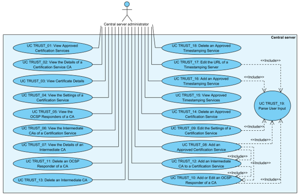

# X-Road: Use Case Model for Trust Service Management
**Analysis**

Version: 1.4  
25.08.2021
<!-- 23 pages-->
Doc. ID: UC-TRUST

-----------------------------------------------------

## Version history

 Date       | Version | Description                                                     | Author
 ---------- | ------- | --------------------------------------------------------------- | --------------------
19.09.2015   | 0.1     | Initial version                                                | Riin Saarmäe
21.09.2015   | 0.2     | Editorial changes made                                         | Imbi Nõgisto
25.10.2015   | 0.3     | Renamed *Scope* to *System*. Renamed *User* to *CS administrator*. Use cases updated according to system developments. Some typos and terms fixed. | Riin Saarmäe
25.10.2015   | 1.0     | Editorial changes made                                         | Riin Saarmäe
04.11.2015   | 1.1     | UC TRUST\_19 added. Minor corrections made.                    | Riin Saarmäe
29.08.2017   | 1.2     |  Changed documentation type from docx to md file |   Lasse Matikainen
06.03.2018   | 1.3     | Moved terms to term doc, added term doc reference and link, added internal MD-doc links | Tatu Repo
25.08.2021   | 1.4     | Update X-Road references from version 6 to 7 | Caro Hautamäki

## Table of Contents

<!-- toc -->

- [1 Introduction](#1-introduction)
    * [1.1 Terms and Abbreviations](#11-terms-and-abbreviations)
    * [1.2 References](#12-references)
- [2 Overview](#2-overview)
- [3 Use Case Model](#3-use-case-model)
    * [3.1 Actors](#31-actors)
    * [3.2 UC TRUST\_01: View Approved Certification Services](#32-uc-trust_01-view-approved-certification-services)
    * [3.3 UC TRUST\_02: View the Details of a Certification Service CA](#33-uc-trust_02-view-the-details-of-a-certification-service-ca)
    * [3.4 UC TRUST\_03: View Certificate Details](#34-uc-trust_03-view-certificate-details)
    * [3.5 UC TRUST\_04: View the Settings of a Certification Service](#35-uc-trust_04-view-the-settings-of-a-certification-service)
    * [3.6 UC TRUST\_05: View the OCSP Responders of a CA](#36-uc-trust_05-view-the-ocsp-responders-of-a-ca)
    * [3.7 UC TRUST\_06: View the Intermediate CAs of a Certification Service](#37-uc-trust_06-view-the-intermediate-cas-of-a-certification-service)
    * [3.8 UC TRUST\_07: View the Details of an Intermediate CA](#38-uc-trust_07-view-the-details-of-an-intermediate-ca)
    * [3.9 UC TRUST\_08: Add an Approved Certification Service](#39-uc-trust_08-add-an-approved-certification-service)
    * [3.10 UC TRUST\_09: Edit the Settings of a Certification Service](#310-uc-trust_09-edit-the-settings-of-a-certification-service)
    * [3.11 UC TRUST\_10: Add or Edit an OCSP Responder of a CA](#311-uc-trust_10-add-or-edit-an-ocsp-responder-of-a-ca)
    * [3.12 UC TRUST\_11: Delete an OCSP Responder of a CA](#312-uc-trust_11-delete-an-ocsp-responder-of-a-ca)
    * [3.13 UC TRUST\_12: Add an Intermediate CA to a Certification Service](#313-uc-trust_12-add-an-intermediate-ca-to-a-certification-service)
    * [3.14 UC TRUST\_13: Delete an Intermediate CA](#314-uc-trust_13-delete-an-intermediate-ca)
    * [3.15 UC TRUST\_14: Delete an Approved Certification Service](#315-uc-trust_14-delete-an-approved-certification-service)
    * [3.16 UC TRUST\_15: View Approved Timestamping Services](#316-uc-trust_15-view-approved-timestamping-services)
    * [3.17 UC TRUST\_16: Add an Approved Timestamping Service](#317-uc-trust_16-add-an-approved-timestamping-service)
    * [3.18 UC TRUST\_17: Edit the URL of a Timestamping Server](#318-uc-trust_17-edit-the-url-of-a-timestamping-server)
    * [3.19 UC TRUST\_18: Delete an Approved Timestamping Service](#319-uc-trust_18-delete-an-approved-timestamping-service)
    * [3.20 UC TRUST\_19: Parse User Input](#320-uc-trust_19-parse-user-input)

<!-- tocstop -->

## License

This work is licensed under the Creative Commons Attribution-ShareAlike
3.0 Unported License. To view a copy of this license, visit
http://creativecommons.org/licenses/by-sa/3.0/.

## 1 Introduction

The purpose of this document is to describe the processes concerning the
management of approved trust services in the X-Road central server.

The use cases include verifications that take place, and the main error
conditions that may be encountered during the described process. The
general system errors that may be encountered in most of the use cases
(e.g., database connection errors or out of memory errors) are not
described in this document.

The use cases assume that the X-Road software components involved in the
use cases are installed and initialised.

The use cases including a human actor (the *level* of the use case is
*user task*) assume that the actor is logged in to the system and has
the access rights required to carry out the use case.

### 1.1 Terms and Abbreviations

See X-Road terms and abbreviations documentation \[[TA-TERMS](#Ref_TERMS)\].

### 1.2 References

1.  \[IG-CS\] X-Road 7. Central Server Installation Guide. Document ID: [IG-CS](../Manuals/ig-cs_x-road_6_central_server_installation_guide.md).

2.  \[SPEC-AL\] Audit Log Events. Document ID: SPEC-AL.

3.  \[UC-GCONF\] Global Configuration Distribution. Document ID: [UC-GCONF](uc-gconf_x-road_use_case_model_for_global_configuration_distribution_1.4_Y-883-8.md).

4.  \[UC-MESS\] Member Communication. Document ID: [UC-MESS](uc-mess_x-road_member_communication_use_case_model.md).

5.  \[X509\] Internet X.509 Public Key Infrastructure Certificate and Certificate
    Revocation List (CRL) Profile, Internet Engineering Task
    Force, 2008.

6.  \[TA-TERMS\] X-Road Terms and Abbreviations. Document ID: [TA-TERMS](../terms_x-road_docs.md).

## 2 Overview

The certification services and timestamping services approved by the
X-Road governing agency provide trust services for the members of an
X-Road instance.

The approved trust services are described in the central server. The
information on the approved trust services is distributed to the
security servers as a part of the global configuration.

The security servers verify that the certificates, OCSP responses and timestamps 
used in the communication process between the X-Road members are provided 
by approved trust services.

## 3 Use Case Model

### 3.1 Actors

The use case model for trust service management in the central server
includes the following actor.

-   **CS administrator** (central server administrator) – a person
    responsible for managing the central server.

Relationships between the actor, system and use cases are described in
Figure 1.

Figure 1. Use case diagram for trust service management

### 3.2 UC TRUST\_01: View Approved Certification Services

**System**: Central server

**Level**: User task

**Component:** Central server

**Actor**: CS administrator

**Brief Description**: CS administrator views the list of certification
services that have been approved and described for this X-Road instance.

**Preconditions**: -

**Postconditions**: The list of approved certification services has been
displayed to CS administrator.

**Trigger**: -

**Main Success Scenario**:

1.  CS administrator selects to view the list of approved certification
    services.

2.  System displays the list of approved certification services. The
    following information is displayed for each certification service.

    -   The value of the subject common name (CN) element from the
        certification service CA certificate is displayed as the name of
        the certification service.

    -   The validity period of the service CA certificate.

    The following user action options are displayed:
    
    -   add an approved certification service: 3.9;
    
    -   view the details of an approved certification service: 3.3;
    
    -   delete an approved certification service: 3.15.

**Extensions**: -

**Related information**: -

### 3.3 UC TRUST\_02: View the Details of a Certification Service CA

**System**: Central server

**Level**: User task

**Component:** Central server

**Actor**: CS administrator

**Brief Description**: CS administrator views the details of an approved
certification service.

**Preconditions**: -

**Postconditions**: The certification service details have been
displayed to CS administrator.

**Trigger**: -

**Main Success Scenario**:

1.  CS administrator selects to view the details of an approved
    certification service.

2.  System displays the following information:

    -   the distinguished name (DN) of the subject of the certification
        service CA certificate;

    -   the distinguished name (DN) of the issuer of the certification
        service CA certificate;

    -   the validity period of the certification service CA certificate.

    The following user action options are displayed:

    -   view the details of the certification service CA certificate: 3.4;
    
    -   view the settings of the certification service CA: 3.5;
    
    -   view the OCSP responders configured for the certification service
        CA: 3.6;
    
    -   view the intermediate CAs configured for the certification service:
        3.7.

**Extensions**: -

**Related information**: -

### 3.4 UC TRUST\_03: View Certificate Details

**System**: Central server

**Level**: User task

**Component:** Central server

**Actor**: CS administrator

**Brief Description**: CS administrator views the contents of a
certificate.

**Preconditions**: -

**Postconditions**: The contents of the certificate have been displayed
to CS administrator.

**Trigger**: -

**Main Success Scenario**:

1.  CS administrator selects to view a certificate.

2.  System displays the following information:

    -   the contents of the certificate;

    -   the SHA-1 hash value of the certificate.

**Extensions**: -

**Related information**:

-   See \[[X509](#Ref_X509)\] for detailed information on the contents of the
    certificate.

### 3.5 UC TRUST\_04: View the Settings of a Certification Service

**System**: Central server

**Level**: User task

**Component:** Central server

**Actor**: CS administrator

**Brief Description**: CS administrator views the settings of a
certification service.

**Preconditions**: -

**Postconditions**: The settings of the certification service have been
displayed to CS administrator.

**Trigger**: -

**Main Success Scenario**:

1.  CS administrator selects to view the settings of a certification
    service.

2.  System displays the following settings.

    -   Usage restrictions for the certificates issued by the
        certification service. The certificates issued by the
        certification service may be used for signing and
        authentication, or they may be used for authentication only.

    -   The fully qualified name of the Java class that describes the
        certificate profile for certificates issued by the certification
        service.

    The following user action options are displayed:

    -   edit the settings of the certification service: 3.10.

**Extensions**: -

**Related information**: -

### 3.6 UC TRUST\_05: View the OCSP Responders of a CA

**System**: Central server

**Level**: User task

**Component:** Central server

**Actor**: CS administrator

**Brief Description**: CS administrator views the OCSP responders
configured for a CA.

**Preconditions**: -

**Postconditions**: The OCSP responders configured for a CA have been
displayed to CS administrator.

**Trigger**: -

**Main Success Scenario**:

1.  CS administrator selects to view the OCSP responders of a CA.

2.  System displays the list of configured OCSP responders. For each
    OCSP responder, the following information is displayed:

    -   the URL of the OCSP server.

    The following user action options are displayed:

    -   add an OCSP responder for the CA: 3.11;
    
    -   view the details of the OCSP responder certificate (if a certificate
        has been uploaded for this OCSP responder): 3.4;
    
    -   edit the information of an OCSP responder: 3.11;
    
    -   delete an OCSP responder from the CA: 3.12.

**Extensions**: -

**Related information**: -

### 3.7 UC TRUST\_06: View the Intermediate CAs of a Certification Service

**System**: Central server

**Level**: User task

**Component:** Central server

**Actor**: CS administrator

**Brief Description**: CS administrator views the intermediate CAs
configured for a certification service.

**Preconditions**: -

**Postconditions**: The list of intermediate CAs have been displayed to
CS administrator.

**Trigger**: -

**Main Success Scenario**:

1.  CS administrator selects to view the intermediate CAs configured for
    a certification service.

2.  System displays the list of intermediate CAs. The following
    information is displayed for each intermediate CA.

    -   The value of the subject common name (CN) element from the
        intermediate CA certificate is displayed as the name of the
        intermediate CA.

    -   The validity period of the intermediate CA certificate.

    The following user action options are displayed:

    -   add an intermediate CA: 3.13;
    
    -   view the details of an intermediate CA: 3.8;
    
    -   delete an intermediate CA: 3.14.

**Extensions**: -

**Related information**: -

### 3.8 UC TRUST\_07: View the Details of an Intermediate CA

**System**: Central server

**Level**: User task

**Component:** Central server

**Actor**: CS administrator

**Brief Description**: CS administrator views the details of an
intermediate CA.

**Preconditions**: -

**Postconditions**: The details of an intermediate CA have been
displayed to CS administrator.

**Trigger**: -

**Main Success Scenario**:

1.  CS administrator selects to view the details of an intermediate CA.

2.  System displays the following information:

    -   the distinguished name (DN) of the subject of the intermediate
        CA certificate;

    -   the distinguished name (DN) of the issuer of the intermediate CA
        certificate;

    -   the validity period of the intermediate CA certificate.

    The following user action options are displayed:

    -   view the details of the intermediate CA certificate: 3.4;
    
    -   view the OCSP responders configured for the intermediate CA: 3.6.

**Extensions**: -

**Related information**: -

### 3.9 UC TRUST\_08: Add an Approved Certification Service

**System**: Central server

**Level**: User task

**Component:** Central server

**Actor**: CS administrator

**Brief Description**: CS administrator adds a certification service to
the list of approved certification services.

**Preconditions**:

-   The certification service has been approved by the X-Road governing
    agency.

-   CS administrator has received the certificates and OCSP responder
    information from the certification service provider that are needed
    to configure the certification service in the central server.

-   A Java class that describes the certificate profile for the
    certification service has been developed.

**Postconditions**: -

**Trigger**: A certification service is approved by the X-Road governing
agency for providing certification services to X-Road members.

**Main Success Scenario**:

1.  CS administrator selects to add an approved certification service.

2.  CS administrator selects and uploads the certification service CA
    certificate file from the local file system.

3.  System verifies that the uploaded file is in DER or PEM format.

4.  System displays the message “Certificate imported successfully” and
    prompts for certification service settings.

5.  CS administrator

    a.  selects whether the certificates issued by the certification
        service can be used only for authentication or also for signing;

    b.  inserts the fully qualified name of the Java class that
        describes the certificate profile for the certification service.

6.  System parses the user input: 3.20.

7.  System verifies, that the Java class that describes the certificate
    profile exists in the system's classpath and saves the changes.

8.  System saves the selected certificate as the certification service
    CA certificate and the settings inserted for the service and
    displays the message “Certification service added successfully”.

9.  System logs the event “Add certification service” to the audit log.

10. CS administrator adds OCSP responders for the certification service
    CA (if the OCSP responder information is not included in the
    certification service CA certificate): 3.11.

11. CS administrator adds intermediate CAs for the certification
    service: 3.13.

**Extensions**:

- 3a. The uploaded file is not in DER or PEM format.
    - 3a.1. System displays the error message: “Failed to upload service CA certificate: Incorrect file format. Only PEM and DER files allowed.”
    - 3a.2. CS administrator selects to reselect and upload the certification service CA certificate. Use case continues from step 3.
        - 3a.2a. CS administrator selects to terminate the use case.

- 5a. CS administrator selects not to edit the certification service settings and terminates the use case.

- 6a. The parsing of the user input terminated with an error message.
    - 6a.1. System displays the termination message of the parsing process.
    - 6a.2. System logs the event “Add certification service failed” to the audit log.
    - 6a.3. CS administrator selects to reinsert the certificate profile class name. Use case continues from step 6.
        - 6a.3a. CS administrator selects to terminate the use case.

- 7a. System did not find the inserted certificate profile class on the classpath.
    - 7a.1. System displays the error message “Certificate profile with name 'X' does not exist.”, where “X” is the inserted class name.
    - 7a.2. System logs the event “Add certification service failed” to the audit log.
    - 7a.3. CS administrator selects to reinsert the certificate profile class name. Use case continues from step 6.
        - 7a.3a. CS administrator selects to terminate the use case.

- 10a. CS administrator selects not to add OCSP responders to the certification service CA (the OCSP responder information is included in the certification service CA certificate).
    - 10a.1. CS administrator terminates the use case.
        - 10a.1a. CS administrator selects to add intermediate CAs for the certification service. Use case continues from step 11.

- 11a. CS administrator selects not to add intermediate CAs for the certification service and terminates the use case.

**Related information**:

-   The audit log is located at /var/log/xroad/audit.log. The data set
    of audit log records is described in the document “X-Road: Audit Log
    Events” \[[SPEC-AL](#Ref_SPEC-AL)\].

### 3.10 UC TRUST\_09: Edit the Settings of a Certification Service

**System**: Central server

**Level**: User task

**Component:** Central server

**Actor**: CS administrator

**Brief Description**: CS administrator edits the settings of a
certification service.

**Preconditions**: -

**Postconditions**: An audit log record for the event has been created.

**Trigger**: The usage restrictions for certificates issued by the
certification service, or the class name that describes the certificate
profile for the certification service, need to be set or changed.

**Main Success Scenario**:

1.  CS administrator selects to edit the settings of a certification
    service.

2.  CS administrator

    -   selects whether the certificates issued by the certification
        service can be used only for authentication or also for signing;

    -   inserts the fully qualified name of the Java class that
        describes the certificate profile for the certification service.

3.  System parses the user input: 3.20.

4.  System verifies, that the Java class that describes the certificate
    profile exists in the system's classpath and saves the changes.

5.  System logs the event “Edit certification service settings” to the
    audit log.

**Extensions**:

- 3a. The parsing of the user input terminated with an error message.
    - 3a.1. System displays the termination message of the parsing process.
    - 3a.2. System logs the event “Edit certification service settings failed” to the audit log.
    - 3a.3. CS administrator selects to reinsert the certificate profile class name. Use case continues from step 3.
        - 3a.3a. CS administrator selects to terminate the use case.

- 4a. System did not find the inserted certificate profile class on the classpath.
    - 4a.1. System displays the error message “Certificate profile with name 'X' does not exist.”, where “X” is the inserted class name.
    - 4a.2. System logs the event “Edit certification service settings failed” to the audit log.
    - 4a.3. CS administrator selects to reinsert the certificate profile class name. Use case continues from step 3.
        - 4a.3a. CS administrator selects to terminate the use case.

**Related information**:

-   The audit log is located at /var/log/xroad/audit.log. The data set
    of audit log records is described in the document “X-Road: Audit Log
    Events” \[[SPEC-AL](#Ref_SPEC-AL)\].

### 3.11 UC TRUST\_10: Add or Edit an OCSP Responder of a CA

**System**: Central server

**Level**: User task

**Component:** Central server

**Actor**: CS administrator

**Brief Description**: CS administrator describes an OCSP responder
service information for a CA.

**Preconditions**: CS administrator has received the OCSP responder
information (URL and/or certificate) from the certification service
provider.

**Postconditions**: -

**Triggers**:

-   An OCSP responder needs to be described for a CA.

-   Step 8 of 3.9.

-   Step 6 of 3.13.

**Main Success Scenario**:

1.  CS administrator selects to add or edit an OCSP responder of a CA.

2.  CS administrator inserts the URL of the OCSP server.

3.  CS administrator selects and uploads the certificate file used by
    the OCSP server to sign OCSP responses from the local file system.

4.  System verifies that the uploaded file is in DER or PEM format.

5.  System parses the user input: 3.20.

6.  System verifies that the inserted URL is in correct format.

7.  System saves the OCSP responder information.

8.  System logs the event “Add OCSP responder of certification service”
    or “Edit OCSP responder”, depending on whether the OCSP responder
    was added or edited, to the audit log.

**Extensions**:

- 3a. CS administrator selects not to upload a certificate for the OCSP responder. Use case continues from step 5.

- 4a. The uploaded file is not in DER or PEM format.
    - 4a.1. System displays the error message: “Failed to upload OCSP responder certificate: Incorrect file format. Only PEM and DER files allowed.”.
    - 4a.2. CS administrator selects to reselect and upload the certificate file. Use case continues from step 4.
        - 4a.2a. CS administrator selects to terminate the use case.

- 5a. The parsing of the user input terminated with an error message.
    - 5a.1. System displays the termination message of the parsing process.
    - 5a.2. System logs the event “Add OCSP responder of certification service failed” or “Edit OCSP responder failed”, depending on whether the OCSP responder was added or edited, to the audit log.
    - 5a.3. CS administrator selects to reinsert the URL. Use case continues from step 3.
        - 5a.3a. CS administrator selects to terminate the use case.

- 6a. The URL is malformed.
    - 6a.1. System displays the error message: “'X' is an invalid URL, examples of valid URL-s: 'http://www.example.com', 'https://www.example.com' ”, where “X” is the inserted URL.
    - 6a.2. System logs the event “Add OCSP responder of certification service failed” or “Edit OCSP responder failed”, depending on whether the OCSP responder was added or edited, to the audit log.
    - 6a.3. CS administrator selects to reinsert the URL. Use case continues from step 3.
        - 6a.3a. CS administrator selects to terminate the use case.

**Related information**:

-   The audit log is located at /var/log/xroad/audit.log. The data set
    of audit log records is described in the document “X-Road: Audit Log
    Events” \[[SPEC-AL](#Ref_SPEC-AL)\].

### 3.12 UC TRUST\_11: Delete an OCSP Responder of a CA

**System**: Central server

**Level**: User task

**Component:** Central server

**Actor**: CS administrator

**Brief Description**: CS administrator removes OCSP responder
information from a CA.

**Preconditions**: -

**Postconditions**:

-   An OCSP responder has been removed from a CA.

-   An audit log record for the event has been created.

**Trigger**: The information about an OCSP responder needs to be removed
from the configuration of an approved certification service.

**Main Success Scenario**:

1.  CS administrator selects to delete an OCSP responder of a CA.

2.  System deletes the OCSP responder information from the system
    configuration.

3.  System logs the event “Delete OCSP responder” to the audit log.

**Extensions**: -

**Related information**:

-   The audit log is located at /var/log/xroad/audit.log. The data set
    of audit log records is described in the document “X-Road: Audit Log
    Events” \[[SPEC-AL](#Ref_SPEC-AL)\].

### 3.13 UC TRUST\_12: Add an Intermediate CA to a Certification Service

**System**: Central server

**Level**: User task

**Component:** Central server

**Actor**: CS administrator

**Brief Description**: CS administrator configures an intermediate CA
for a certification service.

**Preconditions**: -

**Postconditions**: An audit log record for the event has been created.

**Triggers**:

-   An intermediate CA needs to be described for the certification
    service.

-   Step 9 of 3.9.

**Main Success Scenario**:

1.  CS administrator selects to add an intermediate CA to a
    certification service.

2.  CS administrator selects and uploads the intermediate CA certificate
    file from the local file system.

3.  System verifies that the selected file is in DER or PEM format.

4.  System saves the selected certificate as the intermediate CA
    certificate and displays the message “Intermediate CA added
    successfully”.

5.  System logs the event “Add intermediate CA” to the audit log.

6.  CS administrator adds OCSP responders for the intermediate CA (if
    the OCSP responder information is not included in the intermediate
    CA certificate): 3.11.

**Extensions**:

- 3a. The selected file is not in DER or PEM format.
    - 3a.1. System displays the error message: “Failed to upload intermediate CA certificate: Incorrect file format. Only PEM and DER files allowed.”
    - 3a.2. System logs the event “Add intermediate CA failed” to the audit log.
    - 3a.2. CS administrator selects to reselect and upload the intermediate CA certificate. Use case continues from step 3.
        - 3a.2a. CS administrator selects to terminate the use case.

- 6a. CS administrator selects not to add OCSP responders to the intermediate CA (the OCSP responder information is included in the intermediate CA certificate) and terminates the use case.

**Related information**:

-   The audit log is located at /var/log/xroad/audit.log. The data set
    of audit log records is described in the document “X-Road: Audit Log
    Events” \[[SPEC-AL](#Ref_SPEC-AL)\].

### 3.14 UC TRUST\_13: Delete an Intermediate CA

**System**: Central server

**Level**: User task

**Component:** Central server

**Actor**: CS administrator

**Brief Description**: CS administrator deletes an intermediate CA from
a certification service.

**Preconditions**: -

**Postconditions**:

-   The information about an intermediate CA has been deleted.

-   An audit log record for the event has been created.

**Trigger**: An intermediate CA needs to be removed from a certification
service.

**Main Success Scenario**:

1.  CS administrator selects to delete an intermediate CA from a
    certification service.

2.  System deletes the intermediate CA information from the system
    configuration.

3.  System logs the event “Delete intermediate CA” to the audit log.

**Extensions**: -

**Related information**:

-   The audit log is located at /var/log/xroad/audit.log. The data set
    of audit log records is described in the document “X-Road: Audit Log
    Events” \[[SPEC-AL](#Ref_SPEC-AL)\].

### 3.15 UC TRUST\_14: Delete an Approved Certification Service

**System**: Central server

**Level**: User task

**Component:** Central server

**Actor**: CS administrator

**Brief Description**: CS administrator deletes an approved
certification service.

**Preconditions**: -

**Postconditions**: -

**Trigger**: An approved certification service needs to be removed from
the system configuration.

**Main Success Scenario**:

1.  CS administrator selects to delete an approved certification
    service.

2.  System prompts for confirmation.

3.  CS administrator confirms.

4.  System deletes the approved certification service information from
    the system configuration.

5.  System logs the event “Delete certification service” to the audit
    log.

**Extensions**:

- 3a. CS administrator selects not to delete the approved certification service and terminates the use case.

**Related information**:

-   The audit log is located at /var/log/xroad/audit.log. The data set
    of audit log records is described in the document “X-Road: Audit Log
    Events” \[[SPEC-AL](#Ref_SPEC-AL)\].

-   The certificates issued by the deleted certification service can no
    longer be used in the X-Road system.

### 3.16 UC TRUST\_15: View Approved Timestamping Services

**System**: Central server

**Level**: User task

**Component:** Central server

**Actor**: CS administrator

**Brief Description**: CS administrator views the approved timestamping
services configured for this X-Road instance.

**Preconditions**: -

**Postconditions**: The list of approved timestamping services has been
displayed to CS administrator.

**Trigger**: -

**Main Success Scenario**:

1.  CS administrator selects to view approved timestamping services.

2.  System displays the list of timstamping services. The following
    information is displayed for each timestamping service.

    -   The value of the subject common name (CN) element from the TSA
        certificate is displayed as the name of the timestamping
        service.

    -   The validity period of the certificate of the TSA.

    The following user action options are displayed:

    -   add an approved timestamping service: 3.17;
    
    -   view the details of a TSA certificate: 3.4;
    
    -   edit the timestamping server URL of an approved timestamping
        service: 3.18;
    
    -   delete an approved timestamping service: 3.19.

**Extensions**: -

**Related information**: -

### 3.17 UC TRUST\_16: Add an Approved Timestamping Service

**System**: Central server

**Level**: User task

**Component:** Central server

**Actor**: CS administrator

**Brief Description**: CS administrator adds a timestamping service to
the list of approved timestamping services.

**Preconditions**:

-   The timestamping service has been approved by the X-Road governing
    agency.

-   CS administrator has received the information from the timestamping
    service provider that is needed to configure the timestamping
    service in the central server.

**Postconditions**: -

**Trigger**: A timestamping service is approved by the X-Road governing
agency for providing timestamping services to X‑Road members.

**Main Success Scenario**:

1.  CS administrator selects to add an approved timestamping service.

2.  CS administrator inserts the URL of the timestamping server.

3.  CS administrator selects and uploads the TSA certificate file from
    the local file system.

4.  System verifies that the uploaded file is in DER or PEM format and
    displays the message “Certificate imported successfully”.

5.  System parses the user input: 3.20.

6.  System verifies that the inserted URL is in correct format.

7.  System verifies, that an approved timestamping service with the
    inserted URL and certificate does not already exist in the system
    configuration.

8.  System saves the timestamping service information.

9.  System logs the event “Add timestamping service” to the audit log.

**Extensions**:

- 4a. The uploaded file is not in DER or PEM format.
    - 4a.1. System displays the error message: “Failed to upload approved TSA certificate: Incorrect file format. Only PEM and DER files allowed.”.
    - 4a.2. CS administrator selects to reselect and upload the certificate file. Use case continues from step 4.
        - 4a.2a. CS administrator selects to terminate the use case.

- 5a. The parsing of the user input terminated with an error message.
    - 5a.1. System displays the termination message of the parsing process.
    - 5a.2. System logs the event “Add timestamping service failed” to the audit log.
    - 5a.3. CS administrator selects to reinsert the URL. Use case continues  from step 5.
        - 5a.3a. CS administrator selects to terminate the use case.

- 6a. The URL is malformed.
    - 6a.1. System displays the error message: “Timestamping server URL 'X' is an invalid URL, examples of valid URL-s: 'http://www.example.com', 'https://www.example.com'”, where “X” is the inserted URL.
    - 6a.2. System logs the event “Add timestamping service failed” to the audit log.
    - 6a.3. CS administrator selects to reinsert the URL. Use case continues from step 5.
        - 6a.3a. CS administrator selects to terminate the use case.

- 7a. An approved timestamping service with the inserted URL and certificate already exists.
    - 7a.1. System displays the error message “An approved timestamping service with the inserted URL and certificate already exists”.
    - 7a.2. System logs the event “Add timestamping service failed” to the audit log.
    - 7a.3. CS administrator selects to reinsert the URL. Use case continues from step 5.
        - 7a.3a. CS administrator selects to reselect and upload the certificate file. Use case continues from step 4.
        - 7a.3b. CS administrator selects to terminate the use case.

**Related information**:

-   The audit log is located at /var/log/xroad/audit.log. The data set
    of audit log records is described in the document “X-Road: Audit Log
    Events” \[[SPEC-AL](#Ref_SPEC-AL)\].

### 3.18 UC TRUST\_17: Edit the URL of a Timestamping Server

**System**: Central server

**Level**: User task

**Component:** Central server

**Actor**: CS administrator

**Brief Description**: CS administrator edits the URL of a timestamping
server.

**Preconditions**: -

**Postconditions**: An audit log record for the event has been created.

**Trigger**: The URL on which the timestamping service is being provided
has changed.

**Main Success Scenario**:

1.  CS administrator selects to edit the URL of a timestamping server.

2.  CS administrator inserts the URL.

3.  System parses the user input: 3.20.

4.  System verifies that the inserted URL is in correct format.

5.  System saves the timestamping URL, replacing the previous value.

6.  System logs the event “Edit timestamping service” to the audit log.

**Extensions**:

- 3a. The parsing of the user input terminated with an error message.
    - 3a.1. System displays the termination message of the parsing process.
    - 3a.2. System logs the event “Edit timestamping service failed” to the audit log.
    - 3a.3. CS administrator selects to reinsert the URL. Use case continues from step 3.
        - 3a.3a. CS administrator selects to terminate the use case.

- 4a. The URL is malformed.
    - 4a.1. System displays the error message: “Timestamping server URL 'X' is an invalid URL, examples of valid URL-s: 'http://www.example.com', 'https://www.example.com'”, where “X” is the inserted URL.
    - 4a.2. System logs the event “Edit timestamping service failed” to the audit log.
    - 4a.3. CS administrator selects to reinsert the URL. Use case continues from step 3.
        - 4a.3a. CS administrator selects to terminate the use case.

**Related information**:

-   The audit log is located at /var/log/xroad/audit.log. The data set
    of audit log records is described in the document “X-Road: Audit Log
    Events” \[[SPEC-AL](#Ref_SPEC-AL)\].

### 3.19 UC TRUST\_18: Delete an Approved Timestamping Service

**System**: Central server

**Level**: User task

**Component:** Central server

**Actor**: CS administrator

**Brief Description**: CS administrator deletes an approved timestamping
service.

**Preconditions**: -

**Postconditions**: -

**Trigger**: An approved timestamping service needs to be removed from
the system configuration.

**Main Success Scenario**:

1.  CS administrator selects to delete an approved timestamping service.

2.  System prompts for confirmation.

3.  CS administrator confirms.

4.  System deletes the approved timestamping service information from
    the system configuration.

5.  System logs the event “Delete timestamping service” to the audit
    log.

**Extensions**:

- 3a. CS administrator selects not to delete the approved timestamping service and terminates the use case.

**Related information**:

-   The audit log is located at /var/log/xroad/audit.log. The data set
    of audit log records is described in the document “X-Road: Audit Log
    Events” \[[SPEC-AL](#Ref_SPEC-AL)\].

### 3.20 UC TRUST\_19: Parse User Input

**System**: Central server

**Level**: Subfunction

**Component:** Central server

**Actors**: -

**Brief Description**: System removes the leading and trailing
whitespaces from the user input and verifies that the required fields
are not empty.

**Preconditions**: -

**Postconditions**: -

**Triggers**:

-   Step 6 of 3.9.

-   Step 3 of 3.10.

-   Step 5 of 3.11.

-   Step 5 of 3.17.

-   Step 3 of 3.18.

**Main Success Scenario**:

1.  System removes leading and trailing whitespaces.

2.  System verifies that the mandatory fields are filled.

3.  System verifies that the user input does not exceed 255 characters.

**Extensions**:

- 2a. One or more mandatory fields are not filled.
    - 2a.1. Use case terminates with the error message “Missing parameter: 'X'”, where “X” is the name of the missing parameter.

- 3a. The user input exceeds 255 symbols.
    - 3a.1. Use case terminates with the error message “Parameter X input exceeds 255 characters”, where “X” is the name of the parameter that had more than 255 characters inserted.

**Related information**: -
