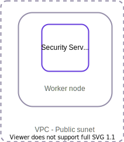
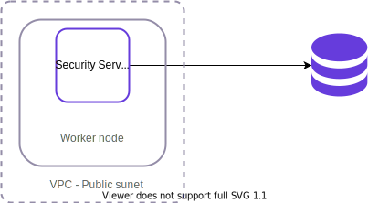

# Kubernetes Security Server Sidecar User Guide <!-- omit in toc -->

## Version history <!-- omit in toc -->

 Date       | Version | Description                                                     | Author
 ---------- | ------- | --------------------------------------------------------------- | --------------------
 05.01.2021 | 1.0     | Initial version                                                 | Alberto Fernandez Lorenzo

## Table of Contents

* [1 Introduction](#1-introduction)
  * [1.1 Target Audience](#11-target-audience)
* [2 Deployment Options](#2-deployment-options)
  * [2.1 Single Pod Deployment with internal database](#21-single-pod-deployment-with-internal-database)
  * [2.2 Single Pod Deployment with external database](#22-single-pod-deployment-with-external-database)
  * [2.3 Multiple Pods using a Load Balancer](#23-multiple-pods-using-a-load-balancer)
* [3 X-Road Security Server Sidecar images for Kubernetes](#3-x-road-security-server-sidecar-images-for-kubernetes)
* [4 Installation](#4-installation)
  * [4.1 Minimum system requirements](#41-minimum-system-requirements)
  * [4.2 Prerequisites to Installation](#42-prerequisites-to-installation)
  * [4.3 Network configuration](#43-network-configuration)
  * [4.4 Reference Data](#44-reference-data)
  * [4.5 Installation Instructions](#45-installation-instructions)
    * [4.5.1 Namespaces](#451-namespaces)
    * [4.5.2 Single Pod deployment](#452-single-pod-deployment)
    * [4.5.3 Kubernetes Volumes](#453-kubernetes-volumes)
      * [4.5.3.1 Persistent Volume Claim](#4531-persistent-volume-claim)
      * [4.5.3.2 Persistent Volumes](#4532-persistent-volumes)
        * [4.5.3.2.1 Persistent Volume hostPath](#45321-persistent-volume-hostpath)
        * [4.5.3.2.2 Persistent Volume awsElasticBlockStore](#45322-persistent-volume-awselasticblockstore)
        * [4.5.3.2.3 Persistent Volume AWS Elastic File System](#45323-persistent-volume-aws-elastic-file-system)
        * [4.5.3.2.4 AWS EBS vs AWS EFS](#45324-aws-ebs-vs-aws-efs)
      * [4.5.3.3 Manage Volumes](#4533-manage-volumes)
      * [4.5.3.4 Mount the Volume to a Pod](#4534-mount-the-volume-to-a-pod)
      * [4.5.3.5 Persistent Volume permissions](#4535-persistent-volume-permissions)
    * [4.5.4 Kubernetes Secrets](#454-kubernetes-secrets)
    * [4.5.4.1 Store keys in Secrets](#4541-store-keys-in-secrets)
      * [4.5.4.2 Secrets for environmental variables](#4542-secrets-for-environmental-variables)
      * [4.5.4.3 Consume secrets](#4543-consume-secrets)
    * [4.5.5 Kubernetes jobs readiness, liveness and startup probes](#455-kubernetes-jobs-readiness-liveness-and-startup-probes)
      * [4.5.5.1 Readiness probes](#4551-readiness-probes)
      * [4.5.5.2 Liveness probes](#4552-liveness-probes)
      * [4.5.5.3 Startup probes](#4553-startup-probes)
    * [4.5.6 Multiple Pods using a Load Balancer deployment](#456-multiple-pods-using-a-load-balancer-deployment)
      * [4.5.6.1 Prerequisites](#4561-prerequisites)
      * [4.5.6.2 Primary Pod installation](#4562-primary-pod-installation)
      * [4.5.6.3 Secondary Pods installation](#4563-secondary-pods-installation)
* [5 Backup and Restore](#5-backup-and-restore)
* [6 Monitoring](#6-monitoring)
  * [6.1 Setup Container Insights on AWS EKS](#61-setup-container-insights-on-aws-eks)
* [7 Version update](#7-version-update)
* [8 Message logs and disk space](#8-message-logs-and-disk-space)
* [9 Setup example](#8-setup-example)

## 1 Introduction

### 1.1 Target Audience

This User Guide is meant for X-Road Security Server system administrators responsible for installing and using X-Road Security Server Sidecar in AWS EKS environment.

The document is intended for readers with a moderate knowledge of Linux server management, computer networks, Docker, Kubernetes, AWS EKS and X-Road.

## 2 Deployment Options

### 2.1 Single Pod Deployment with internal database

The simplest deployment option is to use a single Pod that runs a Security Server Sidecar container with a local database running inside the container.

<p align="center">
  
</p>

With this deployment, the Pod will be assigned a private IP and will only be accessible from within the private network. It is possible to assign a public IP to the Pod by deploying a Service that references the Pod.
We recommend using this deployment only for testing or developing environments since it does not allow scaling of nodes or pods.

### 2.2 Single Pod Deployment with external database

This deployment is the same as the previous deployment except that it uses an external database.
The database can be:

* outside the VPC with allowed access from the Pod
* in the same VPC
* in the same cluster deployed on another pod.

<p align="center">
  
</p>

You can find more information about [using an external database on the Security Server Sidecar](https://github.com/nordic-institute/X-Road-Security-Server-sidecar/blob/master/doc/security_server_sidecar_user_guide.md#27-external-database)

### 2.3 Multiple Pods using a Load Balancer

With this deployment, you can to scale the number of Nodes and Pods that you have on your cluster. All of the Pods will point to the same external database.

We recommend this deployment for a production environment.

There are 4 types of objects within this deployment:

* **Primary Pod**: This Pod will be in charge of handling the configuration of the Security Server Sidecar Database, the storage and backups of the message logs and the configuration backups. This Pod will be unique per deployment.
* **"n" number of Secondary Pods**: These pods will be in charge of processing the messages. These Pods will not change the configuration. They will isntead synchronize the configuration of the Primary Pod via SSH during the initialization and in a CRON job running each minute.
* **Headless service**: This will refer to the Primary Pod and will be used so that the secondary pods can connect to the primary one through a fixed DNS.
* **Network Load Balancer**: This will redirect the traffic between the Secondary Pods. The users will send the messages through this Load Balancer public IP (We can use the private IP in case we are on the same VPC).

<p align="center">
  
</p>

## 3 X-Road Security Server Sidecar images for Kubernetes

All of the X-Road Security Server Sidecar images described in the [Security Server user guide](https://github.com/nordic-institute/X-Road-Security-Server-sidecar/blob/master/doc/security_server_sidecar_user_guide.md#22-x-road-security-server-sidecar-images) are suitable to be used for a Kubernetes deployment. Additionally, there are images suitable to be used for a Load Balancer Kubernetes deployment as described in [2.3 Multiple Pods using a Load Balancer](#23-multiple-pods-using-a-load-balancer). These images include the necessary configuration so that the Pods can act as Primary or Secondary and connect through SSH.

**Image**                                                | **Description**
------------------------------------------------------------ | -----------------------------------------------------------------------------------------------------------------
niis/xroad-security-server-sidecar:&lt;version&gt;-slim-primary      | Image for the Primary Pod deployment using the slim version of the Security Server Sidecar
niis/xroad-security-server-sidecar:&lt;version&gt;-slim-secondary    | Image for the Secondary Pod deployment using the slim version of the Security Server
niis/xroad-security-server-sidecar:&lt;version&gt;-primary          | Image for the Primary Pod deployment using the regular (with message logging and operational monitor) version of the Security Server
niis/xroad-security-server-sidecar:&lt;version&gt;-secondary        | Image for the Secondary Pod deployment using the regular (with message logging and operational monitor) version of the Security Server.
niis/xroad-security-server-sidecar:&lt;version&gt;-slim-primary-fi      | Image for the Primary Pod deployment using the slim version of the Security Server Sidecar with Finnish settings
niis/xroad-security-server-sidecar:&lt;version&gt;-slim-secondary-fi    | Image for the Secondary Pod deployment using the slim version of the Security Server with Finnish settings
niis/xroad-security-server-sidecar:&lt;version&gt;-primary-fi          | Image for the Primary Pod deployment using the regular (with message logging and operational monitor) version of the Security Server with Finnish settings
niis/xroad-security-server-sidecar:&lt;version&gt;-secondary-fi        | Image for the Secondary Pod deployment using the regular (with message logging and operational monitor) version of the Security Server with Finnish settings

## 4 Installation

### 4.1 Minimum system requirements

* An AWS EKS cluster with at least one Linux EC2 instance. The instance type will depend on the number of resources required. For example, an instance of type "t3.medium" could support approximately 5 Security Server Sidecar Pods running simultaneously.

### 4.2 Prerequisites to Installation

* The latest AWS CLI and eksctl command line utility must be installed. To install them go through the steps described on the page:[Getting started with Amazon EKS](https://docs.aws.amazon.com/eks/latest/userguide/getting-started-eksctl.html).
* You must be authenticated to access the AWS resources through the AWS CLI. See instructions on how to [authenticate access through the AWS CLI](https://aws.amazon.com/premiumsupport/knowledge-center/authenticate-mfa-cli/).
* You must upload an SSH key to "Key Pairs" section in Amazon EC2. See instructions on how to [create or upload a key pair](https://docs.aws.amazon.com/AWSEC2/latest/UserGuide/ec2-key-pairs.html#prepare-key-pair).

### 4.3 Network configuration

The table below lists the required connections between different components.

**Connection Type** | **Source** | **Target** | **Target Ports** | **Protocol** | **Note** |
-----------|------------|-----------|-----------|-----------|-----------|
Out | Security Server | Central Server | 80, 4001 | tcp | |
Out | Security Server | Management Security Server | 5500, 5577 | tcp | |
Out | Security Server | OCSP Service | 80 / 443 | tcp | |
Out | Security Server | Timestamping Service | 80 / 443 | tcp | |
Out | Security Server | Data Exchange Partner Security Server (Service Producer) | 5500, 5577 | tcp | |
Out | Security Server | Producer Information System | 80, 443, 8080 | tcp | Target in the internal network |
Out  | SSH synchronization | Security Server | 22 | tcp | |
In  | Monitoring Security Server | Security Server | 5500, 5577 | tcp | |
In  | Data Exchange Partner Security Server (Service Consumer) | Security Server | 5500, 5577 | tcp | |
In | Consumer Information System | Security Server | 80, 443, 8080  | tcp | Source in the internal network |
In | Admin | Security Server | &lt;ui port&gt; (**reference data 1.2**) | tcp | Source in the internal network |
In  | Healthcheck | Security Server | 5588 | tcp | |
In  | SSH synchronization | Security Server | 22 | tcp | |

### 4.4 Reference Data

This is an extension of the Security Server Sidecar [Reference Data](https://github.com/nordic-institute/X-Road-Security-Server-sidecar/blob/master/doc/security_server_sidecar_user_guide.md#23-reference-data)

**Ref** | **Value**                                | **Explanation**
------- | ----------------------------------------- | ----------------------------------------------------------
3.1    | &lt;namespace name&gt;                    | Name of the Kubernetes namespace for provisioning the set of Kubernetes objects inside the cluster.
3.2    | &lt;pod name&gt;                          | Unique name that identifies a Pod inside a Cluster namespace. If the Pod belongs to a deployment object a unique alphanumeric code will be concatenated to distinguish it from the other pods inside the deployment.
3.3    | &lt;pod label&gt;                         | Label that identifies a set of objects. This is used, for example, so that a Load Balancer can know to which Pods it has to redirect.
3.4    | &lt;pvc name&gt;                         | Unique name that identifies the PersistentVolumeClaim inside a Cluster namespace.
3.5    | &lt;volume storage class name&gt;        | Name that matches the PVC with the PV for dynamic provisioning.
3.6    | &lt;volume access mode&gt;             | Defines the access mode to the volume, typically "ReadWriteOnce" which allows Read/Write access to a single Pod at a time. "ReadWriteMany" could be used for EFS volumes which allows multiple Pods access at the same time.
3.7    | &lt;volume size&gt;                       | Requested volume size, for example: 5Gi
3.8    | &lt;pv name&gt;                           | Unique name that identifies the PersistentVolume.
3.9    | &lt;pv host path&gt;                      | Path to the file or directory to mount in the PersistentVolume.
3.10    | &lt;awsElasticBlockStore volume id&gt;   | Volume ID of an AWS Elastic Block Store volume.
3.11    | &lt;efs volume id&gt;                    | Volume ID of an AWS Elastic File System volume.
3.12    | &lt;container name&gt;                    | Name of the image container deployed in a Kubernetes pod.
3.13    | &lt;manifest volume name&gt;  | Unique name that identifies a volume inside a manifest.
3.14    | &lt;secret name&gt;            | Unique name that identifies a secret inside a Cluster namespace.
3.15    | &lt;service name&gt;           | Unique name that identifies a Kubernetes Service object
3.16    | &lt;pod private ip&gt;           | private IP of a single Pod.
3.17    | &lt;load balancer private ip&gt;  | Fixed private IP of a Load Balancer, defined on a Kubernetes manifest.
3.18    | &lt;number replicas&gt;           | Number of Pod replicas to be deployed.
3.19    | &lt;service selector&gt;           | Name that identifies a Load Balancer with the Pods.
3.20    | &lt;primary DNS&gt;           | DNS of the service that identifies the Primary Pod composed by &lt;service name&gt;.&lt;namespace name&gt;.svc.cluster.local .
3.21    | &lt;cluster name&gt;           | Name of the AWS EKS cluster.
3.22    | &lt;cluster region&gt;           | Region where the AWS EKS cluster is deployed.
3.23    | &lt;cloudwatch agent name&gt;           | Name of the CloudWatch agent that collects the logs and metrics of the AWS EKS cluster. This name is automatically generated during the CloudWatch setup.
3.24    | &lt;volume mount path&gt;           | Local path on the EC2 instance where the volume is mounted.
3.25    | &lt;bucket name&gt;           | Name of an AWS S3 bucket.
3.26    | &lt;arn encryption key&gt;           | ARN encryption key used in an AWS S3 bucket, example: arn:aws:kms:eu-west-1:999999999:alias/aws/s3.

### 4.5 Installation Instructions

#### 4.5.1 Namespaces

We recommended using namespaces in a Kubernetes deployment since namespaces will allow you to organize the resources of a shared cluster better.
The use of a namespace for the Security Server Sidecar resources is optional. If no namespace is created, they will be included in the "default" namespace.

Create a new namespace by running (**reference data: 3.1**):

```bash
kubectl create namespace <namespace name>
```

#### 4.5.2 Single Pod deployment

For installing the scenario described in [2.1 Single Pod Deployment with internal database](#21-single-pod-deployment-with-internal-database) it is possible to use the following "yaml" manifest (**reference data: 3.1, 3.2, 3.12, 1.4, 1.5, 1.6, 1.10**):

``` yaml
apiVersion: v1
kind: Pod
metadata:
  name: <pod-name>
  namespace: <namespace name>
spec:
  containers:
  - name: <container name>
    image: niis/xroad-security-server-sidecar:<image tag>
    imagePullPolicy: "Always"
    env:
    - name: XROAD_TOKEN_PIN
      value: "<token pin>"
    - name: XROAD_ADMIN_USER
      value: "<admin user>"
    - name: XROAD_ADMIN_PASSWORD
      value: "<admin password>"
    - name: XROAD_DB_HOST
      value: "127.0.0.1"
    - name: XROAD_LOG_LEVEL
      value: "<xroad log level>"
    ports:
    - containerPort: 443
    - containerPort: 4000
    - containerPort: 5500
    - containerPort: 5577
```

Any of the Security Server Sidecar images described in the [Security Server Sidecar user guide](https://github.com/nordic-institute/X-Road-Security-Server-sidecar/blob/master/doc/security_server_sidecar_user_guide.md#22-x-road-security-server-sidecar-images) can be used as image tag.
Optionally, you can use an external database by adding the following environment variables of the deployment (**reference data: 1.7, 1.8, 1.9, 1.11**):

``` yaml
    - name: XROAD_DB_HOST
      value: "<database host>"
    - name: XROAD_DB_PORT
      value: "<database port>"
    - name: XROAD_DB_PWD
      value: "<xroad db password>"
    - name: XROAD_DATABASE_NAME
      value: "<database name>"
```

Once the deployment is ready save it on a file and run:

```bash
kubectl apply -f /path/to/manifest-file-name.yaml
```

Check that the Pod is deployed by running (**reference data: 3.1**):

```bash
kubectl get pods -n <namespace name>
```

Get the Pod information by running (**reference data: 3.1, 3.2**):

```bash
kubectl describe pod -n <namespace name> <pod name>
```

Get a shell to the container running in the Pod by running (**reference data: 3.1, 3.2**):

```bash
kubectl exec -it -n <namespace name> <pod name> bash
```

Delete the Pod by running:

```bash
kubectl delete -f /path/to/manifest-file-name.yaml
```

#### 4.5.3 Kubernetes Volumes

Kubernetes volumes can be used to store different things, such as the configuration of the Security Server Sidecar or its message logs, and to ensure that those can be shared across different Pods and persisted when the Pods are deleted or updated.

##### 4.5.3.1 Persistent Volume Claim

First, you have to create a Persistent Volume Claim (PVC) to request physical storage. Persistent Volume Claim is a way for developers to "claim" durable storage without knowing the details of the particular volume implementation type.
Create the PVC manifest and save it in a "yaml" file **(reference data: 3.1, 3.4, 3.5, 3.6, 3.7)**:

``` yaml
apiVersion: v1
kind: PersistentVolumeClaim
metadata:
  name: <pvc name>
  namespace: <namespace name>
spec:
  storageClassName: <volume storage class name>
  accessModes:
    - <volume access mode>
  resources:
    requests:
      storage: <volume size>
```

Deploy the PVC manifest:

```bash
kubectl apply -f /path/to/pvc_file_name.yaml
```

##### 4.5.3.2 Persistent Volumes

Kubernetes has multiple types of **PV(Persistent Volumes)** that can be found on the [Kubernetes official documentation](https://Kubernetes.io/docs/concepts/storage/volumes/#volume-types).
The described scenario is focused on 3 types of persistent volumes that you can use in AWS: hostPath, awsElasticBlockStore and AWS EFS (Elastic File System) (using CSI, a Container Storage Interface that defines a standard interface for container orchestration systems).

###### 4.5.3.2.1 Persistent Volume hostPath

A "hostPath" persistent volume mounts a file or directory from the host node's filesystem into your Pod. This is the fastest way of creating a persistent volume, but we recommend using it only for testing or developing purposes in a single Node scenario since only the Pods running on the same Node instance could access to it. Also, it does not offer any backup solution which means that the information could be lost if the Node instance is terminated.

Create the PV manifest and save it in a "yaml" file **(reference data: 3.1, 3.5, 3.6, 3.7, 3.8, 3.9)**:

``` yaml
apiVersion: v1
kind: PersistentVolume
metadata:
  name: <pv name>
  labels:
    usage: <namespace name>
spec:
  storageClassName: <volume storage class name>
  capacity:
    storage: <volume size>
  accessModes:
    - <volume access mode>
  persistentVolumeReclaimPolicy: Recycle
  hostPath:
    path: "<pv host path>"
```

###### 4.5.3.2.2 Persistent Volume awsElasticBlockStore

An "awsElasticBlockStore" persistent volume mounts an AWS EBS volume into our Pod. It offers an easy way of backing up and keeping the information even if the Node is deleted. We recommend using this persistent volume type only for production environment in a single Node instance scenario since the "awsElasticBlockStore" can be attached only to one single instance at a time.

1. First, we need to create an Elastic Block Store Volume from the AWS console, then attach it to the Cluster Node instance by filling "/dev/xvdf" on the device property.
2. Once you have created the volume, copy the ID, then create a PV manifest and save it to a "yaml" file **(reference data: 3.1, 3.5, 3.6, 3.7, 3.8, 3.9, 3.10)**:

    ``` yaml
    apiVersion: v1
    kind: PersistentVolume
    metadata:
    name: <pv name>
    labels:
      usage: <namespace name>
    spec:
    storageClassName: <volume storage class name>
    capacity:
      storage: <volume size>
    accessModes:
      - <volume access mode>
    persistentVolumeReclaimPolicy: Recycle
    awsElasticBlockStore:
      fsType: "ext4"
      volumeID: "<awsElasticBlockStore volume id>"
    ```

3. Verify that the volume has been created by getting the volume info by running the following AWS CLI command (Authentication through the AWS CLI is required):

    ```bash
    aws --region <cluster region> ec2 describe-volumes --volume-id <awsElasticBlockStore volume id>
    ```

4. Copy the property "Device" from the output of the previous command. Run the following commands on the cluster instance where the volume was mounted to get more information about the free disk space and the mount point:

```bash
df -hT <device>
lsblk <device>
```

###### 4.5.3.2.3 Persistent Volume AWS Elastic File System

It is possible to mount an AWS EFS volume into your Pod by using the Container Storage Interface (CSI) provided by Kubernetes. We recommend this type of volume for a production environment in a multiple Node scenario since it can be mounted on multiple Node instances.

1. First, you have to create an Elastic File System from the AWS admin console, configure the security groups and allow access from the Cluster Node instances.

2. Deploy on the Cluster the AWS EFS CSI driver. The Amazon EFS Container Storage Interface (CSI) driver provides a CSI interface that allows Kubernetes clusters that are running on AWS to manage the lifecycle of Amazon EFS file systems.

    ```bash
    kubectl apply -k "github.com/Kubernetes-sigs/aws-efs-csi-driver/deploy/Kubernetes/overlays/stable/ecr/?ref=release-1.0"
    ```

3. Copy the volume ID and create a PV manifest and save it to a "yaml" file **(reference data: 3.1, 3.5, 3.6, 3.7, 3.8, 3.11)**:

    ``` yaml
    apiVersion: v1
    kind: PersistentVolume
    metadata:
    name: <pv name>
    labels:
      usage: <namespace name>
    spec:
    capacity:
      storage: <volume size>
    storageClassName: <volume storage class name>  
    volumeMode: Filesystem
    accessModes:
    - <volume access mode>
    persistentVolumeReclaimPolicy: Retain
    csi:
      driver: efs.csi.aws.com
      volumeHandle: <efs volume id>
    ```

4. Verify the creation is created by getting the volume info running the following AWS CLI command (Authentication through the AWS CLI is required) (**reference data: 3.11**):

    ```bash
    aws efs describe-mount-targets --file-system-id <efs volume id>
    ```

5. You can mount the volume in any Cluster Node instance by running from the Cluster Node Instance where the volume is going to be mounted (**reference data: 3.11, 3.22**):

    ```bash
    sudo mount -t nfs -o nfsvers=4.1,rsize=1048576,wsize=1048576,hard,timeo=600,retrans=2,noresvport <efs volume id>.efs.<cluster region>.amazonaws.com:/ <local folder>
    ```

###### 4.5.3.2.4 AWS EBS vs AWS EFS

The table below shows a comparison of the main differences between AWS EBS and AWS EFS and when it is recommended to use each option. The table helps you to choose the best alternative between AWS EBS and EFS volumes.

|     | **AWS EBS**                                          | AWS EFS                                   |
| --- | ---------------------------------------------------- | ----------------------------------------- |
| Price | Cheaper | More Expensive |
| Storage  | 16 TB max. No limits in file size. Data stored stays in the same availability zone. Replicas are made within the availability zone for higher durability. | No Limits.47,9TB Maximum file size. Data stored in AWS EFS stays in the region. Replicas are made within the region. |
| Performance | Manually scaled without stopping the instance. It's faster, baseline performance of 3 IOPS per GB for General Purpose volume | Automatically scaled. Supports up to 7000 file system operations per second. |
| Data access | Can only be mounted in a single EC2 instance. EBS PV provides only ReadWriteOnce access mode. (this means it can only be used by a single pod at the same time).Multi attach it's a new feature but it's only available in us-east-1, us-west-2, eu-west-1, and ap-northeast-2 regions. | Can be mounted in multiple EC2 (from 1 to 1000) instances and accessed at the same time. EFS PV provides ReadWriteMany access mode. |
| Durability | 20 times more reliable than normal hard disks | Highly durable (No public SLA) |
| Availability | 99.99% available. Cannot withstand availability zone failure without snapshots. | Highly available service. No public SLA. Every file system object is redundantly stored across multiple Availability Zones so it can survive one AZ failure. |
| Backup | Provides point in time snapshots, which are backed up to AWS S3 and can be _copied across the regions. | EFS doesn’t support any backup mechanism so you need to setup backup manually. You have to use AWS backup. |
| When to use | Single node scenario. When you want a cost-effective solution. You want a faster option. You do not want to worry about scalability. The amount of data is not that big. Create and recover backups in an easy way | Multiple node scenario. You need concurrent access. You want automatic scalability. The amount of data is big. |

##### 4.5.3.3 Manage Volumes

Once the volume manifest is created, deploy it by running:

```bash
kubectl apply -f /path/to/pv_file_name.yaml
```

List the PV by running (**reference data: 3.1**):

```bash
kubectl get pv -n <namespace name>
```

List the PVC by running (The PVC status should be bound, which means that the PVC is attached to a PV):

```bash
kubectl get pvc
```

Delete the PV or PVC by running:

```bash
kubectl delete -f /path/to/pv_file_name.yaml.
```

##### 4.5.3.4 Mount the Volume to a Pod

To mount the volume to a Pod, you should make sure to have a PVC bounded to a PV and modify the Pod manifest, for example, the manifest defined in the step [2.1 Single Pod Deployment with internal database](#21-single-pod-deployment-with-internal-database), by mapping the volume to the xroad configuration `etc/xroad` as follows (**reference data: 3.4, 3.12, 3.13**):

``` yaml
[...]
spec:
  volumes:
  - name: <manifest volume name>
    persistentVolumeClaim:
      claimName: <pvc name>
  containers:
  - name: <container name>
    image: niis/xroad-security-server-sidecar:<image tag>
    imagePullPolicy: "Always"
    volumeMounts:
    - name: <manifest volume name>
      mountPath: /etc/xroad/
[...]
```

##### 4.5.3.5 Persistent Volume permissions

When mounting a volume to a Pod, by default it always gets mounted with the permission of root:root.

This could be a problem when the volume is mapped to local paths such as `etc/xroad` or `var/lib/xroad`, which both require xroad:xroad (UID: 999, GID:999) permission.

Kubernetes allows deploying the container as another non-root user using Security Context configuration. However, this approach is not yet possible since the Security Server Sidecar requires to be run by the root user.

A possible solution is to change manually the permissions by setting the UID and GID in the folder of the Cluster node instance where the volume is mounted.

Another possible solution is to use Kubernetes Init Containers for setting the correct permissions to the volume folder which launches before the main container. Below is an example configuration for changing the permissions to the `etc/xroad` volume folder (**reference data: 3.4, 3.13**):

``` yaml
[...]
spec:
  volumes:
  - name: <manifest volume name>
    persistentVolumeClaim:
      claimName: <pvc name>
  initContainers:
  - name: volume-hack
    image: busybox:latest
    command: ["sh","-c","chown  999:999 /etc/xroad"]
    volumeMounts:
    - name: <manifest volume name>
      mountPath: /etc/xroad
[...]
```

Note (1) References: [StackOverflow](https://stackoverflow.com/questions/43544370/kubernetes-how-to-set-volumemount-user-group-and-file-permissions)
                     [ServerFault](https://serverfault.com/questions/906083/how-to-mount-volume-with-specific-uid-in-kubernetes-pod)

#### 4.5.4 Kubernetes Secrets

#### 4.5.4.1 Store keys in Secrets

Kubernetes Secrets allows you to store and manage sensitive information.

For the [2.3 Multiple Pods using a Load Balancer](#23-multiple-pods-using-a-load-balancer) scenario you need to create a Kubernetes secret, this secret will store the SSH keys used by the Secondary Pods to synchronize the configuration with the Primary Pod.

If you don't have an SSH key you can create one by running:

```bash
ssh-keygen -f /path/to/.ssh/
```

Then create a Kubernetes Secret for storing the SSH keys by running (**reference data: 3.1, 3.14**):

```bash
kubectl create secret generic <secret name> --from-file=private-key=/path/to/.ssh/id_rsa --from-file=public-key=/path/to/.ssh/id_rsa.pub --namespace=<namespace name>
```

##### 4.5.4.2 Secrets for environmental variables

This example shows how to create a secret for the Security Server Sidecar environment variables with sensitive data.

1. Create a manifest file called for example 'secret-env-variables.yaml' and fill it with the desired values of the environment variables ( **reference Data: 1.4, 1.5, 1.6, 1.7, 1.8, 1.9, 1.10, 3.1**):

    ```yaml
    apiVersion: v1
    kind: Secret
    metadata:
      name: secret-sidecar-variables
      namespace: <namespace_name>
    type: Opaque
    stringData:
      XROAD_TOKEN_PIN: "<token pin>"
      XROAD_ADMIN_USER: "<admin user>"
      XROAD_ADMIN_PASSWORD: "<admin password>"
      XROAD_DB_HOST: "<database host>"
      XROAD_DB_PWD: "<database password>"
      XROAD_DB_PORT: "database port"
      XROAD_LOG_LEVEL: "<xroad log level>"
    ```

2. Apply the manifest:

    ```bash
    kubectl apply -f secret-env-variables.yaml
    ```

##### 4.5.4.3 Consume secrets

The Secrets that store keys can be consumed in a similar way to volumes. To do this, you will have to include the Secret in the definition of volumes within the Pod deployment manifest, select the key and assign permissions to it, then mount the volume in a folder on the container (**reference Data: 3.13, 3.14**):

``` yaml
[...]
volumes:
- name: <manifest volume name>
  secret:
    secretName: <secret name>
    items:
    - key: public-key
      path: id_rsa.pub
      mode: 0644
[...]
  volumeMounts:
  - name: <manifest volume name>
    mountPath: "/etc/.ssh/"
[...]
```

For consuming the Secrets for environmental variables, modify the deployment pod definition in each container that needs to consume the secret. The key from the Secret becomes the environment variable name in the Pod:

``` yaml
[...]
containers:
- name: security-server-sidecar
  image: niis/xroad-security-server-sidecar:latest
  imagePullPolicy: "Always"
  envFrom:
  - secretRef:
    name: secret-sidecar-variables
[...]
```

#### 4.5.5 Kubernetes jobs readiness, liveness and startup probes

##### 4.5.5.1 Readiness probes

The readiness probes will perform a health check periodically in a specific time. If the health check fails, the pod will remain in a not ready state until the health check succeeds. The pod in a not ready state will be accessible through its private IP but not from the balancer and the balancer will not redirect any messages to this pod. We recommend using readiness probes instead of liveliness probes because with readiness probes you can still connect to the pod for configuring it (adding certificates...) whereas the liveliness probes will restart the pod until the health check succeeds.

TThe readiness probes are useful when the pod is not ready to serve traffic but you don't want to restart it maybe because the pod needs to be configured to be ready, for example, for adding the certificates.

Use the following parameters in the Kubernetes configuration file to set up the readiness probe:

* initialDelaySeconds:  Number of seconds after the container has started before readiness probes are initiated. In this example, we will use 200 seconds to have enough time for the image be downloaded and the services are ready.
* periodSeconds:  How often (in seconds) the probe is performed.
* successThreshold: Minimum consecutive successes for the probe to be considered successful after having failed.
* failureThreshold:  When a probe fails, Kubernetes will try failureThreshold times before giving up and mark the container as not ready.
* port: Healthcheck port
* path: Healthcheck path

```yaml
[...]
containers:
  readinessProbe:
    httpGet:
      path: /
      port: 5588
    initialDelaySeconds: 200
    periodSeconds: 30
    successThreshold: 1
    failureThreshold: 1
[...]
```

##### 4.5.5.2 Liveness probes

The liveness probes are used to know when to restart a container. The liveness probes will perform a health check each period of time and restart the container if it fails.

The liveness probes are useful when the pod is not in a live state and cannot be accessed through the UI, for example, due to the pod being caught in a deadlock or because one of the services running in the container has stopped.

The parameters for the liveness probes are the same than for the readiness probes, but you have to use the port 80 to check if nginx is running and serving the application instead of using port 5588 to check if the Sidecar pod is ready to serve traffic. We recommended also increasing the failureThreshold value.

```yaml
[...]
containers:
  livenessProbe:
    httpGet:
      path: /
      port: 80
    initialDelaySeconds: 100
    periodSeconds: 10
    successThreshold: 1
    failureThreshold: 5
[...]
 ```

##### 4.5.5.3 Startup probes

The startup probes indicate whether the application within the container has been started. All other probes are disabled if a startup probe is provided until it succeeds.

Startup probes are useful for Pods that have containers that take a long time to come into service. This is not really useful in the Sidecar pod because it takes too short to start.

In a different scenario where the Sidecar container would take a long time to start, the startup probe can be used in combination with the liveness probe, so that it waits until the startup probe has succeeded before starting the liveness probe. The tricky part is to set up a startup probe with the same command, HTTP or TCP check, with a failureThreshold * periodSeconds long enough to cover the worst case startup time.

```yaml
[...]
containers:
  livenessProbe:
    httpGet:
      path: /
      port: 80
    periodSeconds: 10
    successThreshold: 1
    failureThreshold: 50
[...]
 ```

#### 4.5.6 Multiple Pods using a Load Balancer deployment

##### 4.5.6.1 Prerequisites

* A Persistent Volume Claim is bounded to a Persistent Volume to store the Primary Pod configuration [4.5.3 Kubernetes Volumes](#453-Kubernetes-volumes).
* A Kubernetes Secret with an SSH key pair is stored [4.5.4 Kubernetes Secrets](#454-Kubernetes-secrets).

##### 4.5.6.2 Primary Pod installation

An example of how to install the Primary Pod is shown in the manifest below (**reference data: 3.1, 3.3, 3.4, 3.12, 3.13, 3.14, 3.15, 3.19 1.4, 1.5, 1.6, 1.10**):

``` yaml
apiVersion: v1
kind: Service
metadata:
  name: <service name>
  labels:
    run: <service selector>
  namespace: <namespace name>
spec:
  clusterIP: None
  selector:
    run: <service selector>
---
apiVersion: v1
kind: Pod
metadata:
  name: <pod name>
  namespace: <namespace name>
  labels:
    run: <service selector>
spec:
  volumes:
  - name: <manifest volume name>
    persistentVolumeClaim:
      claimName: <pvc name>
  - name: <manifest volume name_2>
    secret:
      secretName: <secret name>
      items:
      - key: public-key
        path: id_rsa.pub
        mode: 0644
  initContainers:
  - name: volume-hack
    image: busybox:latest
    command: ["sh","-c","chown  999:999 /etc/xroad"]
    volumeMounts:
    - name: <manifest volume name>
      mountPath: /etc/xroad
    containers:
    - name: <container name>
      image: niis/xroad-security-server-sidecar:<image tag>
      imagePullPolicy: "Always"
      volumeMounts:
      - name: <manifest volume name>
        mountPath: /etc/xroad/
      - name: <manifest volume name_2>
        mountPath: "/etc/.ssh/"
      env:
      - name: XROAD_TOKEN_PIN
        value: "<token pin>"
      - name: XROAD_ADMIN_USER
        value: "<admin user>"
      - name: XROAD_ADMIN_PASSWORD
        value: "<admin password>"
      - name: XROAD_LOG_LEVEL
        value: "<xroad log level>"
      - name: XROAD_DB_HOST
        value: "<database host>"
      - name: XROAD_DB_PORT
        value: "<database port>"
      - name: XROAD_DB_PWD
        value: "<xroad db password>"
      - name: XROAD_DATABASE_NAME
        value: "<database name>"
      ports:
      - containerPort: 4000
      - containerPort: 5500
      - containerPort: 5577
      - containerPort: 5588
      - containerPort: 22
```

The manifest has two Kubernetes objects:

* A Headless Service, this service is used so that the Secondary Pods can connect to the primary one via SSH through a fixed DNS. This DNS will be "&lt;service nam&gt; .&lt;namespace name&gt; .svc.cluster.local"  because the private IP of the primary Pod can change each time it is recreated.
This service has no open ports since it does not require any communication to or from the outside.
* A Pod with the primary image of the Security Server Sidecar, as image tag you can choose between the "primary" or "primary-slim" described in [3 X-Road Security Server Sidecar images for Kubernetes](#3-x-road-security-server-sidecar-images-for-Kubernetes).
The Pod defines two volumes: one volume to store the secret public key described in [4.5.4 Kubernetes Secrets](#454-Kubernetes-secrets), and a second volume to store the `etc/xroad` configuration. You can choose between the volumes described in [4.5.3 Kubernetes Volumes](#453-Kubernetes-volumes).
Once the Primary Pod is deployed, you need to configure it (register in the Central Server, create the certificates...) following the [User Guide](https://github.com/nordic-institute/X-Road-Security-Server-sidecar/blob/master/doc/security_server_sidecar_user_guide.md#43-configuration).

Once the configuration is ready, verify the installation by running a Healthcheck to the Pod running the Security Server Sidecar container from the internal network and check that the result is OK:

```bash
curl -i <private pod ip>:5588
```

##### 4.5.6.3 Secondary Pods installation

An example of how to install the Secondary Pod is shown in the manifest below (**reference Data: 3.1, 3.2, 3.4, 3.12, 3.13, 3.14, 3.15, 3.17, 3.18, 3.19, 3.20, 1.4, 1.5, 1.6, 1.10**):

``` yaml
apiVersion: v1
kind: Service
metadata:
  name: <service name>
  annotations:
    service.beta.Kubernetes.io/aws-load-balancer-type: nlb
  labels:
    run: <service selector>
  namespace: <namespace name>
spec:
  clusterIP: <load balancer private ip>
  type: LoadBalancer
  selector:
    run: <service selector>
  ports:
  - port: 5500
    targetPort: 5500
    protocol: TCP
    name: messaging
  - port: 5577
    targetPort: 5577
    protocol: TCP
    name: ocsp
  - port: 8080
    targetPort: 8080
    protocol: TCP
    name: consumer
---
apiVersion: apps/v1
kind: Deployment
metadata:
  name: <pod name>
  namespace: sidecar
spec:
  selector:
    matchLabels:
      run: <service selector>
  replicas: <number replicas>
  template:
    metadata:
      labels:
        run: <pod name>
        role: secondary
    spec:
      volumes:
      - name: <manifest volume name>
        secret:
          secretName: <secret name>
          items:
          - key: private-key
            path: id_rsa
            mode: 0644
          - key: public-key
            path: id_rsa.pub
            mode: 0644
      containers:
      - name: <container name>
        image: niis/xroad-security-server-sidecar:<image tag>
        imagePullPolicy: "Always"
        volumeMounts:
        - name: <manifest volume name>
          mountPath: "/etc/.ssh/"
        env:
        - name: XROAD_TOKEN_PIN
          value: "<token pin>"
        - name: XROAD_ADMIN_USER
          value: "<admin user>"
        - name: XROAD_ADMIN_PASSWORD
          value: "<admin password>"
        - name: XROAD_LOG_LEVEL
          value: "<xroad log level>"
        - name: XROAD_PRIMARY_DNS
          value: "<primary DNS>"
        readinessProbe:
          httpGet:
            path: /
            port: 5588
          initialDelaySeconds: 200
          periodSeconds: 10
          successThreshold: 1
          failureThreshold: 1
        ports:
        - containerPort: 5500
        - containerPort: 5577
        - containerPort: 5588
        - containerPort: 22
```

The manifest has two Kubernetes objects:

* An NLB (Network Load Balancer) which will be in charge of redirecting the traffic between the different Secondary pods. The ClusterIP property is optional and is used to assign a fixed private IP to the Load Balancer. This can help you in the configuration of the Security Server Sidecar at the central server. If the ClusterIP is not assigned, a new private IP will be assigned to the Load Balancer in each deployment.
It has the required ports "5500" and "5577" to exchange messages between Security Servers open.

* A DeploymentControl for deploying the "n" numbers of Pods with the image for the Secondary Pods. As image tag, you can choose between the "secondary" or "secondary-slim" described in [3 X-Road Security Server Sidecar images for Kubernetes](#3-x-road-security-server-sidecar-images-for-Kubernetes).

The Pods have one volume to store the public and private SSH keys defined on [4.5.4 Kubernetes Secrets](#454-Kubernetes-secrets) which are required for the synchronization with the Primary Pod via SSH.

You do not have to add a new volume to store the Secondary Pod configuration, since all the secondary Pods synchronize the configuration with the Primary. However, you should make sure that all the Secondary Pods have the same configuration in case any of them fail to synchronize.

The Secondary Pods also have a "ReadinessProbe", this test will run a healthcheck every 10 seconds, starting 200 seconds after deployment, as long as the healthcheck result is not positive, the Pod status will remain in "NotReady" and will not be included in the redirection of the Load Balancer.

After the manifest is deployed, you can scale the Secondary Pods by running (**reference data: 3.1, 3.18**):

```bash
kubectl scale -n <namespace name> --replicas=<number replicas> deployment/<pod name>
```

TThe Secondary Pods will synchronize the configuration at initialization and through a cron job that runs every minute. Once the configuration is synchronized, the secondary Pods can process the messages independently of the primary one. This means that if the primary Pods crashes, the cron that synchronizes the configuration will fail but the Secondary Pods can continue to process the messages.

## 5 Backup and Restore

The backup system of the Security Servers described in the [User Guide](https://github.com/nordic-institute/X-Road/blob/develop/doc/Manuals/ug-ss_x-road_6_security_server_user_guide.md#13-back-up-and-restore) is also valid for the installation using Kubernetes.

If your Kubernetes deployment uses volumes to store the configuration, you can back up each volume.
As described in the [4.5.3 Kubernetes Volumes](#453-Kubernetes-volumes) section we will have 3 types of volume, each one with a way of create a backup:

* AWS Elastic Block Store: Backups can be stored by creating a snapshot of the volume from the AWS admin UI. These snapshots can be configured automatically, and it is possible to restore the snapshots into the volume.
* AWS Elastic File System: It is possible to create and restore backups of this volume using [AWS Backup](https://docs.aws.amazon.com/efs/latest/ug/awsbackup.html).
* Host path: This volume does not have any tool to make backup copies. If they are necessary, you have to do them manually by copying the contents of the volume.

## 6 Monitoring

**Amazon CloudWatch** monitors your Amazon Web Services (AWS) resources and the applications you run on AWS in real time. You can use CloudWatch to collect and track metrics, which are variables you can use to measure your resources and applications.
The CloudWatch home page automatically displays metrics about every AWS service you use.
You can create alarms that watch metrics and send notifications or automatically make changes to the resources you are monitoring when a threshold is breached.
For more information about CloudWatch check the [Amazon CloudWatch documentation](https://docs.aws.amazon.com/cloudwatch/index.html).

**CloudWatch container insights** is a tool available for AWS EKS that you can use to collect, aggregate, and summarize metrics and logs from your containerized applications and microservices.
CloudWatch automatically collects metrics for multiple resources, such as CPU, memory, disk, and network. Container Insights also provides diagnostic information, such as container restart failures, to help you isolate issues and resolve them quickly. You can also set CloudWatch alarms on metrics that Container Insights collects.
Container Insights uses a containerized version of the CloudWatch agent to discover all of the running containers in a cluster. Then it collects performance data at every layer of the performance stack.

**Fluentd** is an open-source data collector that you can set up on our Kubernetes nodes to tail container log files, filter and transform the log data, and deliver it to the Elasticsearch cluster, where it will be indexed and stored. An example of how to do is is shown below.

### 6.1 Setup Container Insights on AWS EKS

1. Verify that cluster logging is enabled on the cluster (At least Controller manager logging).
2. Deploy container insights by running (**reference data: 3.21, 3.22**):

    ```bash
    curl https://raw.githubusercontent.com/aws-samples/amazon-cloudwatch-container-insights/latest/k8s-deployment-manifest-manifests/deployment-mode/daemonset/container-insights-monitoring/quickstart/cwagent-fluentd-quickstart.yaml | sed "s/{{cluster_name}}/<cluster name>/;s/{{region_name}}/<cluster region>/" | kubectl apply -f -
    ```

3. Verify the installation by running:

    ```bash
    kubectl get pods -n amazon-cloudwatch
    ```

4. View the logs of the cloudwatch agent by running (**reference data: 3.23**):

    ```bash
    kubectl logs <cloudwatch agent name> -n amazon-cloudwatch
    ```

Once the agent is installed, you can see the cluster metrics, create alerts ... from the AWS admin console on the CloudWatch => Container Insights screen. It is possible to delete the deployment by running:

```bash
curl https://raw.githubusercontent.com/aws-samples/amazon-cloudwatch-container-insights/latest/k8s-deployment-manifest-manifests/deployment-mode/daemonset/container-insights-monitoring/quickstart/cwagent-fluentd-quickstart.yaml | sed "s/{{cluster_name}}/<cluster-name>/;s/{{region_name}}/<cluster-region>/" | kubectl delete -f -
```

## 7 Version update

To update the version of the Security Server Sidecar re-deploy the image with a higher version in the image tag.

In case of the scenario [2.3 Multiple Pods using a Load Balancer](#23-multiple-pods-using-a-load-balancer), if you do not want to disrupt the connection during the version update, follow these steps:

1. Stop the cron job service running in the Secondary Pods that handles synchronization with the Primary Pod by running in a console for each Secondary Pod (**reference data: 3.2**):

    ```bash
    kubectl exec <pod name> -n $1 supervisorctl stop cron
    ```

    Note (1) You can use a similar script like this to stop the service for all the Pods in a namespace (**reference data: 3.1**):

    ```bash
    for pod in $(kubectl get po -n <namespace name> -oname | awk -F "/" '{print $2}');
    do kubectl exec $pod -n $1 supervisorctl stop cron;
    done;
    ```

2. Update the Primary Pod by opening a Shell to the Primary Pod container by running:

    ```bash
    kubectl exec -it <pod name> -n <namespace name> bash
    ```

3. Stop the Services:

    ```bash
    supervisorctl stop all
    ```

4. Add the new version repository key:

    ```bash
    echo "deb https://artifactory.niis.org/xroad-release-deb bionic-current main" >/etc/apt/sources.list.d/xroad.list && apt-key add '/tmp/repokey.gpg'
    ```

5. Update the packages:

    ```bash
    apt-get update && apt-get upgrade
    ```

6. Start the Services:

    ```bash
    supervisorctl start all
    ```

Note(2): It is possible that a major version update will require extra changes. Remember to always check the specific documentation for the version update and follow the provided instructions.

Once the Primary Pod is updated, you have to do the same steps for all the Secondary Pods one by one. While doing this, each Secondary Pod will remain in "NotReady" state and will exit the Load Balancer redirect until it is updated, but the rest will continue to work without disrupting the connection.

## 8 Message logs and disk space

As described in the [Security Server Sidecar User Guide](https://github.com/nordic-institute/X-Road-Security-Server-sidecar/blob/master/doc/security_server_sidecar_user_guide.md#8-message-log) the recommendation is to store the local storage of message log in a docker container. In Kubernetes, you can create any of the Kubernetes volumes described in [4.5.3 Kubernetes Volumes](#453-Kubernetes-volumes).

We also recommended sending the logs inside the volume to an AWS S3 Bucket. To do that you need to:

1. Create an AWS S3 Bucket from the AWS admin console.
2. Encrypt the AWS S3 Bucket at rest by selecting the default encryption "AWS-KMS" and "aws/s3" as encryption key.
3. From the instance where the volume is mounted run (**reference data: 3.24, 3.25, 3.26**):

    ```bash
    aws s3 sync <volume mount path> s3://<bucket name>/path/to/bucket-folder --sse aws:kms --sse-kms-key-id <arn encryption key>
    ```


## 9 Setup example
The [load_balancer_setup](/files/load_balancer_setup.yaml) contains all the necessary Kubernetes objects to setup the scenario [2.3 Multiple Pods using a Load Balancer](#23-multiple-pods-using-a-load-balancer). The namespace where the objects are deployed is `sidecar`.
- Download the file and search for following variables and replace it with our desired values:
  - &lt;public key base64> Public key encoding in base64, we can get it by running: `path/to/id_rsa.pub|base64 -w0`.
  - &lt;private key base64> Private key encoding in base64, we can get it by running: `path/to/id_rsa|base64 -w0`.
  - &lt;token pin&gt; (**reference data: 1.4**)
  - &lt;admin user&gt; (**reference data: 1.5**)
  - &lt;admin password&gt; (**reference data: 1.6**)
  - &lt;database host&gt; (**reference data: 1.7**)
  - &lt;database password&gt; (**reference data: 1.9**)
  - &lt;database port&gt; (**reference data: 1.8**)
  - &lt;xroad log level&gt; (**reference data: 1.10**)
  - &lt;xroad dabase name&gt; (**reference data: 1.11**)
  - &lt;pv-efs-id&gt; (**reference data: 3.11**) In this setup we are using an [4.5.3.2.3 Persistent Volume AWS Elastic File System](#45323-persistent-volume-aws-elastic-file-system)
  - &lt;version primary&gt; At the time this document was written the supported version for the primary are: 6.25.0-primary, 6.25.0-primary-slim.
  - &lt;version secondary&gt; At the time this document was written the supported version for the secondary are: 6.25.0-secondary, 6.25.0-secondary-slim. Make sure that the secondary version matches with the primary, this is, if we choose the slim version for the primary, we also must choose the slim version for the secondary.   

- Once the values are replaced, apply the manifest file:

```
kubectl apply -f load_balancer_setup.yaml"
```

- Verify that the PersistentVolumeClaim is deployed and bounded:
```
kubectl get pvc -n sidecar

NAME                 STATUS   VOLUME                  CAPACITY   ACCESS MODES   STORAGECLASS     AGE
pvc-config-sidecar   Bound    pv-efs-config-sidecar   2Gi        RWX            sidecarstorage   5m38s
```

- Verify that the secrets are deployed:
```
kubectl get secrets -n sidecar

NAME                       TYPE                                  DATA   AGE
default-token-zgl8g        kubernetes.io/service-account-token   3      6m28s
secret-sidecar-variables   Opaque                                8      6m27s
secret-ssh-keys            Opaque                                2      6m28s
```
- Verify that the services are created:
```
kubectl get services -n sidecar

NAME                                      TYPE           CLUSTER-IP       EXTERNAL-IP                                                               PORT(S)                                        AGE
balancer-security-server-sidecar          LoadBalancer   10.100.217.185   ab11157602fc14f6e9d217fefcb35f67-1793695323.eu-west-1.elb.amazonaws.com   5500:31086/TCP,5577:30502/TCP,8080:32052/TCP   7m37s
service-security-server-sidecar-primary   ClusterIP      None             <none>                                                                    <none>                                         7m37s

```

- Verify that the Primary and Secondary Pods are deployed, the secondary pod should remain in "Not Ready" state until the Primary is configured,If we are using a volume that already has the Primary Pod configuration, the Secondary Pod should switch to Ready after approximately 3-4 minutes.
```
kubectl get pods -n sidecar

NAME                                                 READY   STATUS    RESTARTS   AGE
security-server-sidecar-primary                      1/1     Running   0          8m35s
security-server-sidecar-secondary-7c844c6b5f-ntkx4   1/1     Running   0          8m34s
```

- Delete all the objects by running:
```
kubectl delete -f load_balancer_setup.yaml"
```
