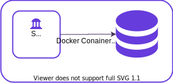
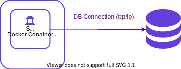
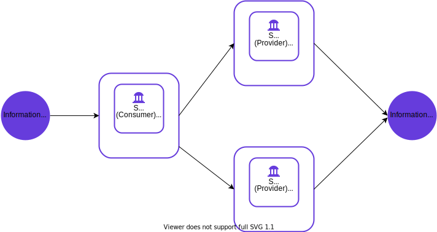

# Security Server Sidecar User Guide <!-- omit in toc -->

## Version history <!-- omit in toc -->

 Date       | Version | Description                                                     | Author
 ---------- | ------- | --------------------------------------------------------------- | --------------------
 13.11.2020 | 1.0     | Initial version                                                 | Alberto Fernandez Lorenzo

# Table of Contents
   * [1 Introduction](#1-introduction)
      * [1.1 Target Audience](#11-target-audience)
   * [2 Installation](#2-installation)
      * [2.1 Prerequisites to Installation](#21-prerequisites-to-installation)
      * [2.2 X-Road Security Server sidecar images](#22-x-road-security-server-sidecar-images)
         * [2.2.1 niis/xroad-security-server-sidecar:&lt;version&gt;-slim](#221-niisxroad-security-server-sidecarversion-slim)
         * [2.2.2 niis/xroad-security-server-sidecar:&lt;version&gt;](#222-niisxroad-security-server-sidecarversion)
         * [2.2.3 niis/xroad-security-server-sidecar:&lt;version&gt;-slim-fi](#223-niisxroad-security-server-sidecarversion-slim-fi)
         * [2.2.4 niis/xroad-security-server-sidecar:&lt;version&gt;-fi](#224-niisxroad-security-server-sidecarversion-fi)
      * [2.3 Reference data](#23-reference-data)
      * [2.4 Requirements for the X-Road Security Server sidecar](#24-requirements-for-the-x-road-security-server-sidecar)
      * [2.5 Network](#25-network)
      * [2.6 Installation](#26-installation)
         * [2.6.2 Installation using setup script](#262-installation-using-setup-script)
            * [2.6.2.1 Security Server Sidecar Slim](#2621-security-server-sidecar-slim)
            * [2.6.2.2 Finnish settings](#2622-finnish-settings)
         * [2.6.2 Installation using Dockerhub image](#262-installation-using-dockerhub-image)
      * [2.7 External database](#27-external-database)
         * [2.7.1 Reconfigure external database address after initialization](#271-reconfigure-external-database-address-after-initialization)
      * [2.8 Logging Level](#28-logging-level)
      * [2.9 Volume support](#29-volume-support)
         * [2.9.1 Store sensitive information in volumes](#291-store-sensitive-information-in-volumes)
   * [3 Verify installation](#3-verify-installation)
   * [4 X-Road Security Server sidecar initial configuration](#4-x-road-security-server-sidecar-initial-configuration)
      * [4.1 Prerequisites](#41-prerequisites)
      * [4.2 Reference data](#42-reference-data)
      * [4.3 Configuration](#43-configuration)
      * [4.4 Central Server configuration](#44-central-server-configuration)
   * [5 Back up and Restore](#5-back-up-and-restore)
      * [5.1 Automatic Backups](#51-automatic-backups)
   * [6 Version update](#6-version-update)
   * [7 Monitoring](#7-monitoring)
      * [7.1 Environmental monitoring](#71-environmental-monitoring)
      * [7.2 Operational Monitoring](#72-operational-monitoring)
   * [8 Message log](#8-message-log)
      * [8.1 Local storage of message log](#81-local-storage-of-message-log)
   * [9 Deployment options](#9-deployment-options)
      * [9.1 General](#91-general)
      * [9.2 Local database](#92-local-database)
      * [9.3 Remote database](#93-remote-database)
      * [9.4 High Availability Setup](#94-high-availability-setup)
   * [10 Kubernetes](#10-kubernetes)
      * [10.1 Kubernetes jobs readiness, liveness and startup probes](#101-kubernetes-jobs-readiness-liveness-and-startup-probes)
         * [10.1.1 Readiness probes](#1011-readiness-probes)
         * [10.1.2 Liveness probes](#1012-liveness-probes)
         * [10.1.3 Startup probes](#1013-startup-probes)
      * [10.2 Kubernetes secrets](#102-kubernetes-secrets)
         * [10.2.1 Create secret](#1021-create-secret)
         * [10.2.2 Consume secret](#1022-consume-secret)


# 1 Introduction
## 1.1 Target Audience
The intended audience of this User Guide are X-Road Security server system administrators responsible for installing and using X-Road Security Server Sidecar software.

The document is intended for readers with a moderate knowledge of Linux server management, computer networks, Docker and X-Road.

# 2 Installation
## 2.1 Prerequisites to Installation
The Security Server sidecar installation requires an existing X-Road Central server installed and configured and a installation of Docker.

Building with Docker BuildKit can slightly reduce the size of the resulting container image.
See <https://docs.docker.com/develop/develop-images/build_enhancements/> for more information.

## 2.2 X-Road Security Server sidecar images
Security Server sidecar server has different configurations combined with the versions (current supported versions are "6.23.0" and "6.24.0") of the X-Road Security Server to create different types of images.
All of the images can act as a provider or consumer Security Servers.

### 2.2.1 niis/xroad-security-server-sidecar:&lt;version&gt;-slim
Base image of the Security Server sidecar with the minimum necessary packages.

### 2.2.2 niis/xroad-security-server-sidecar:&lt;version&gt;
This image uses the slim as base image and includes the packages for support [environmental](https://github.com/nordic-institute/X-Road/blob/develop/doc/EnvironmentalMonitoring/Monitoring-architecture.md) and [operational monitoring](https://github.com/nordic-institute/X-Road/tree/develop/doc/OperationalMonitoring) along with support for [message logging](https://github.com/nordic-institute/X-Road/blob/develop/doc/DataModels/dm-ml_x-road_message_log_data_model.md).

### 2.2.3 niis/xroad-security-server-sidecar:&lt;version&gt;-slim-fi
This image is the same as the niis/xroad-security-server-sidecar:&lt;version&gt;-slim but with the Finnish settings configuration included.

### 2.2.4 niis/xroad-security-server-sidecar:&lt;version&gt;-fi
This image is the same as the niis/xroad-security-server-sidecar:&lt;version&gt; but with the Finnish settings configuration included.

## 2.3 Reference data
**Ref** | **Value**                                | **Explanation**
------ | ----------------------------------------- | ----------------------------------------------------------
1.1    | &lt;container name&gt;                    | Name of the security server sidecar container
1.2    | &lt;ui port&gt;                           | Port for admin user interface
1.3    | &lt;http port&gt;                         | http port, recommended &lt;ui-port&gt; +1
1.4    | &lt;token pin&gt;                         | Software token PIN code
1.5    | &lt;admin user&gt;                        | Admin username
1.6    | &lt;admin password&gt;                    | Admin password
1.7    | &lt;database host&gt;                     | Database host for external or local database, use '127.0.0.1' for local database.
1.8    | &lt;database port&gt;                     | Optional parameter, database port when we are using an external database, recommended 5432
1.9    | &lt;xroad db password&gt;                        | Environmental variable with the DB password in case we are using a external database
1.10    | &lt;xroad log level&gt;                         | Environmental variable with output logging level, could be one of the case-sensitive string values: TRACE, DEBUG, INFO, WARN, ERROR, ALL or OFF
1.11    | &lt;database-name&gt;                     | Optional parameter, this parameter will change the name of the database 'serverconf' to 'serverconf_&lt;database-name&gt;', this is useful when we are using an external database host with an already existing database and we don't want to use it
1.12    | TCP 5500                                  | Ports for outbound connections (from the security server to the external network)<br> Message exchange between security servers
&nbsp; | TCP 5577                                  | Ports for outbound connections (from the security server to the external network)<br> Querying of OCSP responses between security servers
&nbsp; | TCP 80 (1)                                | Ports for outbound connections (from the security server to the external network)<br> Downloading global configuration
&nbsp; | TCP 80 (1),443                            | Ports for outbound connections (from the security server to the external network)<br> Most common OCSP service
1.13   | TCP 80 (1)                                | Ports for information system access points (in the local network)<br> Connections from information systems
&nbsp; | TCP 443                                   | Ports for information system access points (in the local network)<br> Connections from information systems
1.14    | TCP 5588                                  | Port for health check (local network)
1.15    | TCP 4000 (2)                              | Port for admin user interface (local network)
1.16   |                                           | Internal IP address and hostname(s) for security server sidecar
1.17   |                                           | Public IP address, NAT address for security server sidecar

It is strongly recommended to protect the security server from unwanted access using a firewall (hardware or software based). The firewall can be applied to both incoming and outgoing connections depending on the security requirements of the environment where the security server is deployed. It is recommended to allow incoming traffic to specific ports only from explicitly defined sources using IP filtering. **Special attention should be paid with the firewall configuration since incorrect configuration may leave the security server vulnerable to exploits and attacks**.

## 2.4 Requirements for the X-Road Security Server sidecar
Minimum recommended docker engine configuration to run the security server sidecar container:
- CPUs: 2
- Memory: 2 GiB
- Swap: 1 GiB
- Disk space: 2 GiB
- If the security server is separated from other networks by a firewall and/or NAT, the necessary connections to and from the security server need to be allowed (**reference data: 1.12; 1.13; 1.14; 1.15;**). The enabling of auxiliary services which are necessary for the functioning and management of the operating system (such as DNS, NTP, and SSH) are outside the scope of this guide.
- if the security server has a private IP address, a corresponding NAT record must be created in the firewall (**reference data: 1.18**).
## 2.5 Network

The table below lists the required connections between different components.

**Connection Type** | **Source** | **Target** | **Target Ports** | **Protocol** | **Note** |
-----------|------------|-----------|-----------|-----------|-----------|
Out | Security Server | Central Server | 80, 4001 | tcp | |
Out | Security Server | Management Security Server | 5500, 5577 | tcp | |
Out | Security Server | OCSP Service | 80 / 443 | tcp | |
Out | Security Server | Timestamping Service | 80 / 443 | tcp | |
Out | Security Server | Data Exchange Partner Security Server (Service Producer) | 5500, 5577 | tcp | |
Out | Security Server | Producer Information System | 80, 443, other | tcp | Target in the internal network |
In  | Monitoring Security Server | Security Server | 5500, 5577 | tcp | |
In  | Data Exchange Partner Security Server (Service Consumer) | Security Server | 5500, 5577 | tcp | |
In | Consumer Information System | Security Server | 80, 443 | tcp | Source in the internal network |
In | Admin | Security Server | <ui port> (**reference data 1.2**) | tcp | Source in the internal network |

## 2.6 Installation
To install X-Road Security Server sidecar we can run the script setup_security_server_sidecar.sh wich will build and run the image or we can run directly one of the public images published on Dockerhub. Both installations will have the same resulting running container.

### 2.6.2 Installation using setup script

To install the Security Server sidecar in a local development environment, run the script setup_security_server_sidecar.sh providing the parameters in the order shown (reference data in user guide 1.1, 1.2, 1.3, 1.4):

  ```bash
  ./setup_security_server_sidecar.sh <name of the sidecar container> <admin UI port> <software token PIN code> <admin username> <admin password> (<remote database server hostname> <remote database server port> <remote_database_name>)
  ```

The script setup_security_server_sidecar.sh will:

- Create a docker bridge-type network called xroad-network to provide container-to-container communication.
- Build xroad-sidecar-security-server-image performing the following configuration steps:
  - Downloads and installs the packages xroad-proxy, xroad-addon-metaservices, xroad-addon-wsdlvalidator and xroad-autologin from the public NIIS artifactory repository (version bionic-6.22.0 or later).
  - Removes the generated serverconf database and properties files (to be re-generated in the initial configuration script).
  - Removes the default admin username (to be re-generated in the initial configuration script).
  - Removes the generated internal and nginx certificates (to be re-generated in the initial configuration script).
  - Enables health check port and interfaces (by default all available interfaces).
  - Backs up the read-only xroad packages' configuration to allow security server sidecar configuration updates.
  - Copies the xroad security server sidecar custom configuration files.
  - Exposes the container ports 80 (HTTP), 443 (HTTPS), 4000 (admin UI), 5500 (proxy), 5577 (proxy OCSP) and 5588 (proxy health check).
- Start a new security server sidecar container from the xroad-sidecar-security-server-image and execute the initial configuration script, which will perform the following configuration steps:
  - Maps ports 4000 (admin UI) and 80 (HTTP) to user-defined ones (reference data 1.2).
  - Maps port 5588 (proxy health check) to the same host port.
  - Updates security server sidecar configuration on startup if the installed version of the image has been updated.
  - Configures xroad-autologin custom software token PIN code with user-supplied PIN (reference data 1.3).
  - Configures admin credentials with user-supplied username and password (reference data 1.4).
  - Generates new internal and admin UI TLS keys and self-signed certificates to establish a secure connection with the client information system.
  - Recreates serverconf database and properties file with serverconf username and random password.
  - Optionally configures the security server sidecar to use a remote database server.
  - Starts security server sidecar services.
  - Replace 'initctl' for 'supervisorctl' in 'xroad_restore.sh' for start and stop the services.
  - Create sidecar-config directory on the host and mount it into the /etc/xroad config directory on the container.

#### 2.6.2.1 Security Server Sidecar Slim
To install the Security Server Sidecar slim, modify the docker image build path in the setup_security_server_sidecar.sh script by changing the path "sidecar/Dockerfile" to "sidecar/slim/Dockerfile". The Sidecar is a slim version of the sidecar who does not include support for message logging and monitoring.
To install the Security Server Sidecar slim with Finnish settings, modify the docker image build path in the setup_security_server_sidecar.sh script by changing the path "sidecar/Dockerfile" to "sidecar/slim/fi/Dockerfile"

#### 2.6.2.2 Finnish settings
  To install the Security Server Sidecar in a local development environment with Finnish settings, modify the image build in the setup_security_server_sidecar.sh changing the path "sidecar/Dockerfile" to "sidecar/fi/Dockerfile"

### 2.6.2 Installation using Dockerhub image
First, create a docker network to allow communication between containers, we can run the docker command:
```
docker network inspect xroad-network >/dev/null 2>&1 || docker network create -d bridge xroad-network
```
To install the Security Server sidecar in a local development environment, we can run the docker command:
```
docker run --detach -p <ui port>:4000 -p <http port>:80 -p 5588:5588 --network xroad-network -e XROAD_TOKEN_PIN=<token pin> -e XROAD_ADMIN_USER=<admin user> -e XROAD_ADMIN_PASSWORD=<admin password> -e XROAD_DB_HOST=<database host> -e XROAD_DB_PORT=<database port> -e XROAD_DB_PWD=<xroad db password> -e XROAD_LOG_LEVEL=<xroad log level> -e XROAD_CONF_DATABASE_NAME=<database name> --name <container name> niis/xroad-security-server-sidecar:<image tag>
```

## 2.7 External database
It is possible to configure the security server sidecar to use a remote database, instead of the default locally installed one. To do that, you need to provide the remote database server hostname (&lt;database-host&gt;) and port number (&lt;database-port&gt; ) as parameters when running 'docker build' command. Before running the script, you must also set the environment variable XROAD_DB_PASSWORD with the remote database administrator master password.
The user for the connection will be the default database user "postgres". The following configuration is needed on the remote database server to allow external access to the remote PostgreSQL database from the security server sidecar:
```bash
[...]
  # - Connection Settings -

  listen_addresses = '*'  # what IP address(es) to listen on;
                          # comma-separated list of addresses;
                          # defaults to 'localhost'; use '*' for all
                          # (change requires restart)
  port = 5432             # (change requires restart)
[...]
```

- Edit the PostgreSQL client authentication configuration file in `pg_hba.conf` to enable connections from outside localhost. Replace the IP `127.0.0.1/32` with `0.0.0.0/0`.

```bash
[...]
# IPv4 local connections:
host    all             all             0.0.0.0/0            md5
[...]
```

- If the database is in your local machine you have to use the interface ip that uses the host to connect to the docker containers. You can check this ip by running "docker inspect container_name" and checking the gateway property.

- The external database has been tested both for external PostgreSQL database running i1n our local machine, in a remote server or inside another docker container. It also could be integrated with AWS RDS, it has been tested for PostgreSQL engine and Aurora PostegreSQL engine, both with version 10 of the PostgreSQL database.

### 2.7.1 Reconfigure external database address after initialization

It is possible to change the external database after the initialization while the Sidecar container is running. This will not recreate the database, so we need to make sure that the 'serverconf' database and a user with granted permissions to access it are already created. To change the database host we need to:
- Run a new command on the sidecar container:
```bash
docker exec -it <sidecar_container_name> bash
  ```
- Inside the container open in a text editor (we can install any of the command line text editors like nano, vi ...) the `etc/xroad/db.properties` file:
 ```bash
nano etc/xroad/db.properties
  ```
- Replace the connection host, the username and password with the properties of the new database:
```bash
  [...]
    # -db.properties -
serverconf.hibernate.connection.url = jdbc:postgresql://<new_host_ip>:5432/serverconf
serverconf.hibernate.connection.username = <new_user>
serverconf.hibernate.connection.password = <new_password>
  [...]
  ```
  If other components like 'message_log' or 'op_monitor' are also configured in the `etc/xroad/db.properties` file to use an external database, we must change their properties in the same way as in the example above.
- In case we are using a version up to 6.24.0 we must update the admin users by editing `etc/xroad.properties` file and replace the admin users and passwords with the new ones.
```bash
[...]
  # -xroad.properties -
  serverconf.database.admin_user = <new_serverconf_admin>
  serverconf.database.admin_password = -<new_serverconf_password>
[...]
```
 If we are using the regular version of the Security Server sidecar with the admin users for the 'messagelog' and 'op-monitor' databases we must the the same for this admin users.
- After the properties are changed, save and close the files  and restart the services by running:
```bash
 supervisorctl restart all
  ```

## 2.8 Logging Level

  It is possible to configure the Security Server Sidecar to adjust the logging level so that it is less verbose. To do this, we must set the environment variable XROAD_LOG_LEVEL, the value of this variable could be one of the case-sensitive string values: TRACE, DEBUG, INFO, WARN, ERROR, ALL or OFF. By default, if the environment variable is not set, the logging level will be INFO.
  For setting the environment variable we can either edit the /etc/environment file or run:

   ```bash
    export XROAD_LOG_LEVEL=<logging level value>
    ./setup_security_server_sidecar.sh <name of the sidecar container> <admin UI port> <software token PIN code> <admin username> <admin password>
    ```

## 2.9 Volume support

    It is possible to configure security server sidecar to use volume support. This will allow us to  create sidecar-config and sidecar-config-db directory on the host and mount it into the /etc/xroad and /var/lib/postgresql/10/main  config directories on the container.
    For adding volume support we have to modify the docker run sentence inside the setup_security_server_sidecar.sh script and add the volume support:

    `-v (sidecar-config-volume-name):/etc/xroad -v (sidecar-config-db-volume-name):/var/lib/postgresql/10/main`

    For example:
      ```bash
      [...]
        docker run -v sidecar-config:/etc/xroad -v sidecar-config-db:/var/lib/postgresql/10/main -detach -p $2:4000 -p $httpport:80 -p 5588:5588 --network xroad-network -e XROAD_TOKEN_PIN=$3 -e XROAD_ADMIN_USER=$4 -e XROAD_ADMIN_PASSWORD=$5 -e XROAD_DB_HOST=$postgresqlhost -e XROAD_DB_PORT=$postgresqlport -e XROAD_DB_PWD=$XROAD_DB_PASSWORD --name $1 xroad-sidecar-security-server-image
      [...]
      ```

#### 2.9.1 Store sensitive information in volumes
The file `/etc/xroad.properties` contains sensitive information to access the external database. For security reasons, it is strongly recommended to store this file outside the Security Server sidecar container by configuring a volume:
```bash
[...]
   -v sidecar-properties:/etc/xroad.properties -detach -p $2:4000 -p $httpport:80 -p 5588:5588 --network xroad-network -e XROAD_TOKEN_PIN=$3 -e XROAD_ADMIN_USER=$4 -e XROAD_ADMIN_PASSWORD=$5 -e XROAD_DB_HOST=$postgresqlhost -e XROAD_DB_PORT=$postgresqlport -e XROAD_DB_PWD=$XROAD_DB_PASSWORD --name $1 xroad-sidecar-security-server-image
[...]
```


# 3 Verify installation
The installation is successful if docker image is running, the system services are started inside the container and the user interface is responding.
- Ensure from the command line that the container is running  (**reference data: 1.1; 1.3**):
```
docker ps --filter "name=<container name>"
CONTAINER ID        IMAGE                                                COMMAND                 CREATED             STATUS              PORTS                                                                                               NAMES
b3031affa4b7        niis/xroad-security-server-sidecar:<image tag>   "/root/entrypoint.sh"   10 minutes ago      Up 10 minutes       443/tcp, 5500/tcp, 5577/tcp, 0.0.0.0:5588->5588/tcp, 0.0.0.0:<http port>->80/tcp, 0.0.0.0:4600->4000/tcp   <container name>
```
- Ensure from running a command  in the running container that the services are running(**reference data: 1.1**):
```
docker exec -it <container name> supervisorctl
postgres                         RUNNING   pid 469, uptime 0:15:55
xroad-autologin                  RUNNING    Nov 04 12:23 PM
xroad-confclient                 RUNNING   pid 468, uptime 0:15:55
xroad-monitor                    RUNNING   pid 471, uptime 0:15:55
xroad-opmonitor                  RUNNING   pid 470, uptime 0:15:55
xroad-proxy                      RUNNING   pid 473, uptime 0:15:55
xroad-proxy-ui-api               RUNNING   pid 476, uptime 0:15:55
xroad-signer                     RUNNING   pid 472, uptime 0:15:55
```
- Ensure that the security server user interface at https://SECURITYSERVER:&lt;ui port&gt;/ (**reference data: 1.3**) can be opened in a Web browser. To log in, use the account name and password chosen during the installation (**reference data: 1.5; 1.6**). While the user interface is still starting up, the Web browser may display a connection refused -error.

# 4 X-Road Security Server sidecar initial configuration
During the security server initial configuration, the server’s X-Road membership information and the software token’s PIN are set

## 4.1 Prerequisites
Configuring the security server assumes that the security server owner is a member of the X-Road.

## 4.2 Reference data
ATTENTION: Reference items 2.1 - 2.3 in the reference data are provided to the security server owner by the X-Road central’s administrator.

**Ref** | **Value**                                               | **Explanation**
------ | -----------------------------------------                | --------------------------------------------
2.1    | &lt;global configuration anchor file&gt; or &lt;URL&gt;  | Global configuration anchor file container
2.2    | 	<security server owner's member class> *E.g.*  *GOV-government*; *COM - commercial*             | Member class of the security server's owner
2.3    | &lt;security server owner register code&gt;              | Member code of the security server's owner
2.4    | &lt;choose security server identificator name&gt;        | Security server's code

Note (1): The global configuration provider's download URL and TCP port 80 must be reachable from the security server sidecar network.

Note (2): Reference items 2.1 - 2.3 are provided to the security server owner by the X-Road central server's administrator.

Note (3): The security server member code usually refers to the organization's business code, although there can be other conventions depending on the X-Road governing authority's rules.

Note (4): The security server code uniquely identifies the security server in an X-Road instance. X-Road instance's governing authority may dictate rules how the code should be chosen.

## 4.3 Configuration
To perform the initial configuration, open the address
```
https://SECURITYSERVER:<ui-port>/
```
in a Web browser (**reference data: 1.2**). To log in, use the account name and password chosen during the installation (**reference data: 1.5; 1.6 **).
Upon first log-in, the system asks for the following information.
- The global configuration anchor file (**reference data: 2.1**).

 **Please verify anchor hash value with the published value.**

 If the configuration is successfully downloaded, the system asks for the following information.

 - The security server owner’s member class (**reference data: 2.2**).
 - The security server owner’s member code (**reference data: 2.3**).

 If the member class and member code are correctly entered, the system displays the security server owner’s name as registered in the X-Road center.
 - Security server code (**reference data: 2.4**), which is chosen by the security server administrator and which has to be unique across all the security servers belonging to the same X-Road member.
 - Software token’s PIN (**reference data: 1.4**). The PIN will be used to protect the keys stored in the software token. The PIN must be stored in a secure place, because it will be no longer possible to use or recover the private keys in the token once the PIN has been lost.

## 4.4 Central Server configuration
After the Security Server sidecar it's configured, we need to register it in the central server, information about how to configure the Security Server sidecar on the central server can be found on the  [Security Server user guide.](https://github.com/nordic-institute/X-Road/blob/develop/doc/Manuals/ug-ss_x-road_6_security_server_user_guide.md#31-configuring-the-signing-key-and-certificate-for-the-security-server-owner)

# 5 Back up and Restore
Information of how to backup and restore the Security Server sidecar can be found on the [Security Server User guide](https://github.com/nordic-institute/X-Road/blob/develop/doc/Manuals/ug-ss_x-road_6_security_server_user_guide.md#13-back-up-and-restore).

The Security Server sidecar stored its configuration on the local file system folder:
```
/etc/xroad/
```
It is possible store this configuration outside the docker container using docker volumes. Adding a docker volume will allow to keep the configuration even if the container is removed and the possibility to use the same configuration in other docker containers.
To add the docker volume, in the docker run command [docker run command](##2.6-Installation) add the docker volume parameter mapping to the config folder:
```
docker run -v (custom-volume-name):/etc/xroad
```
Once the docker container is running we can see the volume information and where it is stored in our local machine by running the following command:
```
docker volume inspect (custom-volume-name)
[
    {
        "CreatedAt": "2020-10-22T13:44:16+02:00",
        "Driver": "local",
        "Labels": null,
        "Mountpoint": "/var/lib/docker/volumes/sidecar-config/_data",
        "Name": "sidecar-config",
        "Options": null,
        "Scope": "local"
    }
]

```
We can manually backup the data stored in the "Mountpoint" every period of time.

## 5.1 Automatic Backups
By default the Security Server backs up its configuration automatically once every day. Backups older than 30 days are automatically removed from the server. If needed, the automatic backup policies can be adjusted by editing the ''/etc/cron.d/xroad-proxy' file.
Automatic backups will be stored in the folder '/var/lib/xroad/backup/'. We can create a volume for store the automatic backups by adding in the run command:
```
docker run -v (backups-volume-name):/etc/xroad/var/lib/xroad/backup/
```

# 6 Version update
We can update the Security Server sidecar by creating a backup, running the image with the new version, and restore the backup or reuse the volume with the xroad config ([5](# 5-Back-up-and-Restore)).
Another option, we can manually update the X-Road sidecar packages while the docker container is running.
To do this we must:
- From the command line open a bash terminal inside the container:
```
docker exec -it <container-name> bash
```
- Stop the services:
```
supervisorctl stop all
```
- Add the new version repository key:
```
echo "deb https://artifactory.niis.org/xroad-release-deb bionic-current main" >/etc/apt/sources.list.d/xroad.list && apt-key add '/tmp/repokey.gpg'
```
- Update and upgrade the packages:
```
apt-get update && apt-get upgrade
```
- Start the services:
```
supervisorctl start all
```

Note: It is possible that a major version update will require extra changes, for doing that check the specific documentation for the version update.

# 7 Monitoring
Monitoring will be available if we use the regular version of the X-Road Security Server sidecar instead of the 'slim' version.
## 7.1 Environmental monitoring
Environmental monitoring for the Security Server Sidecar provider can be used to obtain information about the platform it's running on.
For example to get the system metrics:
- Create a file called **system_metrics.xml** (**reference data: 2.2;2.3;2.4**):
```
<SOAP-ENV:Envelope
	xmlns:SOAP-ENV="http://schemas.xmlsoap.org/soap/envelope/"
	xmlns:id="http://x-road.eu/xsd/identifiers"
	xmlns:xrd="http://x-road.eu/xsd/xroad.xsd"
	xmlns:m="http://x-road.eu/xsd/monitoring">

    <SOAP-ENV:Header>

        <xrd:client id:objectType="MEMBER">
            <id:xRoadInstance><security server owner's member code></id:xRoadInstance>
            <id:memberClass><security server owner's member class></id:memberClass>
            <id:memberCode><security server code></id:memberCode>
        </xrd:client>

		 <xrd:service id:objectType="SERVICE">
            <id:xRoadInstance><security server owner's member code></id:xRoadInstance>
            <id:memberClass><security server owner's member class></id:memberClass>
            <id:memberCode><security server code></id:memberCode>
            <id:serviceCode>getSecurityServerMetrics</id:serviceCode>
        </xrd:service>

        <xrd:securityServer id:objectType="SERVER">
            <id:xRoadInstance>DEV</id:xRoadInstance>
            <id:memberClass><security server owner's member class></id:memberClass>
            <id:memberCode><security server code></id:memberCode>
            <id:serverCode><security server code></id:serverCode>
        </xrd:securityServer>

        <xrd:id>ID11234</xrd:id>
        <xrd:protocolVersion>4.0</xrd:protocolVersion>

    </SOAP-ENV:Header>

    <SOAP-ENV:Body>
        <m:getSecurityServerMetrics>
            <m:outputSpec>
                <m:outputField>OperatingSystem</m:outputField>
                <m:outputField>TotalPhysicalMemory</m:outputField>
            </m:outputSpec>
        </m:getSecurityServerMetrics>
    </SOAP-ENV:Body>

</SOAP-ENV:Envelope>
```

- From the command line send a SOAP curl request (**reference data 1.3**):
```
curl -d  @system_metrics.xml --header "Content-Type: text/xml" -X POST  http://localhost:<http port>

<?xml version="1.0" encoding="UTF-8"?>
<SOAP-ENV:Envelope
	xmlns:SOAP-ENV="http://schemas.xmlsoap.org/soap/envelope/"
	xmlns:id="http://x-road.eu/xsd/identifiers"
	xmlns:m="http://x-road.eu/xsd/monitoring"
	xmlns:xrd="http://x-road.eu/xsd/xroad.xsd">
	<SOAP-ENV:Header>
		<xrd:client id:objectType="MEMBER">
			<id:xRoadInstance>DEV</id:xRoadInstance>
			<id:memberClass>COM</id:memberClass>
			<id:memberCode>12345</id:memberCode>
		</xrd:client>
		<xrd:service id:objectType="SERVICE">
			<id:xRoadInstance>DEV</id:xRoadInstance>
			<id:memberClass>COM</id:memberClass>
			<id:memberCode>12345</id:memberCode>
			<id:serviceCode>getSecurityServerMetrics</id:serviceCode>
		</xrd:service>
		<xrd:securityServer id:objectType="SERVER">
			<id:xRoadInstance>DEV</id:xRoadInstance>
			<id:memberClass>COM</id:memberClass>
			<id:memberCode>12345</id:memberCode>
			<id:serverCode>ss3</id:serverCode>
		</xrd:securityServer>
		<xrd:id>ID11234</xrd:id>
		<xrd:requestHash algorithmId="http://www.w3.org/2001/04/xmlenc#sha512">/yQEESJs0dDjYlRx9B3O773Jl1Ly9vMO4Ck9oUberOUY/v/+OYwksgkE1rEnJc98eFlu/Akb+o2azN3D7AxHRA==</xrd:requestHash>
		<xrd:protocolVersion>4.0</xrd:protocolVersion>
	</SOAP-ENV:Header>
	<SOAP-ENV:Body>
		<m:getSecurityServerMetricsResponse>
			<m:metricSet>
				<m:name>SERVER:DEV/COM/12345/ss3</m:name>
				<m:stringMetric>
					<m:name>proxyVersion</m:name>
					<m:value>6.23.0</m:value>
				</m:stringMetric>
				<m:metricSet>
					<m:name>systemMetrics</m:name>
					<m:stringMetric>
						<m:name>OperatingSystem</m:name>
						<m:value>Linux version 5.3.0-28-generic (buildd@lcy01-amd64-009) (gcc version 7.4.0 (Ubuntu 7.4.0-1ubuntu1~18.04.1)) #30~18.04.1-Ubuntu SMP Fri Jan 17 06:14:09 UTC 2020</m:value>
					</m:stringMetric>
					<m:numericMetric>
						<m:name>TotalPhysicalMemory</m:name>
						<m:value>16523407360</m:value>
					</m:numericMetric>
				</m:metricSet>
			</m:metricSet>
		</m:getSecurityServerMetricsResponse>
	</SOAP-ENV:Body>
</SOAP-ENV:Envelope>
```

More information can be found in https://github.com/nordic-institute/X-Road/blob/master/doc/EnvironmentalMonitoring/Monitoring-architecture.md/

Note (1): The Security Server sidecar must have available certificates and a subsystem registered on the central server.

## 7.2 Operational Monitoring
Operational monitoring for the Security Server Sidecar provider can be used to obtain information about the services it is running. The operational monitoring processes operational statistics (such as which services have been called, how many times, what was the size of the response, etc.) of the security servers. The operational monitoring will create a database named "op-monitor" for store the data, this database can be configured internally in the container or externally (check 1.6). More information about how to test it can be found here https://github.com/nordic-institute/X-Road/tree/develop/doc/OperationalMonitoring/Protocols

# 8 Message log
Message log will be available if we use the regular version of the X-Road Security Server sidecar instead of the 'slim' version.

The purpose of the message log is to provide means to prove the reception of a regular request or response message to a third party. Messages exchanged between security servers are signed and encrypted. For every regular request and response, the security server produces a complete signed and timestamped document (Associated Signature Container).

Message log data is stored to the [messagelog database](https://github.com/nordic-institute/X-Road/blob/develop/doc/DataModels/dm-ml_x-road_message_log_data_model.md) of the security server database host (**reference data: 1.7**) during message exchange. According to the configuration (see 8.1), the timestamping of the signatures of the exchanged messages is either synchronous to the message exchange process or is done asynchronously using the time period set by the X-Road governing agency.
armin
In case of synchronous timestamping, the timestamping is an integral part of the message exchange process (one timestamp is taken for the request and another for the response). If the timestamping fails, the message exchange fails as well and the security server responds with an error message.

In case of asynchronous timestamping, all the messages (maximum limit is determined in the configuration stored in the message log since the last periodical timestamping event are timestamped with a single (batch) timestamp. By default, the security server uses asynchronous timestamping for better performance and availability.

## 8.1 Local storage of message log
The Security Server sidecar periodically composes signed (and timestamped) documents from the message log data and archives them in the local file system folder:
```
/var/lib/xroad/
```
Archive files are ZIP containers containing one or more signed documents and a special linking information file for additional integrity verification purpose.

To make sure we are not running out of disk space, we can use a docker volume to store the log records outside the container in our host.
From the docker run command [docker run command](##2.6-Installation) add the docker volume parameter mapping to the host local storage folder for the logs:
```
docker run -v (custom-volume-name):/var/lib/xroad/  
```

# 9 Deployment options
## 9.1 General
X-Road Security Server Sidecar has multiple deployment options.  The simplest choice is to have a single security server with local database. This is usually fine for majority of the cases, but there are multiple reasons to tailor the deployment. The images different images could be combine and any can be used as a consumer or provider server.

## 9.2 Container local database
The simplest deployment option is to use a single security server sidecar with local database inside the container. For development and testing purposes there is rarely need for anything else, but for production the requirements may be stricter.



## 9.3 Remote database
It is possible to use a remote database with X-Road Security Server sidecar.

X-Road Security Server Sidecar supports a variety of cloud databases including AWS RDS and Azure Database for PostgreSQL. This deployment option is useful when doing development in cloud environment, where use of cloud native database is the first choice.



## 9.4 High Availability Setup
In production systems it's rarely acceptable to have a single point of failure. Security server supports provider side high availability setup via so called internal load balancing mechanism. The setup works so that the same member / member class / member code / subsystem / service code is configured on multiple security servers and X-Road will then route the request to the server that responds the fastest. Note that this deployment option does not provide performance benefits, just redundancy.




# 10 Kubernetes
## 10.1 Kubernetes jobs readiness, liveness and startup probes
### 10.1.1 Readiness probes
The readiness probes will perform a health check periodically in a specific time. If the health check fails, the pod will remain in a not ready state until the health check succeeds. The pod in a not ready state will be accessible through his private IP but not from the balancer and the balancer will not redirect any message to this pod. We use readiness probes instead of liveliness probes because with readiness probes we still can connect to the pod for configuring it (adding certificates...) instead of the liveliness probes that will restart the pod until the health check succeeds.

The readiness probes are useful when the pod it's not ready to serve traffic but we don't want to restart it maybe because the pod needs to be configured to be ready,  for example,  adding the certificates.

We will use the following parameters in the Kubernetes configuration file to set up the readiness probe:
 - initialDelaySeconds:  Number of seconds after the container has started before readiness probes are initiated. For this example we will use 200 seconds to have enough time for the image be downloaded and the services are ready.
 - periodSeconds:  How often (in seconds) to perform the probe.
 - successThreshold: Minimum consecutive successes for the probe to be considered successful after having failed.
 - failureThreshold:  When a probe fails, Kubernetes will try failureThreshold times before giving up and mark the container as not ready.
 - port: Healthcheck port
 - path: Healthcheck path

  ```bash
  [...]
containers:
  readinessProbe:
    httpGet:
      path: /
      port: 5588
    initialDelaySeconds: 200
    periodSeconds: 30
    successThreshold: 1
    failureThreshold: 1
  [...]
  ```

### 10.1.2 Liveness probes
The liveness probes are used to know when restart a container. The liveness probes will perform a health check each period of time and restart the container if it fails.

The liveness probes are useful when the pod is not in a live state and can not be accessed through the UI, for example, due to the pod being caught in a deadlock or one of the services running in the container has stopped.

The parameters for the liveness probes are the same than for the readiness probes, but using the port 80 to check if nginx is running and serving the application instead of using port 5588 to check if the Sidecar pod is ready to serve traffic. It is recommended also to increase the failureThreshold value.

  ```bash
  [...]
containers:
livenessProbe:
  httpGet:
   path: /
   port: 80
  initialDelaySeconds: 100
  periodSeconds: 10
  successThreshold: 1
  failureThreshold: 5
  [...]
  ```

### 10.1.3 Startup probes
The startup probes indicate whether the application within the container is started. All other probes are disabled if a startup probe is provided until it succeeds.

Startup probes are useful for Pods that have containers that take a long time to come into service. This is not really useful in the Sidecar pod because it takes to short to start.
In a different scenario where the sidecar container would take a long time to start, the startup probe can be used in combination with the liveness probe, so that it waits until the startup probe has succeeded before starting the liveness probe. The tricky part is to set up a startup probe with the same command, HTTP or TCP check, with a failureThreshold * periodSeconds long enough to cover the worse case startup time.

 ```bash
 [...]
containers:
livenessProbe:
 httpGet:
  path: /
  port: 80
 periodSeconds: 10
 successThreshold: 1
 failureThreshold: 50
 [...]
 ```

## 10.2 Kubernetes secrets
### 10.2.1 Create secret
In this example we are going to create a secret for the X-Road Security Server Sidecar environment variables with sensitive data.
- Create a manifest file called for example 'secret-env-variables.yaml' and fill it with the desired values of the environment variables.
- Replace <namespace_name> with the name of the namespace if it's different from `default`. If we want to use `default` namespace, we can delete the line.
```bash
apiVersion: v1
kind: Secret
metadata:
  name: secret-sidecar-variables
  namespace: <namespace_name>
type: Opaque
stringData:
  XROAD_TOKEN_PIN: "1234"
  XROAD_ADMIN_USER: "xrd"
  XROAD_ADMIN_PASSWORD: "secret"
  XROAD_DB_HOST: "<db_host>"
  XROAD_DB_PWD: "<db_password>"
  XROAD_DB_PORT: "5432"
  XROAD_LOG_LEVEL: "INFO"
```
- Apply the manifest:
```bash
$ kubectl apply -f secret-env-variables.yaml
```

### 10.2.2 Consume secret
Modify your deployment pod definition in each container that you wish to consume the secret. The key from the Secret becomes the environment variable name in the Pod:
```bash
[...]
containers:
 - name: security-server-sidecar
   image: niis/xroad-security-server-sidecar:latest
   imagePullPolicy: "Always"
   envFrom:
   - secretRef:
     name: secret-sidecar-variables
[...]
```
