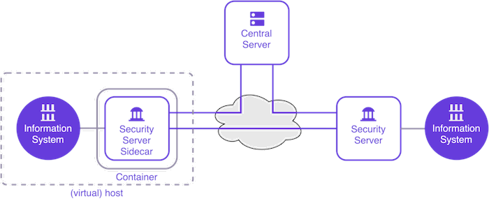

# X-Road Security Server Sidecar

X-Road Security Server Sidecar is a containerized version of the Security Server that supports production use. The
Sidecar is a Docker container that runs in the same virtual context (virtual host, Kubernetes Pod, etc.) with an
information system. The Sidecar can be used for both consuming and producing services.

 

## What Is a Sidecar?

In general, sidecar is a design pattern commonly used in a microservices architecture. A sidecar is an additional
component that is attached to a parent application to extend its functionalities. The original idea of the sidecar
pattern is that multiple copies of the same sidecar are attached to the application so that each instance of the
application has its own sidecar.

Despite its name, the original sidecar pattern does not work very well with the Security Server Sidecar since the
Sidecar requires the same configuration and registration process as the regular Security Server. Also, even if the
Security Server is containerized, the footprint of the Sidecar container is still relatively massive compared to the
footprint of average containers. Therefore, it’s recommended that a single Sidecar container is shared between multiple
instances of an application, and it may also be shared between different applications too. For high availability and
scalability, a Sidecar cluster consisting of a primary node and multiple secondary nodes can be considered.

## Sidecar Docker Image

X-Road Security Server Sidecar Docker image contains a custom set of modules instead of `xroad-securityserver`:

* xroad-proxy
* xroad-addon-metaservices
* xroad-addon-wsdlvalidator
* xroad-autologin.

The image is built from pre-built X-Road software packages downloaded from the official
[X-Road repository](https://artifactory.niis.org/xroad-release-deb).

## Security Server Sidecar Installation

See the [User guide](../doc/Sidecar/security_server_sidecar_user_guide.md) for information about how to install and
configure Sidecar.

The Security Server Sidecar Docker image (`niis/xroad-security-server-sidecar`) has been published on
[Docker Hub](https://hub.docker.com/r/niis/xroad-security-server-sidecar).

## Key Points and Limitations for X-Road Security Server Sidecar Deployment

* The Security Server Sidecar `slim` version does not support message logging, operational monitoring nor environmental
  monitoring functionality, which is recommended for a service provider's Security Server role.
* The Security Server Sidecar creates and manages its own internal TLS keys and certificates and does TLS termination
  by itself. In a cluster setup with an external load balancer, the load balancer must use SSL passthrough so that SSL
  termination is done by the Sidecar.
* The `xroad` services are run inside the container using supervisord as root, although the processes it starts are
  not. To avoid potential security issues, it is possible to set up Docker so that it uses Linux user namespaces, in
  which case root inside the container is not root (user id 0) on the host. For more information, see
  <https://docs.docker.com/engine/security/userns-remap/>.
