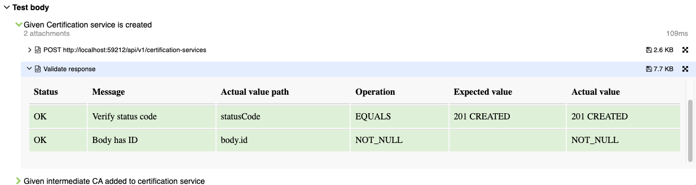

# Integration test development practices

**General notes:**
* Docker is used to run application in isolation.
* Most (unless specified otherwise) scenarios are executed in parallel.

## Scenario style guidelines

### Basic rules
* Integration scenarios should cover main business cases (including happy paths, api validation, errors, etc.).
* Corner cases, scenarios which could be easily covered by a unit test should not be present here.
* Always follow GivenWhenThen style. https://martinfowler.com/bliki/GivenWhenThen.html
* Scenario steps should be easily readable. Avoid hard-coding data in step definition, if possible expose it in
  scenario.
* Mark scenarios which alter application state (ex: database) as @Modifying.

### Scenario tagging

#### General guidelines

Each scenario should be tagged either at feature or scenario level. Tags should represent part of functionality they're
testing.

PLEASE USE EXISTING TAGS BEFORE CREATING NEW ONES.

#### Tags with hardcoded behaviour:

Some tags are not only for sorting and filtering, but they also add additional behaviour while executing.

| Tag        | Description                                                                                                                                                                                                                          |
|------------|--------------------------------------------------------------------------------------------------------------------------------------------------------------------------------------------------------------------------------------|
| @Modifying | This means that scenario has made modifications in the database. <br/>Test framework will drop and recreate schema after these scenarios.<br/>**Modifying scenarios will always execute sequentially and isolated from other tests** |

### Scenario step data management

Step data ideally should be passed by variables within StepDefs classes. Example:
```java
public class SystemApiStepDefs extends BaseStepDefs {
    @Autowired
    private FeignSystemApi feignSystemApi;

    private HttpStatus responseStatus;

    @Then("System status is requested")
    public void systemStatusIsRequested() {
        var response = feignSystemApi.getSystemStatus();

        responseStatus = response.getStatusCode();
    }

    @Then("System status is validated")
    public void systemStatusIsValidated() {
        Assertions.assertThat(responseStatus.is2xxSuccessful()).isTrue();
    }
}
```

In cases where data is shared cross StepDefs use stepData management methods from `BaseStepDefs` class.
Step data key is an enum, any new key must be defined in `BaseStepDefs.StepDataKey`

Example:
```java
public class SystemApiStepDefs extends BaseStepDefs {
    @Autowired
    private FeignSystemApi feignSystemApi;

    @Then("System status is requested")
    public void systemStatusIsRequested() {
        var response = feignSystemApi.getSystemStatus();

        putStepData(StepDataKey.RESPONSE_STATUS, response.getStatusCode());
    }

    @Then("System status is validated")
    public void systemStatusIsValidated() {
        HttpStatus responseStatus = getRequiredStepData(StepDataKey.RESPONSE_STATUS);

        Assertions.assertThat(responseStatus.is2xxSuccessful()).isTrue();
    }
}

```

### Test data management
Test data is managed by liquibase changesets which are defined in `test-data/centerui-int-test-changelog.xml`
When adding something, keep in mind that this data is used by all scenarios.

Data which might break other scenarios should be part of scenario itself.
If particular data cannot be added through API - consider writing unit test.

### Test result assertions

It is recommended to use `com.nortal.test.asserts.ValidationService` for data validation.
This service provides convenience methods for different types of assertions, supports SpringEL expressions and generates readable report entries.

**Example with two assertions: status code is 201 and field is NOT NULL:**
```java
@When("Certification service is created")
public void createCertificationService() throws Exception {
  MultipartFile certificate = new MockMultipartFile("certificate", generateAuthCert());
  String certificateProfileInfo = "ee.ria.xroad.common.certificateprofile.impl.FiVRKCertificateProfileInfoProvider";

final ResponseEntity<ApprovedCertificationServiceDto> response = certificationServicesApi
  .addCertificationService(certificate, certificateProfileInfo, "false");

final Validation.Builder validationBuilder = new Validation.Builder()
  .context(response) // We specify that response will be root element for SpEL expressions.
  .title("Validate response") // What is being validated?
  .assertion(equalsStatusCodeAssertion(CREATED))
  .assertion(new Assertion.Builder()
  .message("Body has ID")
  .expression("body.id")
  .operation(AssertionOperation.NOT_NULL).build());
  validationService.validate(validationBuilder.build());

  putStepData(CERTIFICATION_SERVICE_ID, response.getBody().getId());
  }
```
**Example with value comparison:**
```java
 @Then("intermediate CA has the updated OCSP responder")
    public void intermediateCAHasUpdatedOCSPResponder() {
        final ResponseEntity<Set<OcspResponderDto>> response = intermediateCasApi
                .getIntermediateCaOcspResponders(intermediateCaId);

        final String newOcspResponderUrl = getRequiredStepData(NEW_OCSP_RESPONDER_URL);

        final Validation.Builder validationBuilder = new Validation.Builder()
                .context(response)
                .title("Validate response")
                .assertion(equalsStatusCodeAssertion(OK))
                .assertion(equalsAssertion(Boolean.TRUE, "body[0].hasCertificate", "Verify OCSP responder has certificate"))
                .assertion(equalsAssertion(newOcspResponderUrl, "body[0].url", "OCSP responder url matches"));
        validationService.validate(validationBuilder.build());
    }
```
**Result will look like this:**


A more detailed description for various options can be found in JavaDoc.
