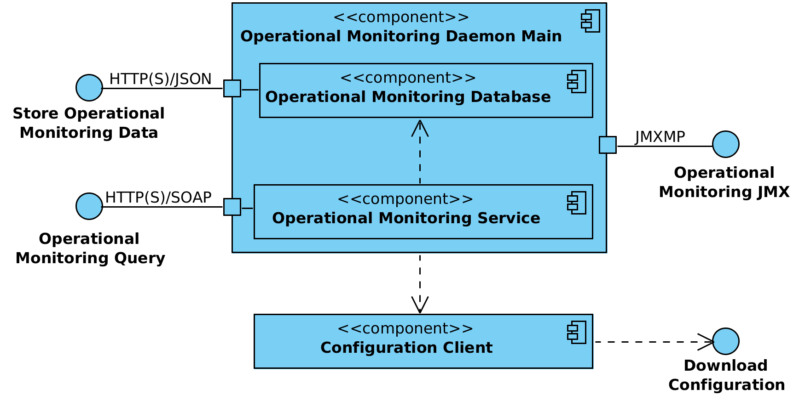

# X-Road: Operational Monitoring Daemon Architecture

Version: 0.5

Document ID: ARC-OPMOND

## 1 Introduction

The X-Road monitoring solution is conceptually split into two parts: environmental and operational monitoring. The operational monitoring processes operational statistics (such as which services have been called, how many times, what was the size of the response, etc.) of the security servers.

This document describes the architecture of the X-Road operational monitoring daemon. It presents an overview of the components of the monitoring daemon and its interfaces.

This document is aimed at technical readers who want to acquire an overview of inner workings of the monitoring daemon.

### 1.1 Overview

The main function of the monitoring daemon is to collect operational data of the X-Road security server(s) and make it available for external monitoring systems (e.g., Zabbix, Nagios) via corresponding interfaces.

The monitoring daemon also depends on central server that provides the global configuration.

### 1.2 Terms and Abbrevations

HTTP -- Hypertext Transfer Protocol  
HTTPS -- Hypertext Transfer Protocol Secure  
JMXMP -- Java Management Extensions Messaging Protocol  
JSON -- JavaScript Object Notation  
SOAP -- Simple Object Access Protocol  
TLS -- Transport Layer security  

### 1.3 References

<a name="ARC-G"></a>**ARC-G** -- Cybernetica AS. X-Road Architecture. Document ID: [ARC-G](../../Architecture/arc-g_x-road_arhitecture_1.4_Y-879-3.docx).  
<a name="PR-GCONF"></a>**PR-GCONF** -- Cybernetica AS. X-Road: Protocol for Downloading Configuration. Document ID: [PR-GCONF](../../Protocols/pr-gconf_x-road_protocol_for_downloading_configuration.md).  
<a name="PR-MESS"></a>**PR-MESS** -- Cybernetica AS. X-Road: Message Transport Protocol v4.0. Document ID: [PR-MESS](../../Protocols/pr-mess_x-road_message_protocol_v4.0_4.0.17.md).  
<a name="PR-OPMON"></a>**PR-OPMON** -- Cybernetica AS. X-Road: Operational Monitoring Protocol. Document ID: [PR-OPMON](../Protocols/pr-opmon_x-road_operational_monitoring_protocol_Y-1096-2.md).   
<a name="PR-OPMONJMX"></a>**PR-OPMONJMX** -- Cybernetica AS. X-Road: Operational Monitoring JMX Protocol. Document ID: [PR-OPMONJMX](../Protocols/pr-opmonjmx_x-road_operational_monitoring_jmx_protocol_Y-1096-3.md).  
<a name="PSQL"></a>**PSQL** -- PostgreSQL, https://www.postgresql.org/  

## 2 Component View

Figure 1 shows the main components and interfaces of the monitoring daemon. The components and the interfaces are described in detail in the following sections.



**Figure 1. Operational monitoring daemon component diagram**

### 2.1 Operational Monitoring Daemon Main

The operational monitoring daemon main is a standalone Java daemon application that implements the main functionality of the operational monitoring daemon.  

#### 2.1.1 Operational Monitoring Database

The operational monitoring database component collects operational monitoring data of the X-Road security server(s) via *store operational monitoring data* interface. Operational data is stored in a PostgreSQL [[PSQL]](#PSQL) database. Additionally operational health data statistics are updated and made available via JMXMP.

Outdated data records are deleted periodically from the database according to the monitoring daemon configuration.

#### 2.1.2 Operational Monitoring Service

The operational monitoring service receives and processes operational monitoring requests via *operational monitoring query* interface. There are two requests used by the security server(s) - *get operational monitoring data* and *get operational health data*.

In case the sender of the *get operational monitoring data* request is a regular client, only operational monitoring data records associated with that client are returned. In case the request sender is the central monitoring client (described in the global configuration) or owner of the current security server (described in the global configuration), it has access to all the records.

For performance purposes, the operational monitoring service limits the size of the *get operational monitoring data* response message. The maximum response size is configurable (however, all the records having the same timestamp as the last queried record are still included into the response). In case some queried records still do not fit into the response, the timestamp of the first excluded record is returned in the response to indicate overflow.

### 2.2 Configuration Client

The configuration client is responsible for downloading remote global configuration files. The source location of the global configuration is taken from the anchor file that was manually copied to the configuration directory of the operational monitoring daemon (or uploaded from the security server user interface in case monitoring daemon is deployed together with the security server).

The component is a standalone Java daemon application.

## 3 Protocols and Interfaces

### 3.1 Store Operational Monitoring Data

This protocol is used by the X-Road security server to store its cached operational monitoring data. The protocol is a synchronous RPC-style protocol based on JSON over HTTP(S). In case a secure connection is configured, the security server uses its internal self-signed TLS certificate and monitoring daemon its internal self-signed TLS certificate. Both client side and server side certificate verification is performed.

The availability of this service to the security server is not critical to operation of X-Road. If this service is unavailable, the security server continues caching in its memory buffer the operational data records. In case buffer overflow the oldest records are deleted.

The storing operational monitoring data is not time-critical, hence asynchronous caching of the records is performed in the security server side.

The JSON messages are described in [Appendix A](#AppendixA).

### 3.2 Operational Monitoring Query

The operational monitoring query interface is used by the security server to retrieve operational monitoring data. The asynchronous RPC-style X-Road operational monitoring protocol [[PR-OPMON]](#PR-OPMON) (based on [[PR-MESS]](#PR-MESS)) is used. In case a secure connection (HTTPS) is configured, the security server uses its internal self-signed TLS certificate and monitoring daemon its internal self-signed TLS certificate. Both client side and server side certificate verification is performed.

The monitoring of the security servers is not the main functionality of the X-Road system, therefore the availability and responsiveness of this service is not paramount. Operational data records are held in the database and are available for configured days.

### 3.3 Operational Monitoring JMX

This interface is used by a local monitoring system (e.g. Zabbix) to gather local operational health data of the security server via JMXMP. The interface is described in more detail in [[PR-OPMONJMX]](#PR-OPMONJMX).

The monitoring of the security servers is not the main functionality of the X-Road system, therefore the availability and responsiveness of this service is not paramount.

### 3.4 Download Configuration

The operational monitoring daemon downloads the generated global configuration files from a configuration source.

The configuration download interface is a synchronous interface that is required by the operational monitoring daemon. It is provided by a configuration source such as a central server or a configuration proxy.

The interface is described in more detail in [[ARC-G]](#ARC-G) and [[PR-GCONF]](#PR-GCONF).

## 4 Technology Matrix

Table 1 presents the list of the technologies used in the operational monitoring daemon and the mapping between technologies and monitoring daemon components.

**Table 1. Technology matrix of the operational monitoring daemon**  

Technology         | Op. Mon.<br/>Daemon Main | Op. Mon.<br/>Database | Op. Mon.<br/>Service | Configuration<br/>Client
:----------------- | :----------------------: | :-------------------: | :------------------: | :---:
Java 8             | X                        | X                     | X                    | X
Logback            | X                        | X                     | X                    | X
Akka 2.X           | X                        | X                     |                      |
PostgreSQL 9.3     | X                        | X                     |                      |
Liquibase          | X                        | X                     |                      |
Dropwizard Metrics | X                        | X                     |                      |
upstart            | X                        |                       |                      | X

## 5 Deployment View

Figure 2 shows the deployment diagram.


**Figure 2. Operational monitoring daemon deployment**


<a name="AppendixA"/></a>
## Appendix A Store Operational Monitoring Data Messages

### A.1 JSON-Schema for Store Operational Monitoring Data Request

The schema is located in the file *xtee6/op-monitor-daemon/src/main/resources/store_operational_data_request_schema.yaml* of the X-Road source code.

### A.2 Example Store Operational Monitoring Data Request

The first record of the store request reflects successfully mediated request, the second one unsuccessfully mediated request.

```json
{
  "records": [
    {
      "clientMemberClass": "GOV",
      "clientMemberCode": "00000001",
      "clientSecurityServerAddress": "ss1.ci.kit",
      "clientSubsystemCode": "subsystem1",
      "clientXRoadInstance": "EE",
      "messageId": "1TzYPstxXyYPtNsos4TNEAPykJh50aJz",
      "messageIssue": "453465",
      "messageProtocolVersion": "4.0",
      "messageUserId": "EE37701010101",
      "representedPartyClass": "COM",
      "representedPartyCode": "UNKNOWN_MEMBER",
      "requestAttachmentCount": 0,
      "requestInTs": 1477633844973,
      "requestOutTs": 1477633844986,
      "requestSoapSize": 1629,
      "responseAttachmentCount": 0,
      "responseInTs": 1477633845222,
      "responseOutTs": 1477633845243,
      "responseSoapSize": 1518,
      "securityServerInternalIp": "192.168.1.251",
      "securityServerType": "Client",
      "serviceCode": "xroadGetRandom",
      "serviceMemberClass": "GOV",
      "serviceMemberCode": "00000000",
      "serviceSecurityServerAddress": "ss0.ci.kit",
      "serviceSubsystemCode": "subsystem1",
      "serviceVersion": "v1",
      "serviceXRoadInstance": "EE",
      "succeeded": true
    },
    {
      "clientMemberClass": "GOV",
      "clientMemberCode": "00000001",
      "clientSecurityServerAddress": "ss1.ci.kit",
      "clientSubsystemCode": "subsystem1",
      "clientXRoadInstance": "EE",
      "messageId": "vQW48q1ftjwXlYBGekxbPuGdQjpu9ScU",
      "messageProtocolVersion": "4.0",
      "messageUserId": "EE37701010101",
      "requestAttachmentCount": 0,
      "requestInTs": 1477633846174,
      "requestOutTs": 1477633846203,
      "requestSoapSize": 1202,
      "responseInTs": 1477633846299,
      "responseOutTs": 1477633846301,
      "securityServerInternalIp": "192.168.1.251",
      "securityServerType": "Client",
      "serviceCode": "xroadGetDate",
      "serviceMemberClass": "GOV",
      "serviceMemberCode": "00000000",
      "serviceSecurityServerAddress": "ss0.ci.kit",
      "serviceSubsystemCode": "subsystem2",
      "serviceVersion": "v1",
      "serviceXRoadInstance": "EE",
      "soapFaultCode": "Server.ServerProxy.UnknownService",
      "soapFaultString": "Unknown service:
          SERVICE:EE/GOV/00000000/subsystem2/xroadGetDate/v1",
      "succeeded": false
    }
  ]
}
```

### A.3 JSON-Schema for Store Operational Monitoring Data Response

The schema is located in the file *xtee6/op-monitor-daemon/src/main/resources/store_operational_data_response_schema.yaml* of the X-Road source code.

### A.4 Example Store Operational Monitoring Data Responses

* Example of response indicating success.

```json
{
  "status": "OK"
}
```

* Example of response indicating failure.

```json
{
  "status": "Error",
  "errorMessage": "Internal error"
}
```
